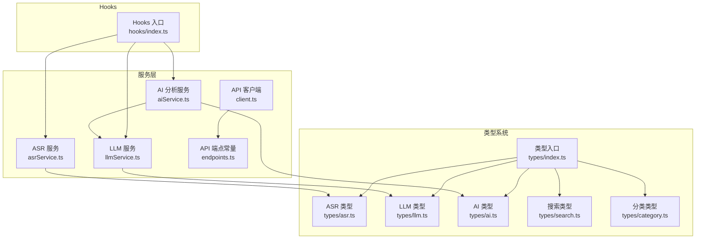
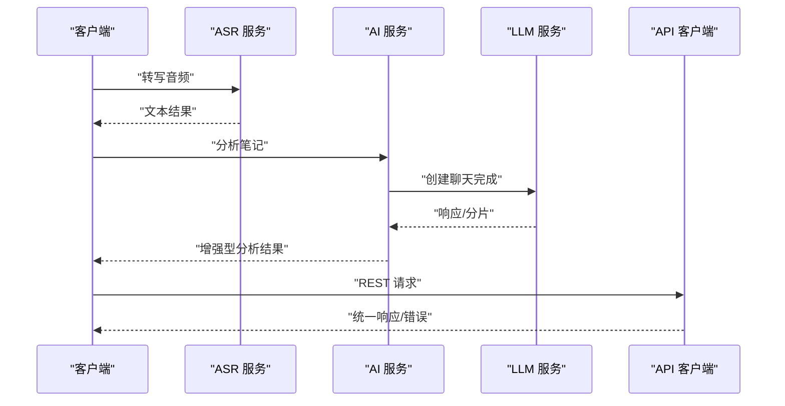
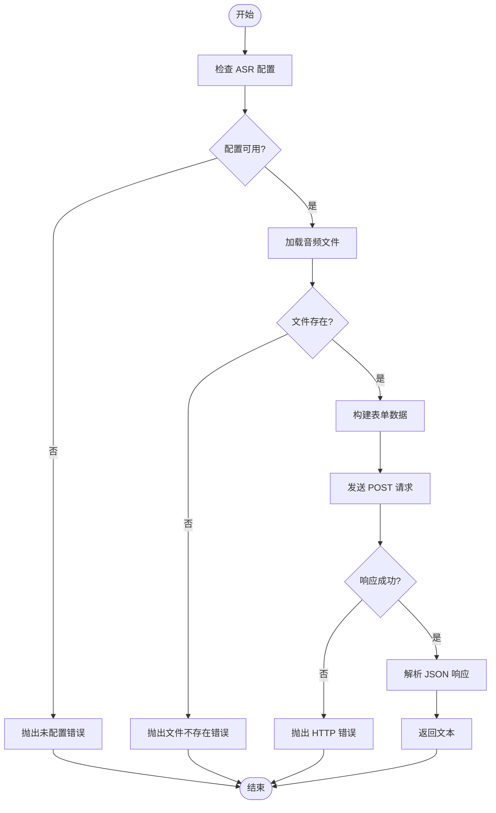
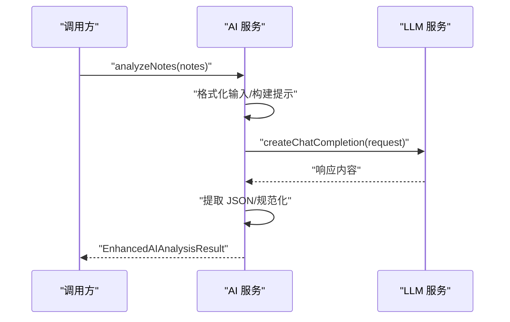
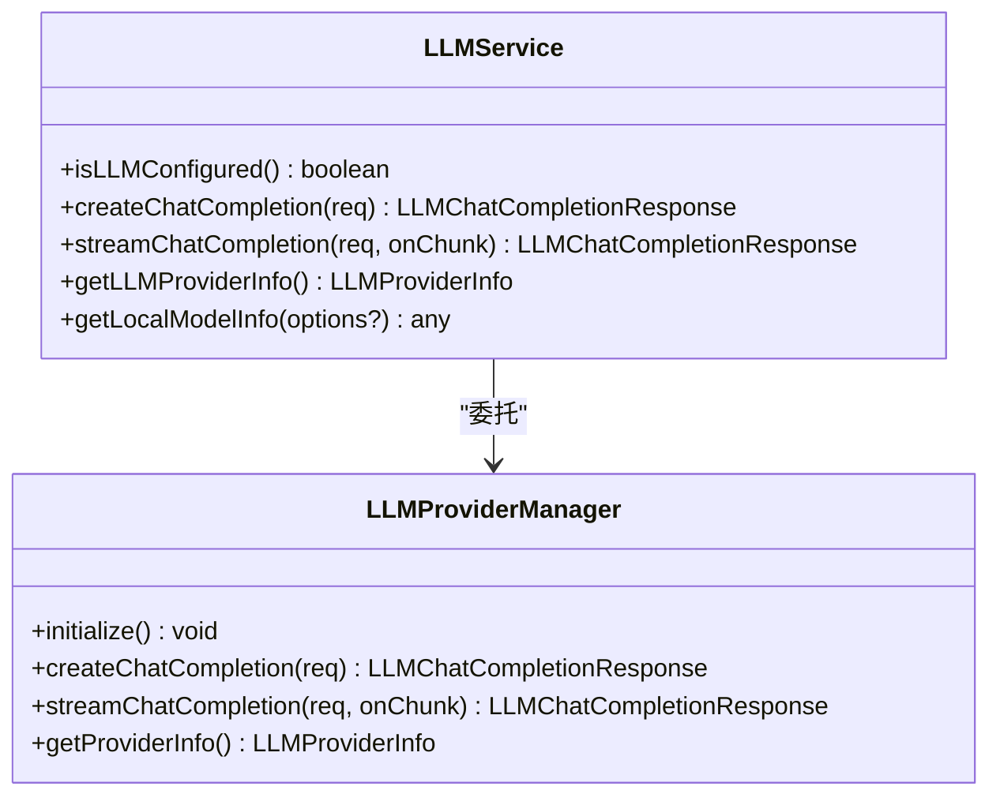
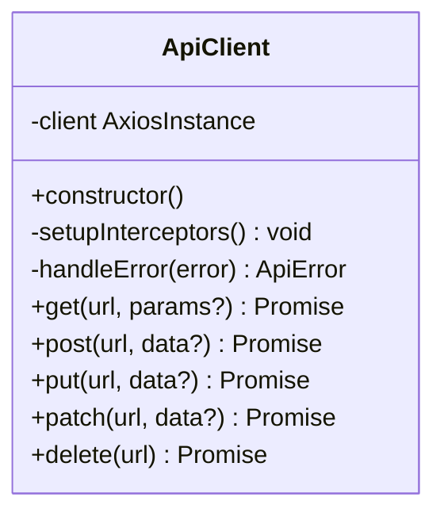
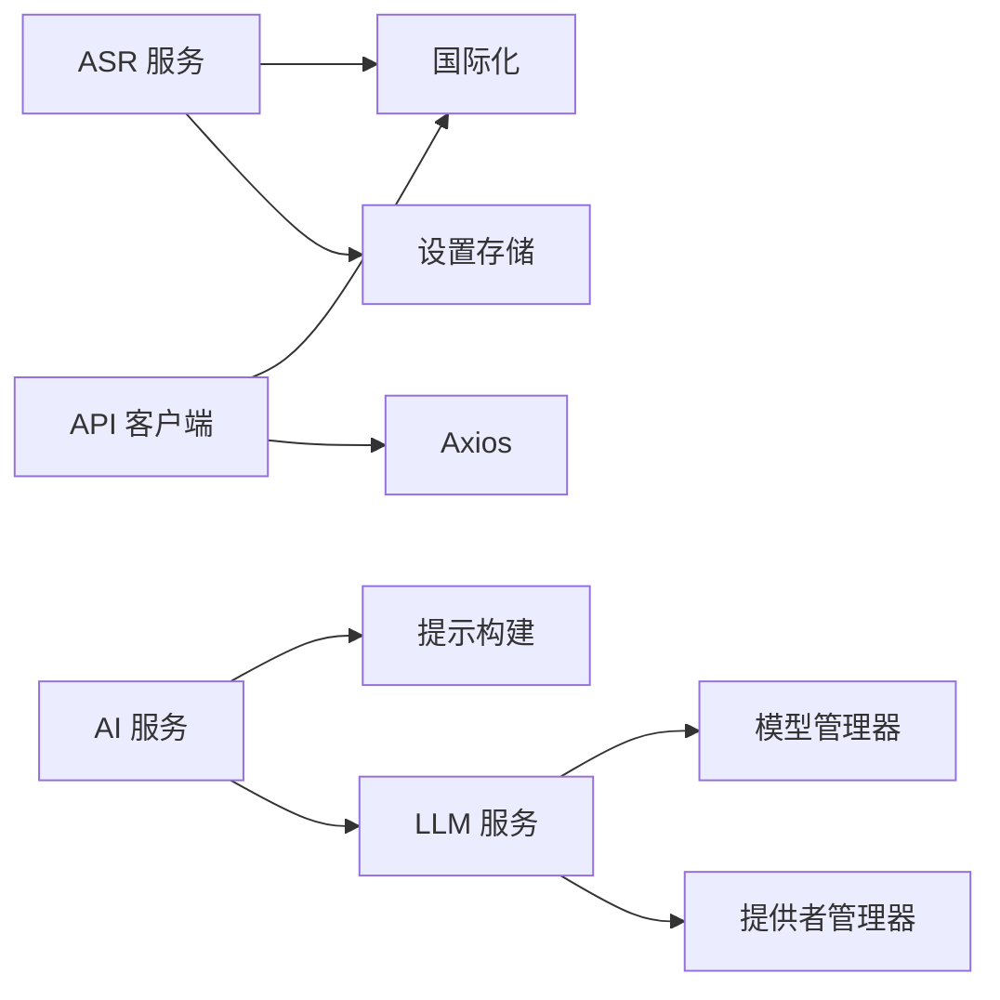

# API 参考文档

<cite>
**本文档引用的文件**
- [package.json](file://package.json)
- [tsconfig.json](file://tsconfig.json)
- [services/index.ts](file://services/index.ts)
- [types/index.ts](file://types/index.ts)
- [hooks/index.ts](file://hooks/index.ts)
- [services/asr/asrService.ts](file://services/asr/asrService.ts)
- [services/ai/aiService.ts](file://services/ai/aiService.ts)
- [services/api/client.ts](file://services/api/client.ts)
- [services/api/endpoints.ts](file://services/api/endpoints.ts)
- [services/llm/llmService.ts](file://services/llm/llmService.ts)
- [types/ai.ts](file://types/ai.ts)
- [types/asr.ts](file://types/asr.ts)
- [types/llm.ts](file://types/llm.ts)
- [types/category.ts](file://types/category.ts)
- [types/search.ts](file://types/search.ts)
</cite>

## 目录
1. [简介](#简介)
2. [项目结构](#项目结构)
3. [核心组件](#核心组件)
4. [架构总览](#架构总览)
5. [详细组件分析](#详细组件分析)
6. [依赖关系分析](#依赖关系分析)
7. [性能考虑](#性能考虑)
8. [故障排除指南](#故障排除指南)
9. [结论](#结论)
10. [附录](#附录)

## 简介
本文件为 VoiceNote 项目的 API 参考文档，覆盖服务层 API（ASR 服务、AI 服务、API 客户端）、类型系统与数据结构、Hook 函数接口、错误处理与异常类型，并提供第三方集成指南与版本兼容性建议。文档面向开发者与集成者，帮助快速理解并正确使用项目中的公共接口。

## 项目结构
项目采用基于功能模块的组织方式，核心模块包括：
- 服务层：ASR、AI、LLM、API 客户端、上传与媒体存储等
- 类型系统：统一导出的类型与数据模型
- Hooks：状态管理与业务逻辑封装
- 数据库与查询：通过 Drizzle ORM 管理本地与同步数据

图表来源
- [services/asr/asrService.ts:1-74](file://services/asr/asrService.ts#L1-L74)
- [services/ai/aiService.ts:1-163](file://services/ai/aiService.ts#L1-L163)
- [services/llm/llmService.ts:1-61](file://services/llm/llmService.ts#L1-L61)
- [services/api/client.ts:1-104](file://services/api/client.ts#L1-L104)
- [services/api/endpoints.ts:1-61](file://services/api/endpoints.ts#L1-L61)
- [types/index.ts:1-98](file://types/index.ts#L1-L98)
- [types/asr.ts:1-164](file://types/asr.ts#L1-L164)
- [types/llm.ts:1-93](file://types/llm.ts#L1-L93)
- [types/ai.ts:1-48](file://types/ai.ts#L1-L48)
- [types/search.ts:1-25](file://types/search.ts#L1-L25)
- [types/category.ts:1-17](file://types/category.ts#L1-L17)
- [hooks/index.ts:1-79](file://hooks/index.ts#L1-L79)

章节来源
- [services/index.ts:1-7](file://services/index.ts#L1-L7)
- [types/index.ts:1-98](file://types/index.ts#L1-L98)
- [hooks/index.ts:1-79](file://hooks/index.ts#L1-L79)

## 核心组件
本节概述服务层与类型系统的关键接口与职责。

- ASR 服务
  - 职责：音频转写、配置校验、超时控制、错误处理
  - 关键函数：配置检查、转写调用
  - 返回类型：字符串文本
  - 异常：未配置、文件不存在、网络错误、超时

- AI 服务
  - 职责：笔记分析、JSON 提取与规范化、响应标准化
  - 关键函数：分析、配置检查、JSON 规范化
  - 返回类型：增强型 AI 分析结果
  - 异常：空响应、解析失败、配置不完整

- LLM 服务
  - 职责：统一本地/云端大模型调用、流式输出、提供者信息查询
  - 关键函数：聊天完成、流式聊天、提供者信息、本地模型信息
  - 返回类型：聊天完成响应或分片
  - 异常：提供者未就绪、网络错误

- API 客户端
  - 职责：HTTP 请求封装、拦截器、错误映射
  - 关键方法：GET/POST/PUT/PATCH/DELETE
  - 返回类型：泛型响应
  - 异常：请求/响应错误映射为统一 ApiError

- 类型系统
  - 统一导出：通用响应、分页、用户、笔记、录音、媒体、同步状态
  - ASR 类型：提供者类型、语言、模型状态、流式事件、模型信息、结果、能力、信息
  - LLM 类型：提供者类型、角色、消息、请求/响应、分片
  - AI 类型：标签、洞察、行动项、元数据、源笔记、分析结果
  - 搜索与分类：搜索文档、结果、分组、分类分组与过滤

章节来源
- [services/asr/asrService.ts:1-74](file://services/asr/asrService.ts#L1-L74)
- [services/ai/aiService.ts:1-163](file://services/ai/aiService.ts#L1-L163)
- [services/llm/llmService.ts:1-61](file://services/llm/llmService.ts#L1-L61)
- [services/api/client.ts:1-104](file://services/api/client.ts#L1-L104)
- [types/index.ts:1-98](file://types/index.ts#L1-L98)
- [types/asr.ts:1-164](file://types/asr.ts#L1-L164)
- [types/llm.ts:1-93](file://types/llm.ts#L1-L93)
- [types/ai.ts:1-48](file://types/ai.ts#L1-L48)
- [types/search.ts:1-25](file://types/search.ts#L1-L25)
- [types/category.ts:1-17](file://types/category.ts#L1-L17)

## 架构总览
下图展示服务层之间的交互关系与数据流向：

图表来源
- [services/asr/asrService.ts:24-73](file://services/asr/asrService.ts#L24-L73)
- [services/ai/aiService.ts:126-162](file://services/ai/aiService.ts#L126-L162)
- [services/llm/llmService.ts:32-60](file://services/llm/llmService.ts#L32-L60)
- [services/api/client.ts:81-99](file://services/api/client.ts#L81-L99)

## 详细组件分析

### ASR 服务 API
- 配置检查
  - 函数：isASRConfigured()
  - 用途：验证 ASR 服务是否已配置
  - 返回：布尔值
  - 依赖：设置存储中的 ASR 配置与环境变量

- 转写音频
  - 函数：transcribeAudio(uri: string)
  - 参数：音频文件 URI
  - 返回：Promise<string> 文本
  - 行为：构造表单数据、发送 POST 请求、读取响应、超时控制
  - 错误：未配置、文件不存在、HTTP 错误、超时

图表来源
- [services/asr/asrService.ts:19-73](file://services/asr/asrService.ts#L19-L73)

章节来源
- [services/asr/asrService.ts:1-74](file://services/asr/asrService.ts#L1-L74)

### AI 服务 API
- 配置检查
  - 函数：isAIConfigured()
  - 用途：委托 LLM 配置检查
  - 返回：布尔值

- 分析笔记
  - 函数：analyzeNotes(notes: Note[])
  - 参数：笔记数组（含 id、内容、标题、时间等）
  - 返回：Promise<EnhancedAIAnalysisResult>
  - 行为：格式化输入、构建提示、调用 LLM、提取并规范化 JSON
  - 错误：空响应、解析失败、超时

- JSON 规范化
  - 函数：normalizeAIResponse(parsed)
  - 用途：将不同来源的 AI 输出规范化为统一结构
  - 输入：对象字面量
  - 输出：EnhancedAIAnalysisResult

图表来源
- [services/ai/aiService.ts:126-162](file://services/ai/aiService.ts#L126-L162)
- [services/llm/llmService.ts:32-37](file://services/llm/llmService.ts#L32-L37)

章节来源
- [services/ai/aiService.ts:1-163](file://services/ai/aiService.ts#L1-L163)

### LLM 服务 API
- 配置检查
  - 函数：isLLMConfigured()
  - 用途：根据提供者类型判断配置是否完整
  - 返回：布尔值

- 聊天完成
  - 函数：createChatCompletion(request)
  - 参数：LLMChatCompletionRequest
  - 返回：Promise<LLMChatCompletionResponse>

- 流式聊天
  - 函数：streamChatCompletion(request, onChunk)
  - 参数：请求与分片回调
  - 返回：Promise<LLMChatCompletionResponse>

- 提供者信息
  - 函数：getLLMProviderInfo()
  - 返回：Promise<LLMProviderInfo>

- 本地模型信息
  - 函数：getLocalModelInfo(options?)
  - 返回：Promise 本地模型信息

图表来源
- [services/llm/llmService.ts:1-61](file://services/llm/llmService.ts#L1-L61)

章节来源
- [services/llm/llmService.ts:1-61](file://services/llm/llmService.ts#L1-L61)

### API 客户端与端点
- 客户端
  - 类：ApiClient
  - 方法：get/post/put/patch/delete
  - 功能：基础 URL、超时、请求/响应拦截器、错误映射
  - 错误：ApiError（包含 message/code/status）

- 端点常量
  - 路由：认证、笔记、录音、媒体、同步、用户、分享
  - 支持动态 ID 的模板函数

图表来源
- [services/api/client.ts:1-104](file://services/api/client.ts#L1-L104)

章节来源
- [services/api/client.ts:1-104](file://services/api/client.ts#L1-L104)
- [services/api/endpoints.ts:1-61](file://services/api/endpoints.ts#L1-L61)

### 类型系统与数据结构
- 通用类型
  - ApiResponse<T>：统一响应包装
  - PaginatedResponse<T>：分页响应
  - User/Note/Recording/MediaFile：实体模型
  - SyncStatus：同步状态
  - MediaType/SyncAction/EntityType：枚举别名

- ASR 类型
  - ProviderType/Language/ModelArch/ModelStatus/ProviderStatus
  - StreamingEventType/StreamingEvent
  - ASRModel/ASRTranscriptionResult/ASRProviderCapabilities/ASRProviderInfo
  - CloudASRProvider/LocalASRProvider/ModelDownloadSource

- LLM 类型
  - LLMProviderType/LLMProviderStatus/LLMProviderCapabilities/LLMProviderInfo
  - LLMRole/LLMChatMessage/LLMChatCompletionRequest/Response/Chunk

- AI 类型
  - AITag/AIKeyInsight/AIActionItem/ AIMetadata/AISourceNote
  - EnhancedAIAnalysisResult/LegacyAIAnalysisResult

- 搜索与分类
  - SearchDocument/SearchResult/GroupedSearchResults
  - CategorizedGroup/CategoryFilter/PREDEFINED_COLORS

章节来源
- [types/index.ts:1-98](file://types/index.ts#L1-L98)
- [types/asr.ts:1-164](file://types/asr.ts#L1-L164)
- [types/llm.ts:1-93](file://types/llm.ts#L1-L93)
- [types/ai.ts:1-48](file://types/ai.ts#L1-L48)
- [types/search.ts:1-25](file://types/search.ts#L1-L25)
- [types/category.ts:1-17](file://types/category.ts#L1-L17)

### Hook 函数接口
- 媒体与录制
  - useAudioRecorder：录音状态与结果
  - useFilePicker/useFileUpload/useMediaStorage：文件选择、上传、存储状态
  - useAudioPlayback：音频播放

- 笔记与操作
  - useNotes/useNote/useCreateNote/useUpdateNote/useDeleteNote/useArchiveNotes/useMergeNotes：笔记 CRUD 与合并
  - useNoteActions/useBatchNoteActions：单个与批量操作
  - useNoteSelection/useNotePreview/useNoteMedia：选择、预览、媒体

- 搜索与灵感
  - useSearch/useSearchHistory：搜索与历史
  - useInspirations/useInspiration/useCreateInspiration/useDeleteInspiration：灵感管理

- ASR 与转录
  - useStreamingASR/useRecordingTranscription/useTranscription：流式转录、录音转录、转录优化

- 编辑与手势
  - useMarkdownEditor：Markdown 编辑动作
  - useSwipeGesture：拖拽区域

章节来源
- [hooks/index.ts:1-79](file://hooks/index.ts#L1-L79)

## 依赖关系分析
- 服务层依赖
  - ASR 依赖设置存储与国际化
  - AI 依赖 LLM 服务与提示构建
  - LLM 依赖提供者管理器与模型管理器
  - API 客户端依赖 Axios 与国际化

- 类型系统依赖
  - 所有服务共享 types/index.ts 中的通用类型
  - ASR/LLM/AI 类型分别在对应 types 文件中定义

图表来源
- [services/asr/asrService.ts:1-74](file://services/asr/asrService.ts#L1-L74)
- [services/ai/aiService.ts:1-163](file://services/ai/aiService.ts#L1-L163)
- [services/llm/llmService.ts:1-61](file://services/llm/llmService.ts#L1-L61)
- [services/api/client.ts:1-104](file://services/api/client.ts#L1-L104)

章节来源
- [services/asr/asrService.ts:1-74](file://services/asr/asrService.ts#L1-L74)
- [services/ai/aiService.ts:1-163](file://services/ai/aiService.ts#L1-L163)
- [services/llm/llmService.ts:1-61](file://services/llm/llmService.ts#L1-L61)
- [services/api/client.ts:1-104](file://services/api/client.ts#L1-L104)

## 性能考虑
- 超时与中断
  - ASR 转写默认超时 2 分钟；AI 分析默认超时 60 秒；均支持 AbortController 中断
- 流式处理
  - LLM 支持流式分片，适合实时显示与用户体验优化
- 并发与缓存
  - 建议在上层对重复请求进行去重与缓存策略
- 网络与离线
  - LLM 提供本地与云端两种模式，可根据网络状况切换

## 故障排除指南
- ASR 相关
  - 未配置：检查设置存储与环境变量
  - 文件不存在：确认文件路径与权限
  - 网络错误：检查 API 地址与密钥
  - 超时：调整超时阈值或优化网络

- AI 相关
  - 空响应：检查提示构建与模型配置
  - JSON 解析失败：确认模型输出格式与 JSON 包裹

- LLM 相关
  - 提供者未就绪：确保初始化完成
  - 流式错误：监听分片回调并处理异常

- API 客户端
  - 401：处理鉴权失效与刷新流程
  - 无服务器响应：检查网络连通性
  - 未知错误：查看错误码与消息

章节来源
- [services/asr/asrService.ts:24-73](file://services/asr/asrService.ts#L24-L73)
- [services/ai/aiService.ts:126-162](file://services/ai/aiService.ts#L126-L162)
- [services/llm/llmService.ts:18-30](file://services/llm/llmService.ts#L18-L30)
- [services/api/client.ts:44-75](file://services/api/client.ts#L44-L75)

## 结论
本参考文档梳理了 VoiceNote 的服务层 API、类型系统与 Hook 接口，明确了错误处理与性能注意事项。建议在集成时遵循统一的错误处理与配置检查流程，并根据场景选择合适的提供者模式（本地/云端）以获得最佳体验。

## 附录

### 环境变量与配置
- ASR
  - EXPO_PUBLIC_ASR_API_URL：ASR 服务地址
  - EXPO_PUBLIC_ASR_API_KEY：ASR 服务密钥

- AI/LLM
  - EXPO_PUBLIC_AI_API_URL：AI 服务地址
  - EXPO_PUBLIC_AI_API_KEY：AI 服务密钥
  - EXPO_PUBLIC_AI_MODEL：默认模型
  - EXPO_PUBLIC_AI_PROVIDER：提供者类型（local/cloud）
  - EXPO_PUBLIC_AI_LOCAL_MODEL_PATH：本地模型路径

- API
  - EXPO_PUBLIC_API_BASE_URL：API 基础地址

章节来源
- [services/asr/asrService.ts:11-17](file://services/asr/asrService.ts#L11-L17)
- [services/ai/aiService.ts:21-28](file://services/ai/aiService.ts#L21-L28)
- [services/llm/llmService.ts:18-29](file://services/llm/llmService.ts#L18-L29)
- [services/api/client.ts:4-4](file://services/api/client.ts#L4-L4)

### 第三方集成指南
- 集成步骤
  - 初始化设置存储与环境变量
  - 调用 isLLMConfigured()/isAIConfigured()/isASRConfigured() 进行配置检查
  - 使用相应服务函数执行业务操作
  - 使用统一错误处理与国际化消息

- 最佳实践
  - 对长耗时操作添加超时与中断机制
  - 使用流式接口提升交互体验
  - 对重复请求进行去重与缓存

### API 版本兼容性与迁移
- 类型别名与重导出
  - AI 服务重导出 LegacyAIAnalysisResult 以保持向后兼容
- 枚举与联合类型的演进
  - 新增枚举值时建议保留旧值并在文档中标注废弃状态
- 配置迁移
  - 提供者类型与模型架构的变更需在设置存储中进行迁移处理

章节来源
- [services/ai/aiService.ts:14-15](file://services/ai/aiService.ts#L14-L15)
- [types/asr.ts:37-42](file://types/asr.ts#L37-L42)