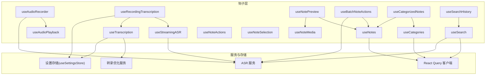
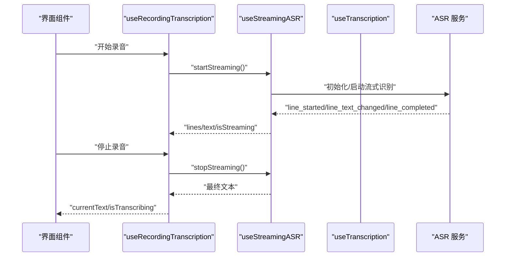
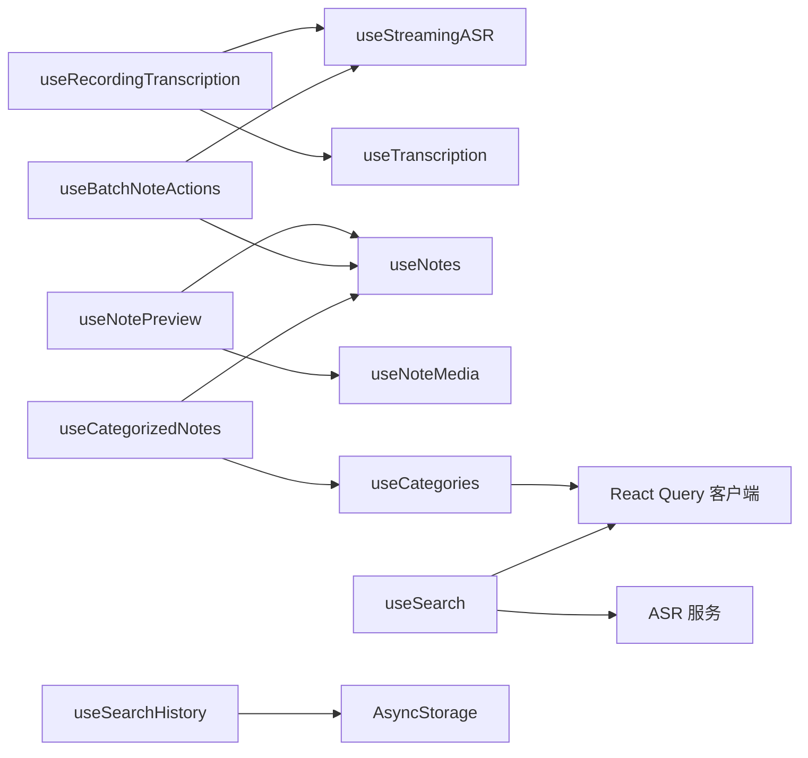

# Hook 函数接口

<cite>
**本文引用的文件**
- [hooks/index.ts](file://hooks/index.ts)
- [useAudioPlayback.ts](file://hooks/useAudioPlayback.ts)
- [useAudioRecorder.ts](file://hooks/useAudioRecorder.ts)
- [useCategories.ts](file://hooks/useCategories.ts)
- [useCategorizedNotes.ts](file://hooks/useCategorizedNotes.ts)
- [useNotes.ts](file://hooks/useNotes.ts)
- [useSearch.ts](file://hooks/useSearch.ts)
- [useSearchHistory.ts](file://hooks/useSearchHistory.ts)
- [useTranscription.ts](file://hooks/useTranscription.ts)
- [useStreamingASR.ts](file://hooks/useStreamingASR.ts)
- [useRecordingTranscription.ts](file://hooks/useRecordingTranscription.ts)
- [useBatchNoteActions.ts](file://hooks/useBatchNoteActions.ts)
- [useNoteActions.ts](file://hooks/useNoteActions.ts)
- [useNoteSelection.ts](file://hooks/useNoteSelection.ts)
- [useNotePreview.ts](file://hooks/useNotePreview.ts)
- [useNoteMedia.ts](file://hooks/useNoteMedia.ts)
</cite>

## 目录
1. [简介](#简介)
2. [项目结构](#项目结构)
3. [核心组件](#核心组件)
4. [架构总览](#架构总览)
5. [详细组件分析](#详细组件分析)
6. [依赖分析](#依赖分析)
7. [性能考量](#性能考量)
8. [故障排查指南](#故障排查指南)
9. [结论](#结论)
10. [附录：Hook 使用模式与最佳实践](#附录hook-使用模式与最佳实践)

## 简介
本文件系统性梳理 VoiceNote 项目的自定义 Hook 接口，覆盖音频处理、笔记管理、分类管理、搜索与检索、批处理与动作、媒体管理等模块。文档从接口定义、参数与返回值、使用场景、状态更新机制、依赖关系、性能与错误处理等方面进行说明，并提供 Hook 组合使用的示例与最佳实践。

## 项目结构
- 钩子集中导出入口位于 hooks/index.ts，统一暴露各模块 Hook 及其类型别名，便于上层组件按需引入。
- 音频相关：录音（useAudioRecorder）、播放（useAudioPlayback）、流式识别（useStreamingASR）、录音转写（useRecordingTranscription）、离线转写（useTranscription）。
- 笔记相关：查询与变更（useNotes）、预览与自动保存（useNotePreview）、媒体附件（useNoteMedia）、单条动作（useNoteActions）、批量操作（useBatchNoteActions）、选择态（useNoteSelection）。
- 分类相关：查询与变更（useCategories）、分组展示（useCategorizedNotes）。
- 搜索相关：全文检索（useSearch）、搜索历史（useSearchHistory）。

图表来源
- [hooks/index.ts:1-79](file://hooks/index.ts#L1-L79)
- [useAudioRecorder.ts:1-270](file://hooks/useAudioRecorder.ts#L1-L270)
- [useAudioPlayback.ts:1-90](file://hooks/useAudioPlayback.ts#L1-L90)
- [useStreamingASR.ts:1-269](file://hooks/useStreamingASR.ts#L1-L269)
- [useTranscription.ts:1-104](file://hooks/useTranscription.ts#L1-L104)
- [useRecordingTranscription.ts:1-199](file://hooks/useRecordingTranscription.ts#L1-L199)
- [useNotes.ts:1-217](file://hooks/useNotes.ts#L1-L217)
- [useNotePreview.ts:1-132](file://hooks/useNotePreview.ts#L1-L132)
- [useNoteMedia.ts:1-75](file://hooks/useNoteMedia.ts#L1-L75)
- [useBatchNoteActions.ts:1-287](file://hooks/useBatchNoteActions.ts#L1-L287)
- [useCategories.ts:1-94](file://hooks/useCategories.ts#L1-L94)
- [useCategorizedNotes.ts:1-53](file://hooks/useCategorizedNotes.ts#L1-L53)
- [useSearch.ts:1-84](file://hooks/useSearch.ts#L1-L84)
- [useSearchHistory.ts:1-53](file://hooks/useSearchHistory.ts#L1-L53)

章节来源
- [hooks/index.ts:1-79](file://hooks/index.ts#L1-L79)

## 核心组件
- 音频处理 Hook
  - useAudioRecorder：录音生命周期、权限请求、播放控制、文件信息读取。
  - useAudioPlayback：播放器装载/播放/暂停/停止/跳转、自动加载与播放策略。
  - useStreamingASR：本地流式识别，事件驱动的状态更新与错误处理。
  - useTranscription：文件型转写与自动优化，支持重试与文本模式切换。
  - useRecordingTranscription：统一录音转写入口，自动在流式与文件型之间路由。
- 笔记管理 Hook
  - useNotes：笔记列表/详情查询、创建、更新（乐观更新）、删除、归档、合并。
  - useNotePreview：笔记内容与标题的双向同步、防抖自动保存、媒体加载刷新。
  - useNoteMedia：图片/文档选择、上传与数据库记录、删除与回弹。
  - useNoteActions：归档/删除确认对话框、分享封装。
  - useBatchNoteActions：批量归档/合并/AI 分析/分类，带确认与预览。
  - useNoteSelection：全局选择态存储的读取与操作。
- 分类管理 Hook
  - useCategories：分类 CRUD、排序、批量分配/移除笔记。
  - useCategorizedNotes：基于笔记的分类 ID 列表进行分组展示。
- 搜索 Hook
  - useSearch：全文检索、标签过滤、结果分组、防抖与索引构建。
  - useSearchHistory：本地历史持久化与交互。

章节来源
- [useAudioRecorder.ts:1-270](file://hooks/useAudioRecorder.ts#L1-L270)
- [useAudioPlayback.ts:1-90](file://hooks/useAudioPlayback.ts#L1-L90)
- [useStreamingASR.ts:1-269](file://hooks/useStreamingASR.ts#L1-L269)
- [useTranscription.ts:1-104](file://hooks/useTranscription.ts#L1-L104)
- [useRecordingTranscription.ts:1-199](file://hooks/useRecordingTranscription.ts#L1-L199)
- [useNotes.ts:1-217](file://hooks/useNotes.ts#L1-L217)
- [useNotePreview.ts:1-132](file://hooks/useNotePreview.ts#L1-L132)
- [useNoteMedia.ts:1-75](file://hooks/useNoteMedia.ts#L1-L75)
- [useNoteActions.ts:1-80](file://hooks/useNoteActions.ts#L1-L80)
- [useBatchNoteActions.ts:1-287](file://hooks/useBatchNoteActions.ts#L1-L287)
- [useNoteSelection.ts:1-20](file://hooks/useNoteSelection.ts#L1-L20)
- [useCategories.ts:1-94](file://hooks/useCategories.ts#L1-L94)
- [useCategorizedNotes.ts:1-53](file://hooks/useCategorizedNotes.ts#L1-L53)
- [useSearch.ts:1-84](file://hooks/useSearch.ts#L1-L84)
- [useSearchHistory.ts:1-53](file://hooks/useSearchHistory.ts#L1-L53)

## 架构总览
- 数据流
  - 查询：React Query 提供查询键与缓存失效策略，确保 UI 与数据一致。
  - 更新：useNotes 支持乐观更新与回滚；useNotePreview 采用防抖保存。
  - 转写：useRecordingTranscription 在本地与云端之间自动切换；useTranscription 提供优化链路。
- 事件与订阅
  - useStreamingASR 基于 Provider 订阅事件，实时更新行级文本与最终结果。
- 存储与权限
  - useAudioRecorder 请求录音权限并在 iOS 上切换音频模式以保证播放可用。
  - useNoteMedia 通过媒体存储服务与数据库双写，确保一致性。

图表来源
- [useRecordingTranscription.ts:74-199](file://hooks/useRecordingTranscription.ts#L74-L199)
- [useStreamingASR.ts:67-269](file://hooks/useStreamingASR.ts#L67-L269)

## 详细组件分析

### 音频处理 Hook

#### useAudioRecorder
- 参数与返回
  - 返回当前录音状态（是否录制/暂停、时长、URI）与播放状态（播放中、位置、时长）。
  - 提供权限请求、开始/暂停/恢复/停止/取消录音、加载/播放/暂停/停止/跳转到指定位置等方法。
- 使用场景
  - 录音页面、语音笔记录制、边录边播预览。
- 状态更新机制
  - 基于 expo-audio 的录音状态与播放器状态，定时轮询播放进度。
- 性能与错误
  - 录制前请求权限，iOS 切换录音模式；停止后释放录音模式，避免播放冲突。
  - 错误捕获并抛出，调用方负责提示或降级。

章节来源
- [useAudioRecorder.ts:26-270](file://hooks/useAudioRecorder.ts#L26-L270)

#### useAudioPlayback
- 参数与返回
  - 返回播放状态（播放中、位置、时长）与加载/播放/暂停/停止/跳转/卸载方法。
- 使用场景
  - 播放已保存音频、预览录音、跨页面复用播放器。
- 状态更新机制
  - 当源变更且加载完成时自动播放；支持相同源时直接 seekTo(0) 再播放。
- 性能与错误
  - 异常静默处理，避免中断 UI；pendingPlay 防止竞态。

章节来源
- [useAudioPlayback.ts:4-90](file://hooks/useAudioPlayback.ts#L4-L90)

#### useStreamingASR
- 参数与返回
  - 返回流式文本行数组、合并文本、是否正在流式、是否就绪、错误、开始/停止/重置方法与 Provider 名称。
- 使用场景
  - 本地实时转写，如 Moonshine Provider。
- 状态更新机制
  - 订阅 Provider 事件，维护行级文本与最终行；错误时停止流式。
- 性能与错误
  - 单例 Provider 实例，避免重复初始化；ready 检测失败时记录错误。

章节来源
- [useStreamingASR.ts:67-269](file://hooks/useStreamingASR.ts#L67-L269)

#### useTranscription
- 参数与返回
  - 返回原始/优化文本、是否转写/优化中、错误、转写/重试/重置方法、文本模式切换。
- 使用场景
  - 云端/本地模型的文件型转写与自动优化。
- 状态更新机制
  - 调用转写服务后自动触发优化；失败时回退到原始文本。
- 性能与错误
  - 优化配置来自设置存储；错误统一国际化消息。

章节来源
- [useTranscription.ts:22-104](file://hooks/useTranscription.ts#L22-L104)

#### useRecordingTranscription
- 参数与返回
  - 返回是否流式模式、当前文本、是否转写中/就绪、错误、开始/停止/重置、重试、优化相关字段。
- 使用场景
  - 统一录音转写入口，自动根据 ASR 配置在流式与文件型间切换。
- 状态更新机制
  - 流式模式下使用 streaming.text 或停止后的结果；文件型模式使用 fileBased.currentText。
- 性能与错误
  - 通过稳定引用复用 reset 方法，避免依赖变化导致的重新渲染。

章节来源
- [useRecordingTranscription.ts:74-199](file://hooks/useRecordingTranscription.ts#L74-L199)

### 笔记管理 Hook

#### useNotes
- 参数与返回
  - 列表/详情查询、创建、更新（乐观更新+回滚）、删除、批量归档、合并笔记。
- 使用场景
  - 笔记列表页、详情页、编辑页。
- 状态更新机制
  - React Query 缓存键管理；乐观更新先写入缓存再回滚；成功后失效列表与详情查询。
- 性能与错误
  - 合并逻辑去重标签、汇总音频时长；错误时回滚缓存。

章节来源
- [useNotes.ts:6-217](file://hooks/useNotes.ts#L6-L217)

#### useNotePreview
- 参数与返回
  - 内容/标题、保存状态、脏标记、录音与媒体列表、加载媒体状态、刷新媒体方法。
- 使用场景
  - 笔记编辑预览页，支持自动保存与媒体关联。
- 状态更新机制
  - 防抖 500ms 保存；noteId 变化时清空状态；加载媒体并异步刷新。
- 性能与错误
  - 清理定时器；保存错误时置为 error 状态。

章节来源
- [useNotePreview.ts:12-132](file://hooks/useNotePreview.ts#L12-L132)

#### useNoteMedia
- 参数与返回
  - 图片库/文档库选择、保存媒体、删除媒体。
- 使用场景
  - 笔记媒体附件添加与删除。
- 状态更新机制
  - 保存到媒体存储并写入数据库；删除时同步清理存储与记录。
- 性能与错误
  - 多选批量处理；删除前触发声反馈。

章节来源
- [useNoteMedia.ts:14-75](file://hooks/useNoteMedia.ts#L14-L75)

#### useNoteActions
- 参数与返回
  - 对话框可见性、待执行动作、分享、归档/删除点击、执行/取消。
- 使用场景
  - 单条笔记操作确认。
- 状态更新机制
  - 点击后暂存动作与目标 ID，确认后回调外部处理。
- 性能与错误
  - 分享失败静默处理。

章节来源
- [useNoteActions.ts:21-80](file://hooks/useNoteActions.ts#L21-L80)

#### useBatchNoteActions
- 参数与返回
  - 批量归档/合并/AI 分析/分类流程控制，确认对话框、合并预览、AI 结果 UI 状态。
- 使用场景
  - 列表多选后的批量处理。
- 状态更新机制
  - 通过 mutations 触发缓存失效；AI 分析结果保存为灵感。
- 性能与错误
  - 严格检查 AI 配置；错误时 UI 展示并允许重试。

章节来源
- [useBatchNoteActions.ts:55-287](file://hooks/useBatchNoteActions.ts#L55-L287)

#### useNoteSelection
- 参数与返回
  - 已选笔记 ID 数组、切换/全选/清空、是否已选、计数。
- 使用场景
  - 列表页多选态共享。
- 状态更新机制
  - 从全局选择存储读取与写入。
- 性能与错误
  - 无错误路径，仅状态读取。

章节来源
- [useNoteSelection.ts:3-20](file://hooks/useNoteSelection.ts#L3-L20)

### 分类管理 Hook

#### useCategories
- 参数与返回
  - 分类列表/详情查询、创建、更新、删除、排序、批量分配/移除笔记。
- 使用场景
  - 分类管理与笔记分类绑定。
- 状态更新机制
  - 删除/排序后失效分类与笔记列表缓存。
- 性能与错误
  - 成功回调统一失效查询键。

章节来源
- [useCategories.ts:14-94](file://hooks/useCategories.ts#L14-L94)

#### useCategorizedNotes
- 参数与返回
  - 将笔记按分类 ID 分组，未分类单独一组。
- 使用场景
  - 分类视图与筛选。
- 状态更新机制
  - 基于 memo 化计算，输入变更时重建分组。
- 性能与错误
  - JSON 解析异常时返回空数组。

章节来源
- [useCategorizedNotes.ts:15-53](file://hooks/useCategorizedNotes.ts#L15-L53)

### 搜索 Hook

#### useSearch
- 参数与返回
  - 查询词、结果、是否搜索中、索引是否就绪、标签过滤、清空搜索与标签。
- 使用场景
  - 全文搜索与标签筛选。
- 状态更新机制
  - 首次加载笔记时建立索引；防抖执行搜索；结果按查询分组。
- 性能与错误
  - 索引构建与标签提取在就绪后进行；空查询清空结果。

章节来源
- [useSearch.ts:11-84](file://hooks/useSearch.ts#L11-L84)

#### useSearchHistory
- 参数与返回
  - 历史列表、添加/移除/清空。
- 使用场景
  - 搜索历史持久化与交互。
- 状态更新机制
  - AsyncStorage 存储；去重与上限控制。
- 性能与错误
  - 解析失败静默忽略。

章节来源
- [useSearchHistory.ts:7-53](file://hooks/useSearchHistory.ts#L7-L53)

## 依赖分析
- 组件耦合
  - useRecordingTranscription 依赖 useStreamingASR 与 useTranscription，形成“统一入口”。
  - useNotes 与 useCategories 通过 React Query 客户端共享缓存键，保证一致性。
  - useNotePreview 依赖 useNotes 与 useNoteMedia，形成“预览-媒体-笔记”的闭环。
- 外部依赖
  - ASR 服务（本地 Moonshine 与云端 Provider）、转录优化服务、React Query、AsyncStorage。
- 循环依赖
  - 未发现循环依赖；Hook 间通过组合与参数传递解耦。

图表来源
- [useRecordingTranscription.ts:74-199](file://hooks/useRecordingTranscription.ts#L74-L199)
- [useStreamingASR.ts:67-269](file://hooks/useStreamingASR.ts#L67-L269)
- [useTranscription.ts:22-104](file://hooks/useTranscription.ts#L22-L104)
- [useNotePreview.ts:12-132](file://hooks/useNotePreview.ts#L12-L132)
- [useBatchNoteActions.ts:55-287](file://hooks/useBatchNoteActions.ts#L55-L287)
- [useCategories.ts:14-94](file://hooks/useCategories.ts#L14-L94)
- [useCategorizedNotes.ts:15-53](file://hooks/useCategorizedNotes.ts#L15-L53)
- [useSearch.ts:11-84](file://hooks/useSearch.ts#L11-L84)
- [useSearchHistory.ts:7-53](file://hooks/useSearchHistory.ts#L7-L53)

## 性能考量
- 防抖与节流
  - useNotePreview 自动保存防抖 500ms；useSearch 搜索防抖默认 200ms。
- 缓存与失效
  - useNotes 使用 React Query 乐观更新与 onSettled 失效；useCategories 删除后同时失效笔记列表。
- 订阅与清理
  - useStreamingASR 订阅事件需在卸载时取消；useNotePreview 清理定时器。
- 资源释放
  - useAudioRecorder 停止录音后关闭录音模式；useAudioPlayback 卸载时清空源。

## 故障排查指南
- 录音权限被拒
  - useAudioRecorder 在启动录音前请求权限，失败时抛出错误；请引导用户授权。
- 流式识别不可用
  - useStreamingASR 初始化失败或模型未就绪时会设置 error 并置非就绪；检查 ASR 配置与模型下载。
- 转写失败
  - useTranscription 与 useRecordingTranscription 捕获错误并返回空文本；查看错误消息并重试。
- 合并笔记无有效数据
  - useNotes 合并逻辑对空结果抛错；检查输入 ID 是否存在且可读。
- 媒体保存/删除异常
  - useNoteMedia 删除前触发声反馈，若失败检查存储 URI 与数据库记录一致性。

章节来源
- [useAudioRecorder.ts:74-109](file://hooks/useAudioRecorder.ts#L74-L109)
- [useStreamingASR.ts:80-94](file://hooks/useStreamingASR.ts#L80-L94)
- [useTranscription.ts:58-65](file://hooks/useTranscription.ts#L58-L65)
- [useNotes.ts:165-167](file://hooks/useNotes.ts#L165-L167)
- [useNoteMedia.ts:62-67](file://hooks/useNoteMedia.ts#L62-L67)

## 结论
本项目通过一组职责清晰的 Hook 实现了从音频采集与转写、笔记增删改查、分类管理到全文检索与历史管理的完整能力。Hook 之间通过参数与组合实现低耦合高内聚，配合 React Query 的缓存与失效机制，保障了良好的用户体验与开发效率。建议在复杂页面中优先组合 useRecordingTranscription、useNotePreview、useNoteMedia 与 useBatchNoteActions，以获得一致的交互与性能表现。

## 附录：Hook 使用模式与最佳实践
- 录音与转写
  - 在录音开始时调用统一入口的开始方法；录音结束时停止并获取最终文本；本地模式优先使用流式结果，云端模式使用文件型转写。
- 笔记编辑
  - 使用 useNotePreview 进行内容与标题的双向绑定；在输入变更时自动保存；需要媒体时使用 useNoteMedia 添加/删除。
- 批量操作
  - 使用 useNoteSelection 获取选中集合；结合 useBatchNoteActions 执行归档/合并/AI 分析/分类；注意确认对话框与预览。
- 分类与展示
  - 使用 useCategories 获取分类列表；用 useCategorizedNotes 将笔记按分类分组展示；支持未分类分组。
- 搜索与历史
  - useSearch 建议在笔记列表加载完成后使用；useSearchHistory 提供本地历史持久化；结合标签过滤提升检索体验。