# 服务 API 接口

<cite>
**本文档引用的文件**
- [services/index.ts](file://services/index.ts)
- [services/asr/asrService.ts](file://services/asr/asrService.ts)
- [services/asr/providers/ASRProviderManager.ts](file://services/asr/providers/ASRProviderManager.ts)
- [services/asr/modelManager/BundledModels.ts](file://services/asr/modelManager/BundledModels.ts)
- [services/ai/aiService.ts](file://services/ai/aiService.ts)
- [services/llm/llmService.ts](file://services/llm/llmService.ts)
- [services/llm/providers/LLMProviderManager.ts](file://services/llm/providers/LLMProviderManager.ts)
- [services/llm/modelManager.ts](file://services/llm/modelManager.ts)
- [services/api/client.ts](file://services/api/client.ts)
- [services/api/endpoints.ts](file://services/api/endpoints.ts)
- [services/api/queries.ts](file://services/api/queries.ts)
- [services/transcription/transcriptionOptimizationService.ts](file://services/transcription/transcriptionOptimizationService.ts)
- [types/asr.ts](file://types/asr.ts)
- [types/llm.ts](file://types/llm.ts)
- [types/ai.ts](file://types/ai.ts)
</cite>

## 目录
1. [简介](#简介)
2. [项目结构](#项目结构)
3. [核心组件](#核心组件)
4. [架构总览](#架构总览)
5. [详细组件分析](#详细组件分析)
6. [依赖关系分析](#依赖关系分析)
7. [性能考量](#性能考量)
8. [故障排查指南](#故障排查指南)
9. [结论](#结论)
10. [附录](#附录)

## 简介
本文件为 VoiceNote 项目的“服务 API 接口”文档，聚焦以下服务层能力：
- ASR 语音转写服务：支持本地 Moonshine 与云端 SenseVoice 提供商，提供文件转写与流式转写能力。
- AI 分析服务：基于 LLM 对多条笔记进行结构化洞察与行动项提取。
- LLM 大语言模型服务：统一本地（llama.cpp）与云端（OpenAI 兼容）提供商的聊天补全与流式输出。
- API 客户端与查询封装：基于 axios 的通用客户端与 React Query 查询/变更封装。

文档将系统性说明各服务的公共方法、参数类型、返回值结构、错误处理机制，并给出接口调用示例与最佳实践；同时解释服务间依赖关系、数据流转、异步处理与状态管理策略，以及面向第三方集成的接口规范与使用指南。

## 项目结构
服务层主要位于 services 目录，按功能域划分：
- asr：ASR 语音转写，含提供商管理、模型管理与服务封装。
- llm：LLM 统一接口，含提供商管理与模型路径解析。
- ai：AI 分析服务，整合 LLM 进行笔记分析。
- api：HTTP 客户端、端点常量与 React Query 查询封装。
- transcription：转写优化服务，结合规则清理与 LLM 优化。
- types：跨服务共享的类型定义（ASR、LLM、AI）。

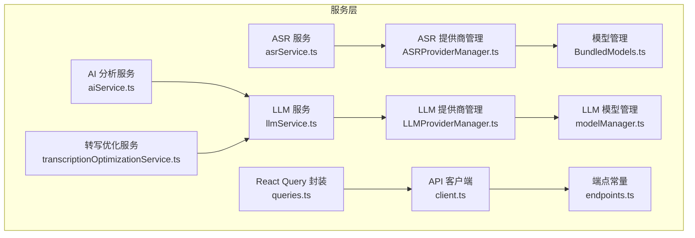

图表来源
- [services/asr/asrService.ts:1-74](file://services/asr/asrService.ts#L1-L74)
- [services/asr/providers/ASRProviderManager.ts:1-263](file://services/asr/providers/ASRProviderManager.ts#L1-L263)
- [services/asr/modelManager/BundledModels.ts:1-258](file://services/asr/modelManager/BundledModels.ts#L1-L258)
- [services/llm/llmService.ts:1-61](file://services/llm/llmService.ts#L1-L61)
- [services/llm/providers/LLMProviderManager.ts:1-164](file://services/llm/providers/LLMProviderManager.ts#L1-L164)
- [services/llm/modelManager.ts:1-196](file://services/llm/modelManager.ts#L1-L196)
- [services/ai/aiService.ts:1-163](file://services/ai/aiService.ts#L1-L163)
- [services/transcription/transcriptionOptimizationService.ts:1-88](file://services/transcription/transcriptionOptimizationService.ts#L1-L88)
- [services/api/client.ts:1-104](file://services/api/client.ts#L1-L104)
- [services/api/endpoints.ts:1-61](file://services/api/endpoints.ts#L1-L61)
- [services/api/queries.ts:1-100](file://services/api/queries.ts#L1-L100)

章节来源
- [services/index.ts:1-7](file://services/index.ts#L1-L7)
- [services/asr/asrService.ts:1-74](file://services/asr/asrService.ts#L1-L74)
- [services/llm/llmService.ts:1-61](file://services/llm/llmService.ts#L1-L61)
- [services/ai/aiService.ts:1-163](file://services/ai/aiService.ts#L1-L163)
- [services/api/client.ts:1-104](file://services/api/client.ts#L1-L104)
- [services/api/endpoints.ts:1-61](file://services/api/endpoints.ts#L1-L61)
- [services/api/queries.ts:1-100](file://services/api/queries.ts#L1-L100)

## 核心组件
本节概述各服务的关键职责与对外 API。

- ASR 语音转写服务
  - 文件转写：接收音频文件 URI，上传至配置的 ASR API 并返回文本。
  - 配置检查：验证 ASR API 地址与密钥是否就绪。
  - 超时控制：内置超时保护，避免长时间阻塞。
  - 错误处理：网络错误、鉴权失败、超时等均抛出可本地化的错误信息。

- ASR 提供商管理
  - 单例管理器，负责注册与选择当前提供商（本地 Moonshine 或云端 SenseVoice）。
  - 支持初始化、切换、状态查询与释放。
  - 流式/非流式提供商区分，提供能力描述与错误状态。

- 模型管理（ASR）
  - 打包模型提取：在应用启动时从资源中解压默认模型到文档目录，支持多次尝试去重。
  - 可用性检测：快速检查打包模型是否存在。

- LLM 服务
  - 统一聊天补全与流式输出接口，内部委派给提供商管理器。
  - 配置检查：根据设置或环境变量判断本地或云端提供商可用。
  - 本地模型路径解析：定位 GGUF 模型文件，支持固定文件名回退与目录扫描。

- LLM 提供商管理
  - 注册本地（llama.cpp）与云端（OpenAI 兼容）提供商。
  - 选择首选提供商，确保初始化完成且可用，否则抛出明确错误。
  - 提供能力与状态查询，便于 UI 展示与降级策略。

- AI 分析服务
  - 输入：多条笔记（标题、内容、时间、标签等）。
  - 输出：结构化分析结果（摘要、标签、关键洞察、行动项、元数据）。
  - 内部：构建系统提示与用户提示，调用 LLM 获取 JSON 结果并进行规范化。

- 转写优化服务
  - 规则清理：基于语言检测与填充词正则，移除无意义停顿与修正标点空格。
  - LLM 优化：对中度及以上级别，调用 LLM 进行语义优化。
  - 超时与降级：超时或错误时回退到规则清理版本。

- API 客户端与查询
  - 客户端：基于 axios，统一请求/响应拦截与错误映射。
  - 端点常量：集中管理 REST API 路由模板。
  - 查询封装：基于 React Query 的查询键、读取、创建、更新、删除与失效策略。

章节来源
- [services/asr/asrService.ts:1-74](file://services/asr/asrService.ts#L1-L74)
- [services/asr/providers/ASRProviderManager.ts:1-263](file://services/asr/providers/ASRProviderManager.ts#L1-L263)
- [services/asr/modelManager/BundledModels.ts:1-258](file://services/asr/modelManager/BundledModels.ts#L1-L258)
- [services/llm/llmService.ts:1-61](file://services/llm/llmService.ts#L1-L61)
- [services/llm/providers/LLMProviderManager.ts:1-164](file://services/llm/providers/LLMProviderManager.ts#L1-L164)
- [services/llm/modelManager.ts:1-196](file://services/llm/modelManager.ts#L1-L196)
- [services/ai/aiService.ts:1-163](file://services/ai/aiService.ts#L1-L163)
- [services/transcription/transcriptionOptimizationService.ts:1-88](file://services/transcription/transcriptionOptimizationService.ts#L1-L88)
- [services/api/client.ts:1-104](file://services/api/client.ts#L1-L104)
- [services/api/endpoints.ts:1-61](file://services/api/endpoints.ts#L1-L61)
- [services/api/queries.ts:1-100](file://services/api/queries.ts#L1-L100)

## 架构总览
下图展示服务层之间的交互关系与数据流向：

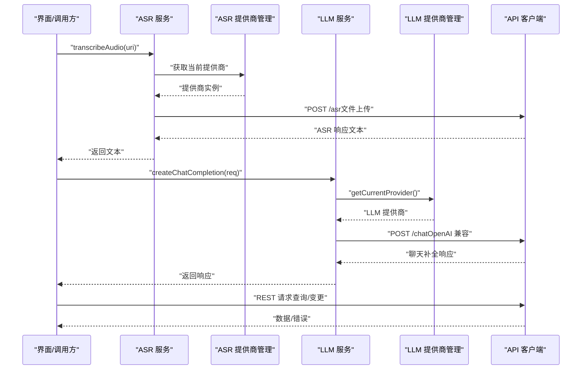

图表来源
- [services/asr/asrService.ts:24-73](file://services/asr/asrService.ts#L24-L73)
- [services/asr/providers/ASRProviderManager.ts:142-155](file://services/asr/providers/ASRProviderManager.ts#L142-L155)
- [services/llm/llmService.ts:32-37](file://services/llm/llmService.ts#L32-L37)
- [services/llm/providers/LLMProviderManager.ts:55-85](file://services/llm/providers/LLMProviderManager.ts#L55-L85)
- [services/api/client.ts:81-99](file://services/api/client.ts#L81-L99)

## 详细组件分析

### ASR 语音转写服务
- 公共方法
  - isASRConfigured(): 判断 ASR 配置是否完整。
  - transcribeAudio(uri: string): 上传音频文件并返回转写文本。
- 参数与返回
  - 参数：音频文件 URI（字符串）。
  - 返回：字符串（转写文本）。
- 错误处理
  - 配置缺失：抛出本地化错误。
  - 文件不存在：抛出本地化错误。
  - HTTP 非 OK：读取响应体并抛出带状态码的本地化错误。
  - 超时：AbortController 触发，抛出超时错误。
- 异步与状态
  - 使用 AbortController 控制超时。
  - 通过提供商管理器选择具体提供商（本地/云端）。
- 最佳实践
  - 在调用前先检查 isASRConfigured()。
  - 为长音频设置合理的超时阈值。
  - 对于大文件建议使用云端提供商以提升稳定性。

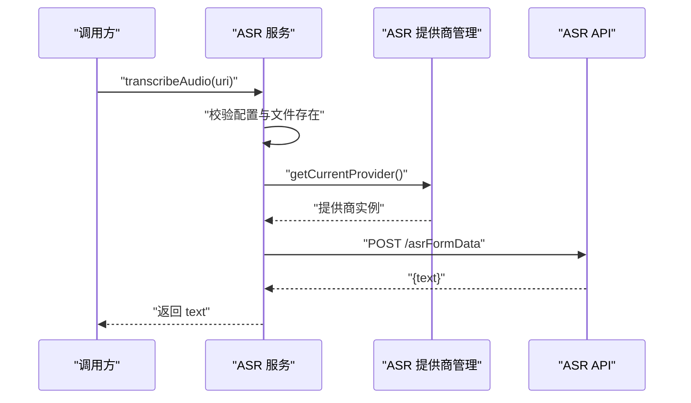

图表来源
- [services/asr/asrService.ts:24-73](file://services/asr/asrService.ts#L24-L73)
- [services/asr/providers/ASRProviderManager.ts:63-100](file://services/asr/providers/ASRProviderManager.ts#L63-L100)

章节来源
- [services/asr/asrService.ts:1-74](file://services/asr/asrService.ts#L1-L74)
- [services/asr/providers/ASRProviderManager.ts:1-263](file://services/asr/providers/ASRProviderManager.ts#L1-L263)
- [types/asr.ts:1-164](file://types/asr.ts#L1-L164)

### ASR 提供商管理
- 职责
  - 注册本地 Moonshine 与云端 SenseVoice 提供商。
  - 根据设置动态切换当前提供商，确保初始化与可用性。
  - 提供流式/非流式能力识别与事件订阅。
- 关键方法
  - initialize(): 初始化提供商注册表。
  - getCurrentProvider(): 获取当前可用提供商。
  - getProviderInfo(): 返回提供商类型、名称、状态与能力。
  - startStreaming()/stopStreaming(): 流式转写控制。
  - subscribe(): 订阅流式事件回调。
- 错误与状态
  - 当提供商不可用或未注册时，返回错误状态与错误信息。
  - 支持查询当前模型与能力描述。

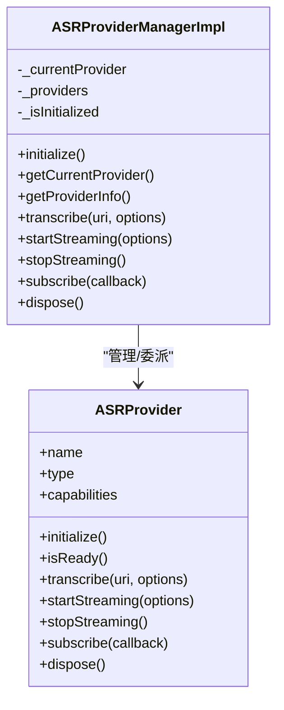

图表来源
- [services/asr/providers/ASRProviderManager.ts:30-263](file://services/asr/providers/ASRProviderManager.ts#L30-L263)

章节来源
- [services/asr/providers/ASRProviderManager.ts:1-263](file://services/asr/providers/ASRProviderManager.ts#L1-L263)
- [types/asr.ts:1-164](file://types/asr.ts#L1-L164)

### 模型管理（ASR）
- 功能
  - 检测与标记已尝试提取的打包模型，避免重复。
  - 从应用资源复制模型文件到文档目录（支持多平台路径）。
  - 检查任意一个打包模型是否存在，用于引导首次启动流程。
- 关键方法
  - isBundledModel(language, arch): 是否为打包模型。
  - extractBundledModel(language, arch): 解包并复制模型文件。
  - extractAllBundledModels(): 启动时批量解包。
  - checkBundledModelsAvailability(): 快速检查打包模型可用性。

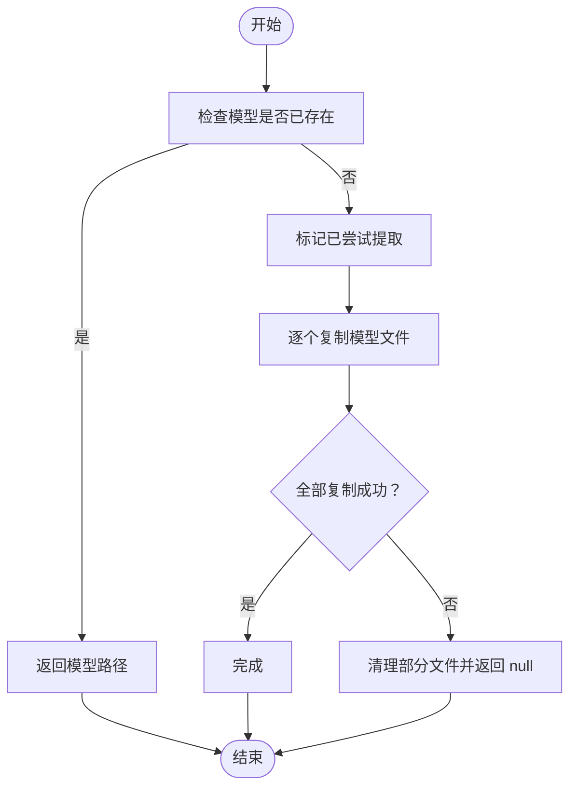

图表来源
- [services/asr/modelManager/BundledModels.ts:96-201](file://services/asr/modelManager/BundledModels.ts#L96-L201)

章节来源
- [services/asr/modelManager/BundledModels.ts:1-258](file://services/asr/modelManager/BundledModels.ts#L1-L258)

### LLM 服务
- 公共方法
  - isLLMConfigured(): 判断本地或云端 LLM 配置是否就绪。
  - createChatCompletion(request): 发送聊天请求并返回完整响应。
  - streamChatCompletion(request, onChunk): 流式输出，逐块回调。
  - getLLMProviderInfo(): 查询当前提供商信息与能力。
  - getLocalModelInfo(options): 解析本地模型路径与状态。
- 参数与返回
  - 请求遵循 OpenAI 兼容格式（messages、temperature、max_tokens 等）。
  - 响应包含 choices 与可选 usage。
- 错误处理
  - 配置不满足时抛出明确错误。
  - 提供商初始化失败或不可用时抛出错误。
- 最佳实践
  - 在发起请求前调用 isLLMConfigured()。
  - 对长对话使用流式输出以改善用户体验。
  - 本地模型需确保文件大小与扩展名有效。

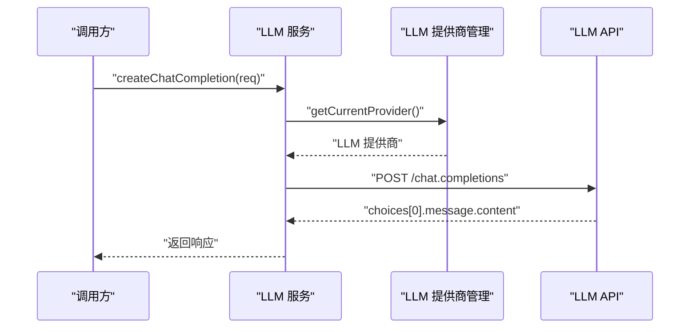

图表来源
- [services/llm/llmService.ts:32-37](file://services/llm/llmService.ts#L32-L37)
- [services/llm/providers/LLMProviderManager.ts:55-85](file://services/llm/providers/LLMProviderManager.ts#L55-L85)

章节来源
- [services/llm/llmService.ts:1-61](file://services/llm/llmService.ts#L1-L61)
- [services/llm/providers/LLMProviderManager.ts:1-164](file://services/llm/providers/LLMProviderManager.ts#L1-L164)
- [services/llm/modelManager.ts:1-196](file://services/llm/modelManager.ts#L1-L196)
- [types/llm.ts:1-93](file://types/llm.ts#L1-L93)

### LLM 提供商管理
- 职责
  - 注册本地（llama.cpp）与云端（OpenAI 兼容）提供商。
  - 依据设置或环境变量选择首选提供商，确保初始化与可用性。
  - 提供能力与状态查询，便于 UI 展示与降级策略。
- 关键方法
  - getCurrentProvider(): 获取当前可用提供商。
  - getProviderInfo(): 返回提供商类型、名称、状态与能力。
  - createChatCompletion()/streamChatCompletion(): 委派至提供商。
  - dispose(): 释放当前与所有提供商资源。

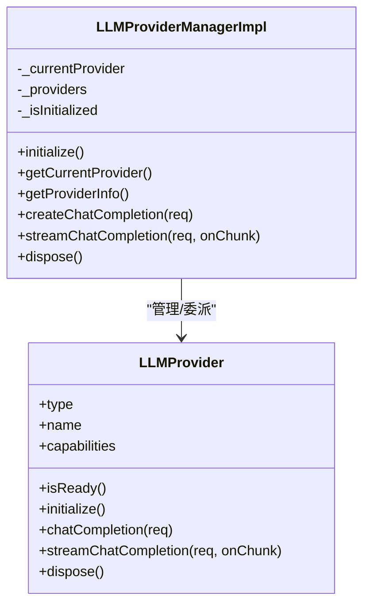

图表来源
- [services/llm/providers/LLMProviderManager.ts:18-164](file://services/llm/providers/LLMProviderManager.ts#L18-L164)

章节来源
- [services/llm/providers/LLMProviderManager.ts:1-164](file://services/llm/providers/LLMProviderManager.ts#L1-L164)
- [types/llm.ts:1-93](file://types/llm.ts#L1-L93)

### AI 分析服务
- 公共方法
  - isAIConfigured(): 委托 LLM 配置检查。
  - analyzeNotes(notes): 对多条笔记进行结构化分析。
  - normalizeAIResponse(parsed): 规范化 LLM 返回的 JSON。
- 输入输出
  - 输入：笔记数组（id、title、content、createdAt、tags、type）。
  - 输出：EnhancedAIAnalysisResult（summary、tags、keyInsights、actionItems、metadata）。
- 处理流程
  - 格式化笔记文本与概览。
  - 构建系统提示与用户提示。
  - 调用 LLM 获取 JSON 文本并提取 JSON 片段。
  - 规范化为结构化对象。
- 错误处理
  - LLM 返回为空或无法解析时抛错。
  - 超时通过 AbortController 控制。

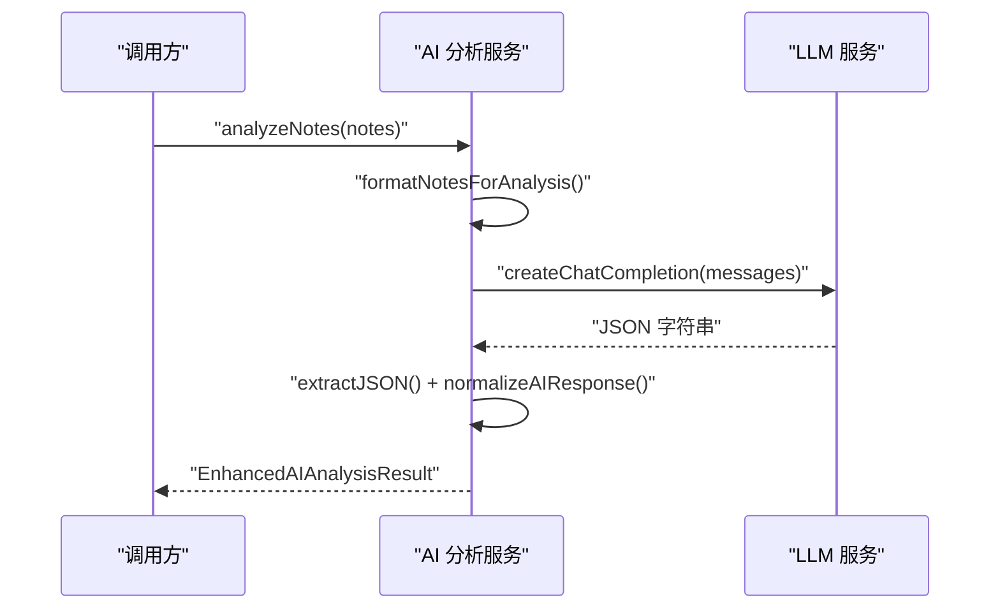

图表来源
- [services/ai/aiService.ts:126-163](file://services/ai/aiService.ts#L126-L163)

章节来源
- [services/ai/aiService.ts:1-163](file://services/ai/aiService.ts#L1-L163)
- [types/ai.ts:1-48](file://types/ai.ts#L1-L48)

### 转写优化服务
- 公共方法
  - isOptimizationConfigured(): 委托 LLM 配置检查。
  - applyRuleCleanup(text, language?): 规则清理（去填充词、标点修正）。
  - applyLLMOptimization(text, level): LLM 优化（中/重度）。
  - optimizeTranscription(text, level, language?): 组合优化流程。
- 处理流程
  - 先执行规则清理。
  - 轻度：直接返回清理后文本。
  - 中/重度：若配置可用则调用 LLM 优化，失败时回退到清理版本。
- 超时与降级
  - LLM 优化超时自动回退。
  - 未配置时直接回退。

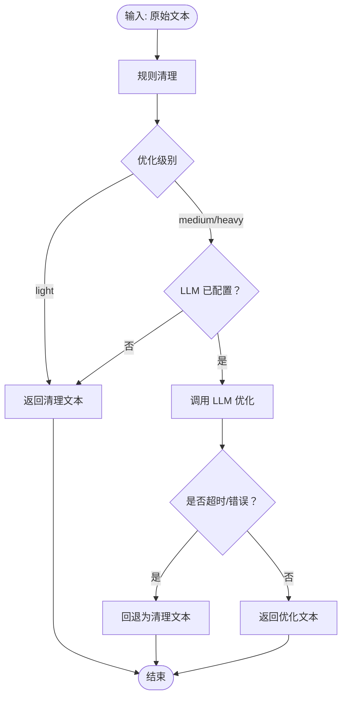

图表来源
- [services/transcription/transcriptionOptimizationService.ts:62-88](file://services/transcription/transcriptionOptimizationService.ts#L62-L88)

章节来源
- [services/transcription/transcriptionOptimizationService.ts:1-88](file://services/transcription/transcriptionOptimizationService.ts#L1-L88)

### API 客户端与查询封装
- API 客户端
  - 统一基础 URL、超时、Content-Type。
  - 请求/响应拦截器：可扩展鉴权头与错误映射。
  - GET/POST/PUT/PATCH/DELETE 方法封装。
- 端点常量
  - 聚合认证、笔记、录音、媒体、同步、用户、分享等路由模板。
- React Query 封装
  - 查询键命名规范，支持笔记列表、详情、录音、媒体、同步状态等。
  - Mutation 封装：创建、更新、删除笔记；删除成功后失效相关缓存。

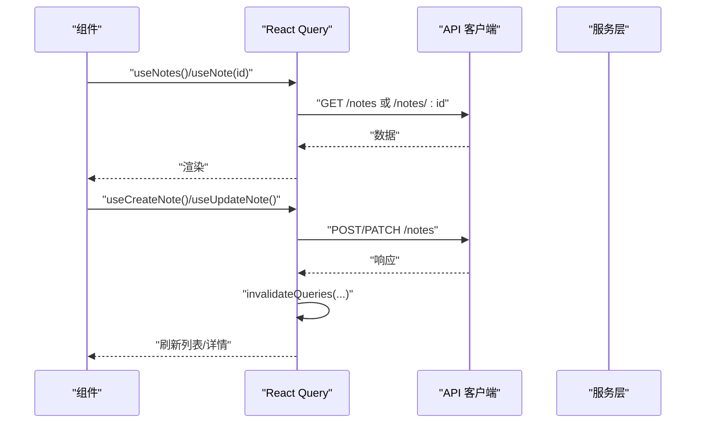

图表来源
- [services/api/queries.ts:19-99](file://services/api/queries.ts#L19-L99)
- [services/api/client.ts:81-99](file://services/api/client.ts#L81-L99)
- [services/api/endpoints.ts:1-61](file://services/api/endpoints.ts#L1-L61)

章节来源
- [services/api/client.ts:1-104](file://services/api/client.ts#L1-L104)
- [services/api/endpoints.ts:1-61](file://services/api/endpoints.ts#L1-L61)
- [services/api/queries.ts:1-100](file://services/api/queries.ts#L1-L100)

## 依赖关系分析
- 低耦合高内聚
  - ASR 与 LLM 服务分别通过各自的提供商管理器与配置中心交互，彼此独立。
  - AI 分析服务与转写优化服务均依赖 LLM 服务，形成单向依赖。
  - API 客户端与端点常量被上层查询封装与业务逻辑共同依赖。
- 关键依赖链
  - ASR → ASR 提供商管理 → API（云端）或本地模块。
  - LLM → LLM 提供商管理 → 本地/云端实现。
  - AI/优化 → LLM。
  - 查询封装 → API 客户端 → 端点常量。

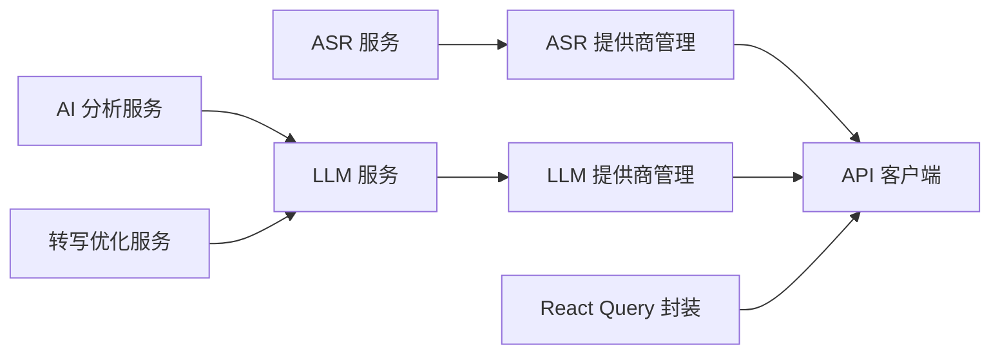

图表来源
- [services/asr/asrService.ts:1-74](file://services/asr/asrService.ts#L1-L74)
- [services/asr/providers/ASRProviderManager.ts:1-263](file://services/asr/providers/ASRProviderManager.ts#L1-L263)
- [services/llm/llmService.ts:1-61](file://services/llm/llmService.ts#L1-L61)
- [services/llm/providers/LLMProviderManager.ts:1-164](file://services/llm/providers/LLMProviderManager.ts#L1-L164)
- [services/ai/aiService.ts:1-163](file://services/ai/aiService.ts#L1-L163)
- [services/transcription/transcriptionOptimizationService.ts:1-88](file://services/transcription/transcriptionOptimizationService.ts#L1-L88)
- [services/api/client.ts:1-104](file://services/api/client.ts#L1-L104)
- [services/api/queries.ts:1-100](file://services/api/queries.ts#L1-L100)

章节来源
- [services/asr/asrService.ts:1-74](file://services/asr/asrService.ts#L1-L74)
- [services/llm/llmService.ts:1-61](file://services/llm/llmService.ts#L1-L61)
- [services/ai/aiService.ts:1-163](file://services/ai/aiService.ts#L1-L163)
- [services/api/queries.ts:1-100](file://services/api/queries.ts#L1-L100)

## 性能考量
- 超时与中断
  - ASR 与 LLM 优化均使用 AbortController 设置超时，避免长时间等待。
- 本地优先与离线能力
  - ASR 打包模型可在本地直接使用，减少网络依赖。
  - LLM 本地模型路径解析支持固定文件名与目录扫描，提高可用性。
- 缓存与失效
  - React Query 查询键设计合理，变更后主动失效相关缓存，保证一致性。
- I/O 与存储
  - 模型文件复制与目录创建采用幂等与异常清理策略，降低失败风险。

## 故障排查指南
- ASR
  - 症状：调用报“未配置”或“文件不存在”。
  - 排查：确认 ASR API 地址与密钥已设置；检查文件 URI 是否有效。
  - 症状：超时错误。
  - 排查：增大超时阈值或改用云端提供商。
- LLM
  - 症状：提供商不可用或初始化失败。
  - 排查：检查本地模型路径与文件大小；确认云端 API 地址与密钥。
  - 症状：流式输出中断。
  - 排查：监听提供商状态与错误字段，必要时切换到备用提供商。
- AI 分析
  - 症状：返回空内容或 JSON 解析失败。
  - 排查：检查系统提示与用户提示构建逻辑；确认 LLM 返回格式。
- 转写优化
  - 症状：优化后质量不佳。
  - 排查：调整优化级别；检查语言检测与填充词正则。
- API
  - 症状：网络错误或无响应。
  - 排查：检查基础 URL、超时设置与拦截器错误映射；确认服务端可达。

章节来源
- [services/asr/asrService.ts:24-73](file://services/asr/asrService.ts#L24-L73)
- [services/llm/llmService.ts:18-30](file://services/llm/llmService.ts#L18-L30)
- [services/llm/providers/LLMProviderManager.ts:75-81](file://services/llm/providers/LLMProviderManager.ts#L75-L81)
- [services/ai/aiService.ts:126-163](file://services/ai/aiService.ts#L126-L163)
- [services/transcription/transcriptionOptimizationService.ts:35-60](file://services/transcription/transcriptionOptimizationService.ts#L35-L60)
- [services/api/client.ts:56-75](file://services/api/client.ts#L56-L75)

## 结论
VoiceNote 的服务层通过统一的提供商管理与配置中心，实现了 ASR、LLM、AI 分析与 API 访问的模块化与可插拔架构。其接口设计遵循 OpenAI 兼容风格，便于第三方集成；同时提供了完善的错误处理、超时控制与降级策略，保障在不同网络与设备环境下的一致体验。建议在生产环境中：
- 明确提供商选择策略（本地优先或云端优先），并在 UI 中展示提供商状态。
- 对长任务使用流式输出与进度反馈。
- 为模型与配置提供清晰的指引与健康检查接口。

## 附录
- 接口调用示例（步骤说明）
  - ASR 文件转写
    - 步骤：检查配置 → 准备音频文件 → 调用 transcribeAudio(uri) → 处理返回文本。
    - 参考：[services/asr/asrService.ts:24-73](file://services/asr/asrService.ts#L24-L73)
  - LLM 聊天补全
    - 步骤：准备消息数组 → 调用 createChatCompletion → 处理 choices[0].message.content。
    - 参考：[services/llm/llmService.ts:32-37](file://services/llm/llmService.ts#L32-L37)，[types/llm.ts:43-73](file://types/llm.ts#L43-L73)
  - AI 分析
    - 步骤：准备笔记数组 → 调用 analyzeNotes → 规范化结果。
    - 参考：[services/ai/aiService.ts:126-163](file://services/ai/aiService.ts#L126-L163)，[types/ai.ts:34-40](file://types/ai.ts#L34-L40)
  - 转写优化
    - 步骤：输入原始文本 → 选择优化级别 → 调用 optimizeTranscription → 获取清理与优化文本。
    - 参考：[services/transcription/transcriptionOptimizationService.ts:62-88](file://services/transcription/transcriptionOptimizationService.ts#L62-L88)
  - API 查询
    - 步骤：使用 React Query hooks → 自动失效与刷新。
    - 参考：[services/api/queries.ts:19-99](file://services/api/queries.ts#L19-L99)，[services/api/endpoints.ts:1-61](file://services/api/endpoints.ts#L1-L61)