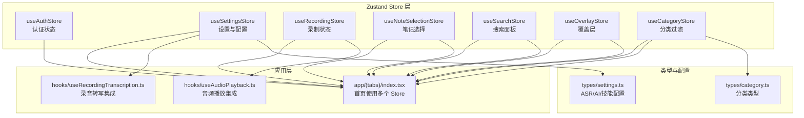
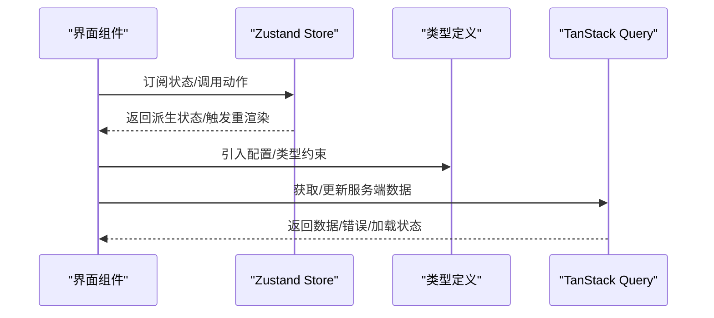
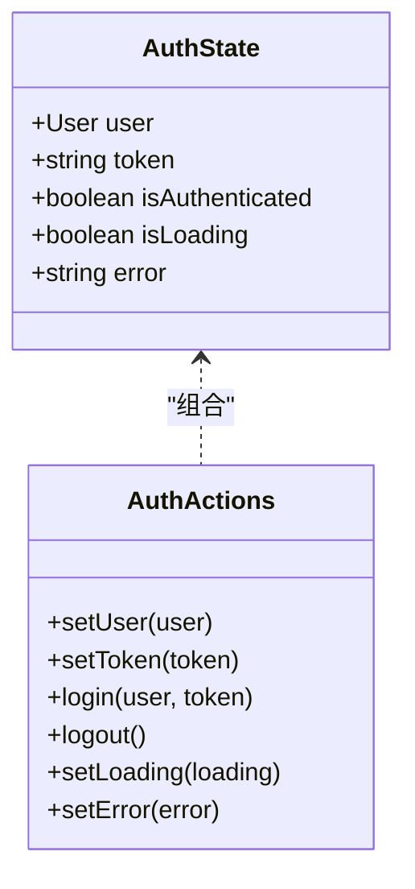
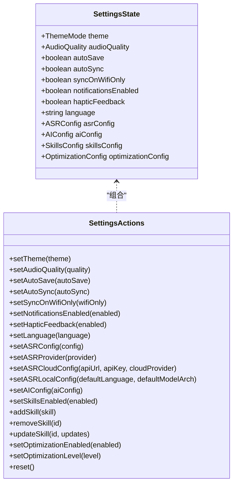
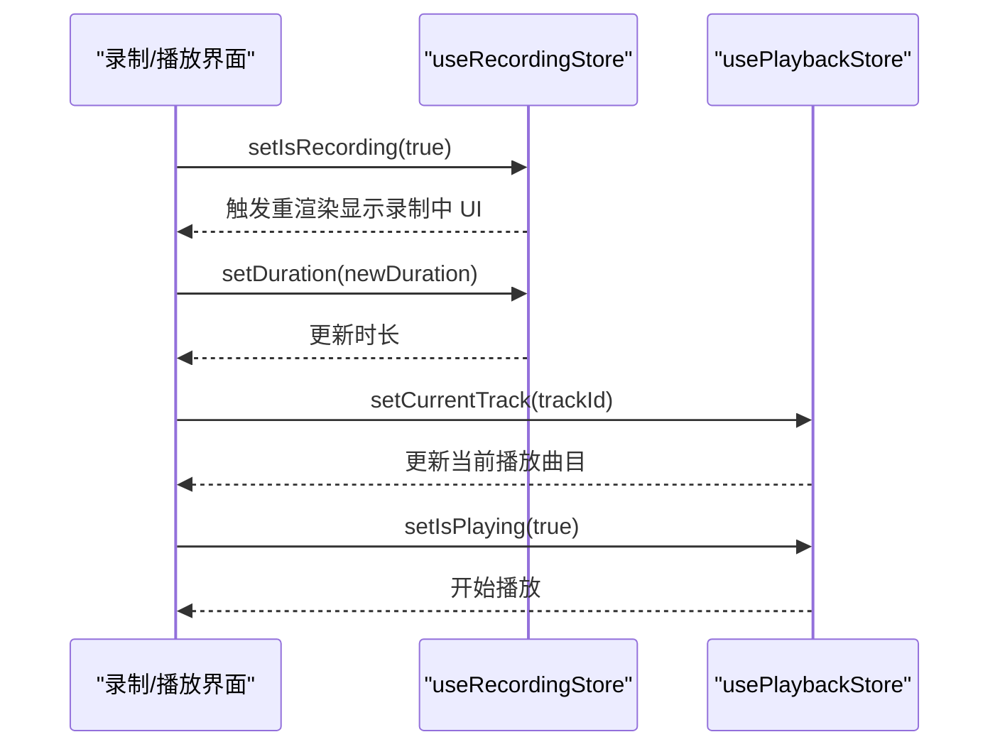
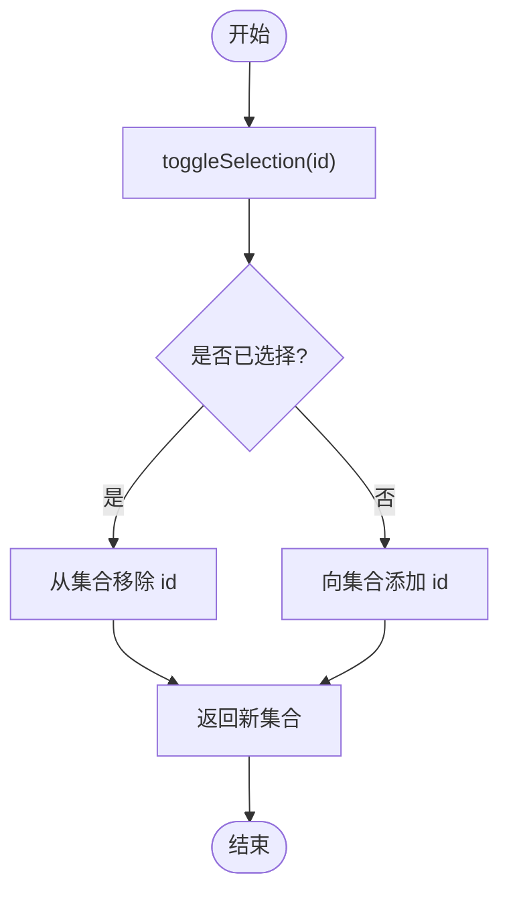
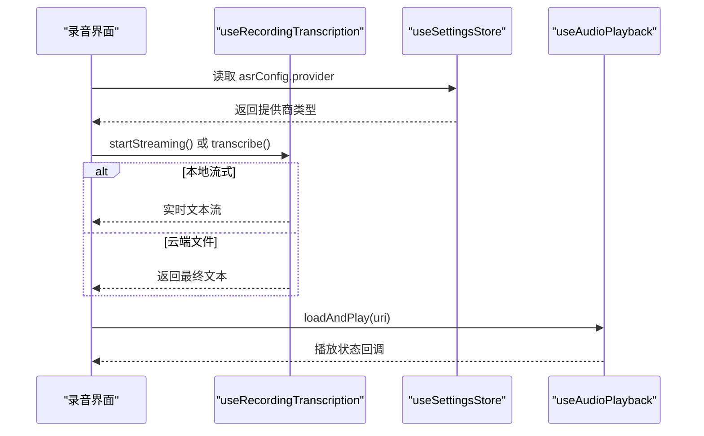
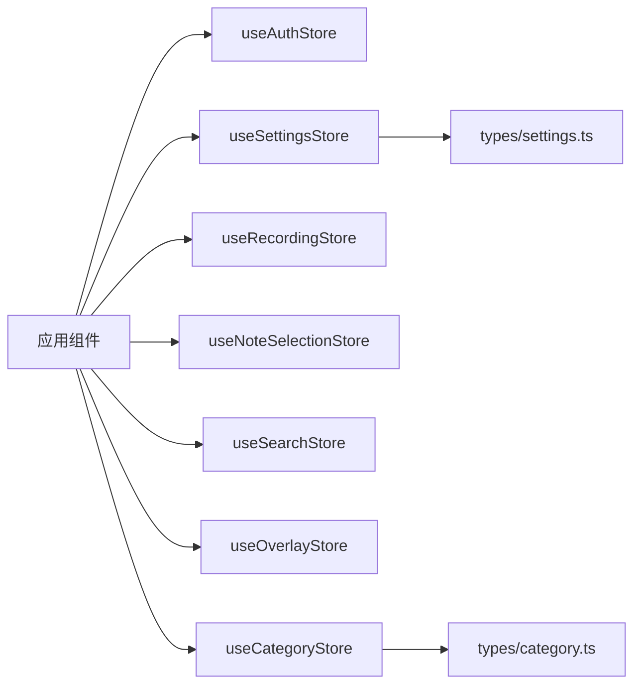

# 状态管理接口

<cite>
**本文引用的文件**
- [store/index.ts](file://store/index.ts)
- [useAuthStore.ts](file://store/useAuthStore.ts)
- [useSettingsStore.ts](file://store/useSettingsStore.ts)
- [useRecordingStore.ts](file://store/useRecordingStore.ts)
- [useNoteSelectionStore.ts](file://store/useNoteSelectionStore.ts)
- [useSearchStore.ts](file://store/useSearchStore.ts)
- [useOverlayStore.ts](file://store/useOverlayStore.ts)
- [useCategoryStore.ts](file://store/useCategoryStore.ts)
- [settings.ts](file://types/settings.ts)
- [category.ts](file://types/category.ts)
- [state-management.md](file://.trellis/spec/frontend/state-management.md)
- [index.tsx](file://app/(tabs)/index.tsx)
- [useRecordingTranscription.ts](file://hooks/useRecordingTranscription.ts)
- [useAudioPlayback.ts](file://hooks/useAudioPlayback.ts)
</cite>

## 目录
1. [简介](#简介)
2. [项目结构](#项目结构)
3. [核心组件](#核心组件)
4. [架构总览](#架构总览)
5. [详细组件分析](#详细组件分析)
6. [依赖分析](#依赖分析)
7. [性能考虑](#性能考虑)
8. [故障排除指南](#故障排除指南)
9. [结论](#结论)
10. [附录](#附录)

## 简介
本文件系统性梳理 VoiceNote 项目的 Zustand 状态管理接口，覆盖 Store 数据结构、动作函数、状态订阅与持久化机制，并解释状态间的依赖关系与同步策略。文档同时提供最佳实践、性能优化建议以及调试与故障排除方法，并通过实际使用场景展示复杂状态逻辑。

## 项目结构
VoiceNote 的全局状态采用分层设计：
- 服务器端数据：由 TanStack Query 统一管理（不在 Zustand 中存储）
- 全局 UI 状态：由 Zustand Store 管理（本文件重点）
- 组件本地状态：使用 React useState
- URL 状态：由 Expo Router 参数承载

Zustand Store 按功能模块拆分，统一通过 barrel 导出入口集中管理。

**图表来源**
- [store/index.ts:1-8](file://store/index.ts#L1-L8)
- [useAuthStore.ts:1-82](file://store/useAuthStore.ts#L1-L82)
- [useSettingsStore.ts:1-218](file://store/useSettingsStore.ts#L1-L218)
- [useRecordingStore.ts:1-71](file://store/useRecordingStore.ts#L1-L71)
- [useNoteSelectionStore.ts:1-49](file://store/useNoteSelectionStore.ts#L1-L49)
- [useSearchStore.ts:1-14](file://store/useSearchStore.ts#L1-L14)
- [useOverlayStore.ts:1-16](file://store/useOverlayStore.ts#L1-L16)
- [useCategoryStore.ts:1-56](file://store/useCategoryStore.ts#L1-L56)
- [settings.ts:1-58](file://types/settings.ts#L1-L58)
- [category.ts:1-17](file://types/category.ts#L1-L17)
- [index.tsx](file://app/(tabs)/index.tsx#L40-L239)
- [useRecordingTranscription.ts:1-199](file://hooks/useRecordingTranscription.ts#L1-L199)
- [useAudioPlayback.ts:1-90](file://hooks/useAudioPlayback.ts#L1-L90)

**章节来源**
- [store/index.ts:1-8](file://store/index.ts#L1-L8)
- [.trellis/spec/frontend/state-management.md:1-140](file://.trellis/spec/frontend/state-management.md#L1-L140)

## 核心组件
本节概述各 Store 的职责、数据结构与关键动作。

- 认证状态（useAuthStore）
  - 职责：用户信息、令牌、登录态、加载与错误状态
  - 关键动作：设置用户、设置令牌、登录、登出、设置加载状态、设置错误
  - 持久化：仅持久化用户、令牌与登录态字段

- 设置状态（useSettingsStore）
  - 职责：主题、音频质量、自动保存/同步、通知、触觉反馈、语言、ASR/AI/技能/优化配置
  - 关键动作：设置主题、音频质量、开关项、语言、ASR 提供商切换、云/本地配置、AI 配置、技能增删改、优化开关与等级、重置
  - 持久化：完整持久化；合并策略对旧版字段进行归一化处理

- 录制与播放（useRecordingStore / usePlaybackStore）
  - 录制状态：是否录制、是否暂停、时长、当前录音 URI
  - 播放状态：是否播放、当前曲目、当前位置、总时长、播放速率
  - 关键动作：设置状态、重置

- 笔记选择（useNoteSelectionStore）
  - 职责：多选集合、切换选择、全选、清空、查询选择状态与计数
  - 关键动作：toggleSelection、selectAll、clearSelection、isSelected、getSelectionCount

- 搜索面板（useSearchStore）
  - 职责：控制搜索面板开闭
  - 关键动作：openSearch、closeSearch

- 覆盖层（useOverlayStore）
  - 职责：控制录音、相机、文本、附件、设置等覆盖层的显示与关闭
  - 关键动作：openOverlay、closeOverlay

- 分类过滤（useCategoryStore）
  - 职责：分类筛选器、展开集合、管理与分配弹窗可见性
  - 关键动作：setFilter、toggleExpanded、expandAll、collapseAll、打开/关闭管理与分配弹窗、重置

**章节来源**
- [useAuthStore.ts:1-82](file://store/useAuthStore.ts#L1-L82)
- [useSettingsStore.ts:1-218](file://store/useSettingsStore.ts#L1-L218)
- [useRecordingStore.ts:1-71](file://store/useRecordingStore.ts#L1-L71)
- [useNoteSelectionStore.ts:1-49](file://store/useNoteSelectionStore.ts#L1-L49)
- [useSearchStore.ts:1-14](file://store/useSearchStore.ts#L1-L14)
- [useOverlayStore.ts:1-16](file://store/useOverlayStore.ts#L1-L16)
- [useCategoryStore.ts:1-56](file://store/useCategoryStore.ts#L1-L56)

## 架构总览
Zustand Store 与应用层的交互遵循“单一职责、按需订阅”的原则。应用层通过 hooks 使用 Store，避免直接访问底层实现细节。服务器端数据由 TanStack Query 管理，不与 Zustand 混用。

**图表来源**
- [state-management.md:1-140](file://.trellis/spec/frontend/state-management.md#L1-L140)
- [index.tsx](file://app/(tabs)/index.tsx#L40-L239)

## 详细组件分析

### 认证状态 Store（useAuthStore）
- 数据结构
  - 用户对象（可空）、令牌（可空）、是否已登录、加载中、错误信息
- 动作函数
  - 设置用户并同步登录态
  - 设置令牌
  - 登录（设置用户、令牌与清除错误）
  - 登出（清理用户、令牌、登录态与错误）
  - 设置加载状态、设置错误
- 持久化机制
  - 使用 persist 中间件，持久化用户、令牌与登录态
  - JSON 存储，使用 AsyncStorage
- 订阅与使用
  - 应用层通过 hooks 订阅用户与登录态，用于导航与权限控制

**图表来源**
- [useAuthStore.ts:5-27](file://store/useAuthStore.ts#L5-L27)

**章节来源**
- [useAuthStore.ts:1-82](file://store/useAuthStore.ts#L1-L82)

### 设置状态 Store（useSettingsStore）
- 数据结构
  - 主题、音频质量、自动保存/同步、仅 Wi-Fi 同步、通知、触觉反馈、语言
  - ASR 配置（提供商、云端/本地参数、默认语言与模型架构、下载源、自定义模型）
  - AI 配置（提供商、API 地址、密钥、模型、本地推理参数）
  - 技能配置（启用开关、技能列表）
  - 优化配置（启用开关、优化级别）
- 动作函数
  - 设置主题、音频质量、开关项、语言
  - 设置 ASR 提供商、云/本地配置
  - 设置 AI 配置
  - 技能增删改
  - 优化开关与等级
  - 重置到默认值
- 持久化机制
  - 使用 persist 中间件，持久化全部设置
  - 自定义 merge 函数：对旧版模型架构进行归一化，确保 AI/技能/优化配置的兼容性
- 类型约束
  - ASR/AI/技能/优化配置由 types/settings.ts 定义，保证类型安全

**图表来源**
- [useSettingsStore.ts:9-45](file://store/useSettingsStore.ts#L9-L45)
- [settings.ts:1-58](file://types/settings.ts#L1-L58)

**章节来源**
- [useSettingsStore.ts:1-218](file://store/useSettingsStore.ts#L1-L218)
- [settings.ts:1-58](file://types/settings.ts#L1-L58)

### 录制与播放 Store（useRecordingStore / usePlaybackStore）
- 录制状态
  - isRecording、isPaused、duration、currentRecordingUri
  - 动作：设置状态、重置
- 播放状态
  - isPlaying、currentTrackId、currentPosition、duration、playbackRate
  - 动作：设置状态、重置
- 与应用层集成
  - 录制流程中通过录制状态驱动 UI 与文件保存
  - 播放流程中通过播放状态驱动播放器 UI 与进度条

**图表来源**
- [useRecordingStore.ts:3-33](file://store/useRecordingStore.ts#L3-L33)
- [useRecordingStore.ts:36-70](file://store/useRecordingStore.ts#L36-L70)

**章节来源**
- [useRecordingStore.ts:1-71](file://store/useRecordingStore.ts#L1-L71)

### 笔记选择 Store（useNoteSelectionStore）
- 数据结构
  - selectedIds: Set<number>
- 动作函数
  - 切换选择、全选、清空
  - 查询是否选择与选择数量（内部读取状态）
- 与应用层集成
  - 在首页根据选择状态切换操作栏与批量操作

**图表来源**
- [useNoteSelectionStore.ts:15-48](file://store/useNoteSelectionStore.ts#L15-L48)

**章节来源**
- [useNoteSelectionStore.ts:1-49](file://store/useNoteSelectionStore.ts#L1-L49)
- [index.tsx](file://app/(tabs)/index.tsx#L68-L94)

### 搜索面板 Store（useSearchStore）
- 数据结构
  - isSearchOpen: boolean
- 动作函数
  - 打开/关闭搜索面板
- 与应用层集成
  - 首页根据 isSearchOpen 控制搜索覆盖层

**章节来源**
- [useSearchStore.ts:1-14](file://store/useSearchStore.ts#L1-L14)
- [index.tsx](file://app/(tabs)/index.tsx#L58-L66)

### 覆盖层 Store（useOverlayStore）
- 数据结构
  - activeOverlay: OverlayType（'record' | 'camera' | 'text' | 'attachment' | 'settings' | null）
- 动作函数
  - 打开指定覆盖层、关闭覆盖层
- 与应用层集成
  - 首页根据 activeOverlay 决定显示哪些覆盖层

**章节来源**
- [useOverlayStore.ts:1-16](file://store/useOverlayStore.ts#L1-L16)
- [index.tsx](file://app/(tabs)/index.tsx#L43-L50)

### 分类过滤 Store（useCategoryStore）
- 数据结构
  - filter: CategoryFilter
  - expandedIds: Set<number|string>
  - managementVisible、assignmentVisible: boolean
- 动作函数
  - 设置筛选器、切换展开/折叠、展开/折叠所有、打开/关闭管理与分配弹窗、重置
- 与应用层集成
  - 分类视图与筛选栏使用该状态

**章节来源**
- [useCategoryStore.ts:1-56](file://store/useCategoryStore.ts#L1-L56)
- [category.ts:1-17](file://types/category.ts#L1-L17)

### 复杂状态逻辑：录音转写与播放集成
- 录音转写（useRecordingTranscription）
  - 根据设置中的 ASR 提供商类型自动选择流式转写或文件后置转写
  - 统一导出接口：startStreaming、stopStreaming、transcribe、retry、reset、文本模式切换等
  - 与设置 Store 解耦：通过订阅获取配置，避免硬编码
- 音频播放（useAudioPlayback）
  - 封装播放器生命周期：加载、播放、暂停、停止、跳转、卸载
  - 与播放状态 Store 协同：将播放器状态映射到 Store

**图表来源**
- [useRecordingTranscription.ts:74-199](file://hooks/useRecordingTranscription.ts#L74-L199)
- [useSettingsStore.ts:134-188](file://store/useSettingsStore.ts#L134-L188)
- [useAudioPlayback.ts:1-90](file://hooks/useAudioPlayback.ts#L1-L90)

**章节来源**
- [useRecordingTranscription.ts:1-199](file://hooks/useRecordingTranscription.ts#L1-L199)
- [useAudioPlayback.ts:1-90](file://hooks/useAudioPlayback.ts#L1-L90)

## 依赖分析
- Store 间无直接耦合：每个 Store 独立维护自身状态与动作
- 应用层依赖 Store：页面组件通过 hooks 订阅所需状态
- 类型依赖：设置 Store 依赖 types/settings.ts；分类 Store 依赖 types/category.ts
- 外部依赖：持久化使用 AsyncStorage；播放器使用 expo-audio；转写使用本地/云端 ASR

**图表来源**
- [index.tsx](file://app/(tabs)/index.tsx#L40-L239)
- [useSettingsStore.ts:1-218](file://store/useSettingsStore.ts#L1-L218)
- [useCategoryStore.ts:1-56](file://store/useCategoryStore.ts#L1-L56)
- [settings.ts:1-58](file://types/settings.ts#L1-L58)
- [category.ts:1-17](file://types/category.ts#L1-L17)

**章节来源**
- [index.tsx](file://app/(tabs)/index.tsx#L40-L239)

## 性能考虑
- 最小化订阅范围：仅订阅组件需要的状态片段，避免不必要的重渲染
- 使用 get 读取状态：在动作内部使用 get() 读取当前状态，减少外部依赖
- 合理使用 memo：复杂计算结果使用 useMemo 缓存，降低重渲染成本
- 持久化字段精简：仅持久化必要字段，减少存储体积与序列化开销
- 合并策略：设置 Store 的 merge 函数确保升级后的兼容性，避免重复初始化
- 异步操作：持久化与网络请求应异步执行，避免阻塞 UI 线程

## 故障排除指南
- 常见问题
  - 状态未持久化：检查 persist 配置、storage 与字段选择
  - 状态不同步：确认订阅范围与动作调用时机
  - 类型不匹配：核对 types/settings.ts 与 types/category.ts 的字段定义
- 调试建议
  - 使用 React DevTools 或 Zustand Devtools 追踪状态变化
  - 在动作中打印关键状态，定位异常分支
  - 对复杂逻辑使用单元测试验证边界条件
- 错误处理
  - 认证 Store 提供错误字段，用于 UI 反馈
  - 设置 Store 的合并策略可缓解版本升级导致的配置不一致

**章节来源**
- [useAuthStore.ts:68-69](file://store/useAuthStore.ts#L68-L69)
- [useSettingsStore.ts:189-216](file://store/useSettingsStore.ts#L189-L216)

## 结论
VoiceNote 的 Zustand 状态管理采用模块化设计，职责清晰、易于扩展。通过合理的持久化策略与类型约束，确保了跨版本兼容与开发效率。配合 TanStack Query 的服务器端数据管理，形成完整的前端状态体系。建议在新增功能时遵循现有模式：优先使用局部状态，按需提升为全局状态；严格区分 UI 状态与服务器数据；保持动作的幂等与可追踪性。

## 附录
- 使用示例路径
  - 录制与播放：[useRecordingStore.ts:25-33](file://store/useRecordingStore.ts#L25-L33)、[useAudioPlayback.ts:27-88](file://hooks/useAudioPlayback.ts#L27-L88)
  - 笔记选择：[useNoteSelectionStore.ts:15-48](file://store/useNoteSelectionStore.ts#L15-L48)、[index.tsx](file://app/(tabs)/index.tsx#L68-L94)
  - 搜索与覆盖层：[useSearchStore.ts:9-13](file://store/useSearchStore.ts#L9-L13)、[useOverlayStore.ts:11-15](file://store/useOverlayStore.ts#L11-L15)、[index.tsx](file://app/(tabs)/index.tsx#L58-L66)
  - 设置与配置：[useSettingsStore.ts:134-188](file://store/useSettingsStore.ts#L134-L188)、[settings.ts:14-58](file://types/settings.ts#L14-L58)
  - 分类过滤：[useCategoryStore.ts:23-55](file://store/useCategoryStore.ts#L23-L55)、[category.ts:8-17](file://types/category.ts#L8-L17)