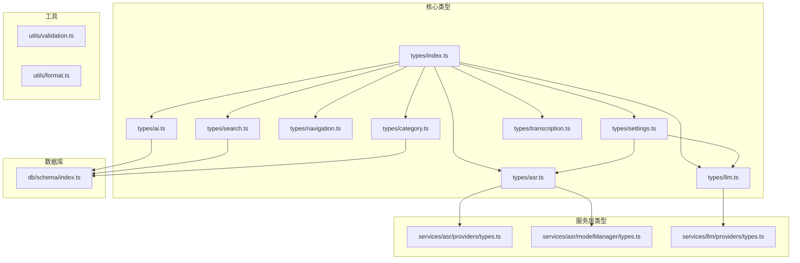
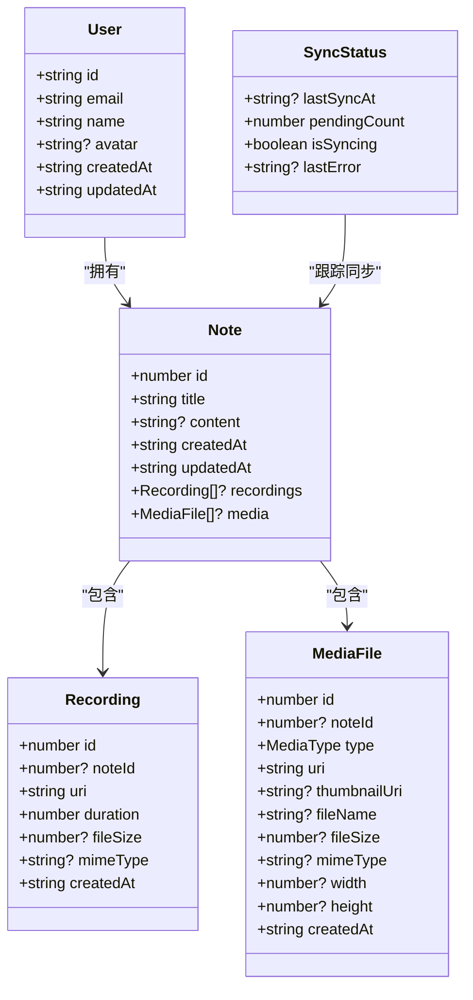
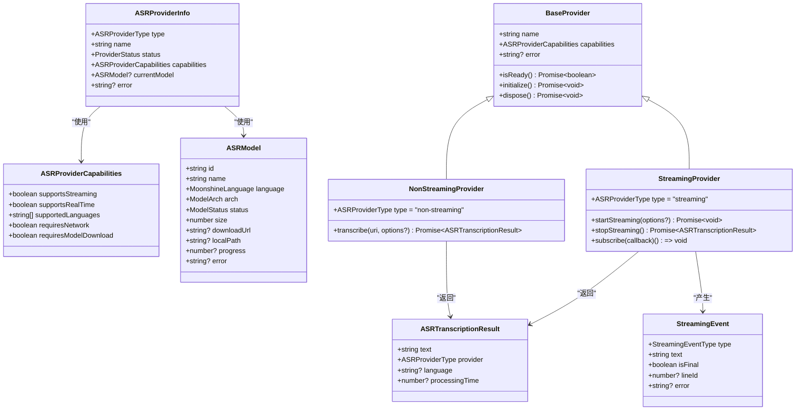
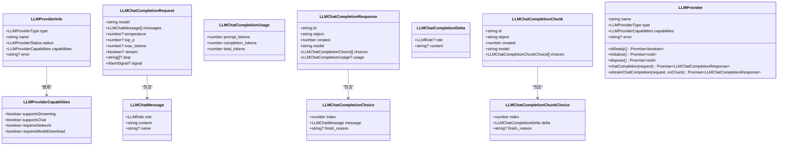
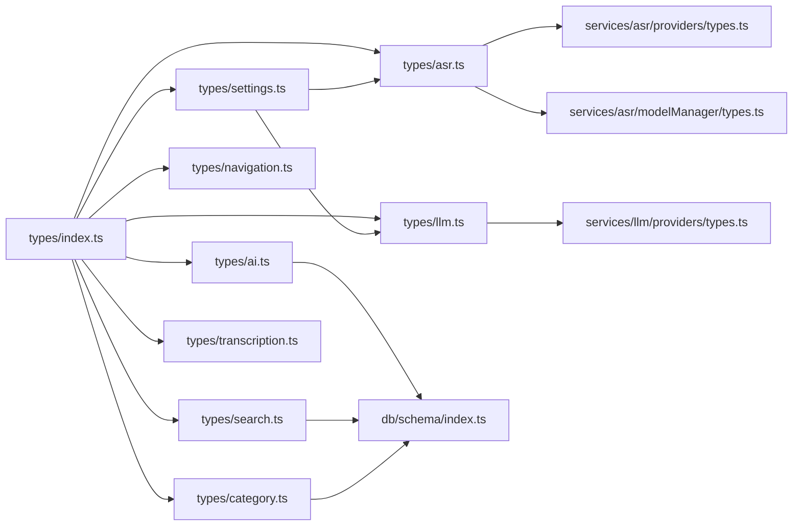

# 类型定义参考

<cite>
**本文档引用的文件**
- [types/index.ts](file://types/index.ts)
- [types/asr.ts](file://types/asr.ts)
- [types/llm.ts](file://types/llm.ts)
- [types/ai.ts](file://types/ai.ts)
- [types/category.ts](file://types/category.ts)
- [types/navigation.ts](file://types/navigation.ts)
- [types/search.ts](file://types/search.ts)
- [types/settings.ts](file://types/settings.ts)
- [types/transcription.ts](file://types/transcription.ts)
- [db/schema/index.ts](file://db/schema/index.ts)
- [services/asr/modelManager/types.ts](file://services/asr/modelManager/types.ts)
- [services/asr/providers/types.ts](file://services/asr/providers/types.ts)
- [services/llm/providers/types.ts](file://services/llm/providers/types.ts)
- [utils/validation.ts](file://utils/validation.ts)
- [utils/format.ts](file://utils/format.ts)
</cite>

## 目录
1. [简介](#简介)
2. [项目结构](#项目结构)
3. [核心组件](#核心组件)
4. [架构总览](#架构总览)
5. [详细组件分析](#详细组件分析)
6. [依赖分析](#依赖分析)
7. [性能考虑](#性能考虑)
8. [故障排除指南](#故障排除指南)
9. [结论](#结论)
10. [附录](#附录)

## 简介
本参考文档系统性梳理 VoiceNote 项目的 TypeScript 类型定义，覆盖数据模型、服务接口、配置与工具类型。文档重点包括：
- 接口与类型别名的完整结构说明
- 枚举与联合类型的取值范围与语义
- 泛型与条件类型的使用场景
- 类型之间的继承关系与组合模式
- 类型扩展与自定义的最佳实践
- 类型安全的使用示例与常见类型转换场景
- 面向第三方开发者的类型约束与扩展指南

## 项目结构
类型定义主要分布在以下模块：
- 核心类型：types 目录（数据模型、通用响应、分页、媒体类型等）
- 语音识别（ASR）类型：types/asr.ts 与 services/asr/providers/types.ts、services/asr/modelManager/types.ts
- 大语言模型（LLM）类型：types/llm.ts 与 services/llm/providers/types.ts
- AI 分析类型：types/ai.ts
- 分类与分组类型：types/category.ts
- 导航类型：types/navigation.ts
- 搜索类型：types/search.ts
- 设置与配置类型：types/settings.ts
- 转录优化类型：types/transcription.ts
- 数据库模式类型：db/schema/index.ts
- 工具类型：utils/validation.ts、utils/format.ts

**图表来源**
- [types/index.ts:1-98](file://types/index.ts#L1-L98)
- [types/asr.ts:1-164](file://types/asr.ts#L1-L164)
- [types/llm.ts:1-93](file://types/llm.ts#L1-L93)
- [types/ai.ts:1-48](file://types/ai.ts#L1-L48)
- [types/category.ts:1-17](file://types/category.ts#L1-L17)
- [types/navigation.ts:1-22](file://types/navigation.ts#L1-L22)
- [types/search.ts:1-25](file://types/search.ts#L1-L25)
- [types/settings.ts:1-58](file://types/settings.ts#L1-L58)
- [types/transcription.ts:1-15](file://types/transcription.ts#L1-L15)
- [services/asr/providers/types.ts:1-143](file://services/asr/providers/types.ts#L1-L143)
- [services/asr/modelManager/types.ts:1-129](file://services/asr/modelManager/types.ts#L1-L129)
- [services/llm/providers/types.ts:1-30](file://services/llm/providers/types.ts#L1-L30)
- [db/schema/index.ts:1-75](file://db/schema/index.ts#L1-L75)
- [utils/validation.ts:1-58](file://utils/validation.ts#L1-L58)
- [utils/format.ts:1-126](file://utils/format.ts#L1-L126)

**章节来源**
- [types/index.ts:1-98](file://types/index.ts#L1-L98)
- [db/schema/index.ts:1-75](file://db/schema/index.ts#L1-L75)

## 核心组件
本节对项目中的关键类型进行深入解析，涵盖数据模型、通用响应、分页、媒体类型、同步状态等。

- 响应与分页
  - ApiResponse<T>：统一的 API 响应结构，包含数据体、消息与成功标志
  - PaginatedResponse<T>：分页响应结构，包含数据数组、总数、页码、每页数量与是否还有更多

- 用户与笔记
  - User：用户信息，包含标识、邮箱、姓名、头像与时间戳
  - Note：笔记实体，包含标题、内容、录音与媒体附件、创建与更新时间

- 录音与媒体
  - Recording：录音条目，包含关联笔记、URI、时长、文件大小、MIME 类型与创建时间
  - MediaFile：媒体文件，包含类型（图像/视频/文档）、URI、缩略图、文件名、尺寸、宽高与创建时间

- 同步与状态
  - SyncStatus：同步状态，包含最后同步时间、待处理数量、是否正在同步与最后错误信息
  - MediaType、SyncAction、EntityType：媒体类型、同步动作与实体类型枚举

- 通用类型别名
  - MediaType：'image' | 'video' | 'document'
  - SyncAction：'create' | 'update' | 'delete'
  - EntityType：'note' | 'recording' | 'media'

**章节来源**
- [types/index.ts:1-98](file://types/index.ts#L1-L98)

## 架构总览
VoiceNote 的类型体系围绕“数据模型 + 服务接口 + 配置 + 工具”四层构建：
- 数据模型层：Note、Recording、MediaFile 等，对应数据库表结构
- 服务接口层：ASR/LLM 提供商接口与能力描述
- 配置层：ASRConfig、AIConfig、SkillsConfig 等
- 工具层：格式化与校验工具函数

**图表来源**
- [types/index.ts:45-98](file://types/index.ts#L45-L98)
- [db/schema/index.ts:3-75](file://db/schema/index.ts#L3-L75)

## 详细组件分析

### ASR 类型体系
ASR 类型定义支持本地 Moonshine 与云 SenseVoice 等提供商，涵盖模型管理、流式事件、转录结果与提供商能力描述。

- 提供商类型与状态
  - ASRProviderType：'local' | 'cloud'
  - ProviderStatus：'unavailable' | 'ready' | 'busy' | 'error'
  - ModelStatus：'not_downloaded' | 'downloading' | 'extracting' | 'downloaded' | 'error'

- 语言与模型架构
  - MoonshineLanguage：多语言枚举
  - ModelArch：'small' | 'base'
  - ModelDownloadSource：'default' | 'custom'

- 流式事件与结果
  - StreamingEventType：'line_started' | 'line_text_changed' | 'line_completed' | 'error'
  - StreamingEvent：包含事件类型、文本、是否最终、行号与错误信息
  - ASRTranscriptionResult：包含文本、提供商类型、语言与处理时间

- 模型与提供商信息
  - ASRModel：模型标识、名称、语言、架构、状态、大小、下载地址、本地路径、进度与错误
  - ASRProviderCapabilities：能力描述（是否支持流式、实时、网络需求、模型下载需求）
  - ASRProviderInfo：提供商类型、名称、状态、能力、当前模型与错误信息

- 云与本地提供商
  - CloudASRProvider：'sensevoice' | 'openai-whisper' | 'custom'
  - LocalASRProvider：'moonshine'

- 模型管理类型
  - ModelId：模板字面量类型 `moonshine-${ModelArch}-${MoonshineLanguage}`
  - DownloadProgressCallback：下载进度回调
  - ModelDownloadOptions：下载选项（语言、架构、自定义 URL、进度回调）
  - RemoteModelInfo / LocalModelInfo：远程/本地模型信息
  - ModelFiles：模型文件集合（encoder、decoder、tokenizer）
  - 工具函数：获取默认模型基础 URL、生成模型下载 URL、模型 ID 生成与解析、显示名映射与模型大小常量

- ASR 提供商接口
  - BaseProvider：提供者基类接口（名称、能力、错误、就绪检查、初始化、释放）
  - NonStreamingProvider：非流式提供商（transcribe）
  - StreamingProvider：流式提供商（startStreaming、stopStreaming、订阅事件）
  - ASRProvider：提供商联合类型
  - 类型守卫：isStreamingProvider、isNonStreamingProvider

**图表来源**
- [types/asr.ts:1-164](file://types/asr.ts#L1-L164)
- [services/asr/providers/types.ts:1-143](file://services/asr/providers/types.ts#L1-L143)
- [services/asr/modelManager/types.ts:1-129](file://services/asr/modelManager/types.ts#L1-L129)

**章节来源**
- [types/asr.ts:1-164](file://types/asr.ts#L1-L164)
- [services/asr/providers/types.ts:1-143](file://services/asr/providers/types.ts#L1-L143)
- [services/asr/modelManager/types.ts:1-129](file://services/asr/modelManager/types.ts#L1-L129)

### LLM 类型体系
LLM 类型定义遵循 OpenAI 兼容的消息与聊天完成请求/响应形状，并描述提供商能力元数据。

- 提供商类型与状态
  - LLMProviderType：'local' | 'cloud'
  - LLMProviderStatus：'unavailable' | 'ready' | 'busy' | 'error'

- 能力与信息
  - LLMProviderCapabilities：支持流式、聊天、网络需求、模型下载需求
  - LLMProviderInfo：提供商类型、名称、状态、能力与错误信息

- 聊天完成类型（OpenAI 兼容）
  - LLMRole：'system' | 'user' | 'assistant' | 'tool'
  - LLMChatMessage：角色、内容与可选名称
  - LLMChatCompletionRequest：模型、消息列表、温度、采样参数、最大令牌数、是否流式、停止词、取消信号
  - LLMChatCompletionChoice：索引、消息与结束原因
  - LLMChatCompletionUsage：提示令牌、补全令牌、总令牌
  - LLMChatCompletionResponse：对象标识、创建时间、模型、选择列表与用量
  - LLMChatCompletionDelta：流式增量的角色与内容
  - LLMChatCompletionChunkChoice：流式增量选择
  - LLMChatCompletionChunk：流式响应块

- LLM 提供商接口
  - LLMStreamCallback：流式回调
  - LLMProvider：提供者接口（就绪检查、初始化、释放、聊天完成、流式聊天完成）

**图表来源**
- [types/llm.ts:1-93](file://types/llm.ts#L1-L93)
- [services/llm/providers/types.ts:1-30](file://services/llm/providers/types.ts#L1-L30)

**章节来源**
- [types/llm.ts:1-93](file://types/llm.ts#L1-L93)
- [services/llm/providers/types.ts:1-30](file://services/llm/providers/types.ts#L1-L30)

### AI 分析类型
AI 分析类型用于增强笔记的标签、洞察、行动项与元数据，支持结构化与兼容两种结果格式。

- AITag：标签名称与相关性
- AIKeyInsight：关键洞察内容、类型（模式/机会/问题/趋势）、置信度与证据
- AIActionItem：行动项标题、描述、优先级（高/中/低）、类别（立即/短期/长期）与截止日期
- AIMetadata：主题、情感倾向、时间范围与笔记数量
- AISourceNote：来源笔记的标识、标题与预览
- EnhancedAIAnalysisResult：增强分析结果（摘要、标签、洞察、行动项、元数据）
- LegacyAIAnalysisResult：兼容旧版分析结果（字符串数组）

**章节来源**
- [types/ai.ts:1-48](file://types/ai.ts#L1-L48)

### 分类与分组类型
分类与分组类型用于笔记的分类展示与过滤。

- CategorizedGroup：分类与笔记分组（空表示未分类）
- CategoryFilter：过滤器类型（全部、未分类、按分类）
- PREDEFINED_COLORS：预定义颜色数组

**章节来源**
- [types/category.ts:1-17](file://types/category.ts#L1-L17)

### 导航类型
导航类型定义应用路由参数列表，支持全局类型扩展。

- RootStackParamList：根栈参数（包含 tabs 页面与动态路由）
- TabParamList：标签页参数
- 全局类型扩展：ReactNavigation.RootParamList 继承 RootStackParamList

**章节来源**
- [types/navigation.ts:1-22](file://types/navigation.ts#L1-L22)

### 搜索类型
搜索类型定义文档、结果与分组结果结构。

- SearchDocument：文档标识、类型（笔记）、状态（活动/归档/暂缓）、标题、内容、标签、创建时间与内容片段
- SearchResult：在文档基础上增加分数
- GroupedSearchResults：按状态分组的结果、总数与查询词

**章节来源**
- [types/search.ts:1-25](file://types/search.ts#L1-L25)

### 设置与配置类型
设置类型定义 ASR 与 AI 的配置结构，支持云端与本地提供商。

- ASRConfig：提供商类型、云端提供商、API 地址、密钥；本地提供商、默认语言、默认模型架构、模型下载来源与自定义模型 URL
- AIConfig：提供商类型、API 地址、密钥、模型、本地模型路径、上下文令牌、线程数、GPU 层数与批大小
- SkillsConfig：技能开关与技能列表
- OptimizationConfig：转录优化配置（启用与级别）

**章节来源**
- [types/settings.ts:1-58](file://types/settings.ts#L1-L58)

### 转录优化类型
转录优化类型定义原始文本、优化文本、优化级别与优化配置。

- OptimizationLevel：'light' | 'medium' | 'heavy'
- TranscriptionResult：包含原始文本、可选优化文本、级别、是否正在优化与错误信息
- OptimizationConfig：包含启用标志与优化级别

**章节来源**
- [types/transcription.ts:1-15](file://types/transcription.ts#L1-L15)

### 数据库模式类型
数据库模式类型与前端类型保持一致，便于类型安全的数据访问。

- notes：笔记表，包含主键、标题、内容、类型（文本/语音/相机/附件）、状态（活动/归档/暂缓）、标签、音频时长、分类 ID 数组与时间戳
- recordings：录音表，包含主键、外键关联笔记、URI、时长、文件大小、MIME 类型与时间戳
- mediaFiles：媒体文件表，包含主键、外键关联笔记、类型（图像/视频/文档）、URI、缩略图、文件名、尺寸、宽高与时间戳
- syncQueue：同步队列表，包含实体类型（笔记/录音/媒体）、实体 ID、动作（创建/更新/删除）、负载（JSON 字符串）、重试次数、最后错误与时间戳
- categories：分类表，包含主键、名称、颜色、排序与时间戳
- inspirations：灵感表，包含主键、标题、摘要、分析数据（JSON: EnhancedAIAnalysisResult）、来源笔记 ID 数组（JSON）、来源笔记（JSON: AISourceNote[]）、是否精炼、精炼历史（JSON）与时间戳

**章节来源**
- [db/schema/index.ts:1-75](file://db/schema/index.ts#L1-L75)

### 工具类型与最佳实践
工具类型与函数提供格式化与校验能力，建议在类型扩展时复用这些工具。

- 格式化函数：时长格式化、文件大小格式化、相对时间格式化、日期/时间格式化、中文日期分组、笔记时间格式化
- 校验函数：邮箱、非空、密码强度、文本截断、文件名清理、扩展名提取、文件类型判断（图像/视频/音频/文档）

最佳实践：
- 使用模板字面量类型（如 ModelId）确保模型标识的强类型约束
- 使用联合类型与类型守卫（如 isStreamingProvider）实现分支安全
- 在配置类型中使用可选字段与默认值，保证向后兼容
- 将复杂类型拆分为小而明确的接口，提升可维护性

**章节来源**
- [utils/format.ts:1-126](file://utils/format.ts#L1-L126)
- [utils/validation.ts:1-58](file://utils/validation.ts#L1-L58)

## 依赖分析
类型之间的依赖关系如下：

**图表来源**
- [types/index.ts:1-98](file://types/index.ts#L1-L98)
- [types/asr.ts:1-164](file://types/asr.ts#L1-L164)
- [types/llm.ts:1-93](file://types/llm.ts#L1-L93)
- [types/ai.ts:1-48](file://types/ai.ts#L1-L48)
- [types/category.ts:1-17](file://types/category.ts#L1-L17)
- [types/navigation.ts:1-22](file://types/navigation.ts#L1-L22)
- [types/search.ts:1-25](file://types/search.ts#L1-L25)
- [types/settings.ts:1-58](file://types/settings.ts#L1-L58)
- [types/transcription.ts:1-15](file://types/transcription.ts#L1-L15)
- [services/asr/providers/types.ts:1-143](file://services/asr/providers/types.ts#L1-L143)
- [services/asr/modelManager/types.ts:1-129](file://services/asr/modelManager/types.ts#L1-L129)
- [services/llm/providers/types.ts:1-30](file://services/llm/providers/types.ts#L1-L30)
- [db/schema/index.ts:1-75](file://db/schema/index.ts#L1-L75)

**章节来源**
- [types/index.ts:1-98](file://types/index.ts#L1-L98)
- [types/asr.ts:1-164](file://types/asr.ts#L1-L164)
- [types/llm.ts:1-93](file://types/llm.ts#L1-L93)
- [types/ai.ts:1-48](file://types/ai.ts#L1-L48)
- [types/category.ts:1-17](file://types/category.ts#L1-L17)
- [types/navigation.ts:1-22](file://types/navigation.ts#L1-L22)
- [types/search.ts:1-25](file://types/search.ts#L1-L25)
- [types/settings.ts:1-58](file://types/settings.ts#L1-L58)
- [types/transcription.ts:1-15](file://types/transcription.ts#L1-L15)
- [services/asr/providers/types.ts:1-143](file://services/asr/providers/types.ts#L1-L143)
- [services/asr/modelManager/types.ts:1-129](file://services/asr/modelManager/types.ts#L1-L129)
- [services/llm/providers/types.ts:1-30](file://services/llm/providers/types.ts#L1-L30)
- [db/schema/index.ts:1-75](file://db/schema/index.ts#L1-L75)

## 性能考虑
- 使用联合类型与类型守卫避免运行时分支错误，减少不必要的类型断言
- 在流式处理（ASR/LLM）中，合理使用流式回调与增量响应，降低内存峰值
- 对于大文件与长文本，采用分页与懒加载策略，结合优化级别控制处理开销
- 利用工具函数进行格式化与校验，避免重复计算与字符串操作

## 故障排除指南
- ASR 提供商状态异常：检查 ProviderStatus 与错误信息，确认模型下载与初始化流程
- LLM 提供商不可用：验证网络连接、API 密钥与模型可用性
- 转录结果为空或错误：检查 TranscriptionResult 的错误字段与优化级别
- 导航类型错误：确认 ReactNavigation.RootParamList 扩展正确，路由参数与类型匹配
- 数据库一致性：核对 db/schema 与前端类型的一致性，避免字段不匹配导致的序列化失败

**章节来源**
- [types/asr.ts:55-57](file://types/asr.ts#L55-L57)
- [types/llm.ts:14](file://types/llm.ts#L14)
- [types/transcription.ts:8](file://types/transcription.ts#L8)
- [types/navigation.ts:17-21](file://types/navigation.ts#L17-L21)
- [db/schema/index.ts:1-75](file://db/schema/index.ts#L1-L75)

## 结论
VoiceNote 的类型体系通过清晰的分层设计与严格的类型约束，为数据模型、服务接口与配置提供了强类型保障。建议在扩展新功能时：
- 复用现有接口与工具函数，保持类型一致性
- 使用模板字面量与联合类型强化约束
- 通过类型守卫与条件类型实现安全的分支逻辑
- 在配置与数据库层面保持双向一致性

## 附录
- 类型扩展与自定义指南
  - 新增提供商：实现 BaseProvider 或 StreamingProvider/NonStreamingProvider 接口，并在 ASRProvider 中合并
  - 新增配置：在 ASRConfig/AIConfig 中添加必要字段，提供默认值与迁移策略
  - 新增优化级别：在 OptimizationLevel 中扩展枚举值，并在 OptimizationConfig 中同步
  - 新增导航页面：在 RootStackParamList/TabParamList 中声明路由参数
  - 新增搜索类型：在 SearchDocument 中扩展字段，并在 SearchResult/GroupedSearchResults 中同步

- 类型安全使用示例（路径引用）
  - ASR 提供商初始化与转录：[services/asr/providers/types.ts:83-94](file://services/asr/providers/types.ts#L83-L94)
  - 流式转录订阅与停止：[services/asr/providers/types.ts:109-123](file://services/asr/providers/types.ts#L109-L123)
  - LLM 聊天完成与流式响应：[services/llm/providers/types.ts:24-28](file://services/llm/providers/types.ts#L24-L28)
  - 模型下载与进度回调：[services/asr/modelManager/types.ts:18-35](file://services/asr/modelManager/types.ts#L18-L35)
  - 日期格式化与相对时间：[utils/format.ts:27-63](file://utils/format.ts#L27-L63)
  - 文件类型判断：[utils/validation.ts:36-57](file://utils/validation.ts#L36-L57)