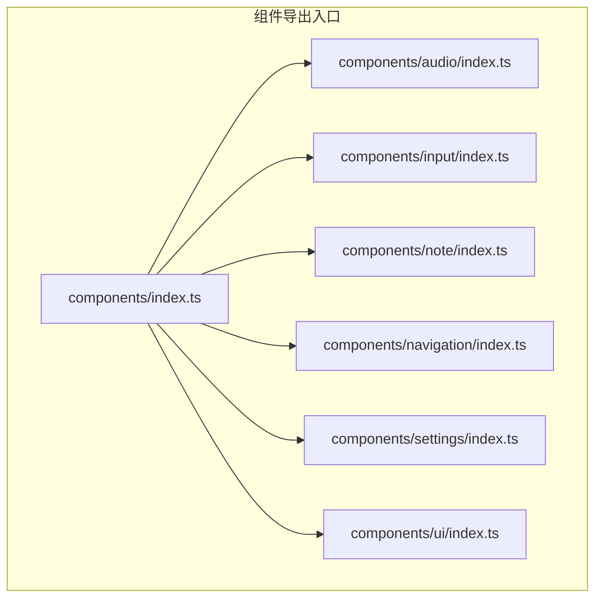
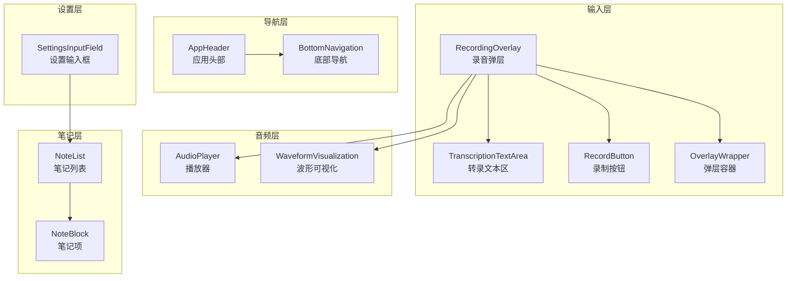
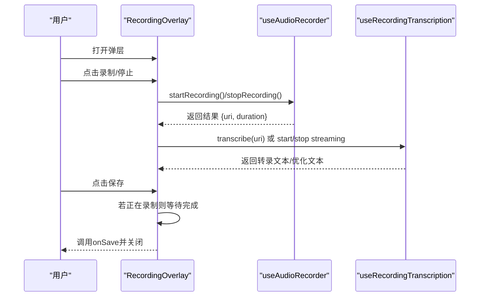
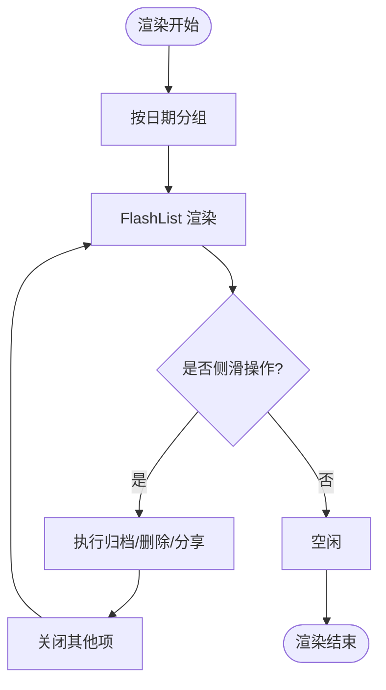
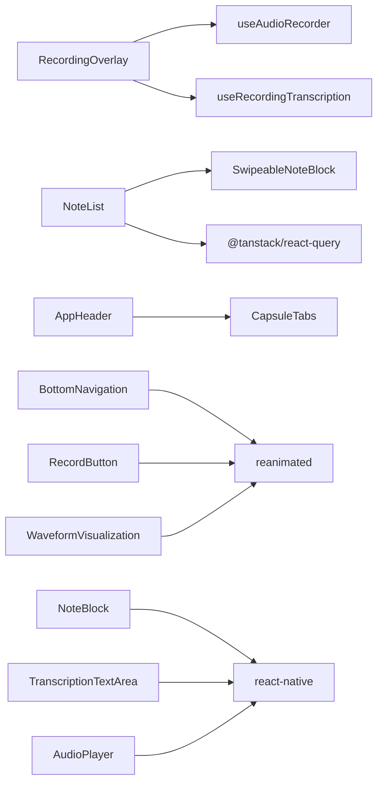

# 组件 API 接口

<cite>
**本文档引用的文件**
- [components/index.ts](file://components/index.ts)
- [components/audio/index.ts](file://components/audio/index.ts)
- [components/input/index.ts](file://components/input/index.ts)
- [components/note/index.ts](file://components/note/index.ts)
- [components/navigation/index.ts](file://components/navigation/index.ts)
- [components/settings/index.ts](file://components/settings/index.ts)
- [components/ui/index.ts](file://components/ui/index.ts)
- [components/audio/AudioPlayer.tsx](file://components/audio/AudioPlayer.tsx)
- [components/audio/WaveformVisualization.tsx](file://components/audio/WaveformVisualization.tsx)
- [components/input/TranscriptionTextArea.tsx](file://components/input/TranscriptionTextArea.tsx)
- [components/input/RecordingOverlay.tsx](file://components/input/RecordingOverlay.tsx)
- [components/input/RecordButton.tsx](file://components/input/RecordButton.tsx)
- [components/input/OverlayWrapper.tsx](file://components/input/OverlayWrapper.tsx)
- [components/note/NoteBlock.tsx](file://components/note/NoteBlock.tsx)
- [components/note/NoteList.tsx](file://components/note/NoteList.tsx)
- [components/navigation/AppHeader.tsx](file://components/navigation/AppHeader.tsx)
- [components/navigation/BottomNavigation.tsx](file://components/navigation/BottomNavigation.tsx)
- [components/ui/Button.tsx](file://components/ui/Button.tsx)
- [components/ui/Input.tsx](file://components/ui/Input.tsx)
- [components/settings/SettingsInputField.tsx](file://components/settings/SettingsInputField.tsx)
</cite>

## 目录
1. [简介](#简介)
2. [项目结构](#项目结构)
3. [核心组件](#核心组件)
4. [架构总览](#架构总览)
5. [详细组件分析](#详细组件分析)
6. [依赖关系分析](#依赖关系分析)
7. [性能考虑](#性能考虑)
8. [故障排除指南](#故障排除指南)
9. [结论](#结论)
10. [附录](#附录)

## 简介
本文件为 VoiceNote 项目的组件 API 接口文档，覆盖音频组件、输入组件、笔记组件、导航组件与通用 UI 组件的接口规范。内容包括 Props 类型、事件回调、样式定制选项、生命周期与状态管理要点、性能优化建议、响应式与无障碍支持说明，以及组件组合的最佳实践与常见用法示例。

## 项目结构
项目采用按功能域分层的组件组织方式：components 下按模块划分 audio、input、note、navigation、settings、ui 等子目录，并在各模块的 index.ts 中统一导出类型与组件，便于上层应用按需引入。

图表来源
- [components/index.ts:1-6](file://components/index.ts#L1-L6)
- [components/audio/index.ts:1-3](file://components/audio/index.ts#L1-L3)
- [components/input/index.ts:1-15](file://components/input/index.ts#L1-L15)
- [components/note/index.ts:1-40](file://components/note/index.ts#L1-L40)
- [components/navigation/index.ts:1-4](file://components/navigation/index.ts#L1-L4)
- [components/settings/index.ts:1-6](file://components/settings/index.ts#L1-L6)
- [components/ui/index.ts:1-9](file://components/ui/index.ts#L1-L9)

章节来源
- [components/index.ts:1-6](file://components/index.ts#L1-L6)
- [components/audio/index.ts:1-3](file://components/audio/index.ts#L1-L3)
- [components/input/index.ts:1-15](file://components/input/index.ts#L1-L15)
- [components/note/index.ts:1-40](file://components/note/index.ts#L1-L40)
- [components/navigation/index.ts:1-4](file://components/navigation/index.ts#L1-L4)
- [components/settings/index.ts:1-6](file://components/settings/index.ts#L1-L6)
- [components/ui/index.ts:1-9](file://components/ui/index.ts#L1-L9)

## 核心组件
本节概述各模块的关键组件及其职责：
- 音频模块：AudioPlayer（播放器）、WaveformVisualization（波形可视化）
- 输入模块：RecordingOverlay（录音弹层）、TranscriptionTextArea（转录文本区）、RecordButton（录制按钮）、OverlayWrapper（弹层容器）
- 笔记模块：NoteBlock（笔记项）、NoteList（笔记列表）
- 导航模块：AppHeader（应用头部）、BottomNavigation（底部导航）
- 设置模块：SettingsInputField（设置输入框）
- 通用 UI：Button（按钮）、Input（输入框）

章节来源
- [components/audio/index.ts:1-3](file://components/audio/index.ts#L1-L3)
- [components/input/index.ts:1-15](file://components/input/index.ts#L1-L15)
- [components/note/index.ts:1-40](file://components/note/index.ts#L1-L40)
- [components/navigation/index.ts:1-4](file://components/navigation/index.ts#L1-L4)
- [components/settings/index.ts:1-6](file://components/settings/index.ts#L1-L6)
- [components/ui/index.ts:1-9](file://components/ui/index.ts#L1-L9)

## 架构总览
下图展示主要组件之间的交互关系与数据流，体现从用户操作到状态更新再到 UI 呈现的完整链路。

图表来源
- [components/input/RecordingOverlay.tsx:17-21](file://components/input/RecordingOverlay.tsx#L17-L21)
- [components/input/TranscriptionTextArea.tsx:13-21](file://components/input/TranscriptionTextArea.tsx#L13-L21)
- [components/input/RecordButton.tsx:43-47](file://components/input/RecordButton.tsx#L43-L47)
- [components/input/OverlayWrapper.tsx:13-18](file://components/input/OverlayWrapper.tsx#L13-L18)
- [components/audio/AudioPlayer.tsx:9-13](file://components/audio/AudioPlayer.tsx#L9-L13)
- [components/audio/WaveformVisualization.tsx:23-30](file://components/audio/WaveformVisualization.tsx#L23-L30)
- [components/note/NoteList.tsx:12-24](file://components/note/NoteList.tsx#L12-L24)
- [components/note/NoteBlock.tsx:8-18](file://components/note/NoteBlock.tsx#L8-L18)
- [components/navigation/AppHeader.tsx:11-16](file://components/navigation/AppHeader.tsx#L11-L16)
- [components/navigation/BottomNavigation.tsx:17-23](file://components/navigation/BottomNavigation.tsx#L17-L23)
- [components/settings/SettingsInputField.tsx:7-13](file://components/settings/SettingsInputField.tsx#L7-L13)

## 详细组件分析

### 音频组件

#### AudioPlayer
- 功能：提供音频播放控制（播放/暂停/停止/跳转）与进度显示。
- 关键 Props
  - uri: string（必填）- 音频资源地址
  - title?: string - 标题
  - onPlaybackEnd?: () => void - 播放结束回调
- 状态与行为
  - 内部通过 useAudioRecorder 管理播放状态与进度
  - 支持拖动进度条跳转
- 样式定制
  - 背景色随系统主题切换（深色/浅色）
  - 进度条轨道与拇指颜色由主题色定义
- 无障碍与响应式
  - 使用 tamagui 组件，具备基础无障碍属性
  - 响应式尺寸通过 tamagui 尺寸变量控制

章节来源
- [components/audio/AudioPlayer.tsx:9-13](file://components/audio/AudioPlayer.tsx#L9-L13)
- [components/audio/AudioPlayer.tsx:15-131](file://components/audio/AudioPlayer.tsx#L15-L131)

#### WaveformVisualization
- 功能：基于 reanimated 的波形柱状动画，支持录制时随机波动或传入音频级别数组驱动。
- 关键 Props
  - isAnimating?: boolean - 是否启用录制动画
  - audioLevels?: number[] - 音频级别数组（0~1）
  - barCount?: number - 柱子数量，默认 40
  - minHeight?: number - 最小高度，默认 4
  - maxHeight?: number - 最大高度，默认 60
  - color?: string - 柱子颜色
- 性能与动画
  - 使用 useSharedValue + withRepeat/withSequence 实现流畅循环动画
  - 当传入 audioLevels 且非动画模式时，按级别即时插值更新高度
- 样式定制
  - 深浅主题自动适配颜色
  - 支持自定义颜色与柱子密度

章节来源
- [components/audio/WaveformVisualization.tsx:23-30](file://components/audio/WaveformVisualization.tsx#L23-L30)
- [components/audio/WaveformVisualization.tsx:32-119](file://components/audio/WaveformVisualization.tsx#L32-L119)

### 输入组件

#### RecordingOverlay
- 功能：录音弹层，集成录音控制、转录显示、编辑与保存流程；支持滑动取消/保存。
- 关键 Props
  - visible: boolean - 是否可见
  - onClose: () => void - 关闭回调
  - onSave: (data) => void - 保存回调，返回 { uri?, duration, title?, transcriptionText? }
- 状态与流程
  - 内置 isRecording/isPaused/duration 与 isTranscribing/isOptimizing 等状态
  - 支持流式转录与文件转录两种模式
  - 自动保存：若在录制中点击保存，会先完成录制再触发保存
- 错误处理
  - 录音错误与转录错误分别提示，转录错误支持重试
- 无障碍与交互
  - 提供取消/保存按钮与滑动手势
  - 使用 haptics 提升触觉反馈

图表来源
- [components/input/RecordingOverlay.tsx:75-282](file://components/input/RecordingOverlay.tsx#L75-L282)
- [components/input/RecordingOverlay.tsx:299-303](file://components/input/RecordingOverlay.tsx#L299-L303)

章节来源
- [components/input/RecordingOverlay.tsx:17-21](file://components/input/RecordingOverlay.tsx#L17-L21)
- [components/input/RecordingOverlay.tsx:75-419](file://components/input/RecordingOverlay.tsx#L75-L419)

#### TranscriptionTextArea
- 功能：转录文本展示与编辑区域，支持“正在转录”、“优化中”状态与光标闪烁。
- 关键 Props
  - text: string - 显示文本
  - isEditing: boolean - 是否处于编辑态
  - isTranscribing: boolean - 是否正在转录
  - isRecording: boolean - 是否正在录制
  - isOptimizing?: boolean - 是否正在优化
  - placeholder?: string - 占位符
  - onTextChange: (text: string) => void - 文本变更回调
- 行为特性
  - 文本更新后自动滚动到底部
  - 编辑态使用原生 TextInput，非编辑态使用 Text 展示
  - 优化中显示旋转指示器与文案
- 无障碍与响应式
  - 使用 tamagui 主题包裹，适配明暗主题

章节来源
- [components/input/TranscriptionTextArea.tsx:13-21](file://components/input/TranscriptionTextArea.tsx#L13-L21)
- [components/input/TranscriptionTextArea.tsx:64-145](file://components/input/TranscriptionTextArea.tsx#L64-L145)

#### RecordButton
- 功能：录制主按钮，支持按下缩放、录制时脉冲动画与方形内核。
- 关键 Props
  - isRecording: boolean - 录制状态
  - onPress: () => void - 按下回调
  - disabled?: boolean - 禁用状态
- 动画与交互
  - 使用 reanimated 实现脉冲、缩放与圆角变化
  - 按下时有缩放反馈与 haptic 反馈
- 样式定制
  - 深浅主题自动切换背景色
  - 录制时内核变为方形

章节来源
- [components/input/RecordButton.tsx:43-47](file://components/input/RecordButton.tsx#L43-L47)
- [components/input/RecordButton.tsx:49-130](file://components/input/RecordButton.tsx#L49-L130)

#### OverlayWrapper
- 功能：通用弹层容器，支持显隐动画与遮罩点击关闭。
- 关键 Props
  - visible: boolean - 是否可见
  - onClose: () => void - 关闭回调
  - children: ReactNode - 子元素
  - height?: string|number - 弹层高度，默认 60%
- 动画与生命周期
  - 使用 reanimated 在挂载/卸载时执行平移动画
  - 卸载完成后清理 DOM，避免内存泄漏

章节来源
- [components/input/OverlayWrapper.tsx:13-18](file://components/input/OverlayWrapper.tsx#L13-L18)
- [components/input/OverlayWrapper.tsx:20-54](file://components/input/OverlayWrapper.tsx#L20-L54)

### 笔记组件

#### NoteBlock
- 功能：单个笔记项卡片，支持选择、长按、附件徽章与时间戳。
- 关键 Props
  - note: Note - 笔记对象
  - index: number - 列表索引
  - isSelected: boolean - 是否选中
  - isSelectionMode: boolean - 是否处于选择模式
  - onPress: () => void - 点击回调
  - onLongPress: () => void - 长按回调
  - attachmentCount?: number - 附件数量
  - 可选操作：archive/delete（通过父级传递）
- 无障碍与交互
  - 设置 accessibilityRole 与 accessibilityLabel
  - 支持长按延迟 500ms

章节来源
- [components/note/NoteBlock.tsx:8-18](file://components/note/NoteBlock.tsx#L8-L18)
- [components/note/NoteBlock.tsx:31-117](file://components/note/NoteBlock.tsx#L31-L117)

#### NoteList
- 功能：带日期分组的笔记列表，支持下拉刷新、侧滑操作与附件计数查询。
- 关键 Props
  - notes: Note[]
  - isLoading?: boolean
  - isSelectionMode: boolean
  - selectedIds: Set<number>
  - onNotePress/onNoteLongPress: 回调
  - onArchive/onDelete: 回调
  - onShare?: 回调
  - onRefresh?: 回调
  - hideArchiveAction?: boolean
- 数据分组
  - 按“今天/昨天/本周/本月/今年/去年/更早”等分组
- 性能优化
  - 使用 FlashList 渲染长列表
  - 使用 react-query 查询附件计数，按需启用

图表来源
- [components/note/NoteList.tsx:80-97](file://components/note/NoteList.tsx#L80-L97)
- [components/note/NoteList.tsx:109-204](file://components/note/NoteList.tsx#L109-L204)

章节来源
- [components/note/NoteList.tsx:12-24](file://components/note/NoteList.tsx#L12-L24)
- [components/note/NoteList.tsx:109-240](file://components/note/NoteList.tsx#L109-L240)

### 导航组件

#### AppHeader
- 功能：应用头部，包含胶囊标签页与搜索/更多按钮。
- 关键 Props
  - activeView: 'records' | 'inspiration'
  - onViewChange: (view) => void
  - onSearchPress?: () => void
  - onMorePress?: () => void
- 视图切换
  - 通过 CapsuleTabs 切换 records/inspiration

章节来源
- [components/navigation/AppHeader.tsx:11-16](file://components/navigation/AppHeader.tsx#L11-L16)
- [components/navigation/AppHeader.tsx:18-58](file://components/navigation/AppHeader.tsx#L18-L58)

#### BottomNavigation
- 功能：底部导航栏，包含录制主按钮与相机/附件/文本入口。
- 关键 Props
  - onRecord/onCamera/onAttachment/onText: 回调
  - isHidden?: boolean - 是否隐藏
- 动画与交互
  - 录制按钮按下缩放与红点呼吸动画
  - 容器根据 isHidden 执行进入/退出动画

章节来源
- [components/navigation/BottomNavigation.tsx:17-23](file://components/navigation/BottomNavigation.tsx#L17-L23)
- [components/navigation/BottomNavigation.tsx:25-110](file://components/navigation/BottomNavigation.tsx#L25-L110)

### 设置组件

#### SettingsInputField
- 功能：设置页面输入字段，支持密码显隐与聚焦态高亮。
- 关键 Props
  - label: string
  - value: string
  - onChangeText: (text) => void
  - placeholder?: string
  - secureTextEntry?: boolean
- 无障碍与交互
  - 自动禁用首字母大写与拼写纠正
  - 聚焦/失焦改变边框样式

章节来源
- [components/settings/SettingsInputField.tsx:7-13](file://components/settings/SettingsInputField.tsx#L7-L13)
- [components/settings/SettingsInputField.tsx:15-95](file://components/settings/SettingsInputField.tsx#L15-L95)

### 通用 UI 组件

#### Button
- 功能：按钮组件，支持多种变体与尺寸。
- 关键 Props
  - variant?: 'primary'|'secondary'|'outline'|'ghost'|'danger'
  - size?: 'sm'|'md'|'lg'
- 默认行为
  - 默认变体：primary；默认尺寸：md

章节来源
- [components/ui/Button.tsx:4-54](file://components/ui/Button.tsx#L4-L54)

#### Input
- 功能：输入框组件，支持尺寸、外观与错误态。
- 关键 Props
  - size?: 'sm'|'md'|'lg'
  - variant?: 'filled'|'outlined'
  - error?: boolean
- 默认行为
  - 默认尺寸：md

章节来源
- [components/ui/Input.tsx:4-59](file://components/ui/Input.tsx#L4-L59)

## 依赖关系分析
- 组件间耦合
  - RecordingOverlay 依赖 useAudioRecorder 与 useRecordingTranscription，形成“录音-转录-编辑-保存”的闭环
  - NoteList 依赖 SwipeableNoteBlock 与 react-query 查询附件计数，实现高性能列表
  - AppHeader 依赖 CapsuleTabs，BottomNavigation 作为全局入口
- 外部依赖
  - reanimated 用于复杂动画
  - tamagui 用于主题与布局
  - react-native-gesture-handler 用于侧滑
  - @shopify/flash-list 用于高性能列表
  - react-i18next 用于国际化文案

图表来源
- [components/input/RecordingOverlay.tsx:7-102](file://components/input/RecordingOverlay.tsx#L7-L102)
- [components/note/NoteList.tsx:10-137](file://components/note/NoteList.tsx#L10-L137)
- [components/navigation/AppHeader.tsx:7](file://components/navigation/AppHeader.tsx#L7)
- [components/navigation/BottomNavigation.tsx:7-15](file://components/navigation/BottomNavigation.tsx#L7-L15)
- [components/note/NoteBlock.tsx:1-6](file://components/note/NoteBlock.tsx#L1-L6)
- [components/input/RecordButton.tsx:1-12](file://components/input/RecordButton.tsx#L1-L12)
- [components/input/TranscriptionTextArea.tsx:1-11](file://components/input/TranscriptionTextArea.tsx#L1-L11)
- [components/audio/AudioPlayer.tsx:1-7](file://components/audio/AudioPlayer.tsx#L1-L7)
- [components/audio/WaveformVisualization.tsx:1-10](file://components/audio/WaveformVisualization.tsx#L1-L10)

## 性能考虑
- 列表渲染
  - 使用 FlashList 替代 FlatList，减少滚动卡顿
  - 对附件计数使用 react-query 并按需启用，避免重复请求
- 动画性能
  - 使用 reanimated 的 useSharedValue 与 withTiming/withRepeat，避免 JS 线程阻塞
  - 波形动画按柱子数量与级别动态插值，避免过度计算
- 状态管理
  - 录音/转录状态集中于 hooks，避免组件内部冗余状态
  - 使用 ref 缓存 resetTranscription 等函数，降低依赖变更带来的重渲染
- 无障碍与响应式
  - 使用 tamagui 主题与无障碍属性，确保不同设备与系统下的可用性

## 故障排除指南
- 录音失败
  - 检查权限与设备状态，查看错误提示并引导重试
  - 流式转录模式下注意停止流后再进行后续操作
- 转录错误
  - 文件模式下可重试 transcribe；无配置时提示 ASR 未配置
- 列表不刷新
  - 确认 onRefresh 回调正确触发，isLoading 状态与 keyExtractor 正确
- 弹层无法关闭
  - 检查 visible 与 onClose 逻辑，OverlayWrapper 在关闭动画结束后会卸载节点

章节来源
- [components/input/RecordingOverlay.tsx:178-222](file://components/input/RecordingOverlay.tsx#L178-L222)
- [components/input/RecordingOverlay.tsx:291-297](file://components/input/RecordingOverlay.tsx#L291-L297)
- [components/note/NoteList.tsx:193-201](file://components/note/NoteList.tsx#L193-L201)
- [components/input/OverlayWrapper.tsx:34-42](file://components/input/OverlayWrapper.tsx#L34-L42)

## 结论
VoiceNote 的组件体系以模块化与可复用为核心，结合 reanimated 与 tamagui 提供了良好的动画与主题体验。通过清晰的 Props 接口、完善的错误处理与性能优化策略，组件可在多场景下稳定运行。建议在业务扩展时遵循现有接口风格与状态管理模式，保持一致的开发体验与维护成本。

## 附录

### 组件组合最佳实践
- 录音工作流
  - 使用 RecordingOverlay 承载录音/转录/编辑/保存全流程
  - 在保存回调中统一处理 uri、duration 与 transcriptionText
- 笔记展示
  - 使用 NoteList 展示笔记，结合 SwipeableNoteBlock 实现侧滑操作
  - 通过 react-query 缓存附件计数，提升列表性能
- 主题与无障碍
  - 优先使用 tamagui 组件与主题变量，确保明暗主题一致性
  - 为关键交互设置 accessibilityRole 与无障碍标签

### 常见用法示例（路径指引）
- 录音弹层
  - [RecordingOverlay Props 与回调:17-21](file://components/input/RecordingOverlay.tsx#L17-L21)
  - [录音/转录状态管理:75-102](file://components/input/RecordingOverlay.tsx#L75-L102)
- 笔记列表
  - [NoteList Props 与分组逻辑:12-97](file://components/note/NoteList.tsx#L12-L97)
  - [FlashList 渲染与侧滑操作:159-181](file://components/note/NoteList.tsx#L159-L181)
- 导航头部
  - [AppHeader Props 与视图切换:11-30](file://components/navigation/AppHeader.tsx#L11-L30)
- 底部导航
  - [BottomNavigation Props 与动画:17-52](file://components/navigation/BottomNavigation.tsx#L17-L52)