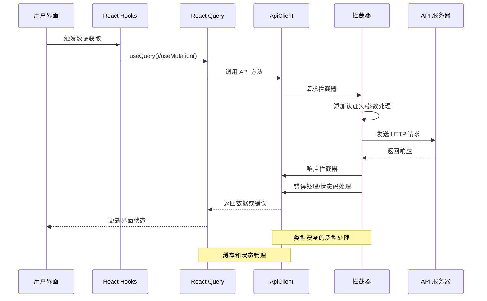
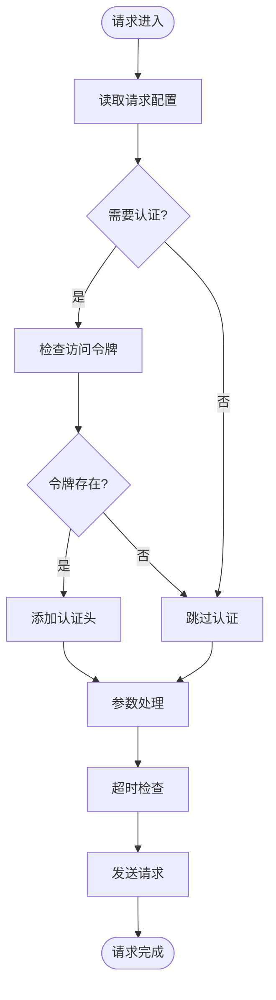
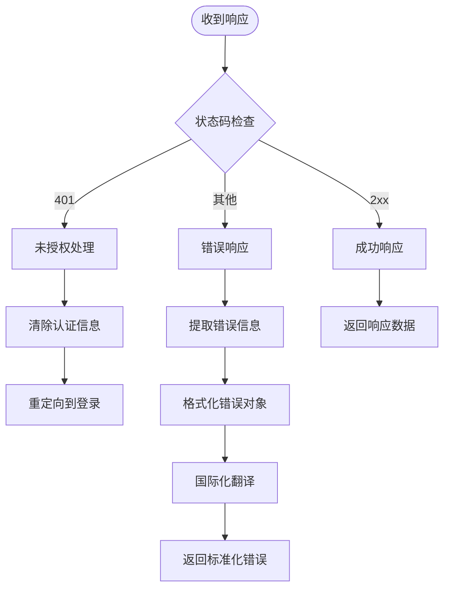
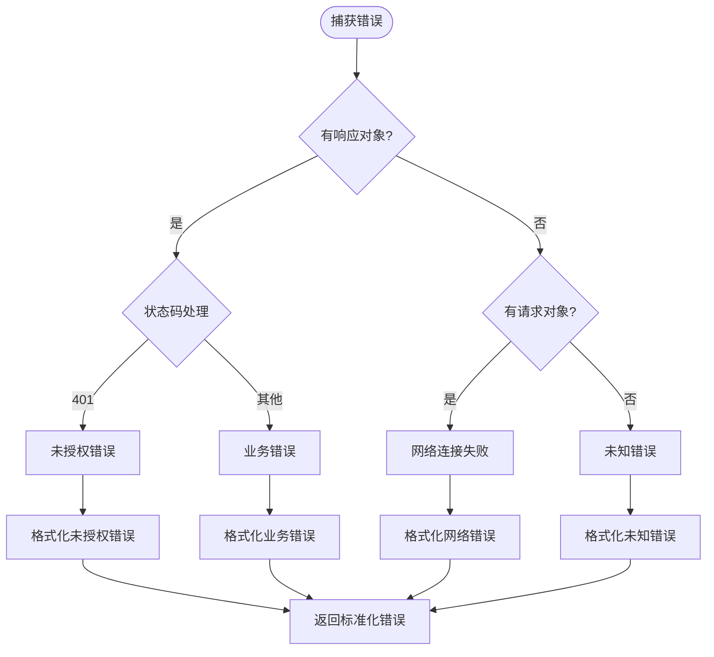
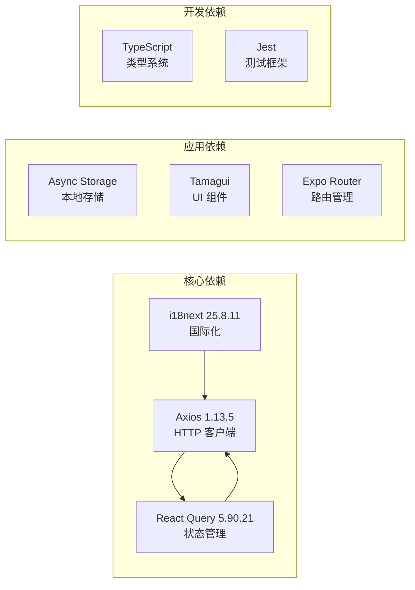
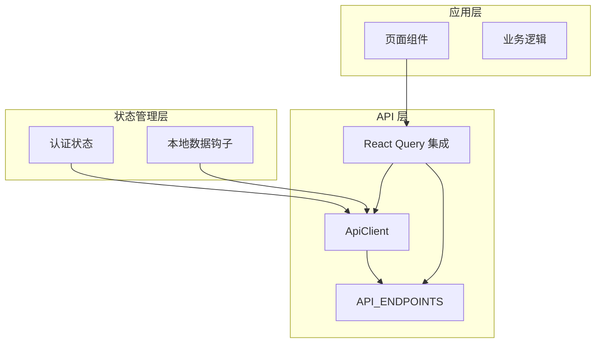

# API 客户端架构

<cite>
**本文档引用的文件**
- [services/api/client.ts](file://services/api/client.ts)
- [services/api/endpoints.ts](file://services/api/endpoints.ts)
- [services/api/queries.ts](file://services/api/queries.ts)
- [services/api/index.ts](file://services/api/index.ts)
- [package.json](file://package.json)
- [i18n/locales/en/errors.json](file://i18n/locales/en/errors.json)
- [store/useAuthStore.ts](file://store/useAuthStore.ts)
- [hooks/useNotes.ts](file://hooks/useNotes.ts)
- [app/note/[id].tsx](file://app/note/[id].tsx)
</cite>

## 目录
1. [简介](#简介)
2. [项目结构](#项目结构)
3. [核心组件](#核心组件)
4. [架构概览](#架构概览)
5. [详细组件分析](#详细组件分析)
6. [依赖关系分析](#依赖关系分析)
7. [性能考虑](#性能考虑)
8. [故障排除指南](#故障排除指南)
9. [结论](#结论)
10. [附录](#附录)

## 简介

VoiceNote 项目采用基于 Axios 的现代 API 客户端架构，为移动端应用提供统一的网络通信层。该架构通过类型安全的设计、完善的错误处理机制和灵活的配置选项，确保了 API 调用的一致性和可靠性。

本架构的核心特点包括：
- 基于 Axios 的轻量级 HTTP 客户端
- 类型安全的泛型 API 方法
- 国际化的错误消息处理
- 集成 React Query 的数据获取和缓存管理
- 模块化的端点管理和 URL 构建策略

## 项目结构

VoiceNote 项目的 API 客户端架构主要分布在以下目录结构中：

```mermaid
graph TB
subgraph "API 客户端层"
A[services/api/client.ts<br/>核心客户端类]
B[services/api/endpoints.ts<br/>端点定义]
C[services/api/queries.ts<br/>React Query 集成]
D[services/api/index.ts<br/>导出入口]
end
subgraph "依赖层"
E[axios<br/>HTTP 客户端]
F[i18next<br/>国际化]
G[@tanstack/react-query<br/>状态管理]
end
subgraph "应用层"
H[store/useAuthStore.ts<br/>认证状态]
I[hooks/useNotes.ts<br/>本地数据钩子]
J[app/note/[id].tsx<br/>页面组件]
end
A --> E
A --> F
C --> G
C --> A
C --> B
D --> A
D --> B
D --> C
H --> A
I --> A
J --> C
```

**图表来源**
- [services/api/client.ts:1-104](file://services/api/client.ts#L1-L104)
- [services/api/endpoints.ts:1-61](file://services/api/endpoints.ts#L1-L61)
- [services/api/queries.ts:1-100](file://services/api/queries.ts#L1-L100)

**章节来源**
- [services/api/client.ts:1-104](file://services/api/client.ts#L1-L104)
- [services/api/endpoints.ts:1-61](file://services/api/endpoints.ts#L1-L61)
- [services/api/queries.ts:1-100](file://services/api/queries.ts#L1-L100)

## 核心组件

### ApiClient 类设计

ApiClient 是整个 API 客户端架构的核心，采用单例模式确保全局一致性。该类封装了所有 HTTP 通信逻辑，并提供了类型安全的 API 方法。

#### 核心特性

1. **配置化初始化**：支持环境变量配置的基础 URL 和超时设置
2. **拦截器系统**：内置请求和响应拦截器处理通用逻辑
3. **类型安全接口**：所有 API 方法都支持 TypeScript 泛型约束
4. **错误处理机制**：统一的错误格式化和国际化消息处理

#### 关键配置

- **基础 URL**：通过 `EXPO_PUBLIC_API_BASE_URL` 环境变量配置，默认指向本地开发服务器
- **超时设置**：30秒的请求超时时间，平衡用户体验和资源占用
- **内容类型**：默认 JSON 内容类型，支持 RESTful API 交互

**章节来源**
- [services/api/client.ts:12-25](file://services/api/client.ts#L12-L25)
- [services/api/client.ts:4](file://services/api/client.ts#L4)
- [services/api/client.ts:18](file://services/api/client.ts#L18)

### API 端点管理系统

端点管理系统采用声明式设计，将所有 API 端点集中管理，提供类型安全的 URL 构建和参数处理。

#### 端点分类

系统定义了完整的 API 端点分类体系：

1. **认证相关**：登录、注册、登出、令牌刷新、用户信息
2. **笔记管理**：笔记列表、详情、创建、更新、删除、搜索
3. **录音管理**：录音列表、详情、关联查询、上传、删除
4. **媒体管理**：媒体文件管理、上传、删除
5. **同步服务**：同步状态检查、推送、拉取
6. **用户配置**：个人资料、设置管理
7. **分享功能**：分享创建、详情、删除、预签名 URL

#### 动态参数支持

部分端点支持动态参数构建，如：
- `(id: number) => `/notes/${id}``
- `(noteId: number) => `/notes/${noteId}/recordings``
- `(id: string) => `/shares/${id}/upload-url``

**章节来源**
- [services/api/endpoints.ts:1-61](file://services/api/endpoints.ts#L1-L61)

### React Query 集成

通过集成 React Query，API 客户端获得了强大的数据获取、缓存和状态管理能力。

#### 查询键设计

查询键采用层级化设计，支持精确的缓存失效和更新：
- `['notes']` - 笔记列表
- `['notes', id]` - 单个笔记详情
- `['notes', noteId, 'recordings']` - 笔记关联的录音列表

#### 数据获取策略

- **自动缓存**：React Query 自动管理缓存生命周期
- **智能刷新**：基于查询键的精确失效机制
- **乐观更新**：支持本地状态的乐观更新模式

**章节来源**
- [services/api/queries.ts:5-17](file://services/api/queries.ts#L5-L17)
- [services/api/queries.ts:20-44](file://services/api/queries.ts#L20-L44)

## 架构概览

VoiceNote 的 API 客户端架构采用分层设计，确保各层职责清晰、耦合度低。



**图表来源**
- [services/api/client.ts:27-54](file://services/api/client.ts#L27-L54)
- [services/api/queries.ts:20-44](file://services/api/queries.ts#L20-L44)

**章节来源**
- [services/api/client.ts:27-54](file://services/api/client.ts#L27-L54)
- [services/api/queries.ts:1-100](file://services/api/queries.ts#L1-L100)

## 详细组件分析

### 请求拦截器实现

请求拦截器负责在请求发送前进行必要的预处理，包括认证信息注入和参数标准化。



**图表来源**
- [services/api/client.ts:29-37](file://services/api/client.ts#L29-L37)

#### 认证处理策略

当前实现预留了认证令牌注入功能，支持 Bearer Token 认证模式。认证令牌从异步存储中获取，确保安全性。

#### 参数处理机制

拦截器对请求参数进行标准化处理，确保所有查询参数都通过 `params` 对象传递，避免 URL 拼接错误。

**章节来源**
- [services/api/client.ts:29-41](file://services/api/client.ts#L29-L41)

### 响应拦截器设计

响应拦截器负责处理服务器响应和错误情况，提供统一的错误处理机制。



**图表来源**
- [services/api/client.ts:43-53](file://services/api/client.ts#L43-L53)

#### 错误分类处理

系统实现了三层错误处理机制：

1. **响应错误**：服务器返回的业务错误，包含具体的消息和状态码
2. **网络错误**：无法连接到服务器的情况
3. **未知错误**：其他类型的异常情况

#### 国际化支持

所有错误消息都通过 i18n 系统处理，支持多语言环境下的错误提示。

**章节来源**
- [services/api/client.ts:46-75](file://services/api/client.ts#L46-L75)
- [i18n/locales/en/errors.json:15-17](file://i18n/locales/en/errors.json#L15-L17)

### 错误处理机制

错误处理机制是 API 客户端的重要组成部分，确保应用程序能够优雅地处理各种异常情况。

#### 错误对象结构

```typescript
interface ApiError {
  message: string;  // 错误消息
  code?: string;    // 错误代码
  status?: number;  // HTTP 状态码
}
```

#### 处理流程



**图表来源**
- [services/api/client.ts:56-75](file://services/api/client.ts#L56-L75)

**章节来源**
- [services/api/client.ts:6-10](file://services/api/client.ts#L6-L10)
- [services/api/client.ts:56-75](file://services/api/client.ts#L56-L75)

### API 方法实现

ApiClient 提供了标准的 HTTP 方法包装，支持完整的 RESTful 操作。

#### 类型安全设计

每个 API 方法都支持 TypeScript 泛型，确保返回数据的类型安全：

- `get<T>(url: string, params?: object) => Promise<AxiosResponse<T>>`
- `post<T>(url: string, data?: object) => Promise<AxiosResponse<T>>`
- `put<T>(url: string, data?: object) => Promise<AxiosResponse<T>>`
- `patch<T>(url: string, data?: object) => Promise<AxiosResponse<T>>`
- `delete<T>(url: string) => Promise<AxiosResponse<T>>`

#### 参数序列化策略

系统采用 Axios 默认的参数序列化策略：
- 查询参数通过 `params` 对象传递
- 请求体数据自动序列化为 JSON
- 支持复杂的嵌套对象和数组参数

**章节来源**
- [services/api/client.ts:81-99](file://services/api/client.ts#L81-L99)

### 使用示例和最佳实践

#### 基础使用模式

```typescript
// 获取笔记列表
const { data, isLoading, error } = useQuery({
  queryKey: ['notes'],
  queryFn: () => apiClient.get(API_ENDPOINTS.notes.list)
});

// 创建新笔记
const createNoteMutation = useMutation({
  mutationFn: (newNote) => apiClient.post(API_ENDPOINTS.notes.create, newNote),
  onSuccess: () => {
    // 刷新相关查询
    queryClient.invalidateQueries({ queryKey: ['notes'] });
  }
});
```

#### 最佳实践建议

1. **类型安全**：始终指定泛型参数确保编译时类型检查
2. **错误处理**：在组件层面处理具体的错误情况
3. **缓存策略**：合理使用查询键确保缓存的有效性
4. **乐观更新**：对于写操作考虑使用乐观更新提升用户体验

**章节来源**
- [services/api/queries.ts:20-44](file://services/api/queries.ts#L20-L44)

## 依赖关系分析

### 外部依赖

VoiceNote API 客户端依赖以下关键外部库：



**图表来源**
- [package.json:20-62](file://package.json#L20-L62)

### 内部模块依赖



**图表来源**
- [services/api/index.ts:1-4](file://services/api/index.ts#L1-L4)
- [store/useAuthStore.ts:1-82](file://store/useAuthStore.ts#L1-L82)

**章节来源**
- [package.json:20-62](file://package.json#L20-L62)
- [services/api/index.ts:1-4](file://services/api/index.ts#L1-L4)

## 性能考虑

### 连接池管理

Axios 默认使用浏览器内置的连接池管理机制，无需额外配置即可获得高效的连接复用。对于移动应用场景，建议：

1. **合理设置超时**：30秒的超时时间平衡了响应速度和稳定性
2. **避免并发过多**：控制同时进行的请求数量，防止资源耗尽
3. **利用缓存**：充分利用 React Query 的缓存机制减少重复请求

### 网络优化策略

1. **请求合并**：对于频繁的相似请求考虑合并策略
2. **数据压缩**：启用服务器端的数据压缩减少传输体积
3. **CDN 加速**：静态资源通过 CDN 分发提升加载速度

### 内存管理

1. **及时清理**：组件卸载时清理未完成的请求
2. **缓存清理**：定期清理过期的缓存数据
3. **内存泄漏防护**：避免闭包中的循环引用

## 故障排除指南

### 常见问题诊断

#### 网络连接问题

**症状**：请求超时或无响应
**排查步骤**：
1. 检查 `EXPO_PUBLIC_API_BASE_URL` 环境变量配置
2. 验证网络连接状态
3. 查看防火墙和代理设置

#### 认证失败问题

**症状**：401 未授权错误
**排查步骤**：
1. 检查访问令牌的有效性
2. 验证令牌格式和过期时间
3. 确认服务器端的认证配置

#### 数据类型错误

**症状**：TypeScript 编译错误
**排查步骤**：
1. 确保 API 方法调用时指定正确的泛型参数
2. 验证后端返回数据结构的一致性
3. 检查接口定义的完整性

### 调试工具配置

#### 开发环境调试

```typescript
// 启用 Axios 调试日志
if (__DEV__) {
  axios.interceptors.request.use((config) => {
    console.log('Request:', config);
    return config;
  });
  
  axios.interceptors.response.use(
    (response) => {
      console.log('Response:', response);
      return response;
    },
    (error) => {
      console.log('Error:', error);
      return Promise.reject(error);
    }
  );
}
```

#### 错误监控集成

建议集成错误监控服务（如 Sentry）来捕获和分析生产环境中的错误：

```typescript
// 错误上报配置
const captureError = (error: ApiError, context: any) => {
  if (window.Sentry) {
    window.Sentry.captureException(error, {
      contexts: { api: context }
    });
  }
};
```

**章节来源**
- [services/api/client.ts:56-75](file://services/api/client.ts#L56-L75)
- [store/useAuthStore.ts:29-81](file://store/useAuthStore.ts#L29-L81)

## 结论

VoiceNote 的 API 客户端架构展现了现代移动端应用的最佳实践：

1. **模块化设计**：清晰的分层架构确保了代码的可维护性
2. **类型安全**：完整的 TypeScript 支持提供了编译时的错误预防
3. **错误处理**：完善的错误处理机制提升了应用的健壮性
4. **性能优化**：合理的缓存策略和网络配置确保了良好的用户体验

该架构为后续的功能扩展奠定了坚实的基础，支持快速迭代和持续改进。

## 附录

### API 端点参考

| 分类 | 端点 | 方法 | 描述 |
|------|------|------|------|
| 认证 | `/auth/login` | POST | 用户登录 |
| 认证 | `/auth/register` | POST | 用户注册 |
| 笔记 | `/notes` | GET | 获取笔记列表 |
| 笔记 | `/notes/:id` | GET | 获取笔记详情 |
| 笔记 | `/notes` | POST | 创建新笔记 |
| 录音 | `/recordings/upload` | POST | 上传录音文件 |
| 媒体 | `/media/upload` | POST | 上传媒体文件 |

### 配置选项说明

| 配置项 | 默认值 | 说明 |
|--------|--------|------|
| `EXPO_PUBLIC_API_BASE_URL` | `http://localhost:3000/api` | API 服务器基础 URL |
| `timeout` | 30000ms | 请求超时时间（毫秒） |
| `Content-Type` | `application/json` | 默认请求内容类型 |

### 监控指标建议

1. **请求成功率**：跟踪 API 调用的成功率
2. **响应时间**：监控不同端点的平均响应时间
3. **错误率**：统计各类错误的发生频率
4. **缓存命中率**：评估缓存策略的效果