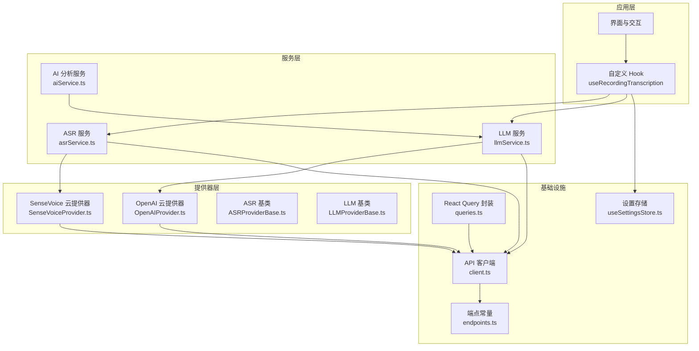
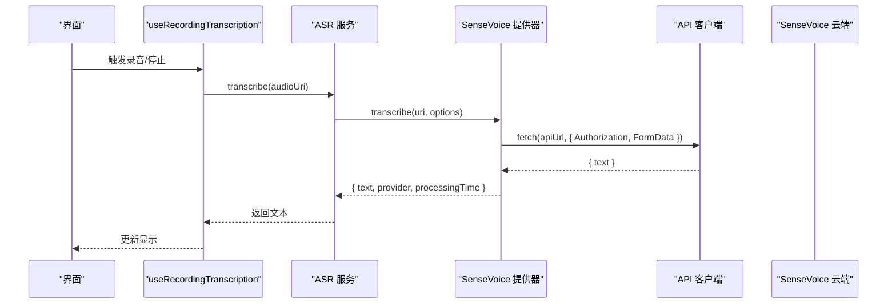
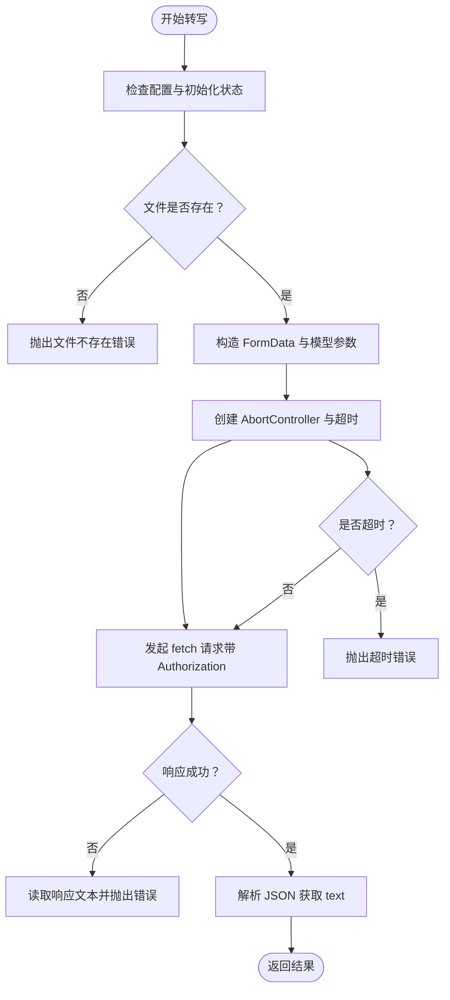
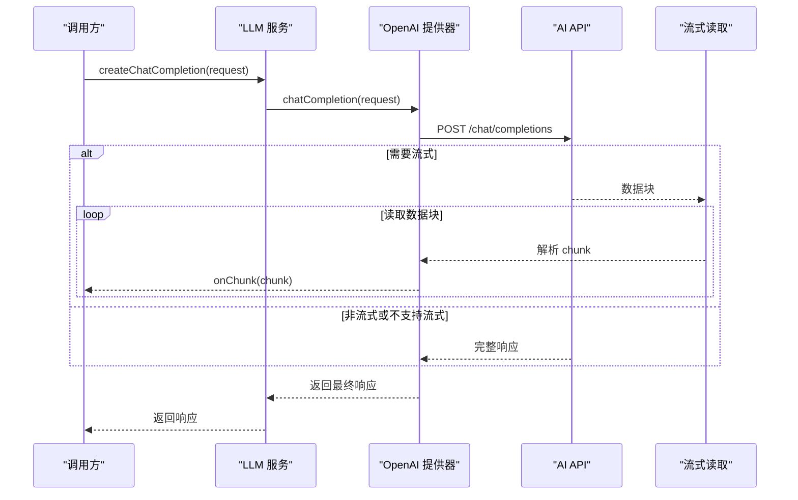
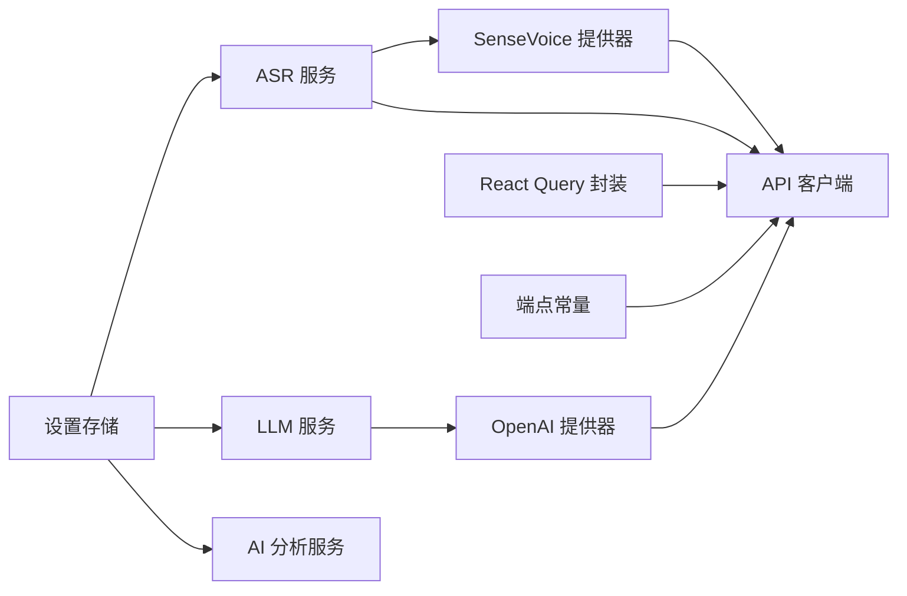

# API 集成

<cite>
**本文引用的文件**
- [services/api/client.ts](file://services/api/client.ts)
- [services/api/endpoints.ts](file://services/api/endpoints.ts)
- [services/api/queries.ts](file://services/api/queries.ts)
- [services/asr/providers/cloud/SenseVoiceProvider.ts](file://services/asr/providers/cloud/SenseVoiceProvider.ts)
- [services/asr/asrService.ts](file://services/asr/asrService.ts)
- [services/llm/providers/cloud/OpenAIProvider.ts](file://services/llm/providers/cloud/OpenAIProvider.ts)
- [services/llm/llmService.ts](file://services/llm/llmService.ts)
- [services/ai/aiService.ts](file://services/ai/aiService.ts)
- [hooks/useRecordingTranscription.ts](file://hooks/useRecordingTranscription.ts)
- [store/useSettingsStore.ts](file://store/useSettingsStore.ts)
- [services/asr/providers/base/ASRProviderBase.ts](file://services/asr/providers/base/ASRProviderBase.ts)
- [services/llm/providers/base/LLMProviderBase.ts](file://services/llm/providers/base/LLMProviderBase.ts)
- [services/asr/providers/types.ts](file://services/asr/providers/types.ts)
- [types/asr.ts](file://types/asr.ts)
- [types/llm.ts](file://types/llm.ts)
</cite>

## 目录
1. [简介](#简介)
2. [项目结构](#项目结构)
3. [核心组件](#核心组件)
4. [架构总览](#架构总览)
5. [详细组件分析](#详细组件分析)
6. [依赖关系分析](#依赖关系分析)
7. [性能考量](#性能考量)
8. [故障排查指南](#故障排查指南)
9. [结论](#结论)
10. [附录](#附录)

## 简介
本文件面向 VoiceNote 的 API 集成，系统性说明云端服务（SenseVoice 语音转录与 OpenAI 兼容 LLM）的集成方式与实现细节。内容涵盖：
- API 客户端设计、请求/响应处理与错误管理
- 认证机制、密钥管理与安全考虑
- 超时控制、网络状态与重试策略
- 本地与云端服务的协调与数据同步
- 最佳实践、性能优化与调试监控
- 版本管理与向后兼容策略
- 新 API 集成流程与测试方法

## 项目结构
VoiceNote 将 API 集成按“服务层”组织，分为：
- 通用 API 客户端与查询封装：统一的 HTTP 客户端、端点常量与 React Query 查询/变更
- ASR 语音转录：云 SenseVoice 提供器与本地 Moonshine 提供器抽象
- LLM 大语言模型：云 OpenAI 兼容提供器与本地 llama.cpp 提供器抽象
- AI 分析：基于 LLM 的笔记分析服务
- 设置与状态：集中管理 ASR/LLM 的配置、提供器选择与持久化

图表来源
- [services/api/client.ts:1-104](file://services/api/client.ts#L1-L104)
- [services/api/endpoints.ts:1-61](file://services/api/endpoints.ts#L1-L61)
- [services/api/queries.ts:1-100](file://services/api/queries.ts#L1-L100)
- [services/asr/asrService.ts:1-74](file://services/asr/asrService.ts#L1-L74)
- [services/llm/llmService.ts:1-61](file://services/llm/llmService.ts#L1-L61)
- [services/ai/aiService.ts:1-163](file://services/ai/aiService.ts#L1-L163)
- [services/asr/providers/cloud/SenseVoiceProvider.ts:1-167](file://services/asr/providers/cloud/SenseVoiceProvider.ts#L1-L167)
- [services/llm/providers/cloud/OpenAIProvider.ts:1-260](file://services/llm/providers/cloud/OpenAIProvider.ts#L1-L260)
- [hooks/useRecordingTranscription.ts:1-199](file://hooks/useRecordingTranscription.ts#L1-L199)
- [store/useSettingsStore.ts:1-218](file://store/useSettingsStore.ts#L1-L218)

章节来源
- [services/api/client.ts:1-104](file://services/api/client.ts#L1-L104)
- [services/api/endpoints.ts:1-61](file://services/api/endpoints.ts#L1-L61)
- [services/api/queries.ts:1-100](file://services/api/queries.ts#L1-L100)
- [store/useSettingsStore.ts:1-218](file://store/useSettingsStore.ts#L1-L218)

## 核心组件
- API 客户端与端点
  - 统一的 Axios 实例，内置超时、拦截器与错误映射
  - 端点常量集中管理 REST 路由
  - React Query 封装用于数据获取、缓存与失效
- ASR 服务
  - 云 SenseVoice 提供器：非流式文件上传转写
  - 本地 Moonshine 提供器：实时流式转写（通过其他模块）
  - 统一服务函数封装配置校验、文件存在性检查与超时控制
- LLM 服务
  - 云 OpenAI 兼容提供器：支持流式与非流式对话
  - 统一服务函数：根据设置选择提供器并调用
- AI 分析服务
  - 基于 LLM 的笔记分析，负责提示词构建、响应解析与规范化
- 设置与状态
  - 集中管理 ASR/LLM 的提供器类型、API 地址、密钥与本地参数
  - 默认值来自环境变量，支持持久化与合并策略

章节来源
- [services/api/client.ts:1-104](file://services/api/client.ts#L1-L104)
- [services/api/endpoints.ts:1-61](file://services/api/endpoints.ts#L1-L61)
- [services/api/queries.ts:1-100](file://services/api/queries.ts#L1-L100)
- [services/asr/asrService.ts:1-74](file://services/asr/asrService.ts#L1-L74)
- [services/llm/llmService.ts:1-61](file://services/llm/llmService.ts#L1-L61)
- [services/ai/aiService.ts:1-163](file://services/ai/aiService.ts#L1-L163)
- [store/useSettingsStore.ts:1-218](file://store/useSettingsStore.ts#L1-L218)

## 架构总览
VoiceNote 的 API 集成采用“服务层 + 提供器层 + 基类抽象 + 设置存储”的分层设计。应用通过统一的服务接口调用底层提供器；提供器通过 API 客户端访问云端服务；设置存储提供配置与默认值来源。

图表来源
- [hooks/useRecordingTranscription.ts:1-199](file://hooks/useRecordingTranscription.ts#L1-L199)
- [services/asr/asrService.ts:1-74](file://services/asr/asrService.ts#L1-L74)
- [services/asr/providers/cloud/SenseVoiceProvider.ts:1-167](file://services/asr/providers/cloud/SenseVoiceProvider.ts#L1-L167)
- [services/api/client.ts:1-104](file://services/api/client.ts#L1-L104)

## 详细组件分析

### API 客户端与错误管理
- 设计要点
  - 基础 URL 来自环境变量，支持运行时覆盖
  - 统一超时时间（毫秒级），避免长时间阻塞
  - 请求拦截器预留鉴权头注入位置（当前注释掉，便于扩展）
  - 响应拦截器统一处理 401、无响应与未知错误，映射为结构化 ApiError
- 错误处理策略
  - 有响应体：优先使用后端 message 字段，否则回退到本地化错误文案
  - 无响应体：标记为“无服务器响应”
  - 其他异常：记录原始 message 或回退“意外错误”
- 使用建议
  - 在需要鉴权的场景，启用请求拦截器添加 Authorization
  - 对于可恢复的网络错误，结合上层重试逻辑使用

章节来源
- [services/api/client.ts:1-104](file://services/api/client.ts#L1-L104)

### 端点常量与 React Query 封装
- 端点常量
  - 按资源域划分（认证、笔记、录音、媒体、同步、用户、分享）
  - 支持动态路由参数（如详情、按笔记关联列表）
- React Query 封装
  - queryKeys 用于缓存键管理
  - 提供查询与变更（增删改查）的封装，自动失效相关缓存
  - 适合在页面组件中直接消费，减少重复样板代码

章节来源
- [services/api/endpoints.ts:1-61](file://services/api/endpoints.ts#L1-L61)
- [services/api/queries.ts:1-100](file://services/api/queries.ts#L1-L100)

### SenseVoice 云 ASR 提供器
- 能力与配置
  - 非流式提供器，支持指定语言集合与网络依赖
  - 配置来源：设置存储中的 asrConfig，其次为环境变量
  - 初始化阶段会校验配置是否完备
- 转写流程
  - 文件存在性检查
  - 构造 multipart/form-data，包含音频文件与模型标识
  - 使用 AbortController 控制超时，超时抛出特定错误
  - 解析响应为文本结果，返回标准化结构（含处理耗时）
- 错误处理
  - 非 2xx 响应读取文本并拼接状态码，抛出本地化错误
  - 超时捕获 AbortError 并转换为可识别的超时错误

图表来源
- [services/asr/providers/cloud/SenseVoiceProvider.ts:1-167](file://services/asr/providers/cloud/SenseVoiceProvider.ts#L1-L167)

章节来源
- [services/asr/providers/cloud/SenseVoiceProvider.ts:1-167](file://services/asr/providers/cloud/SenseVoiceProvider.ts#L1-L167)
- [services/asr/asrService.ts:1-74](file://services/asr/asrService.ts#L1-L74)
- [types/asr.ts:1-164](file://types/asr.ts#L1-L164)

### OpenAI 兼容云 LLM 提供器
- 能力与配置
  - 支持流式与聊天能力，网络依赖，无需模型下载
  - 配置来源：设置存储中的 aiConfig，其次为环境变量
- 对话流程
  - 非流式：直接发送 chat/completions，解析响应
  - 流式：读取 SSE 风格的数据块，逐块解析并回调增量
  - 不支持流式时，回退为非流式并单次推送完整内容
- 超时与错误
  - 使用 AbortController 控制超时
  - 非 2xx 响应抛出错误，包含状态码信息
- 回调与兼容
  - 流式回调遵循 OpenAI chunk 结构，支持 finish_reason 与 delta 合并

图表来源
- [services/llm/llmService.ts:1-61](file://services/llm/llmService.ts#L1-L61)
- [services/llm/providers/cloud/OpenAIProvider.ts:1-260](file://services/llm/providers/cloud/OpenAIProvider.ts#L1-L260)

章节来源
- [services/llm/llmService.ts:1-61](file://services/llm/llmService.ts#L1-L61)
- [services/llm/providers/cloud/OpenAIProvider.ts:1-260](file://services/llm/providers/cloud/OpenAIProvider.ts#L1-L260)
- [types/llm.ts:1-93](file://types/llm.ts#L1-L93)

### AI 分析服务（基于 LLM）
- 功能概述
  - 接收笔记列表，格式化输入并构建系统/用户提示
  - 调用 LLM 生成 JSON 结果，提取并规范化标签、洞察、行动项与元数据
  - 内置超时控制，空响应时抛错
- 类型与兼容
  - 与 LLM 提供器解耦，仅依赖统一的 createChatCompletion 接口
  - 保留旧版类型别名以保证向后兼容

章节来源
- [services/ai/aiService.ts:1-163](file://services/ai/aiService.ts#L1-L163)

### 设置与配置管理
- 默认值来源
  - ASR：默认提供器为 cloud，SenseVoice 作为云提供器；API 地址与密钥来自环境变量
  - LLM：默认提供器为 cloud，OpenAI 兼容 API 地址与模型来自环境变量
- 存储与合并
  - 使用持久化存储，合并策略对历史字段进行归一化（如模型架构映射）
  - 支持运行时更新配置并通过服务层生效

章节来源
- [store/useSettingsStore.ts:1-218](file://store/useSettingsStore.ts#L1-L218)
- [services/asr/providers/types.ts:1-143](file://services/asr/providers/types.ts#L1-L143)
- [types/asr.ts:1-164](file://types/asr.ts#L1-L164)
- [types/llm.ts:1-93](file://types/llm.ts#L1-L93)

### 提供器基类与类型体系
- ASR 基类
  - 统一的初始化/销毁与错误状态管理
  - isReady 依赖内部初始化标志与错误状态
- LLM 基类
  - 统一错误状态与生命周期方法
- 类型体系
  - 明确区分流式与非流式提供器接口
  - 提供类型守卫辅助分支判断

章节来源
- [services/asr/providers/base/ASRProviderBase.ts:1-66](file://services/asr/providers/base/ASRProviderBase.ts#L1-L66)
- [services/llm/providers/base/LLMProviderBase.ts:1-42](file://services/llm/providers/base/LLMProviderBase.ts#L1-L42)
- [services/asr/providers/types.ts:1-143](file://services/asr/providers/types.ts#L1-L143)
- [types/asr.ts:1-164](file://types/asr.ts#L1-L164)
- [types/llm.ts:1-93](file://types/llm.ts#L1-L93)

## 依赖关系分析
- 组件耦合
  - 服务层（ASR/LLM/AI）依赖提供器层；提供器层依赖 API 客户端
  - 设置存储为全局配置源，被服务层与提供器层共同读取
  - React Query 封装独立于业务逻辑，仅依赖 API 客户端
- 可能的循环依赖
  - 当前结构清晰，未发现直接循环依赖
- 外部依赖
  - axios（API 客户端）、fetch（提供器直连）、i18n（错误文案）

图表来源
- [store/useSettingsStore.ts:1-218](file://store/useSettingsStore.ts#L1-L218)
- [services/asr/asrService.ts:1-74](file://services/asr/asrService.ts#L1-L74)
- [services/llm/llmService.ts:1-61](file://services/llm/llmService.ts#L1-L61)
- [services/ai/aiService.ts:1-163](file://services/ai/aiService.ts#L1-L163)
- [services/asr/providers/cloud/SenseVoiceProvider.ts:1-167](file://services/asr/providers/cloud/SenseVoiceProvider.ts#L1-L167)
- [services/llm/providers/cloud/OpenAIProvider.ts:1-260](file://services/llm/providers/cloud/OpenAIProvider.ts#L1-L260)
- [services/api/client.ts:1-104](file://services/api/client.ts#L1-L104)
- [services/api/endpoints.ts:1-61](file://services/api/endpoints.ts#L1-L61)
- [services/api/queries.ts:1-100](file://services/api/queries.ts#L1-L100)

章节来源
- [store/useSettingsStore.ts:1-218](file://store/useSettingsStore.ts#L1-L218)
- [services/api/client.ts:1-104](file://services/api/client.ts#L1-L104)
- [services/api/endpoints.ts:1-61](file://services/api/endpoints.ts#L1-L61)
- [services/api/queries.ts:1-100](file://services/api/queries.ts#L1-L100)

## 性能考量
- 超时与并发
  - ASR 默认 120 秒，LLM 默认 60 秒；可根据网络状况调整
  - 流式 LLM 通过增量回调降低首包等待时间
- 缓存与失效
  - React Query 自动缓存 GET 请求，变更后主动失效相关查询
- 本地与云端协调
  - 本地 Moonshine 提供实时流式体验；云端 SenseVoice 适合离线后补全与优化
  - useRecordingTranscription 自动在两种模式间切换，减少 UI 层复杂度
- 资源释放
  - 提供器基类提供 dispose 生命周期，避免内存泄漏

[本节为通用指导，无需列出章节来源]

## 故障排查指南
- 常见错误与定位
  - 401 未授权：检查设置中的 API 密钥是否正确
  - 无服务器响应：检查网络连接与 API 地址可达性
  - 超时：增大超时阈值或检查云端服务性能
  - 文件不存在：确认录音文件 URI 正确且文件存在
- 日志与诊断
  - 在请求拦截器中打印 Authorization 与关键参数（开发阶段）
  - 使用 React Query DevTools 观察查询状态与缓存命中
- 重试与降级
  - 对临时网络错误可在外层包裹重试逻辑
  - 流式不可用时回退至非流式响应

章节来源
- [services/api/client.ts:1-104](file://services/api/client.ts#L1-L104)
- [services/asr/providers/cloud/SenseVoiceProvider.ts:1-167](file://services/asr/providers/cloud/SenseVoiceProvider.ts#L1-L167)
- [services/llm/providers/cloud/OpenAIProvider.ts:1-260](file://services/llm/providers/cloud/OpenAIProvider.ts#L1-L260)

## 结论
VoiceNote 的 API 集成以“服务层 + 提供器层 + 基类抽象 + 设置存储”为核心，实现了云端 SenseVoice 与 OpenAI 兼容 LLM 的统一接入。通过明确的类型体系、完善的错误处理与超时控制，以及与 React Query 的深度整合，系统在易用性与可维护性之间取得良好平衡。建议在生产环境中启用鉴权头、合理设置超时，并结合监控工具持续优化性能与稳定性。

[本节为总结，无需列出章节来源]

## 附录

### 认证机制与密钥管理
- 认证方式
  - SenseVoice：Authorization 头携带 Bearer Token
  - OpenAI：Authorization 头携带 Bearer Token
- 密钥来源
  - 设置存储中的 asrConfig.apiKey 与 aiConfig.apiKey
  - 环境变量作为后备来源
- 安全建议
  - 生产环境务必启用请求拦截器注入 Authorization
  - 避免在客户端日志中输出密钥
  - 使用 HTTPS 与最小权限原则

章节来源
- [services/asr/providers/cloud/SenseVoiceProvider.ts:1-167](file://services/asr/providers/cloud/SenseVoiceProvider.ts#L1-L167)
- [services/llm/providers/cloud/OpenAIProvider.ts:1-260](file://services/llm/providers/cloud/OpenAIProvider.ts#L1-L260)
- [store/useSettingsStore.ts:1-218](file://store/useSettingsStore.ts#L1-L218)

### 网络状态与重试策略
- 超时控制
  - ASR：默认 120 秒
  - LLM：默认 60 秒
- 重试建议
  - 对 5xx 或网络瞬断可进行指数退避重试
  - 对 4xx 按需提示用户修正配置
- 网络可用性检测
  - 在发起请求前进行基础连通性检查（可选）

章节来源
- [services/asr/providers/cloud/SenseVoiceProvider.ts:1-167](file://services/asr/providers/cloud/SenseVoiceProvider.ts#L1-L167)
- [services/llm/providers/cloud/OpenAIProvider.ts:1-260](file://services/llm/providers/cloud/OpenAIProvider.ts#L1-L260)

### 本地与云端协调策略
- useRecordingTranscription
  - 自动根据设置选择本地流式或云端文件式转写
  - 流式模式下聚合中间文本，停止录制后输出最终文本
  - 文件式模式支持重试与优化文本切换

章节来源
- [hooks/useRecordingTranscription.ts:1-199](file://hooks/useRecordingTranscription.ts#L1-L199)

### 数据同步机制
- 同步端点
  - /sync/status、/sync/push、/sync/pull
- 建议
  - 在网络可用时优先推送本地变更
  - 拉取策略采用增量同步，避免全量覆盖

章节来源
- [services/api/endpoints.ts:1-61](file://services/api/endpoints.ts#L1-L61)
- [services/api/queries.ts:1-100](file://services/api/queries.ts#L1-L100)

### 版本管理与向后兼容
- 类型别名
  - aiService.ts 中导出旧版 AI 分析结果别名，确保现有调用不中断
- 设置迁移
  - 归一化历史模型架构字段，避免因版本升级导致的配置不一致

章节来源
- [services/ai/aiService.ts:1-163](file://services/ai/aiService.ts#L1-L163)
- [store/useSettingsStore.ts:1-218](file://store/useSettingsStore.ts#L1-L218)

### 新 API 集成流程与测试方法
- 集成步骤
  - 定义类型：在对应 types 下新增请求/响应与能力描述
  - 创建提供器：继承基类，实现接口方法与错误处理
  - 注册端点：在 endpoints.ts 中新增路由
  - 封装服务：在服务层暴露统一调用入口
  - 集成设置：在设置存储中增加配置项与默认值
  - 编写测试：针对请求/响应、错误路径与边界条件编写单元/集成测试
- 测试建议
  - Mock fetch/axios，覆盖成功、失败、超时与流式场景
  - 使用 React Testing Library 测试 Hook 行为
  - 使用 React Query DevTools 验证缓存与失效行为

[本节为流程与方法指导，无需列出章节来源]