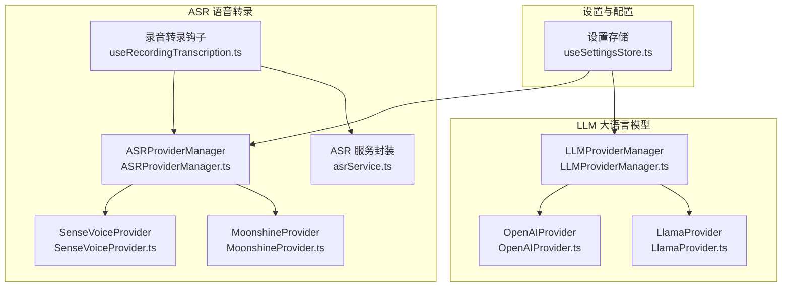
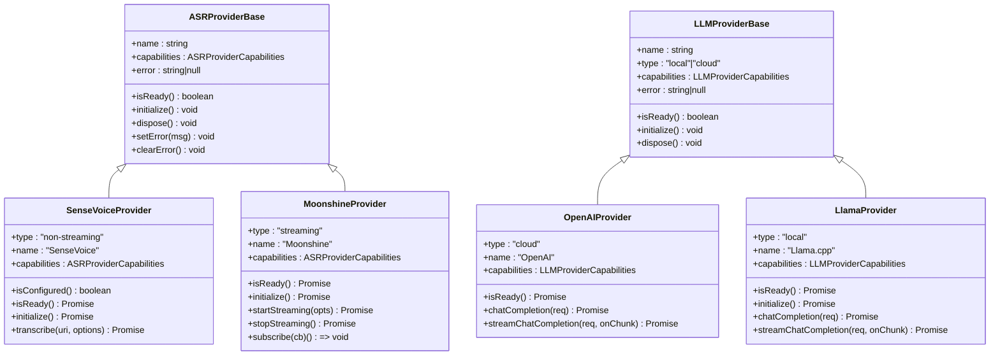
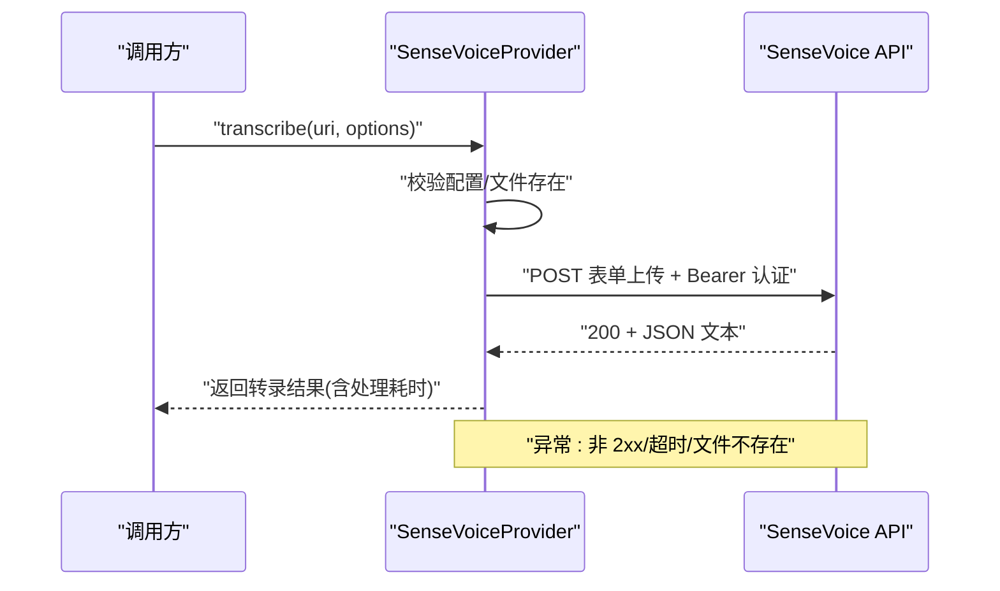
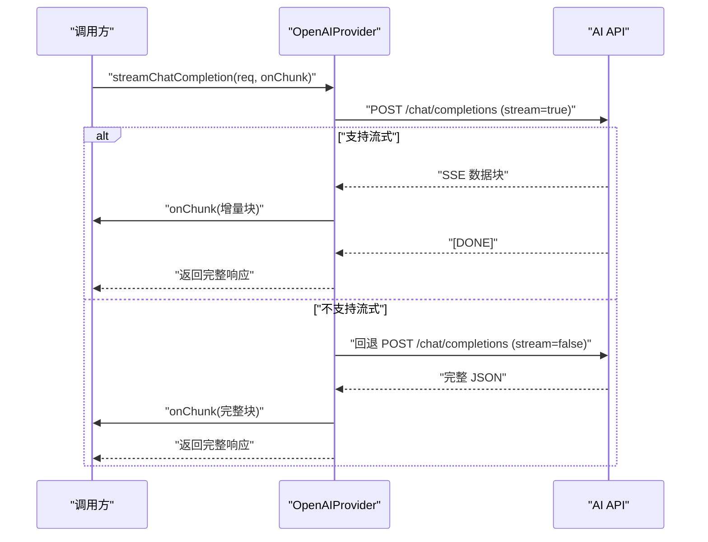
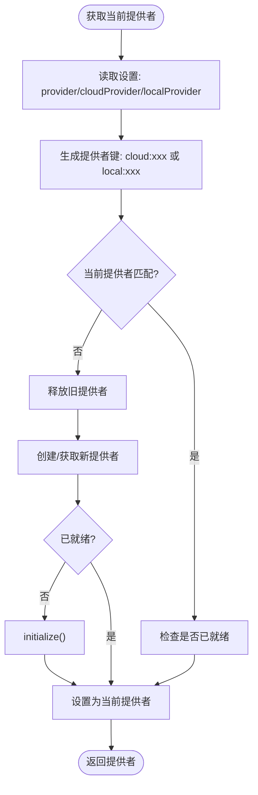
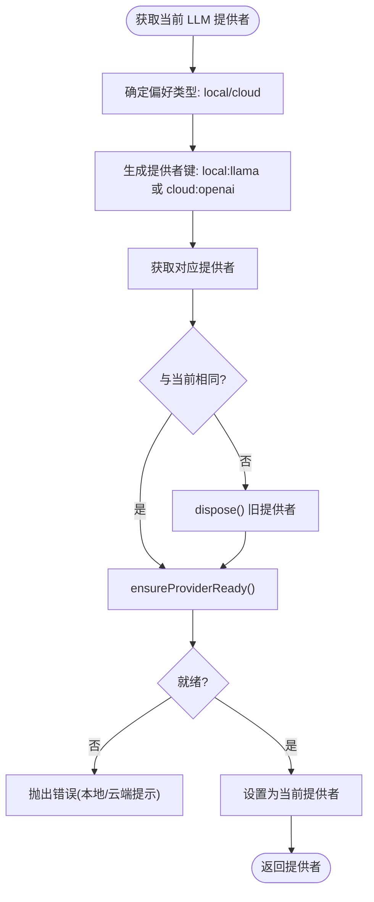
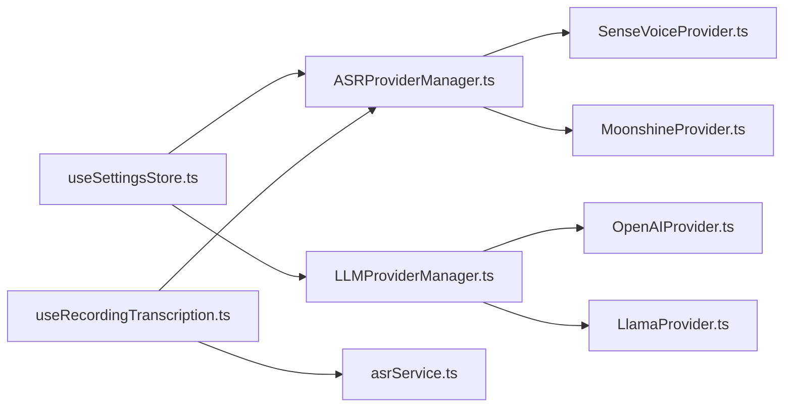

# 云端服务集成

<cite>
**本文引用的文件**
- [services/asr/providers/cloud/SenseVoiceProvider.ts](file://services/asr/providers/cloud/SenseVoiceProvider.ts)
- [services/llm/providers/cloud/OpenAIProvider.ts](file://services/llm/providers/cloud/OpenAIProvider.ts)
- [services/asr/providers/base/ASRProviderBase.ts](file://services/asr/providers/base/ASRProviderBase.ts)
- [services/llm/providers/base/LLMProviderBase.ts](file://services/llm/providers/base/LLMProviderBase.ts)
- [services/asr/providers/ASRProviderManager.ts](file://services/asr/providers/ASRProviderManager.ts)
- [services/llm/providers/LLMProviderManager.ts](file://services/llm/providers/LLMProviderManager.ts)
- [services/asr/providers/local/MoonshineProvider.ts](file://services/asr/providers/local/MoonshineProvider.ts)
- [services/llm/providers/local/LlamaProvider.ts](file://services/llm/providers/local/LlamaProvider.ts)
- [hooks/useRecordingTranscription.ts](file://hooks/useRecordingTranscription.ts)
- [hooks/useTranscription.ts](file://hooks/useTranscription.ts)
- [services/asr/asrService.ts](file://services/asr/asrService.ts)
- [store/useSettingsStore.ts](file://store/useSettingsStore.ts)
- [types/asr.ts](file://types/asr.ts)
- [types/llm.ts](file://types/llm.ts)
- [services/asr/providers/types.ts](file://services/asr/providers/types.ts)
- [services/llm/providers/types.ts](file://services/llm/providers/types.ts)
</cite>

## 目录
1. [引言](#引言)
2. [项目结构](#项目结构)
3. [核心组件](#核心组件)
4. [架构总览](#架构总览)
5. [详细组件分析](#详细组件分析)
6. [依赖关系分析](#依赖关系分析)
7. [性能考量](#性能考量)
8. [故障排除指南](#故障排除指南)
9. [结论](#结论)
10. [附录](#附录)

## 引言
本文件面向 VoiceNote 的云端服务集成，重点覆盖以下内容：
- SenseVoice 语音转录云服务与 OpenAI 兼容 LLM 云服务的集成实现
- 云端服务提供商的抽象接口设计、服务发现与动态切换策略
- API 密钥管理、认证流程与安全传输机制
- 错误处理、重试策略与降级方案
- 服务配置参数、性能优化与成本控制考虑
- 最佳实践与故障排除指南
- 可用性监控与日志记录策略

## 项目结构
VoiceNote 将 ASR（语音转录）与 LLM（大语言模型）能力按“本地”和“云端”两类提供者进行抽象与管理，并通过统一的 Provider Manager 实现运行时选择与生命周期管理。

图表来源
- [services/asr/providers/ASRProviderManager.ts:30-100](file://services/asr/providers/ASRProviderManager.ts#L30-L100)
- [services/llm/providers/LLMProviderManager.ts:18-85](file://services/llm/providers/LLMProviderManager.ts#L18-L85)
- [services/asr/providers/cloud/SenseVoiceProvider.ts:27-77](file://services/asr/providers/cloud/SenseVoiceProvider.ts#L27-L77)
- [services/asr/providers/local/MoonshineProvider.ts:42-83](file://services/asr/providers/local/MoonshineProvider.ts#L42-L83)
- [services/llm/providers/cloud/OpenAIProvider.ts:146-160](file://services/llm/providers/cloud/OpenAIProvider.ts#L146-L160)
- [services/llm/providers/local/LlamaProvider.ts:95-118](file://services/llm/providers/local/LlamaProvider.ts#L95-L118)
- [hooks/useRecordingTranscription.ts:74-195](file://hooks/useRecordingTranscription.ts#L74-L195)
- [services/asr/asrService.ts:24-73](file://services/asr/asrService.ts#L24-L73)

章节来源
- [services/asr/providers/ASRProviderManager.ts:30-100](file://services/asr/providers/ASRProviderManager.ts#L30-L100)
- [services/llm/providers/LLMProviderManager.ts:18-85](file://services/llm/providers/LLMProviderManager.ts#L18-L85)
- [store/useSettingsStore.ts:73-105](file://store/useSettingsStore.ts#L73-L105)

## 核心组件
- 抽象基类
  - ASRProviderBase：提供通用初始化、清理、错误状态管理等能力
  - LLMProviderBase：提供通用初始化、清理、错误状态管理等能力
- 云端提供者
  - SenseVoiceProvider：非流式云端 ASR 提供者，支持多语言，使用 Bearer 认证
  - OpenAIProvider：云端 LLM 提供者，支持流式与非流式对话，兼容 OpenAI 接口
- 本地提供者
  - MoonshineProvider：本地流式 ASR 提供者，基于设备本地模型
  - LlamaProvider：本地 LLM 提供者，基于 GGUF 模型
- 管理器
  - ASRProviderManager：负责云端/本地 ASR 提供者的注册、选择、初始化与切换
  - LLMProviderManager：负责云端/本地 LLM 提供者的注册、选择、初始化与切换
- 配置与类型
  - useSettingsStore：集中管理 ASR/LLM 配置、默认提供者、环境变量回退
  - 类型定义：ASR/LLM 提供者能力、请求/响应、回调、事件等

章节来源
- [services/asr/providers/base/ASRProviderBase.ts:13-65](file://services/asr/providers/base/ASRProviderBase.ts#L13-L65)
- [services/llm/providers/base/LLMProviderBase.ts:8-41](file://services/llm/providers/base/LLMProviderBase.ts#L8-L41)
- [services/asr/providers/cloud/SenseVoiceProvider.ts:27-77](file://services/asr/providers/cloud/SenseVoiceProvider.ts#L27-L77)
- [services/llm/providers/cloud/OpenAIProvider.ts:146-160](file://services/llm/providers/cloud/OpenAIProvider.ts#L146-L160)
- [services/asr/providers/local/MoonshineProvider.ts:42-83](file://services/asr/providers/local/MoonshineProvider.ts#L42-L83)
- [services/llm/providers/local/LlamaProvider.ts:95-118](file://services/llm/providers/local/LlamaProvider.ts#L95-L118)
- [services/asr/providers/ASRProviderManager.ts:30-100](file://services/asr/providers/ASRProviderManager.ts#L30-L100)
- [services/llm/providers/LLMProviderManager.ts:18-85](file://services/llm/providers/LLMProviderManager.ts#L18-L85)
- [store/useSettingsStore.ts:73-105](file://store/useSettingsStore.ts#L73-L105)
- [types/asr.ts:112-144](file://types/asr.ts#L112-L144)
- [types/llm.ts:23-92](file://types/llm.ts#L23-L92)

## 架构总览
云端服务集成采用“抽象接口 + 管理器 + 单例提供者”的分层设计：
- 抽象接口定义统一能力边界（初始化、就绪检查、资源释放、错误状态）
- 管理器负责从设置中读取偏好，按需创建/初始化提供者实例，维护当前活动提供者
- 提供者实现具体云端调用细节（认证、超时、错误处理、可选流式）
- 设置存储支持环境变量与持久化配置双通道回退

图表来源
- [services/asr/providers/base/ASRProviderBase.ts:13-65](file://services/asr/providers/base/ASRProviderBase.ts#L13-L65)
- [services/llm/providers/base/LLMProviderBase.ts:8-41](file://services/llm/providers/base/LLMProviderBase.ts#L8-L41)
- [services/asr/providers/cloud/SenseVoiceProvider.ts:27-152](file://services/asr/providers/cloud/SenseVoiceProvider.ts#L27-L152)
- [services/llm/providers/cloud/OpenAIProvider.ts:146-249](file://services/llm/providers/cloud/OpenAIProvider.ts#L146-L249)
- [services/asr/providers/local/MoonshineProvider.ts:42-291](file://services/asr/providers/local/MoonshineProvider.ts#L42-L291)
- [services/llm/providers/local/LlamaProvider.ts:95-306](file://services/llm/providers/local/LlamaProvider.ts#L95-L306)

## 详细组件分析

### SenseVoice 云端 ASR 提供者
- 能力与特性
  - 非流式转录，支持多语言
  - 使用 Bearer 认证头，表单上传音频文件
  - 默认超时 2 分钟，支持自定义超时
- 关键流程
  - 初始化：校验配置后标记初始化完成
  - 转录：构建表单数据，发送 POST 请求，解析 JSON 响应
  - 错误处理：网络错误、超时、文件不存在等场景抛出明确错误
- 安全与配置
  - API 地址与密钥优先来自设置，其次来自环境变量
  - 仅在配置齐全时视为就绪

图表来源
- [services/asr/providers/cloud/SenseVoiceProvider.ts:82-152](file://services/asr/providers/cloud/SenseVoiceProvider.ts#L82-L152)

章节来源
- [services/asr/providers/cloud/SenseVoiceProvider.ts:27-152](file://services/asr/providers/cloud/SenseVoiceProvider.ts#L27-L152)
- [services/asr/providers/base/ASRProviderBase.ts:13-65](file://services/asr/providers/base/ASRProviderBase.ts#L13-L65)
- [store/useSettingsStore.ts:73-88](file://store/useSettingsStore.ts#L73-L88)

### OpenAI 兼容云端 LLM 提供者
- 能力与特性
  - 支持流式与非流式对话，兼容 OpenAI 接口
  - 默认超时 60 秒，支持自定义 AbortSignal
  - 流式解析 SSE 风格的数据包，支持降级到非流式
- 关键流程
  - 非流式：构造 JSON 请求体，发送 chat/completions，解析响应
  - 流式：检测可读流与解码器，逐块解析 data: 行，拼接增量文本
  - 降级：若不支持流式，回退到非流式请求并发出完整块
- 安全与配置
  - API 地址与密钥优先来自设置，其次来自环境变量

图表来源
- [services/llm/providers/cloud/OpenAIProvider.ts:204-249](file://services/llm/providers/cloud/OpenAIProvider.ts#L204-L249)

章节来源
- [services/llm/providers/cloud/OpenAIProvider.ts:146-249](file://services/llm/providers/cloud/OpenAIProvider.ts#L146-L249)
- [services/llm/providers/base/LLMProviderBase.ts:8-41](file://services/llm/providers/base/LLMProviderBase.ts#L8-L41)
- [store/useSettingsStore.ts:95-105](file://store/useSettingsStore.ts#L95-L105)

### ASR Provider 管理器（服务发现与动态切换）
- 服务发现
  - 注册云端 SenseVoice 与本地 Moonshine 提供者
  - 依据设置中的偏好选择当前提供者
- 动态切换
  - 若当前提供者与目标不一致，先释放旧实例，再创建/初始化新实例
  - 支持按需初始化与就绪检查
- 运行时信息
  - 提供当前提供者类型、名称、状态、能力与错误信息

图表来源
- [services/asr/providers/ASRProviderManager.ts:63-100](file://services/asr/providers/ASRProviderManager.ts#L63-L100)

章节来源
- [services/asr/providers/ASRProviderManager.ts:30-259](file://services/asr/providers/ASRProviderManager.ts#L30-L259)

### LLM Provider 管理器（服务发现与动态切换）
- 服务发现
  - 注册本地 Llama.cpp 与云端 OpenAI 提供者
  - 优先使用设置中的偏好，其次使用环境变量回退
- 动态切换
  - 若当前提供者不是目标或未就绪，尝试初始化并切换
  - 初始化失败时返回错误或默认提示
- 运行时信息
  - 返回类型、名称、状态、能力与错误信息

图表来源
- [services/llm/providers/LLMProviderManager.ts:55-85](file://services/llm/providers/LLMProviderManager.ts#L55-L85)

章节来源
- [services/llm/providers/LLMProviderManager.ts:18-161](file://services/llm/providers/LLMProviderManager.ts#L18-L161)

### 本地提供者（对比参考）
- MoonshineProvider：本地流式 ASR，需要模型加载与权限处理
- LlamaProvider：本地 LLM，需要模型路径解析与运行时参数

章节来源
- [services/asr/providers/local/MoonshineProvider.ts:42-291](file://services/asr/providers/local/MoonshineProvider.ts#L42-L291)
- [services/llm/providers/local/LlamaProvider.ts:95-306](file://services/llm/providers/local/LlamaProvider.ts#L95-L306)

### 录音转录统一钩子
- 自动区分本地/云端模式
  - 本地：使用 Moonshine 流式转录，录制开始前启动，结束后获取最终文本
  - 云端：录制完成后对音频文件发起转录
- 统一导出状态与方法，便于 UI 层无差别使用

章节来源
- [hooks/useRecordingTranscription.ts:74-195](file://hooks/useRecordingTranscription.ts#L74-L195)
- [hooks/useTranscription.ts:22-103](file://hooks/useTranscription.ts#L22-L103)

## 依赖关系分析
- 配置依赖
  - 所有云端提供者均依赖 useSettingsStore 中的 asrConfig/aiConfig
  - 支持环境变量作为回退（EXPO_PUBLIC_ASR_API_URL、EXPO_PUBLIC_ASR_API_KEY、EXPO_PUBLIC_AI_API_URL、EXPO_PUBLIC_AI_API_KEY 等）
- 生命周期依赖
  - 管理器在每次获取提供者前执行就绪检查与必要初始化
  - 提供者基类统一错误状态管理
- 类型契约
  - ASR/LLM 提供者接口定义了能力、回调、事件与请求/响应结构

图表来源
- [store/useSettingsStore.ts:73-105](file://store/useSettingsStore.ts#L73-L105)
- [services/asr/providers/ASRProviderManager.ts:30-100](file://services/asr/providers/ASRProviderManager.ts#L30-L100)
- [services/llm/providers/LLMProviderManager.ts:18-85](file://services/llm/providers/LLMProviderManager.ts#L18-L85)

章节来源
- [store/useSettingsStore.ts:73-105](file://store/useSettingsStore.ts#L73-L105)
- [services/asr/providers/types.ts:53-128](file://services/asr/providers/types.ts#L53-L128)
- [services/llm/providers/types.ts:14-29](file://services/llm/providers/types.ts#L14-L29)

## 性能考量
- 超时与中断
  - 云端调用均设置超时与 AbortController，避免长时间阻塞
- 流式与降级
  - LLM 提供者优先使用流式以提升交互体验；不支持时自动降级为非流式
- 本地模型加载
  - 本地提供者在首次使用时加载模型，建议在应用空闲期预热以减少首帧延迟
- 优化与成本
  - 云端调用应结合网络状况与超时策略，避免重复请求
  - 本地推理受设备性能影响较大，可通过线程数、上下文长度、GPU 层数等参数权衡速度与质量

章节来源
- [services/asr/providers/cloud/SenseVoiceProvider.ts:15-152](file://services/asr/providers/cloud/SenseVoiceProvider.ts#L15-L152)
- [services/llm/providers/cloud/OpenAIProvider.ts:15-249](file://services/llm/providers/cloud/OpenAIProvider.ts#L15-L249)
- [services/llm/providers/local/LlamaProvider.ts:82-161](file://services/llm/providers/local/LlamaProvider.ts#L82-L161)

## 故障排除指南
- 常见错误与定位
  - ASR 未配置：检查设置中的 apiUrl/apiKey 是否填写，或环境变量是否正确
  - 音频文件不存在：确认文件 URI 有效且可访问
  - 转录超时：适当提高超时时间或检查网络状况
  - LLM 未就绪：本地模型路径缺失或加载失败；云端未配置 API 密钥
- 建议排查步骤
  - 在设置页核对 API 地址与密钥
  - 查看 ProviderInfo 中的状态与错误字段
  - 对于流式 LLM，确认运行环境支持可读流与解码器
  - 对于本地 LLM，确认模型路径与运行时参数（线程数、上下文长度、GPU 层数）

章节来源
- [services/asr/providers/cloud/SenseVoiceProvider.ts:56-77](file://services/asr/providers/cloud/SenseVoiceProvider.ts#L56-L77)
- [services/llm/providers/cloud/OpenAIProvider.ts:157-160](file://services/llm/providers/cloud/OpenAIProvider.ts#L157-L160)
- [services/llm/providers/local/LlamaProvider.ts:110-130](file://services/llm/providers/local/LlamaProvider.ts#L110-L130)
- [services/asr/providers/ASRProviderManager.ts:197-233](file://services/asr/providers/ASRProviderManager.ts#L197-L233)
- [services/llm/providers/LLMProviderManager.ts:100-146](file://services/llm/providers/LLMProviderManager.ts#L100-L146)

## 结论
VoiceNote 的云端服务集成通过清晰的抽象接口与管理器实现了“本地/云端”双栈能力的统一调度。SenseVoice 与 OpenAI 兼容提供者分别满足高质量云端转录与对话需求，配合完善的错误处理、超时控制与降级策略，能够在不同网络与设备环境下提供稳定的服务体验。建议在生产环境中结合监控与日志策略持续优化性能与成本。

## 附录

### API 密钥管理与认证流程
- 密钥来源
  - 设置存储优先：asrConfig.apiKey、aiConfig.apiKey
  - 环境变量回退：EXPO_PUBLIC_ASR_API_KEY、EXPO_PUBLIC_AI_API_KEY
- 认证方式
  - SenseVoice：Authorization: Bearer {apiKey}
  - OpenAIProvider：Authorization: Bearer {apiKey}

章节来源
- [store/useSettingsStore.ts:73-105](file://store/useSettingsStore.ts#L73-L105)
- [services/asr/providers/cloud/SenseVoiceProvider.ts:98-122](file://services/asr/providers/cloud/SenseVoiceProvider.ts#L98-L122)
- [services/llm/providers/cloud/OpenAIProvider.ts:175-221](file://services/llm/providers/cloud/OpenAIProvider.ts#L175-L221)

### 服务配置参数清单
- ASR
  - provider: 'cloud' | 'local'
  - cloudProvider: 'sensevoice'
  - apiUrl: 云端 ASR 地址
  - apiKey: 云端 ASR 密钥
  - localProvider: 'moonshine'
  - defaultLanguage/defaultModelArch/modelDownloadSource/customModelUrl: 本地模型相关
- LLM
  - provider: 'cloud' | 'local'
  - apiUrl: 云端 LLM 地址（默认 OpenAI 兼容）
  - apiKey: 云端 LLM 密钥
  - model: 默认模型名
  - localModelPath/localContextTokens/localThreads/localGpuLayers/localBatchSize: 本地推理参数

章节来源
- [store/useSettingsStore.ts:73-105](file://store/useSettingsStore.ts#L73-L105)
- [types/asr.ts:15-164](file://types/asr.ts#L15-L164)
- [types/llm.ts:12-93](file://types/llm.ts#L12-L93)

### 错误处理、重试与降级
- 错误处理
  - 统一通过 ProviderBase 的 error 字段记录
  - 管理器在查询 ProviderInfo 时将错误透传
- 重试策略
  - 当前实现未内置自动重试；建议在上层业务根据错误类型决定是否重试
- 降级方案
  - LLM 流式不可用时自动降级为非流式
  - 本地模型未就绪时返回明确错误提示

章节来源
- [services/asr/providers/base/ASRProviderBase.ts:48-64](file://services/asr/providers/base/ASRProviderBase.ts#L48-L64)
- [services/llm/providers/cloud/OpenAIProvider.ts:238-246](file://services/llm/providers/cloud/OpenAIProvider.ts#L238-L246)
- [services/llm/providers/LLMProviderManager.ts:75-81](file://services/llm/providers/LLMProviderManager.ts#L75-L81)

### 可用性监控与日志记录策略
- 建议采集指标
  - 调用成功率、平均/分位延迟、超时率、错误分布
  - ProviderInfo 状态变化（ready/error/unavailable）
- 日志记录
  - 请求/响应摘要（不含敏感信息）、关键错误堆栈
  - 本地模型加载与卸载事件、流式事件序列
- 采样与脱敏
  - 对 API 密钥与用户内容进行脱敏处理
  - 控制日志体积，避免高频流式事件刷屏

[本节为通用指导，无需代码来源]