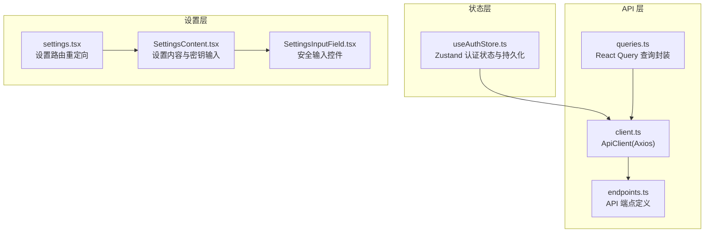
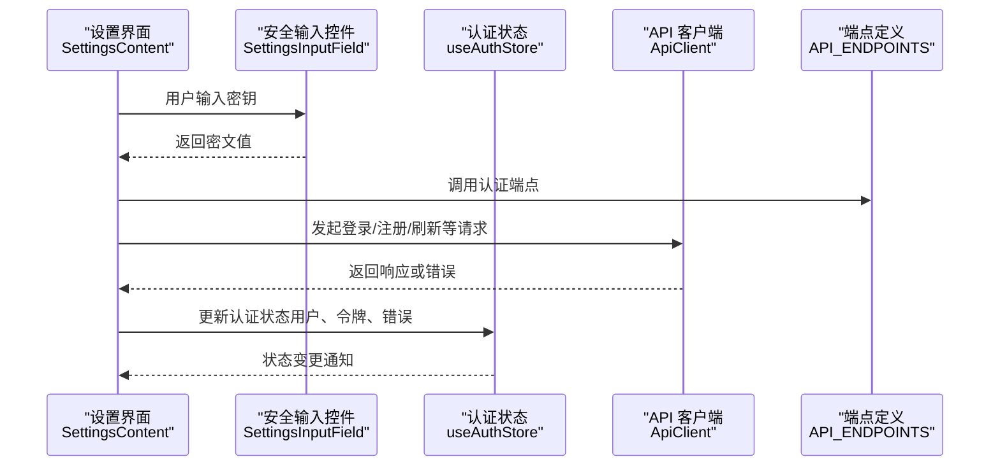
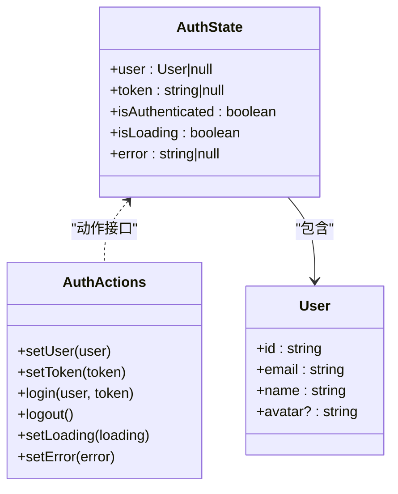
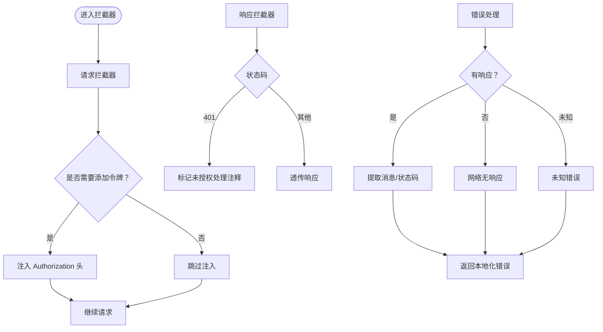
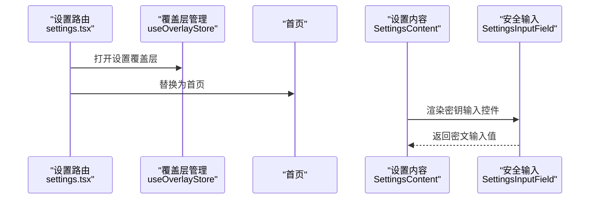
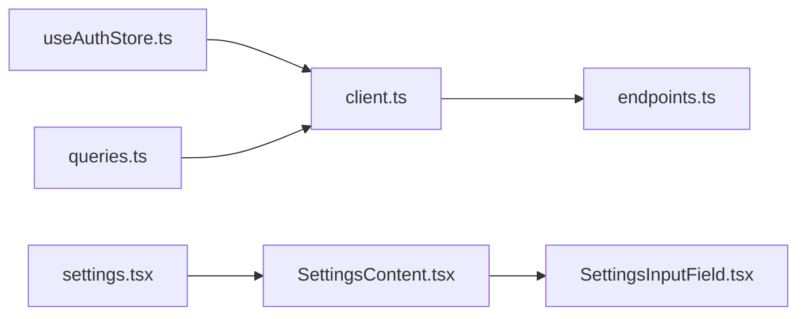
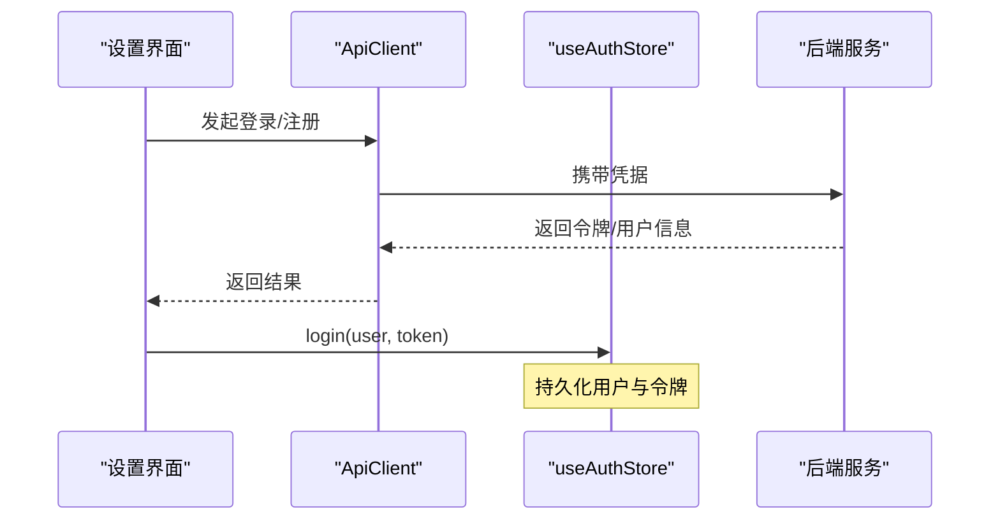

# 认证与安全

<cite>
**本文引用的文件**
- [useAuthStore.ts](file://store/useAuthStore.ts)
- [client.ts](file://services/api/client.ts)
- [endpoints.ts](file://services/api/endpoints.ts)
- [queries.ts](file://services/api/queries.ts)
- [settings.tsx](file://app/(tabs)/settings.tsx)
- [SettingsContent.tsx](file://components/settings/SettingsContent.tsx)
- [SettingsInputField.tsx](file://components/settings/SettingsInputField.tsx)
</cite>

## 目录
1. [简介](#简介)
2. [项目结构](#项目结构)
3. [核心组件](#核心组件)
4. [架构总览](#架构总览)
5. [详细组件分析](#详细组件分析)
6. [依赖关系分析](#依赖关系分析)
7. [性能考虑](#性能考虑)
8. [故障排查指南](#故障排查指南)
9. [结论](#结论)
10. [附录](#附录)

## 简介
本文件系统性梳理 VoiceNote 应用的认证与安全机制，覆盖以下方面：
- API 认证流程与令牌管理
- 会话维护策略与状态存储
- 安全传输协议、数据加密与敏感信息保护
- API 密钥的安全存储、轮换与访问控制
- 权限管理、角色验证与资源访问控制
- 认证失败处理策略、用户体验优化与安全审计
- 安全漏洞防护、渗透测试与合规性检查建议

当前代码库中，认证状态通过本地状态与持久化存储实现，API 客户端具备基础拦截器框架但未启用令牌注入；设置界面支持密钥输入并具备安全输入控件。

## 项目结构
与认证与安全相关的关键模块分布如下：
- 状态层：使用 Zustand 管理认证状态，并通过持久化中间件将用户与令牌写入本地存储
- API 层：基于 Axios 的客户端封装，提供统一的请求/响应拦截器与错误处理
- 设置层：提供密钥输入界面与安全输入控件，用于配置云端服务凭据

**图表来源**
- [useAuthStore.ts:1-82](file://store/useAuthStore.ts#L1-L82)
- [client.ts:1-104](file://services/api/client.ts#L1-L104)
- [endpoints.ts:1-61](file://services/api/endpoints.ts#L1-L61)
- [queries.ts:1-100](file://services/api/queries.ts#L1-L100)
- [settings.tsx:1-22](file://app/(tabs)/settings.tsx#L1-L22)
- [SettingsContent.tsx:1-623](file://components/settings/SettingsContent.tsx#L1-L623)
- [SettingsInputField.tsx:26-95](file://components/settings/SettingsInputField.tsx#L26-L95)

**章节来源**
- [useAuthStore.ts:1-82](file://store/useAuthStore.ts#L1-L82)
- [client.ts:1-104](file://services/api/client.ts#L1-L104)
- [endpoints.ts:1-61](file://services/api/endpoints.ts#L1-L61)
- [queries.ts:1-100](file://services/api/queries.ts#L1-L100)
- [settings.tsx:1-22](file://app/(tabs)/settings.tsx#L1-L22)
- [SettingsContent.tsx:1-623](file://components/settings/SettingsContent.tsx#L1-L623)
- [SettingsInputField.tsx:26-95](file://components/settings/SettingsInputField.tsx#L26-L95)

## 核心组件
- 认证状态存储（Zustand + 持久化）
  - 状态字段：用户信息、令牌、认证状态、加载状态、错误信息
  - 持久化策略：仅持久化用户、令牌与认证状态，避免持久化敏感数据
  - 存储介质：AsyncStorage JSON 序列化
- API 客户端（Axios）
  - 基础配置：超时、默认头、基础 URL
  - 拦截器：请求/响应拦截器预留，当前未启用令牌注入与自动刷新
  - 错误处理：按响应/请求/未知场景分类并本地化消息
- 设置与密钥管理
  - 设置路由：重定向至首页并打开设置覆盖层
  - 设置内容：提供 ASR/AI 云服务密钥输入区域
  - 安全输入：支持密文显示切换与安全文本输入

**章节来源**
- [useAuthStore.ts:12-80](file://store/useAuthStore.ts#L12-L80)
- [client.ts:15-79](file://services/api/client.ts#L15-L79)
- [client.ts:27-54](file://services/api/client.ts#L27-L54)
- [client.ts:56-75](file://services/api/client.ts#L56-L75)
- [settings.tsx:10-18](file://app/(tabs)/settings.tsx#L10-L18)
- [SettingsContent.tsx:248-253](file://components/settings/SettingsContent.tsx#L248-L253)
- [SettingsInputField.tsx:26-72](file://components/settings/SettingsInputField.tsx#L26-L72)

## 架构总览
下图展示认证与安全相关模块的交互关系与数据流：

**图表来源**
- [SettingsContent.tsx:248-253](file://components/settings/SettingsContent.tsx#L248-L253)
- [SettingsInputField.tsx:26-72](file://components/settings/SettingsInputField.tsx#L26-L72)
- [useAuthStore.ts:29-70](file://store/useAuthStore.ts#L29-L70)
- [client.ts:77-100](file://services/api/client.ts#L77-L100)
- [endpoints.ts:1-9](file://services/api/endpoints.ts#L1-L9)

## 详细组件分析

### 组件一：认证状态存储（useAuthStore）
- 数据结构
  - 用户对象：包含标识、邮箱、名称与可选头像
  - 认证状态：用户、令牌、是否已认证、加载状态、错误信息
- 行为与策略
  - 登录：设置用户与令牌，标记为已认证，清空错误
  - 登出：清空用户、令牌与错误，取消认证
  - 加载与错误：集中管理加载态与错误信息
  - 持久化：仅持久化用户、令牌与认证状态，不持久化敏感数据
- 复杂度与性能
  - 状态更新为 O(1)，持久化写入受存储性能影响
  - 部分序列化函数避免冗余字段写入

**图表来源**
- [useAuthStore.ts:5-27](file://store/useAuthStore.ts#L5-L27)
- [useAuthStore.ts:29-70](file://store/useAuthStore.ts#L29-L70)

**章节来源**
- [useAuthStore.ts:12-80](file://store/useAuthStore.ts#L12-L80)

### 组件二：API 客户端（ApiClient）
- 配置与拦截器
  - 请求拦截器：预留令牌注入逻辑（注释），返回配置
  - 响应拦截器：对 401 做清理提示（注释），统一错误处理
- 错误处理
  - 响应错误：提取消息、状态码与状态码
  - 网络无响应：本地化“无服务器响应”消息
  - 其他异常：本地化“意外错误”消息
- 方法封装
  - 提供 GET/POST/PUT/PATCH/DELETE 封装，便于上层调用

**图表来源**
- [client.ts:27-54](file://services/api/client.ts#L27-L54)
- [client.ts:56-75](file://services/api/client.ts#L56-L75)

**章节来源**
- [client.ts:15-79](file://services/api/client.ts#L15-L79)
- [client.ts:27-54](file://services/api/client.ts#L27-L54)
- [client.ts:56-75](file://services/api/client.ts#L56-L75)

### 组件三：设置与密钥管理（SettingsContent/SettingsInputField）
- 设置路由
  - 将设置页重定向到首页并打开设置覆盖层，保证一致的导航体验
- 密钥输入
  - 支持 ASR/AI 云服务的 API Endpoint 与 API Key 输入
  - 使用安全输入控件，支持密文显示切换
- 用户体验
  - 输入框禁用自动大写与自动拼写纠正，降低误触风险
  - 明确的标签与占位符，提升可读性

**图表来源**
- [settings.tsx:10-18](file://app/(tabs)/settings.tsx#L10-L18)
- [SettingsContent.tsx:248-253](file://components/settings/SettingsContent.tsx#L248-L253)
- [SettingsInputField.tsx:26-72](file://components/settings/SettingsInputField.tsx#L26-L72)

**章节来源**
- [settings.tsx:10-18](file://app/(tabs)/settings.tsx#L10-L18)
- [SettingsContent.tsx:248-253](file://components/settings/SettingsContent.tsx#L248-L253)
- [SettingsInputField.tsx:26-72](file://components/settings/SettingsInputField.tsx#L26-L72)

## 依赖关系分析
- 组件耦合
  - useAuthStore 与设置界面解耦，通过状态驱动 UI 更新
  - API 客户端与端点定义松耦合，通过常量集中管理
  - 设置界面与安全输入控件内聚，共同完成密钥输入体验
- 外部依赖
  - Axios：HTTP 客户端与拦截器
  - AsyncStorage：本地持久化
  - React Query：查询与缓存（与认证间接相关）

**图表来源**
- [useAuthStore.ts:1-82](file://store/useAuthStore.ts#L1-L82)
- [client.ts:1-104](file://services/api/client.ts#L1-L104)
- [endpoints.ts:1-61](file://services/api/endpoints.ts#L1-L61)
- [queries.ts:1-100](file://services/api/queries.ts#L1-L100)
- [settings.tsx:1-22](file://app/(tabs)/settings.tsx#L1-L22)
- [SettingsContent.tsx:1-623](file://components/settings/SettingsContent.tsx#L1-L623)
- [SettingsInputField.tsx:26-95](file://components/settings/SettingsInputField.tsx#L26-L95)

**章节来源**
- [queries.ts:1-17](file://services/api/queries.ts#L1-L17)

## 性能考虑
- 状态持久化
  - 仅持久化必要字段，减少存储体积与序列化开销
  - 避免在持久化中间件中处理大型对象或敏感数据
- API 请求
  - 合理设置超时时间，避免阻塞 UI
  - 在请求拦截器中延迟令牌注入，减少无效请求
- 设置输入
  - 密文输入切换为轻量级 UI 动作，避免频繁重渲染
  - 输入框禁用自动纠错，减少不必要的键盘行为

[本节为通用指导，无需具体文件来源]

## 故障排查指南
- 401 未授权
  - 当前响应拦截器预留了清理逻辑（注释），建议在实际环境中启用并结合认证状态清理
  - 检查后端返回状态码与消息，确认是否为令牌过期或无效
- 网络无响应
  - 客户端会捕获无响应场景并返回本地化消息，建议检查网络连通性与代理配置
- 本地存储问题
  - 若出现状态不同步，尝试清除应用数据或检查持久化中间件配置
- 密钥输入异常
  - 确认设置界面中的密钥输入控件未被禁用，且未触发自动大写/拼写纠正

**章节来源**
- [client.ts:43-53](file://services/api/client.ts#L43-L53)
- [client.ts:56-75](file://services/api/client.ts#L56-L75)

## 结论
- 当前实现提供了清晰的认证状态模型与 API 客户端框架，具备扩展令牌注入与自动刷新的基础
- 设置界面支持密钥输入并采用安全输入控件，有助于保护敏感信息
- 建议尽快补齐令牌注入、刷新与清理逻辑，并完善错误处理与安全审计能力

[本节为总结，无需具体文件来源]

## 附录

### API 认证流程与令牌管理
- 流程概览
  - 用户在设置界面输入密钥并发起认证请求
  - API 客户端发送请求，等待响应
  - 成功后更新认证状态，失败则记录错误信息
- 令牌管理
  - 建议在请求拦截器中读取持久化令牌并注入 Authorization 头
  - 对于 401 响应，清理本地令牌与认证状态，引导用户重新登录
- 刷新与清理
  - 可在响应拦截器中识别令牌即将过期的信号，触发刷新流程
  - 刷新成功后更新令牌并重试原请求；失败则清理状态并提示用户

**图表来源**
- [SettingsContent.tsx:248-253](file://components/settings/SettingsContent.tsx#L248-L253)
- [client.ts:77-100](file://services/api/client.ts#L77-L100)
- [useAuthStore.ts:49-55](file://store/useAuthStore.ts#L49-L55)

### 安全传输协议、数据加密与敏感信息保护
- 传输安全
  - 建议强制使用 HTTPS，确保令牌与密钥在传输过程中的机密性
- 本地存储
  - 仅持久化必要字段，避免将完整令牌写入持久化存储
  - 使用安全的存储方案（如加密存储库）替代纯 JSON 序列化
- 输入保护
  - 使用安全输入控件，支持密文显示切换
  - 禁用自动纠错与自动大写，减少误触与日志泄露风险

**章节来源**
- [SettingsInputField.tsx:26-72](file://components/settings/SettingsInputField.tsx#L26-L72)
- [useAuthStore.ts:71-80](file://store/useAuthStore.ts#L71-L80)

### API 密钥的安全存储、轮换与访问控制
- 存储
  - 建议将密钥存储在安全容器中，而非明文写入本地存储
  - 设置界面仅负责收集与提交，不负责长期保存
- 轮换
  - 提供一键轮换入口，提交新密钥后立即替换旧值
- 访问控制
  - 限制密钥可见范围，仅在设置界面与必要的 API 调用中可见
  - 对密钥进行最小权限配置，遵循最小权限原则

**章节来源**
- [SettingsContent.tsx:248-253](file://components/settings/SettingsContent.tsx#L248-L253)

### 权限管理、角色验证与资源访问控制
- 角色与权限
  - 建议在后端定义明确的角色与权限矩阵，前端仅作为展示与交互层
- 资源访问
  - 对每个资源请求进行权限校验，403/401 分别对应权限不足与未认证
- 会话控制
  - 结合后端会话管理，实现登出、踢人与强制刷新

[本节为概念性说明，无需具体文件来源]

### 认证失败处理策略、用户体验优化与安全审计
- 失败处理
  - 401：清理本地状态，提示重新登录
  - 403：提示权限不足，引导联系管理员
  - 网络异常：提供重试按钮与错误详情
- 用户体验
  - 提供明确的错误文案与操作指引
  - 在设置界面提供“复制/粘贴”辅助与格式校验
- 安全审计
  - 记录关键事件（登录、登出、密钥变更、失败尝试）
  - 限制日志中敏感信息输出，避免泄露

**章节来源**
- [client.ts:43-53](file://services/api/client.ts#L43-L53)
- [client.ts:56-75](file://services/api/client.ts#L56-L75)

### 安全漏洞防护、渗透测试与合规性检查
- 漏洞防护
  - 输入校验与参数化查询，防止注入攻击
  - 强制 HTTPS 与安全头配置
- 渗透测试
  - 定期进行 API 安全扫描与权限边界测试
- 合规性
  - 遵循数据最小化与可撤销原则
  - 提供数据导出与删除功能，满足用户权利

[本节为通用指导，无需具体文件来源]