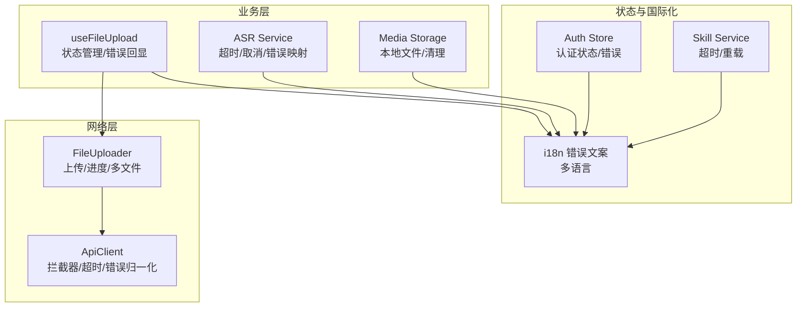
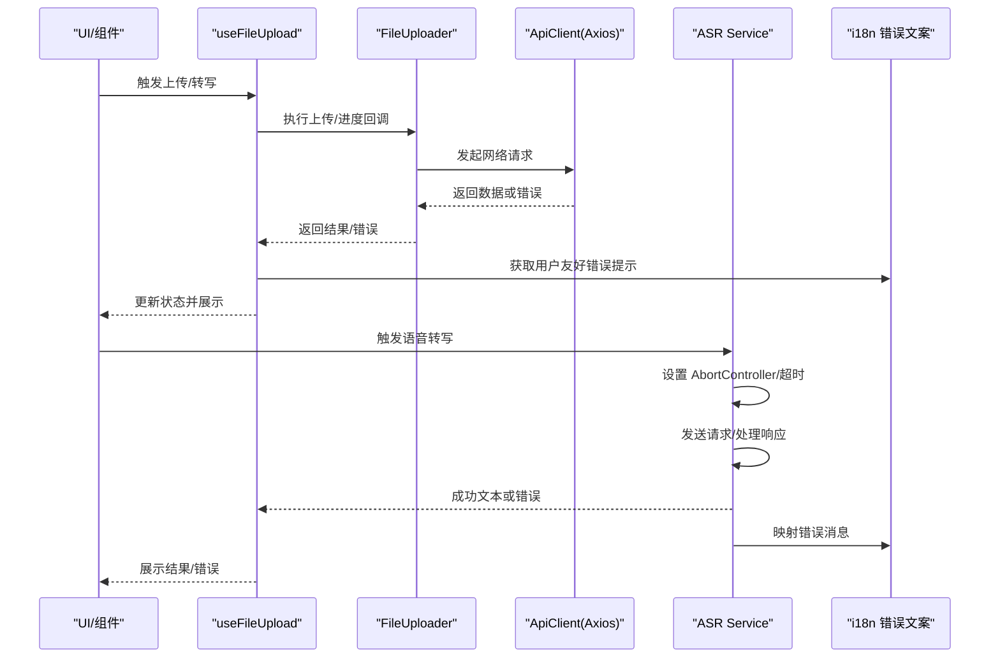
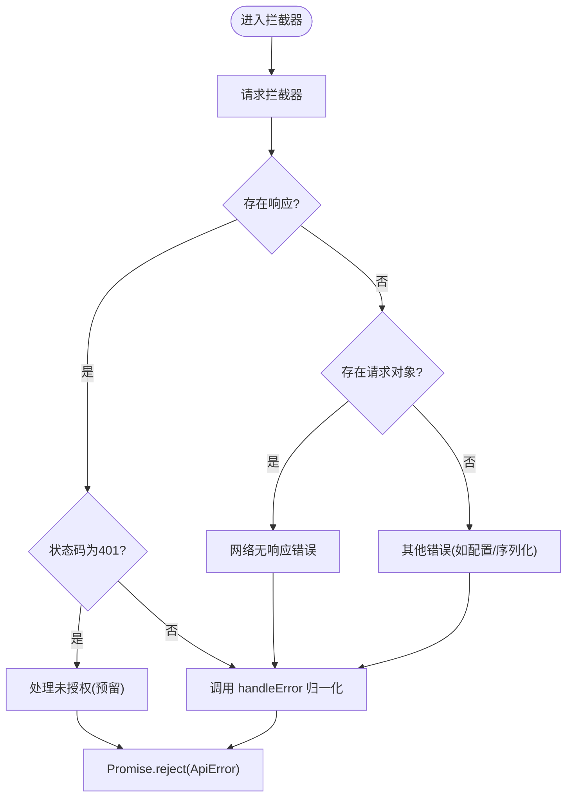
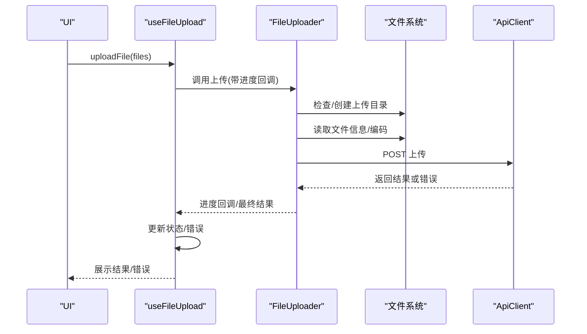
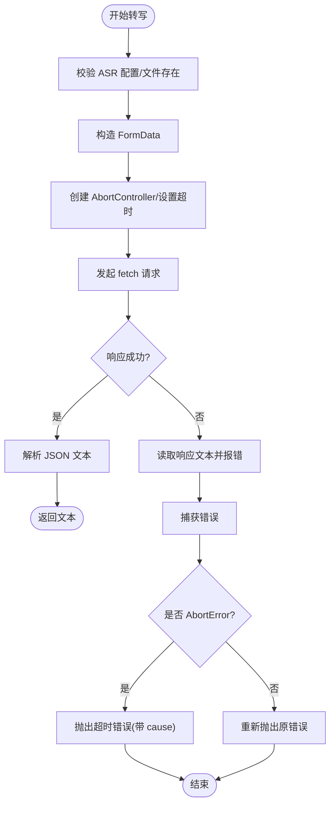
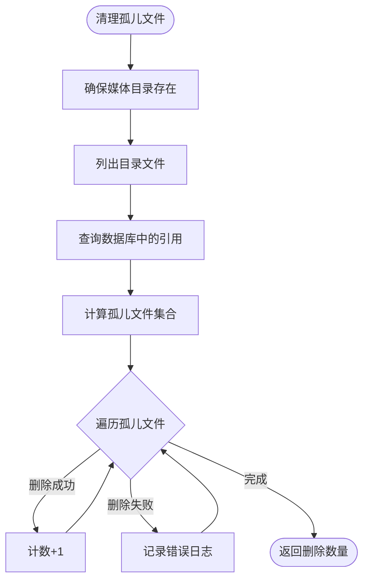
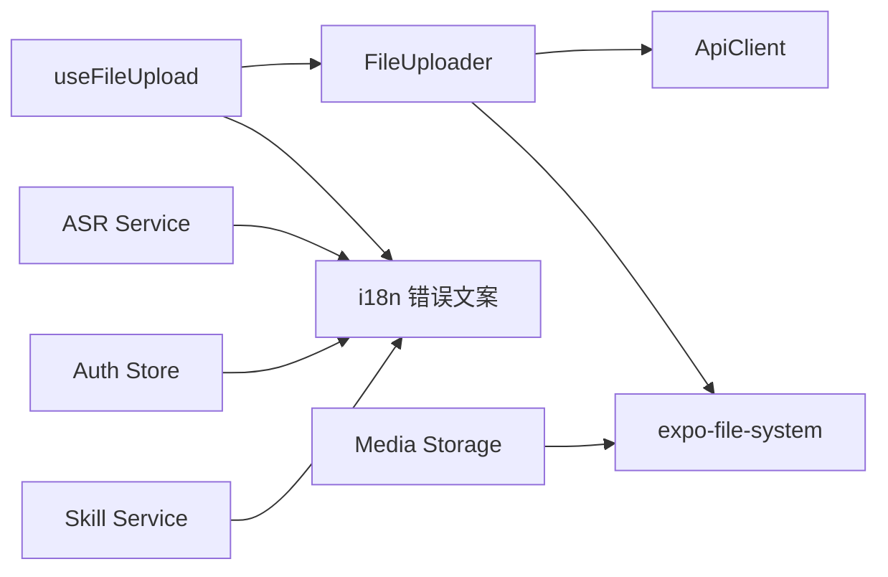

# 错误处理与网络管理

<cite>
**本文引用的文件**
- [services/api/client.ts](file://services/api/client.ts)
- [services/upload/index.ts](file://services/upload/index.ts)
- [hooks/useFileUpload.ts](file://hooks/useFileUpload.ts)
- [services/asr/asrService.ts](file://services/asr/asrService.ts)
- [services/mediaStorage.ts](file://services/mediaStorage.ts)
- [store/useAuthStore.ts](file://store/useAuthStore.ts)
- [i18n/locales/zh-CN/errors.json](file://i18n/locales/zh-CN/errors.json)
- [services/skill/skillService.ts](file://services/skill/skillService.ts)
- [hooks/useDeepLinkHandler.ts](file://hooks/useDeepLinkHandler.ts)
</cite>

## 目录
1. [简介](#简介)
2. [项目结构](#项目结构)
3. [核心组件](#核心组件)
4. [架构总览](#架构总览)
5. [详细组件分析](#详细组件分析)
6. [依赖关系分析](#依赖关系分析)
7. [性能考量](#性能考量)
8. [故障排查指南](#故障排查指南)
9. [结论](#结论)
10. [附录](#附录)

## 简介
本文件聚焦 VoiceNote 的“错误处理与网络管理”，系统性梳理以下方面：
- 网络异常分类、诊断与恢复策略
- API 错误标准化处理、用户友好提示与重试机制
- 离线状态检测、网络状态监听与自动重连
- 超时配置、请求取消与内存泄漏防护
- 错误日志记录、性能监控与故障统计分析
- 网络优化建议、带宽管理与连接池配置
- 常见网络问题排查方法与解决方案

## 项目结构
围绕错误处理与网络管理的关键模块包括：
- API 客户端与拦截器：统一处理网络请求、超时、错误归一化
- 文件上传流程：本地准备、进度回调、错误捕获与状态管理
- ASR（语音转写）服务：超时控制、请求取消与错误映射
- 媒体存储与磁盘空间：本地文件管理与清理
- 认证状态与国际化错误文案：统一错误提示来源
- 技能加载与超时：演示 AbortController 使用与超时处理
- 深链接处理：边界条件与异常路径

图表来源
- [services/api/client.ts:1-104](file://services/api/client.ts#L1-L104)
- [services/upload/index.ts:1-130](file://services/upload/index.ts#L1-L130)
- [hooks/useFileUpload.ts:1-123](file://hooks/useFileUpload.ts#L1-L123)
- [services/asr/asrService.ts:1-74](file://services/asr/asrService.ts#L1-L74)
- [services/mediaStorage.ts:1-123](file://services/mediaStorage.ts#L1-L123)
- [store/useAuthStore.ts:1-82](file://store/useAuthStore.ts#L1-L82)
- [services/skill/skillService.ts:41-64](file://services/skill/skillService.ts#L41-L64)

章节来源
- [services/api/client.ts:1-104](file://services/api/client.ts#L1-L104)
- [services/upload/index.ts:1-130](file://services/upload/index.ts#L1-L130)
- [hooks/useFileUpload.ts:1-123](file://hooks/useFileUpload.ts#L1-L123)
- [services/asr/asrService.ts:1-74](file://services/asr/asrService.ts#L1-L74)
- [services/mediaStorage.ts:1-123](file://services/mediaStorage.ts#L1-L123)
- [store/useAuthStore.ts:1-82](file://store/useAuthStore.ts#L1-L82)
- [services/skill/skillService.ts:41-64](file://services/skill/skillService.ts#L41-L64)

## 核心组件
- ApiClient：基于 axios 的网络客户端，内置请求/响应拦截器，统一处理 401、无响应、未知错误，并通过 i18n 提供用户可读的错误消息。
- FileUploader：封装上传流程，支持单文件与多文件上传、进度回调、本地目录准备、MIME 类型推断与文件删除。
- useFileUpload：Hook 层状态管理，负责上传状态、进度、错误与结果的聚合，统一错误提示。
- ASR Service：封装语音转写调用，使用 AbortController 控制超时，对不同错误场景进行映射与抛错。
- Media Storage：本地媒体文件的保存、读取、删除与磁盘配额查询，提供孤儿文件清理能力。
- Auth Store：认证状态持久化，承载错误信息以便 UI 统一展示。
- 错误文案：集中于 i18n，确保错误提示一致且可国际化。

章节来源
- [services/api/client.ts:12-103](file://services/api/client.ts#L12-L103)
- [services/upload/index.ts:19-129](file://services/upload/index.ts#L19-L129)
- [hooks/useFileUpload.ts:6-122](file://hooks/useFileUpload.ts#L6-L122)
- [services/asr/asrService.ts:24-73](file://services/asr/asrService.ts#L24-L73)
- [services/mediaStorage.ts:22-122](file://services/mediaStorage.ts#L22-L122)
- [store/useAuthStore.ts:29-81](file://store/useAuthStore.ts#L29-L81)
- [i18n/locales/zh-CN/errors.json:1-32](file://i18n/locales/zh-CN/errors.json#L1-L32)

## 架构总览
下图展示了从 UI 到网络层的关键调用链与错误处理位置：

图表来源
- [hooks/useFileUpload.ts:21-62](file://hooks/useFileUpload.ts#L21-L62)
- [services/upload/index.ts:29-66](file://services/upload/index.ts#L29-L66)
- [services/api/client.ts:81-99](file://services/api/client.ts#L81-L99)
- [services/asr/asrService.ts:42-72](file://services/asr/asrService.ts#L42-L72)
- [i18n/locales/zh-CN/errors.json:15-21](file://i18n/locales/zh-CN/errors.json#L15-L21)

## 详细组件分析

### API 客户端与错误归一化
- 超时与基础配置：设置 baseURL、timeout、Content-Type；请求前可注入鉴权头（注释中预留）。
- 请求拦截器：统一处理请求配置与错误分支，保证错误在拦截器层被标准化。
- 响应拦截器：针对 401 等状态预留处理逻辑；所有错误经 handleError 归一化。
- 错误结构：message、code、status 字段，优先使用后端返回的 message，否则使用 i18n 国际化文案。

图表来源
- [services/api/client.ts:27-54](file://services/api/client.ts#L27-L54)
- [services/api/client.ts:56-75](file://services/api/client.ts#L56-L75)

章节来源
- [services/api/client.ts:12-103](file://services/api/client.ts#L12-L103)

### 文件上传流程与错误处理
- 单文件/多文件上传：FileUploader 封装上传逻辑，支持进度回调；多文件按顺序串行上传。
- MIME 推断：根据扩展名映射常见类型；未知类型默认 octet-stream。
- 本地准备：确保上传目录存在；读取文件信息与大小；必要时删除本地文件。
- Hook 状态：useFileUpload 负责状态初始化、进度更新、错误捕获与最终结果回传。

图表来源
- [hooks/useFileUpload.ts:21-62](file://hooks/useFileUpload.ts#L21-L62)
- [services/upload/index.ts:29-66](file://services/upload/index.ts#L29-L66)
- [services/upload/index.ts:68-84](file://services/upload/index.ts#L68-L84)

章节来源
- [hooks/useFileUpload.ts:6-122](file://hooks/useFileUpload.ts#L6-L122)
- [services/upload/index.ts:19-129](file://services/upload/index.ts#L19-L129)

### 语音转写（ASR）与超时控制
- 配置与校验：读取配置与密钥，若未配置则直接抛错；校验音频文件存在性。
- 超时与取消：使用 AbortController 在固定时间内取消请求；超时抛出带 cause 的错误。
- 错误映射：非 2xx 状态时读取响应文本并映射到用户可读错误；捕获 AbortError 并转换为超时错误。

图表来源
- [services/asr/asrService.ts:24-73](file://services/asr/asrService.ts#L24-L73)

章节来源
- [services/asr/asrService.ts:1-74](file://services/asr/asrService.ts#L1-L74)

### 媒体存储与磁盘空间管理
- 本地文件操作：保存、读取、删除；确保媒体目录存在；提供磁盘配额查询。
- 孤儿文件清理：扫描本地目录与数据库引用，删除未被引用的文件，并记录失败日志。

图表来源
- [services/mediaStorage.ts:80-114](file://services/mediaStorage.ts#L80-L114)

章节来源
- [services/mediaStorage.ts:1-123](file://services/mediaStorage.ts#L1-L123)

### 认证状态与错误提示
- 认证状态：使用 zustand + persist 管理用户、token、认证状态与错误信息。
- 错误提示：统一从 i18n 获取，确保 UI 侧无需关心具体文案来源。

章节来源
- [store/useAuthStore.ts:1-82](file://store/useAuthStore.ts#L1-L82)
- [i18n/locales/zh-CN/errors.json:1-32](file://i18n/locales/zh-CN/errors.json#L1-L32)

### 技能加载与超时处理
- 超时控制：使用 AbortController 与 setTimeout 实现超时取消。
- 错误传播：捕获 AbortError 并包装为带 cause 的错误；finally 中清理定时器。
- 重载策略：重载失败时返回错误状态与错误信息，便于 UI 展示。

章节来源
- [services/skill/skillService.ts:41-64](file://services/skill/skillService.ts#L41-L64)

### 深链接处理与边界条件
- 边界处理：解析 URL 失败时返回空值；事件订阅在卸载时移除，避免内存泄漏。
- 冷启动与热启动：分别处理初始 URL 与后续 url 事件。

章节来源
- [hooks/useDeepLinkHandler.ts:1-41](file://hooks/useDeepLinkHandler.ts#L1-L41)

## 依赖关系分析
- 组件耦合与内聚：API 客户端与上传模块解耦，通过接口契约传递数据；Hook 仅依赖上传模块，不直接依赖网络细节。
- 外部依赖：axios（网络）、expo-file-system（本地文件）、i18n（错误文案）、zustand（状态）。
- 可能的循环依赖：当前文件间无循环导入；注意新增模块时避免引入循环。

图表来源
- [hooks/useFileUpload.ts:21-62](file://hooks/useFileUpload.ts#L21-L62)
- [services/upload/index.ts:29-66](file://services/upload/index.ts#L29-L66)
- [services/api/client.ts:81-99](file://services/api/client.ts#L81-L99)
- [services/asr/asrService.ts:42-72](file://services/asr/asrService.ts#L42-L72)
- [services/mediaStorage.ts:22-36](file://services/mediaStorage.ts#L22-L36)
- [store/useAuthStore.ts:29-81](file://store/useAuthStore.ts#L29-L81)
- [services/skill/skillService.ts:41-64](file://services/skill/skillService.ts#L41-L64)

## 性能考量
- 超时与重试
  - 当前实现：ApiClient 默认 30 秒超时；ASR 2 分钟超时；技能加载超时通过 AbortController 控制。
  - 建议：对关键接口区分超时阈值；对 5xx/网络抖动类错误引入指数退避重试；对 408/504/503 建议有限重试。
- 连接与并发
  - 当前实现：axios 默认连接池；上传为串行逐个执行。
  - 建议：对多文件上传考虑并发限制（如队列+并发数），避免资源争用；合理设置 keep-alive 与 max-sockets。
- 带宽与缓存
  - 建议：上传前压缩音频/图片；启用 GZIP/BR；对静态资源使用缓存头；分片上传以支持断点续传。
- 内存与泄漏
  - 建议：及时清理定时器与事件订阅；上传/转写完成后释放 Blob/FormData 引用；Hook 卸载时取消未完成任务。

## 故障排查指南
- 网络无响应
  - 现象：出现“服务器无响应，请检查网络连接”等提示。
  - 排查：确认设备联网、代理/防火墙、DNS 解析；检查 baseURL 与端口；查看拦截器是否正确注入鉴权头。
- 401 未授权
  - 现象：触发未授权处理（预留）。
  - 排查：核对鉴权头生成逻辑、token 生命周期与刷新策略。
- 上传失败
  - 现象：useFileUpload 返回错误；FileUploader 抛出异常。
  - 排查：确认文件存在、MIME 推断正确、后端接口可用；查看进度回调是否被 UI 忽略导致误判。
- 转录超时
  - 现象：ASR 抛出超时错误。
  - 排查：检查 ASR 配置、网络质量、服务端负载；适当提高超时阈值或启用重试。
- 孤儿文件堆积
  - 现象：磁盘空间占用异常。
  - 排查：运行清理函数，检查删除失败日志；确认数据库引用一致性。
- 深链接无效
  - 现象：无法打开对应覆盖层。
  - 排查：验证 URL 解析逻辑、主机名/路径映射、事件订阅生命周期。

章节来源
- [services/api/client.ts:47-51](file://services/api/client.ts#L47-L51)
- [hooks/useFileUpload.ts:52-61](file://hooks/useFileUpload.ts#L52-L61)
- [services/asr/asrService.ts:66-72](file://services/asr/asrService.ts#L66-L72)
- [services/mediaStorage.ts:104-111](file://services/mediaStorage.ts#L104-L111)
- [hooks/useDeepLinkHandler.ts:12-21](file://hooks/useDeepLinkHandler.ts#L12-L21)

## 结论
本项目在网络层实现了统一的错误归一化与拦截器机制，在业务层通过 Hook 与服务模块提供了清晰的状态管理与错误提示。建议进一步完善超时与重试策略、并发控制与带宽优化，并加强日志与监控体系以支撑持续改进。

## 附录
- 错误分类与处理清单
  - 网络无响应：统一提示“服务器无响应，请检查网络连接”
  - 后端错误：优先使用后端 message，否则使用“发生了错误”
  - 未授权：触发未授权处理（预留）
  - 超时：转写与技能加载均采用 AbortController 控制
  - 上传失败：结合 i18n 与具体错误场景提示
- 国际化错误文案来源
  - 错误键位集中在 i18n/locales/zh-CN/errors.json，便于统一维护与扩展

章节来源
- [i18n/locales/zh-CN/errors.json:15-21](file://i18n/locales/zh-CN/errors.json#L15-L21)
- [services/api/client.ts:56-75](file://services/api/client.ts#L56-L75)
- [hooks/useFileUpload.ts:52-61](file://hooks/useFileUpload.ts#L52-L61)
- [services/asr/asrService.ts:66-72](file://services/asr/asrService.ts#L66-L72)
- [services/skill/skillService.ts:48-51](file://services/skill/skillService.ts#L48-L51)