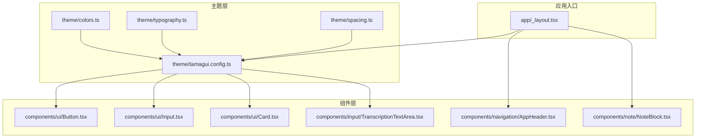
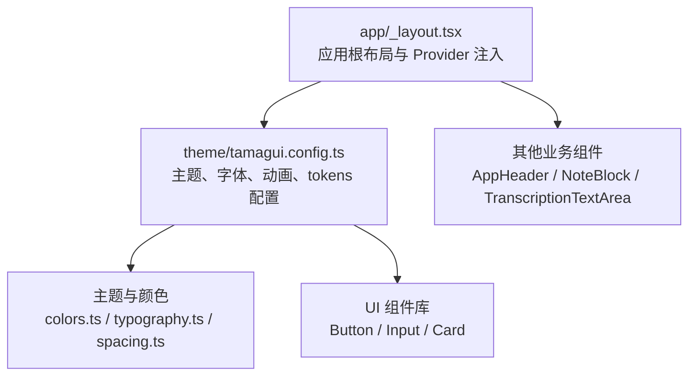
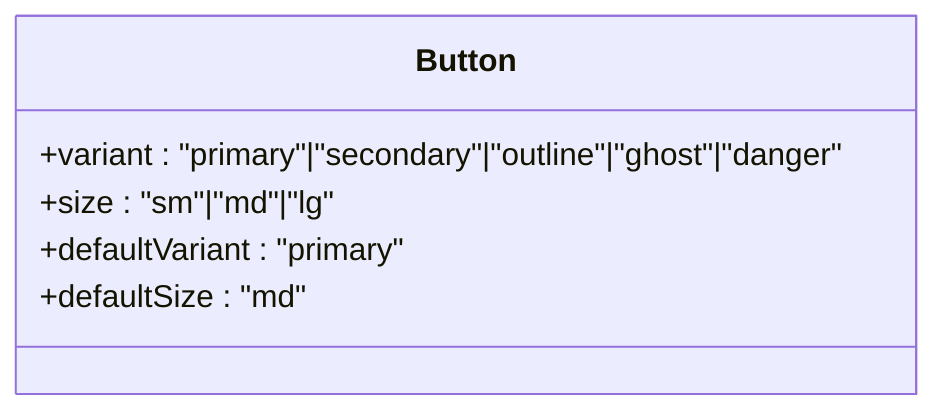
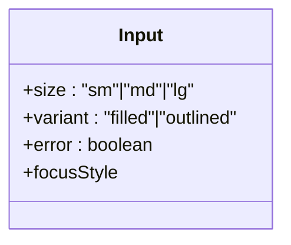
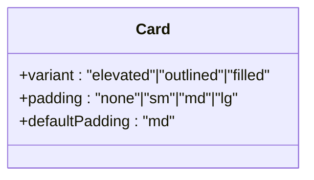
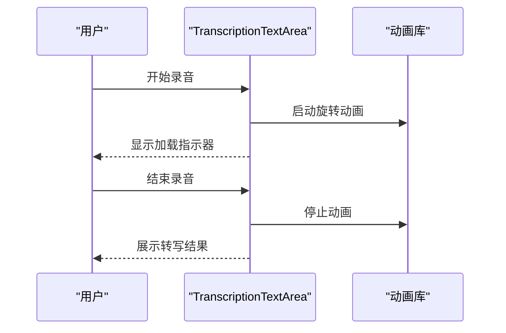
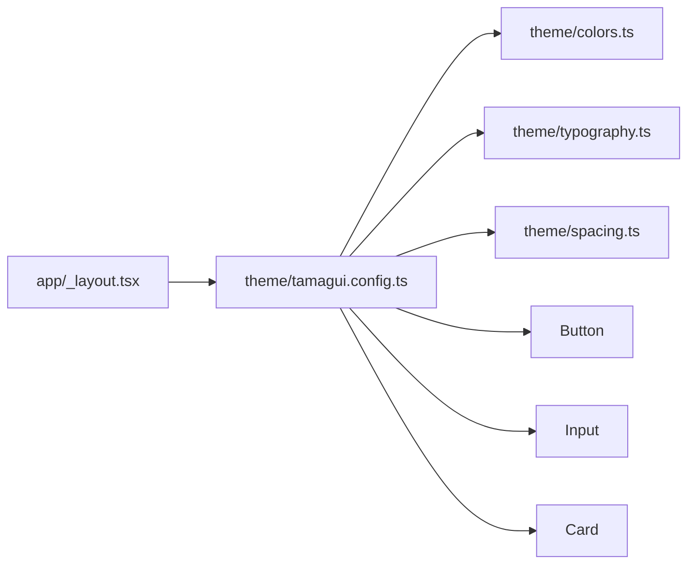

# UI 组件库

<cite>
**本文引用的文件**
- [components/ui/index.ts](file://components/ui/index.ts)
- [components/ui/Button.tsx](file://components/ui/Button.tsx)
- [components/ui/Input.tsx](file://components/ui/Input.tsx)
- [components/ui/Card.tsx](file://components/ui/Card.tsx)
- [theme/tamagui.config.ts](file://theme/tamagui.config.ts)
- [theme/colors.ts](file://theme/colors.ts)
- [theme/typography.ts](file://theme/typography.ts)
- [theme/spacing.ts](file://theme/spacing.ts)
- [theme/index.ts](file://theme/index.ts)
- [app/_layout.tsx](file://app/_layout.tsx)
- [components/input/TranscriptionTextArea.tsx](file://components/input/TranscriptionTextArea.tsx)
- [components/navigation/AppHeader.tsx](file://components/navigation/AppHeader.tsx)
- [components/note/NoteBlock.tsx](file://components/note/NoteBlock.tsx)
</cite>

## 目录
1. [简介](#简介)
2. [项目结构](#项目结构)
3. [核心组件](#核心组件)
4. [架构总览](#架构总览)
5. [详细组件分析](#详细组件分析)
6. [依赖关系分析](#依赖关系分析)
7. [性能考量](#性能考量)
8. [故障排查指南](#故障排查指南)
9. [结论](#结论)
10. [附录](#附录)

## 简介
本文件为 VoiceNote 的 UI 组件库文档，聚焦于基于 Tamagui 的组件设计体系与主题系统，系统性说明主题、颜色、排版与间距等设计令牌，以及核心 UI 组件（Button、Input、Card）的属性、变体、样式定制方式与可访问性支持。同时提供组件组合与复用策略、动画与交互反馈理念、可扩展的自定义组件开发流程、以及测试与文档生成方法，帮助设计师与开发者高效协作并保持一致的视觉与交互体验。

## 项目结构
UI 组件库围绕以下层次组织：
- 主题层：统一的颜色、字体、间距与动画配置，通过 Tamagui 的 tokens 与主题系统生效。
- 组件层：在 Tamagui 基础上进行轻量封装，形成语义明确的业务组件。
- 页面与容器层：通过布局与导航组件组合页面功能。

图表来源
- [theme/tamagui.config.ts:1-163](file://theme/tamagui.config.ts#L1-L163)
- [theme/colors.ts:1-102](file://theme/colors.ts#L1-L102)
- [theme/typography.ts:1-87](file://theme/typography.ts#L1-L87)
- [theme/spacing.ts:1-92](file://theme/spacing.ts#L1-L92)
- [components/ui/Button.tsx:1-57](file://components/ui/Button.tsx#L1-L57)
- [components/ui/Input.tsx:1-62](file://components/ui/Input.tsx#L1-L62)
- [components/ui/Card.tsx:1-48](file://components/ui/Card.tsx#L1-L48)
- [components/input/TranscriptionTextArea.tsx:1-156](file://components/input/TranscriptionTextArea.tsx#L1-L156)
- [components/navigation/AppHeader.tsx:1-84](file://components/navigation/AppHeader.tsx#L1-L84)
- [components/note/NoteBlock.tsx:1-171](file://components/note/NoteBlock.tsx#L1-L171)
- [app/_layout.tsx:1-101](file://app/_layout.tsx#L1-L101)

章节来源
- [theme/tamagui.config.ts:1-163](file://theme/tamagui.config.ts#L1-L163)
- [theme/index.ts:1-11](file://theme/index.ts#L1-L11)
- [app/_layout.tsx:1-101](file://app/_layout.tsx#L1-L101)

## 核心组件
本节对 Button、Input、Card 三个基础组件进行属性、变体与样式定制说明，并给出使用建议与最佳实践。

- Button
  - 变体（variant）
    - primary：强调主操作，背景色与文字色用于高对比度。
    - secondary：次级强调，浅色背景与深色文字。
    - outline：描边样式，透明背景+描边。
    - ghost：无背景，适合工具栏或低权重操作。
    - danger：危险操作，警示红。
  - 尺寸（size）
    - sm/md/lg 对应内边距与字号，适配不同信息密度场景。
  - 默认变体：primary；默认尺寸：md。
  - 使用建议：主次分明，避免同屏出现过多强调按钮；危险操作使用 danger 并配合二次确认。

- Input
  - 变体（variant）
    - filled：纯色填充，无边框，适合表单密集区域。
    - outlined：描边输入框，适合卡片或对话框。
  - 错误态（error）
    - true：边框与焦点态切换为警示色，提升可发现性。
  - 尺寸（size）
    - sm/md/lg，影响内边距与字号。
  - 焦点态（focusStyle）：聚焦时边框加粗并切换颜色，增强可用性。
  - 使用建议：在表单中结合错误态与占位符提示，确保无障碍可读性。

- Card
  - 变体（variant）
    - elevated：带阴影，突出层级。
    - outlined：描边卡片，简洁风格。
    - filled：弱填充，降低视觉重量。
  - 内边距（padding）
    - none/sm/md/lg，满足从紧凑到宽松的信息展示需求。
  - 使用建议：内容卡片优先使用 elevated 或 outlined；信息区块可选 filled 以弱化背景。

章节来源
- [components/ui/Button.tsx:1-57](file://components/ui/Button.tsx#L1-L57)
- [components/ui/Input.tsx:1-62](file://components/ui/Input.tsx#L1-L62)
- [components/ui/Card.tsx:1-48](file://components/ui/Card.tsx#L1-L48)
- [components/ui/index.ts:1-9](file://components/ui/index.ts#L1-L9)

## 架构总览
VoiceNote 的 UI 架构以 Tamagui 为核心，通过主题配置与 tokens 实现跨平台一致的视觉语言，并在应用入口集中注入主题与国际化能力。

图表来源
- [app/_layout.tsx:1-101](file://app/_layout.tsx#L1-L101)
- [theme/tamagui.config.ts:1-163](file://theme/tamagui.config.ts#L1-L163)
- [theme/colors.ts:1-102](file://theme/colors.ts#L1-L102)
- [theme/typography.ts:1-87](file://theme/typography.ts#L1-L87)
- [theme/spacing.ts:1-92](file://theme/spacing.ts#L1-L92)
- [components/navigation/AppHeader.tsx:1-84](file://components/navigation/AppHeader.tsx#L1-L84)
- [components/note/NoteBlock.tsx:1-171](file://components/note/NoteBlock.tsx#L1-L171)
- [components/input/TranscriptionTextArea.tsx:1-156](file://components/input/TranscriptionTextArea.tsx#L1-L156)

## 详细组件分析

### Button 组件分析
- 设计要点
  - 通过 variants 定义语义化外观，结合 tokens 控制圆角、内边距与字号。
  - 默认变体与尺寸确保开箱即用的一致体验。
- 可访问性
  - 建议在按钮文本外层包裹可聚焦元素，保证键盘可达与屏幕阅读器识别。
- 复用策略
  - 将常用变体封装为页面级别别名（如“提交”、“取消”），减少直接使用变体带来的样式漂移。

图表来源
- [components/ui/Button.tsx:1-57](file://components/ui/Button.tsx#L1-L57)

章节来源
- [components/ui/Button.tsx:1-57](file://components/ui/Button.tsx#L1-L57)

### Input 组件分析
- 设计要点
  - 支持 filled 与 outlined 两种风格，满足不同容器的视觉需求。
  - 错误态通过边框与 focusStyle 切换，提升用户纠错效率。
- 可访问性
  - 建议与标签或辅助文本配合使用，确保无障碍上下文清晰。
- 复用策略
  - 在表单容器中统一封装 Input 与错误提示，形成“输入-校验-反馈”的闭环。

图表来源
- [components/ui/Input.tsx:1-62](file://components/ui/Input.tsx#L1-L62)

章节来源
- [components/ui/Input.tsx:1-62](file://components/ui/Input.tsx#L1-L62)

### Card 组件分析
- 设计要点
  - 通过 variant 与 padding 的组合，覆盖从信息块到内容面板的多种场景。
  - elevated 提供层级感，outlined 强调边界，filled 降低视觉重量。
- 复用策略
  - 将 Card 作为页面模块的容器，内部再嵌套 Button、Input 等子组件，形成稳定的布局基元。

图表来源
- [components/ui/Card.tsx:1-48](file://components/ui/Card.tsx#L1-L48)

章节来源
- [components/ui/Card.tsx:1-48](file://components/ui/Card.tsx#L1-L48)

### 动画与交互反馈
- 动画系统
  - 通过 Tamagui 的动画配置提供默认、bouncy、lazy、quick 等预设，适用于不同反馈节奏。
- 交互反馈
  - 录音状态使用专用颜色与脉冲效果；编辑态提供闪烁光标；加载态使用旋转指示器。
- 最佳实践
  - 节奏与语义匹配：重要操作使用 bouncy，快速反馈使用 quick，过渡使用 default。

图表来源
- [components/input/TranscriptionTextArea.tsx:1-156](file://components/input/TranscriptionTextArea.tsx#L1-L156)

章节来源
- [theme/tamagui.config.ts:24-42](file://theme/tamagui.config.ts#L24-L42)
- [components/input/TranscriptionTextArea.tsx:1-156](file://components/input/TranscriptionTextArea.tsx#L1-L156)

### 可访问性与响应式设计
- 可访问性
  - 按钮与列表项提供可聚焦与可读标签，确保键盘与屏幕阅读器可用。
  - 文字颜色与对比度遵循主题提供的明暗两套配色，保障可读性。
- 响应式设计
  - 通过 tokens 中的 spacing、borderRadius 与 layout 常量，统一移动端断点下的间距与布局约束。
  - 字体大小与行高按 preset 预设，保证在不同设备上的可读性一致性。

章节来源
- [components/note/NoteBlock.tsx:1-171](file://components/note/NoteBlock.tsx#L1-L171)
- [theme/spacing.ts:78-87](file://theme/spacing.ts#L78-L87)
- [theme/typography.ts:35-81](file://theme/typography.ts#L35-L81)

### 组件组合与复用策略
- 组合模式
  - 以 Card 为容器承载一组 Input 与 Button，形成标准表单区块。
  - 以 AppHeader 作为页面头部，内含胶囊标签与操作图标，统一导航与动作区。
- 复用策略
  - 将通用交互（如长按、点击）抽象为 Hook 或 HOC，减少重复逻辑。
  - 通过主题 tokens 与变体控制样式差异，避免硬编码颜色与尺寸。

章节来源
- [components/navigation/AppHeader.tsx:1-84](file://components/navigation/AppHeader.tsx#L1-L84)
- [components/note/NoteBlock.tsx:1-171](file://components/note/NoteBlock.tsx#L1-L171)

## 依赖关系分析
- 主题依赖
  - 组件依赖 Tamagui 的 tokens 与主题系统，颜色、字体、间距由主题配置集中管理。
- 应用入口依赖
  - 应用根布局负责注入 TamaguiProvider 与主题，默认根据系统主题选择 light/dark。
- 组件间依赖
  - UI 组件之间无直接耦合，通过主题 tokens 与变体协同工作，具备良好内聚与低耦合。

图表来源
- [app/_layout.tsx:1-101](file://app/_layout.tsx#L1-L101)
- [theme/tamagui.config.ts:1-163](file://theme/tamagui.config.ts#L1-L163)
- [theme/colors.ts:1-102](file://theme/colors.ts#L1-L102)
- [theme/typography.ts:1-87](file://theme/typography.ts#L1-L87)
- [theme/spacing.ts:1-92](file://theme/spacing.ts#L1-L92)
- [components/ui/Button.tsx:1-57](file://components/ui/Button.tsx#L1-L57)
- [components/ui/Input.tsx:1-62](file://components/ui/Input.tsx#L1-L62)
- [components/ui/Card.tsx:1-48](file://components/ui/Card.tsx#L1-L48)

章节来源
- [app/_layout.tsx:1-101](file://app/_layout.tsx#L1-L101)
- [theme/tamagui.config.ts:1-163](file://theme/tamagui.config.ts#L1-L163)

## 性能考量
- 渲染优化
  - 使用 Tamagui 的变体与 tokens 进行样式计算，减少运行时样式对象创建。
  - 在滚动区域（如转写文本域）使用懒加载与最小必要重绘。
- 动画性能
  - 采用原生驱动的动画（如旋转、闪烁），避免强制同步布局。
- 主题切换
  - 通过系统主题自动切换，避免频繁的主题重建与全局重渲染。

## 故障排查指南
- 主题不生效
  - 检查应用根布局是否正确注入 TamaguiProvider 与默认主题。
  - 确认主题配置文件未被意外修改，tokens 与主题映射一致。
- 样式异常
  - 检查组件变体与默认值是否符合预期；避免在组件内部硬编码颜色与尺寸。
- 动画卡顿
  - 确认动画配置合理，避免在同一时间触发多个重型动画。
- 可访问性问题
  - 确保按钮与列表项具备可聚焦与可读标签；检查颜色对比度满足明暗主题要求。

章节来源
- [app/_layout.tsx:1-101](file://app/_layout.tsx#L1-L101)
- [theme/tamagui.config.ts:132-163](file://theme/tamagui.config.ts#L132-L163)

## 结论
VoiceNote 的 UI 组件库以 Tamagui 为主题核心，通过统一的颜色、字体、间距与动画配置，实现了跨平台一致的视觉与交互体验。Button、Input、Card 等基础组件以变体与 tokens 为基础，既保证了灵活性又维持了设计一致性。配合良好的组合与复用策略、完善的可访问性与响应式设计原则，以及合理的动画与交互反馈理念，能够为设计师与开发者提供稳定可靠的组件使用与扩展指导。

## 附录

### 主题系统与设计令牌
- 颜色体系
  - 主色板与灰阶：提供从 50 到 900 的多级映射，适配明暗主题。
  - 语义色：success、warning、error 用于状态表达。
  - 录音相关：active、pulse、idle 三色用于录制状态反馈。
- 字体与排版
  - 字号、字重、行高与字距统一管理，提供 heading/body/caption/label/button 等预设。
- 间距与圆角
  - spacing、borderRadius、shadows、layout 提供布局与层级的统一约束。

章节来源
- [theme/colors.ts:1-102](file://theme/colors.ts#L1-L102)
- [theme/typography.ts:1-87](file://theme/typography.ts#L1-L87)
- [theme/spacing.ts:1-92](file://theme/spacing.ts#L1-L92)
- [theme/tamagui.config.ts:44-93](file://theme/tamagui.config.ts#L44-L93)

### 自定义组件开发流程与规范
- 开发流程
  - 基于现有组件进行封装，优先使用变体与 tokens，避免硬编码样式。
  - 明确 props 与事件接口，保持与现有组件一致的命名与行为。
  - 在应用入口统一注册与测试，确保主题与动画正常工作。
- 规范要求
  - 使用 Tamagui 的 styled 工具进行封装，遵循变体与默认值约定。
  - 保证可访问性：提供可聚焦与可读标签，确保键盘与屏幕阅读器可用。
  - 保持一致性：沿用主题 tokens 与排版预设，避免视觉漂移。

章节来源
- [components/ui/Button.tsx:1-57](file://components/ui/Button.tsx#L1-L57)
- [components/ui/Input.tsx:1-62](file://components/ui/Input.tsx#L1-L62)
- [components/ui/Card.tsx:1-48](file://components/ui/Card.tsx#L1-L48)

### 组件测试与文档生成
- 测试建议
  - 单元测试：针对组件 props、变体与事件回调进行断言。
  - 可访问性测试：验证键盘可达性与屏幕阅读器标签。
  - 主题测试：在 light/dark 主题下验证颜色与对比度。
- 文档生成
  - 使用类型导出与注释生成 API 文档，确保属性、事件与默认值清晰可见。
  - 为每个组件提供使用示例与最佳实践，便于团队协作与知识沉淀。