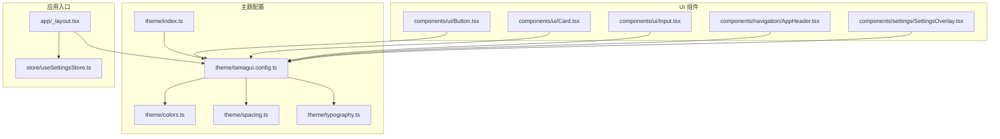
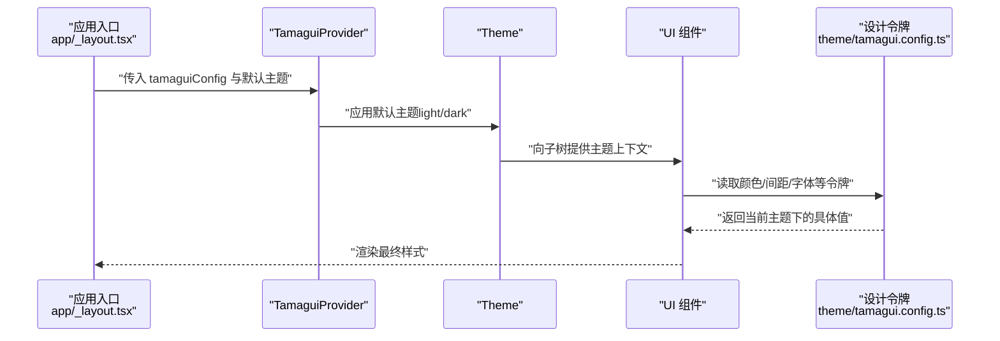
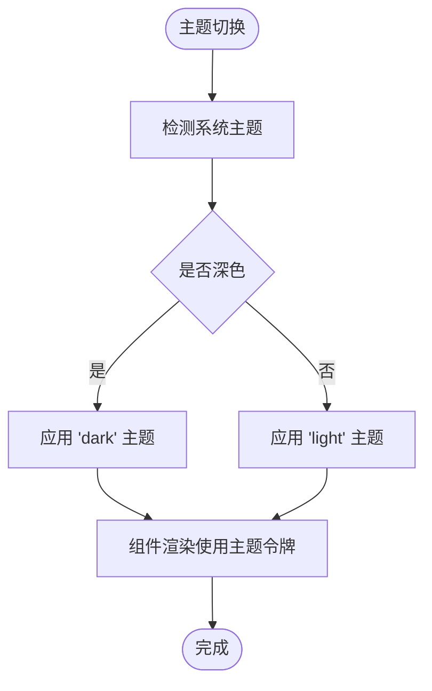
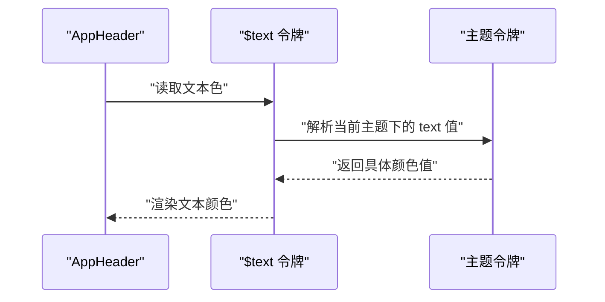
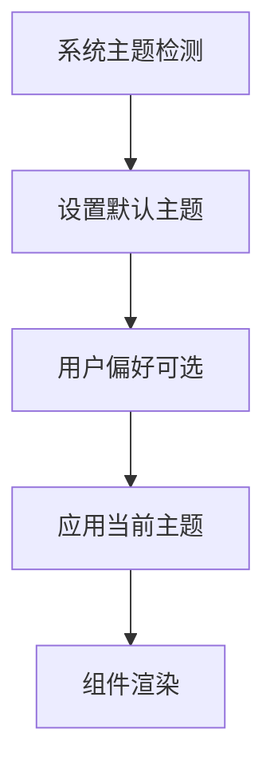
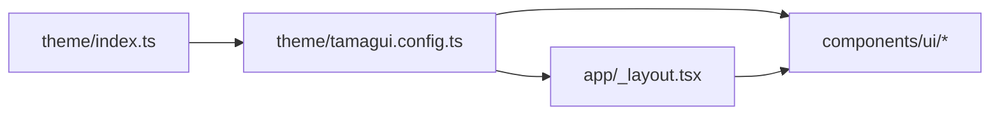

# 主题系统

<cite>
**本文档引用的文件**
- [theme/tamagui.config.ts](file://theme/tamagui.config.ts)
- [theme/index.ts](file://theme/index.ts)
- [theme/colors.ts](file://theme/colors.ts)
- [theme/spacing.ts](file://theme/spacing.ts)
- [theme/typography.ts](file://theme/typography.ts)
- [app/_layout.tsx](file://app/_layout.tsx)
- [store/useSettingsStore.ts](file://store/useSettingsStore.ts)
- [components/ui/Button.tsx](file://components/ui/Button.tsx)
- [components/ui/Card.tsx](file://components/ui/Card.tsx)
- [components/ui/Input.tsx](file://components/ui/Input.tsx)
- [components/navigation/AppHeader.tsx](file://components/navigation/AppHeader.tsx)
- [components/settings/SettingsOverlay.tsx](file://components/settings/SettingsOverlay.tsx)
</cite>

## 目录
1. [简介](#简介)
2. [项目结构](#项目结构)
3. [核心组件](#核心组件)
4. [架构总览](#架构总览)
5. [详细组件分析](#详细组件分析)
6. [依赖关系分析](#依赖关系分析)
7. [性能考量](#性能考量)
8. [故障排除指南](#故障排除指南)
9. [结论](#结论)
10. [附录](#附录)

## 简介
本文件系统性地文档化 VoiceNote 基于 Tamagui 的主题系统，涵盖颜色体系、间距规范、排版体系、主题变量的定义与继承、深色/浅色模式实现、主题定制流程与最佳实践、主题与组件样式的集成方式、响应式设计与无障碍支持等。目标是为设计师与开发者提供可操作的主题扩展与品牌定制指导。

## 项目结构
主题系统围绕 theme 目录下的配置文件组织，通过 Tamagui 提供的设计令牌（tokens）与主题（themes）将颜色、字体、间距、圆角、阴影等统一管理，并在应用入口与组件层进行消费与渲染。



**图表来源**
- [theme/tamagui.config.ts:1-163](file://theme/tamagui.config.ts#L1-L163)
- [theme/index.ts:1-11](file://theme/index.ts#L1-L11)
- [app/_layout.tsx:1-101](file://app/_layout.tsx#L1-L101)
- [store/useSettingsStore.ts:1-218](file://store/useSettingsStore.ts#L1-L218)
- [components/ui/Button.tsx:1-57](file://components/ui/Button.tsx#L1-L57)
- [components/ui/Card.tsx:1-48](file://components/ui/Card.tsx#L1-L48)
- [components/ui/Input.tsx:1-62](file://components/ui/Input.tsx#L1-L62)
- [components/navigation/AppHeader.tsx:1-84](file://components/navigation/AppHeader.tsx#L1-L84)
- [components/settings/SettingsOverlay.tsx:1-186](file://components/settings/SettingsOverlay.tsx#L1-L186)

**章节来源**
- [theme/tamagui.config.ts:1-163](file://theme/tamagui.config.ts#L1-L163)
- [theme/index.ts:1-11](file://theme/index.ts#L1-L11)
- [app/_layout.tsx:1-101](file://app/_layout.tsx#L1-L101)

## 核心组件
- 颜色系统：定义主色板、灰阶、语义色（成功/警告/错误）、录制状态色，并映射浅色与深色主题的具体值。
- 间距与圆角：提供从 0 到 32 的离散间距与多级圆角半径，确保一致的布局节奏。
- 排版体系：定义字号、行高、字重与字距，并提供标题、正文、标签、按钮等预设样式。
- 动画与令牌：通过 Tamagui 创建动画、字体与设计令牌，统一尺寸、空间、半径、zIndex、颜色等。
- 主题：定义 light/dark 两套主题，映射背景、表面、文本、边框与语义色。
- 应用入口：在应用根部注入 TamaguiProvider 并根据系统主题选择默认主题；同时在部分场景（如设置面板）显式指定主题。

**章节来源**
- [theme/colors.ts:1-102](file://theme/colors.ts#L1-L102)
- [theme/spacing.ts:1-92](file://theme/spacing.ts#L1-L92)
- [theme/typography.ts:1-87](file://theme/typography.ts#L1-L87)
- [theme/tamagui.config.ts:44-154](file://theme/tamagui.config.ts#L44-L154)
- [app/_layout.tsx:37-86](file://app/_layout.tsx#L37-L86)

## 架构总览
Tamagui 将设计令牌与主题解耦：令牌负责“值”的标准化，主题负责“值”的组合与命名。应用入口通过 TamaguiProvider 注入配置与默认主题，组件通过 Tamagui 的 styled 工具消费令牌并自动适配当前主题。



**图表来源**
- [app/_layout.tsx:37-86](file://app/_layout.tsx#L37-L86)
- [theme/tamagui.config.ts:132-154](file://theme/tamagui.config.ts#L132-L154)

**章节来源**
- [app/_layout.tsx:37-86](file://app/_layout.tsx#L37-L86)
- [theme/tamagui.config.ts:132-154](file://theme/tamagui.config.ts#L132-L154)

## 详细组件分析

### 颜色系统与主题映射
- 主色板与灰阶：提供 50–900 的分阶色，用于强调、中性与语义表达。
- 语义色：success/warning/error 分别对应绿色系、黄色系、红色系，便于传达状态与反馈。
- 录制状态色：独立映射录制中的激活、脉冲与空闲状态色。
- 浅色/深色主题：分别映射背景、表面、文本、边框等基础色，形成对比度与可读性保障。



**图表来源**
- [app/_layout.tsx:27-41](file://app/_layout.tsx#L27-L41)
- [theme/colors.ts:78-99](file://theme/colors.ts#L78-L99)

**章节来源**
- [theme/colors.ts:1-102](file://theme/colors.ts#L1-L102)
- [app/_layout.tsx:27-41](file://app/_layout.tsx#L27-L41)

### 间距、圆角与阴影规范
- 间距：提供从 0 到 32 的离散步进，兼顾移动端触摸目标与视觉留白。
- 圆角：提供 sm–full 多级半径，满足卡片、输入框、胶囊按钮等不同形态。
- 阴影：提供 sm–xl 多级阴影，统一平台阴影与 elevation 表达。
- 布局常量：屏幕内边距、卡片内边距、列表项间距、标签栏高度、头部高度、最大内容宽度等。

```mermaid
classDiagram
class Spacing {
"+0 到 +32 的离散步进"
}
class BorderRadius {
"+sm 到 +full 多级半径"
}
class Shadows {
"+none 到 +xl 多级阴影"
}
class Layout {
"+screenPadding"
"+cardPadding"
"+listItemPadding"
"+sectionGap"
"+tabBarHeight"
"+headerHeight"
"+maxContentWidth"
}
Spacing <.. Layout : "被布局常量引用"
BorderRadius <.. Layout : "被布局常量引用"
Shadows <.. Layout : "被布局常量引用"
```

**图表来源**
- [theme/spacing.ts:1-92](file://theme/spacing.ts#L1-L92)

**章节来源**
- [theme/spacing.ts:1-92](file://theme/spacing.ts#L1-L92)

### 排版体系与预设
- 字号：xs–7xl 覆盖从微小到标题的全场景需求。
- 行高：tight/normal/relaxed 对应不同信息密度。
- 字重：normal/medium/semibold/bold 满足层级与强调。
- 字距：tight/normal/wide 适配不同语言与风格。
- 预设：heading1–4、body、bodySmall、caption、label、button 等，统一标题、正文、标签与按钮的视觉规范。

```mermaid
classDiagram
class Typography {
"+fontSizes"
"+lineHeights"
"+fontWeights"
"+letterSpacings"
"+typography 预设"
}
class Tokens {
"+size 映射字号"
}
Typography --> Tokens : "提供字号与行高等值"
```

**图表来源**
- [theme/typography.ts:1-87](file://theme/typography.ts#L1-L87)
- [theme/tamagui.config.ts:45-62](file://theme/tamagui.config.ts#L45-L62)

**章节来源**
- [theme/typography.ts:1-87](file://theme/typography.ts#L1-L87)
- [theme/tamagui.config.ts:45-62](file://theme/tamagui.config.ts#L45-L62)

### 设计令牌与主题构建
- 令牌：size（含字号别名）、space、radius、zIndex、color（含主色、灰阶、语义色与主题色）。
- 主题：light/dark 两套，映射背景、表面、文本、边框、语义色与交互态（hover/active）。
- 字体与动画：通过 Inter 字体与内置动画集，提供一致的排版与动效体验。

```mermaid
classDiagram
class Tokens {
"+size"
"+space"
"+radius"
"+zIndex"
"+color"
}
class Themes {
"+light"
"+dark"
}
class Fonts {
"+heading"
"+body"
}
class Animations {
"+default"
"+bouncy"
"+lazy"
"+quick"
}
Tokens <.. Themes : "被主题引用"
Fonts <.. Config : "配置"
Animations <.. Config : "配置"
```

**图表来源**
- [theme/tamagui.config.ts:44-154](file://theme/tamagui.config.ts#L44-L154)

**章节来源**
- [theme/tamagui.config.ts:44-154](file://theme/tamagui.config.ts#L44-L154)

### 组件样式与主题集成
- UI 组件：Button、Card、Input 等通过 styled 包装 Tamagui 原子组件，使用主题令牌实现颜色与尺寸的自动适配。
- 导航与页面：AppHeader 使用 $text 令牌获取当前主题文本色；设置面板在特定场景下显式指定主题以保证对比度与一致性。
- 设置覆盖：SettingsOverlay 在弹窗内部强制使用浅色主题，避免与系统深色模式冲突。



**图表来源**
- [components/navigation/AppHeader.tsx:36-38](file://components/navigation/AppHeader.tsx#L36-L38)
- [theme/tamagui.config.ts:96-129](file://theme/tamagui.config.ts#L96-L129)

**章节来源**
- [components/ui/Button.tsx:1-57](file://components/ui/Button.tsx#L1-L57)
- [components/ui/Card.tsx:1-48](file://components/ui/Card.tsx#L1-L48)
- [components/ui/Input.tsx:1-62](file://components/ui/Input.tsx#L1-L62)
- [components/navigation/AppHeader.tsx:36-38](file://components/navigation/AppHeader.tsx#L36-L38)
- [components/settings/SettingsOverlay.tsx:90-91](file://components/settings/SettingsOverlay.tsx#L90-L91)

### 深色/浅色模式实现
- 默认主题：应用入口根据系统主题选择 light 或 dark 作为默认主题。
- 主题切换：设置存储包含 theme 字段，支持 light/dark/system 三种模式；当前代码未直接监听该字段进行主题切换，但结构已预留。
- 局部主题：在设置面板等场景显式包裹 Theme 组件以固定主题，确保 UI 对比度与可读性。



**图表来源**
- [app/_layout.tsx:27-41](file://app/_layout.tsx#L27-L41)
- [store/useSettingsStore.ts:6-22](file://store/useSettingsStore.ts#L6-L22)

**章节来源**
- [app/_layout.tsx:27-41](file://app/_layout.tsx#L27-L41)
- [store/useSettingsStore.ts:6-22](file://store/useSettingsStore.ts#L6-L22)

### 响应式设计与无障碍支持
- 响应式：通过布局常量（最大内容宽度、头部高度、标签栏高度）与间距体系，配合容器自适应与安全区域处理，实现跨设备一致性。
- 无障碍：建议在组件中优先使用 Tamagui 的语义化属性与令牌，避免硬编码颜色与尺寸；确保文本对比度符合 WCAG 建议（当前主题已提供高对比度基础）。

**章节来源**
- [theme/spacing.ts:78-87](file://theme/spacing.ts#L78-L87)
- [components/navigation/AppHeader.tsx:24-25](file://components/navigation/AppHeader.tsx#L24-L25)

## 依赖关系分析
主题系统的关键依赖链：
- theme/index.ts 汇总导出颜色、排版、间距与配置，供应用与组件使用。
- app/_layout.tsx 引入 tamagui.config 并注入 Provider，默认主题由系统主题决定。
- 组件通过 styled 与令牌消费主题值，无需感知具体颜色值。



**图表来源**
- [theme/index.ts:1-11](file://theme/index.ts#L1-L11)
- [theme/tamagui.config.ts:1-163](file://theme/tamagui.config.ts#L1-L163)
- [app/_layout.tsx:1-101](file://app/_layout.tsx#L1-L101)

**章节来源**
- [theme/index.ts:1-11](file://theme/index.ts#L1-L11)
- [theme/tamagui.config.ts:1-163](file://theme/tamagui.config.ts#L1-L163)
- [app/_layout.tsx:1-101](file://app/_layout.tsx#L1-L101)

## 性能考量
- 令牌复用：通过集中定义的 tokens 减少重复计算与样式对象体积。
- 主题切换成本：轻量级上下文切换，避免在运行时频繁重建样式。
- 渲染优化：组件样式尽量使用令牌而非内联硬编码值，利于缓存与批量更新。

## 故障排除指南
- 文本对比度不足：检查 $text 与 $background 的主题映射是否匹配；必要时调整灰阶或语义色。
- 颜色不随系统主题变化：确认应用入口的默认主题逻辑与系统主题一致；若需动态切换，可在设置存储基础上增加监听器。
- 阴影与 elevation 不一致：统一使用 theme/shadows 中的预设，避免平台差异导致的视觉偏差。
- 组件局部主题冲突：在弹窗或覆盖层显式包裹 Theme 组件，确保对比度与可读性。

**章节来源**
- [app/_layout.tsx:37-86](file://app/_layout.tsx#L37-L86)
- [components/settings/SettingsOverlay.tsx:90-91](file://components/settings/SettingsOverlay.tsx#L90-L91)

## 结论
VoiceNote 的主题系统以 Tamagui 为核心，通过清晰的颜色、排版与间距体系，结合轻量的主题映射与令牌抽象，实现了跨平台的一致性与可维护性。建议在现有基础上完善主题动态切换能力，并持续以令牌驱动组件样式，确保品牌扩展与无障碍支持的长期演进。

## 附录

### 主题定制开发流程与最佳实践
- 定义新令牌：在 colors/spacing/typography 中新增键值，保持命名语义化与可复用性。
- 扩展主题：在 themes 中添加新的语义映射，避免直接写死颜色值。
- 组件消费：优先使用令牌名称（如 $text、$surface），避免硬编码。
- 局部主题：在弹窗、模态等场景显式包裹 Theme，确保对比度与一致性。
- 可访问性：关注文本对比度与交互目标尺寸，遵循 WCAG 建议。
- 响应式：利用布局常量与安全区域，保证在不同设备上的可用性。

### 主题变量速查
- 颜色：主色、灰阶、语义色、录制状态色、主题映射（背景/表面/文本/边框）
- 间距：0–32 的离散步进
- 圆角：sm–full 多级半径
- 阴影：none–xl 多级阴影
- 排版：字号、行高、字重、字距与预设

**章节来源**
- [theme/colors.ts:1-102](file://theme/colors.ts#L1-L102)
- [theme/spacing.ts:1-92](file://theme/spacing.ts#L1-L92)
- [theme/typography.ts:1-87](file://theme/typography.ts#L1-L87)
- [theme/tamagui.config.ts:44-154](file://theme/tamagui.config.ts#L44-L154)