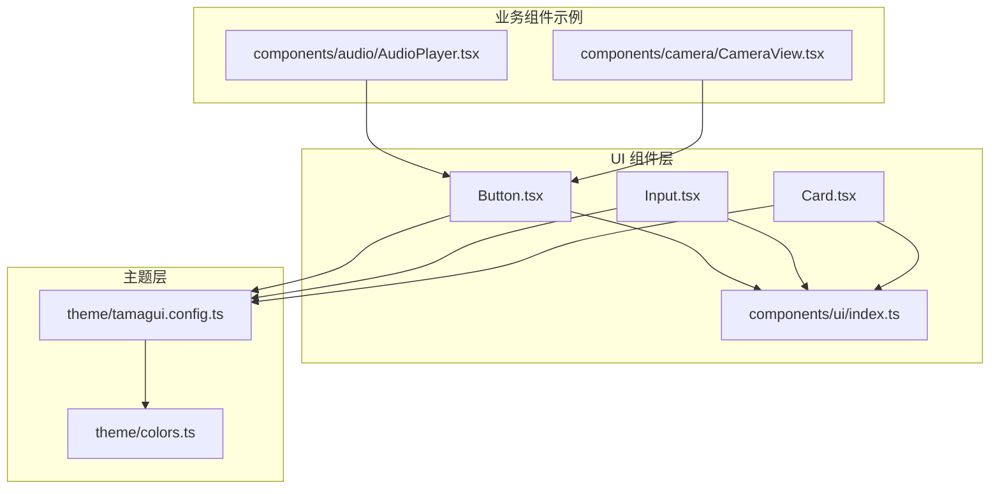
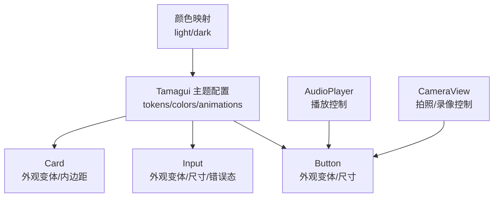
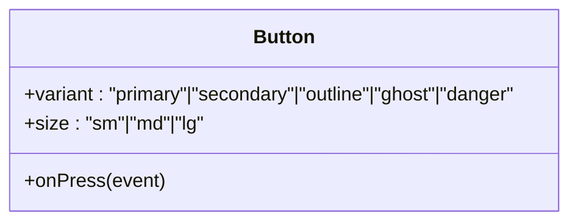
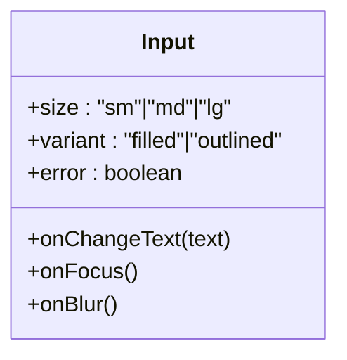
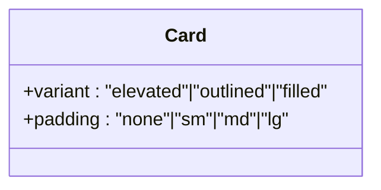
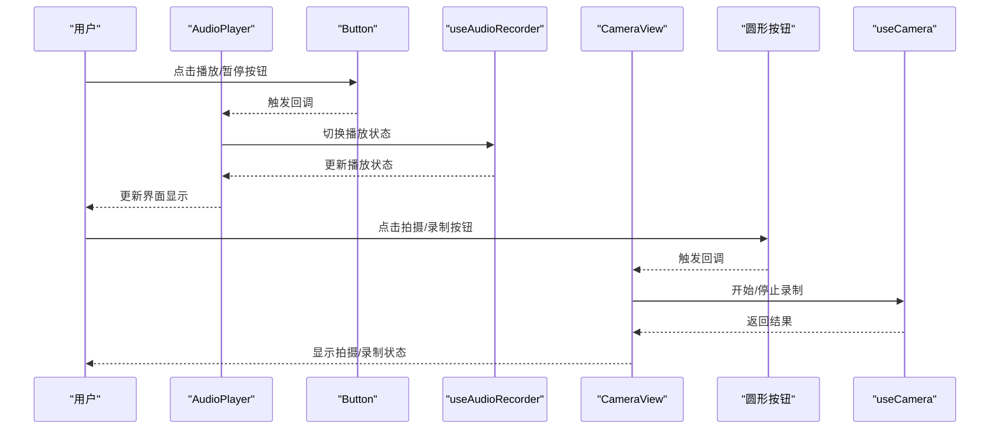
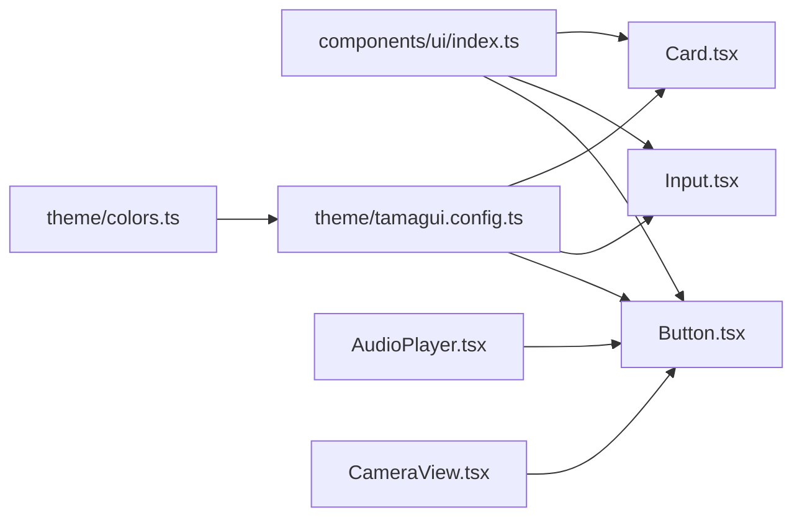

# 基础 UI 组件

<cite>
**本文引用的文件**
- [Button.tsx](file://components/ui/Button.tsx)
- [Input.tsx](file://components/ui/Input.tsx)
- [Card.tsx](file://components/ui/Card.tsx)
- [index.ts（UI 导出）](file://components/ui/index.ts)
- [tamagui.config.ts（主题配置）](file://theme/tamagui.config.ts)
- [colors.ts（颜色定义）](file://theme/colors.ts)
- [AudioPlayer.tsx（按钮使用示例）](file://components/audio/AudioPlayer.tsx)
- [CameraView.tsx（按钮使用示例）](file://components/camera/CameraView.tsx)
</cite>

## 目录
1. [简介](#简介)
2. [项目结构](#项目结构)
3. [核心组件](#核心组件)
4. [架构总览](#架构总览)
5. [详细组件分析](#详细组件分析)
6. [依赖关系分析](#依赖关系分析)
7. [性能考量](#性能考量)
8. [故障排查指南](#故障排查指南)
9. [结论](#结论)
10. [附录](#附录)

## 简介
本文件系统性地文档化 VoiceNote 项目中的基础 UI 组件：Button、Input、Card。内容涵盖组件属性与变体、事件处理、样式定制、可访问性与响应式支持、主题适配、使用示例与最佳实践、内部状态管理与生命周期说明、测试与调试建议，以及扩展与自定义指导。目标是帮助开发者在不同场景下正确、一致地使用这些组件，并在此基础上进行安全的扩展。

## 项目结构
基础 UI 组件位于 components/ui 目录，采用 Tamagui styled 组件封装，统一通过 index.ts 暴露类型与导出，便于集中引入与维护。主题系统由 theme/tamagui.config.ts 驱动，提供字体、动画、tokens、颜色主题等全局配置。

图表来源
- [Button.tsx:1-57](file://components/ui/Button.tsx#L1-L57)
- [Input.tsx:1-62](file://components/ui/Input.tsx#L1-L62)
- [Card.tsx:1-48](file://components/ui/Card.tsx#L1-L48)
- [index.ts（UI 导出）:1-9](file://components/ui/index.ts#L1-L9)
- [tamagui.config.ts（主题配置）:1-163](file://theme/tamagui.config.ts#L1-L163)
- [colors.ts（颜色定义）:1-102](file://theme/colors.ts#L1-L102)
- [AudioPlayer.tsx（按钮使用示例）:1-132](file://components/audio/AudioPlayer.tsx#L1-L132)
- [CameraView.tsx（按钮使用示例）:1-140](file://components/camera/CameraView.tsx#L1-L140)

章节来源
- [index.ts（UI 导出）:1-9](file://components/ui/index.ts#L1-L9)
- [tamagui.config.ts（主题配置）:1-163](file://theme/tamagui.config.ts#L1-L163)

## 核心组件
本节概述三个基础组件的能力边界与通用特性：
- Button：用于触发操作，支持多种外观变体与尺寸，具备圆角、阴影、边框等视觉风格。
- Input：用于文本输入，支持填充与描边两种外观、错误态、聚焦态样式，提供尺寸变体。
- Card：用于内容容器，支持多种外观变体（加阴影、描边、填充）与内边距变体，适合信息区块布局。

章节来源
- [Button.tsx:1-57](file://components/ui/Button.tsx#L1-L57)
- [Input.tsx:1-62](file://components/ui/Input.tsx#L1-L62)
- [Card.tsx:1-48](file://components/ui/Card.tsx#L1-L48)

## 架构总览
以下图展示了基础 UI 组件与主题系统、业务组件之间的关系。Button、Input、Card 通过 Tamagui styled 封装，继承主题 tokens 与颜色体系；业务组件在各自场景中按需组合使用这些基础组件。

图表来源
- [tamagui.config.ts（主题配置）:44-93](file://theme/tamagui.config.ts#L44-L93)
- [colors.ts（颜色定义）:79-99](file://theme/colors.ts#L79-L99)
- [Button.tsx:4-54](file://components/ui/Button.tsx#L4-L54)
- [Input.tsx:4-59](file://components/ui/Input.tsx#L4-L59)
- [Card.tsx:4-45](file://components/ui/Card.tsx#L4-L45)
- [AudioPlayer.tsx（按钮使用示例）:100-127](file://components/audio/AudioPlayer.tsx#L100-L127)
- [CameraView.tsx（按钮使用示例）:101-134](file://components/camera/CameraView.tsx#L101-L134)

## 详细组件分析

### Button 组件
- 设计要点
  - 基于 Tamagui Button 进行样式封装，定义了多套外观变体（primary、secondary、outline、ghost、danger）与尺寸变体（sm、md、lg），默认变体为 primary+md。
  - 使用主题 tokens 控制圆角、内边距、字号与颜色，确保与整体设计系统一致。
- 属性与事件
  - 外观变体：variant（primary、secondary、outline、ghost、danger）
  - 尺寸变体：size（sm、md、lg）
  - 默认变体：variant='primary'，size='md'
  - 事件：支持标准点击事件（onPress 等），具体行为由上层业务组件绑定。
- 样式定制
  - 可通过 Tamagui 的 variants 机制在上层组合使用，或在业务组件中以 styled 方式进一步覆盖。
  - 支持 Tamagui 的通用样式属性（如 backgroundColor、borderRadius、padding 等）。
- 可访问性与响应式
  - 可访问性：建议在按钮文案不充分时提供无障碍标签（如 accessibilityLabel），并保证足够的触摸目标尺寸。
  - 响应式：尺寸与内边距随 size 变体自动调整，适配移动端交互。
- 使用示例与最佳实践
  - 在播放器中作为圆形控制按钮使用，配合 chromeless 与 size 调整视觉权重。
  - 在相机中作为圆形录制按钮使用，结合录制状态动态改变背景色。
- 生命周期与状态
  - 组件本身无内部状态，状态由上层业务逻辑（如播放状态、录制状态）驱动。
- 扩展与自定义
  - 可新增变体（如 icon-only、text-only），或在业务层通过 styled 组合扩展。
  - 建议保持与主题 tokens 的耦合，避免硬编码颜色与尺寸。

图表来源
- [Button.tsx:7-54](file://components/ui/Button.tsx#L7-L54)

章节来源
- [Button.tsx:1-57](file://components/ui/Button.tsx#L1-L57)
- [AudioPlayer.tsx（按钮使用示例）:100-127](file://components/audio/AudioPlayer.tsx#L100-L127)
- [CameraView.tsx（按钮使用示例）:111-130](file://components/camera/CameraView.tsx#L111-L130)

### Input 组件
- 设计要点
  - 基于 Tamagui Input 封装，提供填充（filled）与描边（outlined）两种外观，错误态（error=true）会改变边框颜色与聚焦态样式。
  - 提供尺寸变体（sm、md、lg），默认 md。
- 属性与事件
  - 外观变体：variant（filled、outlined）
  - 尺寸变体：size（sm、md、lg）
  - 错误态：error（true/false）
  - 默认变体：size='md'
  - 事件：支持原生输入事件（onChangeText、onFocus、onBlur 等），由上层业务组件处理。
- 样式定制
  - 可通过 variants 与 focusStyle 定义聚焦态样式，保持与主题一致。
- 可访问性与响应式
  - 可访问性：建议为输入框提供无障碍标签与描述；错误态应提供可读的提示文案。
  - 响应式：尺寸与内边距随 size 变体变化，适配不同输入场景。
- 使用示例与最佳实践
  - 在设置页、搜索框等场景中使用，结合错误态反馈用户输入问题。
- 生命周期与状态
  - 组件本身无内部状态，状态由上层表单或输入控制器管理。
- 扩展与自定义
  - 可新增外观变体（如 underline、minimal），或在业务层通过 styled 组合扩展。

图表来源
- [Input.tsx:20-59](file://components/ui/Input.tsx#L20-L59)

章节来源
- [Input.tsx:1-62](file://components/ui/Input.tsx#L1-L62)

### Card 组件
- 设计要点
  - 基于 Tamagui View 封装，提供多种外观变体（elevated、outlined、filled）与内边距变体（none、sm、md、lg），默认内边距 md。
  - elevated 变体内置阴影与 elevation，适合需要层级感的卡片容器。
- 属性与事件
  - 外观变体：variant（elevated、outlined、filled）
  - 内边距变体：padding（none、sm、md、lg）
  - 默认变体：padding='md'
  - 事件：无特定交互事件，通常作为布局容器承载子组件。
- 样式定制
  - 可通过 variants 调整外观与内边距，保持与主题一致。
- 可访问性与响应式
  - 可访问性：作为容器组件，建议在内部子元素上提供无障碍标签。
  - 响应式：内边距随 padding 变体变化，适配不同密度的布局。
- 使用示例与最佳实践
  - 用作信息区块容器，承载标题、描述、操作按钮等。
- 生命周期与状态
  - 组件本身无内部状态，状态由上层业务逻辑管理。
- 扩展与自定义
  - 可新增外观变体（如 rounded、accent），或在业务层通过 styled 组合扩展。

图表来源
- [Card.tsx:10-45](file://components/ui/Card.tsx#L10-L45)

章节来源
- [Card.tsx:1-48](file://components/ui/Card.tsx#L1-L48)

### 组件在业务场景中的使用流程
以下序列图展示了业务组件如何调用 Button 实现播放控制与相机录制控制。

图表来源
- [AudioPlayer.tsx（按钮使用示例）:37-47](file://components/audio/AudioPlayer.tsx#L37-L47)
- [CameraView.tsx（按钮使用示例）:32-45](file://components/camera/CameraView.tsx#L32-L45)

## 依赖关系分析
- 组件依赖
  - Button、Input、Card 均基于 Tamagui styled 创建，共享主题 tokens 与颜色体系。
  - 业务组件（如 AudioPlayer、CameraView）在各自场景中组合使用基础组件。
- 主题与颜色
  - 主题配置集中于 tamagui.config.ts，颜色映射位于 colors.ts，提供 light/dark 两套主题。
- 导出与复用
  - components/ui/index.ts 统一导出组件与类型，便于跨模块复用。

图表来源
- [index.ts（UI 导出）:1-9](file://components/ui/index.ts#L1-L9)
- [tamagui.config.ts（主题配置）:44-93](file://theme/tamagui.config.ts#L44-L93)
- [colors.ts（颜色定义）:79-99](file://theme/colors.ts#L79-L99)
- [AudioPlayer.tsx（按钮使用示例）:100-127](file://components/audio/AudioPlayer.tsx#L100-L127)
- [CameraView.tsx（按钮使用示例）:111-130](file://components/camera/CameraView.tsx#L111-L130)

章节来源
- [index.ts（UI 导出）:1-9](file://components/ui/index.ts#L1-L9)
- [tamagui.config.ts（主题配置）:1-163](file://theme/tamagui.config.ts#L1-L163)
- [colors.ts（颜色定义）:1-102](file://theme/colors.ts#L1-L102)

## 性能考量
- 渲染优化
  - 基础组件均为轻量级样式封装，避免在组件内部进行复杂计算。
  - 使用 Tamagui 的变体与 tokens，减少重复样式对象创建。
- 事件处理
  - 将事件处理逻辑上移至业务组件，避免在基础组件中持有状态，降低重渲染风险。
- 主题切换
  - 主题切换通过 tokens 与颜色映射实现，避免在组件内频繁切换样式对象。

## 故障排查指南
- 样式异常
  - 检查是否正确使用主题 tokens（如 $color、$background、$border），避免硬编码颜色。
  - 确认 variants 传值是否在允许范围内（如 variant、size、error）。
- 可访问性问题
  - 为按钮与输入框提供无障碍标签与描述；错误态提供可读提示文案。
- 响应式表现
  - 确保在小屏设备上按钮与输入框的触摸目标尺寸足够大；必要时调整 size 变体。
- 主题不生效
  - 确认应用已正确初始化 Tamagui 主题配置与颜色映射。

## 结论
基础 UI 组件通过 Tamagui styled 封装，提供了统一的外观变体与尺寸体系，并与主题系统深度集成。在业务组件中，它们被灵活组合以满足不同场景的需求。遵循本文档的属性与事件约定、样式定制策略、可访问性与响应式建议，以及扩展与自定义指导，可以确保组件的一致性与可维护性。

## 附录
- 使用示例路径
  - 播放控制按钮：[AudioPlayer.tsx:100-127](file://components/audio/AudioPlayer.tsx#L100-L127)
  - 拍摄/录制按钮：[CameraView.tsx:111-130](file://components/camera/CameraView.tsx#L111-L130)
- 类型与导出
  - 组件与类型导出：[index.ts（UI 导出）:1-9](file://components/ui/index.ts#L1-L9)
- 主题与颜色
  - 主题配置：[tamagui.config.ts（主题配置）:44-93](file://theme/tamagui.config.ts#L44-L93)
  - 颜色映射：[colors.ts（颜色定义）:79-99](file://theme/colors.ts#L79-L99)