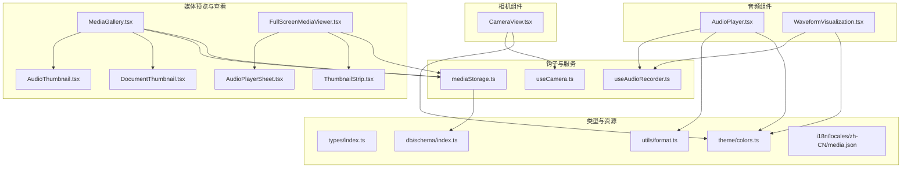
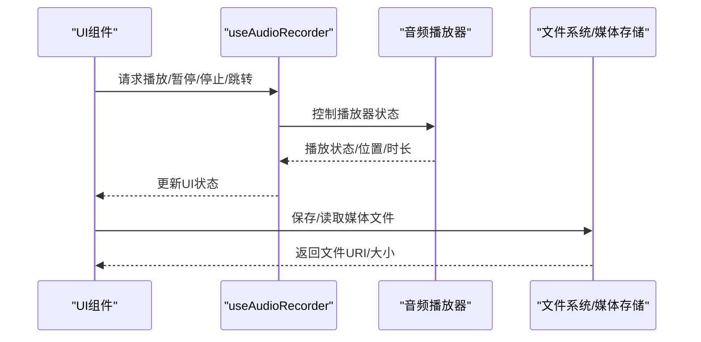
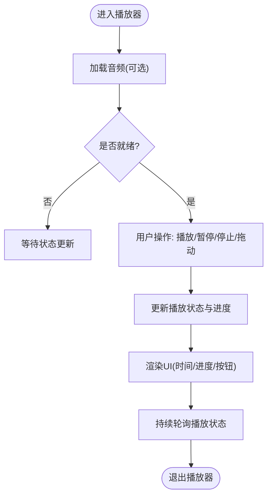
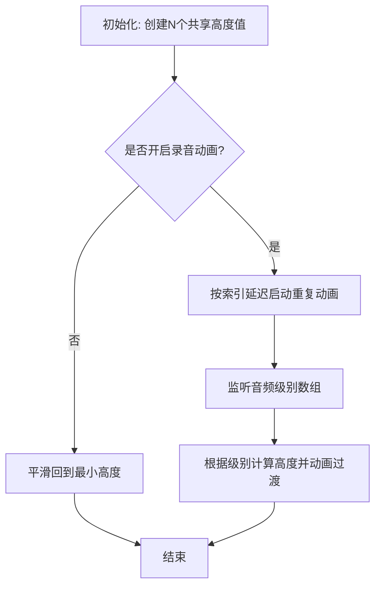
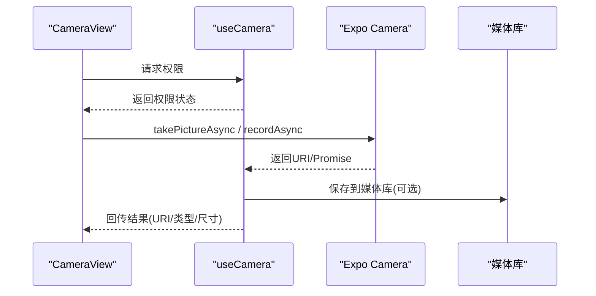
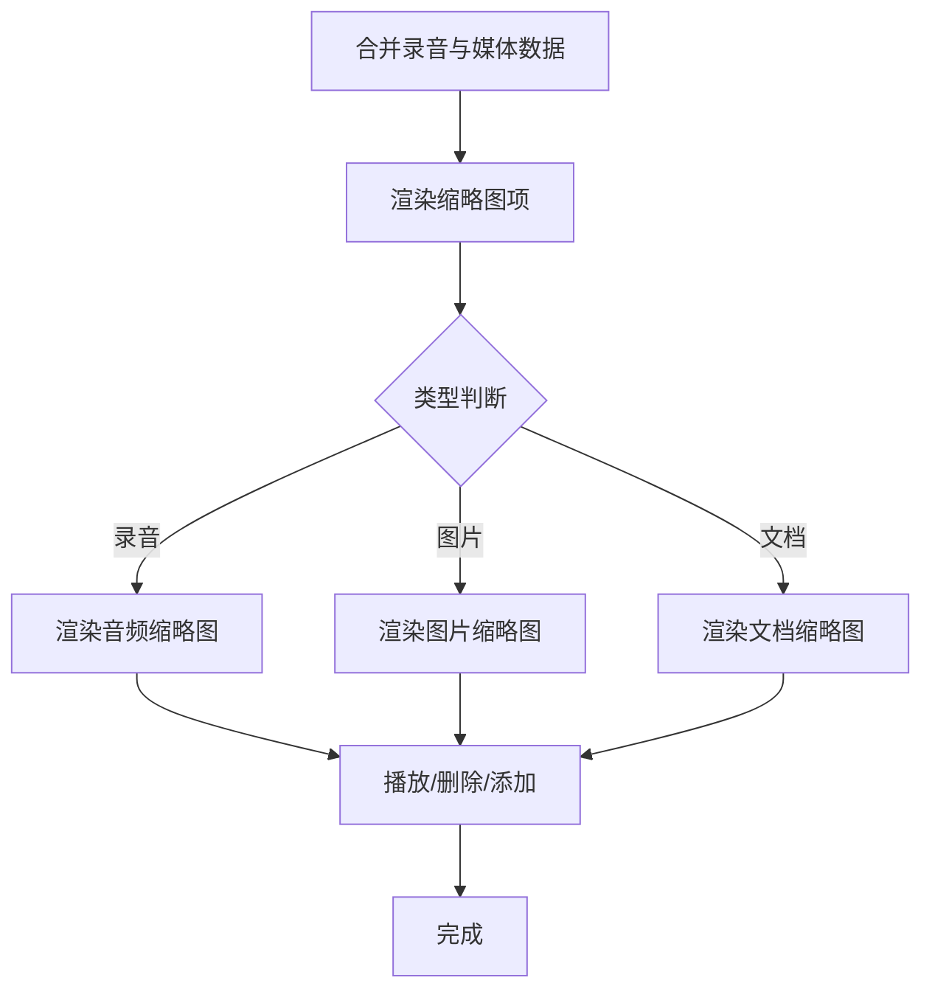
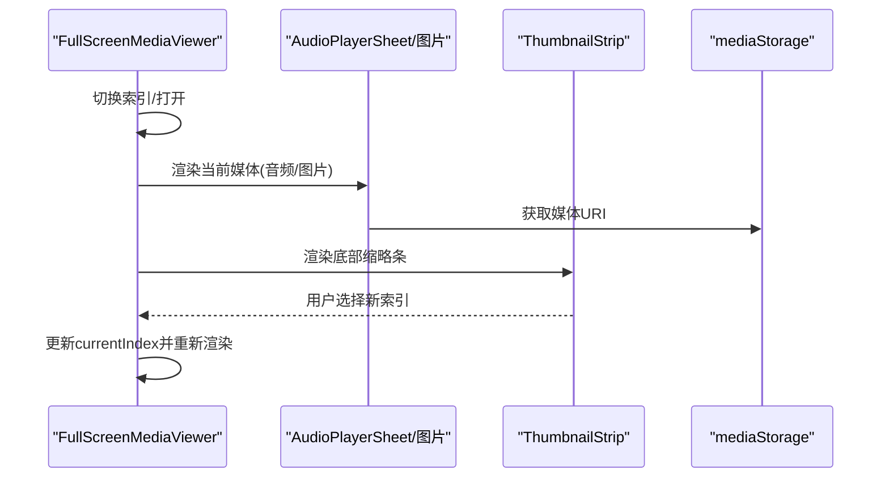
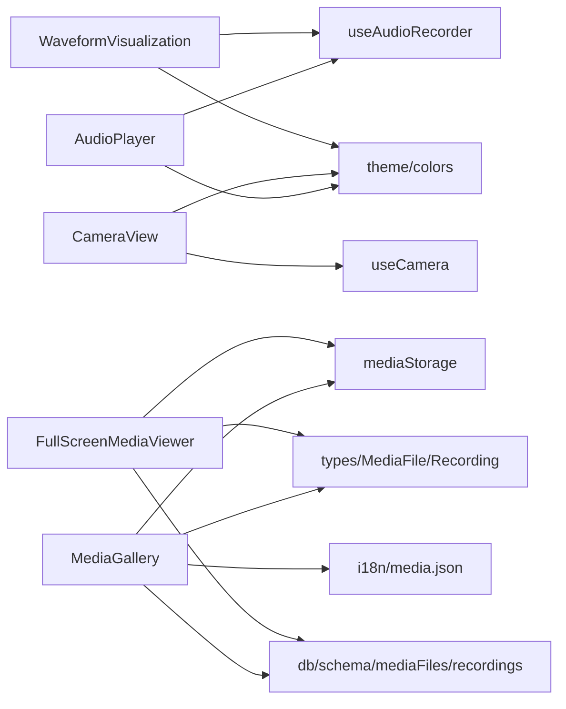

# 媒体组件

<cite>
**本文引用的文件**
- [AudioPlayer.tsx](file://components/audio/AudioPlayer.tsx)
- [WaveformVisualization.tsx](file://components/audio/WaveformVisualization.tsx)
- [CameraView.tsx](file://components/camera/CameraView.tsx)
- [MediaGallery.tsx](file://components/note/preview/MediaGallery.tsx)
- [FullScreenMediaViewer.tsx](file://components/note/FullScreenMediaViewer.tsx)
- [useAudioRecorder.ts](file://hooks/useAudioRecorder.ts)
- [useCamera.ts](file://hooks/useCamera.ts)
- [mediaStorage.ts](file://services/mediaStorage.ts)
- [AudioThumbnail.tsx](file://components/note/preview/AudioThumbnail.tsx)
- [DocumentThumbnail.tsx](file://components/note/preview/DocumentThumbnail.tsx)
- [AudioPlayerSheet.tsx](file://components/note/viewer/AudioPlayerSheet.tsx)
- [ThumbnailStrip.tsx](file://components/note/viewer/ThumbnailStrip.tsx)
- [types/index.ts](file://types/index.ts)
- [db/schema/index.ts](file://db/schema/index.ts)
- [i18n/locales/zh-CN/media.json](file://i18n/locales/zh-CN/media.json)
- [theme/colors.ts](file://theme/colors.ts)
- [utils/format.ts](file://utils/format.ts)
</cite>

## 目录
1. [简介](#简介)
2. [项目结构](#项目结构)
3. [核心组件](#核心组件)
4. [架构总览](#架构总览)
5. [详细组件分析](#详细组件分析)
6. [依赖关系分析](#依赖关系分析)
7. [性能考量](#性能考量)
8. [故障排查指南](#故障排查指南)
9. [结论](#结论)
10. [附录](#附录)

## 简介
本文件聚焦 VoiceNote 的媒体组件体系，围绕以下核心组件进行深入解析：音频播放器（AudioPlayer）、波形可视化（WaveformVisualization）、相机视图（CameraView）、媒体画廊（MediaGallery）、全屏媒体查看器（FullScreenMediaViewer）。文档将阐述音频播放、波形显示、相机集成与媒体预览的实现原理，说明组件间的协作关系，并给出性能优化、内存管理、异步加载机制、用户交互与手势支持、文件系统与网络服务集成、错误处理与兼容性建议，以及可定制与扩展指导。

## 项目结构
媒体组件主要分布在以下目录：
- 音频组件：components/audio
- 相机组件：components/camera
- 笔记媒体预览与查看：components/note/preview 与 components/note/viewer
- 钩子：hooks
- 服务：services
- 类型与数据库模式：types 与 db/schema
- 主题与国际化：theme 与 i18n

图表来源
- [AudioPlayer.tsx:1-132](file://components/audio/AudioPlayer.tsx#L1-L132)
- [WaveformVisualization.tsx:1-120](file://components/audio/WaveformVisualization.tsx#L1-L120)
- [CameraView.tsx:1-140](file://components/camera/CameraView.tsx#L1-L140)
- [MediaGallery.tsx:1-112](file://components/note/preview/MediaGallery.tsx#L1-L112)
- [FullScreenMediaViewer.tsx:1-97](file://components/note/FullScreenMediaViewer.tsx#L1-L97)
- [AudioThumbnail.tsx:1-53](file://components/note/preview/AudioThumbnail.tsx#L1-L53)
- [DocumentThumbnail.tsx:1-60](file://components/note/preview/DocumentThumbnail.tsx#L1-L60)
- [AudioPlayerSheet.tsx:1-84](file://components/note/viewer/AudioPlayerSheet.tsx#L1-L84)
- [ThumbnailStrip.tsx:1-50](file://components/note/viewer/ThumbnailStrip.tsx#L1-L50)
- [useAudioRecorder.ts:1-270](file://hooks/useAudioRecorder.ts#L1-L270)
- [useCamera.ts:1-115](file://hooks/useCamera.ts#L1-L115)
- [mediaStorage.ts:1-123](file://services/mediaStorage.ts#L1-L123)
- [types/index.ts:64-86](file://types/index.ts#L64-L86)
- [db/schema/index.ts:19-41](file://db/schema/index.ts#L19-L41)
- [theme/colors.ts:1-102](file://theme/colors.ts#L1-L102)
- [utils/format.ts:1-126](file://utils/format.ts#L1-L126)
- [i18n/locales/zh-CN/media.json:1-13](file://i18n/locales/zh-CN/media.json#L1-L13)

章节来源
- [AudioPlayer.tsx:1-132](file://components/audio/AudioPlayer.tsx#L1-L132)
- [CameraView.tsx:1-140](file://components/camera/CameraView.tsx#L1-L140)
- [MediaGallery.tsx:1-112](file://components/note/preview/MediaGallery.tsx#L1-L112)
- [FullScreenMediaViewer.tsx:1-97](file://components/note/FullScreenMediaViewer.tsx#L1-L97)

## 核心组件
- 音频播放器（AudioPlayer）：提供播放/暂停/停止、进度条拖动、时长显示等基础播放控制，基于 useAudioRecorder 提供的状态与动作。
- 波形可视化（WaveformVisualization）：在录音或播放时以动画柱状图展示音频能量变化，支持自定义条数、高度范围与颜色。
- 相机视图（CameraView）：封装相机权限、拍照/录像、前后摄像头切换、录制状态指示与UI控件。
- 媒体画廊（MediaGallery）：横向滚动展示录音缩略图与图片/文档缩略图，支持播放、删除与添加附件。
- 全屏媒体查看器（FullScreenMediaViewer）：模态全屏展示当前媒体，支持左右翻页与底部缩略条导航；音频模式下嵌入音频播放面板。

章节来源
- [AudioPlayer.tsx:9-132](file://components/audio/AudioPlayer.tsx#L9-L132)
- [WaveformVisualization.tsx:23-120](file://components/audio/WaveformVisualization.tsx#L23-L120)
- [CameraView.tsx:9-140](file://components/camera/CameraView.tsx#L9-L140)
- [MediaGallery.tsx:12-112](file://components/note/preview/MediaGallery.tsx#L12-L112)
- [FullScreenMediaViewer.tsx:12-97](file://components/note/FullScreenMediaViewer.tsx#L12-L97)

## 架构总览
媒体组件通过钩子与服务层解耦业务逻辑与UI，形成“UI 组件 → 钩子 → 服务/平台能力”的分层架构。音频播放与录音由 useAudioRecorder 抽象，相机功能由 useCamera 抽象，媒体存储与清理由 mediaStorage 提供。

图表来源
- [useAudioRecorder.ts:26-270](file://hooks/useAudioRecorder.ts#L26-L270)
- [mediaStorage.ts:22-58](file://services/mediaStorage.ts#L22-L58)

## 详细组件分析

### 音频播放器（AudioPlayer）
- 功能要点
  - 播放/暂停/停止控制
  - 进度条拖动与实时时间显示
  - 标题展示与主题色适配
- 数据流
  - 使用 useAudioRecorder 获取 isPlaying、playbackPosition、playbackDuration
  - 通过 playSound/pauseSound/stopSound/seekTo 调整播放器
- 性能与内存
  - 仅在需要时加载音频（当前注释掉自动加载逻辑，避免无用初始化）
  - 播放状态轮询频率可控（约每100ms），可根据场景调整
- 错误处理
  - 录音权限失败时抛出本地化错误
  - 播放器异常时记录日志并保持UI稳定
- 扩展建议
  - 支持循环播放、音量调节、均衡器
  - 增加播放完成回调 onPlaybackEnd 的调用链

图表来源
- [AudioPlayer.tsx:15-132](file://components/audio/AudioPlayer.tsx#L15-L132)
- [useAudioRecorder.ts:62-71](file://hooks/useAudioRecorder.ts#L62-L71)

章节来源
- [AudioPlayer.tsx:9-132](file://components/audio/AudioPlayer.tsx#L9-L132)
- [useAudioRecorder.ts:26-270](file://hooks/useAudioRecorder.ts#L26-L270)
- [utils/format.ts:4-14](file://utils/format.ts#L4-L14)

### 波形可视化（WaveformVisualization）
- 功能要点
  - 录音时随机动画柱状图，营造动态视觉效果
  - 可使用外部音频级别数组驱动柱高
  - 支持动画开关、条数、最小/最大高度、颜色自定义
- 实现细节
  - 使用 react-native-reanimated 创建共享值与动画序列
  - 通过 useMemo 预分配每个柱的高度共享值，降低重复创建开销
  - 当未在录音且提供音频级别时，平滑过渡到对应高度
- 性能与内存
  - 动画采用 withRepeat/withSequence/withTiming，生命周期内统一管理
  - 关闭动画时统一回退到最小高度，避免残留动画占用
- 扩展建议
  - 支持不同频段的多级柱组
  - 增加节拍同步或FFT分析驱动

图表来源
- [WaveformVisualization.tsx:32-120](file://components/audio/WaveformVisualization.tsx#L32-L120)

章节来源
- [WaveformVisualization.tsx:23-120](file://components/audio/WaveformVisualization.tsx#L23-L120)

### 相机视图（CameraView）
- 功能要点
  - 权限检查与请求：相机与相册写入权限
  - 拍照与录像：拍照返回URI与尺寸信息；录像通过 Promise 管理开始/停止
  - 前后摄像头切换与录制状态指示
  - UI 控件：翻转相机、录制按钮（带录制中红点）、占位元素
- 实现细节
  - 使用 Expo Camera 的 takePictureAsync 与 recordAsync
  - 录像结果通过 ref 存储 Promise 并在停止时 await 解析
  - 成功拍摄/录制后可选择保存至媒体库
- 性能与内存
  - 录像最大时长限制（防长时间占用）
  - 释放录制 Promise 引用，避免内存泄漏
- 错误处理
  - 权限拒绝时提示用户
  - 拍照/录制异常时捕获并记录日志
- 扩展建议
  - 支持 HDR、闪光灯、焦距控制
  - 添加录制倒计时与震动反馈

图表来源
- [CameraView.tsx:14-140](file://components/camera/CameraView.tsx#L14-L140)
- [useCamera.ts:13-115](file://hooks/useCamera.ts#L13-L115)

章节来源
- [CameraView.tsx:9-140](file://components/camera/CameraView.tsx#L9-L140)
- [useCamera.ts:13-115](file://hooks/useCamera.ts#L13-L115)

### 媒体画廊（MediaGallery）
- 功能要点
  - 横向滚动展示录音缩略图与媒体缩略图
  - 支持播放录音、点击媒体、删除媒体、添加附件
  - 渐变遮罩与“添加”占位按钮
- 实现细节
  - 将录音与媒体合并为统一列表，分别渲染不同组件
  - 图片缩略图直接从本地存储URI加载
  - 文档缩略图根据扩展名映射图标与颜色
- 性能与内存
  - 使用 FlatList 横向滚动，减少重绘
  - 缩略图尺寸固定，避免过度绘制
- 错误处理
  - 删除媒体时确保文件存在再删除
- 扩展建议
  - 支持批量选择与删除
  - 增加加载更多与分页

图表来源
- [MediaGallery.tsx:23-90](file://components/note/preview/MediaGallery.tsx#L23-L90)
- [AudioThumbnail.tsx:12-33](file://components/note/preview/AudioThumbnail.tsx#L12-L33)
- [DocumentThumbnail.tsx:31-44](file://components/note/preview/DocumentThumbnail.tsx#L31-L44)

章节来源
- [MediaGallery.tsx:12-112](file://components/note/preview/MediaGallery.tsx#L12-L112)
- [AudioThumbnail.tsx:6-33](file://components/note/preview/AudioThumbnail.tsx#L6-L33)
- [DocumentThumbnail.tsx:26-44](file://components/note/preview/DocumentThumbnail.tsx#L26-L44)

### 全屏媒体查看器（FullScreenMediaViewer）
- 功能要点
  - 模态全屏展示当前媒体：音频模式嵌入播放面板，图片模式全屏显示
  - 左右导航按钮与底部缩略条
  - 音频支持快退/快进（固定步进）
- 实现细节
  - 根据 MIME 类型判断媒体类型
  - 音频模式下复用音频播放面板组件
  - 底部缩略条用于快速定位
- 性能与内存
  - 仅在可见时渲染当前媒体，避免同时加载多张大图
  - 导航切换时更新索引，不重建整个视图
- 错误处理
  - 无媒体或不可见时不渲染
- 扩展建议
  - 支持手势滑动切换
  - 增加下载与分享入口

图表来源
- [FullScreenMediaViewer.tsx:26-83](file://components/note/FullScreenMediaViewer.tsx#L26-L83)
- [AudioPlayerSheet.tsx:24-60](file://components/note/viewer/AudioPlayerSheet.tsx#L24-L60)
- [ThumbnailStrip.tsx:13-39](file://components/note/viewer/ThumbnailStrip.tsx#L13-L39)
- [mediaStorage.ts:43-46](file://services/mediaStorage.ts#L43-L46)

章节来源
- [FullScreenMediaViewer.tsx:12-97](file://components/note/FullScreenMediaViewer.tsx#L12-L97)
- [AudioPlayerSheet.tsx:6-84](file://components/note/viewer/AudioPlayerSheet.tsx#L6-L84)
- [ThumbnailStrip.tsx:7-49](file://components/note/viewer/ThumbnailStrip.tsx#L7-L49)

## 依赖关系分析
- 组件与钩子
  - AudioPlayer 与 WaveformVisualization 依赖 useAudioRecorder
  - CameraView 依赖 useCamera
- 组件与服务
  - MediaGallery 与 FullScreenMediaViewer 依赖 mediaStorage 获取媒体URI
- 组件与类型/数据库
  - MediaFile/Recording 类型与数据库表结构定义了媒体元数据字段
- 组件与主题/国际化
  - colors 提供主色与语义色；i18n 提供媒体相关文案

图表来源
- [AudioPlayer.tsx:1-132](file://components/audio/AudioPlayer.tsx#L1-L132)
- [WaveformVisualization.tsx:1-120](file://components/audio/WaveformVisualization.tsx#L1-L120)
- [CameraView.tsx:1-140](file://components/camera/CameraView.tsx#L1-L140)
- [MediaGallery.tsx:1-112](file://components/note/preview/MediaGallery.tsx#L1-L112)
- [FullScreenMediaViewer.tsx:1-97](file://components/note/FullScreenMediaViewer.tsx#L1-L97)
- [useAudioRecorder.ts:1-270](file://hooks/useAudioRecorder.ts#L1-L270)
- [useCamera.ts:1-115](file://hooks/useCamera.ts#L1-L115)
- [mediaStorage.ts:1-123](file://services/mediaStorage.ts#L1-L123)
- [types/index.ts:74-86](file://types/index.ts#L74-L86)
- [db/schema/index.ts:29-41](file://db/schema/index.ts#L29-L41)
- [theme/colors.ts:1-102](file://theme/colors.ts#L1-L102)
- [i18n/locales/zh-CN/media.json:1-13](file://i18n/locales/zh-CN/media.json#L1-L13)

章节来源
- [types/index.ts:64-86](file://types/index.ts#L64-L86)
- [db/schema/index.ts:19-41](file://db/schema/index.ts#L19-L41)

## 性能考量
- 音频播放
  - 播放状态轮询周期约100ms，可在后台或低频场景下调大间隔
  - 按需加载音频，避免不必要的初始化
- 波形可视化
  - 动画采用共享值与一次性分配，减少频繁创建
  - 关闭动画时统一回退，避免残留动画
- 相机
  - 录像最大时长限制，防止长时间占用资源
  - 录制Promise及时清理，避免悬挂
- 媒体画廊
  - FlatList 横向滚动，固定缩略图尺寸，减少重绘
- 全屏查看
  - 仅渲染当前媒体，导航切换时更新索引
- 文件系统
  - 本地媒体目录统一管理，清理未引用文件，定期执行清理任务

[本节为通用性能建议，无需特定文件引用]

## 故障排查指南
- 录音权限被拒
  - 现象：无法开始录音
  - 处理：检查权限请求流程与用户授权状态
  - 参考
    - [useAudioRecorder.ts:74-77](file://hooks/useAudioRecorder.ts#L74-L77)
- 播放器状态异常
  - 现象：播放状态不更新或进度条不动
  - 处理：确认播放器实例存在与URI正确
  - 参考
    - [useAudioRecorder.ts:62-71](file://hooks/useAudioRecorder.ts#L62-L71)
- 相机无画面或权限问题
  - 现象：相机视图空白或提示权限不足
  - 处理：检查相机与媒体库权限请求与授予状态
  - 参考
    - [useCamera.ts:92-96](file://hooks/useCamera.ts#L92-L96)
    - [CameraView.tsx:47-78](file://components/camera/CameraView.tsx#L47-L78)
- 媒体文件缺失或无法显示
  - 现象：缩略图不显示或报错
  - 处理：确认文件存在与URI正确，必要时执行清理
  - 参考
    - [mediaStorage.ts:52-58](file://services/mediaStorage.ts#L52-L58)
    - [mediaStorage.ts:80-114](file://services/mediaStorage.ts#L80-L114)
- 全屏播放音频无响应
  - 现象：点击播放无效
  - 处理：检查音频URI与播放器状态，确认事件回调绑定
  - 参考
    - [AudioPlayerSheet.tsx:24-60](file://components/note/viewer/AudioPlayerSheet.tsx#L24-L60)

章节来源
- [useAudioRecorder.ts:74-77](file://hooks/useAudioRecorder.ts#L74-L77)
- [useAudioRecorder.ts:62-71](file://hooks/useAudioRecorder.ts#L62-L71)
- [useCamera.ts:92-96](file://hooks/useCamera.ts#L92-L96)
- [CameraView.tsx:47-78](file://components/camera/CameraView.tsx#L47-L78)
- [mediaStorage.ts:52-58](file://services/mediaStorage.ts#L52-L58)
- [mediaStorage.ts:80-114](file://services/mediaStorage.ts#L80-L114)
- [AudioPlayerSheet.tsx:24-60](file://components/note/viewer/AudioPlayerSheet.tsx#L24-L60)

## 结论
媒体组件通过清晰的分层设计与钩子抽象，实现了音频播放、波形可视化、相机拍摄/录制、媒体画廊与全屏查看的完整闭环。结合本地文件系统与数据库模式，组件具备良好的可维护性与扩展性。建议在生产环境中关注权限管理、资源释放与清理策略，并根据设备性能调整轮询与动画参数。

[本节为总结性内容，无需特定文件引用]

## 附录
- 用户交互与手势
  - 播放器：点击播放/暂停、拖动进度条、前后快切
  - 相机：点击录制按钮、双击切换摄像头、长按录制
  - 画廊：点击缩略图进入全屏、滑动切换、长按删除
  - 全屏：左右滑动切换、点击播放/暂停、点击缩略条定位
- 与文件系统/网络服务集成
  - 本地存储：统一媒体目录，复制/删除/清理
  - 数据库：录音与媒体文件元数据持久化
  - 国际化：媒体相关文案本地化
- 定制与扩展
  - 音频：增加均衡器、循环播放、播放列表
  - 相机：HDR、闪光灯、焦距、倒计时
  - 媒体：批量操作、排序、搜索、标签
  - 视图：手势滑动、全屏手势、手势快退/快进

[本节为概念性内容，无需特定文件引用]