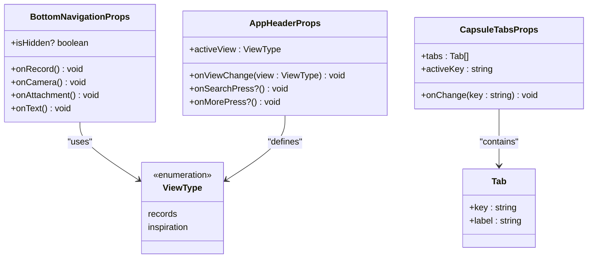
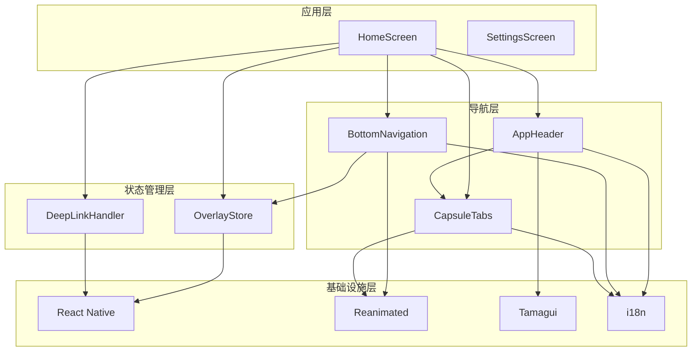
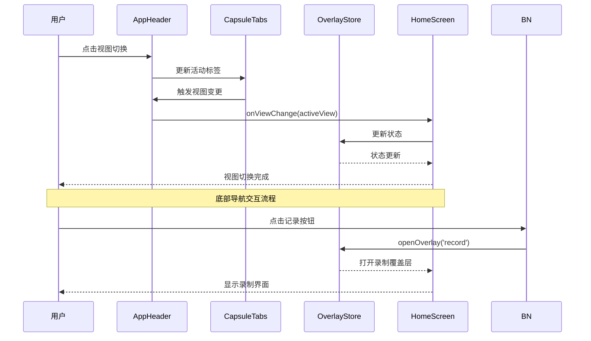
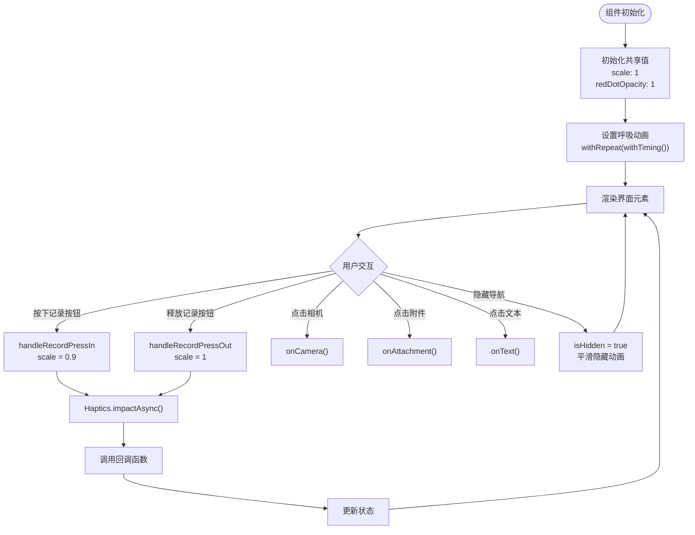
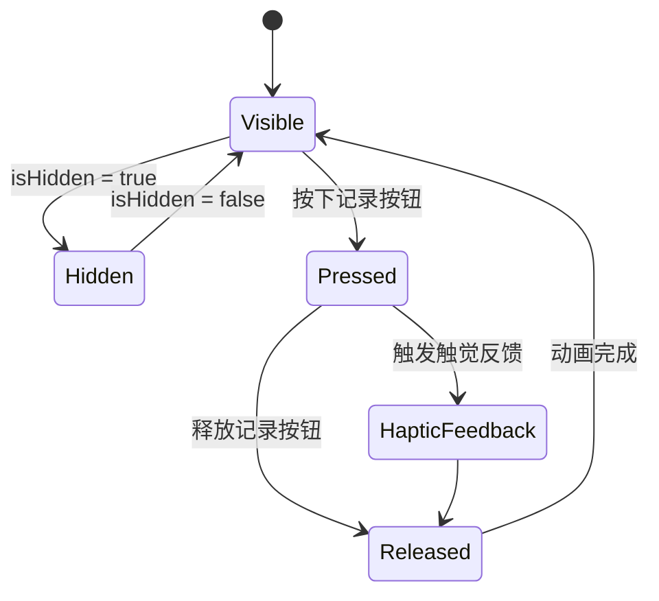
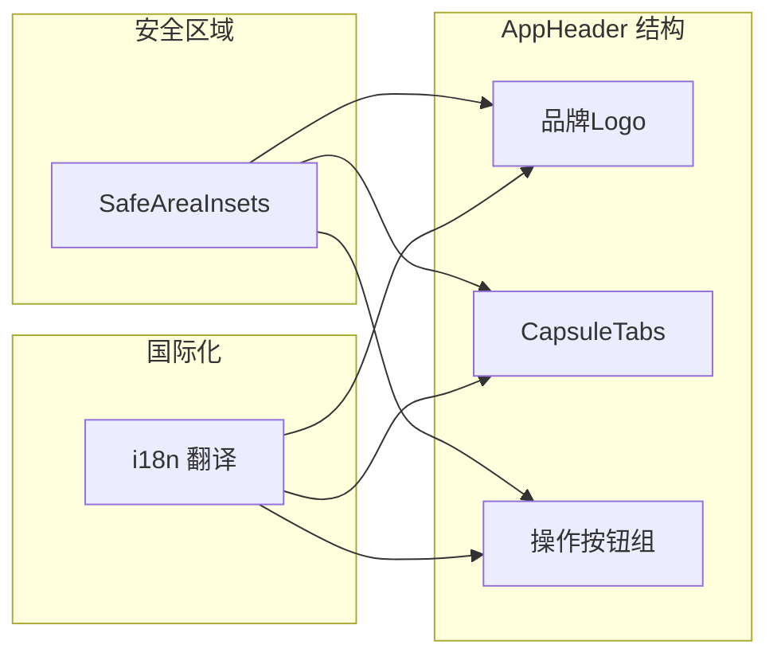
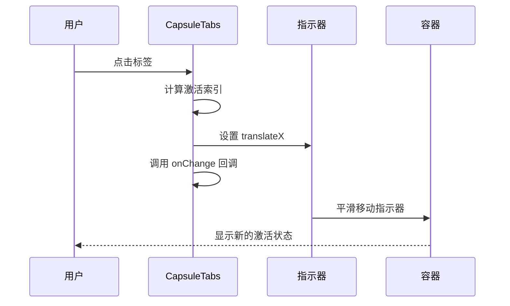
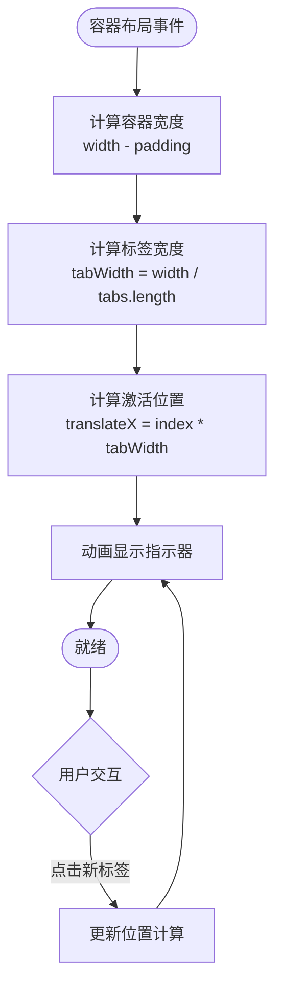
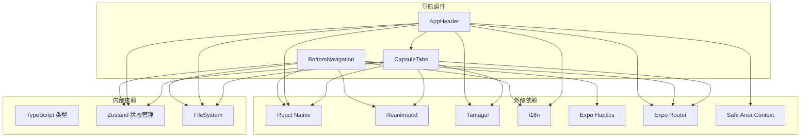
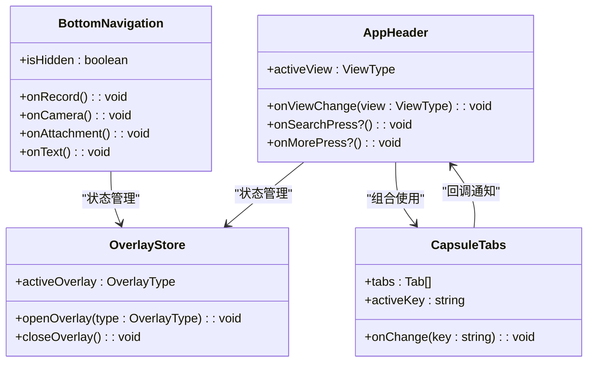

# 导航组件

<cite>
**本文档引用的文件**
- [components/navigation/index.ts](file://components/navigation/index.ts)
- [components/navigation/BottomNavigation.tsx](file://components/navigation/BottomNavigation.tsx)
- [components/navigation/AppHeader.tsx](file://components/navigation/AppHeader.tsx)
- [components/navigation/CapsuleTabs.tsx](file://components/navigation/CapsuleTabs.tsx)
- [types/navigation.ts](file://types/navigation.ts)
- [app/_layout.tsx](file://app/_layout.tsx)
- [app/(tabs)/_layout.tsx](file://app/(tabs)/_layout.tsx)
- [app/(tabs)/index.tsx](file://app/(tabs)/index.tsx)
- [hooks/useDeepLinkHandler.ts](file://hooks/useDeepLinkHandler.ts)
- [store/useOverlayStore.ts](file://store/useOverlayStore.ts)
- [theme/tamagui.config.ts](file://theme/tamagui.config.ts)
- [theme/colors.ts](file://theme/colors.ts)
- [i18n/locales/zh-CN/nav.json](file://i18n/locales/zh-CN/nav.json)
</cite>

## 目录
1. [简介](#简介)
2. [项目结构](#项目结构)
3. [核心组件](#核心组件)
4. [架构概览](#架构概览)
5. [详细组件分析](#详细组件分析)
6. [依赖关系分析](#依赖关系分析)
7. [性能考虑](#性能考虑)
8. [故障排除指南](#故障排除指南)
9. [结论](#结论)

## 简介

VoiceNote 的导航组件系统是应用的核心交互层，提供了流畅的用户体验和直观的内容组织方式。该系统包含三个主要组件：底部导航栏（BottomNavigation）、应用头部（AppHeader）和胶囊标签页（CapsuleTabs）。这些组件协同工作，为用户提供从内容浏览到内容创作的完整导航体验。

导航组件系统采用现代化的 React Native 技术栈构建，集成了动画库、国际化支持、深链处理和状态管理等高级功能。组件设计注重可访问性、响应式布局和跨平台兼容性。

## 项目结构

导航组件位于 `components/navigation/` 目录下，采用模块化设计，每个组件都是独立的功能单元，可以单独使用或组合使用。

```mermaid
graph TB
subgraph "导航组件目录结构"
NAV[components/navigation/]
BN[BottomNavigation.tsx]
AH[AppHeader.tsx]
CT[CapsuleTabs.tsx]
NI[index.ts]
NAV --> BN
NAV --> AH
NAV --> CT
NAV --> NI
end
subgraph "类型定义"
NT[types/navigation.ts]
end
subgraph "应用集成"
AL[app/_layout.tsx]
TL[app/(tabs)/_layout.tsx]
HS[app/(tabs)/index.tsx]
end
subgraph "状态管理"
OS[store/useOverlayStore.ts]
DL[hooks/useDeepLinkHandler.ts]
end
subgraph "主题系统"
TC[theme/tamagui.config.ts]
CC[theme/colors.ts]
end
BN --> NT
AH --> CT
AH --> NT
CT --> NT
HS --> BN
HS --> AH
HS --> CT
HS --> OS
HS --> DL
AL --> TL
TC --> CC
```

**图表来源**
- [components/navigation/index.ts:1-4](file://components/navigation/index.ts#L1-L4)
- [types/navigation.ts:1-22](file://types/navigation.ts#L1-L22)
- [app/_layout.tsx:1-101](file://app/_layout.tsx#L1-L101)
- [app/(tabs)/index.tsx](file://app/(tabs)/index.tsx#L1-L497)

**章节来源**
- [components/navigation/index.ts:1-4](file://components/navigation/index.ts#L1-L4)
- [app/_layout.tsx:1-101](file://app/_layout.tsx#L1-L101)

## 核心组件

导航组件系统由三个核心组件构成，每个组件都有明确的职责和独特的设计理念：

### 组件特性概览

| 组件 | 主要功能 | 设计特点 | 交互模式 |
|------|----------|----------|----------|
| BottomNavigation | 底部操作导航 | 大尺寸触摸目标、动画反馈、深链支持 | 按压、长按、滑动 |
| AppHeader | 应用顶部导航 | 胶囊标签切换、搜索、更多选项 | 点击、滑动、手势 |
| CapsuleTabs | 胶囊形状标签页 | 平滑过渡动画、可访问性支持 | 点击、键盘导航 |

### 类型系统

导航组件使用 TypeScript 提供完整的类型安全保证：



**图表来源**
- [components/navigation/BottomNavigation.tsx:17-23](file://components/navigation/BottomNavigation.tsx#L17-L23)
- [components/navigation/AppHeader.tsx:11-16](file://components/navigation/AppHeader.tsx#L11-L16)
- [components/navigation/CapsuleTabs.tsx:11-15](file://components/navigation/CapsuleTabs.tsx#L11-L15)

**章节来源**
- [components/navigation/BottomNavigation.tsx:17-23](file://components/navigation/BottomNavigation.tsx#L17-L23)
- [components/navigation/AppHeader.tsx:9-16](file://components/navigation/AppHeader.tsx#L9-L16)
- [components/navigation/CapsuleTabs.tsx:11-15](file://components/navigation/CapsuleTabs.tsx#L11-L15)

## 架构概览

导航组件系统采用分层架构设计，确保组件间的松耦合和高内聚。



**图表来源**
- [app/(tabs)/index.tsx](file://app/(tabs)/index.tsx#L25-L31)
- [store/useOverlayStore.ts:1-16](file://store/useOverlayStore.ts#L1-L16)
- [hooks/useDeepLinkHandler.ts:1-42](file://hooks/useDeepLinkHandler.ts#L1-L42)

### 数据流架构



**图表来源**
- [components/navigation/AppHeader.tsx:18-58](file://components/navigation/AppHeader.tsx#L18-L58)
- [components/navigation/BottomNavigation.tsx:25-110](file://components/navigation/BottomNavigation.tsx#L25-L110)
- [store/useOverlayStore.ts:11-15](file://store/useOverlayStore.ts#L11-L15)

**章节来源**
- [app/(tabs)/index.tsx](file://app/(tabs)/index.tsx#L34-L122)
- [store/useOverlayStore.ts:1-16](file://store/useOverlayStore.ts#L1-L16)

## 详细组件分析

### BottomNavigation 组件

BottomNavigation 是应用的主要操作入口，提供大尺寸的触摸目标和丰富的动画反馈。

#### 设计理念

组件采用"突出主要操作"的设计原则，通过以下方式提升用户体验：
- 大尺寸触摸目标（最小 44px）
- 清晰的视觉层次和对比度
- 即时的触觉反馈
- 流畅的动画过渡

#### 实现细节



**图表来源**
- [components/navigation/BottomNavigation.tsx:32-73](file://components/navigation/BottomNavigation.tsx#L32-L73)

#### 动画系统

组件使用 Reanimated 库实现高性能动画：

| 动画类型 | 触发条件 | 持续时间 | 缓动函数 |
|----------|----------|----------|----------|
| 缩放动画 | 按下/释放 | 无固定持续时间 | withSpring |
| 呼吸动画 | 组件挂载 | 无限循环 | withTiming |
| 隐藏动画 | isHidden = true | 200ms | withTiming |
| 显示动画 | isHidden = false | 300ms | withTiming |

#### 状态管理



**图表来源**
- [components/navigation/BottomNavigation.tsx:44-52](file://components/navigation/BottomNavigation.tsx#L44-L52)

**章节来源**
- [components/navigation/BottomNavigation.tsx:1-173](file://components/navigation/BottomNavigation.tsx#L1-L173)

### AppHeader 组件

AppHeader 提供应用顶部的导航控制，包含品牌标识、视图切换和操作按钮。

#### 组件结构



**图表来源**
- [components/navigation/AppHeader.tsx:24-57](file://components/navigation/AppHeader.tsx#L24-L57)

#### 视图切换机制

AppHeader 使用 CapsuleTabs 实现视图切换，支持两种视图模式：

| 视图类型 | 键值 | 标签 | 用途 |
|----------|------|------|------|
| 记录视图 | records | 闪念 | 显示语音记录和笔记 |
| 灵感视图 | inspiration | 灵感 | 显示灵感卡片和内容 |

#### 安全区域适配

组件自动适配不同的设备安全区域，确保内容不被刘海屏或底部安全区域遮挡。

**章节来源**
- [components/navigation/AppHeader.tsx:1-84](file://components/navigation/AppHeader.tsx#L1-L84)

### CapsuleTabs 组件

CapsuleTabs 是一个高度可定制的标签页组件，提供流畅的视觉过渡效果。

#### 核心功能



**图表来源**
- [components/navigation/CapsuleTabs.tsx:43-49](file://components/navigation/CapsuleTabs.tsx#L43-L49)

#### 动态布局计算

组件能够动态计算标签宽度和位置：



**图表来源**
- [components/navigation/CapsuleTabs.tsx:28-49](file://components/navigation/CapsuleTabs.tsx#L28-L49)

#### 可访问性支持

组件内置完整的可访问性支持：

| 属性 | 值 | 说明 |
|------|-----|------|
| accessibilityRole | tab | 标识为标签角色 |
| accessibilityState.selected | true/false | 当前选中状态 |
| role | tab | HTML 角色属性 |
| aria-selected | true/false | ARIA 选中状态 |

**章节来源**
- [components/navigation/CapsuleTabs.tsx:1-111](file://components/navigation/CapsuleTabs.tsx#L1-L111)

## 依赖关系分析

导航组件系统具有清晰的依赖层次结构，确保模块间的松耦合。



**图表来源**
- [components/navigation/BottomNavigation.tsx:1-15](file://components/navigation/BottomNavigation.tsx#L1-L15)
- [components/navigation/AppHeader.tsx:1-7](file://components/navigation/AppHeader.tsx#L1-L7)
- [components/navigation/CapsuleTabs.tsx:1-9](file://components/navigation/CapsuleTabs.tsx#L1-L9)

### 组件间通信



**图表来源**
- [components/navigation/BottomNavigation.tsx:25-31](file://components/navigation/BottomNavigation.tsx#L25-L31)
- [components/navigation/AppHeader.tsx:18-23](file://components/navigation/AppHeader.tsx#L18-L23)
- [components/navigation/CapsuleTabs.tsx:19-23](file://components/navigation/CapsuleTabs.tsx#L19-L23)

**章节来源**
- [store/useOverlayStore.ts:1-16](file://store/useOverlayStore.ts#L1-L16)
- [hooks/useDeepLinkHandler.ts:1-42](file://hooks/useDeepLinkHandler.ts#L1-L42)

## 性能考虑

导航组件系统在性能优化方面采用了多项策略：

### 动画性能优化

1. **原生驱动动画**: 使用 Reanimated 的原生动画引擎，避免 JavaScript 线程阻塞
2. **内存优化**: 使用 `useSharedValue` 和 `useAnimatedStyle` 减少重渲染
3. **延迟加载**: 按需计算布局信息，避免不必要的计算

### 状态管理优化

1. **局部状态**: 每个组件维护自己的本地状态，减少全局状态更新
2. **状态分离**: 将 UI 状态与业务逻辑状态分离
3. **批量更新**: 合理的事件处理避免频繁的状态更新

### 渲染优化

1. **React.memo**: 组件使用 memo 包装减少不必要的重渲染
2. **虚拟化列表**: 在相关组件中使用虚拟化技术处理大量数据
3. **懒加载**: 图标和资源按需加载

## 故障排除指南

### 常见问题及解决方案

#### 1. 动画不流畅

**症状**: 动画卡顿或跳帧
**原因**: JavaScript 线程阻塞或过度重渲染
**解决方案**:
- 确保使用 Reanimated 的原生动画
- 避免在动画回调中进行重型计算
- 使用 `useCallback` 缓存回调函数

#### 2. 触摸事件冲突

**症状**: 按钮无法正常响应或响应延迟
**原因**: 事件冒泡或手势冲突
**解决方案**:
- 检查父组件的触摸处理逻辑
- 确保按钮的触摸区域足够大
- 避免嵌套的触摸手势处理器

#### 3. 国际化文本显示异常

**症状**: 翻译文本显示为键名而非实际内容
**原因**: i18n 配置错误或资源文件缺失
**解决方案**:
- 检查翻译文件路径和命名
- 确认 i18n 初始化顺序
- 验证翻译键的存在性

#### 4. 深链处理失败

**症状**: 深链无法正确打开对应功能
**原因**: URL 解析错误或状态同步问题
**解决方案**:
- 检查深链配置和验证规则
- 确保状态存储的正确初始化
- 验证路由参数的传递

**章节来源**
- [hooks/useDeepLinkHandler.ts:12-21](file://hooks/useDeepLinkHandler.ts#L12-L21)
- [store/useOverlayStore.ts:11-15](file://store/useOverlayStore.ts#L11-L15)

## 结论

VoiceNote 的导航组件系统展现了现代移动应用导航设计的最佳实践。通过精心设计的组件架构、完善的动画系统和强大的状态管理，为用户提供了流畅、直观且富有表现力的导航体验。

### 主要优势

1. **用户体验优秀**: 大尺寸触摸目标、即时反馈和流畅动画
2. **技术实现先进**: 原生动画引擎、类型安全和可访问性支持
3. **扩展性强**: 模块化设计允许灵活的定制和扩展
4. **性能优异**: 优化的渲染和状态管理策略

### 发展建议

1. **进一步优化**: 可以考虑添加手势识别和更丰富的动画效果
2. **测试完善**: 增加更多的自动化测试覆盖
3. **文档增强**: 为开发者提供更详细的 API 文档和示例

导航组件系统为 VoiceNote 应用奠定了坚实的交互基础，为后续的功能扩展和用户体验优化提供了良好的技术支撑。