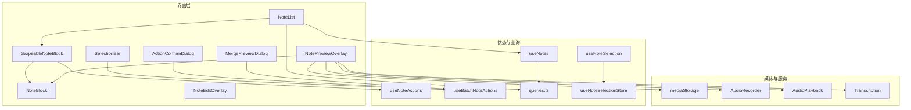
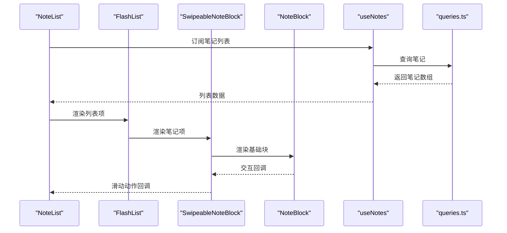
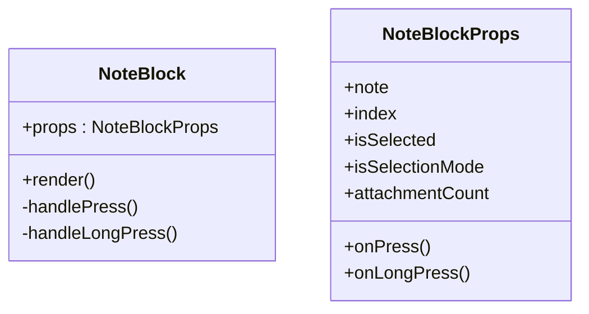
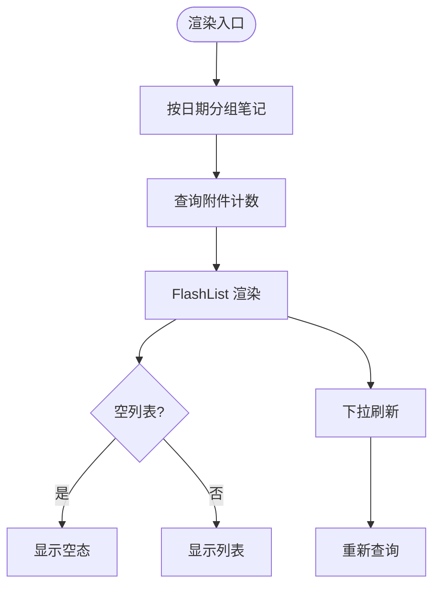
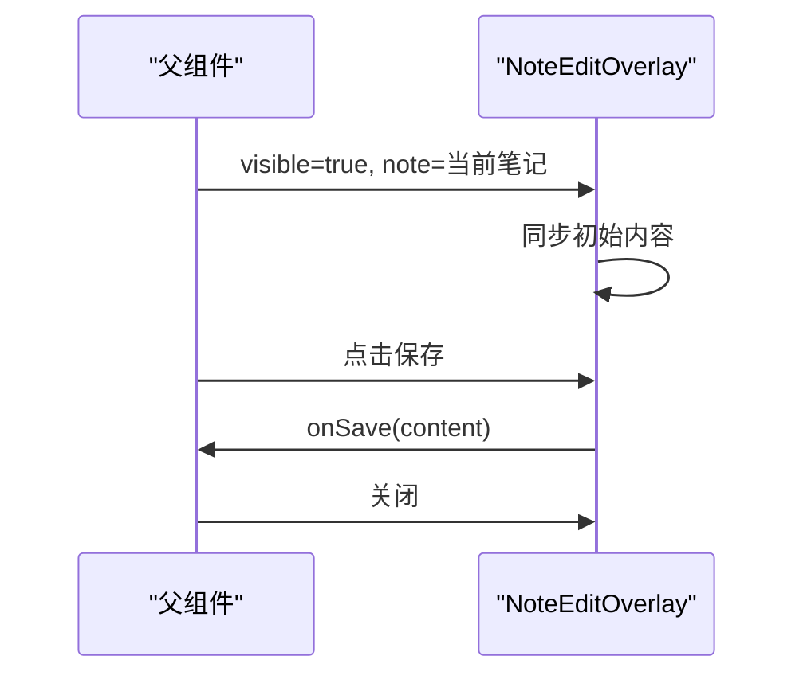
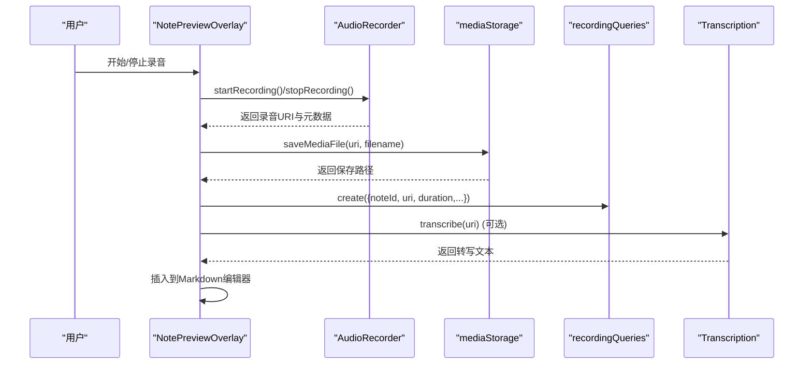
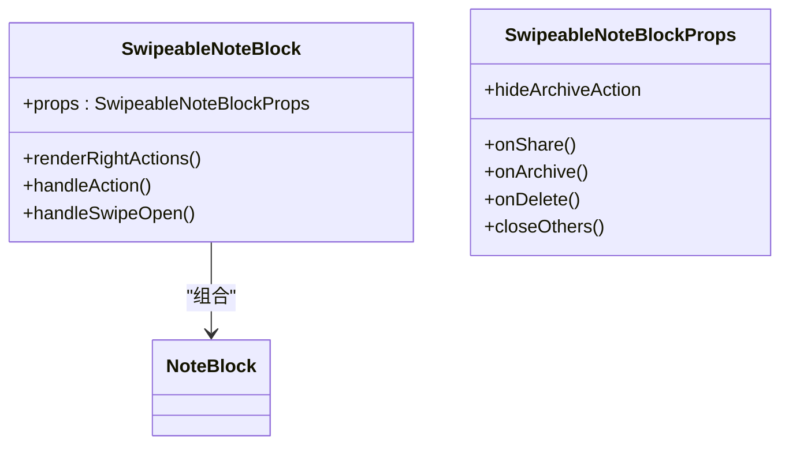
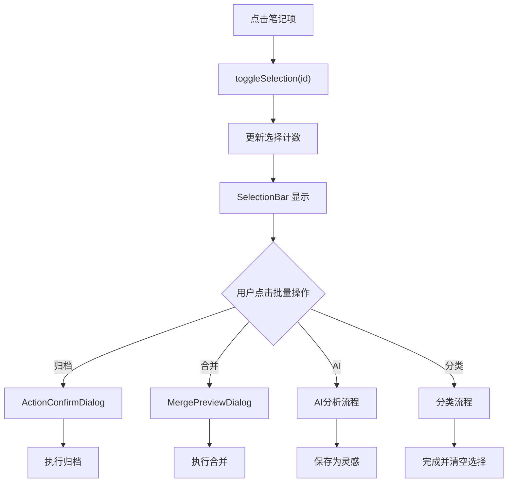
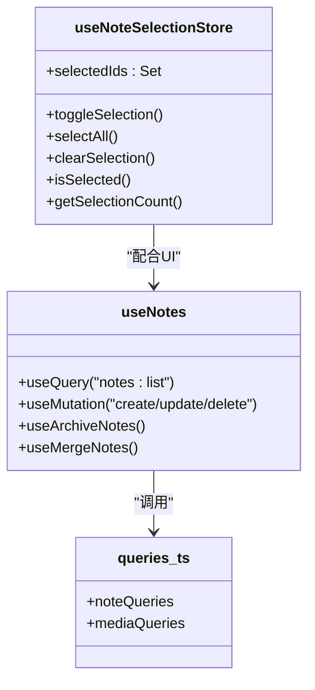
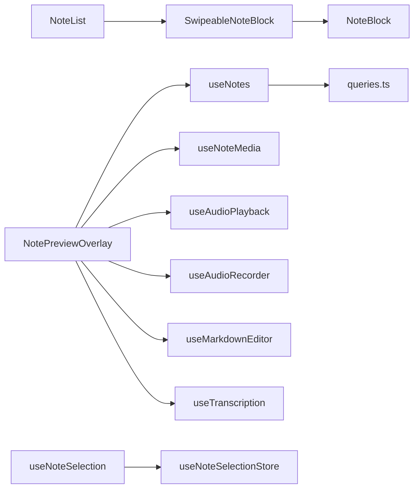

# 笔记组件

<cite>
**本文引用的文件**
- [NoteBlock.tsx](file://components/note/NoteBlock.tsx)
- [NoteList.tsx](file://components/note/NoteList.tsx)
- [NoteEditOverlay.tsx](file://components/note/NoteEditOverlay.tsx)
- [NotePreviewOverlay.tsx](file://components/note/NotePreviewOverlay.tsx)
- [SwipeableNoteBlock.tsx](file://components/note/SwipeableNoteBlock.tsx)
- [useNotes.ts](file://hooks/useNotes.ts)
- [useNoteActions.ts](file://hooks/useNoteActions.ts)
- [useNoteSelection.ts](file://hooks/useNoteSelection.ts)
- [useBatchNoteActions.ts](file://hooks/useBatchNoteActions.ts)
- [queries.ts](file://db/queries.ts)
- [useNoteSelectionStore.ts](file://store/useNoteSelectionStore.ts)
- [SelectionBar.tsx](file://components/note/SelectionBar.tsx)
- [ActionConfirmDialog.tsx](file://components/note/ActionConfirmDialog.tsx)
- [MergePreviewDialog.tsx](file://components/note/MergePreviewDialog.tsx)
</cite>

## 目录
1. [简介](#简介)
2. [项目结构](#项目结构)
3. [核心组件](#核心组件)
4. [架构总览](#架构总览)
5. [详细组件分析](#详细组件分析)
6. [依赖关系分析](#依赖关系分析)
7. [性能考量](#性能考量)
8. [故障排查指南](#故障排查指南)
9. [结论](#结论)
10. [附录](#附录)

## 简介
本文件系统性地文档化 VoiceNote 中的笔记组件，覆盖 NoteBlock、NoteList、NoteEditOverlay、NotePreviewOverlay 等核心 UI 组件及其配套的钩子与状态管理工具。内容包括：
- 数据绑定与状态管理（React Query、Zustand）
- 用户交互模式（选择、滑动操作、确认对话框、批量操作）
- 渲染优化（虚拟滚动、分组日期、附件计数缓存）
- 编辑、预览与管理功能的使用示例
- 与数据库（Drizzle ORM）及媒体存储服务的集成
- 可访问性与键盘快捷键支持
- 扩展与自定义建议

## 项目结构
笔记相关组件主要位于 components/note 与 hooks 目录，配合 db 查询层与状态存储实现完整的 CRUD、批量操作与媒体管理能力。

图表来源
- [NoteList.tsx:109-205](file://components/note/NoteList.tsx#L109-L205)
- [SwipeableNoteBlock.tsx:15-93](file://components/note/SwipeableNoteBlock.tsx#L15-L93)
- [NoteBlock.tsx:31-117](file://components/note/NoteBlock.tsx#L31-L117)
- [NotePreviewOverlay.tsx:50-337](file://components/note/NotePreviewOverlay.tsx#L50-L337)
- [NoteEditOverlay.tsx:15-57](file://components/note/NoteEditOverlay.tsx#L15-L57)
- [SelectionBar.tsx:25-137](file://components/note/SelectionBar.tsx#L25-L137)
- [ActionConfirmDialog.tsx:14-63](file://components/note/ActionConfirmDialog.tsx#L14-L63)
- [MergePreviewDialog.tsx:26-125](file://components/note/MergePreviewDialog.tsx#L26-L125)
- [useNotes.ts:19-29](file://hooks/useNotes.ts#L19-L29)
- [useNoteActions.ts:21-79](file://hooks/useNoteActions.ts#L21-L79)
- [useNoteSelection.ts:3-19](file://hooks/useNoteSelection.ts#L3-L19)
- [useBatchNoteActions.ts:55-286](file://hooks/useBatchNoteActions.ts#L55-L286)
- [queries.ts:6-64](file://db/queries.ts#L6-L64)
- [useNoteSelectionStore.ts:15-48](file://store/useNoteSelectionStore.ts#L15-L48)

章节来源
- [NoteList.tsx:109-205](file://components/note/NoteList.tsx#L109-L205)
- [SwipeableNoteBlock.tsx:15-93](file://components/note/SwipeableNoteBlock.tsx#L15-L93)
- [NoteBlock.tsx:31-117](file://components/note/NoteBlock.tsx#L31-L117)
- [NotePreviewOverlay.tsx:50-337](file://components/note/NotePreviewOverlay.tsx#L50-L337)
- [NoteEditOverlay.tsx:15-57](file://components/note/NoteEditOverlay.tsx#L15-L57)
- [SelectionBar.tsx:25-137](file://components/note/SelectionBar.tsx#L25-L137)
- [ActionConfirmDialog.tsx:14-63](file://components/note/ActionConfirmDialog.tsx#L14-L63)
- [MergePreviewDialog.tsx:26-125](file://components/note/MergePreviewDialog.tsx#L26-L125)
- [useNotes.ts:19-29](file://hooks/useNotes.ts#L19-L29)
- [useNoteActions.ts:21-79](file://hooks/useNoteActions.ts#L21-L79)
- [useNoteSelection.ts:3-19](file://hooks/useNoteSelection.ts#L3-L19)
- [useBatchNoteActions.ts:55-286](file://hooks/useBatchNoteActions.ts#L55-L286)
- [queries.ts:6-64](file://db/queries.ts#L6-L64)
- [useNoteSelectionStore.ts:15-48](file://store/useNoteSelectionStore.ts#L15-L48)

## 核心组件
- NoteBlock：单条笔记项的展示与选择态渲染，支持长按、点击、附件徽章等。
- NoteList：带分组日期的笔记列表，使用虚拟滚动 FlashList，支持下拉刷新、附件计数缓存。
- NoteEditOverlay：内嵌编辑弹窗，支持保存与关闭。
- NotePreviewOverlay：笔记预览/编辑面板，支持录音、播放、媒体管理、Markdown 工具栏、拖拽关闭、自动保存与转写插入。
- SwipeableNoteBlock：在 NoteBlock 外围包裹滑动手势，提供分享、归档、删除等右滑动作。
- SelectionBar：底部胶囊式选择栏，提供批量操作入口。
- ActionConfirmDialog / MergePreviewDialog：确认与合并预览对话框，统一交互体验。

章节来源
- [NoteBlock.tsx:31-117](file://components/note/NoteBlock.tsx#L31-L117)
- [NoteList.tsx:109-205](file://components/note/NoteList.tsx#L109-L205)
- [NoteEditOverlay.tsx:15-57](file://components/note/NoteEditOverlay.tsx#L15-L57)
- [NotePreviewOverlay.tsx:50-337](file://components/note/NotePreviewOverlay.tsx#L50-L337)
- [SwipeableNoteBlock.tsx:15-93](file://components/note/SwipeableNoteBlock.tsx#L15-L93)
- [SelectionBar.tsx:25-137](file://components/note/SelectionBar.tsx#L25-L137)
- [ActionConfirmDialog.tsx:14-63](file://components/note/ActionConfirmDialog.tsx#L14-L63)
- [MergePreviewDialog.tsx:26-125](file://components/note/MergePreviewDialog.tsx#L26-L125)

## 架构总览
笔记组件围绕“查询层（React Query）+ 状态层（Zustand）+ UI 层（组件树）”构建，数据从 Drizzle ORM 查询层流向 UI，同时通过钩子实现乐观更新、批量操作与媒体集成。

图表来源
- [NoteList.tsx:109-205](file://components/note/NoteList.tsx#L109-L205)
- [SwipeableNoteBlock.tsx:15-93](file://components/note/SwipeableNoteBlock.tsx#L15-L93)
- [NoteBlock.tsx:31-117](file://components/note/NoteBlock.tsx#L31-L117)
- [useNotes.ts:19-29](file://hooks/useNotes.ts#L19-L29)
- [queries.ts:6-64](file://db/queries.ts#L6-L64)

## 详细组件分析

### NoteBlock 组件
- 职责：渲染单条笔记项，显示时间、内容、附件数量；支持选择态与可访问性标签。
- 关键点：
  - 通过 props 接收 note、索引、选中态与交互回调。
  - 长按触发 haptic 反馈，点击根据是否处于选择模式切换行为。
  - 附件徽章根据外部传入的 attachmentCount 渲染。
- 性能：无额外计算，纯展示组件，渲染开销低。

图表来源
- [NoteBlock.tsx:8-18](file://components/note/NoteBlock.tsx#L8-L18)
- [NoteBlock.tsx:31-117](file://components/note/NoteBlock.tsx#L31-L117)

章节来源
- [NoteBlock.tsx:31-117](file://components/note/NoteBlock.tsx#L31-L117)

### NoteList 组件
- 职责：将笔记按日期分组并渲染，支持虚拟滚动、下拉刷新、附件计数缓存。
- 关键点：
  - 使用 useMemo 对笔记进行日期分组，生成带 header 的列表项。
  - 通过 React Query 获取每个笔记的附件数量，避免逐条查询。
  - 使用 FlashList 渲染，提升大数据量性能。
  - 支持空态与加载态提示。
- 性能：分组与 keyExtractor 优化重排；附件计数查询启用 enabled 条件以减少无效请求。

图表来源
- [NoteList.tsx:80-97](file://components/note/NoteList.tsx#L80-L97)
- [NoteList.tsx:133-137](file://components/note/NoteList.tsx#L133-L137)
- [NoteList.tsx:185-202](file://components/note/NoteList.tsx#L185-L202)

章节来源
- [NoteList.tsx:109-205](file://components/note/NoteList.tsx#L109-L205)
- [queries.ts:117-132](file://db/queries.ts#L117-L132)

### NoteEditOverlay 组件
- 职责：提供笔记内容编辑弹窗，支持保存与关闭。
- 关键点：
  - 基于 Modal 实现，顶部包含标题与保存/关闭按钮。
  - 内容通过受控 TextInput 输入，onSave 回调由父组件处理。
  - 初始值在 visible 且存在 note 时同步。

图表来源
- [NoteEditOverlay.tsx:15-57](file://components/note/NoteEditOverlay.tsx#L15-L57)

章节来源
- [NoteEditOverlay.tsx:15-57](file://components/note/NoteEditOverlay.tsx#L15-L57)

### NotePreviewOverlay 组件
- 职责：笔记预览/编辑面板，支持录音、播放、媒体管理、Markdown 工具栏、拖拽关闭、自动保存与转写插入。
- 关键点：
  - 使用 Animated + Gesture 手势实现滑动关闭与回弹动画。
  - 集成 useNotePreview、useNoteMedia、useAudioPlayback、useAudioRecorder、useMarkdownEditor、useTranscription 等钩子。
  - 录音完成后保存到媒体存储并创建录音记录，必要时触发转写并在光标处插入文本。
  - 自动保存与脏状态反馈，离开时清理音频资源。
- 性能：仅在 mounted 且有 note 时渲染；动画与手势使用原生驱动。

图表来源
- [NotePreviewOverlay.tsx:150-197](file://components/note/NotePreviewOverlay.tsx#L150-L197)
- [NotePreviewOverlay.tsx:105-123](file://components/note/NotePreviewOverlay.tsx#L105-L123)
- [NotePreviewOverlay.tsx:200-223](file://components/note/NotePreviewOverlay.tsx#L200-L223)

章节来源
- [NotePreviewOverlay.tsx:50-337](file://components/note/NotePreviewOverlay.tsx#L50-L337)

### SwipeableNoteBlock 组件
- 职责：在 NoteBlock 外层添加右滑动作（分享、归档、删除），支持隐藏归档按钮。
- 关键点：
  - 使用 react-native-gesture-handler 的 Swipeable，限制右侧阈值与溢出。
  - 提供 closeOthers 以确保同一时刻只有一个项处于打开状态。
  - 根据 hideArchiveAction 控制宽度布局。

图表来源
- [SwipeableNoteBlock.tsx:7-13](file://components/note/SwipeableNoteBlock.tsx#L7-L13)
- [SwipeableNoteBlock.tsx:15-93](file://components/note/SwipeableNoteBlock.tsx#L15-L93)

章节来源
- [SwipeableNoteBlock.tsx:15-93](file://components/note/SwipeableNoteBlock.tsx#L15-L93)

### 选择与批量操作
- 选择状态：useNoteSelection 通过 Zustand 管理 Set<number> 的 selectedIds，提供切换、全选、清空与查询。
- 批量操作：useBatchNoteActions 提供归档、合并、AI 分析、分类等批量能力，配合确认与预览对话框。
- 交互：SelectionBar 在底部以胶囊样式展示选择计数与操作按钮，支持分享、归档、合并、AI、分类等。

图表来源
- [useNoteSelection.ts:3-19](file://hooks/useNoteSelection.ts#L3-L19)
- [useNoteSelectionStore.ts:15-48](file://store/useNoteSelectionStore.ts#L15-L48)
- [SelectionBar.tsx:25-137](file://components/note/SelectionBar.tsx#L25-L137)
- [useBatchNoteActions.ts:55-286](file://hooks/useBatchNoteActions.ts#L55-L286)
- [ActionConfirmDialog.tsx:14-63](file://components/note/ActionConfirmDialog.tsx#L14-L63)
- [MergePreviewDialog.tsx:26-125](file://components/note/MergePreviewDialog.tsx#L26-L125)

章节来源
- [useNoteSelection.ts:3-19](file://hooks/useNoteSelection.ts#L3-L19)
- [useNoteSelectionStore.ts:15-48](file://store/useNoteSelectionStore.ts#L15-L48)
- [SelectionBar.tsx:25-137](file://components/note/SelectionBar.tsx#L25-L137)
- [useBatchNoteActions.ts:55-286](file://hooks/useBatchNoteActions.ts#L55-L286)
- [ActionConfirmDialog.tsx:14-63](file://components/note/ActionConfirmDialog.tsx#L14-L63)
- [MergePreviewDialog.tsx:26-125](file://components/note/MergePreviewDialog.tsx#L26-L125)

### 数据绑定与状态管理
- React Query 查询层：
  - useNotes/useNote：获取笔记列表与详情，支持按状态过滤。
  - useCreateNote/useUpdateNote/useDeleteNote：封装 CRUD 并进行缓存失效与乐观更新。
  - useArchiveNotes/useMergeNotes：批量归档与合并，返回合并后的新笔记。
- Drizzle ORM 查询：
  - noteQueries：getAll/getByStatus/getById/create/update/delete/search。
  - mediaQueries.getCountsByNoteIds：批量统计附件数量。
- 状态层：
  - useNoteSelectionStore：维护选择集合与查询/变更方法。
  - useNoteActions：统一处理分享、归档、删除的确认与执行。

图表来源
- [useNotes.ts:19-216](file://hooks/useNotes.ts#L19-L216)
- [queries.ts:6-133](file://db/queries.ts#L6-L133)
- [useNoteSelectionStore.ts:15-48](file://store/useNoteSelectionStore.ts#L15-L48)

章节来源
- [useNotes.ts:19-216](file://hooks/useNotes.ts#L19-L216)
- [queries.ts:6-133](file://db/queries.ts#L6-L133)
- [useNoteSelectionStore.ts:15-48](file://store/useNoteSelectionStore.ts#L15-L48)

### 与数据库与文件系统的集成
- 数据库：
  - noteQueries：提供笔记的增删改查与按状态/类型筛选。
  - recordingQueries/mediaQueries：管理录音与媒体文件的增删查。
  - mediaQueries.getCountsByNoteIds：用于 NoteList 的附件计数缓存。
- 文件系统：
  - NotePreviewOverlay 在录音结束后调用 saveMediaFile 保存文件，并创建录音记录。
  - getMediaUri 用于音频播放。

章节来源
- [queries.ts:6-133](file://db/queries.ts#L6-L133)
- [NotePreviewOverlay.tsx:150-197](file://components/note/NotePreviewOverlay.tsx#L150-L197)

### 可访问性与键盘快捷键
- 可访问性：
  - NoteBlock 设置 accessibilityRole="button" 与 accessibilityLabel。
  - SelectionBar 的按钮设置 accessibilityLabel 与 accessibilityRole。
- 键盘快捷键：
  - 组件未内置键盘快捷键逻辑；可在上层路由或手势层补充快捷键映射（例如长按进入选择模式、Esc 清除选择等）。

章节来源
- [NoteBlock.tsx:66-68](file://components/note/NoteBlock.tsx#L66-L68)
- [SelectionBar.tsx:59-132](file://components/note/SelectionBar.tsx#L59-L132)

### 使用示例
- 编辑笔记：
  - 在父组件中打开 NoteEditOverlay，传入当前笔记与 onSave 回调，保存后关闭。
- 预览与录音：
  - 打开 NotePreviewOverlay，开始/停止录音，自动保存并创建录音记录，必要时插入转写文本。
- 列表与滑动操作：
  - NoteList 渲染笔记，SwipeableNoteBlock 提供右滑动作；结合 useNoteActions 统一处理分享、归档、删除。
- 批量操作：
  - 通过 SelectionBar 进入选择模式，使用 useBatchNoteActions 执行归档、合并、AI 分析、分类。

章节来源
- [NoteEditOverlay.tsx:15-57](file://components/note/NoteEditOverlay.tsx#L15-L57)
- [NotePreviewOverlay.tsx:150-197](file://components/note/NotePreviewOverlay.tsx#L150-L197)
- [NoteList.tsx:109-205](file://components/note/NoteList.tsx#L109-L205)
- [SwipeableNoteBlock.tsx:15-93](file://components/note/SwipeableNoteBlock.tsx#L15-L93)
- [useNoteActions.ts:21-79](file://hooks/useNoteActions.ts#L21-L79)
- [SelectionBar.tsx:25-137](file://components/note/SelectionBar.tsx#L25-L137)
- [useBatchNoteActions.ts:55-286](file://hooks/useBatchNoteActions.ts#L55-L286)

## 依赖关系分析
- 组件耦合：
  - NoteList 依赖 SwipeableNoteBlock 与 NoteBlock，形成“容器-展示”层级。
  - NotePreviewOverlay 依赖多个钩子与服务，承担复杂交互，需注意模块拆分。
- 外部依赖：
  - FlashList、react-native-gesture-handler、react-native-reanimated、@tanstack/react-query、Drizzle ORM、AsyncStorage。
- 循环依赖：
  - 未发现直接循环依赖；状态与查询通过钩子解耦。

图表来源
- [NoteList.tsx:109-205](file://components/note/NoteList.tsx#L109-L205)
- [SwipeableNoteBlock.tsx:15-93](file://components/note/SwipeableNoteBlock.tsx#L15-L93)
- [NoteBlock.tsx:31-117](file://components/note/NoteBlock.tsx#L31-L117)
- [NotePreviewOverlay.tsx:67-76](file://components/note/NotePreviewOverlay.tsx#L67-L76)
- [useNotes.ts:19-29](file://hooks/useNotes.ts#L19-L29)
- [queries.ts:6-64](file://db/queries.ts#L6-L64)
- [useNoteSelection.ts:3-19](file://hooks/useNoteSelection.ts#L3-L19)
- [useNoteSelectionStore.ts:15-48](file://store/useNoteSelectionStore.ts#L15-L48)

章节来源
- [NoteList.tsx:109-205](file://components/note/NoteList.tsx#L109-L205)
- [SwipeableNoteBlock.tsx:15-93](file://components/note/SwipeableNoteBlock.tsx#L15-L93)
- [NoteBlock.tsx:31-117](file://components/note/NoteBlock.tsx#L31-L117)
- [NotePreviewOverlay.tsx:67-76](file://components/note/NotePreviewOverlay.tsx#L67-L76)
- [useNotes.ts:19-29](file://hooks/useNotes.ts#L19-L29)
- [queries.ts:6-64](file://db/queries.ts#L6-L64)
- [useNoteSelection.ts:3-19](file://hooks/useNoteSelection.ts#L3-L19)
- [useNoteSelectionStore.ts:15-48](file://store/useNoteSelectionStore.ts#L15-L48)

## 性能考量
- 虚拟滚动：NoteList 使用 FlashList，对大量笔记列表具有显著性能优势。
- 分组渲染：按日期分组减少重复计算，keyExtractor 保证稳定重用。
- 查询缓存：React Query 缓存与失效策略，批量操作后统一失效，避免陈旧数据。
- 附件计数：一次性查询多笔记的附件数量，降低多次查询开销。
- 动画与手势：NotePreviewOverlay 使用原生动画与手势，避免 JS 线程阻塞。
- 优化建议：
  - 将 NoteBlock 的内容截断与样式抽离至 memo 化组件，进一步减少重绘。
  - 对附件计数查询增加去抖或批量请求合并策略。

章节来源
- [NoteList.tsx:185-202](file://components/note/NoteList.tsx#L185-L202)
- [NoteList.tsx:133-137](file://components/note/NoteList.tsx#L133-L137)
- [useNotes.ts:61-101](file://hooks/useNotes.ts#L61-L101)
- [NotePreviewOverlay.tsx:105-123](file://components/note/NotePreviewOverlay.tsx#L105-L123)

## 故障排查指南
- 无法保存或更新笔记：
  - 检查 useUpdateNote 的乐观更新上下文与 onError 回滚逻辑。
  - 确认 queryClient.invalidateQueries 是否正确触发。
- 录音保存失败：
  - 检查 saveMediaFile 返回路径与 recordingQueries.create 参数。
  - 确认权限与磁盘空间。
- 录音转写未插入：
  - 检查 transcription.isConfigured 与 transcribe 返回值。
  - 确认 Markdown 编辑器光标位置与 insertTextAtCursor 调用时机。
- 选择状态异常：
  - 检查 useNoteSelectionStore 的 toggleSelection/selectAll/clearSelection 调用链。
  - 确保 SelectionBar 与 NoteList 的 isSelected 传递一致。

章节来源
- [useNotes.ts:61-101](file://hooks/useNotes.ts#L61-L101)
- [NotePreviewOverlay.tsx:150-197](file://components/note/NotePreviewOverlay.tsx#L150-L197)
- [useNoteSelectionStore.ts:15-48](file://store/useNoteSelectionStore.ts#L15-L48)

## 结论
VoiceNote 的笔记组件体系以清晰的分层设计实现了高效的数据绑定、稳定的交互与良好的可扩展性。通过虚拟滚动、批量查询与动画手势，兼顾了性能与体验。建议在后续迭代中进一步模块化复杂面板、增强键盘快捷键支持与可访问性标签覆盖。

## 附录
- 扩展与自定义建议：
  - 新增笔记类型：在 noteQueries 增加类型筛选，在 NoteList 中扩展分组逻辑。
  - 自定义滑动动作：在 SwipeableNoteBlock 中新增动作按钮与回调。
  - 键盘快捷键：在上层路由或手势层监听键盘事件，映射到选择与批量操作。
  - 主题与样式：统一使用 Tamagui 主题变量，保持一致性。