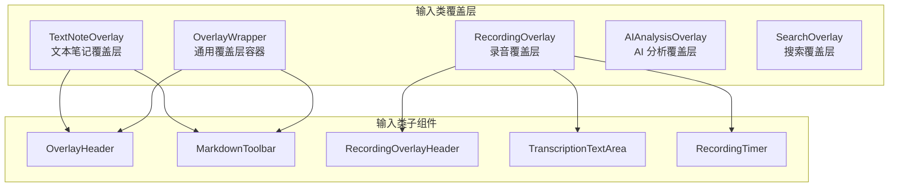
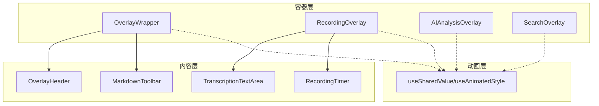
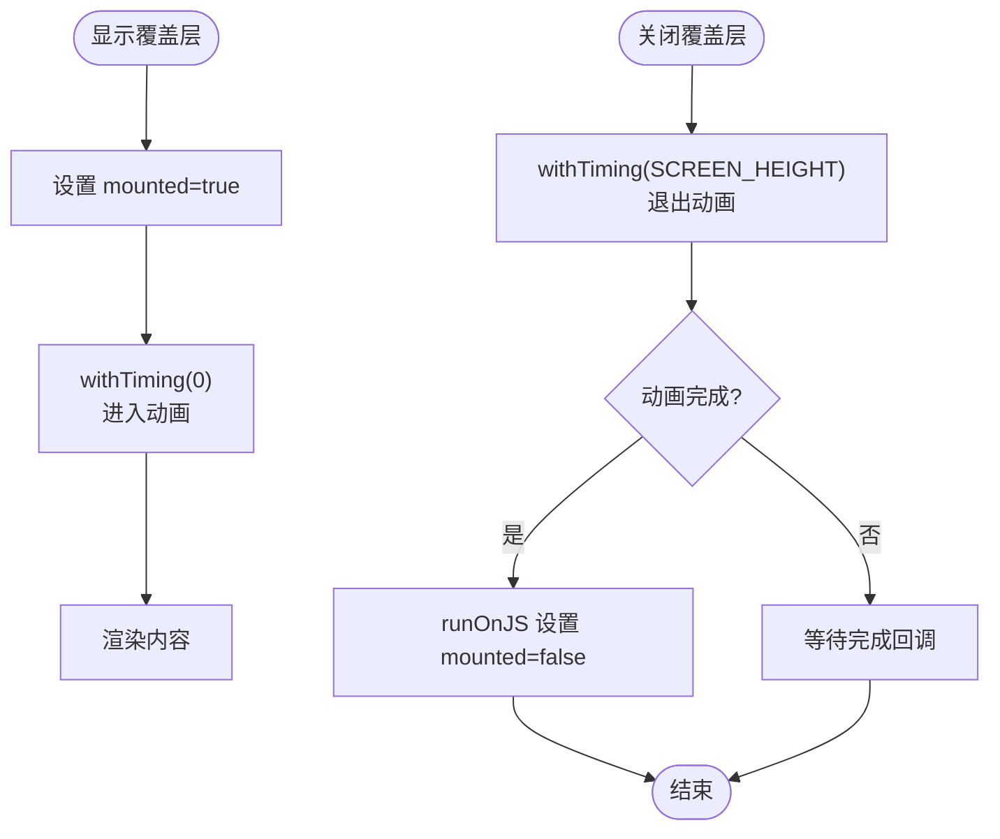
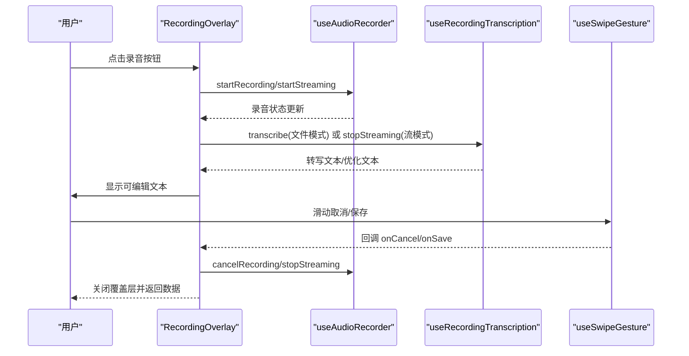
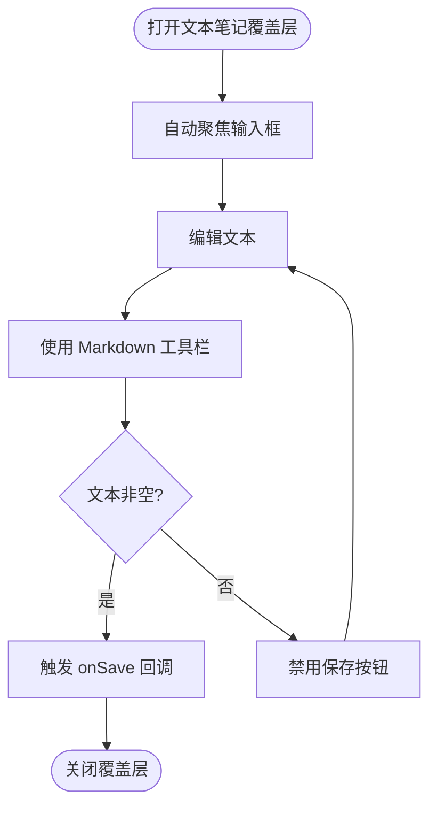
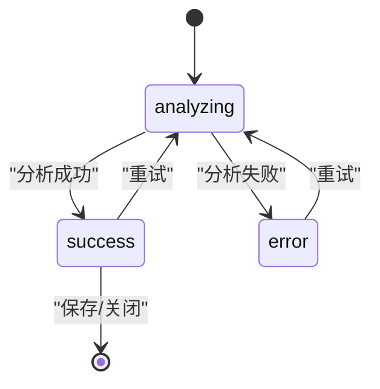
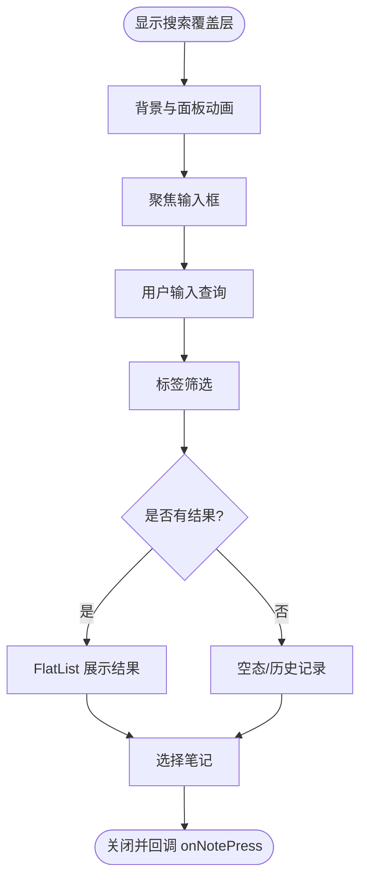
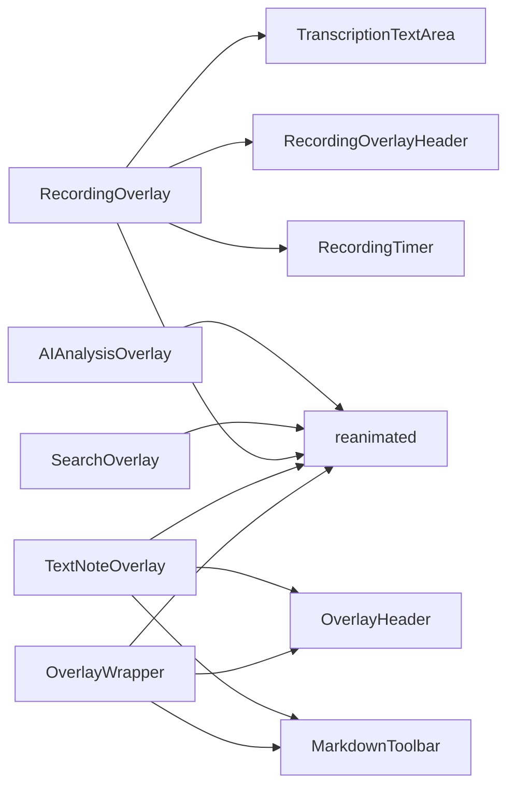

# 覆盖层组件

<cite>
**本文档引用的文件**
- [OverlayWrapper.tsx](file://components/input/OverlayWrapper.tsx)
- [RecordingOverlay.tsx](file://components/input/RecordingOverlay.tsx)
- [TextNoteOverlay.tsx](file://components/input/TextNoteOverlay.tsx)
- [AIAnalysisOverlay.tsx](file://components/note/AIAnalysisOverlay.tsx)
- [SearchOverlay.tsx](file://components/note/SearchOverlay.tsx)
- [OverlayHeader.tsx](file://components/input/OverlayHeader.tsx)
- [MarkdownToolbar.tsx](file://components/input/MarkdownToolbar.tsx)
- [RecordingOverlayHeader.tsx](file://components/input/RecordingOverlayHeader.tsx)
- [TranscriptionTextArea.tsx](file://components/input/TranscriptionTextArea.tsx)
- [RecordingTimer.tsx](file://components/input/RecordingTimer.tsx)
</cite>

## 目录
1. [简介](#简介)
2. [项目结构](#项目结构)
3. [核心组件](#核心组件)
4. [架构总览](#架构总览)
5. [详细组件分析](#详细组件分析)
6. [依赖关系分析](#依赖关系分析)
7. [性能考虑](#性能考虑)
8. [故障排除指南](#故障排除指南)
9. [结论](#结论)

## 简介
本文件系统性地文档化 VoiceNote 中的覆盖层组件体系，重点涵盖以下组件：OverlayWrapper（通用覆盖层容器）、RecordingOverlay（录音覆盖层）、TextNoteOverlay（文本笔记覆盖层）、AIAnalysisOverlay（AI 分析覆盖层）以及 SearchOverlay（搜索覆盖层）。文档从架构设计、层级管理、模态显示与用户交互、动画与过渡效果、定位与响应式适配、与主内容协调、可访问性与键盘导航，以及定制与扩展方法等方面进行深入说明，并提供可视化图示帮助理解。

## 项目结构
覆盖层组件主要分布在两个目录中：
- 输入类覆盖层：components/input 下的 OverlayWrapper、RecordingOverlay、TextNoteOverlay 及其子组件（如 OverlayHeader、MarkdownToolbar、TranscriptionTextArea、RecordingTimer 等）
- 内容类覆盖层：components/note 下的 AIAnalysisOverlay、SearchOverlay

这些组件共同构成应用内“半屏/全屏”弹出式交互的统一模式，通过统一的容器与动画策略实现一致的用户体验。

图表来源
- [OverlayWrapper.tsx:20-54](file://components/input/OverlayWrapper.tsx#L20-L54)
- [RecordingOverlay.tsx:75-417](file://components/input/RecordingOverlay.tsx#L75-L417)
- [TextNoteOverlay.tsx:15-65](file://components/input/TextNoteOverlay.tsx#L15-L65)
- [AIAnalysisOverlay.tsx:252-298](file://components/note/AIAnalysisOverlay.tsx#L252-L298)
- [SearchOverlay.tsx:57-231](file://components/note/SearchOverlay.tsx#L57-L231)
- [OverlayHeader.tsx:13-41](file://components/input/OverlayHeader.tsx#L13-L41)
- [MarkdownToolbar.tsx:31-54](file://components/input/MarkdownToolbar.tsx#L31-L54)
- [RecordingOverlayHeader.tsx:19-56](file://components/input/RecordingOverlayHeader.tsx#L19-L56)
- [TranscriptionTextArea.tsx:64-144](file://components/input/TranscriptionTextArea.tsx#L64-L144)
- [RecordingTimer.tsx:26-42](file://components/input/RecordingTimer.tsx#L26-L42)

章节来源
- [OverlayWrapper.tsx:1-77](file://components/input/OverlayWrapper.tsx#L1-L77)
- [RecordingOverlay.tsx:1-419](file://components/input/RecordingOverlay.tsx#L1-L419)
- [TextNoteOverlay.tsx:1-97](file://components/input/TextNoteOverlay.tsx#L1-L97)
- [AIAnalysisOverlay.tsx:1-466](file://components/note/AIAnalysisOverlay.tsx#L1-L466)
- [SearchOverlay.tsx:1-388](file://components/note/SearchOverlay.tsx#L1-L388)

## 核心组件
本节概述各覆盖层组件的核心职责与关键特性：
- OverlayWrapper：提供统一的半屏滑入/滑出动画、背景遮罩与挂载生命周期管理，作为其他覆盖层的基础容器
- RecordingOverlay：录音与转写流程的完整覆盖层，集成录音控制、实时转写、编辑、优化与保存
- TextNoteOverlay：基于 Markdown 的文本输入覆盖层，提供标题提取与工具栏
- AIAnalysisOverlay：AI 分析结果的展示覆盖层，支持“分析中/成功/错误”三种状态与源笔记跳转
- SearchOverlay：笔记搜索覆盖层，支持标签筛选、历史记录与结果分组展示

章节来源
- [OverlayWrapper.tsx:20-54](file://components/input/OverlayWrapper.tsx#L20-L54)
- [RecordingOverlay.tsx:75-417](file://components/input/RecordingOverlay.tsx#L75-L417)
- [TextNoteOverlay.tsx:15-65](file://components/input/TextNoteOverlay.tsx#L15-L65)
- [AIAnalysisOverlay.tsx:241-299](file://components/note/AIAnalysisOverlay.tsx#L241-L299)
- [SearchOverlay.tsx:57-231](file://components/note/SearchOverlay.tsx#L57-L231)

## 架构总览
覆盖层组件采用“容器 + 子组件”的分层架构：
- 容器层：OverlayWrapper、RecordingOverlayHeader、AIAnalysisOverlay、SearchOverlay
- 内容层：TranscriptionTextArea、RecordingTimer、MarkdownToolbar、OverlayHeader 等
- 动画层：统一使用 react-native-reanimated 的 useSharedValue/useAnimatedStyle 实现平滑过渡

图表来源
- [OverlayWrapper.tsx:20-54](file://components/input/OverlayWrapper.tsx#L20-L54)
- [RecordingOverlay.tsx:75-417](file://components/input/RecordingOverlay.tsx#L75-L417)
- [AIAnalysisOverlay.tsx:252-298](file://components/note/AIAnalysisOverlay.tsx#L252-L298)
- [SearchOverlay.tsx:57-231](file://components/note/SearchOverlay.tsx#L57-L231)
- [OverlayHeader.tsx:13-41](file://components/input/OverlayHeader.tsx#L13-L41)
- [MarkdownToolbar.tsx:31-54](file://components/input/MarkdownToolbar.tsx#L31-L54)
- [TranscriptionTextArea.tsx:64-144](file://components/input/TranscriptionTextArea.tsx#L64-L144)
- [RecordingTimer.tsx:26-42](file://components/input/RecordingTimer.tsx#L26-L42)

## 详细组件分析

### OverlayWrapper（通用覆盖层容器）
- 层级管理：使用绝对定位与 z-index 控制层级，确保覆盖层在所有主内容之上
- 模态显示：通过 visible 状态驱动 mounted 生命周期，避免未挂载时渲染造成的闪烁
- 动画与过渡：使用 reanimated 的 withTiming 配合 Easing 实现进入/退出动画；进入使用缓出三次贝塞尔，退出使用缓入三次贝塞尔
- 视觉反馈：半透明背景遮罩，圆角顶部边框营造“底部抽屉”感
- 响应式适配：高度参数支持字符串或数值，便于不同场景自定义高度

图表来源
- [OverlayWrapper.tsx:28-42](file://components/input/OverlayWrapper.tsx#L28-L42)

章节来源
- [OverlayWrapper.tsx:20-77](file://components/input/OverlayWrapper.tsx#L20-L77)

### RecordingOverlay（录音覆盖层）
- 层级管理：使用 Modal + 自定义容器实现半屏抽屉效果，z-index 由父容器控制
- 模态显示：visible 控制显示/隐藏；支持 onDismiss 时自动清理状态
- 用户交互：集成录音/暂停/停止、取消、保存、重试转写等操作；支持滑动取消/保存
- 动画与过渡：底部容器使用 reanimated 动画；转写过程与优化过程有加载指示
- 定位策略：底部对齐，最大高度限制，配合滚动视图避免内容溢出
- 响应式适配：TrackContainer 宽度动态计算，保证滑动按钮居中与交互范围一致
- 协调机制：与录音钩子、转写钩子、手势钩子解耦，通过 props 回调传递状态变化

图表来源
- [RecordingOverlay.tsx:75-417](file://components/input/RecordingOverlay.tsx#L75-L417)

章节来源
- [RecordingOverlay.tsx:75-419](file://components/input/RecordingOverlay.tsx#L75-L419)
- [RecordingOverlayHeader.tsx:19-56](file://components/input/RecordingOverlayHeader.tsx#L19-L56)
- [TranscriptionTextArea.tsx:64-144](file://components/input/TranscriptionTextArea.tsx#L64-L144)
- [RecordingTimer.tsx:26-42](file://components/input/RecordingTimer.tsx#L26-L42)

### TextNoteOverlay（文本笔记覆盖层）
- 层级管理：基于 OverlayWrapper，z-index 由容器层统一管理
- 模态显示：visible 控制打开/关闭，输入框自动聚焦
- 用户交互：保存按钮根据输入是否为空启用/禁用；支持 Markdown 工具栏插入格式
- 动画与过渡：继承 OverlayWrapper 的进入/退出动画
- 定位策略：固定高度百分比，保证在不同设备上的一致体验
- 协调机制：与 Markdown 编辑钩子协作，提取标题、插入 Markdown 片段

图表来源
- [TextNoteOverlay.tsx:15-65](file://components/input/TextNoteOverlay.tsx#L15-L65)
- [OverlayHeader.tsx:13-41](file://components/input/OverlayHeader.tsx#L13-L41)
- [MarkdownToolbar.tsx:31-54](file://components/input/MarkdownToolbar.tsx#L31-L54)

章节来源
- [TextNoteOverlay.tsx:15-97](file://components/input/TextNoteOverlay.tsx#L15-L97)
- [OverlayHeader.tsx:13-79](file://components/input/OverlayHeader.tsx#L13-L79)
- [MarkdownToolbar.tsx:31-82](file://components/input/MarkdownToolbar.tsx#L31-L82)

### AIAnalysisOverlay（AI 分析覆盖层）
- 层级管理：Modal + 自定义容器，顶部手柄与圆角顶部边框
- 模态显示：visible 控制显示；支持请求关闭时的回调
- 用户交互：支持“分析中/成功/错误”三态；成功态支持保存到灵感库、查看源笔记
- 动画与过渡：分析中使用脉冲动画循环；错误态提供重试与关闭按钮
- 定位策略：固定高度上限与屏幕比例，保证内容可滚动
- 协调机制：与 AI 分析服务解耦，通过 props 传入状态与结果

图表来源
- [AIAnalysisOverlay.tsx:241-299](file://components/note/AIAnalysisOverlay.tsx#L241-L299)

章节来源
- [AIAnalysisOverlay.tsx:241-466](file://components/note/AIAnalysisOverlay.tsx#L241-L466)

### SearchOverlay（搜索覆盖层）
- 层级管理：Modal + 键盘避让容器，底部抽屉式面板
- 模态显示：visible 控制显示/隐藏；打开时自动聚焦输入框
- 用户交互：支持查询、标签筛选、历史记录、结果列表点击跳转
- 动画与过渡：背景遮罩与面板分别使用独立的动画值，进入/退出使用不同的缓动曲线
- 定位策略：面板高度占屏幕 85%，顶部圆角与手柄提升可发现性
- 协调机制：与搜索与搜索历史钩子协作，构建分组列表与空态提示

图表来源
- [SearchOverlay.tsx:57-231](file://components/note/SearchOverlay.tsx#L57-L231)

章节来源
- [SearchOverlay.tsx:57-388](file://components/note/SearchOverlay.tsx#L57-L388)

## 依赖关系分析
- 组件间依赖
  - RecordingOverlay 依赖多个子组件与钩子，形成“覆盖层容器 + 子功能模块”的组合
  - TextNoteOverlay 依赖 OverlayWrapper 与 Markdown 工具栏，强调“基础容器 + 文本编辑”
  - AIAnalysisOverlay 与 SearchOverlay 为独立覆盖层，各自管理内部状态与动画
- 外部依赖
  - 动画：react-native-reanimated（useSharedValue/useAnimatedStyle）
  - UI：Tamagui（styled 组件）与 lucide-react-native 图标
  - 交互：expo-haptics 提供触觉反馈
  - 国际化：react-i18next

图表来源
- [RecordingOverlay.tsx:75-417](file://components/input/RecordingOverlay.tsx#L75-L417)
- [TextNoteOverlay.tsx:15-65](file://components/input/TextNoteOverlay.tsx#L15-L65)
- [OverlayWrapper.tsx:20-54](file://components/input/OverlayWrapper.tsx#L20-L54)
- [AIAnalysisOverlay.tsx:252-298](file://components/note/AIAnalysisOverlay.tsx#L252-L298)
- [SearchOverlay.tsx:57-231](file://components/note/SearchOverlay.tsx#L57-L231)

章节来源
- [RecordingOverlay.tsx:75-417](file://components/input/RecordingOverlay.tsx#L75-L417)
- [TextNoteOverlay.tsx:15-65](file://components/input/TextNoteOverlay.tsx#L15-L65)
- [OverlayWrapper.tsx:20-54](file://components/input/OverlayWrapper.tsx#L20-L54)
- [AIAnalysisOverlay.tsx:252-298](file://components/note/AIAnalysisOverlay.tsx#L252-L298)
- [SearchOverlay.tsx:57-231](file://components/note/SearchOverlay.tsx#L57-L231)

## 性能考虑
- 动画性能
  - 使用 reanimated 的共享值与样式绑定，避免不必要的重排与重绘
  - 进入/退出动画采用不同缓动函数，兼顾自然感与性能
- 渲染优化
  - OverlayWrapper 在未挂载时直接返回 null，减少无效渲染
  - SearchOverlay 使用 FlatList 渲染结果，结合 keyExtractor 降低重渲染
- 计算与状态
  - RecordingOverlay 将转写状态与录音状态解耦，避免在转写过程中阻塞 UI
  - AIAnalysisOverlay 成功态内容使用 ScrollView，避免过长内容导致布局抖动

## 故障排除指南
- 录音/转写异常
  - 检查录音钩子与转写钩子的状态回调是否正确传递至覆盖层
  - 确认取消/保存流程中的状态复位逻辑（如清空本地状态、停止录音/流）
- 动画不生效
  - 确保 visible 状态变化触发了动画值更新
  - 检查 mounted 生命周期与 runOnJS 的回调时机
- 搜索无结果
  - 确认查询与标签筛选条件是否正确传递给搜索钩子
  - 检查分组构建逻辑与 FlatList 的 keyExtractor

章节来源
- [RecordingOverlay.tsx:232-254](file://components/input/RecordingOverlay.tsx#L232-L254)
- [OverlayWrapper.tsx:38-42](file://components/input/OverlayWrapper.tsx#L38-L42)
- [SearchOverlay.tsx:182-227](file://components/note/SearchOverlay.tsx#L182-L227)

## 结论
覆盖层组件通过统一的容器与动画策略，实现了录音、文本、搜索与 AI 分析等多场景的半屏交互。组件间职责清晰、依赖解耦，既保证了良好的用户体验，也为后续扩展提供了灵活的空间。建议在新增覆盖层时遵循现有模式：以 OverlayWrapper 为基础容器，按需引入子组件与钩子，统一处理可见性、动画与状态复位。