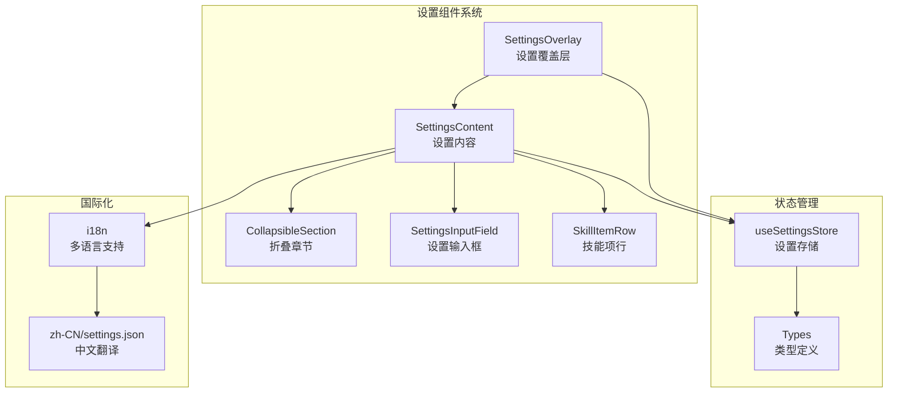
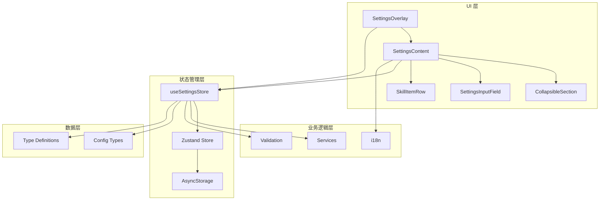
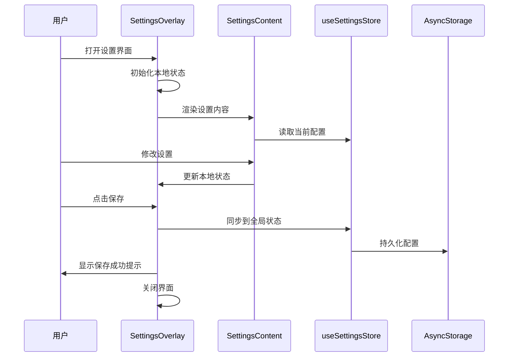
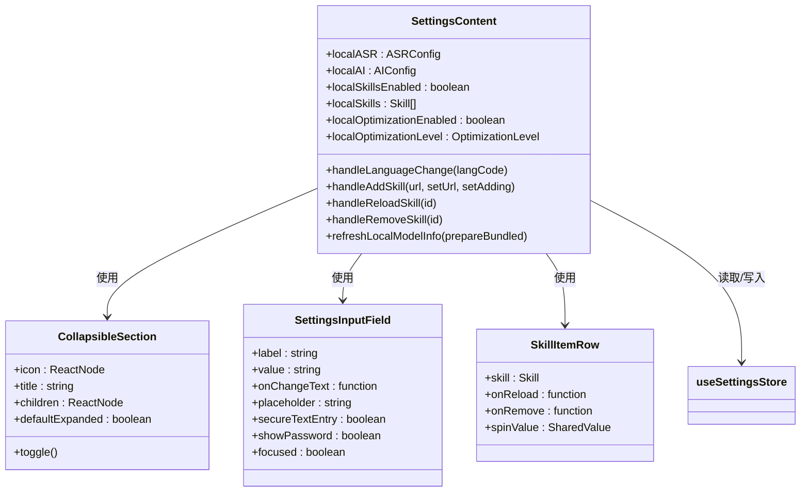
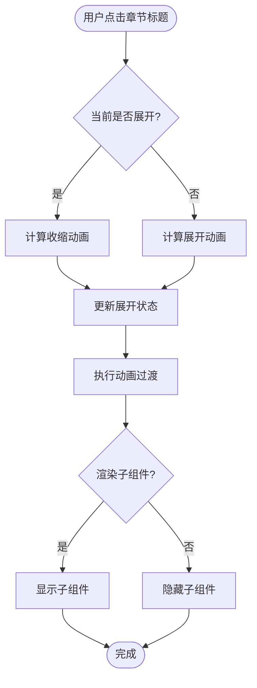
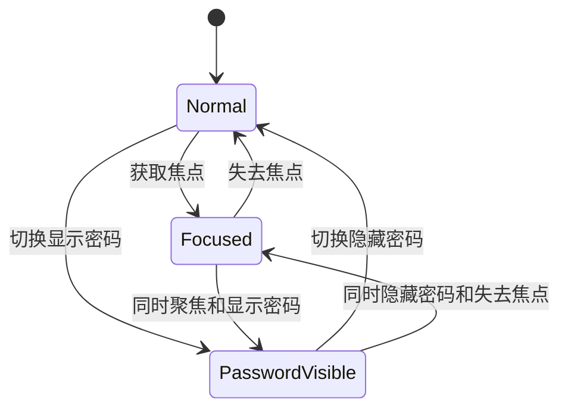
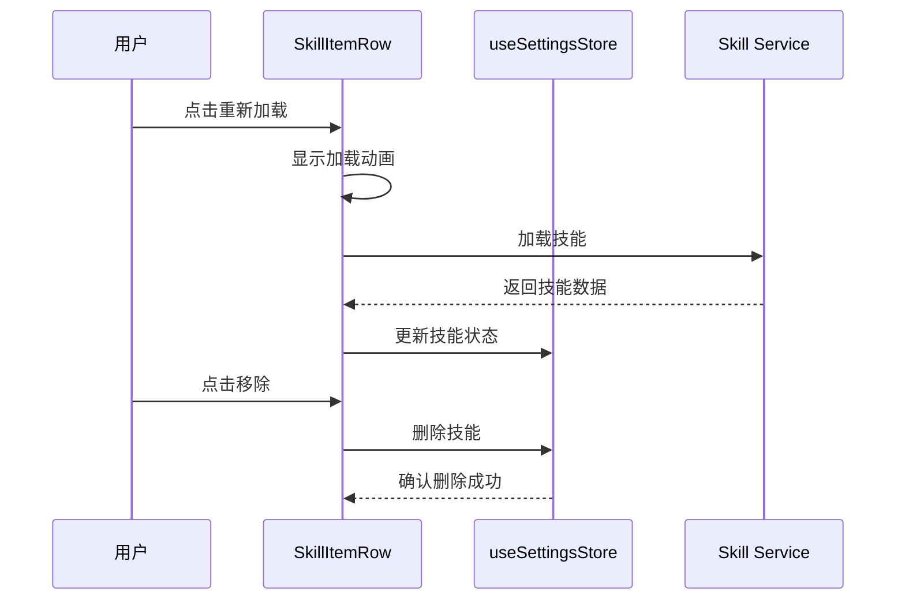
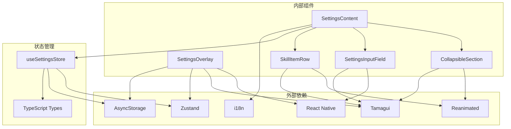

# 设置组件

<cite>
**本文档引用的文件**
- [SettingsContent.tsx](file://components/settings/SettingsContent.tsx)
- [SettingsInputField.tsx](file://components/settings/SettingsInputField.tsx)
- [CollapsibleSection.tsx](file://components/settings/CollapsibleSection.tsx)
- [SettingsOverlay.tsx](file://components/settings/SettingsOverlay.tsx)
- [useSettingsStore.ts](file://store/useSettingsStore.ts)
- [settings.ts](file://types/settings.ts)
- [settings.json](file://i18n/locales/zh-CN/settings.json)
- [SkillItemRow.tsx](file://components/settings/SkillItemRow.tsx)
- [index.ts](file://components/settings/index.ts)
- [settings.tsx](file://app/(tabs)/settings.tsx)
- [index.ts](file://theme/index.ts)
</cite>

## 目录
1. [简介](#简介)
2. [项目结构](#项目结构)
3. [核心组件](#核心组件)
4. [架构概览](#架构概览)
5. [详细组件分析](#详细组件分析)
6. [依赖关系分析](#依赖关系分析)
7. [性能考虑](#性能考虑)
8. [故障排除指南](#故障排除指南)
9. [结论](#结论)
10. [附录](#附录)

## 简介

VoiceNote 的设置组件系统提供了完整的应用配置界面，包括语音识别（ASR）、人工智能（AI）配置、技能管理和转录优化等功能。该系统采用现代化的 React Native + Tamagui 架构，结合 Zustand 状态管理，实现了响应式的设置界面和持久化的配置存储。

系统的核心特性包括：
- 多层次的设置组织结构
- 实时的状态更新和验证
- 国际化支持和可访问性
- 动画过渡和用户体验优化
- 完整的错误处理和反馈机制

## 项目结构

设置组件系统位于 `components/settings/` 目录下，采用模块化设计，每个组件负责特定的功能领域：

**图表来源**
- [SettingsOverlay.tsx:1-186](file://components/settings/SettingsOverlay.tsx#L1-L186)
- [SettingsContent.tsx:1-623](file://components/settings/SettingsContent.tsx#L1-L623)
- [useSettingsStore.ts:1-218](file://store/useSettingsStore.ts#L1-L218)

**章节来源**
- [index.ts:1-6](file://components/settings/index.ts#L1-L6)
- [settings.tsx](file://app/(tabs)/settings.tsx#L1-L22)

## 核心组件

设置组件系统由四个主要组件构成，每个组件都有明确的职责分工：

### SettingsOverlay - 设置覆盖层
作为整个设置系统的容器，负责：
- 模态对话框的显示和隐藏
- 底部弹出式界面的动画效果
- 保存和重置功能的统一管理
- 与全局状态管理器的集成

### SettingsContent - 设置内容
主设置界面，包含所有配置选项：
- 语言选择和国际化
- ASR（语音识别）配置
- AI（人工智能）配置
- 技能管理系统
- 转录优化设置

### CollapsibleSection - 折叠章节
提供可展开/折叠的内容区域：
- 平滑的动画过渡效果
- 图标和标题的视觉标识
- 默认展开状态控制
- 响应式布局适配

### SettingsInputField - 设置输入框
专门的输入控件，支持：
- 明文/密码模式切换
- 实时焦点状态管理
- 自动完成和拼写检查禁用
- 主题适配的颜色方案

**章节来源**
- [SettingsOverlay.tsx:29-151](file://components/settings/SettingsOverlay.tsx#L29-L151)
- [SettingsContent.tsx:44-518](file://components/settings/SettingsContent.tsx#L44-L518)
- [CollapsibleSection.tsx:15-64](file://components/settings/CollapsibleSection.tsx#L15-L64)
- [SettingsInputField.tsx:15-72](file://components/settings/SettingsInputField.tsx#L15-L72)

## 架构概览

设置组件系统采用分层架构设计，确保了良好的可维护性和扩展性：

**图表来源**
- [useSettingsStore.ts:134-217](file://store/useSettingsStore.ts#L134-L217)
- [SettingsContent.tsx:13-22](file://components/settings/SettingsContent.tsx#L13-L22)

系统的核心数据流遵循以下模式：
1. 用户通过 UI 组件进行交互
2. 设置内容组件更新本地状态
3. 用户点击保存按钮触发状态同步
4. 全局状态管理器持久化配置
5. 系统根据新配置执行相应操作

## 详细组件分析

### SettingsOverlay 组件分析

SettingsOverlay 是设置系统的入口点，采用了底部弹出式模态的设计模式：

**图表来源**
- [SettingsOverlay.tsx:29-77](file://components/settings/SettingsOverlay.tsx#L29-L77)
- [SettingsContent.tsx:44-518](file://components/settings/SettingsContent.tsx#L44-L518)

#### 状态管理模式
- **显式保存模式**：使用本地状态管理用户修改，点击保存时才同步到全局状态
- **状态隔离**：每个设置类别都有独立的状态管理
- **回滚机制**：关闭界面时自动回滚到原始状态

#### 功能特性
- 底部弹出式界面设计
- 保存和重置默认值功能
- 完整的动画过渡效果
- 响应式布局适配

**章节来源**
- [SettingsOverlay.tsx:29-151](file://components/settings/SettingsOverlay.tsx#L29-L151)

### SettingsContent 组件分析

SettingsContent 是设置系统的核心界面，提供了完整的配置管理功能：

**图表来源**
- [SettingsContent.tsx:24-58](file://components/settings/SettingsContent.tsx#L24-L58)
- [CollapsibleSection.tsx:8-20](file://components/settings/CollapsibleSection.tsx#L8-L20)
- [SettingsInputField.tsx:7-21](file://components/settings/SettingsInputField.tsx#L7-L21)
- [SkillItemRow.tsx:9-25](file://components/settings/SkillItemRow.tsx#L9-L25)

#### 数据绑定机制
组件使用双向数据绑定模式：
- **受控组件**：所有输入都通过 props 接收初始值
- **状态更新**：onChange 回调函数更新本地状态
- **实时同步**：用户输入立即反映到界面

#### 表单验证策略
- **URL 验证**：技能 URL 的格式验证
- **必填字段**：关键配置的完整性检查
- **错误处理**：异步操作的异常捕获和用户反馈

**章节来源**
- [SettingsContent.tsx:44-518](file://components/settings/SettingsContent.tsx#L44-L518)

### CollapsibleSection 组件分析

CollapsibleSection 提供了优雅的折叠/展开功能：

**图表来源**
- [CollapsibleSection.tsx:30-35](file://components/settings/CollapsibleSection.tsx#L30-L35)

#### 动画实现
- **Reanimated 动画**：使用共享值实现流畅的旋转动画
- **LayoutAnimation**：配合布局变化的平滑过渡
- **触摸反馈**：按下状态的颜色变化

#### 可访问性特性
- **焦点管理**：键盘导航支持
- **屏幕阅读器**：语义化标签和描述
- **颜色对比度**：满足 WCAG 标准

**章节来源**
- [CollapsibleSection.tsx:15-64](file://components/settings/CollapsibleSection.tsx#L15-L64)

### SettingsInputField 组件分析

SettingsInputField 是专门的输入控件，支持多种输入场景：

**图表来源**
- [SettingsInputField.tsx:22-26](file://components/settings/SettingsInputField.tsx#L22-L26)

#### 输入类型支持
- **普通文本**：适用于大多数配置项
- **密码输入**：支持显示/隐藏切换
- **安全文本**：API 密钥等敏感信息
- **占位符文本**：提供输入指导

#### 主题适配
- **暗色模式**：深色背景和浅色文字
- **亮色模式**：浅色背景和深色文字
- **焦点状态**：边框颜色变化指示当前状态

**章节来源**
- [SettingsInputField.tsx:15-72](file://components/settings/SettingsInputField.tsx#L15-L72)

### SkillItemRow 组件分析

SkillItemRow 专门用于显示和管理技能项：

**图表来源**
- [SkillItemRow.tsx:21-36](file://components/settings/SkillItemRow.tsx#L21-L36)

#### 状态管理
- **加载状态**：旋转动画指示加载中
- **成功状态**：绿色图标表示加载成功
- **错误状态**：红色图标和错误消息
- **实时更新**：状态变化立即反映到界面

#### 用户交互
- **重新加载**：手动刷新技能状态
- **移除技能**：从配置中删除技能
- **状态反馈**：不同状态的颜色编码

**章节来源**
- [SkillItemRow.tsx:21-74](file://components/settings/SkillItemRow.tsx#L21-L74)

## 依赖关系分析

设置组件系统具有清晰的依赖关系结构：

**图表来源**
- [SettingsOverlay.tsx:1-23](file://components/settings/SettingsOverlay.tsx#L1-L23)
- [SettingsContent.tsx:1-23](file://components/settings/SettingsContent.tsx#L1-L23)
- [useSettingsStore.ts:1-4](file://store/useSettingsStore.ts#L1-L4)

### 组件间通信

组件间的通信遵循单向数据流原则：

1. **父组件到子组件**：通过 props 传递配置和回调函数
2. **子组件到父组件**：通过回调函数更新状态
3. **全局状态**：通过 Zustand store 进行跨组件状态共享

### 类型系统集成

系统使用 TypeScript 提供完整的类型安全保障：

- **配置类型**：严格的接口定义确保配置结构正确
- **状态类型**：类型推断减少运行时错误
- **组件属性**：Props 类型定义提高开发体验

**章节来源**
- [settings.ts:1-58](file://types/settings.ts#L1-L58)
- [useSettingsStore.ts:9-45](file://store/useSettingsStore.ts#L9-L45)

## 性能考虑

设置组件系统在性能方面采用了多项优化策略：

### 渲染优化
- **React.memo 包装**：避免不必要的重新渲染
- **状态分离**：将大型状态分解为更小的独立状态
- **条件渲染**：只渲染可见的设置项

### 内存管理
- **及时清理**：动画值在组件卸载时自动清理
- **事件监听器**：组件卸载时移除所有事件监听
- **资源释放**：异步操作在取消时释放资源

### 网络优化
- **缓存策略**：本地模型信息的缓存机制
- **并发控制**：技能加载的并发限制
- **错误重试**：智能的重试机制

## 故障排除指南

### 常见问题及解决方案

#### 设置无法保存
**症状**：点击保存后配置没有生效
**原因**：
- 全局状态同步失败
- AsyncStorage 写入错误
- 网络连接问题

**解决方法**：
1. 检查网络连接状态
2. 重启应用后重试
3. 清除应用缓存
4. 检查磁盘空间

#### 技能加载失败
**症状**：技能 URL 有效但无法加载
**原因**：
- 网络请求超时
- 技能格式不正确
- 服务器响应错误

**解决方法**：
1. 检查技能 URL 格式
2. 确认网络连接稳定
3. 尝试不同的技能源
4. 查看错误日志

#### 动画卡顿
**症状**：折叠动画或加载动画不流畅
**原因**：
- 设备性能不足
- 动画配置不当
- 内存泄漏

**解决方法**：
1. 关闭其他后台应用
2. 降低动画复杂度
3. 更新到最新版本
4. 重启设备

### 调试工具

#### 开发者工具
- **React DevTools**：检查组件树和状态
- **Flipper**：网络请求监控
- **Chrome DevTools**：JavaScript 调试

#### 日志记录
- **错误边界**：捕获和报告组件错误
- **性能监控**：渲染时间统计
- **用户行为追踪**：设置使用模式分析

**章节来源**
- [SettingsOverlay.tsx:53-77](file://components/settings/SettingsOverlay.tsx#L53-L77)
- [SettingsContent.tsx:98-135](file://components/settings/SettingsContent.tsx#L98-L135)

## 结论

VoiceNote 的设置组件系统展现了现代移动应用设置界面的最佳实践。通过模块化设计、状态管理优化和用户体验优先的理念，系统提供了强大而易用的配置功能。

### 主要优势
- **模块化架构**：清晰的组件职责分离
- **状态管理**：Zustand 提供的高效状态管理
- **用户体验**：流畅的动画和即时反馈
- **可扩展性**：易于添加新的设置选项
- **国际化支持**：完整的多语言适配

### 技术亮点
- **动画系统**：Reanimated 实现的高性能动画
- **类型安全**：完整的 TypeScript 类型定义
- **持久化存储**：AsyncStorage 的可靠数据持久化
- **可访问性**：符合无障碍标准的界面设计

## 附录

### 设置组件扩展指南

#### 添加新的设置项
1. 在 `SettingsContent.tsx` 中添加新的配置项
2. 更新 `useSettingsStore.ts` 中的状态定义
3. 添加相应的国际化字符串
4. 创建对应的 UI 组件

#### 自定义样式
1. 修改 `theme/index.ts` 中的主题变量
2. 更新组件的样式定义
3. 确保暗色模式兼容性

#### 集成新服务
1. 创建服务接口定义
2. 实现服务客户端
3. 添加配置项到设置界面
4. 更新状态管理逻辑

### 最佳实践建议

#### 用户体验优化
- 提供即时的视觉反馈
- 保持一致的交互模式
- 确保足够的颜色对比度
- 支持键盘导航

#### 性能优化
- 使用 React.memo 优化渲染
- 实现懒加载和代码分割
- 优化图片和资源加载
- 减少不必要的状态更新

#### 可访问性实现
- 提供屏幕阅读器支持
- 确保键盘可操作性
- 使用语义化 HTML 结构
- 提供替代文本和描述