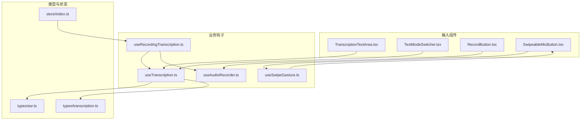
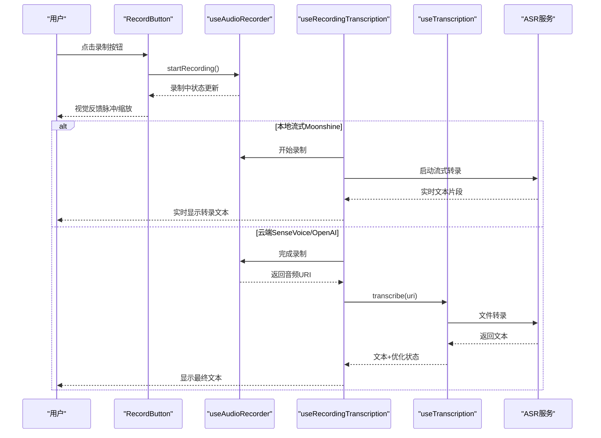
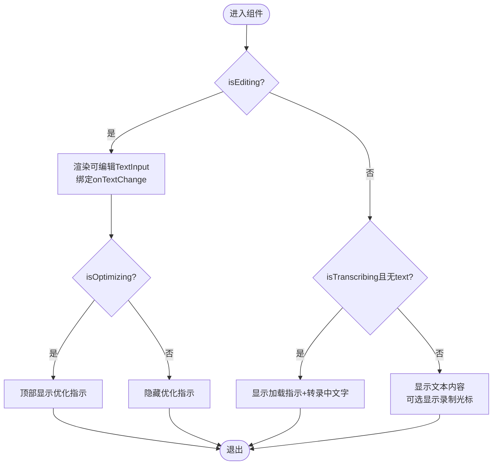
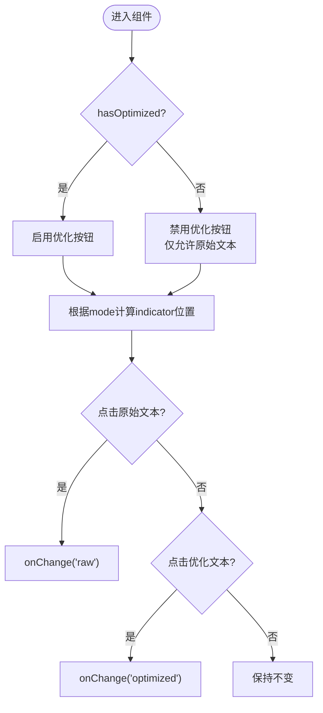
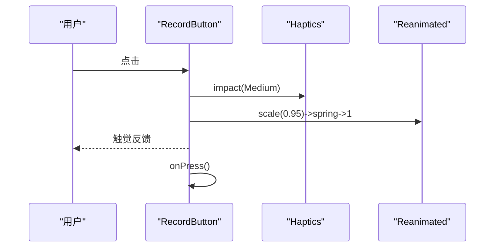
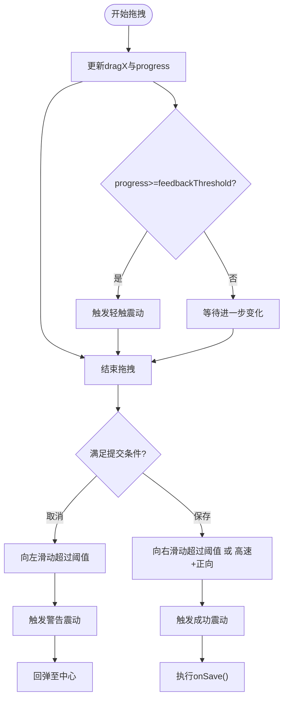
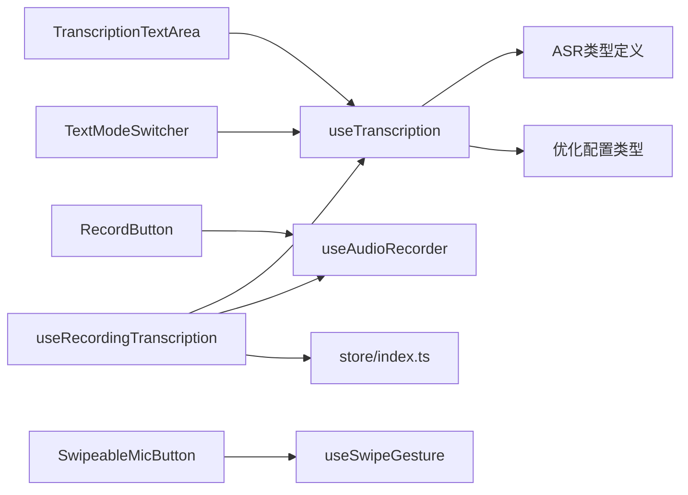

# 输入组件

<cite>
**本文引用的文件**
- [components/input/TranscriptionTextArea.tsx](file://components/input/TranscriptionTextArea.tsx)
- [components/input/TextModeSwitcher.tsx](file://components/input/TextModeSwitcher.tsx)
- [components/input/RecordButton.tsx](file://components/input/RecordButton.tsx)
- [components/input/SwipeableMicButton.tsx](file://components/input/SwipeableMicButton.tsx)
- [hooks/useAudioRecorder.ts](file://hooks/useAudioRecorder.ts)
- [hooks/useTranscription.ts](file://hooks/useTranscription.ts)
- [hooks/useRecordingTranscription.ts](file://hooks/useRecordingTranscription.ts)
- [hooks/useSwipeGesture.ts](file://hooks/useSwipeGesture.ts)
- [types/asr.ts](file://types/asr.ts)
- [types/transcription.ts](file://types/transcription.ts)
- [store/index.ts](file://store/index.ts)
- [components/input/index.ts](file://components/input/index.ts)
</cite>

## 目录
1. [简介](#简介)
2. [项目结构](#项目结构)
3. [核心组件](#核心组件)
4. [架构总览](#架构总览)
5. [组件详解](#组件详解)
6. [依赖关系分析](#依赖关系分析)
7. [性能考量](#性能考量)
8. [故障排查指南](#故障排查指南)
9. [结论](#结论)
10. [附录](#附录)

## 简介
本文件聚焦 VoiceNote 的输入组件，系统性地文档化以下组件：TranscriptionTextArea（转录文本区域）、TextModeSwitcher（文本模式切换器）、RecordButton（录音按钮）、SwipeableMicButton（可滑动麦克风按钮）。文档涵盖这些组件在语音输入、文本输入与混合输入场景下的行为，事件处理、数据验证与状态同步机制，并提供实时交互示例与用户体验优化建议。同时说明输入组件与音频录制、文本转录服务的集成方式，以及错误处理与用户反馈机制；最后给出定制与扩展指导。

## 项目结构
输入组件位于 components/input 目录，配套的业务逻辑集中在 hooks 中，类型定义位于 types 目录，全局状态通过 store 导出。组件导出入口由 components/input/index.ts 统一管理。

**图表来源**
- [components/input/TranscriptionTextArea.tsx:64-145](file://components/input/TranscriptionTextArea.tsx#L64-L145)
- [components/input/TextModeSwitcher.tsx:14-61](file://components/input/TextModeSwitcher.tsx#L14-L61)
- [components/input/RecordButton.tsx:49-130](file://components/input/RecordButton.tsx#L49-L130)
- [components/input/SwipeableMicButton.tsx:27-121](file://components/input/SwipeableMicButton.tsx#L27-L121)
- [hooks/useAudioRecorder.ts:26-269](file://hooks/useAudioRecorder.ts#L26-L269)
- [hooks/useTranscription.ts:22-103](file://hooks/useTranscription.ts#L22-L103)
- [hooks/useRecordingTranscription.ts:74-195](file://hooks/useRecordingTranscription.ts#L74-L195)
- [hooks/useSwipeGesture.ts:38-121](file://hooks/useSwipeGesture.ts#L38-L121)
- [types/asr.ts:1-164](file://types/asr.ts#L1-L164)
- [types/transcription.ts:1-15](file://types/transcription.ts#L1-L15)
- [store/index.ts:1-8](file://store/index.ts#L1-L8)

**章节来源**
- [components/input/index.ts:1-15](file://components/input/index.ts#L1-L15)

## 核心组件
- TranscriptionTextArea：负责展示与编辑转录文本，支持“正在转录”、“优化中”等状态指示，以及录制时的闪烁光标提示。
- TextModeSwitcher：在原始文本与优化文本之间切换，根据是否有可用优化结果动态启用/禁用。
- RecordButton：录制控制主按钮，提供按下缩放、录制脉冲动画与震动反馈。
- SwipeableMicButton：可滑动的麦克风按钮，支持滑动取消与滑动保存两种手势，内置录制脉冲与转录旋转指示。

**章节来源**
- [components/input/TranscriptionTextArea.tsx:64-145](file://components/input/TranscriptionTextArea.tsx#L64-L145)
- [components/input/TextModeSwitcher.tsx:14-61](file://components/input/TextModeSwitcher.tsx#L14-L61)
- [components/input/RecordButton.tsx:49-130](file://components/input/RecordButton.tsx#L49-L130)
- [components/input/SwipeableMicButton.tsx:27-121](file://components/input/SwipeableMicButton.tsx#L27-L121)

## 架构总览
输入组件通过统一的 useRecordingTranscription 钩子协调录音与转录流程。该钩子根据 ASR 提供商类型自动选择“流式转录（本地）”或“文件后置转录（云端）”。useAudioRecorder 负责权限申请、录制生命周期与播放控制；useTranscription 负责调用 ASR 服务与文本优化；useSwipeGesture 提供滑动手势与触觉反馈。

**图表来源**
- [hooks/useRecordingTranscription.ts:74-195](file://hooks/useRecordingTranscription.ts#L74-L195)
- [hooks/useAudioRecorder.ts:26-269](file://hooks/useAudioRecorder.ts#L26-L269)
- [hooks/useTranscription.ts:22-103](file://hooks/useTranscription.ts#L22-L103)
- [types/asr.ts:1-164](file://types/asr.ts#L1-L164)

## 组件详解

### TranscriptionTextArea（转录文本区域）
- 功能要点
  - 编辑态：渲染可编辑的多行文本输入框，支持占位符与文本变更回调。
  - 只读态：展示转录文本，若无文本则显示“正在转录”加载指示。
  - 状态指示：优化中显示旋转指示与文字；录制中显示闪烁光标。
  - 自动滚动：文本更新时自动滚动到底部，保证最新内容可见。
- 关键属性
  - text：当前显示文本
  - isEditing：是否处于编辑态
  - isTranscribing：是否正在转录
  - isRecording：是否正在录制
  - isOptimizing：是否正在优化
  - placeholder：占位符文本
  - onTextChange：文本变更回调
- 交互与反馈
  - 通过 Animated 动画实现加载旋转与光标闪烁，提升感知即时性。
  - 使用国际化文案，确保多语言场景一致体验。
- 错误处理
  - 作为展示组件不直接处理错误，错误状态由上层钩子传递并影响渲染。

**图表来源**
- [components/input/TranscriptionTextArea.tsx:64-145](file://components/input/TranscriptionTextArea.tsx#L64-L145)

**章节来源**
- [components/input/TranscriptionTextArea.tsx:64-145](file://components/input/TranscriptionTextArea.tsx#L64-L145)

### TextModeSwitcher（文本模式切换器）
- 功能要点
  - 在“原始文本”和“优化文本”之间切换。
  - 当存在优化结果时启用切换，否则禁用“优化文本”按钮。
  - 使用弹簧动画平滑移动指示器，提供明确的视觉反馈。
- 关键属性
  - mode：当前模式（'raw' | 'optimized'）
  - hasOptimized：是否存在优化文本
  - onChange：模式变更回调
- 用户体验
  - 按钮颜色与透明度随状态变化，清晰表达可用性与当前选择。

**图表来源**
- [components/input/TextModeSwitcher.tsx:14-61](file://components/input/TextModeSwitcher.tsx#L14-L61)

**章节来源**
- [components/input/TextModeSwitcher.tsx:14-61](file://components/input/TextModeSwitcher.tsx#L14-L61)

### RecordButton（录音按钮）
- 功能要点
  - 主要录制控制入口，支持按下缩放与录制脉冲效果。
  - 录制中背景变为红色，边框高亮；非录制中为深色主题。
  - 提供触觉反馈（中等震动），增强操作确认感。
- 关键属性
  - isRecording：是否正在录制
  - onPress：点击回调
  - disabled：是否禁用
- 动画与交互
  - 使用 Reanimated 共享值与动画序列实现缩放、脉冲与圆角过渡。
  - 支持明暗主题适配，颜色随系统主题变化。

**图表来源**
- [components/input/RecordButton.tsx:86-99](file://components/input/RecordButton.tsx#L86-L99)

**章节来源**
- [components/input/RecordButton.tsx:49-130](file://components/input/RecordButton.tsx#L49-L130)

### SwipeableMicButton（可滑动麦克风按钮）
- 功能要点
  - 结合滑动手势与点击手势，支持“滑动取消”和“滑动保存”。
  - 录制中显示脉冲环与弱化透明度，转录中显示旋转指示。
  - 内置触觉反馈：轻触、成功、警告三档，分别用于阈值反馈、成功提交与取消。
- 关键属性
  - isRecording / isTranscribing：状态驱动视觉
  - buttonAnimatedStyle：外部传入的动画样式（如拖拽偏移）
  - gesture：外部传入的滑动手势
  - onPress：点击回调
- 手势与阈值
  - 通过 useSwipeGesture 计算拖拽进度与提交条件，结合速度阈值与位置阈值判断动作。

**图表来源**
- [hooks/useSwipeGesture.ts:67-114](file://hooks/useSwipeGesture.ts#L67-L114)
- [components/input/SwipeableMicButton.tsx:89-100](file://components/input/SwipeableMicButton.tsx#L89-L100)

**章节来源**
- [components/input/SwipeableMicButton.tsx:27-121](file://components/input/SwipeableMicButton.tsx#L27-L121)
- [hooks/useSwipeGesture.ts:38-121](file://hooks/useSwipeGesture.ts#L38-L121)

## 依赖关系分析
- 组件到钩子
  - TranscriptionTextArea 依赖 useTranscription 的 currentText、isTranscribing、isOptimizing 等状态。
  - TextModeSwitcher 依赖 useTranscription 的 textMode 与 setTextMode。
  - RecordButton 依赖 useAudioRecorder 的 startRecording/pause/resume/stop 等能力。
  - SwipeableMicButton 依赖 useSwipeGesture 提供的拖拽与提交逻辑。
- 钩子到服务
  - useRecordingTranscription 根据 ASR 类型路由到 useStreamingASR 或 useTranscription。
  - useTranscription 调用 transcribeAudio 与 optimizeTranscription，并受设置项控制。
- 类型与状态
  - ASR 类型定义（provider、model、streaming 事件）与优化配置类型贯穿组件与钩子。

**图表来源**
- [hooks/useRecordingTranscription.ts:74-195](file://hooks/useRecordingTranscription.ts#L74-L195)
- [hooks/useTranscription.ts:22-103](file://hooks/useTranscription.ts#L22-L103)
- [hooks/useAudioRecorder.ts:26-269](file://hooks/useAudioRecorder.ts#L26-L269)
- [hooks/useSwipeGesture.ts:38-121](file://hooks/useSwipeGesture.ts#L38-L121)
- [types/asr.ts:1-164](file://types/asr.ts#L1-L164)
- [types/transcription.ts:1-15](file://types/transcription.ts#L1-L15)
- [store/index.ts:1-8](file://store/index.ts#L1-L8)

**章节来源**
- [hooks/useRecordingTranscription.ts:74-195](file://hooks/useRecordingTranscription.ts#L74-L195)
- [hooks/useTranscription.ts:22-103](file://hooks/useTranscription.ts#L22-L103)
- [hooks/useAudioRecorder.ts:26-269](file://hooks/useAudioRecorder.ts#L26-L269)
- [hooks/useSwipeGesture.ts:38-121](file://hooks/useSwipeGesture.ts#L38-L121)
- [types/asr.ts:1-164](file://types/asr.ts#L1-L164)
- [types/transcription.ts:1-15](file://types/transcription.ts#L1-L15)
- [store/index.ts:1-8](file://store/index.ts#L1-L8)

## 性能考量
- 动画与渲染
  - 组件广泛使用 Reanimated 的共享值与动画序列，避免强制重排，保证流畅度。
  - TranscriptionTextArea 在文本更新时延迟滚动，减少频繁滚动带来的抖动。
- 状态同步
  - useRecordingTranscription 将流式与文件后置两种模式的状态进行统一，避免重复渲染。
  - useTranscription 对返回对象进行 memo 化，降低下游组件重渲染频率。
- I/O 与网络
  - 云端转录在录制完成后触发，避免录制过程中的网络阻塞。
  - 本地流式转录按行增量更新，减少一次性大文本处理压力。

[本节为通用性能建议，无需特定文件引用]

## 故障排查指南
- 录音权限被拒
  - 现象：启动录制时报错或直接失败。
  - 处理：检查 useAudioRecorder 的权限请求与错误消息，引导用户在系统设置中开启麦克风权限。
- 录制无法停止/取消
  - 现象：stop/cancel 无效或文件未删除。
  - 处理：确认 isRecordingRef 标记与 recorder 实例状态一致；确保 setAudioModeAsync 正确关闭录音模式。
- 转录失败
  - 现象：transcribe 抛错或返回空文本。
  - 处理：useTranscription 将错误信息写入 error 并返回空字符串；上层应显示错误提示并提供重试。
- 优化失败
  - 现象：优化阶段异常但不影响文本显示。
  - 处理：useTranscription 在优化失败时静默回退到原始文本，保持一致性。
- 滑动无响应
  - 现象：滑动取消/保存不生效。
  - 处理：检查 useSwipeGesture 的阈值配置与手势组合；确认 isCommitted 标志防止重复提交。

**章节来源**
- [hooks/useAudioRecorder.ts:74-204](file://hooks/useAudioRecorder.ts#L74-L204)
- [hooks/useTranscription.ts:33-80](file://hooks/useTranscription.ts#L33-L80)
- [hooks/useSwipeGesture.ts:85-114](file://hooks/useSwipeGesture.ts#L85-L114)

## 结论
VoiceNote 的输入组件围绕“录制—转录—编辑—优化”的完整链路构建，通过统一的钩子抽象实现本地流式与云端文件后置两种模式的无缝切换。组件以动画与触觉反馈强化即时反馈，以状态同步与错误兜底保障稳定性。开发者可在不破坏整体架构的前提下，基于现有钩子与类型体系对组件进行定制与扩展。

[本节为总结性内容，无需特定文件引用]

## 附录

### 组件事件与状态映射
- RecordButton
  - 触发：onPress
  - 状态：isRecording、disabled
- SwipeableMicButton
  - 触发：onPress（点击）、onCancel/ onSave（滑动）
  - 状态：isRecording、isTranscribing、gesture、buttonAnimatedStyle
- TranscriptionTextArea
  - 触发：onTextChange（编辑态）
  - 状态：text、isEditing、isTranscribing、isRecording、isOptimizing、placeholder
- TextModeSwitcher
  - 触发：onChange
  - 状态：mode、hasOptimized

**章节来源**
- [components/input/RecordButton.tsx:43-47](file://components/input/RecordButton.tsx#L43-L47)
- [components/input/SwipeableMicButton.tsx:17-23](file://components/input/SwipeableMicButton.tsx#L17-L23)
- [components/input/TranscriptionTextArea.tsx:13-21](file://components/input/TranscriptionTextArea.tsx#L13-L21)
- [components/input/TextModeSwitcher.tsx:6-10](file://components/input/TextModeSwitcher.tsx#L6-L10)

### 实时交互示例
- 语音输入（本地流式）
  - 用户点击 RecordButton 启动录制，SwipeableMicButton 显示脉冲；转录实时显示于 TranscriptionTextArea。
- 语音输入（云端）
  - 录制结束后触发文件转录，TranscriptionTextArea 展示“正在转录”，完成后进入优化态并可切换。
- 文本输入
  - 直接编辑 TranscriptionTextArea，TextModeSwitcher 可在原始与优化文本间切换。
- 混合输入
  - 录制过程中可随时暂停/继续，编辑态下仍可查看优化进度指示。

**章节来源**
- [hooks/useRecordingTranscription.ts:74-195](file://hooks/useRecordingTranscription.ts#L74-L195)
- [hooks/useTranscription.ts:22-103](file://hooks/useTranscription.ts#L22-L103)
- [components/input/TranscriptionTextArea.tsx:64-145](file://components/input/TranscriptionTextArea.tsx#L64-L145)
- [components/input/TextModeSwitcher.tsx:14-61](file://components/input/TextModeSwitcher.tsx#L14-L61)
- [components/input/RecordButton.tsx:49-130](file://components/input/RecordButton.tsx#L49-L130)
- [components/input/SwipeableMicButton.tsx:27-121](file://components/input/SwipeableMicButton.tsx#L27-L121)

### 用户体验优化建议
- 加载与状态提示
  - 在转录与优化阶段提供明确的视觉与文案提示，避免用户困惑。
- 手势与反馈
  - 适当调整滑动阈值与震动强度，平衡易用性与误触风险。
- 主题与可访问性
  - 确保在浅/深主题下对比度充足；为关键按钮提供无障碍标签。
- 错误恢复
  - 提供一键重试与错误详情，便于用户快速恢复。

[本节为通用建议，无需特定文件引用]

### 定制与扩展指导
- 新增转录提供商
  - 在 ASR 类型定义中扩展 provider 与模型信息；在 useRecordingTranscription 中新增分支路由。
- 自定义优化策略
  - 在 useTranscription 中扩展优化级别与策略，更新 types/transcription.ts。
- 扩展手势
  - 基于 useSwipeGesture 的阈值与回调接口，添加新的手势动作（如长按、双击等）。
- 组件样式与动画
  - 通过 Animated 共享值与样式合并，保持与现有动画风格一致。

**章节来源**
- [types/asr.ts:1-164](file://types/asr.ts#L1-L164)
- [types/transcription.ts:1-15](file://types/transcription.ts#L1-L15)
- [hooks/useRecordingTranscription.ts:74-195](file://hooks/useRecordingTranscription.ts#L74-L195)
- [hooks/useSwipeGesture.ts:38-121](file://hooks/useSwipeGesture.ts#L38-L121)