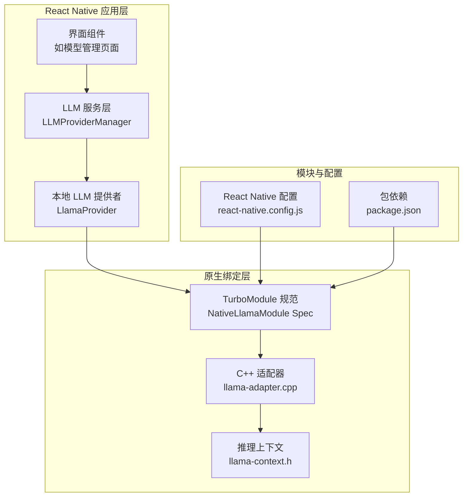
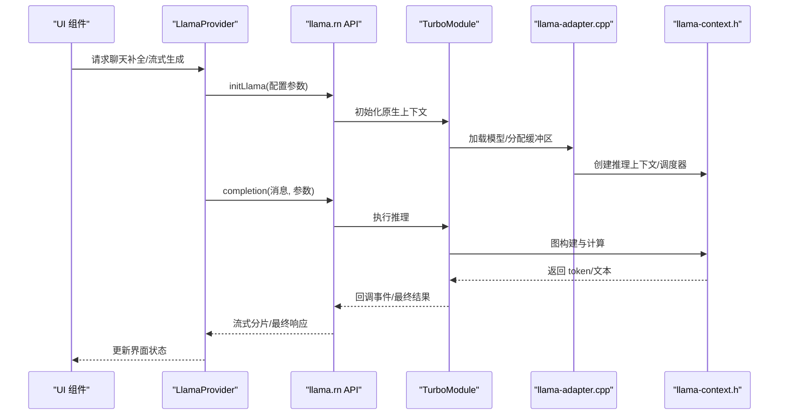
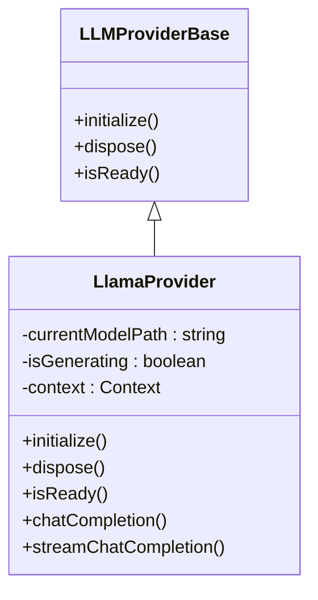
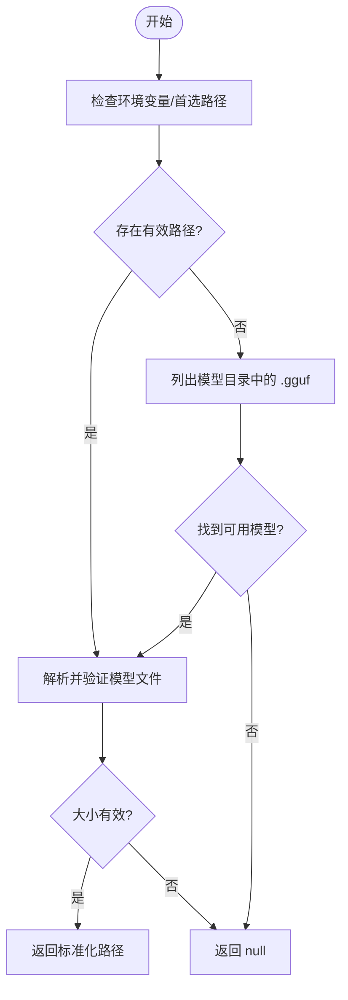
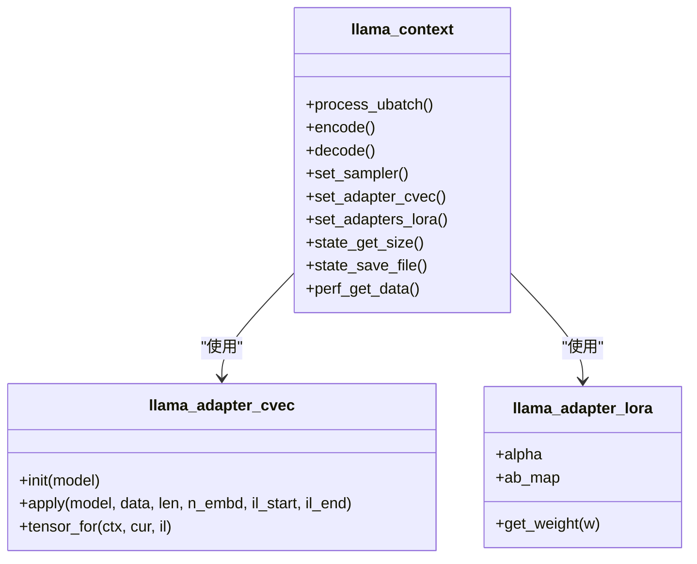
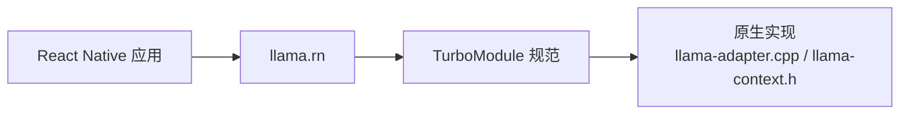
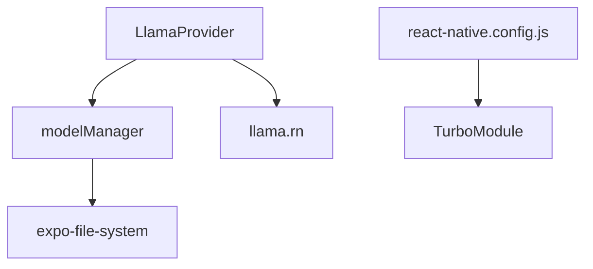

# Llama 本地 AI 推理模块

<cite>
**本文档引用的文件**
- [LlamaProvider.ts](file://services/llm/providers/local/LlamaProvider.ts)
- [modelManager.ts](file://services/llm/modelManager.ts)
- [llama-adapter.cpp](file://node_modules/llama.rn/cpp/llama-adapter.cpp)
- [llama-context.h](file://node_modules/llama.rn/cpp/llama-context.h)
- [package.json](file://package.json)
- [react-native.config.js](file://react-native.config.js)
- [models.tsx](file://app/settings/models.tsx)
</cite>

## 目录
1. [简介](#简介)
2. [项目结构](#项目结构)
3. [核心组件](#核心组件)
4. [架构总览](#架构总览)
5. [详细组件分析](#详细组件分析)
6. [依赖关系分析](#依赖关系分析)
7. [性能考虑](#性能考虑)
8. [故障排除指南](#故障排除指南)
9. [结论](#结论)
10. [附录](#附录)

## 简介
本文件为 Llama 本地 AI 推理模块的技术文档，聚焦于基于 llama.rn（llama.cpp 的 React Native 绑定）在移动端实现的本地大语言模型推理能力。文档涵盖以下主题：
- 架构设计：React Native Turbo Modules 与原生层的集成方式
- 本地推理工作流：从模型加载到推理执行的完整过程
- 初始化配置与参数设置：上下文大小、线程数、GPU 加速等
- 平台差异：Android 与 iOS 的原生实现差异与适配
- 性能优化策略：内存管理、计算图复用、批处理与线程池
- 数据交互与事件通信：JS 层与原生层之间的数据传递与回调机制
- 使用示例：模型调用、结果处理与错误恢复
- 最佳实践：内存监控与性能优化建议

## 项目结构
该模块位于服务层的 LLM 子系统中，通过 llama.rn 与原生 C++ 层进行交互，并由 React Native Turbo Modules 在 JS 层暴露接口。

**图表来源**
- [LlamaProvider.ts:1-316](file://services/llm/providers/local/LlamaProvider.ts#L1-L316)
- [llama-adapter.cpp:1-489](file://node_modules/llama.rn/cpp/llama-adapter.cpp#L1-L489)
- [llama-context.h:1-360](file://node_modules/llama.rn/cpp/llama-context.h#L1-L360)
- [react-native.config.js:1-31](file://react-native.config.js#L1-L31)
- [package.json:1-83](file://package.json#L1-L83)

**章节来源**
- [react-native.config.js:1-31](file://react-native.config.js#L1-L31)
- [package.json:1-83](file://package.json#L1-L83)

## 核心组件
- LlamaProvider：本地 LLM 提供者，负责模型初始化、聊天补全、流式生成与资源释放。
- 模型管理器：解析并定位本地 GGUF 模型路径，支持自定义路径与内置模型回退。
- 原生适配器与上下文：通过 llama-adapter.cpp 与 llama-context.h 提供模型加载、控制向量、LoRA 适配器、推理图构建与执行等能力。
- React Native 集成：通过 llama.rn 依赖在 JS 层暴露 initLlama、completion、stopCompletion 等方法。

**章节来源**
- [LlamaProvider.ts:95-316](file://services/llm/providers/local/LlamaProvider.ts#L95-L316)
- [modelManager.ts:116-196](file://services/llm/modelManager.ts#L116-L196)
- [llama-adapter.cpp:1-489](file://node_modules/llama.rn/cpp/llama-adapter.cpp#L1-L489)
- [llama-context.h:36-360](file://node_modules/llama.rn/cpp/llama-context.h#L36-L360)

## 架构总览
下图展示了从 JS 层到原生层的调用链路与数据流：

**图表来源**
- [LlamaProvider.ts:120-305](file://services/llm/providers/local/LlamaProvider.ts#L120-L305)
- [llama-adapter.cpp:149-433](file://node_modules/llama.rn/cpp/llama-adapter.cpp#L149-L433)
- [llama-context.h:119-249](file://node_modules/llama.rn/cpp/llama-context.h#L119-L249)

## 详细组件分析

### LlamaProvider 组件分析
- 职责：封装本地 LLM 的生命周期管理、参数配置、聊天补全与流式生成。
- 关键点：
  - 初始化：根据设置读取模型路径，调用 initLlama 并传入上下文大小、线程数、GPU 层数与批大小等参数。
  - 聊天补全：将消息转换为兼容格式后调用 completion，返回完整文本。
  - 流式生成：注册事件回调，按增量 token 推送 chunk，支持中止信号。
  - 资源管理：在 dispose 中释放上下文，确保生成中止时也能安全退出。

**图表来源**
- [LlamaProvider.ts:95-316](file://services/llm/providers/local/LlamaProvider.ts#L95-L316)

**章节来源**
- [LlamaProvider.ts:95-316](file://services/llm/providers/local/LlamaProvider.ts#L95-L316)

### 模型管理器分析
- 职责：解析本地 GGUF 模型路径，支持环境变量、固定文件名与用户自定义路径。
- 关键点：
  - 路径规范化与候选集生成，优先匹配绝对路径或带扩展名的相对路径。
  - 模型目录创建与枚举，过滤 .gguf 文件。
  - 导入模型 URI 到应用可写目录。

**图表来源**
- [modelManager.ts:88-186](file://services/llm/modelManager.ts#L88-L186)

**章节来源**
- [modelManager.ts:116-196](file://services/llm/modelManager.ts#L116-L196)

### 原生适配器与上下文分析
- llama-adapter.cpp：实现控制向量（control vector）与 LoRA 适配器的加载、校验与应用，负责张量分配与数据拷贝。
- llama-context.h：定义推理上下文类，提供图构建、调度器保留、采样器设置、输出缓冲访问、性能统计与状态保存/加载等接口。

**图表来源**
- [llama-adapter.cpp:14-134](file://node_modules/llama.rn/cpp/llama-adapter.cpp#L14-L134)
- [llama-adapter.cpp:138-489](file://node_modules/llama.rn/cpp/llama-adapter.cpp#L138-L489)
- [llama-context.h:36-360](file://node_modules/llama.rn/cpp/llama-context.h#L36-L360)

**章节来源**
- [llama-adapter.cpp:1-489](file://node_modules/llama.rn/cpp/llama-adapter.cpp#L1-L489)
- [llama-context.h:1-360](file://node_modules/llama.rn/cpp/llama-context.h#L1-L360)

### React Native 集成与 Turbo Modules
- 依赖：通过 package.json 引入 llama.rn，版本号为 ^0.11.4。
- 配置：react-native.config.js 将本地模块 moonshine-module 注册到 Android/iOS 平台，确保原生代码可被链接。
- 运行时行为：LlamaProvider 通过 llama.rn 的 initLlama、completion、stopCompletion 等 API 与原生层交互。

**图表来源**
- [package.json:48-48](file://package.json#L48-L48)
- [react-native.config.js:12-29](file://react-native.config.js#L12-L29)

**章节来源**
- [package.json:1-83](file://package.json#L1-L83)
- [react-native.config.js:1-31](file://react-native.config.js#L1-L31)

## 依赖关系分析
- 外部依赖：llama.rn 提供本地推理能力；expo-file-system 用于模型路径解析与文件操作。
- 内部依赖：LlamaProvider 依赖模型管理器 resolveLocalModelPath；React Native 配置确保 TurboModule 正常加载。

**图表来源**
- [LlamaProvider.ts:17-23](file://services/llm/providers/local/LlamaProvider.ts#L17-L23)
- [modelManager.ts:11-11](file://services/llm/modelManager.ts#L11-L11)
- [react-native.config.js:12-29](file://react-native.config.js#L12-L29)

**章节来源**
- [LlamaProvider.ts:17-23](file://services/llm/providers/local/LlamaProvider.ts#L17-L23)
- [modelManager.ts:11-11](file://services/llm/modelManager.ts#L11-L11)
- [react-native.config.js:12-29](file://react-native.config.js#L12-L29)

## 性能考虑
- 上下文与批处理：合理设置 n_ctx（上下文长度）、n_batch（物理批大小），避免过小导致重复计算，过大导致内存压力。
- 线程数：n_threads 与 n_threads_batch 需结合设备性能调整，注意主线程与后台线程的平衡。
- GPU 加速：n_gpu_layers 控制将多少层放置到 GPU，需权衡显存与算力提升。
- 计算图复用：llama-context 支持图重用与调度器保留，减少重复图构建开销。
- 内存监控：通过 perf_get_data 与 memory_breakdown 获取性能与内存占用，辅助诊断瓶颈。
- 流式输出：按增量推送 token，降低首字延迟并改善用户体验。

[本节为通用性能指导，不直接分析具体文件]

## 故障排除指南
- 模型不可用：检查 EXPO_PUBLIC_AI_LOCAL_MODEL_PATH 或本地模型目录是否存在有效 GGUF 文件。
- 初始化失败：确认模型路径已标准化，且 initLlama 参数（上下文、线程、GPU 层数、批大小）合理。
- 生成异常：捕获错误并区分是否为中止导致，必要时调用 stopCompletion 清理状态。
- 资源释放：在 dispose 中确保 release 被调用，避免内存泄漏。

**章节来源**
- [LlamaProvider.ts:120-182](file://services/llm/providers/local/LlamaProvider.ts#L120-L182)
- [modelManager.ts:116-157](file://services/llm/modelManager.ts#L116-L157)

## 结论
本模块通过 llama.rn 将 llama.cpp 的本地推理能力引入 React Native 应用，结合 Turbo Modules 实现高效的跨语言调用。通过合理的参数配置、内存管理与性能监控，可在移动设备上实现稳定、低延迟的本地 AI 推理体验。Android 与 iOS 的差异主要体现在原生打包与链接方式，但 JS 层接口保持一致，便于统一开发与维护。

[本节为总结性内容，不直接分析具体文件]

## 附录

### 使用示例与最佳实践
- 模型调用
  - 初始化：调用 LlamaProvider.initialize，内部解析模型路径并调用 initLlama。
  - 聊天补全：构造消息数组，调用 chatCompletion 获取完整响应。
  - 流式生成：注册回调，逐段接收增量 token，最后发送停止标记。
- 结果处理
  - 将 token 组装为字符串，或按需进行后处理（如截断、清洗）。
- 错误恢复
  - 捕获初始化与生成阶段的异常，必要时释放上下文并提示用户。
- 内存与性能
  - 定期检查 perf 数据与内存占用，动态调整上下文大小与批大小。
  - 合理设置 GPU 层数，避免显存不足导致的降级或崩溃。

**章节来源**
- [LlamaProvider.ts:184-305](file://services/llm/providers/local/LlamaProvider.ts#L184-L305)
- [models.tsx:55-96](file://app/settings/models.tsx#L55-L96)