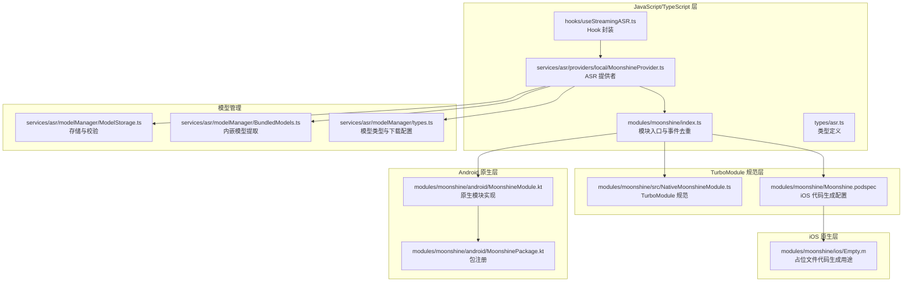
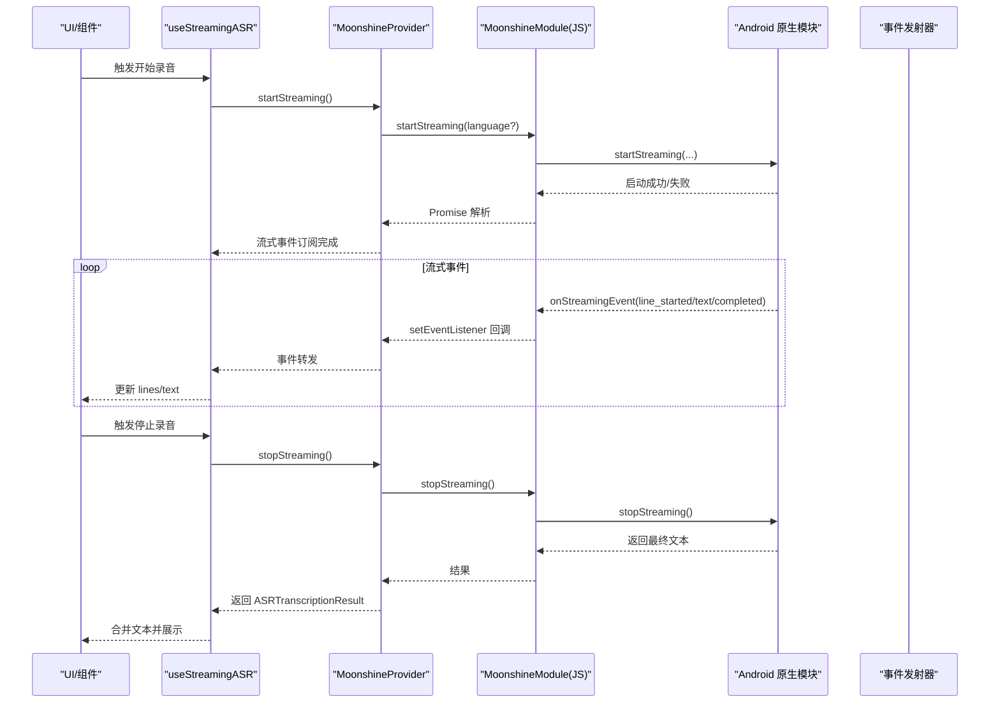
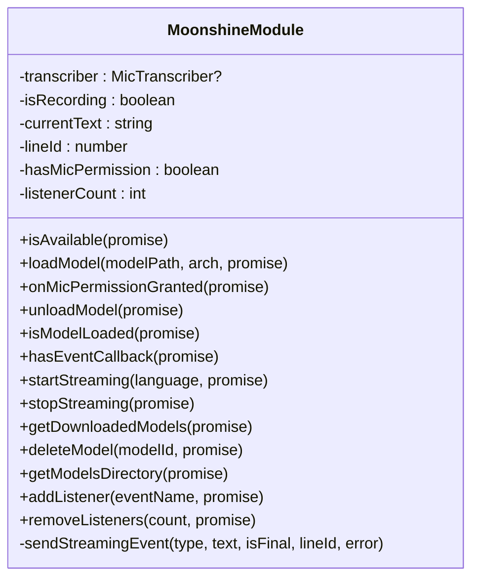
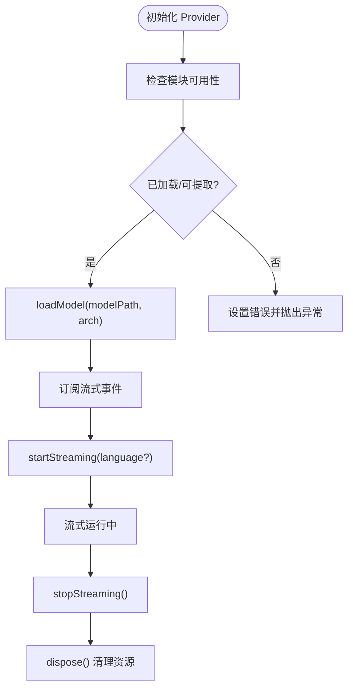
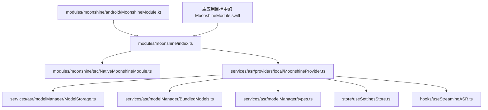

# Moonshine 本地 ASR 模块

<cite>
**本文档引用的文件**
- [modules/moonshine/src/NativeMoonshineModule.ts](file://modules/moonshine/src/NativeMoonshineModule.ts)
- [modules/moonshine/index.ts](file://modules/moonshine/index.ts)
- [modules/moonshine/android/MoonshineModule.kt](file://modules/moonshine/android/MoonshineModule.kt)
- [modules/moonshine/android/MoonshinePackage.kt](file://modules/moonshine/android/MoonshinePackage.kt)
- [modules/moonshine/Moonshine.podspec](file://modules/moonshine/Moonshine.podspec)
- [modules/moonshine/ios/Empty.m](file://modules/moonshine/ios/Empty.m)
- [services/asr/providers/local/MoonshineProvider.ts](file://services/asr/providers/local/MoonshineProvider.ts)
- [hooks/useStreamingASR.ts](file://hooks/useStreamingASR.ts)
- [types/asr.ts](file://types/asr.ts)
- [services/asr/modelManager/ModelStorage.ts](file://services/asr/modelManager/ModelStorage.ts)
- [services/asr/modelManager/BundledModels.ts](file://services/asr/modelManager/BundledModels.ts)
- [services/asr/modelManager/types.ts](file://services/asr/modelManager/types.ts)
- [store/useSettingsStore.ts](file://store/useSettingsStore.ts)
- [app/settings/models.tsx](file://app/settings/models.tsx)
</cite>

## 目录
1. [简介](#简介)
2. [项目结构](#项目结构)
3. [核心组件](#核心组件)
4. [架构总览](#架构总览)
5. [详细组件分析](#详细组件分析)
6. [依赖关系分析](#依赖关系分析)
7. [性能考虑](#性能考虑)
8. [故障排除指南](#故障排除指南)
9. [结论](#结论)
10. [附录](#附录)

## 简介
本文件为 Moonshine 本地语音转录（ASR）模块的技术文档，聚焦于 Moonshine Turbo Module 的架构与实现，涵盖以下要点：
- ONNX Runtime 集成与流式语音识别机制
- Android 与 iOS 平台原生实现差异（Kotlin 与 Swift）
- 模块接口设计与事件回调系统（含去重机制）
- 模型管理（下载、卸载、目录管理）
- 完整集成示例与错误处理策略
- 性能优化建议与调试技巧

## 项目结构
Moonshine 模块采用 React Native TurboModule 架构，通过 TypeScript 规范定义接口，分别在 Android（Kotlin）与 iOS（Swift，位于主应用目标中）实现原生逻辑，并由 JS 层统一调度。

**图表来源**
- [modules/moonshine/src/NativeMoonshineModule.ts:1-34](file://modules/moonshine/src/NativeMoonshineModule.ts#L1-L34)
- [modules/moonshine/index.ts:1-94](file://modules/moonshine/index.ts#L1-L94)
- [modules/moonshine/android/MoonshineModule.kt:1-322](file://modules/moonshine/android/MoonshineModule.kt#L1-L322)
- [modules/moonshine/android/MoonshinePackage.kt:1-22](file://modules/moonshine/android/MoonshinePackage.kt#L1-L22)
- [modules/moonshine/Moonshine.podspec:1-32](file://modules/moonshine/Moonshine.podspec#L1-L32)
- [modules/moonshine/ios/Empty.m:1-13](file://modules/moonshine/ios/Empty.m#L1-L13)
- [services/asr/providers/local/MoonshineProvider.ts:1-307](file://services/asr/providers/local/MoonshineProvider.ts#L1-L307)
- [services/asr/modelManager/ModelStorage.ts:1-186](file://services/asr/modelManager/ModelStorage.ts#L1-L186)
- [services/asr/modelManager/BundledModels.ts:1-258](file://services/asr/modelManager/BundledModels.ts#L1-L258)
- [services/asr/modelManager/types.ts:1-129](file://services/asr/modelManager/types.ts#L1-L129)

**章节来源**
- [modules/moonshine/src/NativeMoonshineModule.ts:1-34](file://modules/moonshine/src/NativeMoonshineModule.ts#L1-L34)
- [modules/moonshine/index.ts:1-94](file://modules/moonshine/index.ts#L1-L94)
- [modules/moonshine/android/MoonshineModule.kt:1-322](file://modules/moonshine/android/MoonshineModule.kt#L1-L322)
- [modules/moonshine/android/MoonshinePackage.kt:1-22](file://modules/moonshine/android/MoonshinePackage.kt#L1-L22)
- [modules/moonshine/Moonshine.podspec:1-32](file://modules/moonshine/Moonshine.podspec#L1-L32)
- [modules/moonshine/ios/Empty.m:1-13](file://modules/moonshine/ios/Empty.m#L1-L13)
- [services/asr/providers/local/MoonshineProvider.ts:1-307](file://services/asr/providers/local/MoonshineProvider.ts#L1-L307)
- [services/asr/modelManager/ModelStorage.ts:1-186](file://services/asr/modelManager/ModelStorage.ts#L1-L186)
- [services/asr/modelManager/BundledModels.ts:1-258](file://services/asr/modelManager/BundledModels.ts#L1-L258)
- [services/asr/modelManager/types.ts:1-129](file://services/asr/modelManager/types.ts#L1-L129)

## 核心组件
- TurboModule 规范：定义了 isAvailable、loadModel、unloadModel、isModelLoaded、startStreaming、stopStreaming、getDownloadedModels、deleteModel、getModelsDirectory、onMicPermissionGranted、addListener、removeListeners 等方法及 onStreamingEvent 事件。
- JS 模块封装：自动选择 TurboModule 或旧版 NativeModules，并通过 NativeEventEmitter 与 DeviceEventEmitter 双通道订阅事件，内置 50ms 去重机制。
- Android 原生模块：对接 MicTranscriber，负责加载/卸载模型、启动/停止流式识别、事件分发、权限通知等。
- iOS 实现：通过 Moonshine.podspec 指向主应用目标中的 Swift 实现（MoonshineModule.swift），以访问 MoonshineVoice SDK。
- ASR 提供者：MoonshineProvider 将模块能力封装为可复用的 StreamingProvider，负责初始化、模型加载、事件转发与错误处理。
- Hook：useStreamingASR 提供 React 组件友好的状态管理与事件处理。
- 模型管理：ModelStorage 负责模型目录、文件校验、删除；BundledModels 支持内嵌模型提取；types.ts 定义下载与显示信息。

**章节来源**
- [modules/moonshine/src/NativeMoonshineModule.ts:9-31](file://modules/moonshine/src/NativeMoonshineModule.ts#L9-L31)
- [modules/moonshine/index.ts:17-84](file://modules/moonshine/index.ts#L17-L84)
- [modules/moonshine/android/MoonshineModule.kt:20-322](file://modules/moonshine/android/MoonshineModule.kt#L20-L322)
- [modules/moonshine/Moonshine.podspec:15-23](file://modules/moonshine/Moonshine.podspec#L15-L23)
- [services/asr/providers/local/MoonshineProvider.ts:42-291](file://services/asr/providers/local/MoonshineProvider.ts#L42-L291)
- [hooks/useStreamingASR.ts:67-269](file://hooks/useStreamingASR.ts#L67-L269)
- [services/asr/modelManager/ModelStorage.ts:29-186](file://services/asr/modelManager/ModelStorage.ts#L29-L186)
- [services/asr/modelManager/BundledModels.ts:58-201](file://services/asr/modelManager/BundledModels.ts#L58-L201)
- [services/asr/modelManager/types.ts:75-129](file://services/asr/modelManager/types.ts#L75-L129)

## 架构总览
下图展示了从 UI 到原生模块的端到端调用链路与事件回传路径：

**图表来源**
- [hooks/useStreamingASR.ts:190-241](file://hooks/useStreamingASR.ts#L190-L241)
- [services/asr/providers/local/MoonshineProvider.ts:192-259](file://services/asr/providers/local/MoonshineProvider.ts#L192-L259)
- [modules/moonshine/index.ts:52-84](file://modules/moonshine/index.ts#L52-L84)
- [modules/moonshine/android/MoonshineModule.kt:175-230](file://modules/moonshine/android/MoonshineModule.kt#L175-L230)

## 详细组件分析

### 接口与事件系统
- 接口方法
  - isAvailable(): Promise<boolean> —— 检查模块可用性
  - hasEventCallback(): Promise<boolean> —— 新架构下监听回调状态
  - loadModel(modelPath: string, arch: string): Promise<void> —— 加载模型（支持 tiny/baseStreaming 等映射）
  - unloadModel(): Promise<void> —— 卸载当前模型
  - isModelLoaded(): Promise<boolean> —— 是否已加载模型
  - startStreaming(language?: string | null): Promise<void> —— 开始流式识别（需先授权麦克风权限）
  - stopStreaming(): Promise<{ text: string }> —— 停止并返回最终文本
  - getDownloadedModels(): Promise<readonly string[]> —— 获取已下载模型列表
  - deleteModel(modelId: string): Promise<void> —— 删除指定模型
  - getModelsDirectory(): Promise<string> —— 返回模型目录绝对路径
  - onMicPermissionGranted(): Promise<void> —— 通知模块麦克风权限已授予（Android）
  - addListener(eventName: string): Promise<void> —— 新架构事件监听注册
  - removeListeners(count: number): Promise<void> —— 新架构事件监听移除

- 事件类型
  - line_started：新行开始（初始文本通常为占位符）
  - line_text_changed：行内文本更新
  - line_completed：行完成（isFinal=true）

- 事件去重机制
  - 使用键拼接（type|lineId|text|isFinal）与时间阈值（50ms）进行去重，同时兼容 NativeEventEmitter 与 DeviceEventEmitter 两条通道。

**章节来源**
- [modules/moonshine/src/NativeMoonshineModule.ts:16-31](file://modules/moonshine/src/NativeMoonshineModule.ts#L16-L31)
- [modules/moonshine/index.ts:9-14](file://modules/moonshine/index.ts#L9-L14)
- [modules/moonshine/index.ts:52-84](file://modules/moonshine/index.ts#L52-L84)

### Android 原生实现（Kotlin）
- 关键点
  - MicTranscriber 负责实际的流式识别与事件回调
  - loadModel 支持从文件系统加载模型，内部根据 arch 映射到具体 streaming 变体
  - startStreaming 前必须确保已授予麦克风权限（onMicPermissionGranted）
  - 通过 DeviceEventManagerModule 发送 onStreamingEvent 事件
  - addListener/removeListeners 用于新架构事件计数，便于调试

**图表来源**
- [modules/moonshine/android/MoonshineModule.kt:20-322](file://modules/moonshine/android/MoonshineModule.kt#L20-L322)

**章节来源**
- [modules/moonshine/android/MoonshineModule.kt:36-129](file://modules/moonshine/android/MoonshineModule.kt#L36-L129)
- [modules/moonshine/android/MoonshineModule.kt:135-140](file://modules/moonshine/android/MoonshineModule.kt#L135-L140)
- [modules/moonshine/android/MoonshineModule.kt:146-162](file://modules/moonshine/android/MoonshineModule.kt#L146-L162)
- [modules/moonshine/android/MoonshineModule.kt:167-170](file://modules/moonshine/android/MoonshineModule.kt#L167-L170)
- [modules/moonshine/android/MoonshineModule.kt:175-230](file://modules/moonshine/android/MoonshineModule.kt#L175-L230)
- [modules/moonshine/android/MoonshineModule.kt:235-276](file://modules/moonshine/android/MoonshineModule.kt#L235-L276)
- [modules/moonshine/android/MoonshineModule.kt:284-300](file://modules/moonshine/android/MoonshineModule.kt#L284-L300)
- [modules/moonshine/android/MoonshineModule.kt:304-320](file://modules/moonshine/android/MoonshineModule.kt#L304-L320)

### iOS 原生实现（Swift）
- 关键点
  - iOS 实现位于主应用目标中，通过 Swift Package Manager 引入 MoonshineVoice SDK
  - Moonshine.podspec 仅用于代码生成与自动链接，不包含实际源码
  - 代码生成配置指向主应用目标的 MoonshineModule.swift

**图表来源**
- [modules/moonshine/Moonshine.podspec:15-23](file://modules/moonshine/Moonshine.podspec#L15-L23)
- [modules/moonshine/ios/Empty.m:1-13](file://modules/moonshine/ios/Empty.m#L1-L13)

**章节来源**
- [modules/moonshine/Moonshine.podspec:15-23](file://modules/moonshine/Moonshine.podspec#L15-L23)
- [modules/moonshine/ios/Empty.m:1-13](file://modules/moonshine/ios/Empty.m#L1-L13)

### ASR 提供者（MoonshineProvider）
- 能力与语言支持：支持流式实时识别，支持多语言（zh/en/ja/ko/ar/es/vi/uk），本地模型无需网络
- 初始化流程：检查模块可用性 → 检查默认模型是否已加载或可提取 → 加载模型
- 事件处理：订阅 setEventListener，转发至所有回调；错误事件会设置 Provider 错误状态
- 生命周期：dispose 时停止流式、卸载模型、清理订阅与回调集合

**图表来源**
- [services/asr/providers/local/MoonshineProvider.ts:63-135](file://services/asr/providers/local/MoonshineProvider.ts#L63-L135)
- [services/asr/providers/local/MoonshineProvider.ts:192-259](file://services/asr/providers/local/MoonshineProvider.ts#L192-L259)

**章节来源**
- [services/asr/providers/local/MoonshineProvider.ts:42-52](file://services/asr/providers/local/MoonshineProvider.ts#L42-L52)
- [services/asr/providers/local/MoonshineProvider.ts:88-135](file://services/asr/providers/local/MoonshineProvider.ts#L88-L135)
- [services/asr/providers/local/MoonshineProvider.ts:140-164](file://services/asr/providers/local/MoonshineProvider.ts#L140-L164)
- [services/asr/providers/local/MoonshineProvider.ts:192-259](file://services/asr/providers/local/MoonshineProvider.ts#L192-L259)

### Hook（useStreamingASR）
- 负责 Provider 订阅、事件处理、状态维护（lines/text/isStreaming/isReady/error）
- 事件处理逻辑：line_started 新增行；line_text_changed 更新当前行；line_completed 标记完成并可移除空行
- 停止流式时合并历史 lines 与最终结果文本

**章节来源**
- [hooks/useStreamingASR.ts:67-185](file://hooks/useStreamingASR.ts#L67-L185)
- [hooks/useStreamingASR.ts:190-241](file://hooks/useStreamingASR.ts#L190-L241)
- [hooks/useStreamingASR.ts:246-269](file://hooks/useStreamingASR.ts#L246-L269)

### 模型管理
- 存储与校验
  - 模型目录：文档目录下的 moonshine-models
  - 必需文件：encoder_model.ort、decoder_model_merged.ort、tokenizer.bin
  - 目录读取、大小统计、删除模型
- 内嵌模型
  - 支持将预置模型从应用资源复制到文档目录，首次启动自动提取
  - 使用 AsyncStorage 记录提取尝试状态，避免重复提取
- 下载与显示
  - 默认下载地址与模型 ID 规则
  - 屏幕中展示模型名称、大小、进度与状态

**章节来源**
- [services/asr/modelManager/ModelStorage.ts:29-186](file://services/asr/modelManager/ModelStorage.ts#L29-L186)
- [services/asr/modelManager/BundledModels.ts:58-201](file://services/asr/modelManager/BundledModels.ts#L58-L201)
- [services/asr/modelManager/types.ts:75-129](file://services/asr/modelManager/types.ts#L75-L129)
- [app/settings/models.tsx:35-289](file://app/settings/models.tsx#L35-L289)

## 依赖关系分析
- JS 层依赖
  - TurboModule 规范（NativeMoonshineModule.ts）
  - React Native 事件系统（NativeEventEmitter、DeviceEventEmitter）
  - 设置存储（useSettingsStore.ts）决定默认语言与模型架构
- 原生层依赖
  - Android：MicTranscriber（来自 MoonshineVoice 库）、React Native Bridge、DeviceEventManagerModule
  - iOS：主应用目标中的 Swift 实现与 MoonshineVoice SDK
- 模型管理依赖
  - Expo FileSystem 与 AsyncStorage
  - 资源打包与 Asset 系统（用于内嵌模型提取）

**图表来源**
- [modules/moonshine/index.ts:17-40](file://modules/moonshine/index.ts#L17-L40)
- [services/asr/providers/local/MoonshineProvider.ts:19-30](file://services/asr/providers/local/MoonshineProvider.ts#L19-L30)
- [store/useSettingsStore.ts:73-88](file://store/useSettingsStore.ts#L73-L88)

**章节来源**
- [modules/moonshine/index.ts:17-40](file://modules/moonshine/index.ts#L17-L40)
- [services/asr/providers/local/MoonshineProvider.ts:19-30](file://services/asr/providers/local/MoonshineProvider.ts#L19-L30)
- [store/useSettingsStore.ts:73-88](file://store/useSettingsStore.ts#L73-L88)

## 性能考虑
- 事件去重：JS 层 50ms 去重窗口减少 UI 抖动与重渲染开销
- 模型加载：优先使用已下载或内嵌模型，避免重复下载与解压
- 存储优化：按需读取模型目录与文件大小，避免全量扫描
- 生命周期：Provider dispose 时及时停止流式与清理订阅，防止内存泄漏
- iOS 集成：通过 Swift Package Manager 引入 SDK，确保版本一致性与二进制优化

[本节为通用指导，无需特定文件引用]

## 故障排除指南
- 模块不可用
  - 检查 isAvailable 与平台支持（iOS 需确认主应用目标实现）
  - 确认代码生成与 autolinking 正常
- 无麦克风权限（Android）
  - 在 startStreaming 前调用 onMicPermissionGranted
  - startStreaming 会拒绝“未授权”错误
- 模型加载失败
  - 确认模型目录存在且包含必需文件
  - 检查 arch 参数映射（small→tiny）
- 事件未到达
  - 确保已通过 setEventListener 订阅
  - 检查 addListener/removeListeners 计数（hasEventCallback）
- 停止后无文本
  - stopStreaming 返回最终文本；若为空，检查设备事件通道与去重逻辑

**章节来源**
- [modules/moonshine/android/MoonshineModule.kt:175-204](file://modules/moonshine/android/MoonshineModule.kt#L175-L204)
- [modules/moonshine/android/MoonshineModule.kt:284-300](file://modules/moonshine/android/MoonshineModule.kt#L284-L300)
- [modules/moonshine/index.ts:52-84](file://modules/moonshine/index.ts#L52-L84)
- [services/asr/providers/local/MoonshineProvider.ts:192-259](file://services/asr/providers/local/MoonshineProvider.ts#L192-L259)

## 结论
Moonshine 本地 ASR 模块通过清晰的分层设计实现了跨平台的流式语音识别：JS/TurboModule 层提供统一接口与事件去重，Android 侧通过 MicTranscriber 执行识别，iOS 侧通过主应用目标与 Swift SDK 集成。配合完善的模型管理与 Hook 封装，开发者可以快速集成本地语音转录能力，并具备良好的性能与可维护性。

[本节为总结，无需特定文件引用]

## 附录

### 接口与返回值速查
- isAvailable(): Promise<boolean> —— 模块可用性
- hasEventCallback(): Promise<boolean> —— 新架构事件回调状态
- loadModel(modelPath: string, arch: string): Promise<void> —— 加载模型（arch 支持 tiny/baseStreaming 等映射）
- unloadModel(): Promise<void> —— 卸载当前模型
- isModelLoaded(): Promise<boolean> —— 是否已加载
- startStreaming(language?: string | null): Promise<void> —— 开始流式识别（需麦克风权限）
- stopStreaming(): Promise<{ text: string }> —— 停止并返回最终文本
- getDownloadedModels(): Promise<readonly string[]> —— 已下载模型名数组
- deleteModel(modelId: string): Promise<void> —— 删除模型
- getModelsDirectory(): Promise<string> —— 模型目录绝对路径
- onMicPermissionGranted(): Promise<void> —— Android 专用，通知权限已授予
- addListener/removeListeners：新架构事件监听注册与移除

**章节来源**
- [modules/moonshine/src/NativeMoonshineModule.ts:16-31](file://modules/moonshine/src/NativeMoonshineModule.ts#L16-L31)
- [modules/moonshine/android/MoonshineModule.kt:36-129](file://modules/moonshine/android/MoonshineModule.kt#L36-L129)
- [modules/moonshine/android/MoonshineModule.kt:175-230](file://modules/moonshine/android/MoonshineModule.kt#L175-L230)
- [modules/moonshine/android/MoonshineModule.kt:235-276](file://modules/moonshine/android/MoonshineModule.kt#L235-L276)
- [modules/moonshine/android/MoonshineModule.kt:284-300](file://modules/moonshine/android/MoonshineModule.kt#L284-L300)

### 集成步骤示例（概要）
- 安装与链接
  - 确保已安装并正确配置 React Native 0.71+ 与 TurboModule 支持
  - iOS：通过 Swift Package Manager 添加 MoonshineVoice SDK（版本要求见 podspec 注释）
- 权限与初始化
  - Android：先申请并授予麦克风权限，再调用 onMicPermissionGranted
  - 初始化 Provider：调用 initialize 自动加载默认模型或提取内嵌模型
- 开始/停止流式
  - startStreaming(language?) → 订阅 setEventListener → stopStreaming() 获取最终文本
- 模型管理
  - 通过 ModelStorage 与 BundledModels 管理模型下载、提取与删除

**章节来源**
- [services/asr/providers/local/MoonshineProvider.ts:88-135](file://services/asr/providers/local/MoonshineProvider.ts#L88-L135)
- [services/asr/providers/local/MoonshineProvider.ts:192-259](file://services/asr/providers/local/MoonshineProvider.ts#L192-L259)
- [services/asr/modelManager/ModelStorage.ts:29-84](file://services/asr/modelManager/ModelStorage.ts#L29-L84)
- [services/asr/modelManager/BundledModels.ts:96-201](file://services/asr/modelManager/BundledModels.ts#L96-L201)
- [modules/moonshine/Moonshine.podspec:21-23](file://modules/moonshine/Moonshine.podspec#L21-L23)