# Turbo Modules 开发指南

<cite>
**本文档引用的文件**
- [package.json](file://package.json)
- [modules/moonshine/package.json](file://modules/moonshine/package.json)
- [modules/moonshine/index.ts](file://modules/moonshine/index.ts)
- [modules/moonshine/src/NativeMoonshineModule.ts](file://modules/moonshine/src/NativeMoonshineModule.ts)
- [modules/moonshine/android/MoonshinePackage.kt](file://modules/moonshine/android/MoonshinePackage.kt)
- [modules/moonshine/android/MoonshineModule.kt](file://modules/moonshine/android/MoonshineModule.kt)
- [modules/moonshine/Moonshine.podspec](file://modules/moonshine/Moonshine.podspec)
- [types/asr.ts](file://types/asr.ts)
- [hooks/useStreamingASR.ts](file://hooks/useStreamingASR.ts)
- [services/asr/providers/local/MoonshineProvider.ts](file://services/asr/providers/local/MoonshineProvider.ts)
- [services/asr/providers/base/ASRProviderBase.ts](file://services/asr/providers/base/ASRProviderBase.ts)
- [services/asr/asrService.ts](file://services/asr/asrService.ts)
</cite>

## 目录
1. [简介](#简介)
2. [项目结构](#项目结构)
3. [核心组件](#核心组件)
4. [架构概览](#架构概览)
5. [详细组件分析](#详细组件分析)
6. [依赖关系分析](#依赖关系分析)
7. [性能考虑](#性能考虑)
8. [故障排除指南](#故障排除指南)
9. [结论](#结论)
10. [附录](#附录)

## 简介

本指南面向 React Native 开发者，提供 Turbo Modules 的完整开发文档。Turbo Modules 是 React Native 新架构的核心组件，相比传统 Legacy Modules 具有以下优势：

- **性能提升**：直接内存共享，避免序列化开销
- **类型安全**：通过代码生成提供完整的 TypeScript 支持
- **更好的错误处理**：统一的异常处理机制
- **事件系统**：原生事件的可靠传递

本项目以 Moonshine 语音识别模块为例，展示了从接口定义到原生实现的完整开发流程。

## 项目结构

该项目采用模块化架构，主要包含以下关键目录：

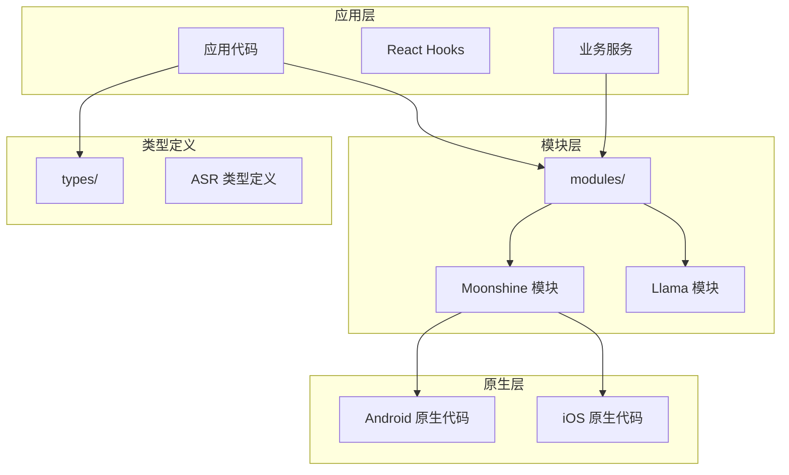

**图表来源**
- [package.json:1-83](file://package.json#L1-L83)
- [modules/moonshine/package.json:1-22](file://modules/moonshine/package.json#L1-L22)

**章节来源**
- [package.json:1-83](file://package.json#L1-L83)
- [modules/moonshine/package.json:1-22](file://modules/moonshine/package.json#L1-L22)

## 核心组件

### Turbo Modules 架构对比

| 特性 | Legacy Modules | Turbo Modules |
|------|----------------|---------------|
| **通信方式** | 仅支持回调函数 | 支持 Promise 和事件 |
| **类型安全** | 运行时检查 | 编译时类型检查 |
| **性能** | 序列化开销 | 直接内存访问 |
| **事件系统** | 有限支持 | 完整的 EventEmitter |
| **错误处理** | 异常捕获困难 | 统一的 Promise 错误 |

### Moonshine 模块架构

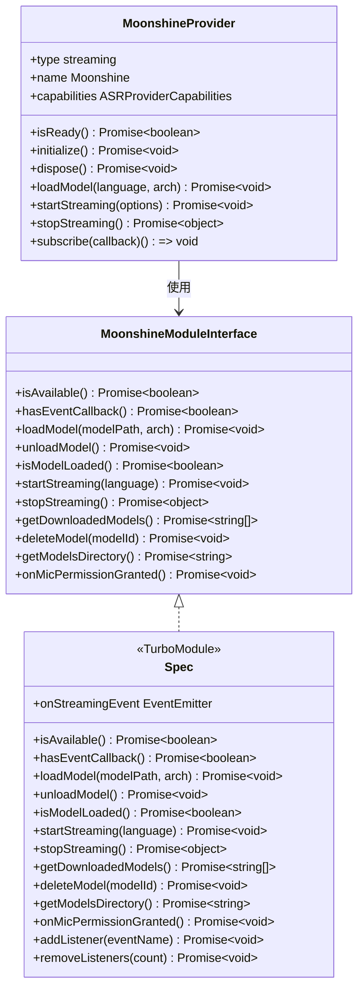

**图表来源**
- [modules/moonshine/index.ts:17-29](file://modules/moonshine/index.ts#L17-L29)
- [modules/moonshine/src/NativeMoonshineModule.ts:16-31](file://modules/moonshine/src/NativeMoonshineModule.ts#L16-L31)
- [services/asr/providers/local/MoonshineProvider.ts:42-52](file://services/asr/providers/local/MoonshineProvider.ts#L42-L52)

**章节来源**
- [modules/moonshine/index.ts:17-29](file://modules/moonshine/index.ts#L17-L29)
- [modules/moonshine/src/NativeMoonshineModule.ts:16-31](file://modules/moonshine/src/NativeMoonshineModule.ts#L16-L31)
- [services/asr/providers/local/MoonshineProvider.ts:42-52](file://services/asr/providers/local/MoonshineProvider.ts#L42-L52)

## 架构概览

### 整体架构流程

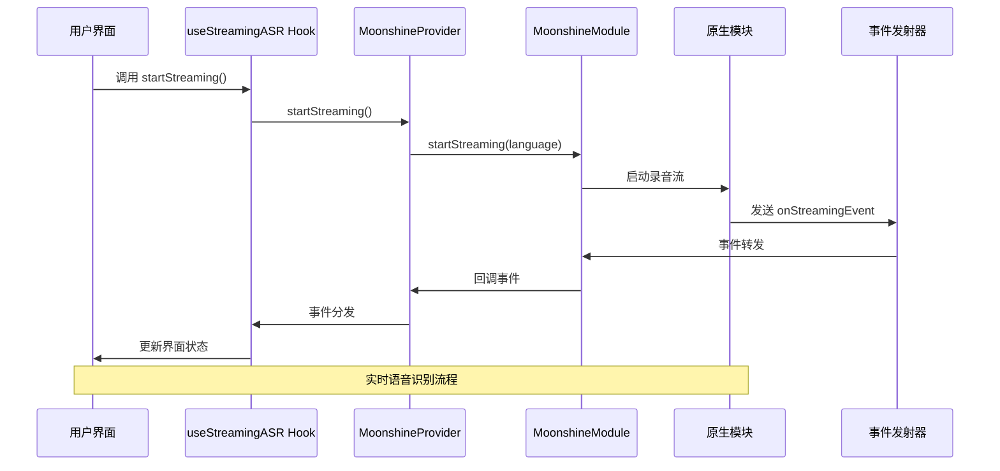

**图表来源**
- [hooks/useStreamingASR.ts:190-216](file://hooks/useStreamingASR.ts#L190-L216)
- [services/asr/providers/local/MoonshineProvider.ts:192-227](file://services/asr/providers/local/MoonshineProvider.ts#L192-L227)
- [modules/moonshine/android/MoonshineModule.kt:304-320](file://modules/moonshine/android/MoonshineModule.kt#L304-L320)

### 事件系统架构

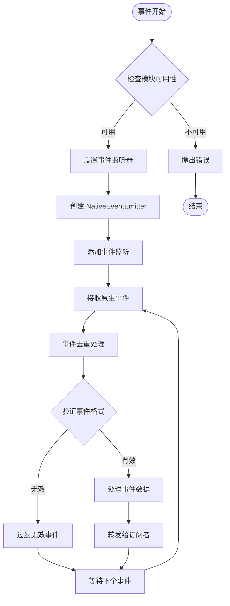

**图表来源**
- [modules/moonshine/index.ts:52-84](file://modules/moonshine/index.ts#L52-L84)
- [modules/moonshine/src/NativeMoonshineModule.ts:9-14](file://modules/moonshine/src/NativeMoonshineModule.ts#L9-L14)

**章节来源**
- [hooks/useStreamingASR.ts:102-113](file://hooks/useStreamingASR.ts#L102-L113)
- [modules/moonshine/index.ts:52-84](file://modules/moonshine/index.ts#L52-L84)

## 详细组件分析

### TypeScript 接口定义与代码生成

#### 接口定义规范

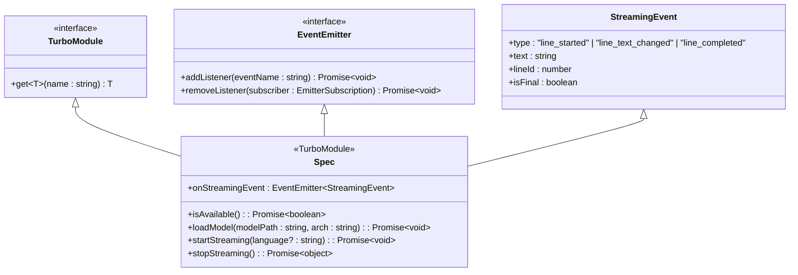

**图表来源**
- [modules/moonshine/src/NativeMoonshineModule.ts:5-31](file://modules/moonshine/src/NativeMoonshineModule.ts#L5-L31)

#### 代码生成配置

模块的代码生成配置位于包配置文件中：

| 配置项 | 值 | 说明 |
|--------|----|-----|
| `name` | RNMoonshineSpec | 代码生成后的模块名称 |
| `type` | modules | 模块类型 |
| `jsSrcsDir` | src | TypeScript 源码目录 |
| `ios.modulesProvider` | MoonshineModule | iOS 模块提供者映射 |

**章节来源**
- [modules/moonshine/src/NativeMoonshineModule.ts:16-31](file://modules/moonshine/src/NativeMoonshineModule.ts#L16-L31)
- [modules/moonshine/package.json:8-17](file://modules/moonshine/package.json#L8-L17)

### 原生模块注册机制

#### Android 注册流程

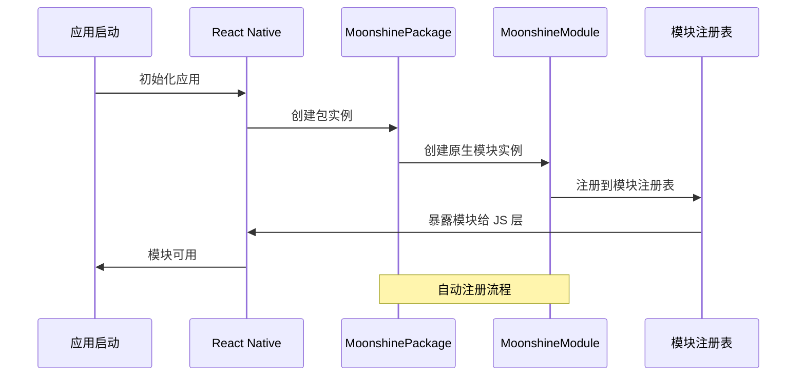

**图表来源**
- [modules/moonshine/android/MoonshinePackage.kt:13-21](file://modules/moonshine/android/MoonshinePackage.kt#L13-L21)
- [modules/moonshine/android/MoonshineModule.kt:31](file://modules/moonshine/android/MoonshineModule.kt#L31)

#### iOS 注册机制

iOS 平台通过 CocoaPods 配置实现模块注册：

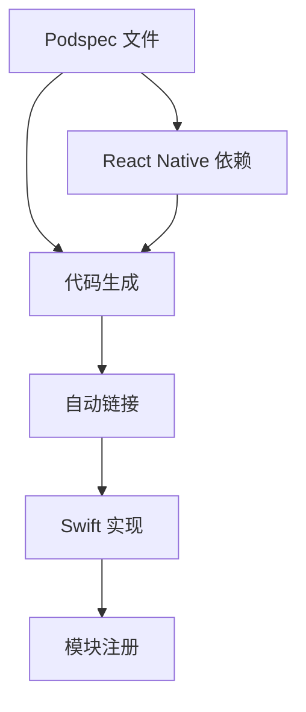

**图表来源**
- [modules/moonshine/Moonshine.podspec:5-31](file://modules/moonshine/Moonshine.podspec#L5-L31)

**章节来源**
- [modules/moonshine/android/MoonshinePackage.kt:13-21](file://modules/moonshine/android/MoonshinePackage.kt#L13-L21)
- [modules/moonshine/Moonshine.podspec:5-31](file://modules/moonshine/Moonshine.podspec#L5-L31)

### JavaScript 与原生代码桥接

#### 参数传递与返回值处理

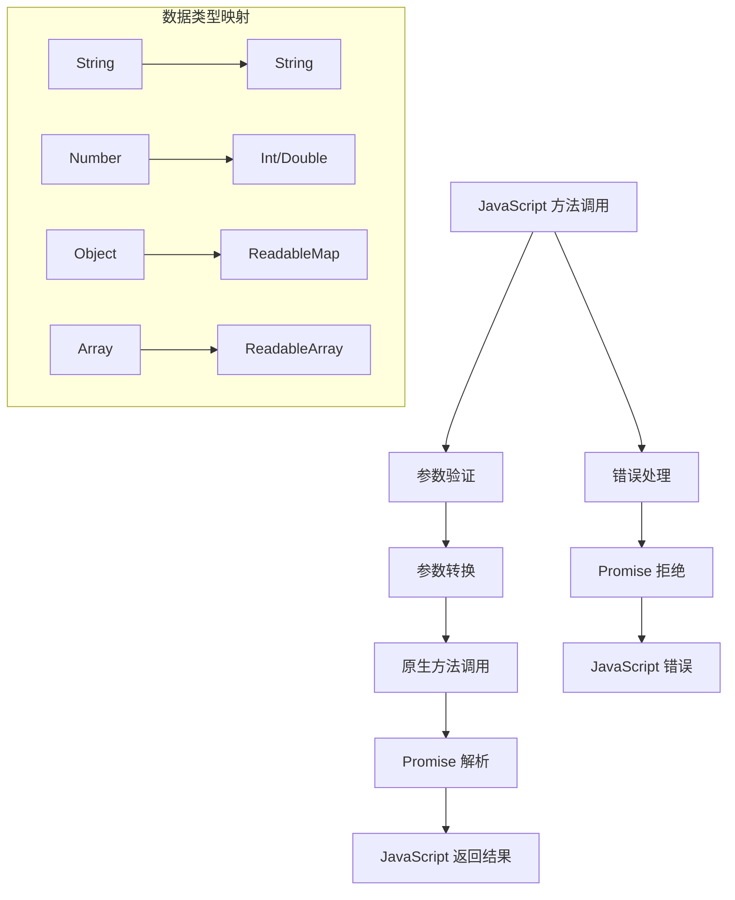

**图表来源**
- [modules/moonshine/android/MoonshineModule.kt:46-129](file://modules/moonshine/android/MoonshineModule.kt#L46-L129)
- [modules/moonshine/src/NativeMoonshineModule.ts:18-28](file://modules/moonshine/src/NativeMoonshineModule.ts#L18-L28)

#### 异步调用模式

异步操作采用 Promise 模式，确保非阻塞执行：

**章节来源**
- [modules/moonshine/android/MoonshineModule.kt:46-129](file://modules/moonshine/android/MoonshineModule.kt#L46-L129)
- [modules/moonshine/src/NativeMoonshineModule.ts:18-28](file://modules/moonshine/src/NativeMoonshineModule.ts#L18-L28)

### 事件系统实现

#### 事件订阅与取消订阅

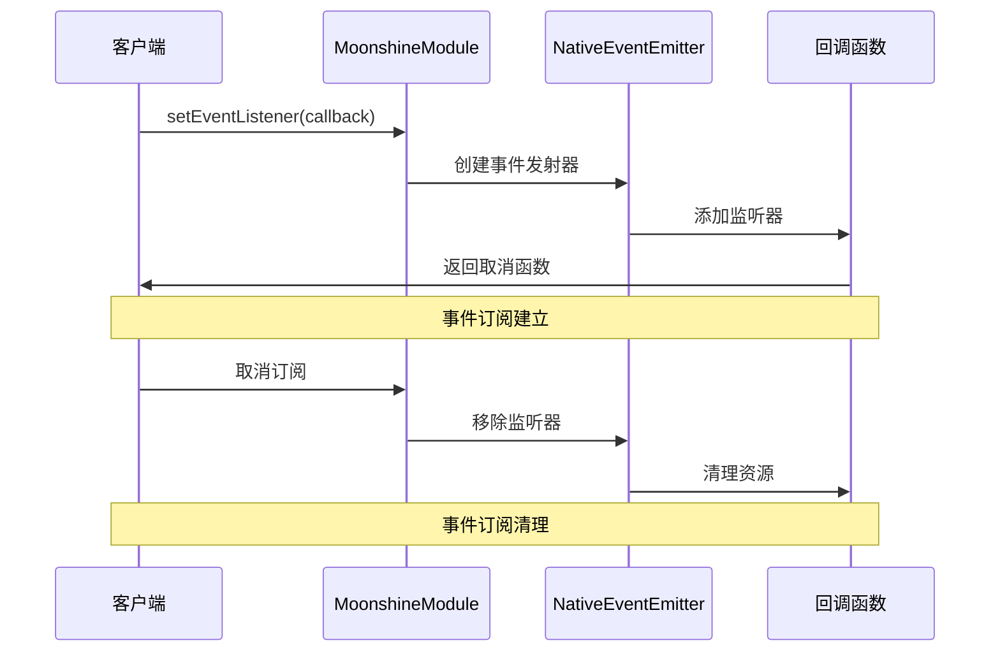

**图表来源**
- [modules/moonshine/index.ts:52-84](file://modules/moonshine/index.ts#L52-L84)

#### 事件去重机制

事件去重通过时间戳和事件键进行过滤：

| 去重条件 | 实现方式 | 阈值 |
|----------|----------|------|
| 时间间隔 | 记录上次事件时间 | 50ms |
| 事件内容 | 事件类型 + 文本 + 是否最终 | 唯一键 |
| 行标识符 | 行 ID + 文本内容 | 区分不同行 |

**章节来源**
- [modules/moonshine/index.ts:52-84](file://modules/moonshine/index.ts#L52-L84)

### 生命周期管理

#### Provider 生命周期

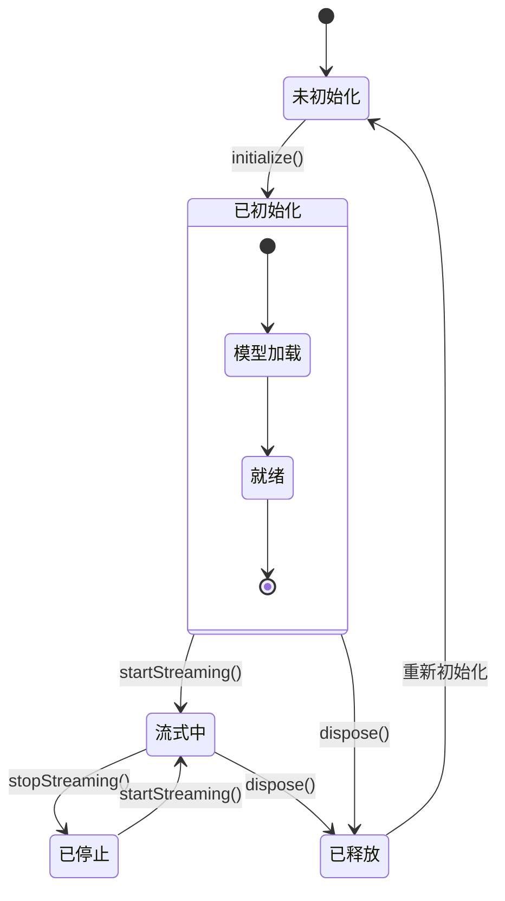

**图表来源**
- [services/asr/providers/local/MoonshineProvider.ts:88-135](file://services/asr/providers/local/MoonshineProvider.ts#L88-L135)
- [services/asr/providers/local/MoonshineProvider.ts:140-164](file://services/asr/providers/local/MoonshineProvider.ts#L140-L164)

**章节来源**
- [services/asr/providers/local/MoonshineProvider.ts:88-135](file://services/asr/providers/local/MoonshineProvider.ts#L88-L135)
- [services/asr/providers/local/MoonshineProvider.ts:140-164](file://services/asr/providers/local/MoonshineProvider.ts#L140-L164)

## 依赖关系分析

### 模块间依赖关系

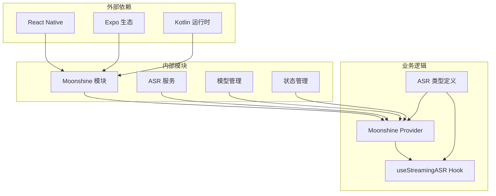

**图表来源**
- [package.json:20-62](file://package.json#L20-L62)
- [services/asr/providers/local/MoonshineProvider.ts:18-30](file://services/asr/providers/local/MoonshineProvider.ts#L18-L30)

### 类型系统依赖

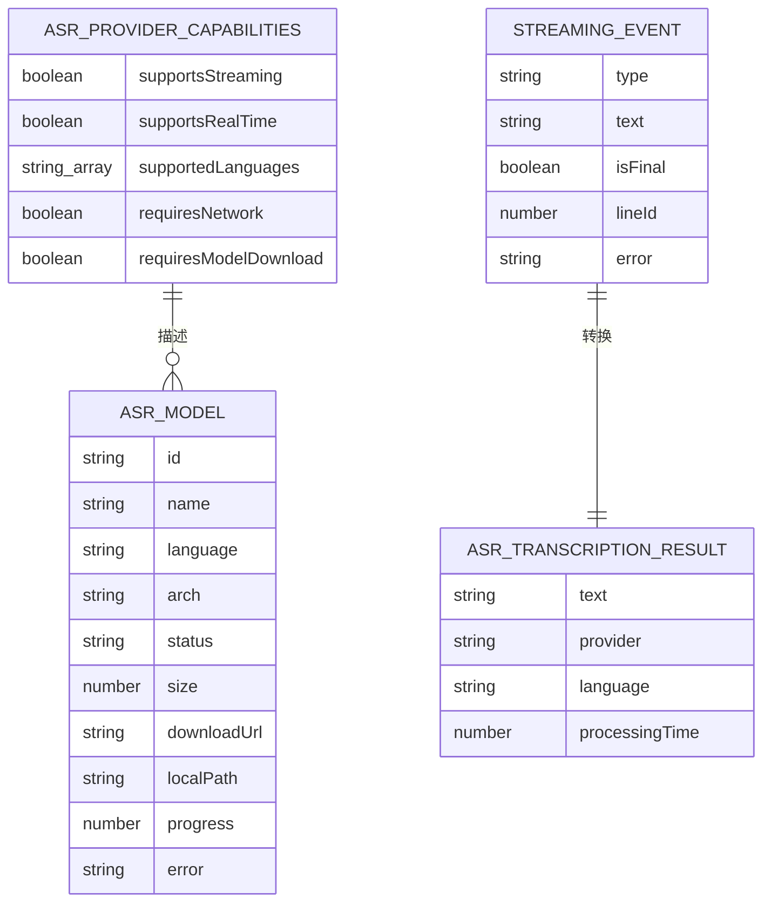

**图表来源**
- [types/asr.ts:126-144](file://types/asr.ts#L126-L144)
- [types/asr.ts:75-81](file://types/asr.ts#L75-L81)
- [types/asr.ts:90-101](file://types/asr.ts#L90-L101)
- [types/asr.ts:112-117](file://types/asr.ts#L112-L117)

**章节来源**
- [types/asr.ts:126-144](file://types/asr.ts#L126-L144)
- [types/asr.ts:75-81](file://types/asr.ts#L75-L81)

## 性能考虑

### 内存管理优化

1. **对象池模式**：复用事件对象减少垃圾回收
2. **弱引用**：避免循环引用导致的内存泄漏
3. **及时清理**：在组件卸载时清理所有订阅和定时器

### 网络与 I/O 优化

1. **批量处理**：合并多个小的网络请求
2. **缓存策略**：合理使用本地缓存减少重复下载
3. **并发控制**：限制同时进行的网络操作数量

### 事件处理优化

1. **事件去重**：避免重复处理相同事件
2. **背压处理**：当事件过多时适当降级处理
3. **异步处理**：将耗时操作放到后台线程

## 故障排除指南

### 常见问题与解决方案

#### 模块无法加载

**症状**：`isMoonshineAvailable()` 返回 `false`

**可能原因**：
1. 模块未正确编译到新架构
2. 代码生成失败
3. 平台不支持

**解决步骤**：
1. 检查 `codegenConfig` 配置
2. 运行代码生成命令
3. 验证平台支持情况

#### 事件不触发

**症状**：订阅事件后没有收到任何回调

**排查步骤**：
1. 检查 `setEventListener` 是否正确调用
2. 验证原生模块是否正确发送事件
3. 确认事件去重机制是否过滤了所有事件

#### 性能问题

**症状**：界面卡顿或响应延迟

**优化建议**：
1. 减少事件频率
2. 实施事件去重
3. 优化数据处理逻辑

**章节来源**
- [modules/moonshine/index.ts:89-91](file://modules/moonshine/index.ts#L89-L91)
- [services/asr/providers/local/MoonshineProvider.ts:216-219](file://services/asr/providers/local/MoonshineProvider.ts#L216-L219)

### 调试技巧

#### 日志记录

1. **原生层日志**：使用 `Log.d` 输出调试信息
2. **JavaScript 层日志**：使用 `console.log` 跟踪事件流
3. **性能监控**：记录关键操作的执行时间

#### 断点调试

1. **原生断点**：在 Kotlin/Java 代码中设置断点
2. **JavaScript 断点**：在 TypeScript 代码中设置断点
3. **混合调试**：使用 Chrome DevTools 调试 JavaScript，Android Studio 调试原生代码

## 结论

Turbo Modules 为 React Native 应用提供了高性能、类型安全的原生模块解决方案。通过 Moonshine 模块的实现示例，我们可以看到：

1. **架构优势**：Turbo Modules 在性能和类型安全方面显著优于 Legacy Modules
2. **开发体验**：完整的 TypeScript 支持和代码生成提升了开发效率
3. **维护性**：清晰的模块边界和事件系统便于长期维护

在实际开发中，建议遵循以下最佳实践：
- 优先使用 Turbo Modules 替代 Legacy Modules
- 充分利用类型系统进行早期错误检测
- 实施适当的事件去重和性能优化
- 建立完善的错误处理和日志记录机制

## 附录

### 开发模板

#### 新模块开发步骤

1. **定义 TypeScript 接口**
   - 创建 `src/NativeModuleName.ts` 文件
   - 定义 `Spec` 接口和事件类型

2. **配置代码生成**
   - 在 `package.json` 中添加 `codegenConfig`
   - 配置平台特定的模块提供者

3. **实现原生代码**
   - Android：实现 `ReactContextBaseJavaModule`
   - iOS：实现相应的原生模块类

4. **JavaScript 桥接**
   - 创建模块包装器
   - 实现事件处理和去重逻辑

5. **测试与验证**
   - 编写单元测试
   - 进行端到端测试
   - 性能基准测试

#### 最佳实践清单

- **类型安全**：始终使用 TypeScript 接口定义
- **错误处理**：实现统一的错误处理机制
- **资源管理**：及时清理订阅和资源
- **性能优化**：实施必要的性能优化措施
- **文档编写**：保持 API 文档的更新
- **测试覆盖**：确保足够的测试覆盖率