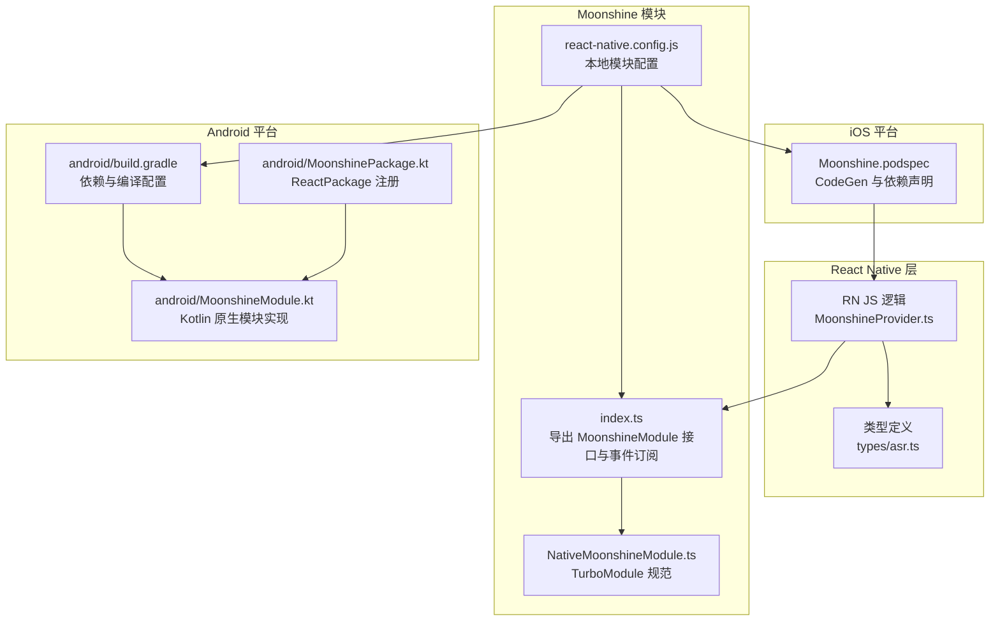
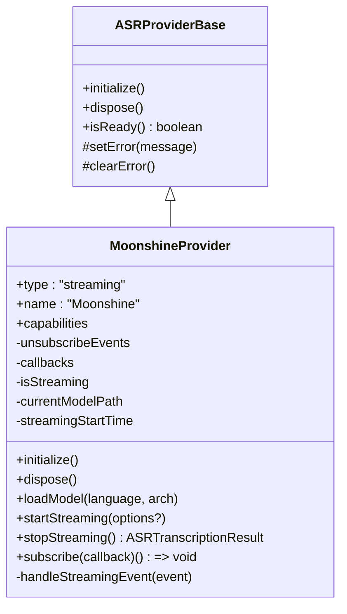
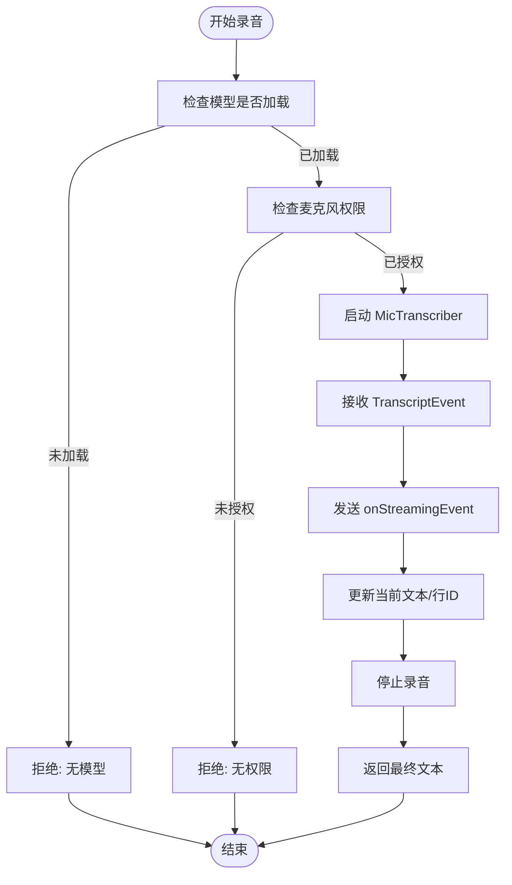
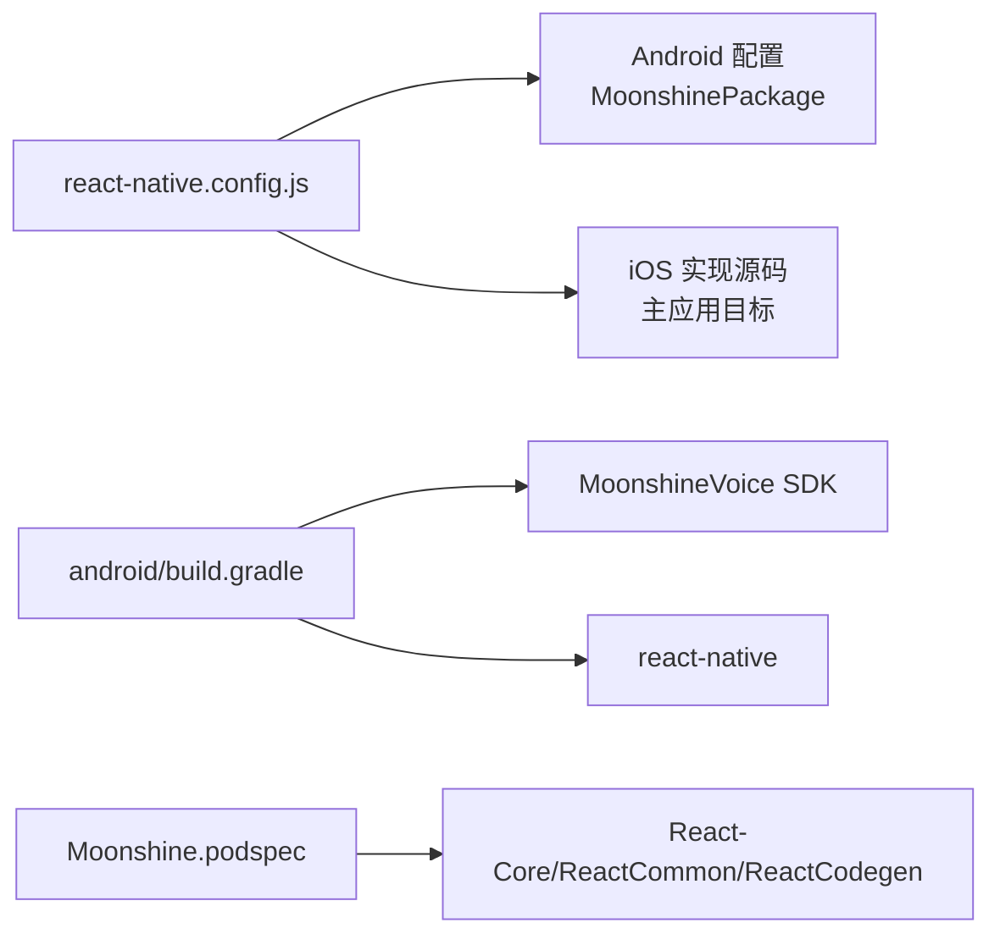

# 原生模块集成

<cite>
**本文引用的文件**
- [modules/moonshine/index.ts](file://modules/moonshine/index.ts)
- [modules/moonshine/src/NativeMoonshineModule.ts](file://modules/moonshine/src/NativeMoonshineModule.ts)
- [modules/moonshine/package.json](file://modules/moonshine/package.json)
- [modules/moonshine/Moonshine.podspec](file://modules/moonshine/Moonshine.podspec)
- [modules/moonshine/android/build.gradle](file://modules/moonshine/android/build.gradle)
- [modules/moonshine/android/MoonshineModule.kt](file://modules/moonshine/android/MoonshineModule.kt)
- [modules/moonshine/android/MoonshinePackage.kt](file://modules/moonshine/android/MoonshinePackage.kt)
- [services/asr/providers/local/MoonshineProvider.ts](file://services/asr/providers/local/MoonshineProvider.ts)
- [services/asr/providers/base/ASRProviderBase.ts](file://services/asr/providers/base/ASRProviderBase.ts)
- [services/asr/modelManager/types.ts](file://services/asr/modelManager/types.ts)
- [types/asr.ts](file://types/asr.ts)
- [react-native.config.js](file://react-native.config.js)
</cite>

## 目录
1. [简介](#简介)
2. [项目结构](#项目结构)
3. [核心组件](#核心组件)
4. [架构总览](#架构总览)
5. [详细组件分析](#详细组件分析)
6. [依赖关系分析](#依赖关系分析)
7. [性能考虑](#性能考虑)
8. [故障排除指南](#故障排除指南)
9. [结论](#结论)
10. [附录](#附录)

## 简介
本文件面向 VoiceNote 应用中的原生模块集成，重点覆盖 Moonshine（本地语音识别）与 Llama（本地大模型推理）的架构设计与集成方式。文档将系统阐述 Turbo Modules 的使用方法、平台特定实现（Android/Kotlin 与 iOS/Swift）、事件桥接与去重策略、错误处理、性能优化与内存管理、调试与故障排除，以及新原生模块开发的指导原则与最佳实践。同时给出 Moonshine 与 Llama 在 React Native 层的通信机制与数据传递路径，帮助开发者完成扩展与定制。

## 项目结构
VoiceNote 将原生模块以“模块化包”的形式组织在 modules 目录下，并通过 React Native 配置进行自动链接与代码生成支持。Moonshine 模块采用 Turbo Modules 规范，提供 TypeScript 类型规范与平台实现；Llama 模块同样遵循相同模式，但其 iOS 实现位于主应用目标中并通过 Swift Package Manager 引入依赖。



图表来源
- [modules/moonshine/index.ts:1-94](file://modules/moonshine/index.ts#L1-L94)
- [modules/moonshine/src/NativeMoonshineModule.ts:1-34](file://modules/moonshine/src/NativeMoonshineModule.ts#L1-L34)
- [react-native.config.js:1-31](file://react-native.config.js#L1-L31)
- [modules/moonshine/android/build.gradle:1-37](file://modules/moonshine/android/build.gradle#L1-L37)
- [modules/moonshine/android/MoonshineModule.kt:1-322](file://modules/moonshine/android/MoonshineModule.kt#L1-L322)
- [modules/moonshine/android/MoonshinePackage.kt:1-22](file://modules/moonshine/android/MoonshinePackage.kt#L1-L22)
- [modules/moonshine/Moonshine.podspec:1-32](file://modules/moonshine/Moonshine.podspec#L1-L32)

章节来源
- [react-native.config.js:1-31](file://react-native.config.js#L1-L31)
- [modules/moonshine/package.json:1-22](file://modules/moonshine/package.json#L1-L22)

## 核心组件
- Moonshine TurboModule 接口与事件订阅：在 index.ts 中统一导出 MoonshineModule 接口、事件订阅器与可用性检测，兼容新旧架构。
- TurboModule 规范：NativeMoonshineModule.ts 定义了事件流与方法签名，供代码生成与类型检查使用。
- Android 原生实现：MoonshineModule.kt 提供模型加载、权限通知、流式事件发送与生命周期管理。
- iOS 原生实现：Moonshine.podspec 指明实际实现位于主应用目标并通过 SPM 引入依赖。
- ASR Provider：MoonshineProvider.ts 作为本地 ASR 提供者，封装 MoonshineModule 的调用、事件转发与错误处理。
- 类型系统：types/asr.ts 与 modelManager/types.ts 定义了模型、语言、架构、下载状态等类型。

章节来源
- [modules/moonshine/index.ts:1-94](file://modules/moonshine/index.ts#L1-L94)
- [modules/moonshine/src/NativeMoonshineModule.ts:1-34](file://modules/moonshine/src/NativeMoonshineModule.ts#L1-L34)
- [modules/moonshine/android/MoonshineModule.kt:1-322](file://modules/moonshine/android/MoonshineModule.kt#L1-L322)
- [services/asr/providers/local/MoonshineProvider.ts:1-307](file://services/asr/providers/local/MoonshineProvider.ts#L1-L307)
- [types/asr.ts:1-164](file://types/asr.ts#L1-L164)
- [services/asr/modelManager/types.ts:1-129](file://services/asr/modelManager/types.ts#L1-L129)

## 架构总览
Moonshine 采用“React Native 层 + TurboModule 规范 + 平台原生实现”的分层架构。RN 层通过 MoonshineProvider 统一调度，TurboModule 规范确保类型安全与跨平台一致性，平台侧负责具体推理与事件回传。

```mermaid
sequenceDiagram
participant RN as "RN 层<br/>MoonshineProvider.ts"
participant TM as "TurboModule 规范<br/>NativeMoonshineModule.ts"
participant AND as "Android 原生<br/>MoonshineModule.kt"
participant EVT as "事件系统<br/>NativeEventEmitter/DeviceEventEmitter"
RN->>TM : 调用 loadModel()/startStreaming()
TM->>AND : 方法调用Promise
AND-->>EVT : 发送 onStreamingEvent
EVT-->>RN : setEventListener 回调
RN->>TM : 调用 stopStreaming()
TM->>AND : 方法调用Promise
AND-->>RN : 返回最终文本
```

图表来源
- [services/asr/providers/local/MoonshineProvider.ts:192-259](file://services/asr/providers/local/MoonshineProvider.ts#L192-L259)
- [modules/moonshine/src/NativeMoonshineModule.ts:16-31](file://modules/moonshine/src/NativeMoonshineModule.ts#L16-L31)
- [modules/moonshine/android/MoonshineModule.kt:46-230](file://modules/moonshine/android/MoonshineModule.kt#L46-L230)
- [modules/moonshine/index.ts:42-84](file://modules/moonshine/index.ts#L42-L84)

## 详细组件分析

### MoonshineProvider（本地 ASR 提供者）
- 职责：封装 MoonshineModule 的调用、事件订阅、模型生命周期管理、错误传播与性能统计。
- 关键点：
  - 初始化与就绪检查：检查模块可用性、模型是否已加载或可提取。
  - 事件订阅：通过 setEventListener 订阅 onStreamingEvent，内部做去重处理。
  - 平台差异：Android 在 startStreaming 前需调用 onMicPermissionGranted。
  - 结果聚合：stopStreaming 后返回文本与处理时长。



图表来源
- [services/asr/providers/base/ASRProviderBase.ts:13-65](file://services/asr/providers/base/ASRProviderBase.ts#L13-L65)
- [services/asr/providers/local/MoonshineProvider.ts:42-291](file://services/asr/providers/local/MoonshineProvider.ts#L42-L291)

章节来源
- [services/asr/providers/local/MoonshineProvider.ts:1-307](file://services/asr/providers/local/MoonshineProvider.ts#L1-L307)
- [services/asr/providers/base/ASRProviderBase.ts:1-66](file://services/asr/providers/base/ASRProviderBase.ts#L1-L66)

### TurboModule 规范与接口
- NativeMoonshineModule.ts 定义了事件流 onStreamingEvent 与方法签名，用于代码生成与类型检查。
- index.ts 中根据可用性选择 TurboModule 或 Legacy 模块，并创建 NativeEventEmitter 以适配新架构。

```mermaid
classDiagram
class Spec {
+onStreamingEvent
+isAvailable() Promise~boolean~
+hasEventCallback() Promise~boolean~
+loadModel(modelPath, arch) Promise~void~
+unloadModel() Promise~void~
+isModelLoaded() Promise~boolean~
+startStreaming(language?) Promise~void~
+stopStreaming() Promise~{text}~
+getDownloadedModels() Promise~string[]~
+deleteModel(modelId) Promise~void~
+getModelsDirectory() Promise~string~
+onMicPermissionGranted() Promise~void~
+addListener(eventName) Promise~void~
+removeListeners(count) Promise~void~
}
class MoonshineModuleInterface {
<<interface>>
+isAvailable() Promise~boolean~
+hasEventCallback() Promise~boolean~
+loadModel(modelPath, arch) Promise~void~
+unloadModel() Promise~void~
+isModelLoaded() Promise~boolean~
+startStreaming(language?) Promise~void~
+stopStreaming() Promise~{text}~
+getDownloadedModels() Promise~string[]~
+deleteModel(modelId) Promise~void~
+getModelsDirectory() Promise~string~
+onMicPermissionGranted?()
}
Spec <|.. MoonshineModuleInterface
```

图表来源
- [modules/moonshine/src/NativeMoonshineModule.ts:16-33](file://modules/moonshine/src/NativeMoonshineModule.ts#L16-L33)
- [modules/moonshine/index.ts:17-39](file://modules/moonshine/index.ts#L17-L39)

章节来源
- [modules/moonshine/src/NativeMoonshineModule.ts:1-34](file://modules/moonshine/src/NativeMoonshineModule.ts#L1-L34)
- [modules/moonshine/index.ts:1-94](file://modules/moonshine/index.ts#L1-L94)

### Android 原生模块（Kotlin）
- 模块类：MoonshineModule.kt 实现 ReactContextBaseJavaModule，提供 isAvailable、loadModel、startStreaming、stopStreaming、事件监听注册等方法。
- 事件系统：通过 DeviceEventManagerModule 发送 onStreamingEvent，支持 NativeEventEmitter 与 DeviceEventEmitter 双通道。
- 权限与生命周期：维护 isRecording、currentText、lineId 等状态；在 Android 上通过 onMicPermissionGranted 通知麦克风权限。
- 错误处理：所有异常通过 Promise.reject 抛出，便于 RN 层捕获。



图表来源
- [modules/moonshine/android/MoonshineModule.kt:175-230](file://modules/moonshine/android/MoonshineModule.kt#L175-L230)
- [modules/moonshine/android/MoonshineModule.kt:304-320](file://modules/moonshine/android/MoonshineModule.kt#L304-L320)

章节来源
- [modules/moonshine/android/MoonshineModule.kt:1-322](file://modules/moonshine/android/MoonshineModule.kt#L1-L322)

### iOS 原生模块（Swift）
- 实现位置：Moonshine.podspec 明确指出 iOS 实际实现位于主应用目标（ios/voicenote/MoonshineModule.swift），并通过 Swift Package Manager 引入 MoonshineVoice SDK。
- 作用：为 CodeGen 与自动链接提供占位 podspec，实际逻辑在主工程中实现。

章节来源
- [modules/moonshine/Moonshine.podspec:15-23](file://modules/moonshine/Moonshine.podspec#L15-L23)

### 事件订阅与去重
- setEventListener 内部对事件进行去重：基于事件类型、行号、文本与最终标记组合键与时间阈值，避免高频事件风暴。
- 兼容双通道：同时监听 NativeEventEmitter 与 DeviceEventEmitter，保证在不同架构下的稳定性。

章节来源
- [modules/moonshine/index.ts:42-84](file://modules/moonshine/index.ts#L42-L84)

### 模型管理与下载
- 类型定义：modelManager/types.ts 定义了模型 ID、下载选项、远程/本地模型信息、默认下载地址与模型大小。
- 下载与解析：通过 getModelDownloadUrl 与 getModelId 生成下载链接与标识，parseModelId 支持从字符串解析模型信息。
- MoonshineProvider：在初始化时检查模型是否已下载或可提取，再决定加载路径。

章节来源
- [services/asr/modelManager/types.ts:1-129](file://services/asr/modelManager/types.ts#L1-L129)
- [services/asr/providers/local/MoonshineProvider.ts:88-135](file://services/asr/providers/local/MoonshineProvider.ts#L88-L135)

## 依赖关系分析
- React Native 配置：react-native.config.js 指定 moonshine-module 的根目录与平台实现入口，确保 Android 使用 MoonshinePackage 注册，iOS 通过主应用目标实现。
- Android 依赖：build.gradle 引入 react-native 与 MoonshineVoice SDK，并启用 Kotlin 协程支持。
- iOS 依赖：Moonshine.podspec 声明 React-Core/ReactCommon/ReactCodegen 依赖，实际 Swift 实现在主工程。



图表来源
- [react-native.config.js:12-28](file://react-native.config.js#L12-L28)
- [modules/moonshine/android/build.gradle:32-36](file://modules/moonshine/android/build.gradle#L32-L36)
- [modules/moonshine/Moonshine.podspec:27-31](file://modules/moonshine/Moonshine.podspec#L27-L31)

章节来源
- [react-native.config.js:1-31](file://react-native.config.js#L1-L31)
- [modules/moonshine/android/build.gradle:1-37](file://modules/moonshine/android/build.gradle#L1-L37)
- [modules/moonshine/Moonshine.podspec:1-32](file://modules/moonshine/Moonshine.podspec#L1-L32)

## 性能考虑
- 流式事件去重：RN 层对高频事件进行去重，降低 UI 渲染压力与主线程抖动。
- 主线程协程：Android 使用 Dispatchers.Main 运行回调，避免阻塞 UI。
- 模型加载策略：优先使用已下载模型，必要时提取内置模型，减少首次启动延迟。
- 生命周期管理：Provider 在 dispose 中清理事件订阅与模型卸载，防止内存泄漏。

章节来源
- [modules/moonshine/index.ts:57-66](file://modules/moonshine/index.ts#L57-L66)
- [modules/moonshine/android/MoonshineModule.kt:29](file://modules/moonshine/android/MoonshineModule.kt#L29)
- [services/asr/providers/local/MoonshineProvider.ts:140-164](file://services/asr/providers/local/MoonshineProvider.ts#L140-L164)

## 故障排除指南
- 模块不可用：检查 isMoonshineAvailable 与 react-native.config.js 配置，确认平台实现存在且已正确链接。
- 无模型：调用 isModelLoaded 失败时，确认模型已下载或可提取，再执行 loadModel。
- 无权限（Android）：在 startStreaming 前调用 onMicPermissionGranted，确保 transcriber 已收到权限。
- 事件不触发：确认 setEventListener 已正确订阅，且 NativeEventEmitter/DeviceEventEmitter 双通道均有效。
- 停止后无结果：stopStreaming 返回包含最终文本的对象，检查 Promise 处理与 Provider 状态。

章节来源
- [services/asr/providers/local/MoonshineProvider.ts:192-259](file://services/asr/providers/local/MoonshineProvider.ts#L192-L259)
- [modules/moonshine/android/MoonshineModule.kt:175-230](file://modules/moonshine/android/MoonshineModule.kt#L175-L230)
- [modules/moonshine/index.ts:42-84](file://modules/moonshine/index.ts#L42-L84)

## 结论
Moonshine 与 Llama 的原生模块集成遵循 Turbo Modules 规范，通过清晰的 RN 层封装、平台侧实现与事件桥接，实现了稳定的本地 AI 推理能力。项目在类型安全、错误处理、事件去重与生命周期管理方面具备良好实践，适合在此基础上扩展新的原生模块或自定义推理流程。

## 附录

### 开发流程与最佳实践
- 设计阶段
  - 明确方法与事件：在 TurboModule 规范中定义方法与事件流，确保类型安全。
  - 平台差异：Android 与 iOS 的权限、事件通道与依赖引入策略应明确分离。
- 实现阶段（Android/Kotlin）
  - 使用 ReactContextBaseJavaModule 暴露方法，通过 Promise 返回结果。
  - 事件通过 DeviceEventManagerModule 发送，必要时配合 NativeEventEmitter。
  - 管理生命周期与状态，避免内存泄漏。
- 实现阶段（iOS/Swift）
  - 通过 Swift Package Manager 引入依赖，Moonshine.podspec 仅用于 CodeGen 与自动链接。
  - 保持与 TurboModule 规范一致的方法签名与事件名称。
- JavaScript 桥接
  - 在 index.ts 中统一导出接口与事件订阅器，兼容新旧架构。
  - 对高频事件进行去重与节流，提升 UI 响应。
- 错误处理
  - 所有异常通过 Promise.reject 抛出，RN 层统一捕获与上报。
  - Provider 层维护错误状态并在初始化失败时及时反馈。
- 性能优化
  - 事件去重与节流，避免 UI 抖动。
  - 主线程协程与后台任务分离，避免阻塞 UI。
  - 模型预加载与缓存策略，缩短响应时间。
- 调试技巧
  - 使用 setEventListener 订阅事件，结合日志定位问题。
  - 分别检查 NativeEventEmitter 与 DeviceEventEmitter 的回调是否生效。
  - 在 Android 上验证 onMicPermissionGranted 是否在 startStreaming 前被调用。

章节来源
- [modules/moonshine/src/NativeMoonshineModule.ts:16-31](file://modules/moonshine/src/NativeMoonshineModule.ts#L16-L31)
- [modules/moonshine/android/MoonshineModule.kt:20-322](file://modules/moonshine/android/MoonshineModule.kt#L20-L322)
- [modules/moonshine/Moonshine.podspec:15-23](file://modules/moonshine/Moonshine.podspec#L15-L23)
- [modules/moonshine/index.ts:42-84](file://modules/moonshine/index.ts#L42-L84)
- [services/asr/providers/local/MoonshineProvider.ts:192-259](file://services/asr/providers/local/MoonshineProvider.ts#L192-L259)