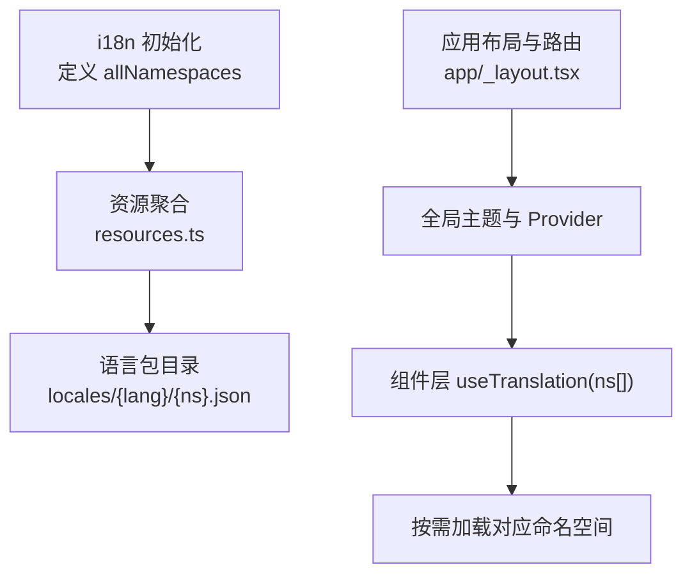
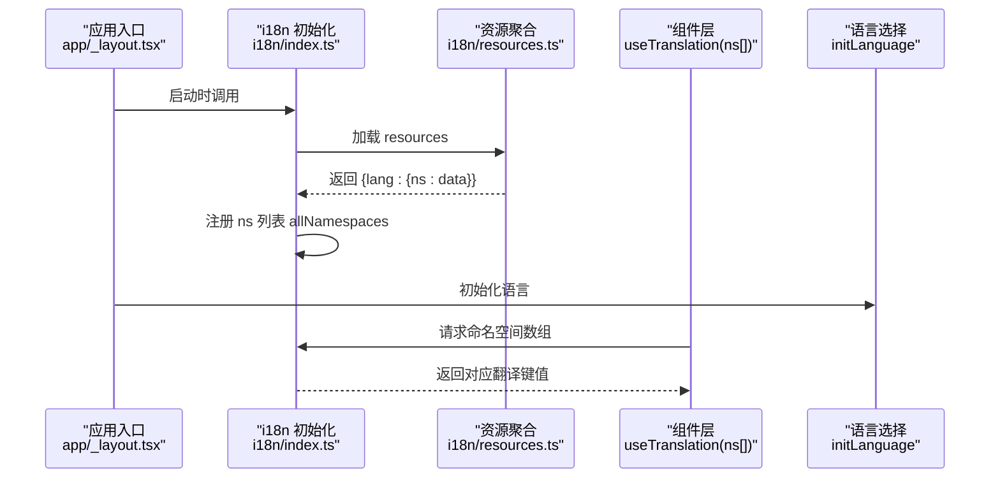
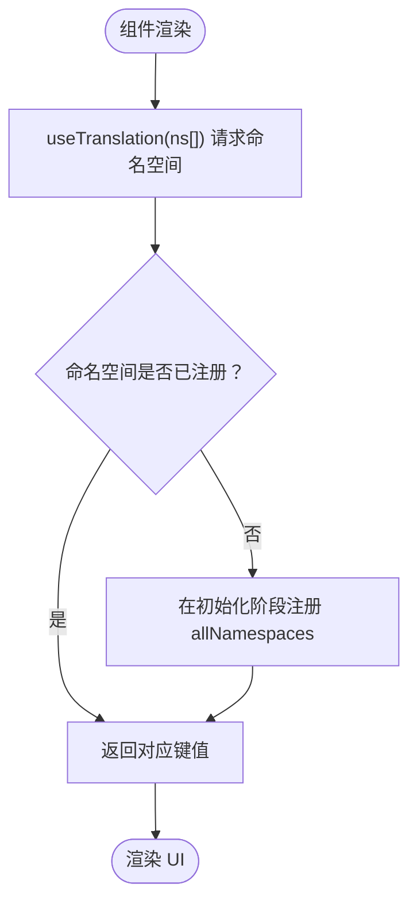
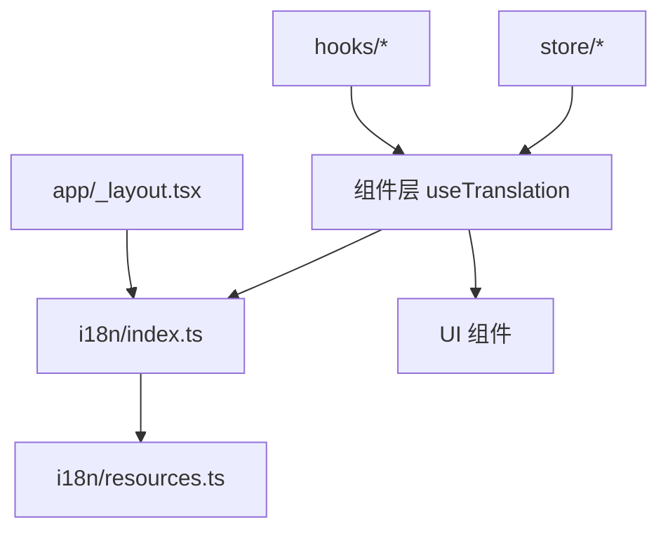

# 命名空间管理

<cite>
**本文档引用的文件**
- [i18n/index.ts](file://i18n/index.ts)
- [i18n/resources.ts](file://i18n/resources.ts)
- [app/_layout.tsx](file://app/_layout.tsx)
- [components/note/NoteList.tsx](file://components/note/NoteList.tsx)
- [components/input/RecordingOverlay.tsx](file://components/input/RecordingOverlay.tsx)
- [components/note/InspirationCard.tsx](file://components/note/InspirationCard.tsx)
- [store/useOverlayStore.ts](file://store/useOverlayStore.ts)
- [hooks/index.ts](file://hooks/index.ts)
- [components/index.ts](file://components/index.ts)
- [store/index.ts](file://store/index.ts)
- [i18n/locales/en/common.json](file://i18n/locales/en/common.json)
- [i18n/locales/en/nav.json](file://i18n/locales/en/nav.json)
</cite>

## 目录
1. [简介](#简介)
2. [项目结构](#项目结构)
3. [核心组件](#核心组件)
4. [架构总览](#架构总览)
5. [详细组件分析](#详细组件分析)
6. [依赖关系分析](#依赖关系分析)
7. [性能考虑](#性能考虑)
8. [故障排除指南](#故障排除指南)
9. [结论](#结论)
10. [附录](#附录)

## 简介
本文件系统性梳理 VoiceNote 应用的命名空间（namespace）管理体系，重点围绕国际化（i18n）层面的 allNamespaces 数组展开，解释各命名空间的职责边界、界面区域映射、加载策略与按需加载机制，并给出新增命名空间的流程、命名规范、冲突避免方法以及性能优化与内存管理建议。目标是帮助开发者在不深入源码的情况下，也能清晰理解并正确扩展应用的多语言支持体系。

## 项目结构
VoiceNote 将多语言资源按“命名空间+语言”的维度组织，所有命名空间在初始化阶段集中声明并注入到 i18n 引擎中，形成统一的翻译键值库。应用通过 useTranslation 钩子在组件层按需请求特定命名空间，从而实现按需加载与运行时切换语言的能力。

图表来源
- [i18n/index.ts:34-66](file://i18n/index.ts#L34-L66)
- [i18n/resources.ts:106-212](file://i18n/resources.ts#L106-L212)
- [app/_layout.tsx:26-87](file://app/_layout.tsx#L26-L87)

章节来源
- [i18n/index.ts:34-66](file://i18n/index.ts#L34-L66)
- [i18n/resources.ts:106-212](file://i18n/resources.ts#L106-L212)
- [app/_layout.tsx:26-87](file://app/_layout.tsx#L26-L87)

## 核心组件
- allNamespaces：集中声明所有可用命名空间，作为 i18n 初始化的 ns 列表，确保引擎在启动时预加载这些命名空间的资源。
- 资源聚合：resources.ts 将各语言的所有命名空间资源打包，供 i18n 初始化时一次性注入。
- 组件层 useTranslation：在具体页面或组件中声明需要使用的命名空间数组，实现按需加载与渲染。
- 应用布局与 Provider：根布局负责初始化语言、主题与全局 Provider，为命名空间的使用提供上下文。

章节来源
- [i18n/index.ts:34-66](file://i18n/index.ts#L34-L66)
- [i18n/resources.ts:106-212](file://i18n/resources.ts#L106-L212)
- [app/_layout.tsx:26-87](file://app/_layout.tsx#L26-L87)

## 架构总览
下图展示从初始化到组件渲染的完整流程，强调命名空间的集中声明、资源聚合与按需加载的关系。

图表来源
- [i18n/index.ts:57-66](file://i18n/index.ts#L57-L66)
- [i18n/resources.ts:106-212](file://i18n/resources.ts#L106-L212)
- [app/_layout.tsx:26-87](file://app/_layout.tsx#L26-L87)

## 详细组件分析

### 命名空间组织原则与分类逻辑
- 分类依据：以功能域划分命名空间，如导航、设置、录音、笔记、搜索、错误提示、日期格式化、对话框、媒体、AI、灵感、相机、附件、语音、统计、分类、优化等。
- 组织方式：allNamespaces 在初始化阶段集中声明，resources.ts 按语言与命名空间聚合，确保 i18n 引擎在启动时完成资源注册。
- 默认命名空间：defaultNS 设为 common，作为兜底键值来源，保证未指定命名空间的键也能解析。

章节来源
- [i18n/index.ts:34-66](file://i18n/index.ts#L34-L66)
- [i18n/resources.ts:106-212](file://i18n/resources.ts#L106-L212)

### 各命名空间的作用与用途
以下为 allNamespaces 中各命名空间的功能定位与典型使用场景：

- common：通用键值，如“保存”、“取消”、“删除”、“加载中”等跨模块复用文本。
- nav：导航相关文案，如“记录”、“设置”、“笔记”、“录音”、“模型”等标签页与导航标题。
- settings：设置界面文案，含设置项标题、说明与操作按钮。
- recording：录音过程中的状态文案，如“录音中”、“转写中”、“录音完成”等。
- note：笔记相关文案，如空状态提示、操作按钮、计数等。
- search：搜索相关文案，如输入提示、结果为空、筛选器等。
- errors：错误信息文案，用于异常提示与用户反馈。
- dates：日期格式化与相对时间文案，如“今天”、“昨天”、“X天前”等。
- dialog：对话框与确认弹窗文案，如“确认”、“取消”、“提示”等。
- selection：批量选择与多选操作文案。
- media：媒体资源相关文案，如“无媒体”、“媒体库”等。
- ai：AI 分析与生成相关文案，如“分析中”、“标签”、“洞察”等。
- inspiration：灵感卡片与灵感视图相关文案。
- camera：相机拍摄与预览相关文案。
- attachment：附件上传与预览相关文案。
- voice：语音识别与转写相关文案。
- stats：统计数据与概览文案。
- category：分类管理相关文案。
- optimization：转写优化相关文案。
- share：分享相关文案。

章节来源
- [i18n/index.ts:34-55](file://i18n/index.ts#L34-L55)
- [i18n/resources.ts:106-212](file://i18n/resources.ts#L106-L212)

### 命名空间与界面区域映射
- 导航与布局：根布局在初始化时请求 ['nav', 'common']，确保导航标题与返回文案可用。
- 笔记列表：NoteList 使用 ['dates', 'note', 'common']，结合日期分组与笔记操作文案。
- 录音覆盖层：RecordingOverlay 使用 ['recording', 'common']，呈现录音与转写状态。
- 灵感卡片：InspirationCard 使用 ['inspiration', 'note', 'dates']，展示灵感摘要与相对时间。
- 设置内容：SettingsContent 使用 ['settings', 'common', 'optimization']，呈现设置项与优化说明。

章节来源
- [app/_layout.tsx:28-35](file://app/_layout.tsx#L28-L35)
- [components/note/NoteList.tsx:121-122](file://components/note/NoteList.tsx#L121-L122)
- [components/input/RecordingOverlay.tsx:75-76](file://components/input/RecordingOverlay.tsx#L75-L76)
- [components/note/InspirationCard.tsx:32-33](file://components/note/InspirationCard.tsx#L32-L33)

### 命名空间加载策略与按需加载机制
- 集中声明：allNamespaces 在初始化时一次性注册，确保 i18n 引擎具备完整的命名空间索引。
- 资源聚合：resources.ts 将各语言的命名空间资源打包，减少运行时动态拼接成本。
- 按需请求：组件通过 useTranslation(ns[]) 声明所需命名空间，i18n 引擎仅返回当前组件所需的键值，避免全量加载。
- 语言切换：initLanguage 根据存储的语言或设备语言进行切换，不影响已注册的命名空间集合。

图表来源
- [i18n/index.ts:34-66](file://i18n/index.ts#L34-L66)
- [i18n/resources.ts:106-212](file://i18n/resources.ts#L106-L212)

章节来源
- [i18n/index.ts:34-66](file://i18n/index.ts#L34-L66)
- [i18n/resources.ts:106-212](file://i18n/resources.ts#L106-L212)

### 新增命名空间的添加流程与命名规范
- 添加流程
  1) 在 allNamespaces 中追加新的命名空间字符串。
  2) 在 resources.ts 中为该命名空间添加各语言的键值对。
  3) 在对应组件中通过 useTranslation([...oldNs, 'newNs']) 声明使用。
  4) 在 locales/{lang}/ 下新增 {newNs}.json 并填充键值。
- 命名规范
  - 使用小写英文单词，语义明确，避免缩写。
  - 与功能域强关联，如 note、recording、settings 等。
  - 保持与组件/页面职责一致，避免过度细分。

章节来源
- [i18n/index.ts:34-55](file://i18n/index.ts#L34-L55)
- [i18n/resources.ts:106-212](file://i18n/resources.ts#L106-L212)

### 命名空间冲突的避免方法与最佳实践
- 冲突避免
  - 不同功能域使用独立命名空间，避免键重复。
  - 若确需共享键，优先放入 common，降低耦合。
- 最佳实践
  - 组件内显式声明所需命名空间，避免隐式依赖。
  - 定期清理未使用的命名空间与键值，保持资源精简。
  - 为新增命名空间编写单元测试，确保键值存在且可翻译。

章节来源
- [i18n/index.ts:34-66](file://i18n/index.ts#L34-L66)
- [i18n/resources.ts:106-212](file://i18n/resources.ts#L106-L212)

### 性能优化与内存管理策略
- 资源预加载与懒加载结合
  - 初始化阶段预注册 allNamespaces，减少首次访问延迟。
  - 运行时仅返回组件所需命名空间的键值，避免全量传输。
- 语言切换优化
  - initLanguage 仅切换语言代码，不重新注册命名空间，降低开销。
- 组件级优化
  - 合理拆分命名空间，避免单个命名空间过大。
  - 对高频组件使用本地缓存键值，减少重复查询。
- 存储与缓存
  - 利用 React Query 的缓存策略（如 staleTime、gcTime）减少重复请求。
  - 在 store 层维护轻量状态，避免在 i18n 上叠加复杂逻辑。

章节来源
- [app/_layout.tsx:16-24](file://app/_layout.tsx#L16-L24)
- [i18n/index.ts:68-73](file://i18n/index.ts#L68-L73)

## 依赖关系分析
- i18n 初始化依赖 resources.ts 提供的资源映射。
- 组件层通过 hooks 与 store 获取业务数据，同时通过 useTranslation 获取翻译键值。
- 应用布局负责 Provider 包装，为 i18n 提供全局上下文。

图表来源
- [i18n/index.ts:57-66](file://i18n/index.ts#L57-L66)
- [i18n/resources.ts:106-212](file://i18n/resources.ts#L106-L212)
- [app/_layout.tsx:26-87](file://app/_layout.tsx#L26-L87)
- [hooks/index.ts:1-79](file://hooks/index.ts#L1-L79)
- [store/index.ts:1-8](file://store/index.ts#L1-L8)

章节来源
- [i18n/index.ts:57-66](file://i18n/index.ts#L57-L66)
- [i18n/resources.ts:106-212](file://i18n/resources.ts#L106-L212)
- [app/_layout.tsx:26-87](file://app/_layout.tsx#L26-L87)
- [hooks/index.ts:1-79](file://hooks/index.ts#L1-L79)
- [store/index.ts:1-8](file://store/index.ts#L1-L8)

## 性能考虑
- 启动时长：allNamespaces 预注册与 resources 聚合减少了首次渲染等待。
- 运行时内存：按需返回命名空间键值，避免不必要的对象创建。
- 语言切换：initLanguage 仅更新语言代码，不重建命名空间索引。
- 缓存策略：结合 React Query 的缓存配置，减少重复请求带来的抖动。

章节来源
- [app/_layout.tsx:16-24](file://app/_layout.tsx#L16-L24)
- [i18n/index.ts:68-73](file://i18n/index.ts#L68-L73)

## 故障排除指南
- 键值缺失
  - 现象：组件渲染出现键名而非文案。
  - 排查：确认 locales/{lang}/{ns}.json 是否存在对应键；检查 useTranslation(ns[]) 是否包含该命名空间。
- 语言切换无效
  - 现象：切换语言后文案未更新。
  - 排查：确认 initLanguage 调用路径与 supportedLngs 配置；检查组件是否重新渲染。
- 命名空间未注册
  - 现象：请求的命名空间无法解析。
  - 排查：确认 allNamespaces 中是否包含该命名空间；检查 resources.ts 是否提供该命名空间的资源。

章节来源
- [i18n/index.ts:34-66](file://i18n/index.ts#L34-L66)
- [i18n/resources.ts:106-212](file://i18n/resources.ts#L106-L212)
- [i18n/locales/en/common.json:1-22](file://i18n/locales/en/common.json#L1-L22)
- [i18n/locales/en/nav.json:1-10](file://i18n/locales/en/nav.json#L1-L10)

## 结论
VoiceNote 的命名空间管理以 i18n 为核心，通过 allNamespaces 的集中声明与 resources 的聚合，实现了启动时的资源就绪与运行时的按需加载。组件层通过 useTranslation(ns[]) 明确声明依赖，既保证了可维护性，也兼顾了性能。遵循本文提供的命名规范与最佳实践，可有效避免冲突并提升扩展效率。

## 附录
- 常用命名空间速览
  - common、nav、settings、recording、note、search、errors、dates、dialog、selection、media、ai、inspiration、camera、attachment、voice、stats、category、optimization、share
- 关键文件路径
  - i18n 初始化与命名空间声明：[i18n/index.ts](file://i18n/index.ts)
  - 资源聚合与语言包映射：[i18n/resources.ts](file://i18n/resources.ts)
  - 应用布局与 Provider：[app/_layout.tsx](file://app/_layout.tsx)
  - 组件层命名空间使用示例：
    - 笔记列表：[components/note/NoteList.tsx](file://components/note/NoteList.tsx)
    - 录音覆盖层：[components/input/RecordingOverlay.tsx](file://components/input/RecordingOverlay.tsx)
    - 灵感卡片：[components/note/InspirationCard.tsx](file://components/note/InspirationCard.tsx)
  - 状态与钩子导出：
    - store 导出：[store/index.ts](file://store/index.ts)
    - hooks 导出：[hooks/index.ts](file://hooks/index.ts)
    - 组件导出：[components/index.ts](file://components/index.ts)
  - 语言包示例：
    - common 示例：[i18n/locales/en/common.json](file://i18n/locales/en/common.json)
    - nav 示例：[i18n/locales/en/nav.json](file://i18n/locales/en/nav.json)