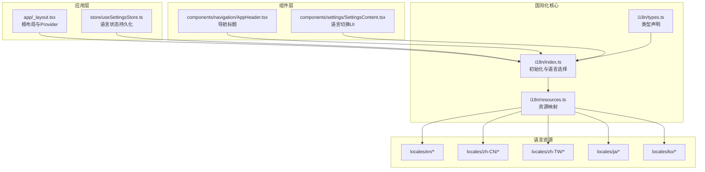
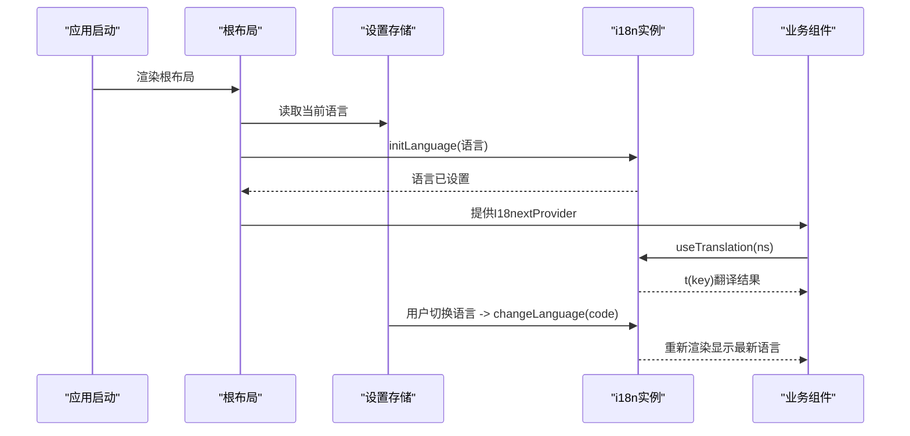
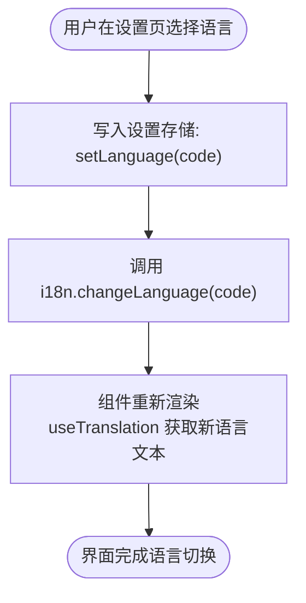
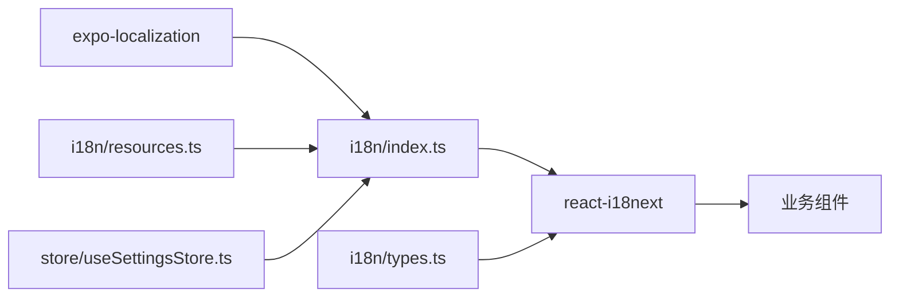

# 国际化支持

<cite>
**本文引用的文件**
- [i18n/index.ts](file://i18n/index.ts)
- [i18n/resources.ts](file://i18n/resources.ts)
- [i18n/types.ts](file://i18n/types.ts)
- [app/_layout.tsx](file://app/_layout.tsx)
- [store/useSettingsStore.ts](file://store/useSettingsStore.ts)
- [components/navigation/AppHeader.tsx](file://components/navigation/AppHeader.tsx)
- [components/settings/SettingsContent.tsx](file://components/settings/SettingsContent.tsx)
- [i18n/locales/en/common.json](file://i18n/locales/en/common.json)
- [i18n/locales/zh-CN/common.json](file://i18n/locales/zh-CN/common.json)
- [i18n/locales/en/nav.json](file://i18n/locales/en/nav.json)
- [i18n/locales/zh-CN/nav.json](file://i18n/locales/zh-CN/nav.json)
- [i18n/locales/en/dates.json](file://i18n/locales/en/dates.json)
- [i18n/locales/en/ai.json](file://i18n/locales/en/ai.json)
- [i18n/locales/zh-CN/ai.json](file://i18n/locales/zh-CN/ai.json)
- [i18n/locales/en/errors.json](file://i18n/locales/en/errors.json)
- [i18n/locales/zh-CN/errors.json](file://i18n/locales/zh-CN/errors.json)
</cite>

## 目录
1. [简介](#简介)
2. [项目结构](#项目结构)
3. [核心组件](#核心组件)
4. [架构总览](#架构总览)
5. [详细组件分析](#详细组件分析)
6. [依赖关系分析](#依赖关系分析)
7. [性能考虑](#性能考虑)
8. [故障排查指南](#故障排查指南)
9. [结论](#结论)
10. [附录](#附录)

## 简介
本文件系统性阐述 VoiceNote 的国际化（i18n）支持方案，基于 i18next 与 react-i18next 实现。内容涵盖语言资源组织、命名规范、命名空间划分、语言切换与动态加载机制、日期与数字等本地化适配、翻译资源的新增与维护流程、新语言添加步骤与注意事项、文本提取与翻译管理流程、质量保证与一致性检查方法，以及性能优化与缓存策略。

## 项目结构
国际化相关代码主要集中在 i18n 目录与应用入口层，配合全局设置存储与若干使用翻译的组件。

图表来源
- [i18n/index.ts:1-76](file://i18n/index.ts#L1-L76)
- [i18n/resources.ts:1-213](file://i18n/resources.ts#L1-L213)
- [i18n/types.ts:1-45](file://i18n/types.ts#L1-L45)
- [app/_layout.tsx:1-101](file://app/_layout.tsx#L1-L101)
- [store/useSettingsStore.ts:1-218](file://store/useSettingsStore.ts#L1-L218)
- [components/navigation/AppHeader.tsx:1-84](file://components/navigation/AppHeader.tsx#L1-L84)
- [components/settings/SettingsContent.tsx:1-623](file://components/settings/SettingsContent.tsx#L1-L623)

章节来源
- [i18n/index.ts:1-76](file://i18n/index.ts#L1-L76)
- [i18n/resources.ts:1-213](file://i18n/resources.ts#L1-L213)
- [i18n/types.ts:1-45](file://i18n/types.ts#L1-L45)
- [app/_layout.tsx:1-101](file://app/_layout.tsx#L1-L101)
- [store/useSettingsStore.ts:1-218](file://store/useSettingsStore.ts#L1-L218)
- [components/navigation/AppHeader.tsx:1-84](file://components/navigation/AppHeader.tsx#L1-L84)
- [components/settings/SettingsContent.tsx:1-623](file://components/settings/SettingsContent.tsx#L1-L623)

## 核心组件
- 初始化与语言选择
  - 支持的语言列表与设备语言探测逻辑，自动匹配 zh-Hans/zh-Hant 到 zh-CN/zh-TW，回退到英文。
  - 默认命名空间与默认命名空间定义，禁用转义以支持模板变量。
- 资源映射
  - 按语言与命名空间聚合导入 JSON 资源，形成 i18n 可用的 resources 结构。
- 类型声明
  - 基于 react-i18next 的自定义类型扩展，确保 t 函数调用的键名类型安全。
- 应用入口
  - 在根布局注入 I18nextProvider，使全应用可用 useTranslation。
- 设置存储
  - 语言作为持久化设置项之一，变更后触发语言切换。

章节来源
- [i18n/index.ts:6-76](file://i18n/index.ts#L6-L76)
- [i18n/resources.ts:106-213](file://i18n/resources.ts#L106-L213)
- [i18n/types.ts:21-44](file://i18n/types.ts#L21-L44)
- [app/_layout.tsx:26-87](file://app/_layout.tsx#L26-L87)
- [store/useSettingsStore.ts:9-22](file://store/useSettingsStore.ts#L9-L22)

## 架构总览
整体采用“集中式初始化 + 组件内按需使用”的模式。初始化阶段确定语言、命名空间与回退策略；运行期通过 useTranslation 在组件中读取翻译；设置变更通过 store 触发 i18n.changeLanguage。

图表来源
- [app/_layout.tsx:26-87](file://app/_layout.tsx#L26-L87)
- [i18n/index.ts:68-73](file://i18n/index.ts#L68-L73)
- [store/useSettingsStore.ts:146](file://store/useSettingsStore.ts#L146)

## 详细组件分析

### 语言资源组织与命名规范
- 语言目录
  - 采用标准 BCP 47 语言标签命名，如 zh-CN、zh-TW、en、ja、ko。
- 命名空间划分
  - 按功能域拆分 JSON 文件，如 common、nav、settings、recording、note、search、errors、dates、dialog、selection、media、ai、inspiration、camera、attachment、voice、stats、category、optimization 等。
- 键名与值
  - 键名采用点号分隔的层级结构，便于检索与维护。
  - 值支持模板变量（如 {{count}}），用于复数、时间差等动态展示。

章节来源
- [i18n/resources.ts:106-213](file://i18n/resources.ts#L106-L213)
- [i18n/index.ts:34-55](file://i18n/index.ts#L34-L55)
- [i18n/locales/en/common.json:1-22](file://i18n/locales/en/common.json#L1-L22)
- [i18n/locales/zh-CN/common.json:1-22](file://i18n/locales/zh-CN/common.json#L1-L22)
- [i18n/locales/en/nav.json:1-10](file://i18n/locales/en/nav.json#L1-L10)
- [i18n/locales/zh-CN/nav.json:1-10](file://i18n/locales/zh-CN/nav.json#L1-L10)
- [i18n/locales/en/dates.json:1-22](file://i18n/locales/en/dates.json#L1-L22)

### 初始化与语言选择机制
- 设备语言探测
  - 读取设备 locale，优先匹配精确语言代码；若为 zh，进一步区分 zh-Hant/zh-TW 与 zh-Hans/zh-CN。
- 回退策略
  - 不支持的语言前缀回退到英文；默认回退语言为英文。
- 命名空间与默认命名空间
  - 预先声明所有命名空间，设置默认命名空间为 common，减少调用时显式指定。
- 动态切换
  - 通过 changeLanguage 实时切换语言，无需重启应用。

章节来源
- [i18n/index.ts:18-32](file://i18n/index.ts#L18-L32)
- [i18n/index.ts:57-66](file://i18n/index.ts#L57-L66)
- [i18n/index.ts:68-73](file://i18n/index.ts#L68-L73)

### 语言切换实现与动态加载
- 设置存储
  - 语言字段持久化，初始默认为英文。
- UI 切换
  - 设置页提供语言列表，点击后写入 store 并调用 changeLanguage。
- 生命周期联动
  - 根布局监听语言变化，首次进入时调用 initLanguage 完成初始化。

图表来源
- [components/settings/SettingsContent.tsx:93-96](file://components/settings/SettingsContent.tsx#L93-L96)
- [store/useSettingsStore.ts:146](file://store/useSettingsStore.ts#L146)
- [app/_layout.tsx:33-35](file://app/_layout.tsx#L33-L35)

章节来源
- [store/useSettingsStore.ts:146](file://store/useSettingsStore.ts#L146)
- [components/settings/SettingsContent.tsx:93-96](file://components/settings/SettingsContent.tsx#L93-L96)
- [app/_layout.tsx:33-35](file://app/_layout.tsx#L33-L35)

### 本地化适配：日期与数字
- 日期相对时间
  - 使用命名空间 dates，提供 today/yesterday/thisWeek 等短语及带模板变量的分钟/小时/天/周 ago 形式。
- 数字占位
  - 模板变量 {{count}} 用于动态数值替换，如“X 分钟前”“X 小时前”等。
- 本地化格式
  - 项目未直接在 i18n 中引入日期/数字格式化库，建议在需要时通过第三方库（如 date-fns 或 Intl）结合当前语言进行格式化，避免硬编码。

章节来源
- [i18n/locales/en/dates.json:1-22](file://i18n/locales/en/dates.json#L1-L22)

### 类型安全与键名校验
- 自定义类型扩展
  - 通过 react-i18next 的模块增强，限定 defaultNS 与 resources 的键集合，提升开发期键名正确性。
- 建议
  - 在 CI 中引入类型检查，确保新增键名符合 resources 类型定义。

章节来源
- [i18n/types.ts:21-44](file://i18n/types.ts#L21-L44)

### 组件中的使用示例
- 导航标题
  - 使用 useTranslation('nav') 读取导航文案，随语言切换自动更新。
- 通用文案
  - 使用 useTranslation('common') 读取通用操作词，如“返回”“保存”等。

章节来源
- [components/navigation/AppHeader.tsx:25](file://components/navigation/AppHeader.tsx#L25)
- [app/_layout.tsx:29](file://app/_layout.tsx#L29)

## 依赖关系分析
- 初始化依赖
  - i18n/index.ts 依赖 resources.ts 提供的资源映射，依赖 expo-localization 进行设备语言探测。
- 运行期依赖
  - 组件通过 react-i18next 的 useTranslation 访问翻译；设置页通过 store 与 i18n 实例交互。
- 类型依赖
  - i18n/types.ts 为 i18next 提供类型增强，确保键名与命名空间一致。

图表来源
- [i18n/index.ts:1-4](file://i18n/index.ts#L1-L4)
- [i18n/resources.ts:106-213](file://i18n/resources.ts#L106-L213)
- [i18n/types.ts:19](file://i18n/types.ts#L19)
- [store/useSettingsStore.ts:146](file://store/useSettingsStore.ts#L146)

章节来源
- [i18n/index.ts:1-76](file://i18n/index.ts#L1-L76)
- [i18n/resources.ts:106-213](file://i18n/resources.ts#L106-L213)
- [i18n/types.ts:19-44](file://i18n/types.ts#L19-L44)
- [store/useSettingsStore.ts:146](file://store/useSettingsStore.ts#L146)

## 性能考虑
- 资源打包与按需加载
  - 当前 resources.ts 一次性导入全部语言与命名空间，适合小中型应用；若未来资源增长，可考虑按需动态导入（动态 import）以减少首屏体积。
- 命名空间预加载
  - 已在初始化阶段声明所有命名空间，避免运行期重复注册带来的开销。
- Suspense 与渲染
  - 关闭 useSuspense，避免在切换语言时出现不必要的阻塞；可通过骨架屏或占位符提升体验。
- 缓存策略
  - 语言切换后，组件会根据新的命名空间与键名重新渲染；建议在 UI 层对频繁使用的文本做本地缓存（如 useMemo/useSelector）以降低重复计算成本。
- 存储与初始化
  - 语言从持久化存储读取，避免每次启动都进行设备语言探测与匹配逻辑，提高启动速度。

章节来源
- [i18n/index.ts:57-66](file://i18n/index.ts#L57-L66)
- [store/useSettingsStore.ts:146](file://store/useSettingsStore.ts#L146)

## 故障排查指南
- 语言未生效
  - 检查是否调用了 changeLanguage 或 initLanguage；确认设置存储中的语言值有效且在受支持列表内。
- 键名缺失
  - 新增键名后需同步到所有语言的对应 JSON 文件；在 TS 层通过类型检查定位缺失键。
- 命名空间未加载
  - 确认初始化时已声明该命名空间；组件中 useTranslation 的命名空间参数需与初始化一致。
- 错误信息不显示
  - 检查 errors 命名空间下的键是否存在；确保模板变量传入正确（如 {{status}}）。

章节来源
- [i18n/index.ts:57-66](file://i18n/index.ts#L57-L66)
- [i18n/locales/en/errors.json:1-32](file://i18n/locales/en/errors.json#L1-L32)
- [i18n/locales/zh-CN/errors.json:1-32](file://i18n/locales/zh-CN/errors.json#L1-L32)

## 结论
VoiceNote 的国际化体系以 i18next 为核心，通过清晰的命名空间与语言资源组织、完善的类型声明与设备语言探测，实现了稳定、可维护的多语言支持。配合设置存储与组件内的按需使用，语言切换流畅自然。建议在后续迭代中引入动态按需加载与更严格的 CI 校验，持续提升性能与质量。

## 附录

### 翻译资源的添加与维护流程
- 新增键名
  - 在 common/ai/... 对应命名空间 JSON 中添加键值。
  - 同步更新所有语言版本的对应文件，保持键集合一致。
- 类型校验
  - 若新增命名空间，需在 i18n/types.ts 中补充类型声明，确保 t 函数可用。
- 测试验证
  - 在各语言环境下验证显示效果，特别是模板变量与长文本截断。

章节来源
- [i18n/resources.ts:106-213](file://i18n/resources.ts#L106-L213)
- [i18n/types.ts:21-44](file://i18n/types.ts#L21-L44)

### 新语言添加的完整步骤与注意事项
- 步骤
  - 在 i18n/locales 下新增语言目录（如 fr）。
  - 复制现有语言的全部命名空间 JSON 文件，逐条翻译。
  - 在 i18n/index.ts 的 supportedLanguages 与 resources.ts 中注册新语言。
  - 如需类型安全，更新 i18n/types.ts 的资源类型声明。
  - 在设置页 UI 中展示新语言选项（如需）。
- 注意事项
  - 保持键集合完全一致，避免运行时报错。
  - 注意模板变量占位符与语法差异（如复数形式、量词变化）。
  - 对于中文变体（zh-Hans/zh-Hant），已在设备探测中处理 zh 前缀映射。

章节来源
- [i18n/index.ts:6-12](file://i18n/index.ts#L6-L12)
- [i18n/resources.ts:106-213](file://i18n/resources.ts#L106-L213)

### 文本提取与翻译管理的工作流程
- 提取
  - 在组件中统一使用 useTranslation，避免硬编码字符串。
- 管理
  - 将 common/ai/... 等命名空间拆分，便于团队分工与审阅。
- 质量保证
  - 引入 ESLint 插件或自定义规则，禁止直接使用原始字符串。
  - 在 CI 中执行类型检查与键名完整性检查。

章节来源
- [components/navigation/AppHeader.tsx:25](file://components/navigation/AppHeader.tsx#L25)
- [components/settings/SettingsContent.tsx:59](file://components/settings/SettingsContent.tsx#L59)

### 翻译质量保证与一致性检查
- 键名一致性
  - 所有命名空间的键集合必须一致；通过类型声明与 CI 校验双重保障。
- 模板变量
  - 统一使用 {{count}} 等占位符，避免硬编码数字与文本拼接。
- 文风统一
  - 在 common.json 中沉淀通用术语，如“保存/取消/确认/删除/重试/完成/返回/添加/好/是/否/已保存/保存中/保存失败/提示”，确保跨页面一致。

章节来源
- [i18n/locales/en/common.json:1-22](file://i18n/locales/en/common.json#L1-L22)
- [i18n/locales/zh-CN/common.json:1-22](file://i18n/locales/zh-CN/common.json#L1-L22)