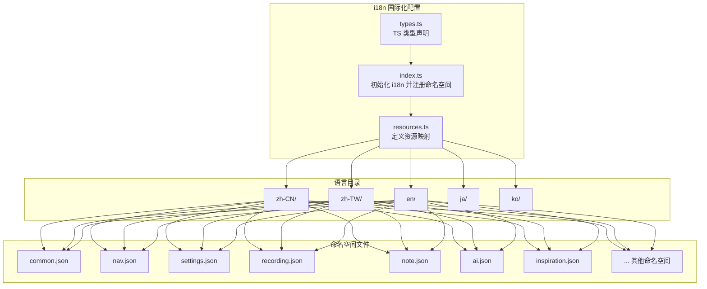
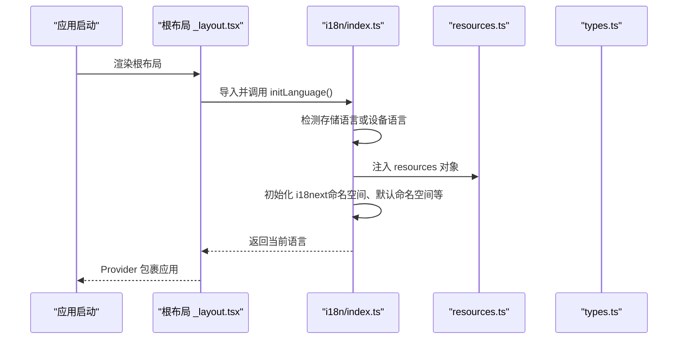
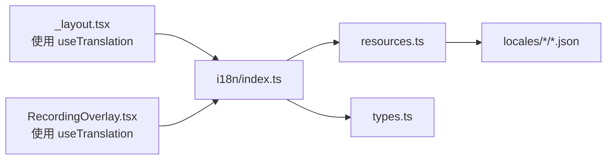
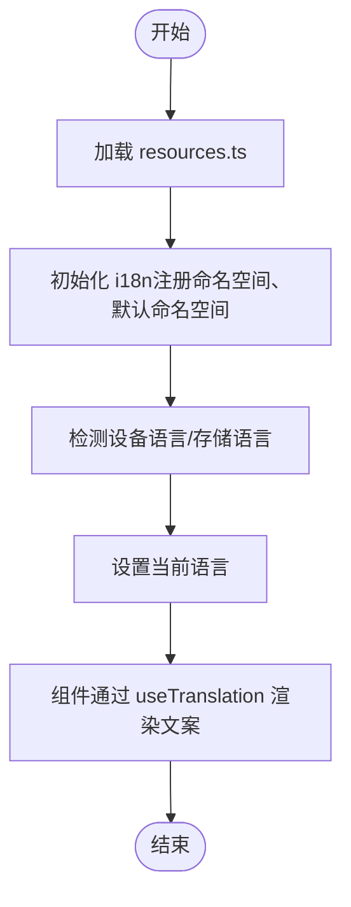

# 翻译资源配置

<cite>
**本文档引用的文件**
- [i18n/resources.ts](file://i18n/resources.ts)
- [i18n/index.ts](file://i18n/index.ts)
- [i18n/types.ts](file://i18n/types.ts)
- [i18n/locales/en/common.json](file://i18n/locales/en/common.json)
- [i18n/locales/en/nav.json](file://i18n/locales/en/nav.json)
- [i18n/locales/en/settings.json](file://i18n/locales/en/settings.json)
- [i18n/locales/en/recording.json](file://i18n/locales/en/recording.json)
- [i18n/locales/en/note.json](file://i18n/locales/en/note.json)
- [i18n/locales/en/ai.json](file://i18n/locales/en/ai.json)
- [i18n/locales/en/inspiration.json](file://i18n/locales/en/inspiration.json)
- [app/_layout.tsx](file://app/_layout.tsx)
- [components/input/RecordingOverlay.tsx](file://components/input/RecordingOverlay.tsx)
</cite>

## 目录
1. [简介](#简介)
2. [项目结构](#项目结构)
3. [核心组件](#核心组件)
4. [架构总览](#架构总览)
5. [详细组件分析](#详细组件分析)
6. [依赖关系分析](#依赖关系分析)
7. [性能考虑](#性能考虑)
8. [故障排查指南](#故障排查指南)
9. [结论](#结论)
10. [附录](#附录)

## 简介
本文件面向 VoiceNote 的翻译资源配置，系统性说明 i18n 资源的组织结构与加载机制，涵盖语言目录命名规范、命名空间（namespace）划分、键值对命名约定、多语言文件同步与版本管理策略、新增与维护流程、格式规范与特殊字符处理、质量保证与一致性检查方法，以及缓存策略与性能优化建议。目标是帮助开发者与翻译人员高效协作，确保多语言体验的一致性与可维护性。

## 项目结构
VoiceNote 的国际化资源位于 i18n 目录，采用“按语言分目录、按功能分命名空间”的双层组织方式：
- 语言目录：zh-CN、zh-TW、en、ja、ko
- 命名空间文件：common、nav、settings、recording、note、ai、inspiration、camera、attachment、voice、stats、category、optimization、search、selection、media、errors、dates、dialog 等

图表来源
- [i18n/resources.ts:1-213](file://i18n/resources.ts#L1-L213)
- [i18n/index.ts:1-76](file://i18n/index.ts#L1-L76)
- [i18n/types.ts:1-45](file://i18n/types.ts#L1-L45)

章节来源
- [i18n/resources.ts:1-213](file://i18n/resources.ts#L1-L213)
- [i18n/index.ts:1-76](file://i18n/index.ts#L1-L76)
- [i18n/types.ts:1-45](file://i18n/types.ts#L1-L45)

## 核心组件
- 资源映射与加载
  - resources.ts 将各语言的命名空间 JSON 文件以命名空间为键聚合到语言代码下，形成只读资源对象，供 i18n 初始化时注入。
- i18n 初始化与命名空间注册
  - index.ts 定义支持的语言列表、设备语言检测逻辑、默认命名空间与命名空间集合，并通过 i18next 初始化。
- TypeScript 类型声明
  - types.ts 为 react-i18next 提供类型增强，限定默认命名空间与可用命名空间键，提升编辑器提示与编译期安全。

章节来源
- [i18n/resources.ts:106-212](file://i18n/resources.ts#L106-L212)
- [i18n/index.ts:6-76](file://i18n/index.ts#L6-L76)
- [i18n/types.ts:21-44](file://i18n/types.ts#L21-L44)

## 架构总览
i18n 初始化流程如下：

图表来源
- [app/_layout.tsx:26-35](file://app/_layout.tsx#L26-L35)
- [i18n/index.ts:57-76](file://i18n/index.ts#L57-L76)
- [i18n/resources.ts:106-212](file://i18n/resources.ts#L106-L212)
- [i18n/types.ts:21-44](file://i18n/types.ts#L21-L44)

## 详细组件分析

### 资源映射与加载机制（resources.ts）
- 组织方式
  - 按语言分组导入各命名空间 JSON 文件，再以命名空间为键聚合到对应语言对象中。
  - 支持 zh-CN、zh-TW、en、ja、ko 五种语言。
- 加载机制
  - 在构建阶段由打包工具静态引入 JSON，运行时直接作为常量对象使用，避免运行时网络请求。
  - 使用 as const 确保类型推断为字面量联合，便于 TS 类型约束。

章节来源
- [i18n/resources.ts:1-213](file://i18n/resources.ts#L1-L213)

### i18n 初始化与命名空间注册（index.ts）
- 支持语言与检测
  - supportedLanguages 定义受支持的语言代码与显示名称。
  - getDeviceLanguage 优先匹配完整语言标签，其次按语言前缀匹配 zh/TW、en、ja、ko 等。
- 命名空间注册
  - allNamespaces 明确列出所有命名空间，确保 i18n 只加载已注册的命名空间，减少冗余。
  - defaultNS 设为 common，ns 数组包含全部命名空间。
- 初始化参数
  - fallbackLng 设为 en，当用户语言不可用时回退。
  - interpolation.escapeValue=false，允许在模板中使用 HTML（如需）。
  - react.useSuspense=false，避免在 SSR/SSG 场景下的等待问题。

章节来源
- [i18n/index.ts:6-76](file://i18n/index.ts#L6-L76)

### TypeScript 类型声明（types.ts）
- 类型增强
  - 通过 CustomTypeOptions 限制 defaultNS 为 common，并限定 resources 中的命名空间键集合。
- 作用
  - 编辑器可提供更精准的键补全与错误提示，避免拼写错误与遗漏命名空间。

章节来源
- [i18n/types.ts:21-44](file://i18n/types.ts#L21-L44)

### 命名空间与文件组织
- 命名空间职责概览
  - common：通用短语与基础交互文案（如保存、取消、确认等）。
  - nav：导航栏与页面标题文案。
  - settings：设置项标题、描述与操作文案。
  - recording：录音与转录相关文案（如录音中、转录中、优化中等）。
  - note：笔记列表、标签、空状态等文案。
  - ai：AI 分析与洞察相关文案。
  - inspiration：灵感库相关文案。
  - camera、attachment、voice、stats、category、optimization、search、selection、media、errors、dates、dialog：分别覆盖相机、附件、语音、统计、分类、优化、搜索、选择、媒体、错误、日期、对话框等场景。
- 键值对命名约定
  - 采用小驼峰命名，语义清晰，避免缩写。
  - 复数与数量使用 ICU 插值语法（如 {{count}}），便于复用与本地化。
  - 布尔状态与模式切换使用语义明确的动词短语（如 editing、transcribing、optimizing）。
- 层级结构
  - 一级命名空间即为文件名（不含扩展名），二级键为具体文案键。
  - 示例：common.appName、nav.notes、settings.theme 等。

章节来源
- [i18n/locales/en/common.json:1-22](file://i18n/locales/en/common.json#L1-L22)
- [i18n/locales/en/nav.json:1-10](file://i18n/locales/en/nav.json#L1-L10)
- [i18n/locales/en/settings.json:1-90](file://i18n/locales/en/settings.json#L1-L90)
- [i18n/locales/en/recording.json:1-16](file://i18n/locales/en/recording.json#L1-L16)
- [i18n/locales/en/note.json:1-35](file://i18n/locales/en/note.json#L1-L35)
- [i18n/locales/en/ai.json:1-33](file://i18n/locales/en/ai.json#L1-L33)
- [i18n/locales/en/inspiration.json:1-20](file://i18n/locales/en/inspiration.json#L1-L20)

### 使用示例与键访问
- 根布局中通过 useTranslation 指定命名空间并渲染标题与返回文案。
- 录音覆盖层中同时使用 recording 与 common 命名空间，实现“录音中”“转录中”“完成”等文案的动态替换。

章节来源
- [app/_layout.tsx:29-82](file://app/_layout.tsx#L29-L82)
- [components/input/RecordingOverlay.tsx:76-384](file://components/input/RecordingOverlay.tsx#L76-L384)

### 多语言文件同步与版本管理
- 同步策略
  - 以 en 为基准语言，其他语言（zh-CN、zh-TW、ja、ko）逐个命名空间对照翻译。
  - 命名空间与键保持一致，便于自动化比对与差异扫描。
- 版本管理
  - 建议在每次新增/修改命名空间或键时，更新版本号并在变更日志中标注受影响的命名空间。
  - 通过 Git 提交记录追踪每个语言文件的变更历史，便于回滚与审计。

章节来源
- [i18n/resources.ts:106-212](file://i18n/resources.ts#L106-L212)
- [i18n/index.ts:34-55](file://i18n/index.ts#L34-L55)

### 添加与维护流程
- 新增命名空间
  - 在每个语言目录下创建同名 JSON 文件（如 myns.json）。
  - 在 resources.ts 中按语言导入该文件，并在对应语言对象下注册。
  - 在 index.ts 的 allNamespaces 中加入新命名空间，确保 i18n 正常加载。
  - 在 types.ts 中补充 TS 类型声明，保持类型安全。
- 更新现有资源
  - 修改键值或新增键后，确保所有语言文件同步更新。
  - 如涉及 UI 使用，先在本地验证渲染效果，再提交 PR。
- 删除命名空间
  - 移除 resources.ts、index.ts、types.ts 中的对应条目，并清理各语言目录下的 JSON 文件。

章节来源
- [i18n/resources.ts:106-212](file://i18n/resources.ts#L106-L212)
- [i18n/index.ts:34-55](file://i18n/index.ts#L34-L55)
- [i18n/types.ts:21-44](file://i18n/types.ts#L21-L44)

### 格式规范与特殊字符处理
- JSON 规范
  - 使用 UTF-8 编码，键为字符串，值为字符串或 ICU 插值占位符。
  - 避免在键中使用空格与特殊字符，统一使用小驼峰。
- ICU 插值
  - 使用 {{count}} 等占位符进行数量与变量替换，确保在不同语言中正确渲染。
- 特殊字符
  - 避免在文案中硬编码换行与制表符；必要时通过样式控制。
  - 如需富文本，保持最小化，避免破坏排版。

章节来源
- [i18n/locales/en/note.json:11-11](file://i18n/locales/en/note.json#L11-L11)
- [i18n/locales/en/inspiration.json:9-9](file://i18n/locales/en/inspiration.json#L9-L9)

### 翻译质量保证与一致性检查
- 键一致性检查
  - 通过脚本对比各语言目录下命名空间文件的键集合，发现缺失或多余键。
- 文案一致性
  - 建立术语表，统一关键术语（如“录音”“转录”“优化”）的翻译。
- UI 验证
  - 在多语言环境下测试 UI 截断、换行与对齐问题。
- 自动化校验
  - 在 CI 中增加 JSON 语法检查与键集合比对任务，防止回归。

[本节为通用指导，无需特定文件引用]

### 翻译缓存策略与性能优化
- 构建期缓存
  - resources.ts 将 JSON 以常量形式注入，避免运行时解析与网络请求，降低首屏延迟。
- 运行时缓存
  - i18next 默认缓存已加载的命名空间与语言包，减少重复解析成本。
- 命名空间懒加载
  - 仅注册已使用的命名空间（allNamespaces），避免加载未使用资源。
- 优化建议
  - 控制单文件键数量，避免单一命名空间过大导致内存占用上升。
  - 合理拆分命名空间，按页面或功能模块划分，便于维护与增量更新。

章节来源
- [i18n/resources.ts:106-212](file://i18n/resources.ts#L106-L212)
- [i18n/index.ts:34-66](file://i18n/index.ts#L34-L66)

## 依赖关系分析
- 组件耦合
  - app/_layout.tsx 与 components/input/RecordingOverlay.tsx 通过 useTranslation 使用 i18n，但不直接依赖具体 JSON 文件。
  - i18n/index.ts 依赖 resources.ts 与 types.ts，形成稳定的初始化链路。
- 外部依赖
  - i18next 与 react-i18next 提供核心国际化能力。
  - expo-localization 用于设备语言检测。

图表来源
- [app/_layout.tsx:29-82](file://app/_layout.tsx#L29-L82)
- [components/input/RecordingOverlay.tsx:76-384](file://components/input/RecordingOverlay.tsx#L76-L384)
- [i18n/index.ts:1-76](file://i18n/index.ts#L1-L76)
- [i18n/resources.ts:1-213](file://i18n/resources.ts#L1-L213)
- [i18n/types.ts:1-45](file://i18n/types.ts#L1-L45)

章节来源
- [app/_layout.tsx:29-82](file://app/_layout.tsx#L29-L82)
- [components/input/RecordingOverlay.tsx:76-384](file://components/input/RecordingOverlay.tsx#L76-L384)
- [i18n/index.ts:1-76](file://i18n/index.ts#L1-L76)
- [i18n/resources.ts:1-213](file://i18n/resources.ts#L1-L213)
- [i18n/types.ts:1-45](file://i18n/types.ts#L1-L45)

## 性能考虑
- 静态资源加载：JSON 以常量形式注入，避免运行时解析与网络请求，显著降低冷启动时间。
- 命名空间裁剪：仅注册已使用命名空间，减少内存占用与初始化开销。
- 类型预编译：TS 类型声明在构建期参与类型检查，减少运行时错误与回退成本。

[本节为通用指导，无需特定文件引用]

## 故障排查指南
- 语言不生效
  - 检查设备语言是否在 supportedLanguages 中，或存储语言是否有效。
  - 确认 initLanguage 已被调用且返回正确语言代码。
- 文案缺失或回退
  - 确认目标命名空间已在 allNamespaces 中注册。
  - 检查对应语言目录下是否存在目标键，或是否误删/拼错。
- 类型报错
  - 在 types.ts 中补充缺失的命名空间类型，确保 resources 与类型声明一致。
- UI 渲染异常
  - 检查插值占位符是否与调用处一致，避免运行时报错。

章节来源
- [i18n/index.ts:68-76](file://i18n/index.ts#L68-L76)
- [i18n/index.ts:34-55](file://i18n/index.ts#L34-L55)
- [i18n/types.ts:21-44](file://i18n/types.ts#L21-L44)

## 结论
VoiceNote 的翻译资源配置采用“按语言分目录、按命名空间分文件”的清晰结构，配合 i18next 的静态资源注入与命名空间注册机制，实现了高性能、可维护的多语言支持。通过统一的命名约定、类型约束与同步流程，团队可以高效地扩展与维护翻译资源，确保用户体验的一致性与稳定性。

[本节为总结性内容，无需特定文件引用]

## 附录
- 常用命名空间速览
  - common、nav、settings、recording、note、ai、inspiration、camera、attachment、voice、stats、category、optimization、search、selection、media、errors、dates、dialog
- 关键流程图（命名空间加载）

图表来源
- [i18n/resources.ts:106-212](file://i18n/resources.ts#L106-L212)
- [i18n/index.ts:57-76](file://i18n/index.ts#L57-L76)