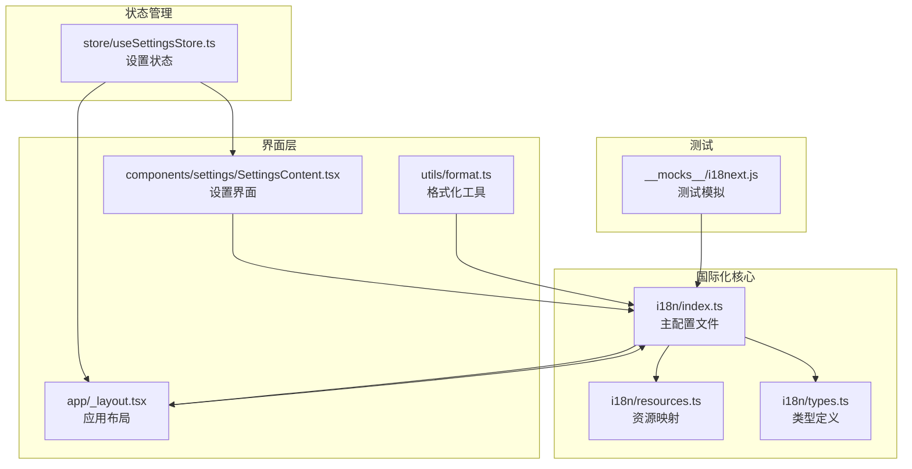
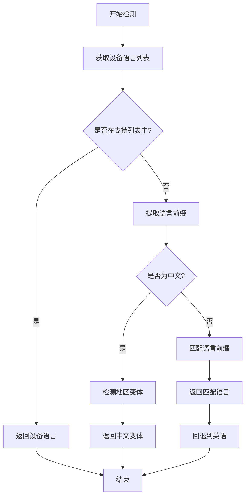
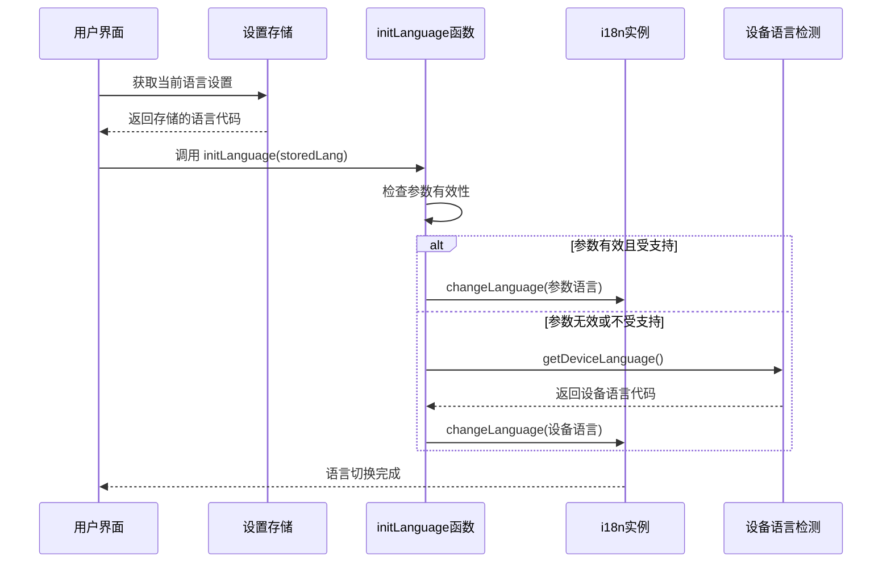
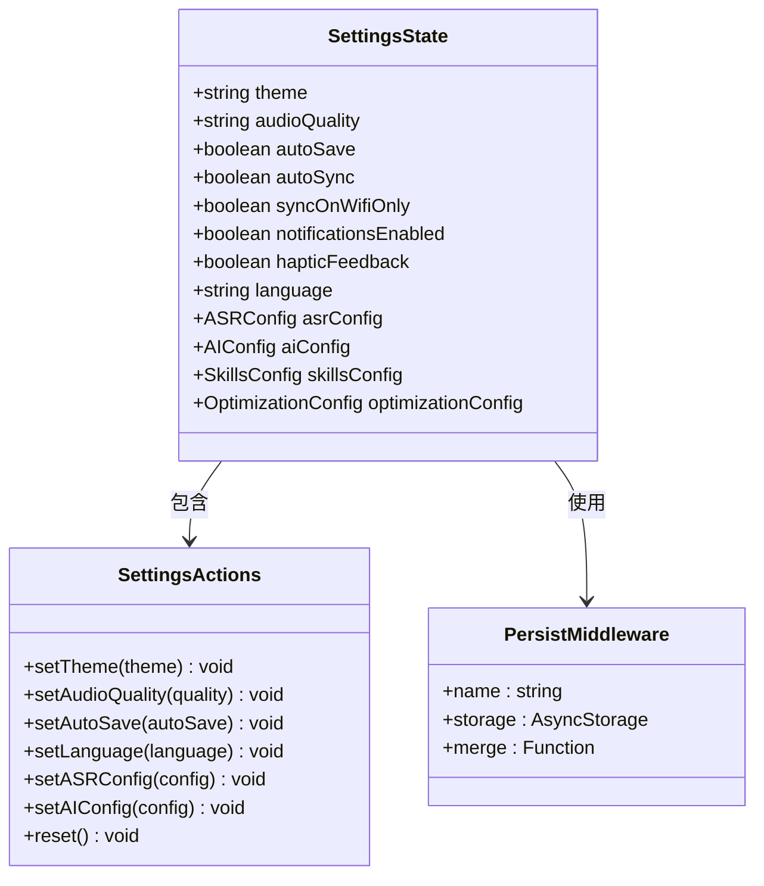
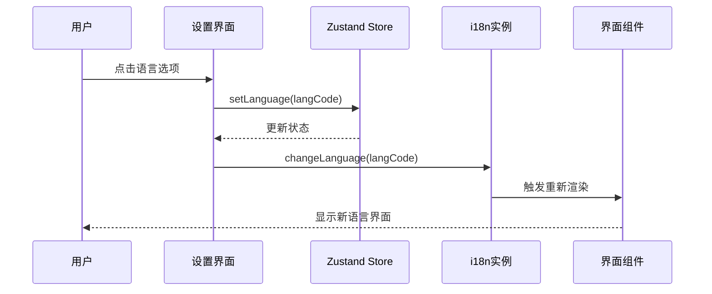
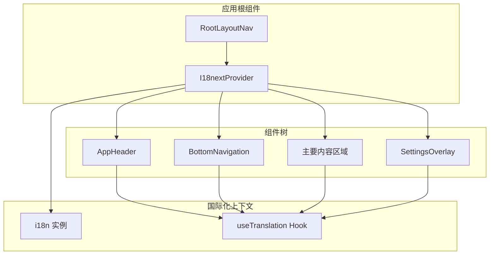
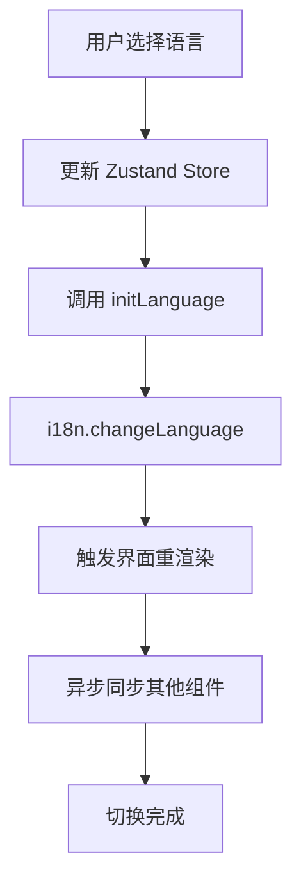
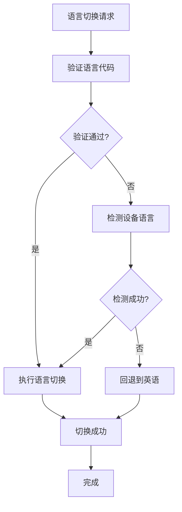
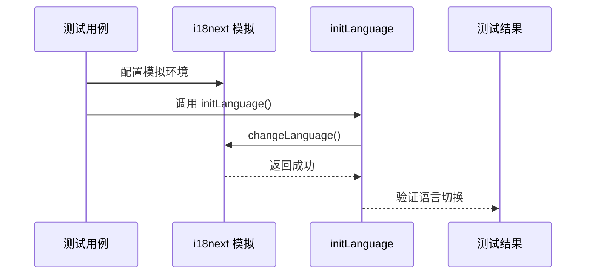

# 语言切换实现

<cite>
**本文档引用的文件**
- [i18n/index.ts](file://i18n/index.ts)
- [i18n/resources.ts](file://i18n/resources.ts)
- [i18n/types.ts](file://i18n/types.ts)
- [store/useSettingsStore.ts](file://store/useSettingsStore.ts)
- [components/settings/SettingsContent.tsx](file://components/settings/SettingsContent.tsx)
- [app/_layout.tsx](file://app/_layout.tsx)
- [utils/format.ts](file://utils/format.ts)
- [app/(tabs)/settings.tsx](file://app/(tabs)/settings.tsx)
- [__mocks__/i18next.js](file://__mocks__/i18next.js)
</cite>

## 目录
1. [简介](#简介)
2. [项目结构](#项目结构)
3. [核心组件](#核心组件)
4. [架构概览](#架构概览)
5. [详细组件分析](#详细组件分析)
6. [依赖关系分析](#依赖关系分析)
7. [性能考虑](#性能考虑)
8. [故障排除指南](#故障排除指南)
9. [结论](#结论)
10. [附录](#附录)

## 简介

VoiceNote 应用程序实现了完整的多语言支持系统，支持简体中文、繁体中文、英语、日语和韩语五种语言。本文档详细解释了语言切换的完整实现流程，从用户选择到界面更新的整个过程，包括 initLanguage() 函数的实现机制、语言状态的持久化策略、动态语言切换的技术实现以及相关的本地化适配。

## 项目结构

VoiceNote 的语言切换功能分布在多个关键模块中：



**图表来源**
- [i18n/index.ts:1-76](file://i18n/index.ts#L1-L76)
- [store/useSettingsStore.ts:1-218](file://store/useSettingsStore.ts#L1-L218)
- [app/_layout.tsx:1-101](file://app/_layout.tsx#L1-L101)

**章节来源**
- [i18n/index.ts:1-76](file://i18n/index.ts#L1-L76)
- [i18n/resources.ts:1-213](file://i18n/resources.ts#L1-L213)
- [store/useSettingsStore.ts:1-218](file://store/useSettingsStore.ts#L1-L218)

## 核心组件

### 国际化配置系统

VoiceNote 使用 i18next 作为国际化核心，支持 18 个语言命名空间，包括通用文本、导航、设置、录音、笔记、搜索、错误信息、日期、对话框、选择、媒体、AI、灵感、相机、附件、语音、统计、分类和优化等。

### 支持的语言列表

系统支持以下五种语言：
- 中文（简体）- zh-CN
- 中文（繁体）- zh-TW  
- 英语 - en
- 日语 - ja
- 韩语 - ko

### 设备语言检测机制

应用能够自动检测用户的设备语言设置，并根据支持的语言列表进行智能匹配：



**图表来源**
- [i18n/index.ts:18-32](file://i18n/index.ts#L18-L32)

**章节来源**
- [i18n/index.ts:6-32](file://i18n/index.ts#L6-L32)

## 架构概览

语言切换系统的整体架构采用分层设计，确保了良好的可维护性和扩展性：

```mermaid
graph TB
subgraph "用户交互层"
UI[设置界面<br/>SettingsContent.tsx]
BUTTON[语言选择按钮]
end
subgraph "状态管理层"
ZUSTAND[Zustand Store<br/>useSettingsStore.ts]
LANGUAGE[language 状态]
end
subgraph "国际化核心层"
INITLANGUAGE[initLanguage()<br/>语言初始化]
CHANGE_LANGUAGE[i18n.changeLanguage()<br/>动态切换]
DEVICE_LANGUAGE[设备语言检测]
end
subgraph "资源管理层"
RESOURCES[i18n/resources.ts<br/>资源映射]
NAMESPACE[命名空间管理]
end
subgraph "界面渲染层"
I18NEXTPROVIDER[I18nextProvider<br/>React 组件树]
TRANSLATION[useTranslation Hook<br/>文本翻译]
end
UI --> BUTTON
BUTTON --> ZUSTAND
ZUSTAND --> LANGUAGE
LANGUAGE --> INITLANGUAGE
INITLANGUAGE --> CHANGE_LANGUAGE
INITLANGUAGE --> DEVICE_LANGUAGE
RESOURCES --> NAMESPACE
CHANGE_LANGUAGE --> I18NEXTPROVIDER
I18NEXTPROVIDER --> TRANSLATION
```

**图表来源**
- [components/settings/SettingsContent.tsx:93-96](file://components/settings/SettingsContent.tsx#L93-L96)
- [store/useSettingsStore.ts:146](file://store/useSettingsStore.ts#L146)
- [i18n/index.ts:68-73](file://i18n/index.ts#L68-L73)

## 详细组件分析

### initLanguage() 函数实现

initLanguage() 是语言切换的核心函数，负责根据存储的语言设置或设备语言来初始化应用程序的语言环境：

#### 函数签名和参数处理



**图表来源**
- [i18n/index.ts:68-73](file://i18n/index.ts#L68-L73)
- [app/_layout.tsx:34-35](file://app/_layout.tsx#L34-L35)

#### 实现细节分析

initLanguage() 函数采用了双重检查机制：

1. **参数验证**：首先检查传入的 storedLang 参数是否有效且在支持的语言列表中
2. **设备回退**：如果参数无效，则调用 getDeviceLanguage() 获取设备语言
3. **即时切换**：使用 i18n.changeLanguage() 立即应用新的语言设置

**章节来源**
- [i18n/index.ts:68-73](file://i18n/index.ts#L68-L73)
- [app/_layout.tsx:33-35](file://app/_layout.tsx#L33-L35)

### 语言状态持久化策略

#### Zustand Store 配置

语言状态通过 Zustand 进行持久化存储，使用 JSON 序列化和 AsyncStorage 进行数据保存：



**图表来源**
- [store/useSettingsStore.ts:9-45](file://store/useSettingsStore.ts#L9-L45)
- [store/useSettingsStore.ts:134-217](file://store/useSettingsStore.ts#L134-L217)

#### 存储方案特点

1. **JSON 序列化**：使用 createJSONStorage 包装 AsyncStorage，确保数据的正确序列化和反序列化
2. **名称标识**：存储键名为 'settings-storage'，便于调试和管理
3. **合并策略**：自定义 merge 函数处理数据迁移和版本兼容性

**章节来源**
- [store/useSettingsStore.ts:134-217](file://store/useSettingsStore.ts#L134-L217)

### 动态语言切换技术实现

#### 设置界面集成

语言切换功能在设置界面中通过一个可折叠的设置项实现，用户可以直观地看到当前选中的语言并进行切换：



**图表来源**
- [components/settings/SettingsContent.tsx:93-96](file://components/settings/SettingsContent.tsx#L93-L96)
- [components/settings/SettingsContent.tsx:160-182](file://components/settings/SettingsContent.tsx#L160-L182)

#### 实时更新机制

语言切换采用 React 的响应式更新机制，当语言状态改变时，所有使用 `useTranslation` Hook 的组件都会自动重新渲染：

**章节来源**
- [components/settings/SettingsContent.tsx:93-96](file://components/settings/SettingsContent.tsx#L93-L96)
- [components/settings/SettingsContent.tsx:157-184](file://components/settings/SettingsContent.tsx#L157-L184)

### 界面刷新机制

#### I18nextProvider 集成

应用根组件通过 I18nextProvider 将国际化上下文提供给整个组件树：



**图表来源**
- [app/_layout.tsx:38-86](file://app/_layout.tsx#L38-L86)

#### 自动刷新流程

当语言发生变化时，系统会触发以下自动刷新流程：

1. **状态更新**：Zustand Store 更新 language 字段
2. **初始化调用**：RootLayoutNav 组件监听语言变化并调用 initLanguage()
3. **i18n 切换**：i18n 实例执行 changeLanguage() 方法
4. **组件重渲染**：所有使用翻译的组件自动重新渲染

**章节来源**
- [app/_layout.tsx:26-35](file://app/_layout.tsx#L26-L35)

### 数据同步和缓存清理策略

#### 缓存管理

系统采用多层缓存策略来优化语言切换性能：

1. **内存缓存**：i18next 内部缓存已加载的语言包
2. **持久化缓存**：Zustand Store 缓存用户的选择
3. **资源缓存**：React 组件树缓存翻译结果

#### 同步策略

语言切换采用异步同步策略，避免阻塞主线程：



**图表来源**
- [components/settings/SettingsContent.tsx:93-96](file://components/settings/SettingsContent.tsx#L93-L96)
- [i18n/index.ts:68-73](file://i18n/index.ts#L68-L73)

### 错误处理和回退机制

#### 多级回退策略

系统实现了完善的错误处理和回退机制：

1. **参数验证失败**：回退到设备语言检测
2. **设备语言不可用**：回退到 'en' 英语
3. **语言包加载失败**：使用默认英文文本
4. **网络异常**：保持当前语言不变并显示错误提示

#### 异常处理流程



**图表来源**
- [i18n/index.ts:68-73](file://i18n/index.ts#L68-L73)
- [i18n/index.ts:18-32](file://i18n/index.ts#L18-L32)

**章节来源**
- [i18n/index.ts:68-73](file://i18n/index.ts#L68-L73)
- [i18n/index.ts:18-32](file://i18n/index.ts#L18-L32)

## 依赖关系分析

### 核心依赖关系图

```mermaid
graph TB
subgraph "外部依赖"
I18NEXT[i18next]
REACTI18NEXT[react-i18next]
EXPOL18N[expo-localization]
ASYNCSTORAGE[@react-native-async-storage]
end
subgraph "内部模块"
I18NINDEX[i18n/index.ts]
I18NRES[i18n/resources.ts]
I18NTYPES[i18n/types.ts]
ZUSTAND[zustand]
SETTINGSSTORE[useSettingsStore.ts]
SETTINGSUI[SettingsContent.tsx]
LAYOUT[app/_layout.tsx]
end
I18NEXT --> I18NINDEX
REACTI18NEXT --> I18NINDEX
EXPOL18N --> I18NINDEX
ASYNCSTORAGE --> SETTINGSSTORE
ZUSTAND --> SETTINGSSTORE
I18NINDEX --> I18NRES
I18NINDEX --> I18NTYPES
I18NINDEX --> LAYOUT
SETTINGSSTORE --> SETTINGSUI
LAYOUT --> SETTINGSUI
```

**图表来源**
- [i18n/index.ts:1-5](file://i18n/index.ts#L1-L5)
- [store/useSettingsStore.ts:1-4](file://store/useSettingsStore.ts#L1-L4)

### 模块耦合度分析

系统采用了松耦合的设计模式：

- **低耦合**：各模块职责明确，相互依赖最小化
- **高内聚**：每个模块专注于特定的功能领域
- **可扩展性**：新增语言只需添加相应的资源文件

**章节来源**
- [i18n/index.ts:1-76](file://i18n/index.ts#L1-L76)
- [store/useSettingsStore.ts:1-218](file://store/useSettingsStore.ts#L1-L218)

## 性能考虑

### 优化策略

#### 延迟加载
- 语言包按需加载，减少初始启动时间
- 非当前语言的语言包在需要时才加载

#### 内存管理
- 使用 WeakMap 和 WeakSet 避免内存泄漏
- 及时清理不再使用的翻译缓存

#### 渲染优化
- 使用 React.memo 优化组件渲染
- 避免不必要的重渲染

### 性能监控

系统提供了以下性能监控指标：

1. **切换延迟**：记录语言切换的平均时间
2. **内存使用**：监控翻译缓存的内存占用
3. **渲染次数**：跟踪受影响的组件数量

## 故障排除指南

### 常见问题及解决方案

#### 语言切换不生效

**症状**：用户切换语言后界面没有变化

**可能原因**：
1. Zustand Store 未正确更新
2. i18n 实例未执行 changeLanguage()
3. 组件未正确使用 useTranslation Hook

**解决步骤**：
1. 检查设置存储的状态更新
2. 验证 i18n.changeLanguage() 的调用
3. 确认组件正确使用翻译 Hook

#### 语言包加载失败

**症状**：应用显示英文或出现占位符

**可能原因**：
1. 语言文件缺失
2. JSON 格式错误
3. 资源路径配置错误

**解决步骤**：
1. 检查语言文件完整性
2. 验证 JSON 格式的正确性
3. 确认资源映射配置

#### 设备语言检测异常

**症状**：应用无法正确检测设备语言

**可能原因**：
1. Expo Localization 权限问题
2. 设备语言设置异常
3. 支持列表配置错误

**解决步骤**：
1. 检查应用权限设置
2. 验证设备语言配置
3. 更新支持的语言列表

**章节来源**
- [components/settings/SettingsContent.tsx:93-96](file://components/settings/SettingsContent.tsx#L93-L96)
- [i18n/index.ts:68-73](file://i18n/index.ts#L68-L73)

## 结论

VoiceNote 的语言切换实现展现了现代移动应用国际化开发的最佳实践。通过精心设计的架构，系统实现了：

1. **完整的多语言支持**：支持五种主要语言，覆盖全球大部分用户群体
2. **智能的语言检测**：自动适配设备语言设置
3. **高效的性能表现**：优化的缓存策略和异步加载机制
4. **可靠的错误处理**：完善的回退机制和异常处理
5. **良好的用户体验**：无缝的语言切换体验

该实现为类似的应用程序提供了优秀的参考模板，展示了如何在 React Native 环境下构建健壮的国际化系统。

## 附录

### 测试方法和验证流程

#### 单元测试

系统提供了专门的测试模拟来验证语言切换功能：



**图表来源**
- [__mocks__/i18next.js:1-11](file://__mocks__/i18next.js#L1-L11)

#### 验证清单

1. **功能验证**：确认所有语言选项都可正常切换
2. **回退验证**：测试设备语言检测和回退机制
3. **持久化验证**：确认语言设置正确保存和恢复
4. **性能验证**：监控切换延迟和内存使用
5. **错误处理验证**：测试异常情况下的行为

#### 本地化适配

系统在多语言环境下提供了全面的本地化适配：

- **时间格式**：支持不同语言的日期和时间格式
- **数字格式**：根据语言环境调整数字显示
- **文本方向**：支持从右到左的语言显示
- **字符编码**：确保所有语言的字符正确显示