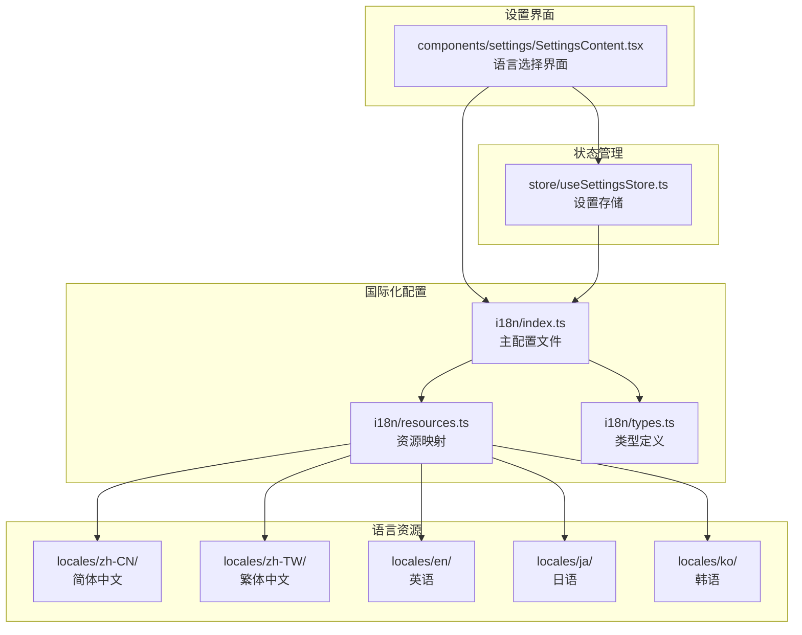
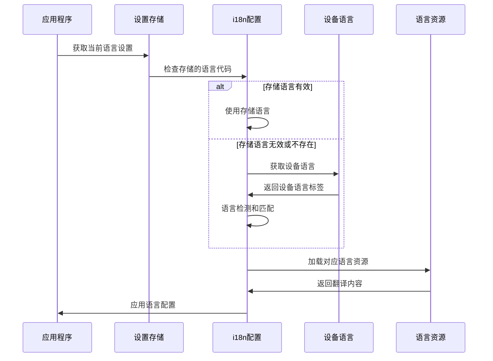
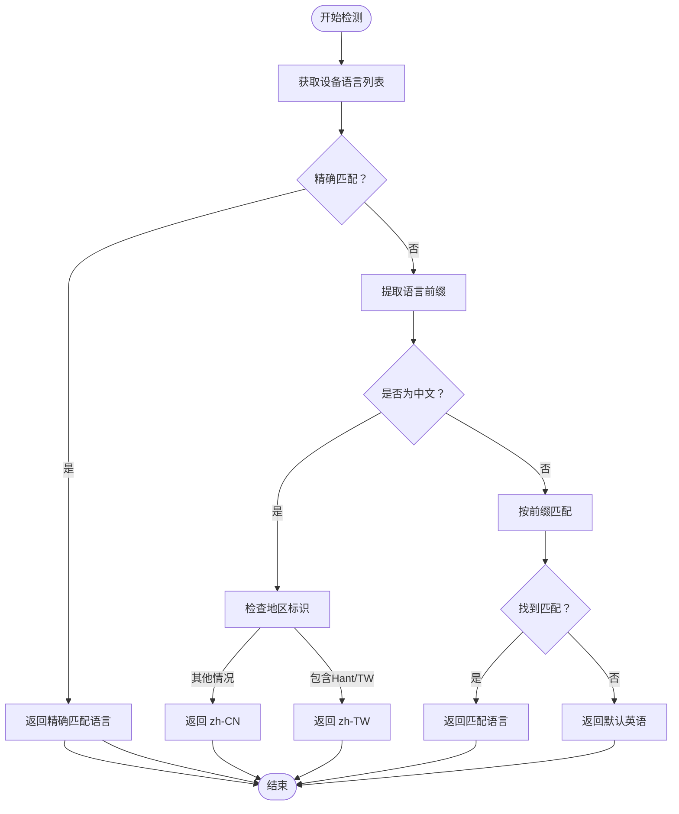
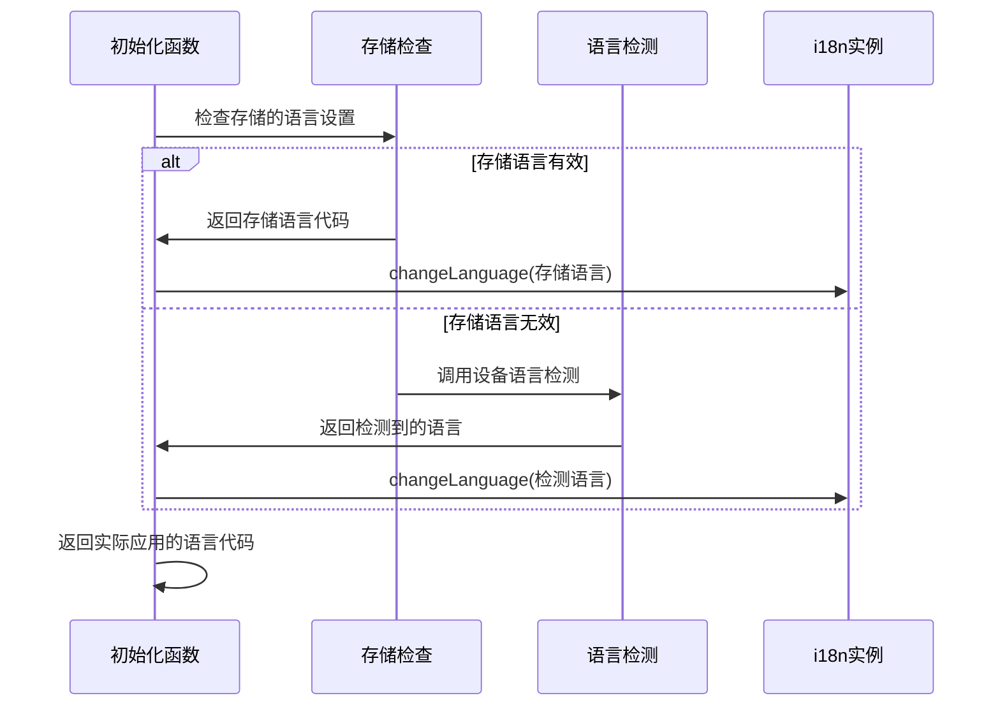
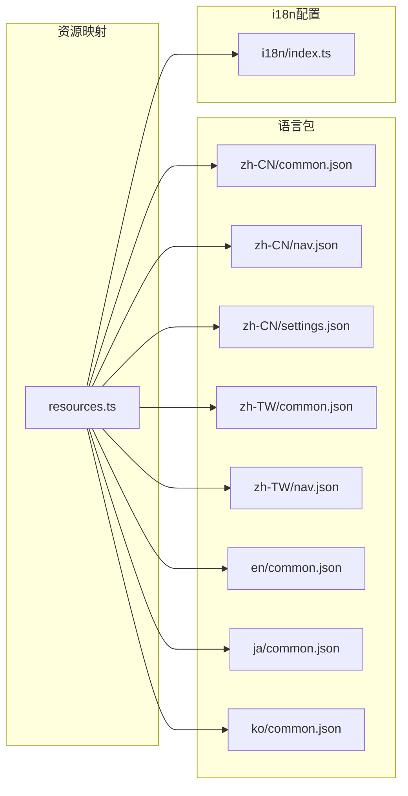
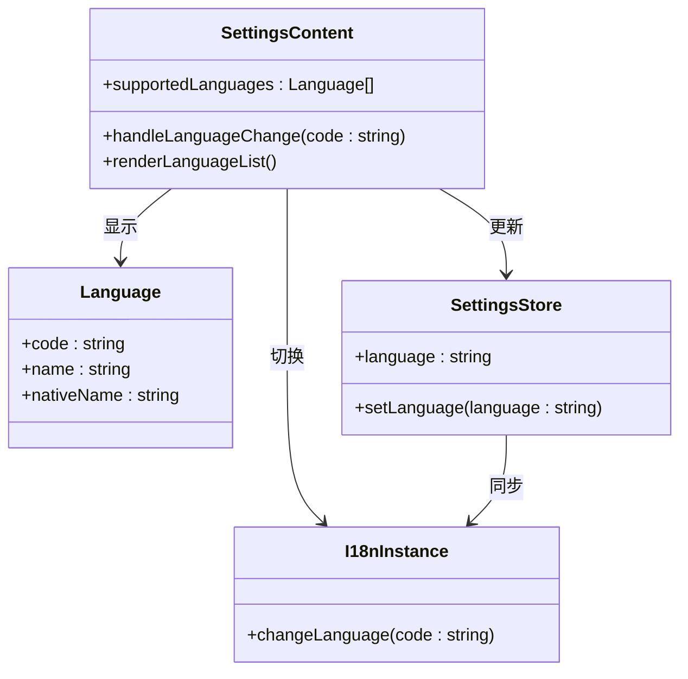
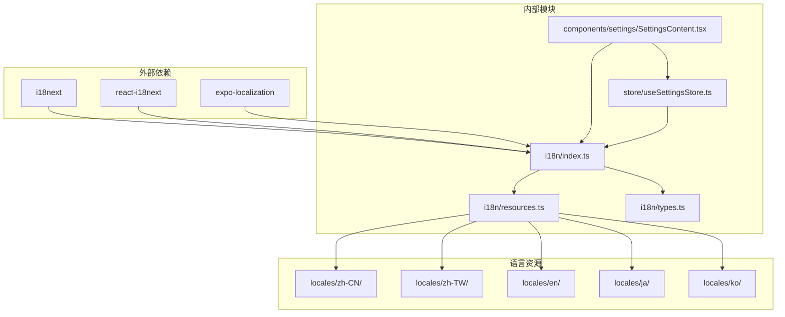

# 语言配置管理

<cite>
**本文档引用的文件**
- [i18n/index.ts](file://i18n/index.ts)
- [i18n/resources.ts](file://i18n/resources.ts)
- [i18n/types.ts](file://i18n/types.ts)
- [components/settings/SettingsContent.tsx](file://components/settings/SettingsContent.tsx)
- [store/useSettingsStore.ts](file://store/useSettingsStore.ts)
</cite>

## 目录
1. [简介](#简介)
2. [项目结构](#项目结构)
3. [核心组件](#核心组件)
4. [架构概览](#架构概览)
5. [详细组件分析](#详细组件分析)
6. [依赖关系分析](#依赖关系分析)
7. [性能考虑](#性能考虑)
8. [故障排除指南](#故障排除指南)
9. [结论](#结论)

## 简介

VoiceNote 项目的语言配置管理系统基于 i18next 国际化库构建，提供了多语言支持功能。该系统包含支持的语言列表配置、设备语言检测机制、语言初始化流程以及存储语言优先级等功能。系统支持简体中文、繁体中文、英语、日语和韩语五种语言，并通过智能的语言检测和回退策略确保用户获得最佳的语言体验。

## 项目结构

语言配置管理系统的文件组织结构如下：

**图表来源**
- [i18n/index.ts:1-76](file://i18n/index.ts#L1-L76)
- [i18n/resources.ts:1-213](file://i18n/resources.ts#L1-L213)
- [components/settings/SettingsContent.tsx:150-184](file://components/settings/SettingsContent.tsx#L150-L184)
- [store/useSettingsStore.ts:1-218](file://store/useSettingsStore.ts#L1-L218)

## 核心组件

### 支持的语言列表

系统定义了 `supportedLanguages` 数组来管理所有支持的语言配置：

| 语言代码 | 英文名称 | 本地名称 |
|---------|----------|----------|
| zh-CN | Simplified Chinese | 简体中文 |
| zh-TW | Traditional Chinese | 繁體中文 |
| en | English | English |
| ja | Japanese | 日本語 |
| ko | Korean | 한국어 |

每个语言对象包含三个关键属性：
- `code`: ISO 639-1 或 ISO 639-1+ISO 3166-1 alpha-2 格式的语言代码
- `name`: 英文语言名称
- `nativeName`: 语言的本地名称显示

**章节来源**
- [i18n/index.ts:6-12](file://i18n/index.ts#L6-L12)

### 语言代码验证数组

系统使用 `supportedCodes` 数组作为语言代码的验证基准，通过映射 `supportedLanguages` 中的所有语言代码来创建验证列表。

**章节来源**
- [i18n/index.ts:16](file://i18n/index.ts#L16)

## 架构概览

语言配置管理系统的整体架构采用分层设计：

**图表来源**
- [i18n/index.ts:68-73](file://i18n/index.ts#L68-L73)
- [i18n/index.ts:18-32](file://i18n/index.ts#L18-L32)
- [store/useSettingsStore.ts:146](file://store/useSettingsStore.ts#L146)

## 详细组件分析

### 设备语言检测机制

`getDeviceLanguage()` 函数实现了智能的设备语言检测和匹配逻辑：

**图表来源**
- [i18n/index.ts:18-32](file://i18n/index.ts#L18-L32)

检测机制的关键特性：

1. **精确匹配优先**: 首先检查设备语言与支持列表的完全匹配
2. **语言前缀处理**: 对于不完全匹配的语言，提取语言代码的前缀部分
3. **中文特殊处理**: 针对中文语言（zh）进行地区区分（zh-TW vs zh-CN）
4. **默认回退策略**: 如果无法匹配任何语言，默认使用英语

**章节来源**
- [i18n/index.ts:18-32](file://i18n/index.ts#L18-L32)

### 初始化流程

`initLanguage()` 函数负责语言配置的初始化过程：

**图表来源**
- [i18n/index.ts:68-73](file://i18n/index.ts#L68-L73)

初始化流程的特点：

1. **存储优先**: 优先使用用户在设置中保存的语言偏好
2. **智能回退**: 当存储的语言无效时，自动检测设备语言
3. **即时应用**: 初始化后立即应用到 i18n 实例

**章节来源**
- [i18n/index.ts:68-73](file://i18n/index.ts#L68-L73)

### 语言资源管理

系统使用 `resources.ts` 文件集中管理所有语言资源的导入和映射：

**图表来源**
- [i18n/resources.ts:106-212](file://i18n/resources.ts#L106-L212)
- [i18n/index.ts:3-4](file://i18n/index.ts#L3-L4)

**章节来源**
- [i18n/resources.ts:1-213](file://i18n/resources.ts#L1-L213)

### 设置界面集成

语言选择界面通过 `SettingsContent.tsx` 实现用户交互：

**图表来源**
- [components/settings/SettingsContent.tsx:150-184](file://components/settings/SettingsContent.tsx#L150-L184)
- [store/useSettingsStore.ts:146](file://store/useSettingsStore.ts#L146)

**章节来源**
- [components/settings/SettingsContent.tsx:93-96](file://components/settings/SettingsContent.tsx#L93-L96)
- [components/settings/SettingsContent.tsx:158-184](file://components/settings/SettingsContent.tsx#L158-L184)

## 依赖关系分析

语言配置管理系统的依赖关系图：

**图表来源**
- [i18n/index.ts:1-4](file://i18n/index.ts#L1-L4)
- [components/settings/SettingsContent.tsx:6](file://components/settings/SettingsContent.tsx#L6)
- [store/useSettingsStore.ts:134-135](file://store/useSettingsStore.ts#L134-L135)

**章节来源**
- [i18n/index.ts:1-4](file://i18n/index.ts#L1-L4)
- [i18n/resources.ts:1-213](file://i18n/resources.ts#L1-L213)

## 性能考虑

语言配置管理系统的性能优化策略：

1. **懒加载资源**: 语言资源通过按需导入的方式加载，避免一次性加载所有语言包
2. **缓存机制**: i18next 内置缓存机制，减少重复的翻译查询
3. **最小化重渲染**: 语言切换只影响需要国际化的组件，不会触发整个应用的重渲染
4. **类型安全**: 使用 TypeScript 类型定义确保语言代码的正确性，减少运行时错误

## 故障排除指南

### 常见问题及解决方案

**问题1: 新增语言后无法显示**
- 检查语言代码格式是否符合 ISO 标准
- 确认对应的 `locales/{code}/` 目录是否存在
- 验证 `resources.ts` 中是否添加了相应的资源导入

**问题2: 设备语言检测不准确**
- 检查设备语言设置是否正确
- 确认 `supportedLanguages` 中是否包含该语言
- 验证语言前缀匹配逻辑是否适用

**问题3: 语言切换后界面未更新**
- 确认 `handleLanguageChange` 函数是否正确调用
- 检查 `useSettingsStore` 是否正确更新状态
- 验证 i18n 实例的 `changeLanguage` 方法是否被调用

**章节来源**
- [i18n/index.ts:68-73](file://i18n/index.ts#L68-L73)
- [components/settings/SettingsContent.tsx:93-96](file://components/settings/SettingsContent.tsx#L93-L96)

## 结论

VoiceNote 项目的语言配置管理系统通过精心设计的架构实现了高效、灵活的多语言支持。系统的核心优势包括：

1. **完整的语言覆盖**: 支持五种主要语言，满足全球化需求
2. **智能检测机制**: 自动识别设备语言并提供合理的回退策略
3. **用户友好界面**: 提供直观的语言选择界面
4. **类型安全保障**: 使用 TypeScript 确保语言代码的正确性
5. **易于扩展**: 清晰的架构设计便于添加新的语言支持

该系统为用户提供了无缝的多语言体验，同时保持了良好的性能和可维护性。通过遵循本文档提供的最佳实践，开发者可以轻松地为 VoiceNote 添加新的语言支持。