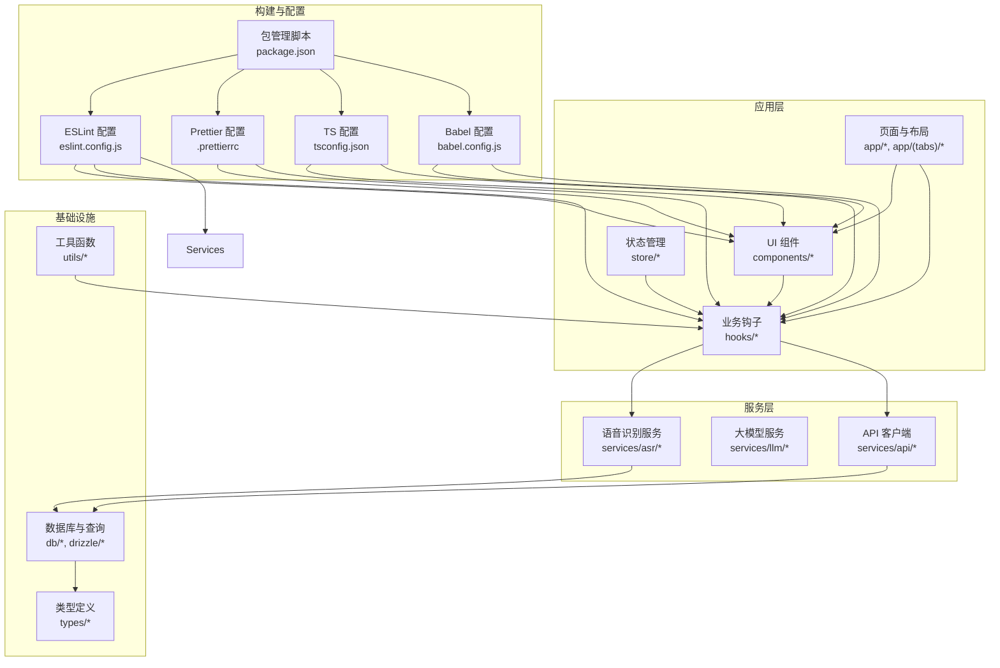
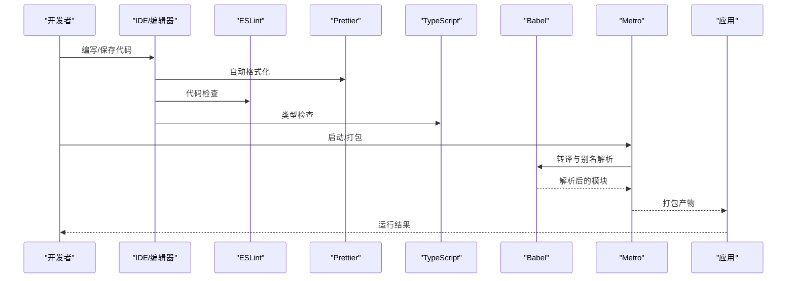
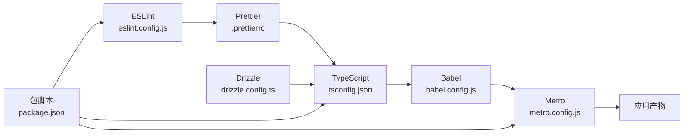

# 代码规范与最佳实践

<cite>
**本文引用的文件**
- [eslint.config.js](file://eslint.config.js)
- [.prettierrc](file://.prettierrc)
- [tsconfig.json](file://tsconfig.json)
- [babel.config.js](file://babel.config.js)
- [package.json](file://package.json)
- [drizzle.config.ts](file://drizzle.config.ts)
- [app.json](file://app.json)
- [metro.config.js](file://metro.config.js)
- [components/note/NoteBlock.tsx](file://components/note/NoteBlock.tsx)
- [hooks/useNotes.ts](file://hooks/useNotes.ts)
- [services/asr/asrService.ts](file://services/asr/asrService.ts)
- [store/useNoteSelectionStore.ts](file://store/useNoteSelectionStore.ts)
</cite>

## 目录
1. [简介](#简介)
2. [项目结构](#项目结构)
3. [核心组件](#核心组件)
4. [架构总览](#架构总览)
5. [详细组件分析](#详细组件分析)
6. [依赖关系分析](#依赖关系分析)
7. [性能考量](#性能考量)
8. [故障排查指南](#故障排查指南)
9. [结论](#结论)
10. [附录](#附录)

## 简介
本文件面向 VoiceNote 项目，系统化梳理并解释当前的代码规范与最佳实践，涵盖以下方面：
- ESLint 规则与配置原理（含 @typescript-eslint/no-unused-vars、@typescript-eslint/no-explicit-any 等）
- Prettier 格式化规则与团队约定
- TypeScript 配置最佳实践（严格模式、模块解析、编译选项等）
- Babel 转译与兼容性设置
- 代码风格指南（命名、文件组织、注释等）
- IDE 自动格式化与代码检查配置建议
- 常见问题与重构建议

## 项目结构
VoiceNote 是一个基于 Expo 的 React Native 应用，采用 TypeScript 开发，并通过 Drizzle ORM 进行 SQLite 数据库管理。项目遵循功能域划分的目录结构，配合路径别名与 Metro/Babel 别名解析，提升可维护性与开发体验。

图表来源
- [tsconfig.json:1-63](file://tsconfig.json#L1-L63)
- [babel.config.js:1-27](file://babel.config.js#L1-L27)
- [eslint.config.js:1-84](file://eslint.config.js#L1-L84)
- [.prettierrc:1-12](file://.prettierrc#L1-L12)
- [package.json:1-83](file://package.json#L1-L83)

章节来源
- [tsconfig.json:1-63](file://tsconfig.json#L1-L63)
- [babel.config.js:1-27](file://babel.config.js#L1-L27)
- [eslint.config.js:1-84](file://eslint.config.js#L1-L84)
- [.prettierrc:1-12](file://.prettierrc#L1-L12)
- [package.json:1-83](file://package.json#L1-L83)

## 核心组件
本节聚焦于与代码规范直接相关的核心配置与实践要点：

- ESLint 配置与规则
  - 使用 typescript-eslint 推荐规则集，并集成 eslint-config-prettier 关闭与 Prettier 冲突的规则
  - 全局环境变量声明（浏览器、Node、React Native、Jest）以减少未定义变量报错
  - 针对测试文件与类型增强文件放宽部分规则，保证灵活性与可维护性
  - 关键规则：
    - @typescript-eslint/no-unused-vars：启用警告，忽略以“_”开头的参数名
    - @typescript-eslint/no-explicit-any：启用警告，测试文件中关闭
    - @typescript-eslint/explicit-module-boundary-types：关闭，避免过度约束
    - @typescript-eslint/no-namespace、@typescript-eslint/no-empty-object-type：针对 types 与 config 文件放宽

- Prettier 格式化规则
  - 分号：开启
  - 尾随逗号：es5
  - 单引号：开启
  - 行宽：100
  - 缩进：2 空格，不使用制表符
  - 对象字面量括号换行：不强制同行
  - 箭头函数括号：始终添加

- TypeScript 配置最佳实践
  - 严格模式：开启 strict
  - 模块解析：baseUrl 与 paths，配合 Babel module-resolver，统一使用 @/*、@components/* 等别名
  - 包含范围：包含所有 .ts/.tsx 与 nativewind-env.d.ts
  - 继承：基于 expo/tsconfig.base

- Babel 转译与兼容性
  - 预设：babel-preset-expo
  - 插件：module-resolver（与 tsconfig paths 保持一致），react-native-reanimated/plugin
  - 缓存：api.cache(true)，提升构建性能

- 包管理与脚本
  - lint：运行 ESLint
  - typecheck：TypeScript 类型检查
  - test/watch/coverage：Jest 测试生态
  - 数据库：drizzle-kit 生成迁移、迁移、推送、打开 Studio

章节来源
- [eslint.config.js:1-84](file://eslint.config.js#L1-L84)
- [.prettierrc:1-12](file://.prettierrc#L1-L12)
- [tsconfig.json:1-63](file://tsconfig.json#L1-L63)
- [babel.config.js:1-27](file://babel.config.js#L1-L27)
- [package.json:1-83](file://package.json#L1-L83)

## 架构总览
下图展示了从编辑器到构建与运行的整体流程，以及代码规范在其中的落地位置。

图表来源
- [eslint.config.js:1-84](file://eslint.config.js#L1-L84)
- [.prettierrc:1-12](file://.prettierrc#L1-L12)
- [tsconfig.json:1-63](file://tsconfig.json#L1-L63)
- [babel.config.js:1-27](file://babel.config.js#L1-L27)
- [metro.config.js:1-8](file://metro.config.js#L1-L8)

## 详细组件分析

### ESLint 配置与规则详解
- 规则作用与配置原理
  - @typescript-eslint/no-unused-vars：用于发现未使用的变量与参数，提升代码整洁度；通过 argsIgnorePattern 忽略以“_”开头的参数，便于占位符场景
  - @typescript-eslint/no-explicit-any：禁止显式 any，鼓励使用更精确的类型或 unknown；在测试文件中关闭，允许灵活的断言与模拟数据
  - @typescript-eslint/explicit-module-boundary-types：关闭，避免对导出接口进行过度约束，提升开发效率
  - @typescript-eslint/no-namespace、@typescript-eslint/no-empty-object-type：在 types 与 config 文件中放宽，支持模块增强与配置文件的灵活性

- 语言环境与全局变量
  - 浏览器：window、document、navigator、fetch 等
  - Node：process、__dirname、require、module
  - React Native：React
  - 测试：jest、describe、it、expect、beforeEach 等

- 忽略规则
  - 第三方依赖、Drizzle 迁移、.expo、dist、*.config.js（保留 .eslint.config.js）

- 测试与类型增强文件
  - 测试文件：禁用 @typescript-eslint/no-explicit-any
  - 类型增强：禁用 @typescript-eslint/no-namespace、@typescript-eslint/no-empty-object-type

章节来源
- [eslint.config.js:1-84](file://eslint.config.js#L1-L84)

### Prettier 格式化规则详解
- 选项说明
  - semi：true（分号）
  - trailingComma：es5（尾随逗号）
  - singleQuote：true（单引号）
  - printWidth：100（行宽）
  - tabWidth：2（缩进宽度）
  - useTabs：false（不使用制表符）
  - bracketSpacing：true（对象字面量括号内空格）
  - bracketSameLine：false（不强制括号同行）
  - arrowParens：always（箭头函数参数括号）

- 团队约定
  - 统一使用 Prettier 自动格式化，避免手动调整格式带来的分歧
  - 与 ESLint 集成，确保保存时自动修复

章节来源
- [.prettierrc:1-12](file://.prettierrc#L1-L12)

### TypeScript 配置最佳实践
- 严格模式
  - strict：开启，提升类型安全与可维护性

- 模块解析与路径别名
  - baseUrl：项目根目录
  - paths：映射 @/*、@components/*、@hooks/*、@services/*、@store/*、@db/*、@theme/*、@types/*、@utils/*
  - 与 Babel module-resolver 保持一致，确保开发与构建一致

- 包含范围
  - 包含所有 .ts/.tsx 与 nativewind-env.d.ts，确保类型覆盖完整

- 继承
  - extends："expo/tsconfig.base"，复用 Expo 推荐配置

章节来源
- [tsconfig.json:1-63](file://tsconfig.json#L1-L63)

### Babel 转译与兼容性设置
- 预设
  - babel-preset-expo：适配 Expo 生态，处理平台特定能力

- 插件
  - module-resolver：与 tsconfig paths 一致，支持绝对导入
  - react-native-reanimated/plugin：支持 Worklet 与动画特性

- 缓存
  - api.cache(true)：缓存转译结果，提升二次构建速度

章节来源
- [babel.config.js:1-27](file://babel.config.js#L1-L27)

### 代码风格指南
- 命名约定
  - 组件与文件：帕斯卡命名（如 NoteBlock.tsx）
  - 变量与函数：驼峰命名（如 useNotes）
  - 常量：大写下划线（如 ASR_TIMEOUT）

- 文件组织
  - 功能域优先：components、hooks、services、store、db、types、utils
  - 路径别名：统一使用 @components、@hooks、@services、@store、@db、@theme、@types、@utils

- 注释规范
  - 公共 API：使用 JSDoc 风格注释，说明用途、参数与返回值
  - 复杂逻辑：补充必要注释，解释设计决策与边界条件

- 导入与导出
  - 优先使用路径别名，避免相对路径过深
  - 统一导出入口（index.ts），简化上层依赖

章节来源
- [components/note/NoteBlock.tsx:1-171](file://components/note/NoteBlock.tsx#L1-L171)
- [hooks/useNotes.ts:1-217](file://hooks/useNotes.ts#L1-L217)
- [store/useNoteSelectionStore.ts:1-49](file://store/useNoteSelectionStore.ts#L1-L49)

### 实际代码示例与正确/错误对比
- 正确示例（片段路径）
  - 使用类型守卫与精确类型替代 any：参考 [services/asr/asrService.ts:39](file://services/asr/asrService.ts#L39-L39)
  - 使用 as const 确保字面量类型：参考 [hooks/useNotes.ts:8-13](file://hooks/useNotes.ts#L8-L13)
  - 使用路径别名导入：参考 [hooks/useNotes.ts:1-2](file://hooks/useNotes.ts#L1-L2)
  - 使用 useCallback 优化渲染：参考 [components/note/NoteBlock.tsx:42-53](file://components/note/NoteBlock.tsx#L42-L53)

- 错误示例（片段路径）
  - 显式 any 的使用：参考 [services/asr/asrService.ts:39](file://services/asr/asrService.ts#L39-L39)
  - 非空断言（!）的使用：参考 [hooks/useNotes.ts:39-40](file://hooks/useNotes.ts#L39-L40)
  - 相对路径过深：参考 [components/note/NoteBlock.tsx:6-6](file://components/note/NoteBlock.tsx#L6-L6)

章节来源
- [services/asr/asrService.ts:1-74](file://services/asr/asrService.ts#L1-L74)
- [hooks/useNotes.ts:1-217](file://hooks/useNotes.ts#L1-L217)
- [components/note/NoteBlock.tsx:1-171](file://components/note/NoteBlock.tsx#L1-L171)

### IDE 自动格式化与代码检查配置
- VS Code 推荐扩展
  - ESLint：实时显示与修复
  - Prettier：保存时自动格式化
  - TypeScript Importer：自动导入类型与模块
  - Path Intellisense：路径别名智能提示

- 设置要点
  - editor.formatOnSave：true
  - editor.codeActionsOnSave：启用 ESLint 自动修复
  - [eslint.validate]：包含 typescript、typescriptreact
  - [typescript.preferences.importModuleSpecifier]：保持一致性
  - [typescript.preferences.importModuleSpecifierEnding]：保持一致性

- 与项目配置联动
  - ESLint：使用项目根 eslint.config.js
  - Prettier：使用 .prettierrc
  - TypeScript：使用 tsconfig.json
  - Babel：使用 babel.config.js

章节来源
- [eslint.config.js:1-84](file://eslint.config.js#L1-L84)
- [.prettierrc:1-12](file://.prettierrc#L1-L12)
- [tsconfig.json:1-63](file://tsconfig.json#L1-L63)
- [babel.config.js:1-27](file://babel.config.js#L1-L27)

### 常见问题与重构建议
- 问题：频繁出现 no-explicit-any 警告
  - 建议：优先使用 unknown 或具体联合类型；仅在极少数场景使用 any，并添加注释说明原因
  - 参考：[services/asr/asrService.ts:39](file://services/asr/asrService.ts#L39-L39)

- 问题：未使用变量导致警告
  - 建议：删除或重命名为以“_”开头的占位符；确认是否需要该变量
  - 参考：[eslint.config.js:39](file://eslint.config.js#L39-L39)

- 问题：路径别名不生效
  - 建议：确保 tsconfig.json 与 babel.config.js 的 paths/alias 一致；重启编辑器或重新加载 TS 服务
  - 参考：[tsconfig.json:6-55](file://tsconfig.json#L6-L55)、[babel.config.js:7-22](file://babel.config.js#L7-L22)

- 问题：类型检查缓慢
  - 建议：拆分大型模块、减少 any 使用、合理使用类型守卫；利用 api.cache 提升 Babel 性能
  - 参考：[babel.config.js:2](file://babel.config.js#L2-L2)

- 重构建议：复杂查询与状态更新
  - 建议：将查询键集中管理（如 noteQueryKeys），使用 React Query 的乐观更新与回滚机制
  - 参考：[hooks/useNotes.ts:7-13](file://hooks/useNotes.ts#L7-L13)、[hooks/useNotes.ts:69-94](file://hooks/useNotes.ts#L69-L94)

章节来源
- [services/asr/asrService.ts:1-74](file://services/asr/asrService.ts#L1-L74)
- [eslint.config.js:1-84](file://eslint.config.js#L1-L84)
- [tsconfig.json:1-63](file://tsconfig.json#L1-L63)
- [babel.config.js:1-27](file://babel.config.js#L1-L27)
- [hooks/useNotes.ts:1-217](file://hooks/useNotes.ts#L1-L217)

## 依赖关系分析
- 构建链路
  - 编辑器保存触发 Prettier 格式化与 ESLint 检查
  - Metro 读取 babel.config.js 进行模块解析与转译
  - TypeScript 在开发与 CI 中执行类型检查
  - Drizzle Kit 管理数据库迁移与同步

图表来源
- [eslint.config.js:1-84](file://eslint.config.js#L1-L84)
- [.prettierrc:1-12](file://.prettierrc#L1-L12)
- [tsconfig.json:1-63](file://tsconfig.json#L1-L63)
- [babel.config.js:1-27](file://babel.config.js#L1-L27)
- [metro.config.js:1-8](file://metro.config.js#L1-L8)
- [drizzle.config.ts:1-12](file://drizzle.config.ts#L1-L12)
- [package.json:1-83](file://package.json#L1-L83)

章节来源
- [eslint.config.js:1-84](file://eslint.config.js#L1-L84)
- [.prettierrc:1-12](file://.prettierrc#L1-L12)
- [tsconfig.json:1-63](file://tsconfig.json#L1-L63)
- [babel.config.js:1-27](file://babel.config.js#L1-L27)
- [metro.config.js:1-8](file://metro.config.js#L1-L8)
- [drizzle.config.ts:1-12](file://drizzle.config.ts#L1-L12)
- [package.json:1-83](file://package.json#L1-L83)

## 性能考量
- 构建性能
  - Babel 使用 api.cache(true) 缓存转译结果
  - Metro 增加自定义资源后缀，避免重复扫描
- 类型检查
  - 严格模式提升安全性，但会增加检查时间；可通过拆分模块与减少 any 使用优化
- 运行时性能
  - 使用 useCallback 优化组件渲染
  - React Query 的乐观更新减少用户等待时间

章节来源
- [babel.config.js:1-27](file://babel.config.js#L1-L27)
- [metro.config.js:1-8](file://metro.config.js#L1-L8)
- [hooks/useNotes.ts:1-217](file://hooks/useNotes.ts#L1-L217)
- [components/note/NoteBlock.tsx:1-171](file://components/note/NoteBlock.tsx#L1-L171)

## 故障排查指南
- ESLint 报错：全局变量未定义
  - 症状：window、document、jest 等被标记为未定义
  - 处理：确认 eslint.config.js 中已声明对应 globals
  - 参考：[eslint.config.js:18-36](file://eslint.config.js#L18-L36)

- Prettier 格式化不生效
  - 症状：保存后无变化
  - 处理：检查 VS Code 设置 editor.formatOnSave 与 Prettier 扩展；确认 .prettierrc 存在且有效
  - 参考：[.prettierrc:1-12](file://.prettierrc#L1-L12)

- TypeScript 路径别名无效
  - 症状：import 报错或无法跳转
  - 处理：确保 tsconfig.json 与 babel.config.js 的 alias 一致；重启编辑器或重新加载 TS 服务
  - 参考：[tsconfig.json:6-55](file://tsconfig.json#L6-L55)、[babel.config.js:7-22](file://babel.config.js#L7-L22)

- Babel 转译异常
  - 症状：模块解析失败或运行时报错
  - 处理：检查 babel.config.js 的 module-resolver 配置；确认依赖安装完整
  - 参考：[babel.config.js:1-27](file://babel.config.js#L1-L27)

- 数据库迁移问题
  - 症状：迁移失败或数据不一致
  - 处理：使用 drizzle-kit 生成/迁移/推送；检查 drizzle.config.ts 的 schema 与 dialect
  - 参考：[drizzle.config.ts:1-12](file://drizzle.config.ts#L1-L12)

章节来源
- [eslint.config.js:1-84](file://eslint.config.js#L1-L84)
- [.prettierrc:1-12](file://.prettierrc#L1-L12)
- [tsconfig.json:1-63](file://tsconfig.json#L1-L63)
- [babel.config.js:1-27](file://babel.config.js#L1-L27)
- [drizzle.config.ts:1-12](file://drizzle.config.ts#L1-L12)

## 结论
VoiceNote 的代码规范体系围绕 ESLint、Prettier、TypeScript 与 Babel 四大支柱构建，辅以路径别名与 Metro/Babel 的一致配置，形成从开发到构建的一致体验。建议团队持续遵循：
- 严格但不过度约束的 ESLint 规则
- 团队一致的 Prettier 格式化
- 基于严格模式的 TypeScript 配置
- 与 tsconfig 保持一致的 Babel 别名解析
- 以路径别名为导向的文件组织与导入策略

## 附录
- 项目配置一览
  - ESLint：eslint.config.js
  - Prettier：.prettierrc
  - TypeScript：tsconfig.json
  - Babel：babel.config.js
  - Metro：metro.config.js
  - Drizzle：drizzle.config.ts
  - 包脚本：package.json
  - 应用元信息：app.json

章节来源
- [eslint.config.js:1-84](file://eslint.config.js#L1-L84)
- [.prettierrc:1-12](file://.prettierrc#L1-L12)
- [tsconfig.json:1-63](file://tsconfig.json#L1-L63)
- [babel.config.js:1-27](file://babel.config.js#L1-L27)
- [metro.config.js:1-8](file://metro.config.js#L1-L8)
- [drizzle.config.ts:1-12](file://drizzle.config.ts#L1-L12)
- [package.json:1-83](file://package.json#L1-L83)
- [app.json:1-86](file://app.json#L1-L86)