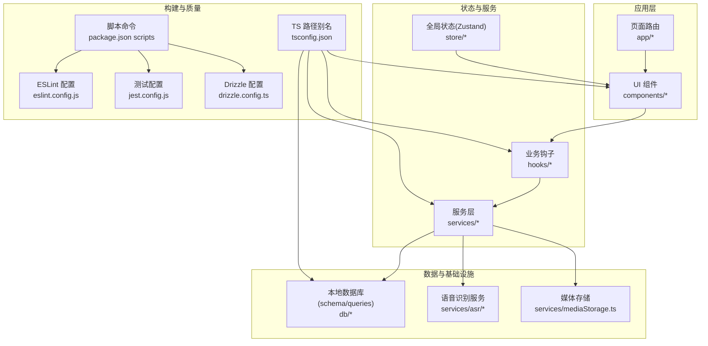
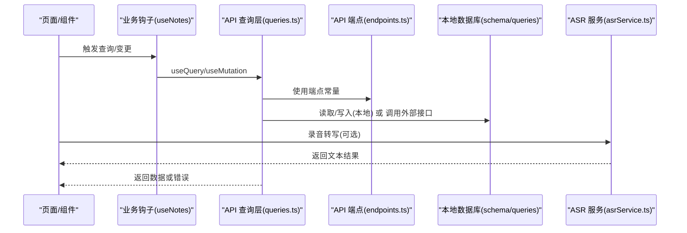
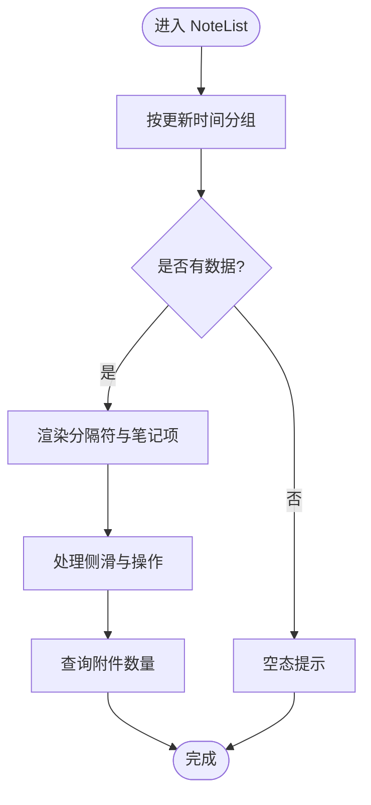
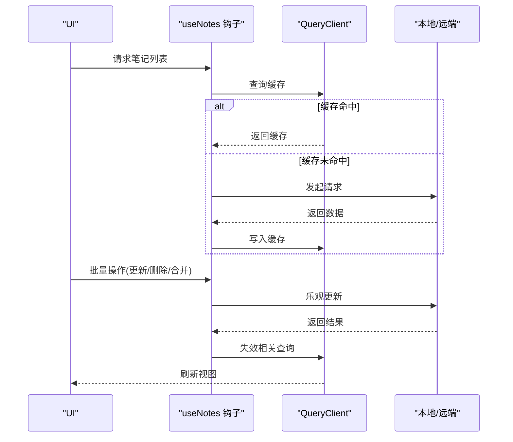
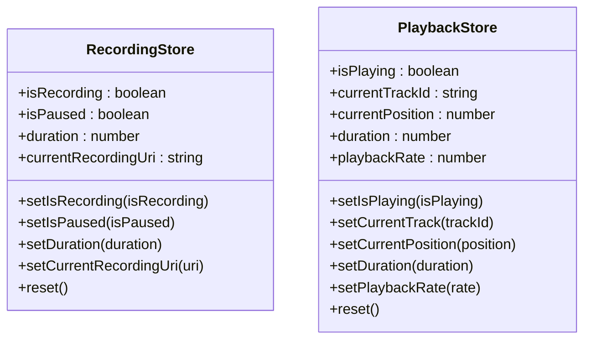
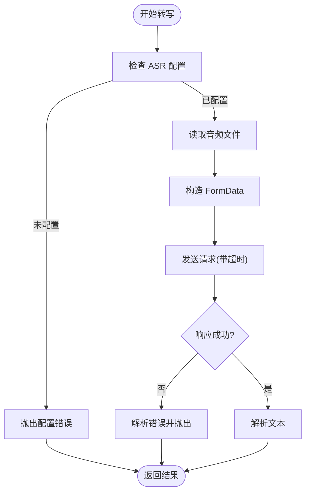
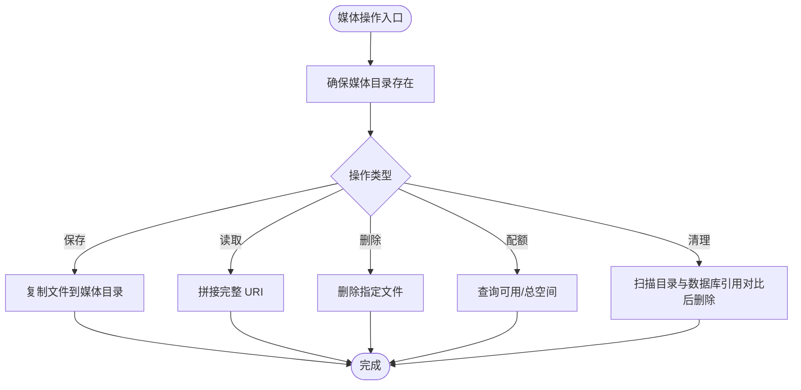
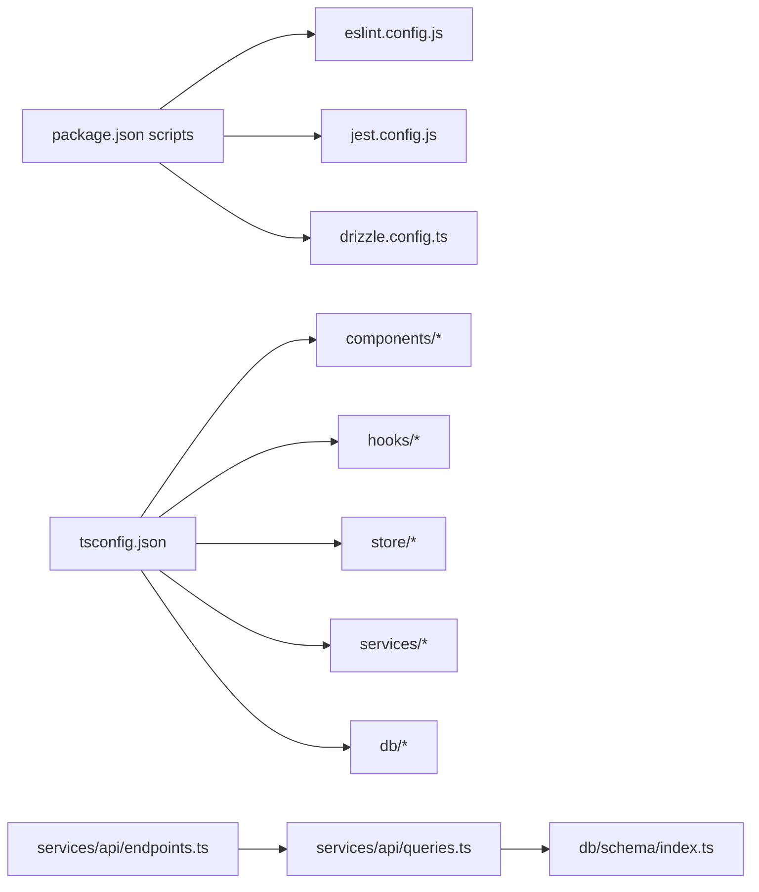

# 团队协作与沟通规范

<cite>
**本文引用的文件**
- [package.json](file://package.json)
- [eslint.config.js](file://eslint.config.js)
- [tsconfig.json](file://tsconfig.json)
- [jest.config.js](file://jest.config.js)
- [drizzle.config.ts](file://drizzle.config.ts)
- [CLAUDE.md](file://CLAUDE.md)
- [AGENTS.md](file://AGENTS.md)
- [.trellis/workflow.md](file://.trellis/workflow.md)
- [services/api/endpoints.ts](file://services/api/endpoints.ts)
- [services/api/queries.ts](file://services/api/queries.ts)
- [hooks/useNotes.ts](file://hooks/useNotes.ts)
- [components/note/NoteList.tsx](file://components/note/NoteList.tsx)
- [store/useRecordingStore.ts](file://store/useRecordingStore.ts)
- [services/asr/asrService.ts](file://services/asr/asrService.ts)
- [services/mediaStorage.ts](file://services/mediaStorage.ts)
- [db/schema/index.ts](file://db/schema/index.ts)
</cite>

## 目录
1. [引言](#引言)
2. [项目结构](#项目结构)
3. [核心组件](#核心组件)
4. [架构总览](#架构总览)
5. [详细组件分析](#详细组件分析)
6. [依赖关系分析](#依赖关系分析)
7. [性能考量](#性能考量)
8. [故障排查指南](#故障排查指南)
9. [结论](#结论)
10. [附录](#附录)

## 引言
本规范面向 VoiceNote 项目团队，旨在建立统一的协作与沟通流程、文档编写标准、代码贡献规范、知识分享机制、冲突解决与决策流程、项目治理结构与角色职责、新成员入职指导与远程协作最佳实践，并明确知识产权与开源协议相关注意事项。所有流程以现有仓库脚本、配置与工作流为基础，结合项目实际进行制度化与可执行化。

## 项目结构
VoiceNote 是基于 React Native/Expo 的移动端应用，采用文件路由（Expo Router）、Tamagui 主题系统、Zustand 状态管理、TanStack Query 数据请求、Drizzle ORM 本地数据库与同步队列。项目通过脚本命令统一开发与测试流程，配合 ESLint、Prettier、Jest 等工具保障质量。

图表来源
- [package.json:1-83](file://package.json#L1-L83)
- [tsconfig.json:1-63](file://tsconfig.json#L1-L63)
- [eslint.config.js:1-84](file://eslint.config.js#L1-L84)
- [jest.config.js:1-47](file://jest.config.js#L1-L47)
- [drizzle.config.ts:1-12](file://drizzle.config.ts#L1-L12)

章节来源
- [package.json:1-83](file://package.json#L1-L83)
- [tsconfig.json:1-63](file://tsconfig.json#L1-L63)
- [eslint.config.js:1-84](file://eslint.config.js#L1-L84)
- [jest.config.js:1-47](file://jest.config.js#L1-L47)
- [drizzle.config.ts:1-12](file://drizzle.config.ts#L1-L12)
- [CLAUDE.md:148-161](file://CLAUDE.md#L148-L161)

## 核心组件
- 开发命令与质量工具：通过 npm scripts 统一启动、运行、测试、类型检查、数据库迁移与生成等；ESLint、Prettier、Jest、TypeScript 配置确保一致性与稳定性。
- 架构与分层：UI 层（Tamagui + 文件路由）、状态层（Zustand）、服务层（API 客户端 + TanStack Query）、数据层（Drizzle ORM + 本地 SQLite）。
- 工作流与 AI 协作：Trellis 提供会话上下文获取、任务管理、指南阅读、提交记录与预检清单，强调“先读再写、按标准执行、及时记录”。

章节来源
- [package.json:5-18](file://package.json#L5-L18)
- [CLAUDE.md:18-161](file://CLAUDE.md#L18-L161)
- [.trellis/workflow.md:19-408](file://.trellis/workflow.md#L19-L408)

## 架构总览
下图展示从页面到服务、再到数据库与外部资源的调用链路，体现离线优先与同步队列的设计思路。

图表来源
- [hooks/useNotes.ts:1-217](file://hooks/useNotes.ts#L1-L217)
- [services/api/queries.ts:1-100](file://services/api/queries.ts#L1-L100)
- [services/api/endpoints.ts:1-61](file://services/api/endpoints.ts#L1-L61)
- [db/schema/index.ts:1-75](file://db/schema/index.ts#L1-L75)
- [services/asr/asrService.ts:1-74](file://services/asr/asrService.ts#L1-L74)

## 详细组件分析

### 组件 A：笔记列表与日期分组渲染
- 功能要点：按更新时间分组显示笔记、支持下拉刷新、侧滑操作、附件计数查询、国际化标签。
- 关键流程：计算日期分组 -> 组装列表项 -> 渲染分隔符与笔记块 -> 处理侧滑与选择模式。
- 性能考虑：使用 FlashList、Memo 化与查询缓存，避免重复渲染。

图表来源
- [components/note/NoteList.tsx:1-240](file://components/note/NoteList.tsx#L1-L240)

章节来源
- [components/note/NoteList.tsx:1-240](file://components/note/NoteList.tsx#L1-L240)

### 组件 B：笔记查询与批量操作（TanStack Query）
- 功能要点：查询全部/按状态过滤、单条详情、创建/更新/删除、归档、合并笔记；使用乐观更新与缓存失效策略。
- 关键流程：定义 queryKey -> useQuery/useMutation -> onMutate 乐观更新 -> 错误回滚 -> onSettled 刷新缓存。
- 可扩展性：新增批量操作时复用 queryClient.invalidation 与统一错误处理。

图表来源
- [hooks/useNotes.ts:1-217](file://hooks/useNotes.ts#L1-L217)
- [services/api/queries.ts:1-100](file://services/api/queries.ts#L1-L100)

章节来源
- [hooks/useNotes.ts:1-217](file://hooks/useNotes.ts#L1-L217)
- [services/api/queries.ts:1-100](file://services/api/queries.ts#L1-L100)

### 组件 C：录音与播放状态（Zustand）
- 功能要点：记录录音状态、暂停/继续、时长、当前录音 URI；播放器状态（播放/暂停、位置、速率）。
- 设计原则：单一 store 管理 UI 状态，持久化中间件用于设置与录音状态保存。

图表来源
- [store/useRecordingStore.ts:1-71](file://store/useRecordingStore.ts#L1-L71)

章节来源
- [store/useRecordingStore.ts:1-71](file://store/useRecordingStore.ts#L1-L71)

### 组件 D：语音识别服务（ASR）
- 功能要点：校验配置、上传音频文件、超时控制、错误处理、返回转写文本。
- 关键流程：检查配置 -> 读取文件 -> 构造表单 -> 发送请求 -> 解析响应 -> 超时/异常处理。

图表来源
- [services/asr/asrService.ts:1-74](file://services/asr/asrService.ts#L1-L74)

章节来源
- [services/asr/asrService.ts:1-74](file://services/asr/asrService.ts#L1-L74)

### 组件 E：媒体存储与清理
- 功能要点：确保目录存在、保存/读取/删除本地媒体文件、获取磁盘配额、清理孤儿文件。
- 关键流程：创建目录 -> 拷贝/读取/删除文件 -> 计算配额 -> 对比数据库引用后删除未引用文件。

图表来源
- [services/mediaStorage.ts:1-123](file://services/mediaStorage.ts#L1-L123)

章节来源
- [services/mediaStorage.ts:1-123](file://services/mediaStorage.ts#L1-L123)

## 依赖关系分析
- 脚本与质量：package.json scripts 串联开发、测试、类型检查、数据库迁移；ESLint、Jest、TS 配置统一约束。
- 路径别名：tsconfig.json 定义 @/*、@components/* 等路径别名，提升导入一致性。
- 数据库：drizzle.config.ts 指定 schema 与驱动，db/schema/index.ts 定义实体与索引，形成强类型模型。
- API：services/api/endpoints.ts 统一端点常量，services/api/queries.ts 基于 TanStack Query 封装查询与变更。

图表来源
- [package.json:1-83](file://package.json#L1-L83)
- [eslint.config.js:1-84](file://eslint.config.js#L1-L84)
- [jest.config.js:1-47](file://jest.config.js#L1-L47)
- [drizzle.config.ts:1-12](file://drizzle.config.ts#L1-L12)
- [tsconfig.json:1-63](file://tsconfig.json#L1-L63)
- [services/api/endpoints.ts:1-61](file://services/api/endpoints.ts#L1-L61)
- [services/api/queries.ts:1-100](file://services/api/queries.ts#L1-L100)
- [db/schema/index.ts:1-75](file://db/schema/index.ts#L1-L75)

章节来源
- [package.json:1-83](file://package.json#L1-L83)
- [tsconfig.json:1-63](file://tsconfig.json#L1-L63)
- [drizzle.config.ts:1-12](file://drizzle.config.ts#L1-L12)
- [services/api/endpoints.ts:1-61](file://services/api/endpoints.ts#L1-L61)
- [services/api/queries.ts:1-100](file://services/api/queries.ts#L1-L100)
- [db/schema/index.ts:1-75](file://db/schema/index.ts#L1-L75)

## 性能考量
- 渲染性能：使用 FlashList、memo 化与分组渲染，减少重排与重绘。
- 网络与缓存：TanStack Query 的查询键设计与缓存失效策略，避免重复请求与保证数据一致性。
- 存储与 IO：媒体文件本地化、目录预创建、批量清理孤儿文件，降低磁盘碎片与冗余占用。
- 类型与静态检查：ESLint + TypeScript 配置在开发期发现潜在问题，减少运行时开销。
- 数据库：索引（如 notes_status_idx、notes_type_idx）提升查询效率，事务与批量操作减少锁竞争。

## 故障排查指南
- 本地开发
  - 启动失败：确认 Node 版本与依赖安装，查看 npm scripts 是否正确。
  - 类型/语法错误：运行类型检查与 ESLint，修正规则警告。
  - 测试失败：检查 Jest 配置与模块映射，确保 mocks 正确。
- 数据库
  - 迁移失败：核对 drizzle 配置与 schema 路径，确保驱动与方言匹配。
  - 查询异常：检查 queryKey 与端点常量是否一致，确认 enabled 条件。
- 语音识别
  - 配置缺失：确认环境变量或设置项是否正确传入。
  - 超时/网络错误：检查超时阈值与网络连通性，查看错误消息。
- 媒体存储
  - 文件不存在：确认保存路径与权限，检查目录是否存在。
  - 清理误删：清理前先比对数据库引用，避免误删。

章节来源
- [package.json:5-18](file://package.json#L5-L18)
- [eslint.config.js:1-84](file://eslint.config.js#L1-L84)
- [jest.config.js:1-47](file://jest.config.js#L1-L47)
- [drizzle.config.ts:1-12](file://drizzle.config.ts#L1-L12)
- [services/asr/asrService.ts:1-74](file://services/asr/asrService.ts#L1-L74)
- [services/mediaStorage.ts:1-123](file://services/mediaStorage.ts#L1-L123)

## 结论
本规范以现有仓库脚本、配置与工作流为基础，明确了协作流程、沟通机制、文档标准、代码贡献规范、知识分享与治理结构，并提供了性能与故障排查建议。建议团队在实践中持续优化流程与文档，确保项目长期健康演进。

## 附录

### 团队协作与沟通规范
- 任务分配与进度跟踪
  - 采用任务目录与 task.json 记录任务状态，使用脚本列出/归档任务。
  - 每日站会：快速同步进展、阻塞问题与风险；周会：回顾里程碑与迭代计划。
  - 进度可视化：使用任务看板（如 GitHub Projects/Trello），每日更新。
- 成果验收
  - 代码审查：PR 必须通过 CI 与至少一名维护者批准；自测通过后方可合并。
  - 回归测试：涉及 UI/数据层变更需补充或更新测试用例。
- 沟通渠道与频率
  - 日常站会：每日固定时间 15 分钟，聚焦当日目标与障碍。
  - 周会：每周一次，回顾进度、规划下周；里程碑评审会：发布前集中评审。
  - 异步沟通：Slack/Teams 等即时沟通，重要决定与结论沉淀至知识库。
- 文档编写规范
  - 技术文档：遵循现有注释风格与类型约束，保持与代码同步。
  - API 文档：以 endpoints.ts 为依据，描述端点、参数、返回与错误码。
  - 用户手册：以功能清单与截图为主，配合简明步骤说明。
- 代码贡献指南
  - Fork 流程：Fork 仓库 -> 新建分支 -> 提交与推送 -> 发起 PR。
  - 分支命名：feat/fix/docs/refactor/test/chore/infra/<subject>。
  - 提交信息格式：type(scope): description，参考 Trellis 提交约定。
  - 提交前检查：通过 lint、类型检查与测试；在 Trellis 中完成会话记录。
- 知识分享机制
  - 技术分享会：主题轮值，分享实现细节与最佳实践。
  - 文档评审：定期评审技术文档与 API 文档，确保准确性与完整性。
  - 经验总结：迭代结束后输出复盘报告，沉淀问题与改进点。
- 冲突解决与决策流程
  - 冲突解决：优先协商；无法达成共识时由技术负责人仲裁。
  - 决策流程：小变更即时决策；重大变更发起评审会议，形成决议并记录。
- 项目治理结构与角色职责
  - Maintainer：负责整体架构、代码质量与流程制定。
  - Developer：负责具体功能开发与测试。
  - Observer：关注进展与文档，参与评审与分享。
- 新成员入职指导与培训计划
  - 第一周：环境搭建、脚本命令、ESLint/Jest/TS 配置、Trellis 工作流。
  - 第二周：核心模块走读（UI/Hooks/Services/DB）、任务认领与小需求开发。
  - 第三周：独立承担任务、参与评审与分享、输出学习总结。
- 远程协作最佳实践与工具推荐
  - 工具：VS Code Live Share、Cursor/IntelliJ IDEA 共享调试、Expo DevTools 远程调试。
  - 最佳实践：统一编辑器配置、共享环境变量、定期备份与快照。
- 知识产权与开源协议注意事项
  - 依赖声明：package.json 中的依赖均应符合开源许可要求。
  - 环境变量：敏感配置通过环境变量注入，不在代码中硬编码。
  - 许可证合规：第三方依赖许可证需兼容项目策略，必要时进行审批与记录。

章节来源
- [.trellis/workflow.md:19-408](file://.trellis/workflow.md#L19-L408)
- [AGENTS.md:1-19](file://AGENTS.md#L1-L19)
- [CLAUDE.md:138-161](file://CLAUDE.md#L138-L161)
- [package.json:1-83](file://package.json#L1-L83)
- [eslint.config.js:1-84](file://eslint.config.js#L1-L84)
- [jest.config.js:1-47](file://jest.config.js#L1-L47)
- [drizzle.config.ts:1-12](file://drizzle.config.ts#L1-L12)
- [services/api/endpoints.ts:1-61](file://services/api/endpoints.ts#L1-L61)