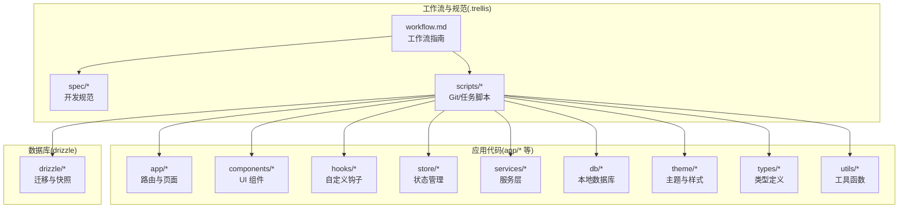
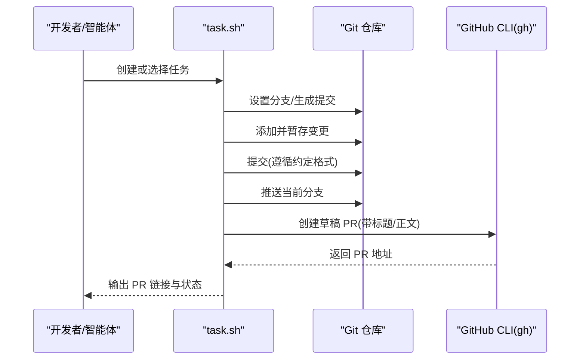
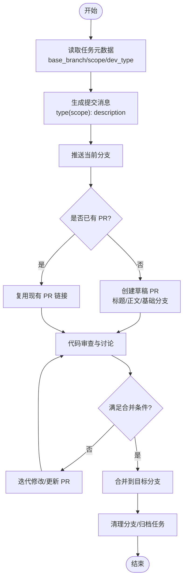
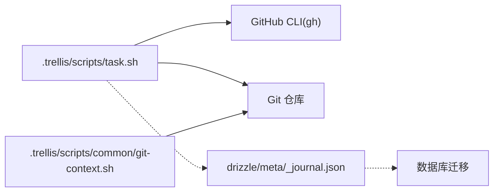

# Git 工作流程

<cite>
**本文引用的文件**
- [.trellis/workflow.md](file://.trellis/workflow.md)
- [.trellis/scripts/task.sh](file://.trellis/scripts/task.sh)
- [.trellis/scripts/multi-agent/create-pr.sh](file://.trellis/scripts/multi-agent/create-pr.sh)
- [.trellis/spec/guides/cross-layer-thinking-guide.md](file://.trellis/spec/guides/cross-layer-thinking-guide.md)
- [.trellis/spec/guides/index.md](file://.trellis/spec/guides/index.md)
- [.trellis/spec/frontend/index.md](file://.trellis/spec/frontend/index.md)
- [.trellis/scripts/common/git-context.sh](file://.trellis/scripts/common/git-context.sh)
- [package.json](file://package.json)
- [.gitignore](file://.gitignore)
- [drizzle/meta/_journal.json](file://drizzle/meta/_journal.json)
</cite>

## 目录
1. [简介](#简介)
2. [项目结构](#项目结构)
3. [核心组件](#核心组件)
4. [架构总览](#架构总览)
5. [详细组件分析](#详细组件分析)
6. [依赖关系分析](#依赖关系分析)
7. [性能考虑](#性能考虑)
8. [故障排查指南](#故障排查指南)
9. [结论](#结论)
10. [附录](#附录)

## 简介
本文件面向 VoiceNote 项目，系统化阐述 Git 工作流程，覆盖分支策略、提交规范、合并流程、分支管理最佳实践与实际命令示例。该流程由项目内置的 Trellis 工作流与配套脚本驱动，强调“先读规范、再写代码”“增量开发、及时记录”的原则，并通过任务目录与 PR 自动生成机制提升协作效率与可追溯性。

## 项目结构
VoiceNote 采用多层结构组织前端、服务端、数据库与脚手架工具，Git 工作流围绕以下关键目录展开：
- .trellis：工作流与规范文档、脚本与任务跟踪
- app、components、hooks、store、services、db、theme、types、utils：应用源码
- drizzle：数据库迁移与快照
- 根目录脚本与配置：package.json、.gitignore 等

图表来源
- [.trellis/workflow.md:103-138](file://.trellis/workflow.md#L103-L138)
- [.trellis/spec/frontend/index.md:1-71](file://.trellis/spec/frontend/index.md#L1-L71)

章节来源
- [.trellis/workflow.md:103-138](file://.trellis/workflow.md#L103-L138)
- [.trellis/spec/frontend/index.md:148-161](file://.trellis/spec/frontend/index.md#L148-L161)

## 核心组件
- 工作流指南：定义会话启动、开发过程、会话结束与最佳实践，明确提交规范与常用命令。
- 任务脚本(task.sh)：负责任务生命周期管理、分支设置、PR 创建与上下文输出。
- 多智能体 PR 脚本(create-pr.sh)：在任务上下文中自动完成提交、推送与 PR 创建。
- 规范指南：跨层思考、前端/后端指南等，确保边界清晰、契约明确。
- Git 上下文脚本：输出当前开发者、分支、未提交变更、最近提交与任务状态等信息。

章节来源
- [.trellis/workflow.md:194-217](file://.trellis/workflow.md#L194-L217)
- [.trellis/scripts/task.sh:1-200](file://.trellis/scripts/task.sh#L1-L200)
- [.trellis/scripts/multi-agent/create-pr.sh:84-212](file://.trellis/scripts/multi-agent/create-pr.sh#L84-L212)
- [.trellis/spec/guides/cross-layer-thinking-guide.md:1-95](file://.trellis/spec/guides/cross-layer-thinking-guide.md#L1-L95)
- [.trellis/scripts/common/git-context.sh:1-264](file://.trellis/scripts/common/git-context.sh#L1-L264)

## 架构总览
下图展示从任务创建到 PR 自动化的端到端流程，以及与 Git 的交互点。

图表来源
- [.trellis/scripts/task.sh:874-987](file://.trellis/scripts/task.sh#L874-L987)
- [.trellis/scripts/multi-agent/create-pr.sh:174-212](file://.trellis/scripts/multi-agent/create-pr.sh#L174-L212)

## 详细组件分析

### 分支策略与命名规范
- 主分支(main)：稳定基线，用于发布与归档。
- 开发分支(develop)：用于集成特性与修复，保持与主分支同步。
- 功能分支(feature/*)：按任务拆分，命名建议使用任务缩写或模块名，便于追踪与清理。
- 修复分支(bugfix/*)：针对已知问题的短期修复分支。
- 版本标签：遵循语义化版本，结合数据库迁移标签进行发布标记。

说明：本项目以 Trellis 工作流为核心，任务脚本支持将任务元数据映射为分支与 PR 标题，推荐在任务中统一声明 base_branch、scope、dev_type，从而自动生成符合规范的提交与 PR 标题。

章节来源
- [.trellis/workflow.md:370-378](file://.trellis/workflow.md#L370-L378)
- [.trellis/scripts/task.sh:874-895](file://.trellis/scripts/task.sh#L874-L895)

### 提交规范
- 格式：type(scope): description
- 类型分类：
  - feat：新功能
  - fix：修复缺陷
  - docs：仅文档改动
  - refactor：重构(既不修复错误也不添加功能)
  - test：新增/修改测试
  - chore：构建流程、辅助工具变动
- Scope：模块名或领域范围，如 api、ui、db、asr 等
- 描述：简洁明了地说明变更内容与动机

任务脚本会根据 dev_type 自动映射 commit 前缀，确保一致性。

章节来源
- [.trellis/workflow.md:370-378](file://.trellis/workflow.md#L370-L378)
- [.trellis/scripts/task.sh:880-889](file://.trellis/scripts/task.sh#L880-L889)

### 合并流程（Pull Request）
- 创建 PR：脚本会基于任务元数据生成标题与正文，若存在 prd.md 则作为 PR 正文；若已存在同分支 PR，则复用现有链接。
- 草稿状态：默认创建草稿 PR，便于审阅与迭代。
- 审查要求：遵循项目规范，跨层变更需通过“跨层思考清单”，确保边界契约清晰。
- 合并条件：无强制 CI，但需通过规范检查与质量门禁；跨层变更建议补充边界文档。
- 冲突解决：优先 rebase 或 merge 主干分支，保持线性历史；必要时通过 PR 评论与讨论定位问题。

图表来源
- [.trellis/scripts/task.sh:874-987](file://.trellis/scripts/task.sh#L874-L987)
- [.trellis/scripts/multi-agent/create-pr.sh:174-212](file://.trellis/scripts/multi-agent/create-pr.sh#L174-L212)

章节来源
- [.trellis/scripts/task.sh:874-987](file://.trellis/scripts/task.sh#L874-L987)
- [.trellis/scripts/multi-agent/create-pr.sh:174-212](file://.trellis/scripts/multi-agent/create-pr.sh#L174-L212)

### 分支管理最佳实践
- 分支命名：feature/xxx、bugfix/xxx、hotfix/xxx；与任务 slug 对齐。
- 及时同步：定期 rebase 或 merge 主干，减少冲突。
- 清理策略：PR 合并后删除功能分支；长期未使用的分支定期清理。
- 标签管理：发布版本打 tag；数据库迁移使用 drizzle 标签，便于回溯。
- 历史维护：优先使用 rebase 保持线性历史；复杂变更可考虑 squash 合并。

章节来源
- [.trellis/workflow.md:329-357](file://.trellis/workflow.md#L329-L357)
- [drizzle/meta/_journal.json:1-27](file://drizzle/meta/_journal.json#L1-L27)

### 实际 Git 命令示例与常见场景
- 初始化开发者身份与上下文
  - 初始化：./.trellis/scripts/init-developer.sh <name>
  - 获取上下文：./.trellis/scripts/get-context.sh
- 任务管理
  - 创建任务：./.trellis/scripts/task.sh create "<title>" --slug <task-name>
  - 列出任务：./.trellis/scripts/task.sh list
  - 设置分支：./.trellis/scripts/task.sh set-branch <dir> <branch>
  - 创建 PR：./.trellis/scripts/task.sh create-pr [--dry-run]
- 日常开发
  - 暂存与提交：git add <files>；git commit -m "type(scope): description"
  - 推送：git push -u origin <branch>
  - 查看状态：git status；git log --oneline -5
- 会话记录
  - 记录会话：./.trellis/scripts/add-session.sh --title "Title" --commit "hash"

章节来源
- [.trellis/workflow.md:194-217](file://.trellis/workflow.md#L194-L217)
- [.trellis/scripts/task.sh:137-200](file://.trellis/scripts/task.sh#L137-L200)
- [.trellis/scripts/common/git-context.sh:104-241](file://.trellis/scripts/common/git-context.sh#L104-L241)

### 跨层变更与边界契约
- 在多层交互前绘制数据流，明确输入/输出格式与错误处理位置。
- 避免重复验证与泄漏抽象，确保每层只关注相邻层。
- 复杂跨层功能建议产出边界文档，纳入规范库。

章节来源
- [.trellis/spec/guides/cross-layer-thinking-guide.md:18-85](file://.trellis/spec/guides/cross-layer-thinking-guide.md#L18-L85)
- [.trellis/spec/guides/index.md:52-79](file://.trellis/spec/guides/index.md#L52-L79)

## 依赖关系分析
- 工作流依赖于任务脚本(task.sh)与 Git 上下文脚本，二者共同提供任务状态、分支与提交上下文。
- PR 创建依赖 GitHub CLI(gh)，脚本会自动判断是否存在同分支 PR 并复用。
- 数据库迁移与版本标签相互独立：任务脚本负责 Git 提交与 PR；drizzle 标签用于数据库演进。

图表来源
- [.trellis/scripts/task.sh:874-987](file://.trellis/scripts/task.sh#L874-L987)
- [.trellis/scripts/common/git-context.sh:21-98](file://.trellis/scripts/common/git-context.sh#L21-L98)
- [drizzle/meta/_journal.json:1-27](file://drizzle/meta/_journal.json#L1-L27)

章节来源
- [.trellis/scripts/task.sh:874-987](file://.trellis/scripts/task.sh#L874-L987)
- [.trellis/scripts/common/git-context.sh:21-98](file://.trellis/scripts/common/git-context.sh#L21-L98)
- [drizzle/meta/_journal.json:1-27](file://drizzle/meta/_journal.json#L1-L27)

## 性能考虑
- 使用任务脚本批量操作：一次性生成提交、推送与 PR，减少手动命令开销。
- 保持线性历史：rebase 优于 merge，降低后续冲突概率。
- 控制单次提交粒度：遵循“增量开发”原则，避免一次提交过大导致审查困难与回滚成本高。
- 限制日志文件大小：工作流对日志文件行数有限制，及时归档与轮换。

## 故障排查指南
- 无法创建 PR
  - 检查是否已存在同分支 PR；若存在则复用链接。
  - 确认 gh CLI 已安装且认证有效。
- 提交失败或被拒绝
  - 检查提交消息格式是否符合 type(scope): description。
  - 确保任务元数据中的 dev_type 映射正确。
- 分支冲突
  - 先同步主干分支，再 rebase 当前分支；必要时在 PR 评论中沟通。
- 未提交变更过多
  - 使用 git status 查看未提交文件；按模块拆分为多个提交。
- 日志文件接近上限
  - 使用会话记录脚本归档当前日志，避免超过行数限制。

章节来源
- [.trellis/scripts/task.sh:911-938](file://.trellis/scripts/task.sh#L911-L938)
- [.trellis/scripts/multi-agent/create-pr.sh:189-212](file://.trellis/scripts/multi-agent/create-pr.sh#L189-L212)
- [.trellis/scripts/common/git-context.sh:104-241](file://.trellis/scripts/common/git-context.sh#L104-L241)

## 结论
VoiceNote 的 Git 工作流以 Trellis 为核心，通过任务驱动与脚本自动化实现从任务到 PR 的闭环管理。严格遵循提交规范、跨层契约与分支策略，可显著提升协作效率与代码质量。建议团队在每次开发前先读规范、后编码，并在完成后及时记录会话与归档任务。

## 附录
- 常用命令速查
  - 初始化与上下文：./.trellis/scripts/init-developer.sh、./.trellis/scripts/get-context.sh
  - 任务：./.trellis/scripts/task.sh create/list/start/finish/set-branch/set-scope
  - PR：./.trellis/scripts/task.sh create-pr
  - 会话记录：./.trellis/scripts/add-session.sh
- 规范与指南
  - 工作流指南：.trellis/workflow.md
  - 跨层思考：.trellis/spec/guides/cross-layer-thinking-guide.md
  - 前端指南：.trellis/spec/frontend/index.md
- 项目配置参考
  - 包管理与脚本：package.json
  - 忽略文件：.gitignore
  - 数据库迁移：drizzle/meta/_journal.json