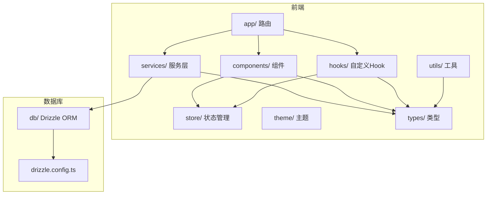
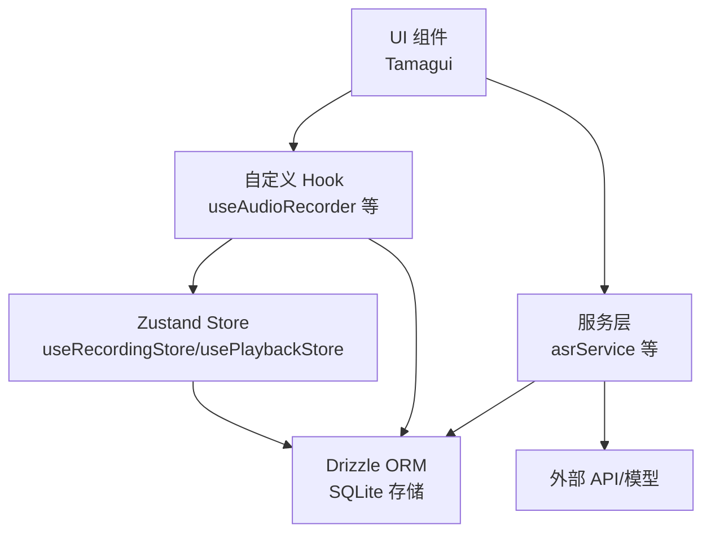
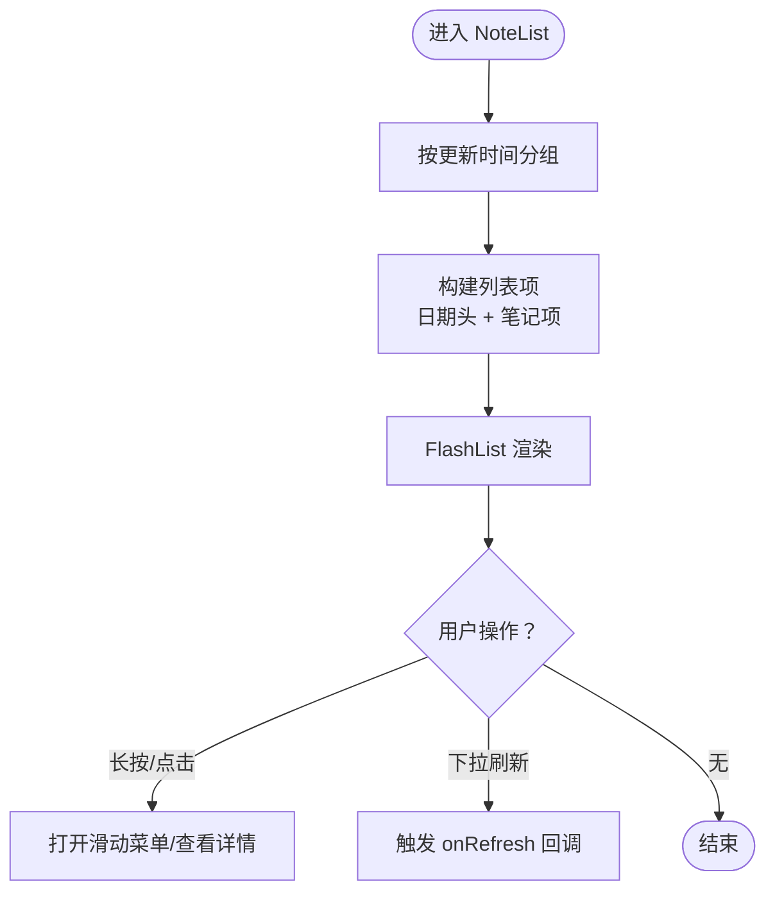
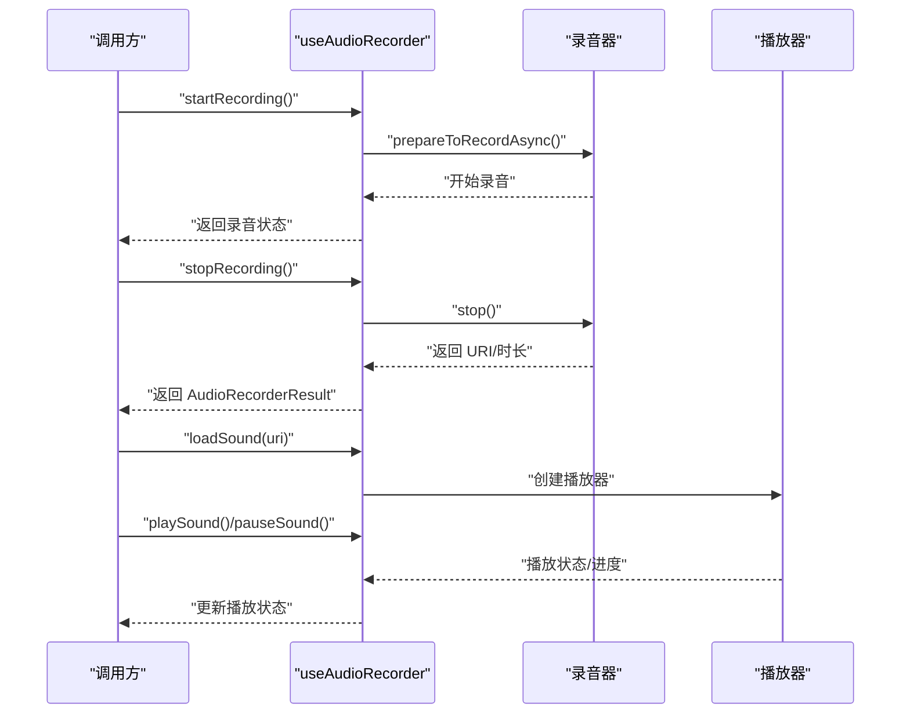
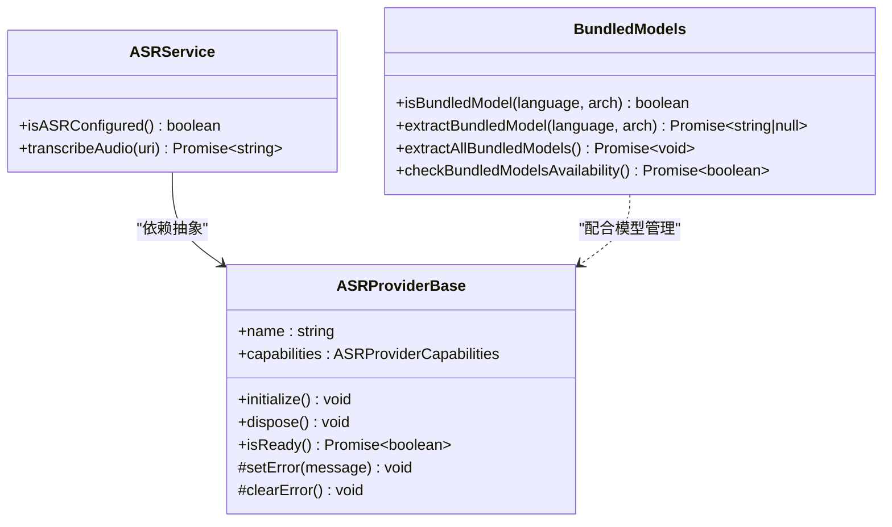
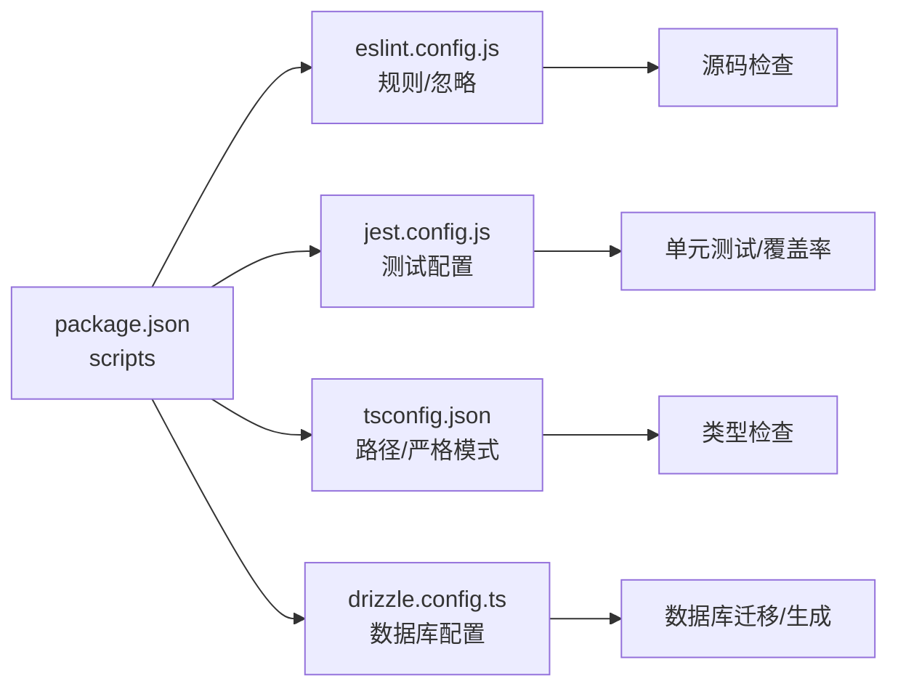

# 代码审查流程

<cite>
**本文引用的文件**
- [package.json](file://package.json)
- [eslint.config.js](file://eslint.config.js)
- [jest.config.js](file://jest.config.js)
- [tsconfig.json](file://tsconfig.json)
- [drizzle.config.ts](file://drizzle.config.ts)
- [CLAUDE.md](file://CLAUDE.md)
- [AGENTS.md](file://AGENTS.md)
- [NoteList.tsx](file://components/note/NoteList.tsx)
- [useAudioRecorder.ts](file://hooks/useAudioRecorder.ts)
- [useRecordingStore.ts](file://store/useRecordingStore.ts)
- [asrService.ts](file://services/asr/asrService.ts)
- [ASRProviderBase.ts](file://services/asr/providers/base/ASRProviderBase.ts)
- [BundledModels.ts](file://services/asr/modelManager/BundledModels.ts)
- [jest.setup.js](file://jest.setup.js)
</cite>

## 目录
1. [简介](#简介)
2. [项目结构](#项目结构)
3. [核心组件](#核心组件)
4. [架构总览](#架构总览)
5. [详细组件分析](#详细组件分析)
6. [依赖关系分析](#依赖关系分析)
7. [性能考量](#性能考量)
8. [故障排查指南](#故障排查指南)
9. [结论](#结论)
10. [附录](#附录)

## 简介
本文件为 VoiceNote 项目制定标准化的代码审查流程文档，目标是确保代码质量、安全性、性能与可维护性在合并前得到一致化保障。内容覆盖 Pull Request 模板、审查清单、流程规范、自动化检查工具使用、审查标准与评分体系，以及争议解决机制。

VoiceNote 是一个基于 React Native/Expo 的移动端语音录制与笔记应用，采用 Tamagui UI、Zustand 状态管理、TanStack Query 数据获取、Drizzle ORM 本地数据库等技术栈。项目通过 ESLint、TypeScript 类型检查与 Jest 测试框架进行质量保障，并通过脚本命令统一执行检查与测试。

## 项目结构
项目采用按功能域划分的目录组织方式：app（路由）、components（UI 组件）、hooks（自定义 Hook）、store（状态管理）、services（服务层）、db（数据库）、theme（主题）、types（类型定义）、utils（工具函数）等。路径别名在 TypeScript 配置中集中定义，便于跨模块引用与一致性管理。

图表来源
- [CLAUDE.md:148-161](file://CLAUDE.md#L148-L161)
- [tsconfig.json:1-63](file://tsconfig.json#L1-L63)
- [drizzle.config.ts:1-12](file://drizzle.config.ts#L1-L12)

章节来源
- [CLAUDE.md:148-161](file://CLAUDE.md#L148-L161)
- [tsconfig.json:1-63](file://tsconfig.json#L1-L63)
- [drizzle.config.ts:1-12](file://drizzle.config.ts#L1-L12)

## 核心组件
- 组件层：NoteList 展示笔记列表，支持分组、下拉刷新、滑动操作与附件计数查询。
- Hook 层：useAudioRecorder 封装录音与播放状态管理，提供权限请求、暂停/恢复、停止/取消等能力。
- 状态层：useRecordingStore 与 usePlaybackStore 提供录音与播放的全局状态。
- 服务层：asrService 提供语音转写服务，含超时控制与错误处理；ASRProviderBase 定义抽象基类；BundledModels 处理内置模型提取逻辑。
- 数据层：Drizzle ORM 配合 SQLite 存储，提供离线优先的数据方案。

章节来源
- [NoteList.tsx:1-240](file://components/note/NoteList.tsx#L1-L240)
- [useAudioRecorder.ts:1-270](file://hooks/useAudioRecorder.ts#L1-L270)
- [useRecordingStore.ts:1-71](file://store/useRecordingStore.ts#L1-L71)
- [asrService.ts:1-74](file://services/asr/asrService.ts#L1-L74)
- [ASRProviderBase.ts:1-66](file://services/asr/providers/base/ASRProviderBase.ts#L1-L66)
- [BundledModels.ts:1-258](file://services/asr/modelManager/BundledModels.ts#L1-L258)

## 架构总览
VoiceNote 采用“文件路由 + 组件 + Hook + 服务 + 数据库”的分层架构，遵循以下设计原则：
- 路由与布局：基于 Expo Router 的文件路由，根布局在 app/_layout.tsx。
- UI 与主题：Tamagui 提供主题与组件系统，使用主题令牌保证深浅色模式一致性。
- 状态管理：Zustand 用于全局 UI 状态持久化；TanStack Query 管理服务端数据缓存。
- 数据存储：Drizzle ORM + expo-sqlite 实现本地数据库与同步队列。
- 路径别名：tsconfig.json 中集中配置，提升导入一致性与可维护性。

图表来源
- [CLAUDE.md:36-73](file://CLAUDE.md#L36-L73)
- [tsconfig.json:1-63](file://tsconfig.json#L1-L63)

章节来源
- [CLAUDE.md:36-73](file://CLAUDE.md#L36-L73)
- [tsconfig.json:1-63](file://tsconfig.json#L1-L63)

## 详细组件分析

### 组件 A：NoteList 列表渲染与交互
- 功能要点：按日期分组展示笔记、支持下拉刷新、滑动手势操作、附件计数查询、国际化文案。
- 性能关注：使用 FlashList 进行虚拟滚动；Memo 化分组与键值计算；仅在有 ID 列表时启用查询。
- 可维护性：清晰的 props 接口与类型导出；分离日期分组与渲染项逻辑。

图表来源
- [NoteList.tsx:80-205](file://components/note/NoteList.tsx#L80-L205)

章节来源
- [NoteList.tsx:1-240](file://components/note/NoteList.tsx#L1-L240)

### 组件 B：录音与播放 Hook（useAudioRecorder）
- 功能要点：权限申请、录音状态跟踪、播放状态监控、暂停/恢复/停止/取消、文件信息读取。
- 错误处理：录音失败、权限拒绝、播放异常均记录日志并抛出错误。
- 性能关注：定时轮询播放进度，避免过度重渲染；停止后关闭录音模式以保证播放正常。

图表来源
- [useAudioRecorder.ts:74-204](file://hooks/useAudioRecorder.ts#L74-L204)

章节来源
- [useAudioRecorder.ts:1-270](file://hooks/useAudioRecorder.ts#L1-L270)

### 组件 C：ASR 服务与 Provider 基类
- asrService：封装转写 API 调用，包含超时控制、鉴权头设置、错误文本解析与国际化提示。
- ASRProviderBase：定义 Provider 生命周期（初始化/释放）、就绪状态与错误管理接口。
- BundledModels：处理内置模型的提取与存储，支持多语言/架构组合与首次启动提取。

图表来源
- [asrService.ts:1-74](file://services/asr/asrService.ts#L1-L74)
- [ASRProviderBase.ts:1-66](file://services/asr/providers/base/ASRProviderBase.ts#L1-L66)
- [BundledModels.ts:1-258](file://services/asr/modelManager/BundledModels.ts#L1-L258)

章节来源
- [asrService.ts:1-74](file://services/asr/asrService.ts#L1-L74)
- [ASRProviderBase.ts:1-66](file://services/asr/providers/base/ASRProviderBase.ts#L1-L66)
- [BundledModels.ts:1-258](file://services/asr/modelManager/BundledModels.ts#L1-L258)

## 依赖关系分析
- 脚本与工具：package.json 中定义了 lint、typecheck、test、db:* 等脚本，统一开发与 CI 流程入口。
- 规则与忽略：eslint.config.js 配置推荐规则、Prettier 合并、测试与类型声明文件的特殊规则与忽略项。
- 测试配置：jest.config.js 设置测试环境、模块映射、覆盖率收集范围与测试匹配模式。
- 类型与路径：tsconfig.json 启用严格模式并配置路径别名，便于跨模块引用与类型推断。
- 数据库：drizzle.config.ts 指定 schema、输出目录、方言与驱动，确保迁移与生成一致性。

图表来源
- [package.json:1-83](file://package.json#L1-L83)
- [eslint.config.js:1-84](file://eslint.config.js#L1-L84)
- [jest.config.js:1-47](file://jest.config.js#L1-L47)
- [tsconfig.json:1-63](file://tsconfig.json#L1-L63)
- [drizzle.config.ts:1-12](file://drizzle.config.ts#L1-L12)

章节来源
- [package.json:1-83](file://package.json#L1-L83)
- [eslint.config.js:1-84](file://eslint.config.js#L1-L84)
- [jest.config.js:1-47](file://jest.config.js#L1-L47)
- [tsconfig.json:1-63](file://tsconfig.json#L1-L63)
- [drizzle.config.ts:1-12](file://drizzle.config.ts#L1-L12)

## 性能考量
- 列表渲染：使用 FlashList 与 useMemo 分组，减少重排与重绘开销。
- 状态更新：Zustand 与 React Query 避免不必要的订阅与无效更新。
- I/O 优化：录音/播放使用异步 API，避免阻塞主线程；文件操作前先检查存在性。
- 类型安全：严格 TypeScript 配置降低运行时错误，提高编译期发现率。
- 测试覆盖：聚焦核心业务（ASR 与 Hook），通过 Jest 与模块映射提升测试稳定性。

## 故障排查指南
- ESLint 报错：检查规则配置与忽略列表，确认测试文件与类型声明文件的特殊规则是否生效。
- 类型检查失败：核对 tsconfig 的 strict 选项与路径别名，确保类型导入正确。
- 测试失败或覆盖率不足：检查 jest.config.js 的模块映射与覆盖率收集范围，确认测试文件命名与匹配模式。
- 数据库迁移问题：核对 drizzle.config.ts 的 schema 路径与驱动配置，确保生成与迁移命令正确执行。
- 录音/播放异常：检查权限申请流程与音频模式切换，确认停止后重置录音模式以保证播放正常。

章节来源
- [eslint.config.js:44-83](file://eslint.config.js#L44-L83)
- [jest.config.js:18-46](file://jest.config.js#L18-L46)
- [tsconfig.json:3-55](file://tsconfig.json#L3-L55)
- [drizzle.config.ts:3-11](file://drizzle.config.ts#L3-L11)
- [useAudioRecorder.ts:74-204](file://hooks/useAudioRecorder.ts#L74-L204)

## 结论
通过标准化的代码审查流程与自动化工具链，VoiceNote 项目能够在功能演进的同时保持高质量与可维护性。建议在团队内推广 PR 模板与审查清单，结合自动化检查与测试覆盖率，持续提升交付质量与协作效率。

## 附录

### Pull Request 模板（必填字段）
- 变更摘要：简述改动目的、范围与影响。
- 问题链接：关联需求/缺陷/任务编号。
- 测试结果：列出已执行的单元测试、集成测试与手动验证场景。
- 影响评估：涉及 UI、性能、兼容性、安全与可维护性的风险评估。
- 代码审查清单：见下一节。

章节来源
- [package.json:5-18](file://package.json#L5-L18)
- [jest.config.js:39-46](file://jest.config.js#L39-L46)

### 代码审查清单
- 代码质量
  - 是否符合 ESLint 规则与 Prettier 格式？
  - 是否启用 TypeScript 严格模式并通过类型检查？
  - 是否存在重复代码与过长函数/类？
- 安全性
  - 是否处理了敏感数据（如 API Key）与网络请求错误？
  - 是否避免硬编码密钥与敏感路径？
- 性能
  - 是否使用虚拟列表与必要的 memo 化？
  - 是否避免在渲染阶段进行昂贵计算？
- 可维护性
  - 是否提供清晰的注释与文档片段路径？
  - 是否遵循统一的命名与导入规范（路径别名）？
  - 是否考虑未来扩展点与边界条件？

章节来源
- [eslint.config.js:38-42](file://eslint.config.js#L38-L42)
- [tsconfig.json:3-55](file://tsconfig.json#L3-L55)
- [CLAUDE.md:75-97](file://CLAUDE.md#L75-L97)

### 审查流程
- 审查者分配：根据模块归属自动分配至相关维护者或轮值审查者。
- 时间要求：PR 创建后 24 小时内至少完成一轮审查反馈；紧急修复类在 4 小时内响应。
- 反馈处理：审查意见需明确到具体文件与行号；作者应在 48 小时内完成修改并重新提交。
- 修改跟踪：每次修改后需在 PR 中更新“最新变更”摘要，确保审查者快速定位改动。

### 审查标准与评分体系
- 优秀（A）：无高危问题，代码整洁，测试完备，文档齐全。
- 良好（B）：存在少量低影响问题，可接受但建议尽快修复。
- 待改进（C）：存在中等问题，需作者主动沟通并限期修复。
- 不通过（D）：存在高危问题（安全/性能/稳定性），必须阻断合并直至修复。

### 自动化检查工具使用
- ESLint：执行代码风格与潜在问题检查，规则在 eslint.config.js 中定义。
- TypeScript 类型检查：启用严格模式，确保类型安全。
- Jest：执行单元测试与覆盖率统计，配置在 jest.config.js 中；测试文件位于 services/asr/__tests__/。

章节来源
- [eslint.config.js:1-84](file://eslint.config.js#L1-L84)
- [tsconfig.json:3-55](file://tsconfig.json#L3-L55)
- [jest.config.js:1-47](file://jest.config.js#L1-L47)
- [package.json:10-14](file://package.json#L10-L14)

### 争议解决与最终决策
- 争议解决：审查者与作者无法达成一致时，提请模块负责人仲裁；必要时组织短会讨论。
- 最终决策：模块负责人拥有最终否决权；重大架构变更需经技术委员会评审。