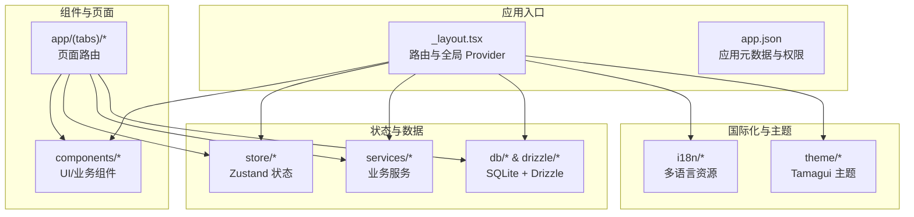
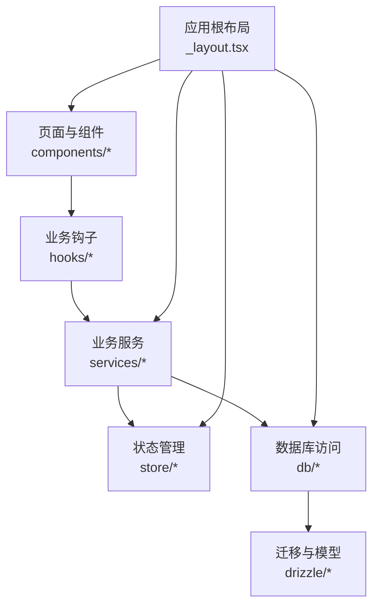
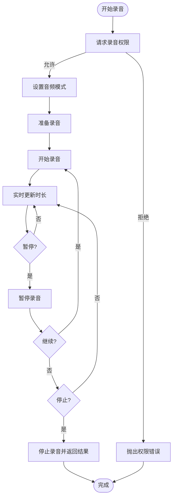
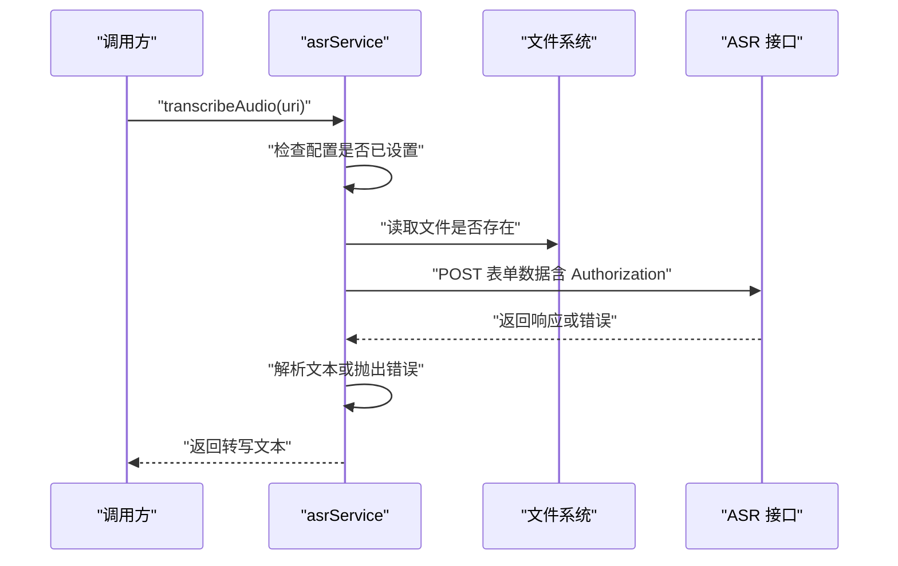
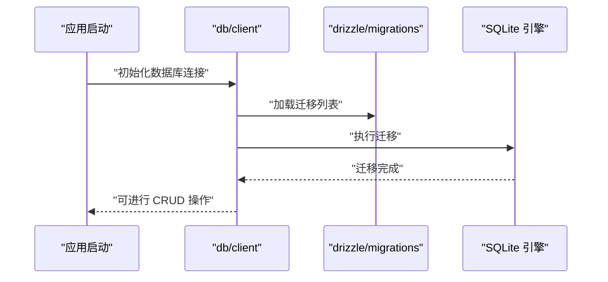
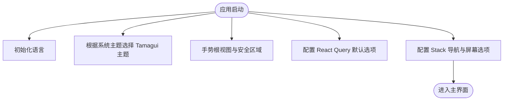
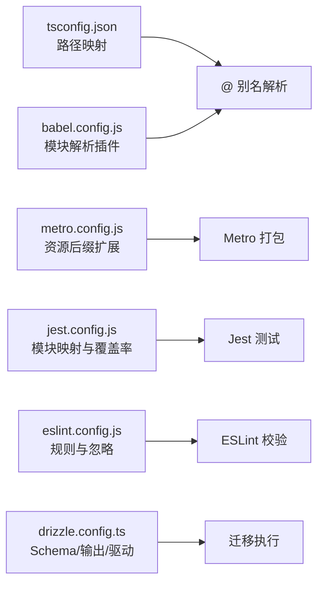

# 开发流程与工作规范

<cite>
**本文引用的文件**
- [package.json](file://package.json)
- [jest.config.js](file://jest.config.js)
- [metro.config.js](file://metro.config.js)
- [eslint.config.js](file://eslint.config.js)
- [tsconfig.json](file://tsconfig.json)
- [app.json](file://app.json)
- [drizzle.config.ts](file://drizzle.config.ts)
- [drizzle/migrations.ts](file://drizzle/migrations.ts)
- [babel.config.js](file://babel.config.js)
- [react-native.config.js](file://react-native.config.js)
- [app/_layout.tsx](file://app/_layout.tsx)
- [services/asr/asrService.ts](file://services/asr/asrService.ts)
- [hooks/useAudioRecorder.ts](file://hooks/useAudioRecorder.ts)
- [store/index.ts](file://store/index.ts)
- [db/client.ts](file://db/client.ts)
</cite>

## 目录
1. [简介](#简介)
2. [项目结构](#项目结构)
3. [核心组件](#核心组件)
4. [架构总览](#架构总览)
5. [详细组件分析](#详细组件分析)
6. [依赖关系分析](#依赖关系分析)
7. [性能考虑](#性能考虑)
8. [故障排查指南](#故障排查指南)
9. [结论](#结论)
10. [附录](#附录)

## 简介
本文件为 VoiceNote 项目的开发流程与工作规范文档，面向开发者与技术团队，系统性说明以下内容：
- Git 工作流与分支策略、合并流程与冲突解决
- 提交规范（消息格式、变更类型、版本标记）
- 代码审查流程（PR 模板、审查清单、反馈处理）
- 新功能开发标准流程（需求分析至测试验证）
- 本地开发环境搭建、调试与热重载
- 持续集成/持续部署（CI/CD）建议流程
- 版本管理与发布策略
- 开发工具使用指南（Metro、Jest、ESLint、TypeScript、Drizzle）
- 常见问题排查与解决方案

本项目采用 React Native（Expo）技术栈，结合 TypeScript、Tamagui UI、Zustand 状态管理、React Query 数据获取、SQLite 数据库（Drizzle ORM），以及 ASR/LLM 等服务模块。

## 项目结构
项目采用按功能域分层的组织方式：
- 应用入口与路由：app/_layout.tsx、app.json
- 组件层：components/*（UI 组件、业务组件）
- 钩子层：hooks/*（业务逻辑钩子）
- 服务层：services/*（ASR、LLM、搜索、上传、媒体存储等）
- 存储层：store/*（Zustand 状态）
- 数据库：db/*、drizzle/*（SQLite + Drizzle ORM）
- 国际化：i18n/*
- 主题与样式：theme/*
- 类型定义：types/*
- 工具函数：utils/*

图表来源
- [app/_layout.tsx:1-101](file://app/_layout.tsx#L1-L101)
- [app.json:1-86](file://app.json#L1-L86)

章节来源
- [app/_layout.tsx:1-101](file://app/_layout.tsx#L1-L101)
- [app.json:1-86](file://app.json#L1-L86)

## 核心组件
- 路由与全局 Provider：在应用根布局中配置 React Query、Tamagui、国际化、深色/浅色主题、手势与安全区域等。
- 音频录制与播放：通过 hooks/useAudioRecorder.ts 封装录音生命周期、权限请求、播放控制与文件信息读取。
- ASR 语音转写：通过 services/asr/asrService.ts 封装转写接口调用、超时控制、错误处理与配置加载。
- 数据库与迁移：通过 db/client.ts 初始化 SQLite 并执行 Drizzle 迁移；drizzle.config.ts 定义迁移路径与驱动。
- 构建与打包：Metro 配置扩展资源后缀；Babel 配置别名与插件；TypeScript 路径映射；Jest 配置模块映射与覆盖率收集范围。

章节来源
- [app/_layout.tsx:15-24](file://app/_layout.tsx#L15-L24)
- [hooks/useAudioRecorder.ts:26-38](file://hooks/useAudioRecorder.ts#L26-L38)
- [services/asr/asrService.ts:24-73](file://services/asr/asrService.ts#L24-L73)
- [db/client.ts:1-15](file://db/client.ts#L1-L15)
- [drizzle.config.ts:1-12](file://drizzle.config.ts#L1-L12)
- [metro.config.js:1-8](file://metro.config.js#L1-L8)
- [babel.config.js:1-27](file://babel.config.js#L1-L27)
- [tsconfig.json:1-63](file://tsconfig.json#L1-L63)
- [jest.config.js:1-47](file://jest.config.js#L1-L47)

## 架构总览
应用整体采用“页面路由 + 组件层 + 钩子层 + 服务层 + 存储层 + 数据库”的分层架构。全局状态通过 Zustand 管理，数据获取通过 React Query 缓存与重试，数据库通过 Drizzle ORM 访问 SQLite，国际化与主题通过 i18n 与 Tamagui 提供支持。

图表来源
- [app/_layout.tsx:1-101](file://app/_layout.tsx#L1-L101)
- [store/index.ts:1-8](file://store/index.ts#L1-L8)
- [db/client.ts:1-15](file://db/client.ts#L1-L15)
- [drizzle/migrations.ts:1-83](file://drizzle/migrations.ts#L1-L83)

## 详细组件分析

### 组件：音频录制与播放（useAudioRecorder）
该钩子封装了录音与播放的完整生命周期，包括权限请求、录音状态监听、暂停/恢复、停止与取消、播放进度与定位等。

图表来源
- [hooks/useAudioRecorder.ts:74-109](file://hooks/useAudioRecorder.ts#L74-L109)
- [hooks/useAudioRecorder.ts:111-133](file://hooks/useAudioRecorder.ts#L111-L133)
- [hooks/useAudioRecorder.ts:135-175](file://hooks/useAudioRecorder.ts#L135-L175)

章节来源
- [hooks/useAudioRecorder.ts:1-270](file://hooks/useAudioRecorder.ts#L1-L270)

### 组件：ASR 语音转写（asrService）
该服务负责加载配置、校验可用性、构造表单数据、发起转写请求、处理响应与异常，并设置超时控制。

图表来源
- [services/asr/asrService.ts:24-73](file://services/asr/asrService.ts#L24-L73)

章节来源
- [services/asr/asrService.ts:1-74](file://services/asr/asrService.ts#L1-L74)

### 组件：数据库初始化与迁移（db/client 与 drizzle）
应用启动时打开数据库并执行 Drizzle 迁移，确保表结构与索引符合当前版本。

图表来源
- [db/client.ts:1-15](file://db/client.ts#L1-L15)
- [drizzle/migrations.ts:1-83](file://drizzle/migrations.ts#L1-L83)

章节来源
- [db/client.ts:1-15](file://db/client.ts#L1-L15)
- [drizzle/migrations.ts:1-83](file://drizzle/migrations.ts#L1-L83)

### 组件：应用根布局与全局 Provider（_layout.tsx）
根布局集中配置国际化、主题、手势、安全区域、导航栈与查询客户端缓存策略。

图表来源
- [app/_layout.tsx:26-88](file://app/_layout.tsx#L26-L88)

章节来源
- [app/_layout.tsx:1-101](file://app/_layout.tsx#L1-L101)

## 依赖关系分析
- 构建与打包：Metro、Babel、TypeScript 路径映射与别名配置，确保模块解析一致。
- 测试：Jest 配置覆盖服务层与特定钩子，使用模块映射与测试环境扩展。
- 规范：ESLint + Prettier 配置，统一语法与风格，忽略特定目录与文件。
- 数据库：Drizzle 配置与迁移脚本，驱动为 Expo/SQLite。

图表来源
- [tsconfig.json:1-63](file://tsconfig.json#L1-L63)
- [babel.config.js:1-27](file://babel.config.js#L1-L27)
- [metro.config.js:1-8](file://metro.config.js#L1-L8)
- [jest.config.js:1-47](file://jest.config.js#L1-L47)
- [eslint.config.js:1-84](file://eslint.config.js#L1-L84)
- [drizzle.config.ts:1-12](file://drizzle.config.ts#L1-L12)

章节来源
- [tsconfig.json:1-63](file://tsconfig.json#L1-L63)
- [babel.config.js:1-27](file://babel.config.js#L1-L27)
- [metro.config.js:1-8](file://metro.config.js#L1-L8)
- [jest.config.js:1-47](file://jest.config.js#L1-L47)
- [eslint.config.js:1-84](file://eslint.config.js#L1-L84)
- [drizzle.config.ts:1-12](file://drizzle.config.ts#L1-L12)

## 性能考虑
- React Query 缓存与过期策略：合理设置 staleTime 与 gcTime，减少重复请求与内存占用。
- 录音与播放：避免频繁创建播放器实例，复用 playerSource；播放进度轮询周期适中，避免高频更新。
- 数据库：迁移在应用启动阶段一次性执行，避免运行时重复迁移；查询尽量使用索引列。
- 打包与资源：Metro 扩展资源后缀，避免额外转换开销；TS/Jest 配置避免不必要的编译与测试范围。

章节来源
- [app/_layout.tsx:15-24](file://app/_layout.tsx#L15-L24)
- [hooks/useAudioRecorder.ts:207-246](file://hooks/useAudioRecorder.ts#L207-L246)
- [db/client.ts:1-15](file://db/client.ts#L1-L15)

## 故障排查指南
- 权限相关
  - 录音权限被拒：确认 app.json 中 iOS/Android 权限声明与 Info.plist/AndroidManifest 配置一致；在 useAudioRecorder 中捕获并提示用户授权。
  - 参考路径：[hooks/useAudioRecorder.ts:74-77](file://hooks/useAudioRecorder.ts#L74-L77)、[app.json:16-42](file://app.json#L16-L42)
- ASR 转写失败
  - 配置缺失：确认设置中已配置 ASR API 地址与密钥；检查环境变量与网络连通性。
  - 超时与错误：设置超时控制与错误提示，区分网络错误与业务错误。
  - 参考路径：[services/asr/asrService.ts:11-22](file://services/asr/asrService.ts#L11-L22)、[services/asr/asrService.ts:42-73](file://services/asr/asrService.ts#L42-L73)
- 数据库迁移
  - 启动失败：检查 drizzle 配置与迁移文件；确保 SQLite 文件可写且路径正确。
  - 参考路径：[db/client.ts:1-15](file://db/client.ts#L1-L15)、[drizzle.config.ts:1-12](file://drizzle.config.ts#L1-L12)、[drizzle/migrations.ts:1-83](file://drizzle/migrations.ts#L1-L83)
- 打包与模块解析
  - 模块找不到：检查 tsconfig 与 babel 的路径映射与别名；确认 jest moduleNameMapper 是否覆盖对应模块。
  - 参考路径：[tsconfig.json:6-55](file://tsconfig.json#L6-L55)、[babel.config.js:7-22](file://babel.config.js#L7-L22)、[jest.config.js:18-38](file://jest.config.js#L18-L38)
- 测试失败
  - 覆盖率与环境：确认测试环境与模块映射；检查 collectCoverageFrom 范围与测试文件命名。
  - 参考路径：[jest.config.js:1-47](file://jest.config.js#L1-L47)

章节来源
- [hooks/useAudioRecorder.ts:74-77](file://hooks/useAudioRecorder.ts#L74-L77)
- [services/asr/asrService.ts:11-22](file://services/asr/asrService.ts#L11-L22)
- [services/asr/asrService.ts:42-73](file://services/asr/asrService.ts#L42-L73)
- [db/client.ts:1-15](file://db/client.ts#L1-L15)
- [drizzle.config.ts:1-12](file://drizzle.config.ts#L1-L12)
- [drizzle/migrations.ts:1-83](file://drizzle/migrations.ts#L1-L83)
- [tsconfig.json:6-55](file://tsconfig.json#L6-L55)
- [babel.config.js:7-22](file://babel.config.js#L7-L22)
- [jest.config.js:1-47](file://jest.config.js#L1-L47)

## 结论
本规范文档基于现有仓库配置与代码实现，明确了开发流程、组件职责、工具链与故障排查方法。建议在实际协作中补充 Git 工作流、PR 模板与 CI/CD 流程细节，以进一步提升团队协作效率与交付质量。

## 附录

### 本地开发环境搭建与调试
- 安装依赖：使用包管理器安装依赖后，确保各平台权限与证书配置完成。
- 启动应用：通过脚本启动开发服务器，支持 Android/iOS/Web。
- 调试：启用热重载与远程调试；Metro 配置已扩展资源后缀。
- 参考路径：[package.json:5-18](file://package.json#L5-L18)、[metro.config.js:1-8](file://metro.config.js#L1-L8)、[app.json:1-86](file://app.json#L1-L86)

章节来源
- [package.json:5-18](file://package.json#L5-L18)
- [metro.config.js:1-8](file://metro.config.js#L1-L8)
- [app.json:1-86](file://app.json#L1-L86)

### 代码审查流程（建议模板）
- PR 模板建议字段
  - 摘要：简述变更目的与影响范围
  - 变更类型：修复/特性/重构/文档/其他
  - 测试验证：单元测试/集成测试/手动测试
  - 风险评估：对稳定性、性能、兼容性的影响
  - 备注：注意事项、回滚方案、相关 Issue
- 审查清单
  - 代码风格与规范（ESLint/Prettier）
  - 单元测试覆盖率与通过情况（Jest）
  - 性能与内存占用评估
  - 权限与隐私合规检查
  - 数据库迁移与兼容性
- 反馈处理
  - 明确修改点与截止时间
  - 二次审查与合并前自测

### 提交规范（建议）
- 提交消息格式
  - type(scope): subject
  - 示例：feat(asr): 添加 SenseVoiceProvider 支持
- 变更类型
  - feat：新增功能
  - fix：缺陷修复
  - docs：文档更新
  - style：不影响行为的样式调整
  - refactor：重构但不改变行为
  - perf：性能优化
  - test：新增或调整测试
  - chore：构建流程、依赖管理等杂项
- 版本标记
  - 语义化版本：主版本号.次版本号.修订号
  - 发布前更新 app.json 与 package.json 的版本号

### 版本管理与发布策略（建议）
- 分支策略
  - main：稳定发布分支
  - develop：集成分支，合并 feature 后同步到 main
  - feature/*：功能开发分支，基于 develop 创建
- 合并与冲突解决
  - 使用 rebase 保持线性历史；冲突优先在 feature 分支内解决
  - 合并前要求通过 CI 与代码审查
- 发布流程
  - 更新版本号与变更日志
  - 打标签并推送
  - 构建产物上传至分发平台或应用商店

### 开发工具使用指南
- Metro 打包器
  - 资源后缀扩展：在 Metro 配置中添加自定义后缀
  - 参考路径：[metro.config.js:5-5](file://metro.config.js#L5-L5)
- Jest 测试框架
  - 模块映射与测试环境：通过 moduleNameMapper 与 setupFilesAfterEnv
  - 覆盖率收集：指定服务层与特定文件
  - 参考路径：[jest.config.js:18-46](file://jest.config.js#L18-L46)
- ESLint 与 Prettier
  - 规则与忽略：统一风格与最佳实践
  - 参考路径：[eslint.config.js:38-53](file://eslint.config.js#L38-L53)
- TypeScript
  - 路径映射与严格模式：提升类型安全与模块解析一致性
  - 参考路径：[tsconfig.json:3-55](file://tsconfig.json#L3-L55)
- Drizzle ORM
  - 配置与迁移：定义 schema、输出目录与驱动
  - 参考路径：[drizzle.config.ts:3-11](file://drizzle.config.ts#L3-L11)、[drizzle/migrations.ts:1-83](file://drizzle/migrations.ts#L1-L83)