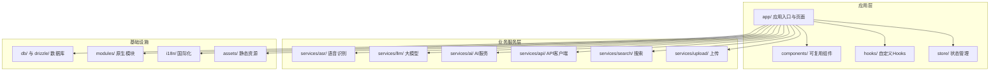
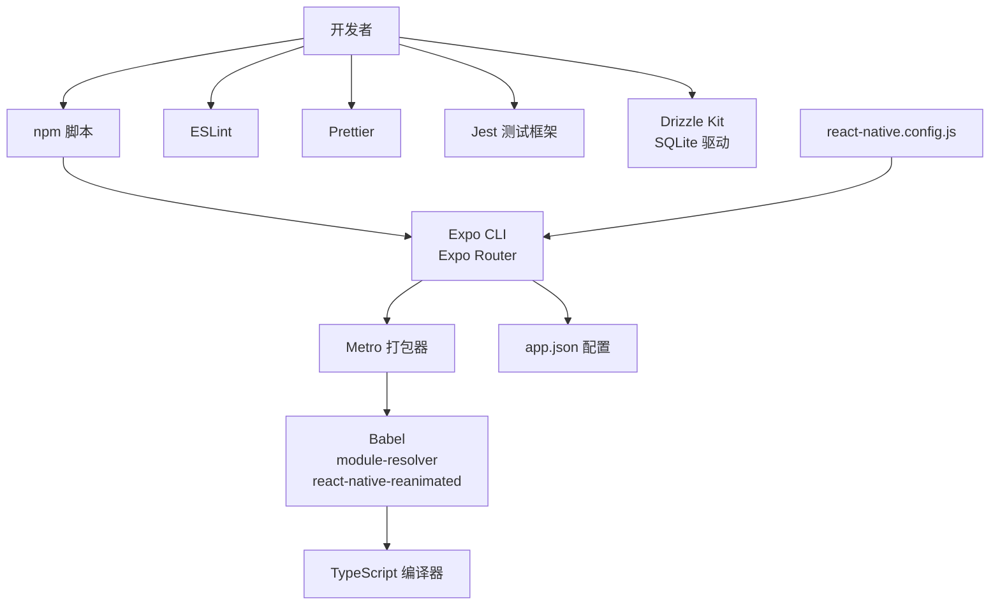
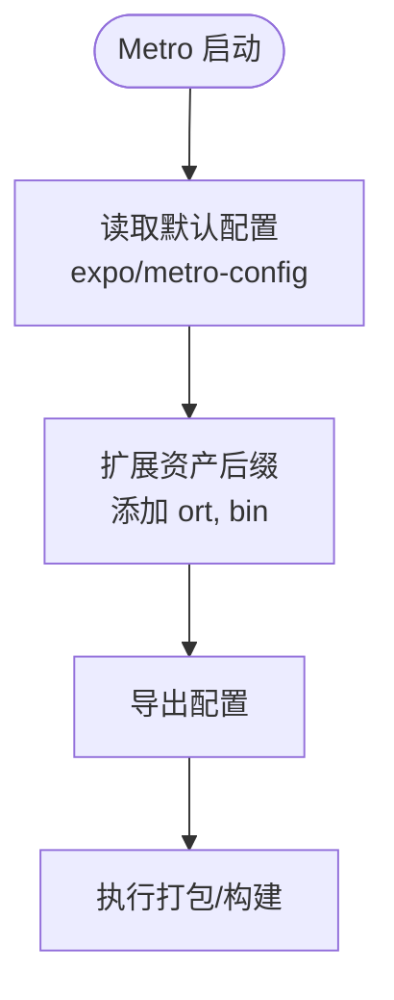
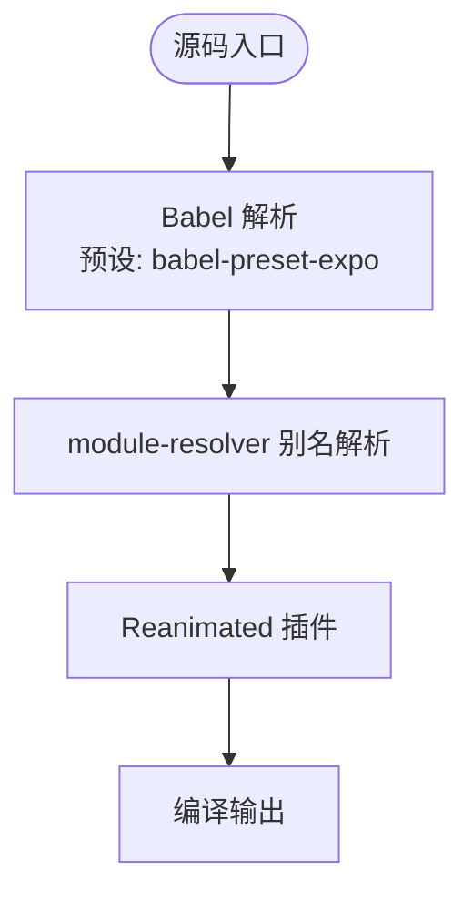
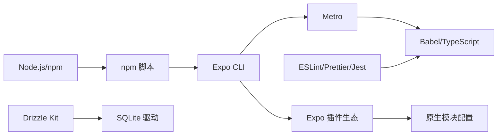

# 开发环境配置

<cite>
**本文档引用的文件**
- [package.json](file://package.json)
- [app.json](file://app.json)
- [metro.config.js](file://metro.config.js)
- [babel.config.js](file://babel.config.js)
- [tsconfig.json](file://tsconfig.json)
- [eslint.config.js](file://eslint.config.js)
- [.prettierrc](file://.prettierrc)
- [jest.config.js](file://jest.config.js)
- [drizzle.config.ts](file://drizzle.config.ts)
- [react-native.config.js](file://react-native.config.js)
- [jest.setup.js](file://jest.setup.js)
</cite>

## 目录
1. [简介](#简介)
2. [系统要求](#系统要求)
3. [项目结构](#项目结构)
4. [核心组件](#核心组件)
5. [架构总览](#架构总览)
6. [详细组件分析](#详细组件分析)
7. [依赖关系分析](#依赖关系分析)
8. [性能考虑](#性能考虑)
9. [故障排除指南](#故障排除指南)
10. [结论](#结论)
11. [附录](#附录)

## 简介
本指南面向 VoiceNote（Pieces）项目的开发者，提供从零开始搭建开发环境的完整流程，涵盖系统要求、依赖安装、环境变量与开发工具配置、本地开发服务器（Metro 打包器）设置、热重载与调试工具连接、VS Code 配置、ESLint/Prettier/TypeScript 规则以及常见问题排查与效率提升技巧。所有配置均以仓库中的实际文件为依据，确保可复现性与准确性。

## 系统要求
- 操作系统
  - macOS：建议使用最新稳定版本，用于 iOS 开发与 Xcode 构建
  - Windows/Linux：建议使用最新稳定版本，用于 Android 开发与 Android Studio 构建
- Node.js
  - 项目使用 npm 脚本与 Expo CLI 进行开发与打包，需安装 Node.js（推荐 LTS 版本）
  - 具体版本请参考项目依赖中对 Node 的兼容范围（由包管理器与脚本引擎决定）
- Expo/React Native
  - React Native 版本：0.81.5
  - Expo SDK 版本：~54.0.33
  - Expo Router 版本：~6.0.23
  - 新架构已启用（newArchEnabled: true），需确保开发环境支持新架构
- 设备与模拟器
  - iOS：Xcode 最新稳定版，iOS 模拟器或真机（需配置签名与开发者账号）
  - Android：Android Studio 最新稳定版，Android 模拟器或真机（需启用开发者选项与 USB 调试）
- 数据库与本地存储
  - 使用 SQLite（expo-sqlite），数据库迁移与管理通过 drizzle-kit 工具链完成

章节来源
- [package.json:20-62](file://package.json#L20-L62)
- [app.json:9](file://app.json#L9)
- [react-native.config.js:12-29](file://react-native.config.js#L12-L29)

## 项目结构
项目采用基于功能模块的组织方式，主要目录与职责如下：
- app/：应用入口与页面布局，包含路由与页面组件
- components/：可复用 UI 组件与业务组件（音频、相机、输入、导航、笔记等）
- services/：业务服务层（ASR、LLM、AI、API、搜索、上传等）
- hooks/：自定义 React Hooks（音频录制、转录、媒体存储、笔记管理等）
- store/：状态管理（Zustand）
- db/ 与 drizzle/：数据库模式与迁移
- modules/：原生模块（moonshine 等）
- i18n/：国际化资源
- assets/：模型与静态资源
- 配置文件：package.json、app.json、metro.config.js、babel.config.js、tsconfig.json、eslint.config.js、.prettierrc、jest.config.js、drizzle.config.ts、react-native.config.js

图表来源
- [package.json:1-83](file://package.json#L1-L83)
- [app.json:1-86](file://app.json#L1-L86)

章节来源
- [package.json:1-83](file://package.json#L1-L83)
- [app.json:1-86](file://app.json#L1-L86)

## 核心组件
- 包管理与脚本
  - 使用 npm 脚本进行启动、构建、测试、类型检查、数据库迁移与 Studio 启动
  - 关键脚本：start、android、ios、web、lint、typecheck、test、db:generate、db:migrate、db:push、db:studio
- 配置文件
  - app.json：应用元数据、权限声明、平台特定配置、插件列表
  - metro.config.js：Metro 打包器扩展（新增资产后缀）
  - babel.config.js：Babel 预设与别名解析、Reanimated 插件
  - tsconfig.json：TypeScript 路径映射与严格模式
  - eslint.config.js：TypeScript ESLint 配置与规则
  - .prettierrc：代码格式化风格
  - jest.config.js：Jest 测试配置与模块映射
  - drizzle.config.ts：Drizzle ORM 配置（SQLite、expo 驱动）
  - react-native.config.js：本地原生模块配置（moonshine）

章节来源
- [package.json:5-18](file://package.json#L5-L18)
- [app.json:2-83](file://app.json#L2-L83)
- [metro.config.js:1-7](file://metro.config.js#L1-L7)
- [babel.config.js:1-26](file://babel.config.js#L1-L26)
- [tsconfig.json:1-63](file://tsconfig.json#L1-L63)
- [eslint.config.js:1-84](file://eslint.config.js#L1-L84)
- [.prettierrc:1-12](file://.prettierrc#L1-L12)
- [jest.config.js:1-47](file://jest.config.js#L1-L47)
- [drizzle.config.ts:1-12](file://drizzle.config.ts#L1-L12)
- [react-native.config.js:1-31](file://react-native.config.js#L1-L31)

## 架构总览
下图展示了开发环境的核心组件及其交互关系，包括 Metro 打包器、Babel/TS 编译、ESLint/Prettier、Jest 测试、Drizzle 数据库工具链以及 Expo 插件生态。

图表来源
- [package.json:5-18](file://package.json#L5-L18)
- [app.json:2-83](file://app.json#L2-L83)
- [metro.config.js:1-7](file://metro.config.js#L1-L7)
- [babel.config.js:1-26](file://babel.config.js#L1-L26)
- [tsconfig.json:1-63](file://tsconfig.json#L1-L63)
- [eslint.config.js:1-84](file://eslint.config.js#L1-L84)
- [.prettierrc:1-12](file://.prettierrc#L1-L12)
- [jest.config.js:1-47](file://jest.config.js#L1-L47)
- [drizzle.config.ts:1-12](file://drizzle.config.ts#L1-L12)
- [react-native.config.js:1-31](file://react-native.config.js#L1-L31)

## 详细组件分析

### Metro 打包器配置
- 默认配置继承自 expo/metro-config，并扩展了资产后缀以支持模型文件（如 ort、bin）
- 适用于开发与生产构建，确保资源正确打包与加载

图表来源
- [metro.config.js:1-7](file://metro.config.js#L1-L7)

章节来源
- [metro.config.js:1-7](file://metro.config.js#L1-L7)

### Babel 与路径别名
- 预设：babel-preset-expo
- 插件：
  - module-resolver：根目录别名映射（@、@components、@hooks、@services、@store、@db、@theme、@types、@utils）
  - react-native-reanimated/plugin：支持 Reanimated 工作线程
- 与 TypeScript 路径映射保持一致，确保编译与导入行为一致

图表来源
- [babel.config.js:1-26](file://babel.config.js#L1-L26)
- [tsconfig.json:6-55](file://tsconfig.json#L6-L55)

章节来源
- [babel.config.js:1-26](file://babel.config.js#L1-L26)
- [tsconfig.json:1-63](file://tsconfig.json#L1-L63)

### TypeScript 配置
- 继承 expo/tsconfig.base，启用严格模式
- 定义 baseUrl 与多组路径映射（@/*、@components/* 等），与 Babel 别名保持一致
- 包含 nativewind 类型声明文件

章节来源
- [tsconfig.json:1-63](file://tsconfig.json#L1-L63)

### ESLint 与 Prettier
- ESLint 使用 typescript-eslint 并集成 eslint-config-prettier，避免格式化冲突
- 规则要点：
  - 禁止未使用变量（忽略以 _ 开头的参数）
  - 对 any 使用警告
  - 显式模块边界类型规则关闭（便于快速开发）
- Prettier 配置：分号、尾逗号、单引号、行长、缩进、括号等风格
- 忽略目录：node_modules、drizzle、.expo、dist、*.config.js（保留 .eslint.config.js）

章节来源
- [eslint.config.js:1-84](file://eslint.config.js#L1-L84)
- [.prettierrc:1-12](file://.prettierrc#L1-L12)

### Jest 测试配置
- 测试环境：node
- 模块映射：与 Babel/TS 路径映射一致，包含 expo 与 i18n 的 mocks
- 覆盖率收集：针对 services/asr 与 hooks/useStreamingASR
- 设置文件：jset.setup.js 中抑制特定控制台警告

章节来源
- [jest.config.js:1-47](file://jest.config.js#L1-L47)
- [jest.setup.js:1-11](file://jest.setup.js#L1-L11)

### Drizzle 数据库工具链
- 配置：schema 路径、输出目录、SQLite 方言、expo 驱动、数据库 URL
- 常用命令：generate、migrate、push、studio
- 与 Expo SQLite 集成，适配移动端 SQLite 存储

章节来源
- [drizzle.config.ts:1-12](file://drizzle.config.ts#L1-L12)
- [package.json:15-18](file://package.json#L15-L18)

### Expo 与原生模块配置
- app.json：应用元数据、权限描述、平台配置、插件列表（expo-router、llama.rn、expo-sqlite、expo-camera、expo-audio、expo-video、expo-image-picker、expo-document-picker、expo-media-library）
- react-native.config.js：moonshine 本地模块配置（Android/iOS 平台源码路径与实例）
- 新架构已启用（newArchEnabled: true）

章节来源
- [app.json:2-83](file://app.json#L2-L83)
- [react-native.config.js:12-29](file://react-native.config.js#L12-L29)

## 依赖关系分析
- 开发工具链
  - Node.js + npm：执行脚本与管理依赖
  - Expo CLI：启动开发服务器、构建与发布
  - Metro：打包与资源处理
  - Babel/TypeScript：代码转换与类型检查
  - ESLint/Prettier：代码质量与格式化
  - Jest：单元测试与覆盖率
  - Drizzle Kit：数据库迁移与管理
- 运行时依赖
  - React 19、React Native 0.81.5、Expo 54、Expo Router 6
  - Tamagui UI、Reanimated、Zustand、Axios、SQLite、i18n、Llama RN、Minisearch 等

图表来源
- [package.json:5-18](file://package.json#L5-L18)
- [app.json:50-83](file://app.json#L50-L83)
- [drizzle.config.ts:1-12](file://drizzle.config.ts#L1-L12)

章节来源
- [package.json:5-18](file://package.json#L5-L18)
- [app.json:50-83](file://app.json#L50-L83)
- [drizzle.config.ts:1-12](file://drizzle.config.ts#L1-L12)

## 性能考虑
- 启用新架构（newArchEnabled: true）以获得更好的性能与稳定性
- 使用 Metro 资产扩展（.ort、.bin）减少重复打包与资源加载开销
- TypeScript 严格模式有助于早期发现潜在性能与类型问题
- Jest 覆盖率聚焦关键模块（ASR 与流式转录），提高测试效率
- ESLint 与 Prettier 集成避免格式化差异导致的构建波动

## 故障排除指南
- 依赖安装失败
  - 清理缓存并重新安装：删除 node_modules 与 lock 文件后执行安装
  - 确认 Node.js 版本满足项目需求
- Metro 打包错误
  - 检查 metro.config.js 是否正确扩展资产后缀
  - 清理 Metro 缓存：清除缓存目录后重启 Metro
- TypeScript 错误
  - 运行类型检查脚本定位问题；严格模式下逐项修复
- ESLint 报错
  - 使用自动修复或调整规则；确认与 Prettier 冲突已被 eslint-config-prettier 解决
- Jest 测试失败
  - 检查 moduleNameMapper 与 mocks 配置是否匹配路径别名
  - 在测试设置中过滤掉非必要警告
- 数据库迁移问题
  - 使用 drizzle-kit generate/migrate/push/studio 按顺序处理
  - 确保数据库 URL 与驱动配置正确
- 原生模块集成问题
  - 检查 react-native.config.js 中 moonshine 源码路径与平台配置
  - 确认插件已在 app.json 中注册

章节来源
- [metro.config.js:5](file://metro.config.js#L5)
- [babel.config.js:7-22](file://babel.config.js#L7-L22)
- [tsconfig.json:4](file://tsconfig.json#L4)
- [eslint.config.js:38-42](file://eslint.config.js#L38-L42)
- [jest.config.js:18-38](file://jest.config.js#L18-L38)
- [drizzle.config.ts:8-10](file://drizzle.config.ts#L8-L10)
- [react-native.config.js:14-26](file://react-native.config.js#L14-L26)
- [app.json:50-83](file://app.json#L50-L83)

## 结论
本指南基于仓库中的实际配置文件，提供了从系统要求到开发工具链、从 Metro 打包器到数据库工具链的全栈开发环境搭建与维护方案。遵循本文档可显著降低环境配置成本，提升开发效率与一致性。

## 附录
- 开发工具推荐
  - VS Code：安装 ESLint、Prettier、TypeScript、React Native 工具链扩展
  - 快捷键建议：保存时自动格式化、Ctrl/Cmd + Shift + P 打开命令面板选择“ESLint：Fix All Auto Fixable Problems”
  - 调试：使用 Expo DevTools 或浏览器调试工具连接 Metro
- 常用命令速查
  - 启动开发服务器：npm start
  - 运行 Android：npm run android
  - 运行 iOS：npm run ios
  - 运行 Web：npm run web
  - 代码检查：npm run lint
  - 类型检查：npm run typecheck
  - 单元测试：npm run test
  - 数据库：npm run db:generate / db:migrate / db:push / db:studio