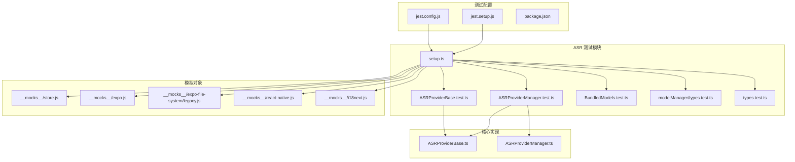
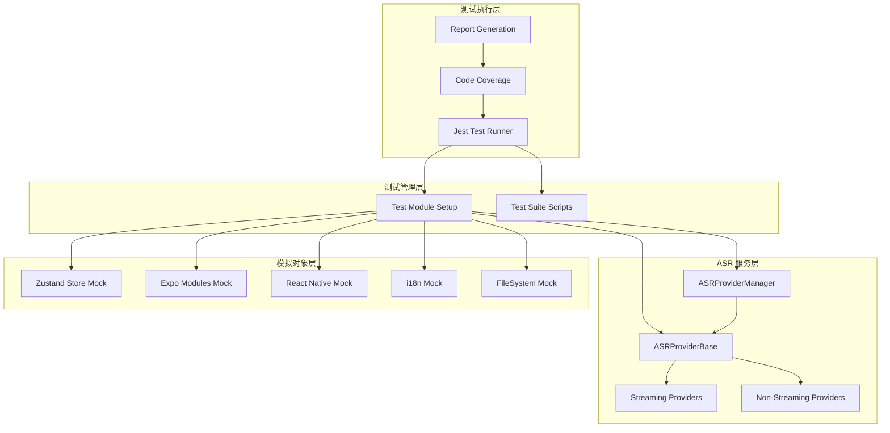
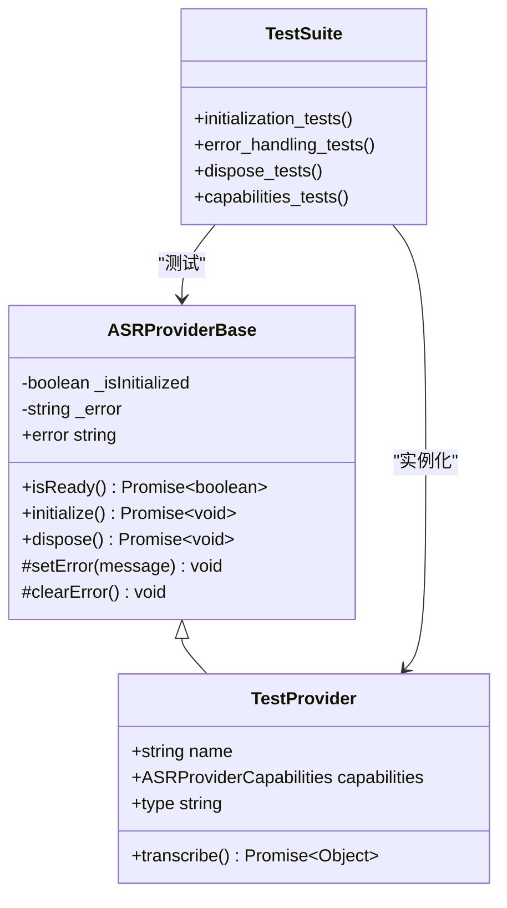
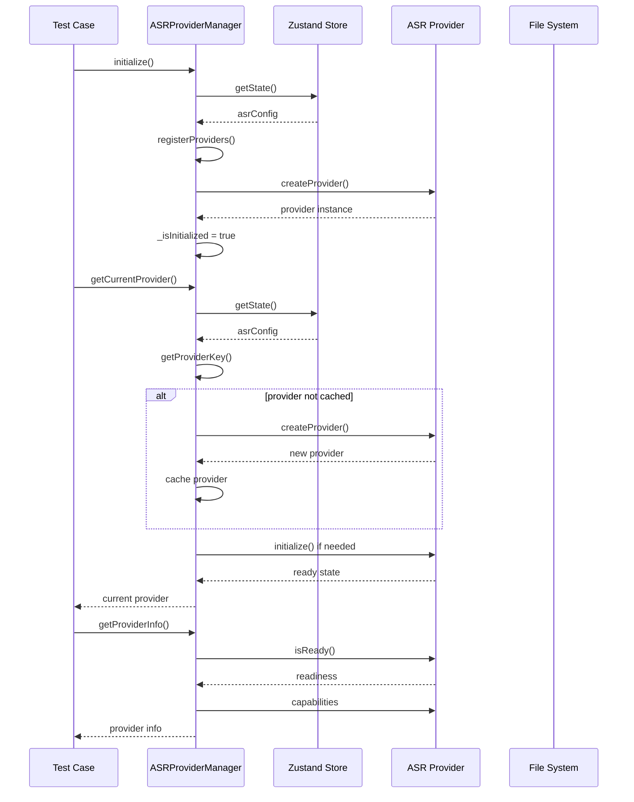
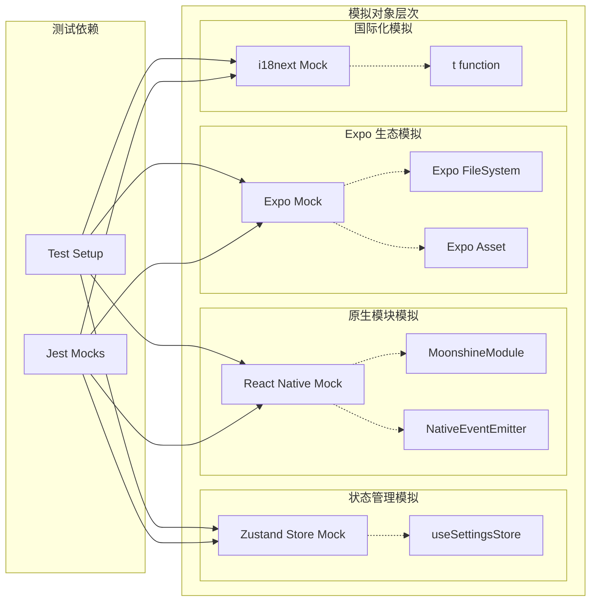
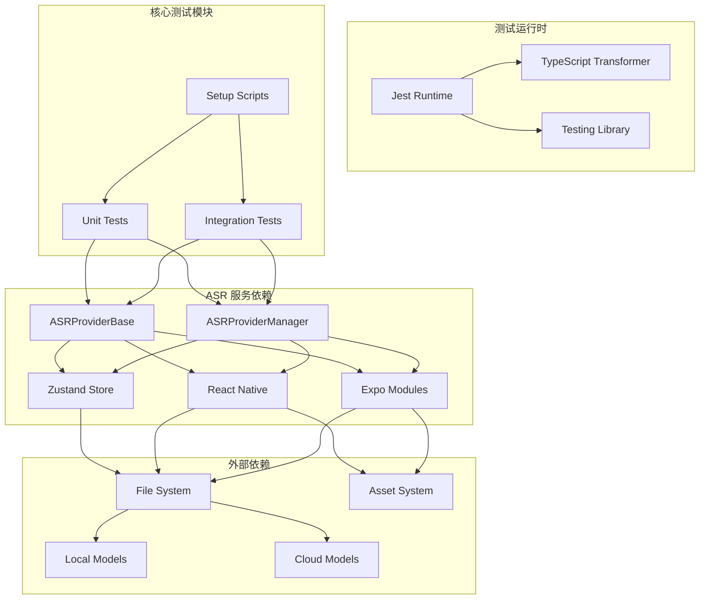

# 测试工作流程

<cite>
**本文档引用的文件**
- [jest.config.js](file://jest.config.js)
- [jest.setup.js](file://jest.setup.js)
- [package.json](file://package.json)
- [services/asr/__tests__/setup.ts](file://services/asr/__tests__/setup.ts)
- [services/asr/__tests__/ASRProviderBase.test.ts](file://services/asr/__tests__/ASRProviderBase.test.ts)
- [services/asr/__tests__/ASRProviderManager.test.ts](file://services/asr/__tests__/ASRProviderManager.test.ts)
- [services/asr/providers/base/ASRProviderBase.ts](file://services/asr/providers/base/ASRProviderBase.ts)
- [services/asr/providers/ASRProviderManager.ts](file://services/asr/providers/ASRProviderManager.ts)
- [__mocks__/store.js](file://__mocks__/store.js)
- [__mocks__/expo.js](file://__mocks__/expo.js)
- [__mocks__/expo-file-system/legacy.js](file://__mocks__/expo-file-system/legacy.js)
- [__mocks__/react-native.js](file://__mocks__/react-native.js)
- [__mocks__/i18next.js](file://__mocks__/i18next.js)
</cite>

## 目录
1. [简介](#简介)
2. [项目结构](#项目结构)
3. [核心组件](#核心组件)
4. [架构概览](#架构概览)
5. [详细组件分析](#详细组件分析)
6. [依赖分析](#依赖分析)
7. [性能考虑](#性能考虑)
8. [故障排除指南](#故障排除指南)
9. [结论](#结论)
10. [附录](#附录)

## 简介

VoiceNote 项目采用 Jest 作为主要测试框架，专注于语音识别（ASR）功能的完整测试覆盖。该项目实现了多层次的测试策略，包括单元测试、集成测试和模拟对象管理，确保语音转录服务的可靠性和稳定性。

项目的核心测试关注点是 ASR（自动语音识别）服务，特别是 ASRProviderBase 抽象基类和 ASRProviderManager 管理器的测试。通过精心设计的模拟对象和测试配置，项目能够在不依赖真实硬件的情况下进行全面的功能测试。

## 项目结构

VoiceNote 项目的测试结构遵循标准的 Jest 模式，采用按功能模块组织的测试文件布局：

**图表来源**
- [jest.config.js:1-47](file://jest.config.js#L1-L47)
- [services/asr/__tests__/setup.ts:1-99](file://services/asr/__tests__/setup.ts#L1-L99)

**章节来源**
- [jest.config.js:1-47](file://jest.config.js#L1-L47)
- [jest.setup.js:1-11](file://jest.setup.js#L1-L11)
- [package.json:1-83](file://package.json#L1-L83)

## 核心组件

### 测试配置系统

项目采用集中式的 Jest 配置，通过 `jest.config.js` 实现统一的测试环境设置：

**测试环境配置**
- 使用 Node.js 作为测试环境，避免与 Expo 生态系统的兼容性问题
- 集成 `@testing-library/jest-native` 扩展，提供 React Native 组件测试支持
- 自定义 TypeScript 转换器配置，启用 ES 模块互操作和合成默认导入

**模块名称映射**
项目实现了全面的模块别名映射，确保测试能够正确解析内部模块：
- `@/` → 项目根目录
- `@components/` → components 目录
- `@hooks/` → hooks 目录
- `@store/` → store 目录
- `@services/` → services 目录
- `@db/` → db 目录
- `@theme/` → theme 目录
- `@types/` → types 目录
- `@utils/` → utils 目录

**模拟对象管理**
通过专门的 `__mocks__` 目录管理第三方库和原生模块的模拟实现：
- Expo 生态系统模块模拟
- React Native 原生模块模拟
- 国际化服务模拟
- 状态管理存储模拟

**章节来源**
- [jest.config.js:1-47](file://jest.config.js#L1-L47)
- [jest.setup.js:1-11](file://jest.setup.js#L1-L11)

### 测试脚本和执行流程

项目通过 `package.json` 提供多种测试执行选项：

**测试命令**
- `npm test` - 运行完整测试套件
- `npm run test:watch` - 启动监听模式进行开发时测试
- `npm run test:coverage` - 生成代码覆盖率报告

**覆盖率配置**
测试覆盖率仅针对特定模块收集：
- `services/asr/**/*.{ts,tsx}` - ASR 服务模块
- `hooks/useStreamingASR.ts` - 流式音频处理钩子
- 排除类型定义文件和测试文件本身

**章节来源**
- [package.json:12-18](file://package.json#L12-L18)
- [jest.config.js:40-45](file://jest.config.js#L40-L45)

## 架构概览

VoiceNote 项目的测试架构围绕 ASR 服务构建，形成了清晰的分层测试结构：

**图表来源**
- [services/asr/providers/base/ASRProviderBase.ts:1-66](file://services/asr/providers/base/ASRProviderBase.ts#L1-L66)
- [services/asr/providers/ASRProviderManager.ts:1-263](file://services/asr/providers/ASRProviderManager.ts#L1-L263)
- [services/asr/__tests__/setup.ts:1-99](file://services/asr/__tests__/setup.ts#L1-L99)

## 详细组件分析

### ASRProviderBase 测试分析

ASRProviderBase 是所有语音识别提供者的抽象基类，其测试重点关注状态管理和生命周期方法：

**图表来源**
- [services/asr/providers/base/ASRProviderBase.ts:13-65](file://services/asr/providers/base/ASRProviderBase.ts#L13-L65)
- [services/asr/__tests__/ASRProviderBase.test.ts:8-23](file://services/asr/__tests__/ASRProviderBase.test.ts#L8-L23)

**测试覆盖范围**
- 初始化状态验证：确保新实例处于未初始化状态
- 双重初始化安全：防止重复初始化导致的状态冲突
- 错误状态管理：验证错误状态的设置和清除机制
- 资源清理：确保 dispose 方法正确重置状态

**章节来源**
- [services/asr/__tests__/ASRProviderBase.test.ts:1-90](file://services/asr/__tests__/ASRProviderBase.test.ts#L1-L90)
- [services/asr/providers/base/ASRProviderBase.ts:1-66](file://services/asr/providers/base/ASRProviderBase.ts#L1-L66)

### ASRProviderManager 测试分析

ASRProviderManager 是 ASR 服务的核心协调器，负责管理不同类型的语音识别提供者：

**图表来源**
- [services/asr/providers/ASRProviderManager.ts:38-100](file://services/asr/providers/ASRProviderManager.ts#L38-L100)
- [services/asr/providers/ASRProviderManager.ts:197-233](file://services/asr/providers/ASRProviderManager.ts#L197-L233)

**测试重点**
- 提供者注册和缓存机制
- 动态提供者切换逻辑
- 状态管理和错误处理
- 生命周期协调

**章节来源**
- [services/asr/__tests__/ASRProviderManager.test.ts:1-133](file://services/asr/__tests__/ASRProviderManager.test.ts#L1-L133)
- [services/asr/providers/ASRProviderManager.ts:1-263](file://services/asr/providers/ASRProviderManager.ts#L1-L263)

### 模拟对象管理系统

项目实现了全面的模拟对象系统，用于隔离外部依赖：

**图表来源**
- [__mocks__/store.js:1-24](file://__mocks__/store.js#L1-L24)
- [__mocks__/react-native.js:1-37](file://__mocks__/react-native.js#L1-L37)
- [__mocks__/expo.js:1-9](file://__mocks__/expo.js#L1-L9)
- [__mocks__/i18next.js:1-11](file://__mocks__/i18next.js#L1-L11)

**模拟策略**
- **渐进式模拟**：从底层原生模块开始，逐步构建上层依赖
- **状态隔离**：确保测试间不会相互影响
- **行为控制**：允许精确控制模拟对象的行为
- **类型安全**：保持 TypeScript 类型检查的完整性

**章节来源**
- [services/asr/__tests__/setup.ts:5-59](file://services/asr/__tests__/setup.ts#L5-L59)
- [__mocks__/store.js:1-24](file://__mocks__/store.js#L1-L24)

## 依赖分析

### 测试依赖关系

VoiceNote 项目的测试依赖关系体现了清晰的分层架构：

**图表来源**
- [jest.config.js:9-16](file://jest.config.js#L9-L16)
- [services/asr/providers/ASRProviderManager.ts:8-23](file://services/asr/providers/ASRProviderManager.ts#L8-L23)

**依赖管理策略**
- **明确边界**：每个测试模块只依赖必要的接口
- **模拟隔离**：外部依赖完全通过模拟对象替代
- **状态管理**：使用 Zustand store 提供可预测的状态
- **资源管理**：确保测试后资源正确释放

**章节来源**
- [jest.config.js:18-38](file://jest.config.js#L18-L38)
- [services/asr/providers/ASRProviderManager.ts:1-263](file://services/asr/providers/ASRProviderManager.ts#L1-L263)

## 性能考虑

### 测试执行优化

VoiceNote 项目的测试性能优化主要体现在以下几个方面：

**并行执行**
- Jest 默认支持多进程并行测试执行
- 通过 `--maxWorkers` 参数控制并发度
- 避免模拟对象间的竞争条件

**内存管理**
- 测试结束后及时清理模拟对象
- 使用 `afterEach` 和 `afterAll` 确保资源释放
- 避免全局状态污染

**执行效率**
- 使用 `--watch` 模式进行增量测试
- 通过 `--testPathPattern` 精确指定测试文件
- 合理的测试文件组织减少扫描时间

## 故障排除指南

### 常见测试问题及解决方案

**模拟对象问题**
- **问题**：模拟对象行为不符合预期
- **解决方案**：检查 `__mocks__` 目录下的模拟实现，确保返回值类型正确

**状态管理问题**
- **问题**：测试间状态相互影响
- **解决方案**：在 `beforeEach` 中重新应用模拟，或使用 `jest.resetAllMocks()`

**异步测试问题**
- **问题**：Promise 拒绝但测试未捕获
- **解决方案**：使用 `await expect(...).rejects` 或 `done()` 回调

**模块解析问题**
- **问题**：Jest 无法找到模块
- **解决方案**：检查 `moduleNameMapper` 配置，确保路径映射正确

**章节来源**
- [services/asr/__tests__/setup.ts:85-99](file://services/asr/__tests__/setup.ts#L85-L99)
- [jest.config.js:18-38](file://jest.config.js#L18-L38)

## 结论

VoiceNote 项目的测试工作流程展现了现代 React Native 应用的测试最佳实践。通过精心设计的模拟对象系统、清晰的测试分层架构和完善的测试配置，项目实现了对核心 ASR 功能的全面覆盖。

**关键优势**
- 完善的模拟对象体系确保了测试的独立性和可靠性
- 清晰的模块分离便于维护和扩展
- 全面的测试覆盖保证了代码质量
- 合理的性能优化提升了开发效率

**未来改进方向**
- 扩展 UI 组件测试覆盖
- 集成端到端测试流程
- 优化测试数据管理策略
- 增强测试报告和监控能力

## 附录

### 测试编写规范

**文件命名约定**
- 测试文件使用 `.test.ts` 或 `.test.tsx` 扩展名
- 测试文件放置在被测试模块同级目录的 `__tests__` 文件夹中

**测试用例组织**
- 使用 `describe` 组织相关测试用例
- 使用 `beforeEach` 和 `afterEach` 管理测试状态
- 将测试数据和模拟对象定义在测试文件顶部

**断言最佳实践**
- 使用语义化的断言消息
- 避免过度断言具体实现细节
- 优先测试公开 API 行为

**异步测试处理**
- 使用 `async/await` 处理 Promise
- 正确处理异步错误
- 避免使用 `setTimeout` 进行测试等待