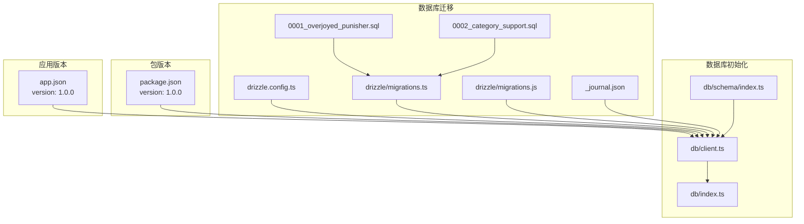
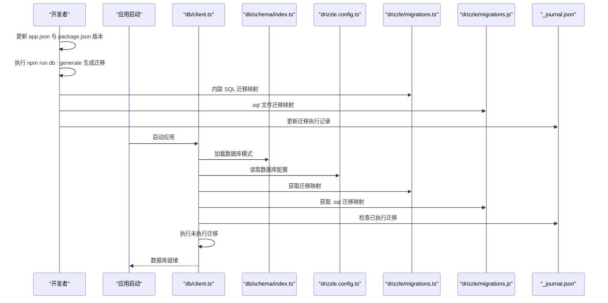
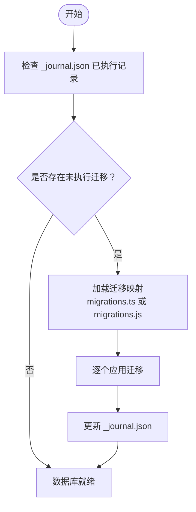
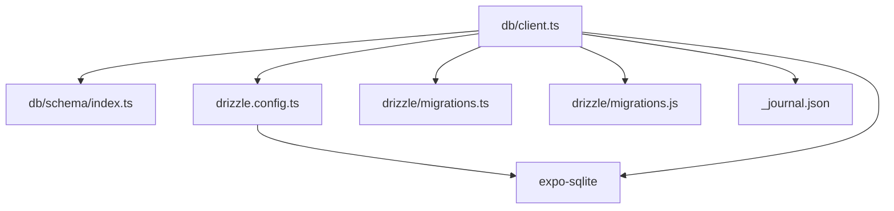

# 版本管理策略

<cite>
**本文档引用的文件**
- [package.json](file://package.json)
- [app.json](file://app.json)
- [drizzle.config.ts](file://drizzle.config.ts)
- [drizzle/migrations.ts](file://drizzle/migrations.ts)
- [drizzle/migrations.js](file://drizzle/migrations.js)
- [drizzle/meta/_journal.json](file://drizzle/meta/_journal.json)
- [drizzle/0001_overjoyed_punisher.sql](file://drizzle/0001_overjoyed_punisher.sql)
- [drizzle/0002_category_support.sql](file://drizzle/0002_category_support.sql)
- [db/schema/index.ts](file://db/schema/index.ts)
- [db/client.ts](file://db/client.ts)
- [db/index.ts](file://db/index.ts)
- [CLAUDE.md](file://CLAUDE.md)
</cite>

## 目录
1. [引言](#引言)
2. [项目结构](#项目结构)
3. [核心组件](#核心组件)
4. [架构总览](#架构总览)
5. [详细组件分析](#详细组件分析)
6. [依赖关系分析](#依赖关系分析)
7. [性能考虑](#性能考虑)
8. [故障排除指南](#故障排除指南)
9. [结论](#结论)
10. [附录](#附录)

## 引言
本文件为 VoiceNote 项目制定系统化的版本管理策略，覆盖以下方面：
- 语义化版本控制（SemVer）应用：明确主版本、次版本与补丁版本的发布规则与触发条件。
- 数据库版本管理：基于 Drizzle 的 SQLite 迁移体系，定义迁移文件命名规范、升级与回滚策略。
- 代码版本控制：统一版本标签管理、发布分支策略与版本号同步机制。
- 向后兼容性保证：API 兼容性检查、破坏性变更处理与弃用通知流程。
- 发布检查清单：确保每次发布均通过充分测试与验证。
- 版本历史记录与发布说明：维护规范化的版本演进文档。

## 项目结构
VoiceNote 是一个基于 React Native/Expo 的移动端应用，采用 Drizzle ORM + expo-sqlite 实现本地数据库存储，并通过 TanStack Query 管理服务端状态。项目中存在两套主要版本来源：
- 应用层版本：由 app.json 中的 "version" 字段定义，用于客户端分发渠道（App Store、Google Play、Web）。
- 包管理版本：由 package.json 中的 "version" 字段定义，用于 npm 生态与内部依赖管理。

**图表来源**
- [app.json:5](file://app.json#L5)
- [package.json:3](file://package.json#L3)
- [drizzle.config.ts:1-12](file://drizzle.config.ts#L1-L12)
- [drizzle/migrations.ts:1-83](file://drizzle/migrations.ts#L1-L83)
- [drizzle/migrations.js:1-14](file://drizzle/migrations.js#L1-L14)
- [drizzle/meta/_journal.json:1-27](file://drizzle/meta/_journal.json#L1-L27)
- [drizzle/0001_overjoyed_punisher.sql:1-13](file://drizzle/0001_overjoyed_punisher.sql#L1-L13)
- [drizzle/0002_category_support.sql:1-11](file://drizzle/0002_category_support.sql#L1-L11)
- [db/schema/index.ts:1-75](file://db/schema/index.ts#L1-L75)
- [db/client.ts:1-15](file://db/client.ts#L1-L15)
- [db/index.ts:1-26](file://db/index.ts#L1-L26)

**章节来源**
- [app.json:1-86](file://app.json#L1-L86)
- [package.json:1-83](file://package.json#L1-L83)
- [drizzle.config.ts:1-12](file://drizzle.config.ts#L1-L12)
- [drizzle/migrations.ts:1-83](file://drizzle/migrations.ts#L1-L83)
- [drizzle/migrations.js:1-14](file://drizzle/migrations.js#L1-L14)
- [drizzle/meta/_journal.json:1-27](file://drizzle/meta/_journal.json#L1-L27)
- [drizzle/0001_overjoyed_punisher.sql:1-13](file://drizzle/0001_overjoyed_punisher.sql#L1-L13)
- [drizzle/0002_category_support.sql:1-11](file://drizzle/0002_category_support.sql#L1-L11)
- [db/schema/index.ts:1-75](file://db/schema/index.ts#L1-L75)
- [db/client.ts:1-15](file://db/client.ts#L1-L15)
- [db/index.ts:1-26](file://db/index.ts#L1-L26)

## 核心组件
- 应用版本管理
  - app.json 中的 "version" 字段用于客户端分发渠道的版本标识。
  - package.json 中的 "version" 字段用于 npm 生态与内部依赖管理。
  - 建议：在发布前统一同步两处版本号，避免客户端与包管理生态不一致。
- 数据库迁移管理
  - drizzle.config.ts 定义了 SQLite 方言、驱动与模式路径。
  - drizzle/migrations.ts 以内联 SQL 的方式声明迁移映射。
  - drizzle/migrations.js 提供 .sql 文件导入的迁移映射（当前仓库同时存在两种映射方式）。
  - _journal.json 记录已执行迁移的版本与时间戳，支持迁移追踪与回滚。
  - db/schema/index.ts 定义数据库表结构，db/client.ts 在应用启动时自动执行迁移。
- 版本脚本与工具
  - package.json 中提供数据库相关脚本：db:generate、db:migrate、db:push、db:studio，便于生成与执行迁移。

**章节来源**
- [app.json:5](file://app.json#L5)
- [package.json:3](file://package.json#L3)
- [drizzle.config.ts:1-12](file://drizzle.config.ts#L1-L12)
- [drizzle/migrations.ts:1-83](file://drizzle/migrations.ts#L1-L83)
- [drizzle/migrations.js:1-14](file://drizzle/migrations.js#L1-L14)
- [drizzle/meta/_journal.json:1-27](file://drizzle/meta/_journal.json#L1-L27)
- [db/schema/index.ts:1-75](file://db/schema/index.ts#L1-L75)
- [db/client.ts:1-15](file://db/client.ts#L1-L15)
- [package.json:15-18](file://package.json#L15-L18)

## 架构总览
下图展示了版本管理在系统中的关键交互点：应用版本、包版本与数据库迁移之间的关系，以及 Drizzle 迁移在应用启动时的执行流程。

**图表来源**
- [db/client.ts:1-15](file://db/client.ts#L1-L15)
- [db/schema/index.ts:1-75](file://db/schema/index.ts#L1-L75)
- [drizzle.config.ts:1-12](file://drizzle.config.ts#L1-L12)
- [drizzle/migrations.ts:1-83](file://drizzle/migrations.ts#L1-L83)
- [drizzle/migrations.js:1-14](file://drizzle/migrations.js#L1-L14)
- [drizzle/meta/_journal.json:1-27](file://drizzle/meta/_journal.json#L1-L27)

## 详细组件分析

### 语义化版本控制（SemVer）
- 主版本（Major）：引入破坏性变更，如删除或重命名数据库表、字段变更导致无法自动迁移、API 行为重大调整等。
- 次版本（Minor）：新增功能或向后兼容的变更，如新增表或新增非关键字段。
- 补丁版本（Patch）：修复 bug 或非用户可见的内部优化，不引入新功能或破坏性变更。
- 触发条件建议：
  - 数据库结构变更：优先考虑补丁或次版本，尽量保持向后兼容；若必须破坏性变更，则提升主版本。
  - API 变更：新增端点或返回字段视为次版本；删除或重命名字段视为破坏性变更，需提升主版本。
  - 客户端行为变更：影响用户体验的变更按破坏性程度提升主版本或次版本。

**章节来源**
- [db/schema/index.ts:1-75](file://db/schema/index.ts#L1-L75)
- [drizzle/migrations.ts:1-83](file://drizzle/migrations.ts#L1-L83)

### 数据库版本管理（Drizzle 迁移）
- 迁移文件命名规范
  - 当前仓库同时存在内联 SQL 映射与 .sql 文件映射。建议统一采用 .sql 文件映射方式，并遵循编号+描述的命名格式，例如 0001_overjoyed_punisher.sql。
  - _journal.json 记录已执行迁移的 tag 与时间戳，确保迁移幂等性与可追踪性。
- 升级策略
  - 应用启动时通过 db/client.ts 调用 migrate(db, migrations) 自动执行未执行的迁移。
  - 建议在开发阶段使用 db:generate 生成迁移，db:push 推送结构到数据库进行快速验证。
- 回滚机制
  - Drizzle 迁移默认不提供自动回滚。建议在引入破坏性变更时：
    - 保留旧迁移文件作为“降级参考”。
    - 在 _journal.json 中谨慎更新已执行记录，必要时手动干预数据库状态。
    - 对于可逆操作，优先使用 ALTER TABLE 语句而非 DROP TABLE。
- 迁移映射一致性
  - 当前仓库同时存在 migrations.ts（内联 SQL）与 migrations.js（.sql 文件导入），建议统一一种方式，避免映射不一致导致的迁移失败。

**图表来源**
- [db/client.ts:11-12](file://db/client.ts#L11-L12)
- [drizzle/migrations.ts:6-82](file://drizzle/migrations.ts#L6-L82)
- [drizzle/migrations.js:7-13](file://drizzle/migrations.js#L7-L13)
- [drizzle/meta/_journal.json:1-27](file://drizzle/meta/_journal.json#L1-L27)

**章节来源**
- [db/client.ts:1-15](file://db/client.ts#L1-L15)
- [drizzle/migrations.ts:1-83](file://drizzle/migrations.ts#L1-L83)
- [drizzle/migrations.js:1-14](file://drizzle/migrations.js#L1-L14)
- [drizzle/meta/_journal.json:1-27](file://drizzle/meta/_journal.json#L1-L27)

### 代码版本控制策略
- 版本标签管理
  - 建议使用 Git 标签对发布版本进行标记，标签名与 app.json/package.json 版本保持一致。
  - 发布前统一校验并同步 app.json 与 package.json 的版本号。
- 发布分支策略
  - 建议采用 Git Flow：develop 分支用于集成特性，release 分支用于发布准备与最终测试，master/main 用于发布。
  - 在 release 分支上完成版本号同步、迁移验证与发布检查清单执行。
- 版本号同步机制
  - 在 CI/CD 流程中加入“版本号一致性检查”，确保 app.json 与 package.json 的版本一致。
  - 在发布脚本中自动更新 CHANGELOG 并创建对应标签。

**章节来源**
- [app.json:5](file://app.json#L5)
- [package.json:3](file://package.json#L3)

### 向后兼容性保证
- API 兼容性检查
  - 新增 API 端点或返回字段应保持向后兼容；删除或重命名字段需提升主版本并在发布说明中明确标注。
  - 使用版本化 API（如 /v1/...）有助于平滑过渡。
- 破坏性变更处理
  - 对数据库结构的破坏性变更（如删除列、重命名表）需提供迁移脚本或数据迁移逻辑。
  - 在 _journal.json 中谨慎记录破坏性变更，必要时提供降级方案。
- 弃用通知流程
  - 对即将弃用的功能，提前在次要版本中发出弃用警告，并在后续主版本中移除。
  - 在发布说明中明确弃用时间表与替代方案。

**章节来源**
- [db/schema/index.ts:1-75](file://db/schema/index.ts#L1-L75)
- [drizzle/meta/_journal.json:1-27](file://drizzle/meta/_journal.json#L1-L27)

### 版本发布检查清单
- 代码质量
  - 通过 ESLint 与 TypeScript 类型检查。
  - 单元测试与集成测试全部通过，覆盖率达标。
- 数据库迁移
  - 执行 db:generate 生成迁移并通过 db:push 验证结构。
  - 在多设备/平台验证迁移执行结果，确认 _journal.json 正确更新。
- 应用版本
  - app.json 与 package.json 版本号一致且符合 SemVer。
  - 本地构建与签名通过，无权限或资源缺失问题。
- 发布说明
  - 编写清晰的版本说明，包含新增功能、修复问题、破坏性变更与弃用信息。
  - 提供回滚指引（如有破坏性变更）。

**章节来源**
- [package.json:10-18](file://package.json#L10-L18)
- [CLAUDE.md:14-16](file://CLAUDE.md#L14-L16)

### 版本历史记录与发布说明
- 版本历史记录维护
  - 使用 CHANGELOG 格式记录每个版本的变更摘要，包含类型（新增、修复、破坏性变更、弃用）与简要描述。
  - 将版本与 Git 标签关联，便于追溯。
- 发布说明编写规范
  - 结构化：标题、版本号、发布日期、核心变更、技术细节、已知问题、回滚指引。
  - 清晰性：避免技术术语，面向用户与开发者双重视角描述影响范围。

**章节来源**
- [drizzle/meta/_journal.json:1-27](file://drizzle/meta/_journal.json#L1-L27)

## 依赖关系分析
- 组件耦合
  - db/client.ts 依赖 db/schema/index.ts 的模式定义，并通过 drizzle.config.ts 的配置连接数据库。
  - 迁移映射（migrations.ts 或 migrations.js）与 _journal.json 共同决定迁移执行顺序与状态。
- 外部依赖
  - Drizzle ORM 与 expo-sqlite 提供 SQLite 驱动与迁移能力。
  - TanStack Query 与 Axios 用于服务端状态管理与 API 调用，与数据库版本管理相对独立。

**图表来源**
- [db/client.ts:1-15](file://db/client.ts#L1-L15)
- [db/schema/index.ts:1-75](file://db/schema/index.ts#L1-L75)
- [drizzle.config.ts:1-12](file://drizzle.config.ts#L1-L12)
- [drizzle/migrations.ts:1-83](file://drizzle/migrations.ts#L1-L83)
- [drizzle/migrations.js:1-14](file://drizzle/migrations.js#L1-L14)
- [drizzle/meta/_journal.json:1-27](file://drizzle/meta/_journal.json#L1-L27)

**章节来源**
- [db/client.ts:1-15](file://db/client.ts#L1-L15)
- [db/schema/index.ts:1-75](file://db/schema/index.ts#L1-L75)
- [drizzle.config.ts:1-12](file://drizzle.config.ts#L1-L12)
- [drizzle/migrations.ts:1-83](file://drizzle/migrations.ts#L1-L83)
- [drizzle/migrations.js:1-14](file://drizzle/migrations.js#L1-L14)
- [drizzle/meta/_journal.json:1-27](file://drizzle/meta/_journal.json#L1-L27)

## 性能考虑
- 迁移性能
  - 大型迁移可能影响应用启动时间，建议拆分为多个小迁移并添加索引优化。
  - 在生产环境避免一次性执行大量 ALTER TABLE 操作，可分批进行。
- 版本同步
  - 在 CI/CD 中并行执行代码检查与数据库迁移验证，缩短发布周期。
- 缓存与回滚
  - 利用 _journal.json 快速判断是否需要迁移，减少不必要的数据库扫描。

## 故障排除指南
- 迁移失败
  - 检查 _journal.json 是否与当前迁移映射一致，必要时手动修正。
  - 确认 db:generate 与 db:push 的执行顺序正确。
- 版本不一致
  - 校验 app.json 与 package.json 的版本号，确保发布前同步。
- 启动异常
  - 检查 db/client.ts 的 migrate 调用是否成功，确认数据库驱动与配置正确。

**章节来源**
- [db/client.ts:11-12](file://db/client.ts#L11-L12)
- [drizzle/meta/_journal.json:1-27](file://drizzle/meta/_journal.json#L1-L27)
- [package.json:15-18](file://package.json#L15-L18)

## 结论
本策略文档为 VoiceNote 项目提供了从 SemVer 应用、数据库迁移管理到代码版本控制与兼容性保障的完整框架。建议在团队内推广并严格执行：统一版本号、规范迁移流程、完善发布检查清单与发布说明，以确保每次发布稳定可靠。

## 附录
- 关键文件路径与职责
  - app.json：应用版本与平台配置
  - package.json：包版本与脚本命令
  - drizzle.config.ts：数据库方言与驱动配置
  - drizzle/migrations.ts 与 drizzle/migrations.js：迁移映射
  - drizzle/meta/_journal.json：迁移执行记录
  - db/schema/index.ts：数据库模式定义
  - db/client.ts：数据库初始化与迁移执行

**章节来源**
- [app.json:1-86](file://app.json#L1-L86)
- [package.json:1-83](file://package.json#L1-L83)
- [drizzle.config.ts:1-12](file://drizzle.config.ts#L1-L12)
- [drizzle/migrations.ts:1-83](file://drizzle/migrations.ts#L1-L83)
- [drizzle/migrations.js:1-14](file://drizzle/migrations.js#L1-L14)
- [drizzle/meta/_journal.json:1-27](file://drizzle/meta/_journal.json#L1-L27)
- [db/schema/index.ts:1-75](file://db/schema/index.ts#L1-L75)
- [db/client.ts:1-15](file://db/client.ts#L1-L15)