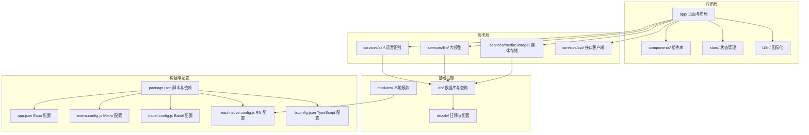
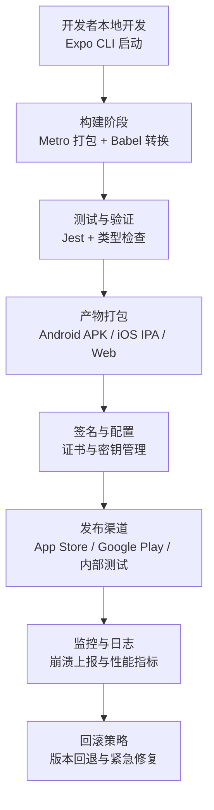
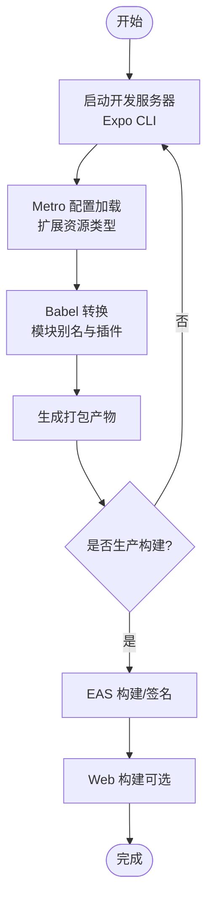
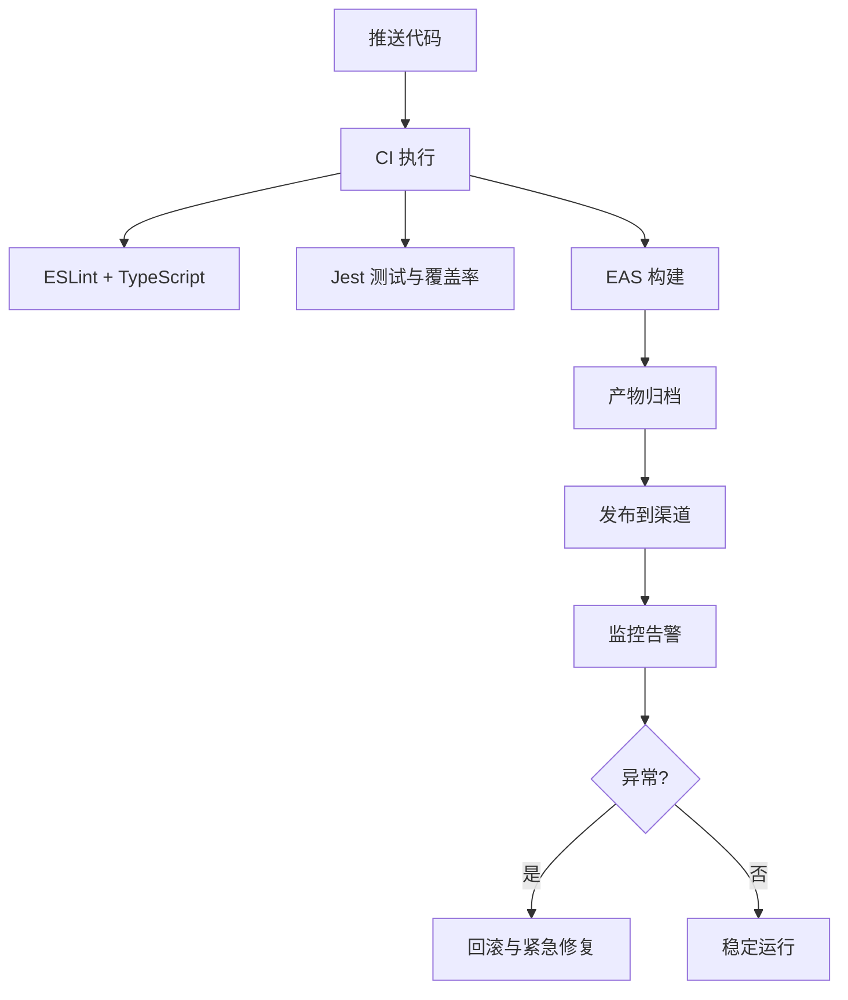
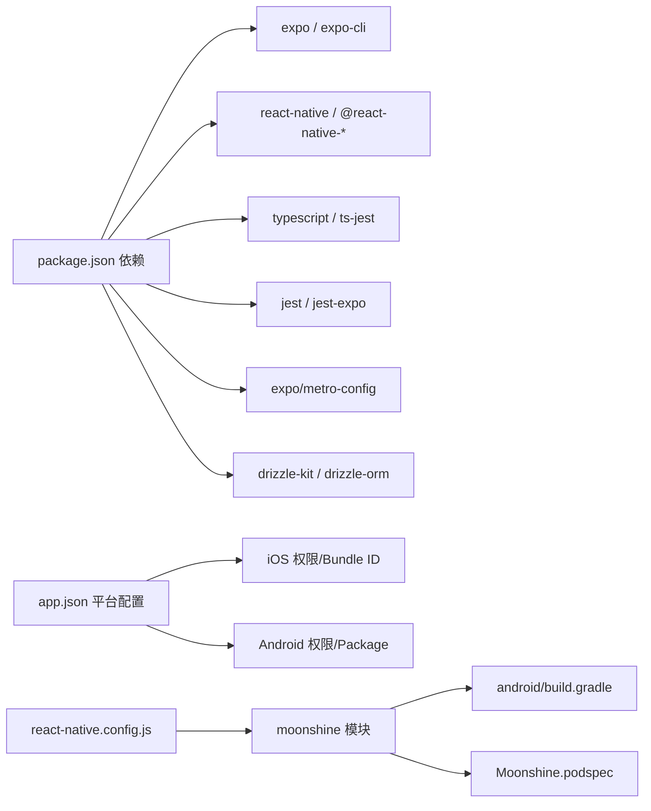

# 部署工作流程

<cite>
**本文引用的文件**
- [package.json](file://package.json)
- [app.json](file://app.json)
- [metro.config.js](file://metro.config.js)
- [babel.config.js](file://babel.config.js)
- [react-native.config.js](file://react-native.config.js)
- [tsconfig.json](file://tsconfig.json)
- [drizzle.config.ts](file://drizzle.config.ts)
- [jest.config.js](file://jest.config.js)
- [modules/moonshine/package.json](file://modules/moonshine/package.json)
- [modules/moonshine/android/build.gradle](file://modules/moonshine/android/build.gradle)
- [modules/moonshine/Moonshine.podspec](file://modules/moonshine/Moonshine.podspec)
- [.trellis/scripts/multi-agent/create-pr.sh](file://.trellis/scripts/multi-agent/create-pr.sh)
- [.trellis/scripts/multi-agent/start.sh](file://.trellis/scripts/multi-agent/start.sh)
- [.trellis/scripts/task.sh](file://.trellis/scripts/task.sh)
- [services/asr/modelManager/ModelStorage.ts](file://services/asr/modelManager/ModelStorage.ts)
- [app/settings/models.tsx](file://app/settings/models.tsx)
</cite>

## 目录
1. [简介](#简介)
2. [项目结构](#项目结构)
3. [核心组件](#核心组件)
4. [架构总览](#架构总览)
5. [详细组件分析](#详细组件分析)
6. [依赖分析](#依赖分析)
7. [性能考虑](#性能考虑)
8. [故障排查指南](#故障排查指南)
9. [结论](#结论)
10. [附录](#附录)

## 简介
本文件为 VoiceNote 项目制定标准化的部署工作流程文档，覆盖从开发到生产的完整路径，包括构建配置（开发、生产、Web）、应用打包与签名、发布流程（版本管理、渠道配置、发布前检查）、CI/CD 集成、应用商店发布准备、回滚与紧急修复策略，以及部署后的监控与日志收集建议。文档以项目现有配置为基础，结合实际可执行脚本与工程化实践，确保流程可落地、可追溯、可复现。

## 项目结构
VoiceNote 基于 Expo + React Native 技术栈，采用模块化组织方式：业务页面位于 app/，组件位于 components/，服务层位于 services/，状态管理位于 store/，国际化资源位于 i18n/，数据库与迁移位于 db/ 与 drizzle/，本地模块位于 modules/。构建与运行通过 npm scripts 管理，Metro 作为打包器，Babel 提供模块解析与插件支持，TypeScript 提供类型约束。



**图表来源**
- [package.json:1-83](file://package.json#L1-L83)
- [app.json:1-86](file://app.json#L1-L86)
- [metro.config.js:1-8](file://metro.config.js#L1-L8)
- [babel.config.js:1-27](file://babel.config.js#L1-L27)
- [react-native.config.js:1-31](file://react-native.config.js#L1-L31)
- [tsconfig.json:1-63](file://tsconfig.json#L1-L63)

**章节来源**
- [package.json:1-83](file://package.json#L1-L83)
- [app.json:1-86](file://app.json#L1-L86)
- [metro.config.js:1-8](file://metro.config.js#L1-L8)
- [babel.config.js:1-27](file://babel.config.js#L1-L27)
- [react-native.config.js:1-31](file://react-native.config.js#L1-L31)
- [tsconfig.json:1-63](file://tsconfig.json#L1-L63)

## 核心组件
- 构建与运行脚本：通过 npm scripts 管理启动、Android/iOS/浏览器运行、类型检查、Lint、测试、数据库迁移等任务。
- Expo 配置：集中定义应用元数据、平台权限、插件、资产打包范围等。
- Metro/Babel/TS 配置：统一模块别名、插件链、资源扩展、编译目标与路径映射。
- 本地模块与原生集成：moonshine 模块通过 react-native.config.js 与 Android Gradle、iOS Podspec 协作。
- 测试与覆盖率：Jest 配置与自定义模块别名、Mock，聚焦 ASR 与关键 Hook 的覆盖率采集。
- 数据库与迁移：Drizzle 配置与脚本，支持 SQLite 与 Expo 环境。

**章节来源**
- [package.json:5-18](file://package.json#L5-L18)
- [app.json:2-84](file://app.json#L2-L84)
- [metro.config.js:5-6](file://metro.config.js#L5-L6)
- [babel.config.js:5-24](file://babel.config.js#L5-L24)
- [tsconfig.json:3-55](file://tsconfig.json#L3-L55)
- [react-native.config.js:7-30](file://react-native.config.js#L7-L30)
- [jest.config.js:18-46](file://jest.config.js#L18-L46)
- [drizzle.config.ts:1-12](file://drizzle.config.ts#L1-L12)

## 架构总览
下图展示从开发到发布的端到端流程，涵盖本地开发、构建、测试、打包、签名、发布与回滚的关键节点。



[此图为概念性流程图，不直接映射具体源码文件，故无“图表来源”]

## 详细组件分析

### 构建流程与配置
- 开发构建
  - 使用 Expo CLI 启动开发服务器，自动热重载与调试工具接入。
  - Metro 默认配置已满足项目需求，额外添加模型文件扩展名以支持本地模型资源。
- 生产构建
  - 通过 Expo EAS 或原生构建工具生成发布包；Metro 配置中新增的资源扩展需同步到最终打包流程。
  - Babel 插件链启用模块别名解析与 Reanimated 插件，保证运行时行为一致。
- Web 构建
  - Web 平台由 Expo Router 与 Metro bundler 支持，配置中指定 bundler 为 metro。



**图表来源**
- [metro.config.js:1-8](file://metro.config.js#L1-L8)
- [babel.config.js:1-27](file://babel.config.js#L1-L27)
- [app.json:43-46](file://app.json#L43-L46)

**章节来源**
- [metro.config.js:1-8](file://metro.config.js#L1-L8)
- [babel.config.js:1-27](file://babel.config.js#L1-L27)
- [app.json:43-46](file://app.json#L43-L46)

### 应用打包与签名
- 原生应用打包
  - Android：通过 Gradle 构建，moonshine 模块在 Android 中使用 Kotlin 与 React Native 集成，依赖 Moonshine Voice SDK。
  - iOS：通过 CocoaPods 与 Swift Package Manager 集成，Moonshine.podspec 用于 CodeGen 与链接，实际实现位于主应用目标。
- APK/IPA 生成与签名
  - 使用 EAS Build 生成发布包；签名与证书管理应遵循平台规范（Apple Developer 证书与 Provisioning Profile、Android Keystore）。
  - 本地模块在原生层的集成点需在构建脚本中正确声明，避免缺失符号或链接错误。

```mermaid
sequenceDiagram
participant Dev as "开发者"
participant EAS as "EAS 构建"
participant AND as "Android 构建"
participant IOS as "iOS 构建"
Dev->>EAS : 触发构建
EAS->>AND : 编译 Android 模块与依赖
EAS->>IOS : 集成 iOS 模块与 SPM
AND-->>EAS : 生成 APK
IOS-->>EAS : 生成 IPA
EAS-->>Dev : 下载签名包
```

**图表来源**
- [modules/moonshine/android/build.gradle:1-37](file://modules/moonshine/android/build.gradle#L1-L37)
- [modules/moonshine/Moonshine.podspec:1-32](file://modules/moonshine/Moonshine.podspec#L1-L32)
- [react-native.config.js:12-29](file://react-native.config.js#L12-L29)

**章节来源**
- [modules/moonshine/android/build.gradle:1-37](file://modules/moonshine/android/build.gradle#L1-L37)
- [modules/moonshine/Moonshine.podspec:1-32](file://modules/moonshine/Moonshine.podspec#L1-L32)
- [react-native.config.js:12-29](file://react-native.config.js#L12-L29)

### 发布流程与版本管理
- 版本管理
  - 应用版本在 app.json 中统一维护，建议采用语义化版本控制并在发布前更新。
- 渠道配置
  - iOS：App Store Connect 与 Apple Developer 账户；Android：Google Play Console。
  - 渠道差异体现在权限、描述文案与审核策略，需在 app.json 与平台后台分别配置。
- 发布前检查清单
  - 代码质量：Lint 与类型检查通过。
  - 功能验证：关键路径（录音、转写、模型下载、媒体库）回归测试。
  - 资源与权限：assets、权限描述、隐私政策链接。
  - 包体与签名：包体大小、签名有效性、Proguard/R8 配置（如适用）。

**章节来源**
- [app.json:3-5](file://app.json#L3-L5)

### CI/CD 集成
- 自动化构建与测试
  - 在 CI 中执行：安装依赖、类型检查、Lint、单元测试与覆盖率统计。
  - 使用 EAS Build 生成发布包，结合环境变量注入证书与密钥。
- 部署流水线建议
  - 分支策略：feature -> review -> main；PR 自动生成 Draft PR 并附带 PRD 内容。
  - 审核与回滚：发布后监控异常，必要时触发回滚与紧急修复。



**图表来源**
- [.trellis/scripts/multi-agent/create-pr.sh:174-212](file://.trellis/scripts/multi-agent/create-pr.sh#L174-L212)
- [package.json:10-14](file://package.json#L10-L14)

**章节来源**
- [.trellis/scripts/multi-agent/create-pr.sh:174-212](file://.trellis/scripts/multi-agent/create-pr.sh#L174-L212)
- [package.json:10-14](file://package.json#L10-L14)

### 应用商店发布准备
- App Store（iOS）
  - 准备 App Store Connect 账号、Apple Developer 认证、TestFlight 分配。
  - app.json 中的 bundleIdentifier、权限描述需与后台一致。
- Google Play（Android）
  - 准备 Google Play Console 账号、内部测试轨道、分发设置。
  - 权限与隐私政策需符合平台要求。
- 审核准备
  - 准备截图、视频演示、隐私政策链接、FAQ。
  - 确保权限最小化与用户知情同意。

**章节来源**
- [app.json:16-42](file://app.json#L16-L42)

### 回滚策略与紧急修复
- 回滚策略
  - 保留最近 N 个版本的发布包与变更记录；回滚时优先选择上一个稳定版本。
  - 对于数据库变更，确保迁移脚本具备回滚能力或安全降级方案。
- 紧急修复
  - 快速修复通过 Hotfix 分支提交，走最小化回归测试后合并 main 并重新发布。
  - 记录修复原因、影响范围与回滚预案。

**章节来源**
- [drizzle.config.ts:1-12](file://drizzle.config.ts#L1-L12)

### 监控与日志收集
- 建议集成
  - 崩溃上报：Sentry 或 Firebase Crashlytics。
  - 性能监控：App Dynamics 或自研埋点。
  - 日志收集：结构化日志与敏感信息脱敏。
- 部署后管理
  - 设置阈值告警（崩溃率、启动时间、网络失败率）。
  - 定期审计权限与资源使用情况。

[本节为通用实践建议，未直接分析具体源码文件，故无“章节来源”]

## 依赖分析
- 构建与运行
  - Expo、React Native、Metro、Babel、TypeScript、Jest、Drizzle Kit。
- 平台与权限
  - iOS/Android 权限与 infoPlist 配置集中在 app.json。
- 本地模块
  - moonshine 模块通过 react-native.config.js 与 Android Gradle、iOS Podspec 协同。



**图表来源**
- [package.json:20-62](file://package.json#L20-L62)
- [app.json:16-42](file://app.json#L16-L42)
- [react-native.config.js:12-29](file://react-native.config.js#L12-L29)
- [modules/moonshine/android/build.gradle:1-37](file://modules/moonshine/android/build.gradle#L1-L37)
- [modules/moonshine/Moonshine.podspec:1-32](file://modules/moonshine/Moonshine.podspec#L1-L32)

**章节来源**
- [package.json:20-62](file://package.json#L20-L62)
- [app.json:16-42](file://app.json#L16-L42)
- [react-native.config.js:12-29](file://react-native.config.js#L12-L29)
- [modules/moonshine/android/build.gradle:1-37](file://modules/moonshine/android/build.gradle#L1-L37)
- [modules/moonshine/Moonshine.podspec:1-32](file://modules/moonshine/Moonshine.podspec#L1-L32)

## 性能考虑
- 构建性能
  - 合理拆分模块与懒加载，减少初始包体积。
  - 资源压缩与按需加载，避免一次性引入大型模型。
- 运行性能
  - 关闭开发模式相关日志与调试工具，启用生产优化。
  - 对模型文件与媒体资源进行缓存与预取策略优化。

[本节为通用指导，未直接分析具体源码文件，故无“章节来源”]

## 故障排查指南
- 构建失败
  - 检查 Metro 资源扩展是否与打包流程一致；确认 Babel 插件链与模块别名配置。
- 测试失败
  - 确认 Jest 模块别名与 Mock 是否覆盖关键模块；关注覆盖率报告中的未覆盖路径。
- 数据库问题
  - 使用 Drizzle Kit 生成与执行迁移，确保 SQLite 文件路径与权限正确。
- 本地模块集成问题
  - 核对 react-native.config.js 中的模块根目录与平台配置；Android 检查 Gradle 依赖，iOS 检查 SPM 依赖与 Podspec。

**章节来源**
- [metro.config.js:5-6](file://metro.config.js#L5-L6)
- [babel.config.js:5-24](file://babel.config.js#L5-L24)
- [jest.config.js:18-46](file://jest.config.js#L18-L46)
- [drizzle.config.ts:1-12](file://drizzle.config.ts#L1-L12)
- [react-native.config.js:12-29](file://react-native.config.js#L12-L29)

## 结论
本文基于 VoiceNote 项目现有配置与脚本，制定了从开发到发布的标准化部署工作流程。通过明确构建配置、打包签名、发布渠道、CI/CD、应用商店准备、回滚与监控等环节，可有效提升交付效率与稳定性。建议在实际落地过程中持续完善自动化与可观测性，并根据业务演进迭代流程与工具链。

## 附录
- 术语
  - EAS：Expo Application Services，用于云端构建与发布。
  - SPM：Swift Package Manager，用于 iOS 依赖管理。
  - CI：持续集成，自动化构建与测试。
- 参考文件
  - [package.json](file://package.json)
  - [app.json](file://app.json)
  - [metro.config.js](file://metro.config.js)
  - [babel.config.js](file://babel.config.js)
  - [react-native.config.js](file://react-native.config.js)
  - [tsconfig.json](file://tsconfig.json)
  - [drizzle.config.ts](file://drizzle.config.ts)
  - [jest.config.js](file://jest.config.js)
  - [modules/moonshine/android/build.gradle](file://modules/moonshine/android/build.gradle)
  - [modules/moonshine/Moonshine.podspec](file://modules/moonshine/Moonshine.podspec)
  - [.trellis/scripts/multi-agent/create-pr.sh](file://.trellis/scripts/multi-agent/create-pr.sh)
  - [.trellis/scripts/multi-agent/start.sh](file://.trellis/scripts/multi-agent/start.sh)
  - [.trellis/scripts/task.sh](file://.trellis/scripts/task.sh)
  - [services/asr/modelManager/ModelStorage.ts](file://services/asr/modelManager/ModelStorage.ts)
  - [app/settings/models.tsx](file://app/settings/models.tsx)