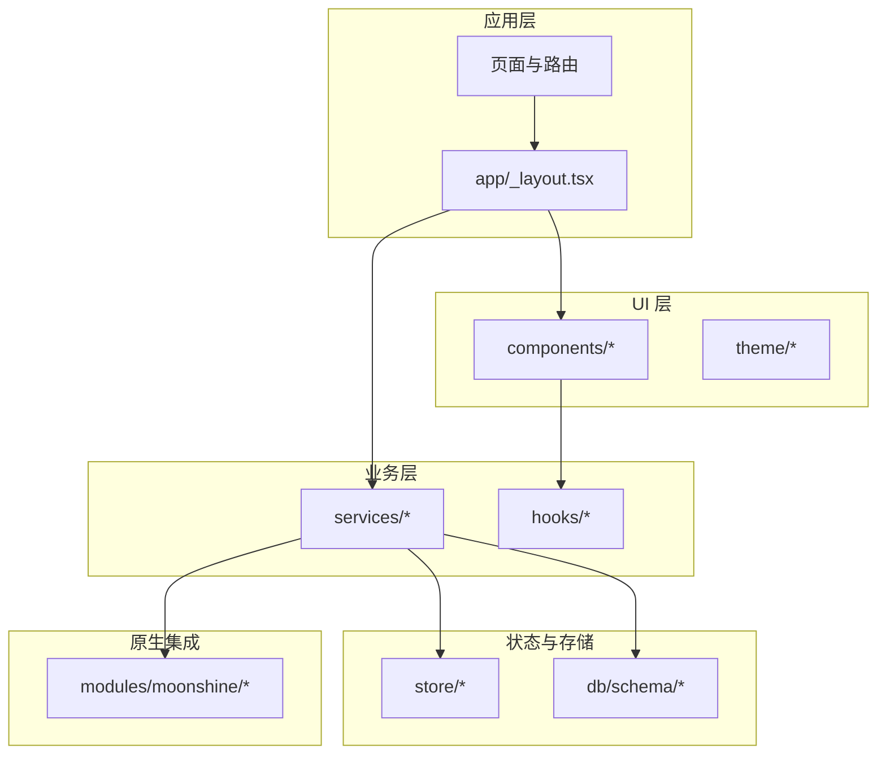
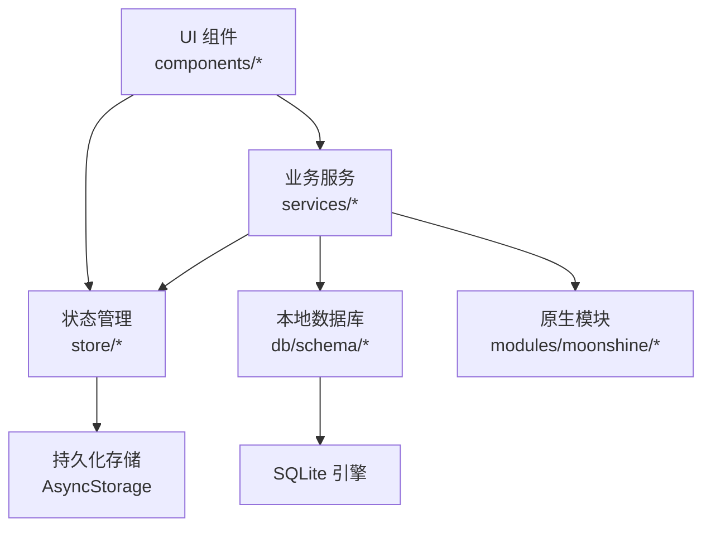
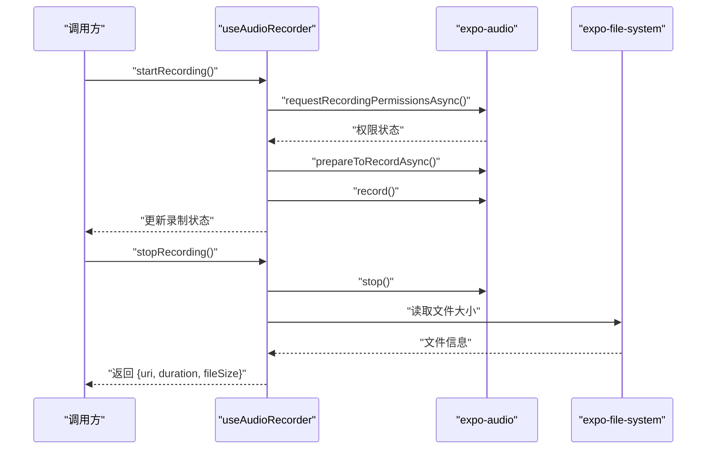
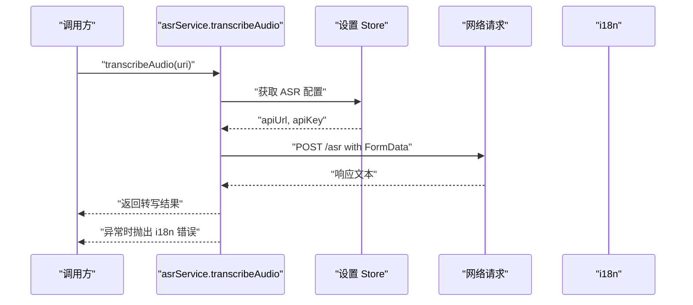
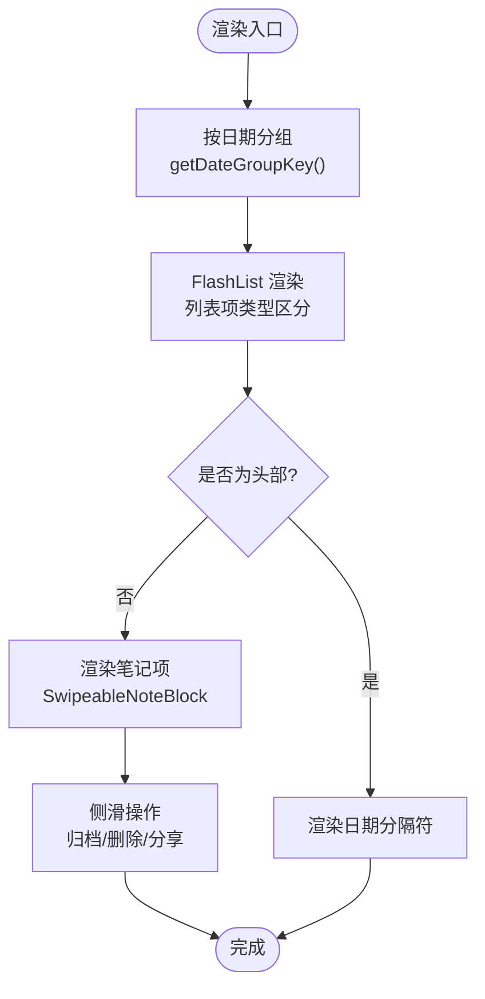
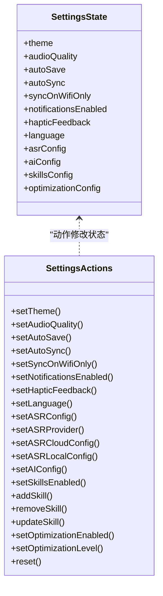
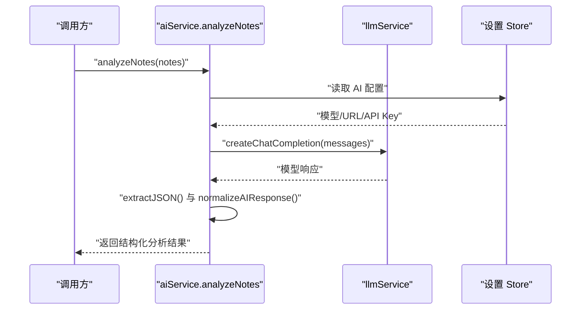
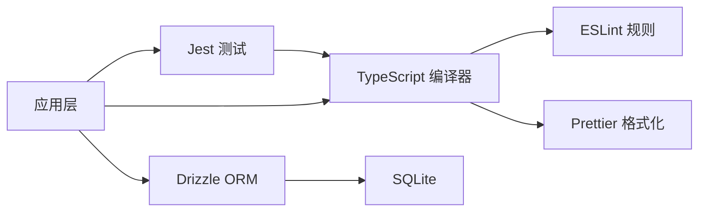

# 开发者指南

<cite>
**本文档引用的文件**
- [eslint.config.js](file://eslint.config.js)
- [.prettierrc](file://.prettierrc)
- [tsconfig.json](file://tsconfig.json)
- [package.json](file://package.json)
- [drizzle.config.ts](file://drizzle.config.ts)
- [app/_layout.tsx](file://app/_layout.tsx)
- [services/asr/asrService.ts](file://services/asr/asrService.ts)
- [hooks/useAudioRecorder.ts](file://hooks/useAudioRecorder.ts)
- [store/index.ts](file://store/index.ts)
- [store/useSettingsStore.ts](file://store/useSettingsStore.ts)
- [components/note/NoteList.tsx](file://components/note/NoteList.tsx)
- [jest.config.js](file://jest.config.js)
- [db/schema/index.ts](file://db/schema/index.ts)
- [services/ai/aiService.ts](file://services/ai/aiService.ts)
- [modules/moonshine/src/NativeMoonshineModule.ts](file://modules/moonshine/src/NativeMoonshineModule.ts)
</cite>

## 目录
1. [简介](#简介)
2. [项目结构](#项目结构)
3. [核心组件](#核心组件)
4. [架构总览](#架构总览)
5. [详细组件分析](#详细组件分析)
6. [依赖关系分析](#依赖关系分析)
7. [性能考虑](#性能考虑)
8. [故障排除指南](#故障排除指南)
9. [结论](#结论)
10. [附录](#附录)

## 简介
本指南面向 VoiceNote 项目的开发者，系统性地介绍代码规范与最佳实践（ESLint、Prettier、TypeScript）、Git 工作流与分支策略、提交规范、代码审查与质量保证标准、新功能开发流程与模板、调试技巧与工具使用、项目结构约定与文件命名规范、常见问题解决方案与最佳实践建议、团队协作沟通与协调原则，以及技术债务管理与重构策略。

## 项目结构
VoiceNote 采用基于功能域的模块化组织方式，结合 Expo + React Native 技术栈与 Tamagui UI 框架，配合 Drizzle ORM 进行本地 SQLite 数据库建模与迁移。核心目录职责如下：
- app：应用入口布局与页面路由
- components：可复用 UI 组件与业务组件
- hooks：自定义 Hook，封装状态与副作用
- services：业务服务层（ASR、AI、LLM、搜索等）
- store：状态管理（Zustand + AsyncStorage）
- db：Drizzle ORM 模式定义与查询封装
- drizzle：迁移脚本与配置
- i18n：国际化资源
- modules：原生模块桥接（Moonshine）
- utils：通用工具函数
- assets：模型与资源文件



图表来源
- [app/_layout.tsx:1-101](file://app/_layout.tsx#L1-L101)
- [store/index.ts:1-8](file://store/index.ts#L1-L8)
- [db/schema/index.ts:1-75](file://db/schema/index.ts#L1-L75)

章节来源
- [app/_layout.tsx:1-101](file://app/_layout.tsx#L1-L101)
- [store/index.ts:1-8](file://store/index.ts#L1-L8)
- [db/schema/index.ts:1-75](file://db/schema/index.ts#L1-L75)

## 核心组件
本节聚焦于开发中高频使用的组件与服务，帮助快速理解职责边界与交互方式。

- 应用根布局与全局配置
  - 提供状态栏主题、手势处理、国际化、Tamagui 主题、React Query 客户端等全局能力
  - 路由栈配置与屏幕选项集中管理
- 录音与播放 Hook
  - 封装录音权限、录制状态、播放控制、时长与位置同步
  - 支持暂停/恢复、取消删除、文件信息获取
- 设置 Store
  - 统一管理主题、音频质量、自动保存/同步、语言、ASR/AI 配置、技能与优化设置
  - 支持持久化与兼容性归一化
- 笔记列表组件
  - 基于 FlashList 的高性能渲染
  - 按日期分组与下拉刷新
  - 侧滑操作与选择模式
- ASR 服务
  - 云端/本地语音转写服务封装
  - 超时控制与错误处理
- AI 分析服务
  - LLM 对笔记进行分析并返回结构化结果
  - JSON 提取与字段归一化
- 原生 Moonshine 模块
  - 本地语音识别的 TurboModule 规范与事件回调

章节来源
- [app/_layout.tsx:1-101](file://app/_layout.tsx#L1-L101)
- [hooks/useAudioRecorder.ts:1-270](file://hooks/useAudioRecorder.ts#L1-L270)
- [store/useSettingsStore.ts:1-218](file://store/useSettingsStore.ts#L1-L218)
- [components/note/NoteList.tsx:1-240](file://components/note/NoteList.tsx#L1-L240)
- [services/asr/asrService.ts:1-74](file://services/asr/asrService.ts#L1-L74)
- [services/ai/aiService.ts:1-163](file://services/ai/aiService.ts#L1-L163)
- [modules/moonshine/src/NativeMoonshineModule.ts:1-34](file://modules/moonshine/src/NativeMoonshineModule.ts#L1-L34)

## 架构总览
整体采用“应用层 → UI 层 → 业务层 → 存储层”的分层架构，结合状态管理与本地数据库，实现离线可用与云端同步能力。



图表来源
- [store/index.ts:1-8](file://store/index.ts#L1-L8)
- [db/schema/index.ts:1-75](file://db/schema/index.ts#L1-L75)
- [modules/moonshine/src/NativeMoonshineModule.ts:1-34](file://modules/moonshine/src/NativeMoonshineModule.ts#L1-L34)

## 详细组件分析

### 录音与播放 Hook（useAudioRecorder）
该 Hook 将录音与播放状态解耦，提供统一的状态更新与副作用处理，确保在生命周期内正确清理定时器与音频模式。



图表来源
- [hooks/useAudioRecorder.ts:74-175](file://hooks/useAudioRecorder.ts#L74-L175)

章节来源
- [hooks/useAudioRecorder.ts:1-270](file://hooks/useAudioRecorder.ts#L1-L270)

### ASR 服务（语音转写）
ASR 服务负责云端或本地语音转写，支持超时控制与错误处理，并从设置 Store 中读取配置。



图表来源
- [services/asr/asrService.ts:24-73](file://services/asr/asrService.ts#L24-L73)

章节来源
- [services/asr/asrService.ts:1-74](file://services/asr/asrService.ts#L1-L74)

### 笔记列表组件（NoteList）
NoteList 使用 FlashList 实现高性能渲染，按日期分组显示笔记项，并支持侧滑操作与下拉刷新。



图表来源
- [components/note/NoteList.tsx:80-97](file://components/note/NoteList.tsx#L80-L97)
- [components/note/NoteList.tsx:159-181](file://components/note/NoteList.tsx#L159-L181)

章节来源
- [components/note/NoteList.tsx:1-240](file://components/note/NoteList.tsx#L1-L240)

### 设置 Store（useSettingsStore）
设置 Store 使用 Zustand + persist 管理用户偏好与配置，支持默认值注入、环境变量覆盖与兼容性归一化。



图表来源
- [store/useSettingsStore.ts:9-45](file://store/useSettingsStore.ts#L9-L45)

章节来源
- [store/useSettingsStore.ts:1-218](file://store/useSettingsStore.ts#L1-L218)

### AI 分析服务（aiService）
AI 分析服务通过 LLM 对笔记进行分析，提取 JSON 并进行字段归一化，确保输出结构稳定。



图表来源
- [services/ai/aiService.ts:126-162](file://services/ai/aiService.ts#L126-L162)

章节来源
- [services/ai/aiService.ts:1-163](file://services/ai/aiService.ts#L1-L163)

### 原生 Moonshine 模块（NativeMoonshineModule）
提供本地语音识别的 TurboModule 规范，支持模型加载、流式事件回调与麦克风权限处理。

```mermaid
classDiagram
class NativeMoonshineModule {
+onStreamingEvent
+isAvailable() Promise~boolean~
+hasEventCallback() Promise~boolean~
+loadModel(modelPath, arch) Promise~void~
+unloadModel() Promise~void~
+isModelLoaded() Promise~boolean~
+startStreaming(language) Promise~void~
+stopStreaming() Promise~{text}~
+getDownloadedModels() Promise~string[]~
+deleteModel(modelId) Promise~void~
+getModelsDirectory() Promise~string~
+onMicPermissionGranted() Promise~void~
+addListener(eventName) Promise~void~
+removeListeners(count) Promise~void~
}
```

图表来源
- [modules/moonshine/src/NativeMoonshineModule.ts:16-33](file://modules/moonshine/src/NativeMoonshineModule.ts#L16-L33)

章节来源
- [modules/moonshine/src/NativeMoonshineModule.ts:1-34](file://modules/moonshine/src/NativeMoonshineModule.ts#L1-L34)

## 依赖关系分析
- 语言与格式化
  - TypeScript 严格模式与路径别名映射
  - ESLint + Prettier 配置，统一代码风格与静态检查
- 测试
  - Jest + ts-jest，模块名映射与测试覆盖率范围
- 数据库
  - Drizzle ORM + SQLite，expo 驱动，迁移与模式定义分离
- 外部依赖
  - Expo 生态、Tamagui UI、React Query、Zustand、i18n 等



图表来源
- [tsconfig.json:1-63](file://tsconfig.json#L1-L63)
- [eslint.config.js:1-84](file://eslint.config.js#L1-L84)
- [.prettierrc:1-12](file://.prettierrc#L1-L12)
- [jest.config.js:1-47](file://jest.config.js#L1-L47)
- [drizzle.config.ts:1-12](file://drizzle.config.ts#L1-L12)

章节来源
- [tsconfig.json:1-63](file://tsconfig.json#L1-L63)
- [eslint.config.js:1-84](file://eslint.config.js#L1-L84)
- [.prettierrc:1-12](file://.prettierrc#L1-L12)
- [jest.config.js:1-47](file://jest.config.js#L1-L47)
- [drizzle.config.ts:1-12](file://drizzle.config.ts#L1-L12)

## 性能考虑
- 列表渲染
  - 使用 FlashList 替代 FlatList，减少重绘与内存占用
  - 合理的 keyExtractor 与分组策略，避免不必要的重新渲染
- 状态与缓存
  - React Query 默认缓存时间与重试策略，平衡实时性与性能
  - Zustand 精简状态更新，避免深层对象变更导致的全量重渲染
- 媒体与录音
  - 录音与播放状态分离，及时清理定时器与音频模式
  - 文件大小与时长信息异步获取，避免阻塞主线程
- 数据库
  - 为常用查询字段建立索引，减少扫描开销
  - 批量操作与事务化处理，降低 I/O 压力

## 故障排除指南
- ESLint/Prettier 冲突
  - 确保已安装依赖并正确配置，避免在测试与类型声明文件中启用严格规则
- 测试失败
  - 检查 moduleNameMapper 是否匹配实际路径别名；确认测试环境与模块解析一致
- 数据库迁移
  - 使用 drizzle-kit 生成与执行迁移，确保 schema 路径与驱动配置正确
- 录音权限与播放异常
  - 确认录音权限已授予；iOS 需要切换音频模式以支持播放
- ASR 转写失败
  - 检查配置项是否完整；关注超时与网络错误提示
- AI 分析 JSON 解析失败
  - 确保模型返回内容包含 JSON 结构；必要时回退到默认值

章节来源
- [jest.config.js:18-38](file://jest.config.js#L18-L38)
- [drizzle.config.ts:1-12](file://drizzle.config.ts#L1-L12)
- [hooks/useAudioRecorder.ts:74-109](file://hooks/useAudioRecorder.ts#L74-L109)
- [services/asr/asrService.ts:24-73](file://services/asr/asrService.ts#L24-L73)
- [services/ai/aiService.ts:134-162](file://services/ai/aiService.ts#L134-L162)

## 结论
本指南提供了 VoiceNote 项目的开发规范、架构视图与实践建议。遵循本文档中的规范与流程，有助于提升代码质量、开发效率与团队协作水平。建议在日常开发中持续关注性能优化与技术债务管理，保持代码整洁与可维护性。

## 附录

### 代码规范与最佳实践
- ESLint 配置要点
  - 推荐规则：未使用变量警告、显式 any 警告、忽略测试与类型声明文件中的命名空间规则
  - 全局变量：浏览器、Node、React Native 环境变量白名单
- Prettier 格式化
  - 半角分号、尾随逗号、单引号、行长 100、缩进宽度 2、箭头括号始终添加
- TypeScript 使用规范
  - 严格模式开启；合理使用路径别名；避免 any；明确导出接口与类型

章节来源
- [eslint.config.js:38-82](file://eslint.config.js#L38-L82)
- [.prettierrc:1-12](file://.prettierrc#L1-L12)
- [tsconfig.json:3-55](file://tsconfig.json#L3-L55)

### Git 工作流程与分支策略
- 分支策略
  - main：发布分支，受保护
  - develop：开发集成分支，合并前需通过 CI 与代码审查
  - feature/*：功能开发分支，基于 develop 创建，完成后合并回 develop
  - hotfix/*：紧急修复分支，基于 main 创建，修复后同时合并回 main 与 develop
- 提交规范
  - 类型：feat、fix、docs、style、refactor、perf、test、build、ci、chore、revert
  - 格式：type(scope): subject
  - 说明：简明描述变更，必要时补充动机与影响

### 代码审查与质量保证
- 审查清单
  - 功能正确性与边界条件
  - 性能与内存使用
  - 错误处理与日志记录
  - 可测试性与单元测试覆盖
  - 文档与注释完整性
- 质量门禁
  - 通过 ESLint、Prettier、TypeScript 类型检查
  - 通过 Jest 测试与覆盖率要求
  - 无新增技术债务（或有明确延期计划）

### 新功能开发流程与模板
- 需求评审 → 设计文档 → 分支创建 → 开发实现 → 单测编写 → 代码审查 → 合并集成 → 回归测试
- 模板
  - 组件：在 components 下新建目录，提供 index.ts 导出与最小示例
  - Hook：在 hooks 下新建文件，提供类型定义与使用示例
  - 服务：在 services 下新建目录，提供配置、错误处理与超时控制
  - 状态：在 store 下新增 zustand slice，提供默认值与持久化配置
  - 数据库：在 db/schema 下扩展表结构，生成迁移并更新查询封装

### 调试技巧与开发工具
- 调试
  - 使用 React DevTools 与 Flipper 进行组件与网络调试
  - 在 ASR/AI 服务中增加日志与超时提示
  - 使用 React Query Devtools 查看缓存与重试行为
- 工具
  - Drizzle Studio：数据库可视化与查询
  - Expo Dev Client：热重载与真机调试
  - VS Code 插件：ESLint、Prettier、TypeScript TSServer

### 项目结构约定与文件命名规范
- 目录约定
  - components：UI 组件，按功能域分层
  - hooks：自定义 Hook，单一职责
  - services：业务服务，按领域划分
  - store：状态管理，按模块拆分
  - db：ORM 模式与查询
  - modules：原生模块桥接
- 文件命名
  - 组件：大驼峰命名（如 NoteList.tsx）
  - Hook：useXxx 命名（如 useAudioRecorder.ts）
  - 服务：小驼峰命名（如 asrService.ts）
  - 状态：useXxxStore.ts（如 useSettingsStore.ts）
  - 数据库：schema/*.ts，迁移文件按序号命名

### 常见问题与最佳实践
- 无法启动录音
  - 检查权限与音频模式；确保 prepareToRecordAsync 成功
- 转写超时
  - 调整超时阈值；在网络不佳时降级为本地模型
- 列表卡顿
  - 使用 FlashList；避免在渲染函数中创建新对象
- 状态不持久
  - 确认 persist 配置与存储键名一致

### 团队协作与沟通
- 沟通渠道
  - 日常站会、需求评审、设计评审、代码审查会议
- 协调原则
  - 明确角色与责任；跨模块变更提前对齐；文档与注释同步更新

### 技术债务与重构策略
- 识别与评估
  - 复杂度高、重复逻辑多、测试缺失、依赖过深的模块优先处理
- 重构步骤
  - 小步快跑，先加测试再改代码；保持对外接口稳定
- 风险控制
  - 通过分支与回滚预案；关键改动进行 A/B 或灰度发布