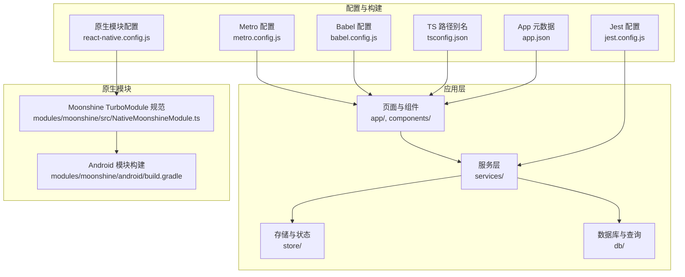
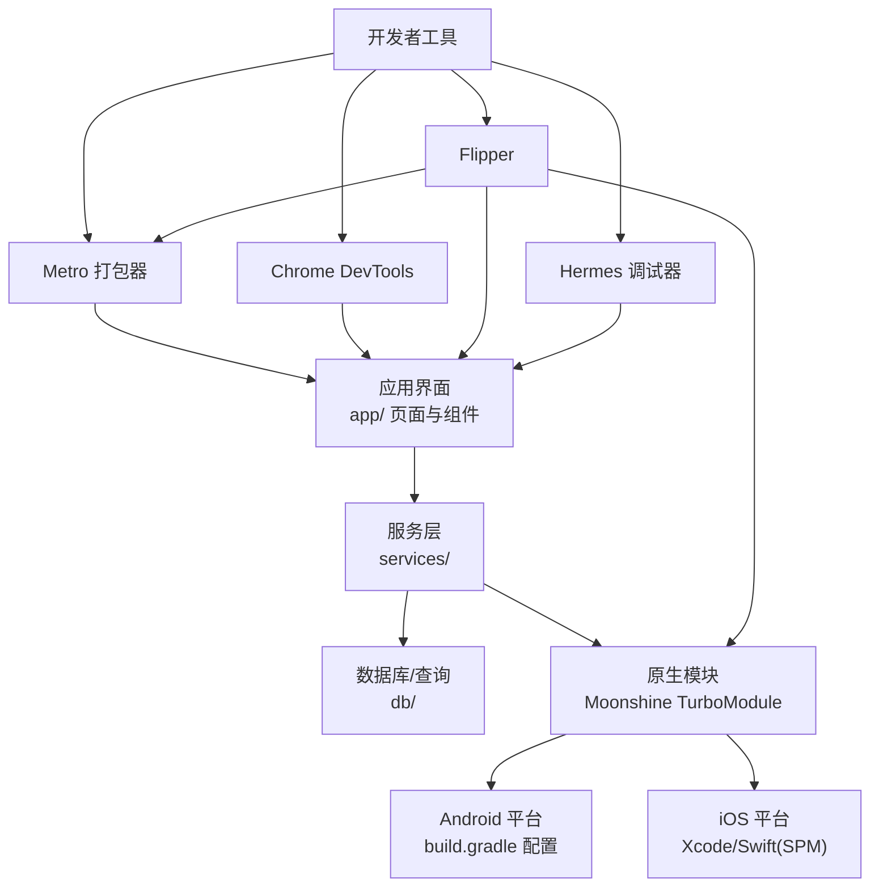
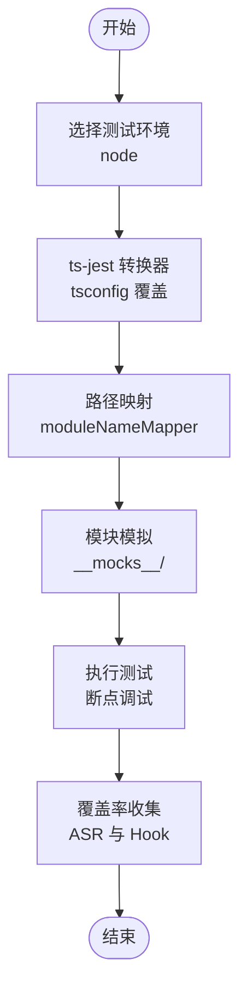
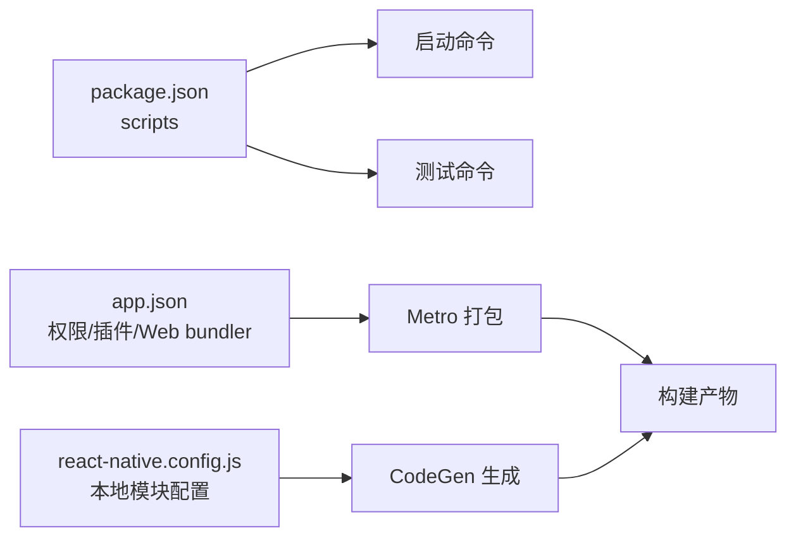

# 调试工具与故障排除

<cite>
**本文引用的文件**
- [package.json](file://package.json)
- [metro.config.js](file://metro.config.js)
- [jest.config.js](file://jest.config.js)
- [jest.setup.js](file://jest.setup.js)
- [babel.config.js](file://babel.config.js)
- [app.json](file://app.json)
- [react-native.config.js](file://react-native.config.js)
- [tsconfig.json](file://tsconfig.json)
- [__mocks__/expo.js](file://__mocks__/expo.js)
- [__mocks__/expo-file-system/legacy.js](file://__mocks__/expo-file-system/legacy.js)
- [modules/moonshine/src/NativeMoonshineModule.ts](file://modules/moonshine/src/NativeMoonshineModule.ts)
- [modules/moonshine/android/build.gradle](file://modules/moonshine/android/build.gradle)
</cite>

## 目录
1. [简介](#简介)
2. [项目结构](#项目结构)
3. [核心组件](#核心组件)
4. [架构总览](#架构总览)
5. [详细组件分析](#详细组件分析)
6. [依赖分析](#依赖分析)
7. [性能考虑](#性能考虑)
8. [故障排除指南](#故障排除指南)
9. [结论](#结论)
10. [附录](#附录)

## 简介
本指南面向 React Native 开发者，围绕 VoiceNote 项目的调试与故障排除展开，覆盖以下主题：
- React Native 开发者工具：Flipper、Chrome DevTools、Hermes 调试器
- Metro 打包器调试：日志输出、网络请求监控、性能分析
- Jest 测试框架调试：单元/集成测试断点调试、覆盖率分析
- 原生模块调试：Android Studio 与 Xcode 配置
- 内存泄漏检测、性能瓶颈分析、崩溃日志分析
- 常见问题诊断：启动失败、打包错误、运行时异常
- 日志记录最佳实践与错误追踪策略
- 浏览器开发者工具调试 Web 相关功能

## 项目结构
VoiceNote 使用 Expo 构建，采用 TypeScript 与 React Navigation（通过 expo-router）组织应用结构；音频转录能力由本地与云端 ASR 提供商组合实现，并通过原生模块 Moonshine 进行本地推理加速。



图表来源
- [metro.config.js:1-8](file://metro.config.js#L1-L8)
- [jest.config.js:1-47](file://jest.config.js#L1-L47)
- [babel.config.js:1-27](file://babel.config.js#L1-L27)
- [tsconfig.json:1-63](file://tsconfig.json#L1-L63)
- [app.json:1-86](file://app.json#L1-L86)
- [react-native.config.js:1-31](file://react-native.config.js#L1-L31)
- [modules/moonshine/src/NativeMoonshineModule.ts:1-34](file://modules/moonshine/src/NativeMoonshineModule.ts#L1-L34)
- [modules/moonshine/android/build.gradle:1-37](file://modules/moonshine/android/build.gradle#L1-L37)

章节来源
- [package.json:1-83](file://package.json#L1-L83)
- [metro.config.js:1-8](file://metro.config.js#L1-L8)
- [jest.config.js:1-47](file://jest.config.js#L1-L47)
- [babel.config.js:1-27](file://babel.config.js#L1-L27)
- [tsconfig.json:1-63](file://tsconfig.json#L1-L63)
- [app.json:1-86](file://app.json#L1-L86)
- [react-native.config.js:1-31](file://react-native.config.js#L1-L31)

## 核心组件
- Metro 打包器与调试：默认配置已启用，可扩展资源后缀以支持模型文件；建议结合 Flipper 与 Chrome DevTools 进行网络与性能分析。
- Jest 测试框架：使用 node 环境与 ts-jest 转换器，配置了路径别名与模块模拟，便于进行单元与集成测试的断点调试与覆盖率收集。
- 原生模块 Moonshine：通过 TurboModule 规范暴露本地语音识别能力，事件通过设备事件发射器在 JS 层监听。
- 配置别名与插件：Babel 与 TS 路径别名统一管理模块导入，提升开发体验与一致性。

章节来源
- [metro.config.js:1-8](file://metro.config.js#L1-L8)
- [jest.config.js:1-47](file://jest.config.js#L1-L47)
- [babel.config.js:1-27](file://babel.config.js#L1-L27)
- [tsconfig.json:1-63](file://tsconfig.json#L1-L63)
- [modules/moonshine/src/NativeMoonshineModule.ts:1-34](file://modules/moonshine/src/NativeMoonshineModule.ts#L1-L34)

## 架构总览
下图展示从应用到服务、再到原生模块与外部资源的整体交互关系，以及调试工具在各环节的接入点。



图表来源
- [app.json:1-86](file://app.json#L1-L86)
- [react-native.config.js:1-31](file://react-native.config.js#L1-L31)
- [modules/moonshine/src/NativeMoonshineModule.ts:1-34](file://modules/moonshine/src/NativeMoonshineModule.ts#L1-L34)
- [modules/moonshine/android/build.gradle:1-37](file://modules/moonshine/android/build.gradle#L1-L37)

## 详细组件分析

### Metro 打包器与调试
- 默认配置：基于 expo/metro-config 获取默认配置，便于与 Expo 生态对齐。
- 资源扩展：新增模型文件后缀以支持本地推理模型加载。
- 调试建议：
  - 启动时观察 Metro 输出，定位资源解析与缓存问题。
  - 结合 Flipper 的 Network 插件监控网络请求与响应。
  - 使用 Chrome DevTools 的 Performance 面板分析主线程卡顿与重排。
  - 在 Hermes 启用时，关注字节码与 GC 行为差异。

章节来源
- [metro.config.js:1-8](file://metro.config.js#L1-L8)
- [app.json:43-46](file://app.json#L43-L46)

### Jest 测试框架调试
- 测试环境：使用 node 环境，避免 jest-expo 预设导致的 import.meta 问题。
- 转换器：ts-jest 配置覆盖测试专用 tsconfig，开启 esModuleInterop 与允许合成默认导入。
- 路径映射：通过 moduleNameMapper 将 @/、@components/... 等别名映射到实际目录，并对 expo 与 react-native 等模块进行模拟。
- 模拟实现：__mocks__ 目录提供关键模块的轻量模拟，确保测试稳定性。
- 断点调试：在 IDE 中为测试文件设置断点，配合 watch 模式快速迭代。
- 覆盖率：collectCoverageFrom 限定在 ASR 与关键 Hook，便于聚焦核心逻辑。



图表来源
- [jest.config.js:1-47](file://jest.config.js#L1-L47)
- [jest.setup.js:1-11](file://jest.setup.js#L1-L11)
- [__mocks__/expo.js:1-9](file://__mocks__/expo.js#L1-L9)
- [__mocks__/expo-file-system/legacy.js:1-12](file://__mocks__/expo-file-system/legacy.js#L1-L12)

章节来源
- [jest.config.js:1-47](file://jest.config.js#L1-L47)
- [jest.setup.js:1-11](file://jest.setup.js#L1-L11)
- [__mocks__/expo.js:1-9](file://__mocks__/expo.js#L1-L9)
- [__mocks__/expo-file-system/legacy.js:1-12](file://__mocks__/expo-file-system/legacy.js#L1-L12)

### 原生模块 Moonshine 调试
- TurboModule 规范：定义事件流与方法签名，便于跨平台一致调用。
- Android 实现要点：通过 DeviceEventManagerModule 发送事件，add/removeListeners 支持监听生命周期。
- 调试建议：
  - Android：在 Android Studio 中设置断点，观察事件发送与回调链路。
  - iOS：在 Xcode 中设置断点，验证 Swift/SwiftUI 与 RN 的桥接行为。
  - 事件监听：在 JS 层通过 NativeEventEmitter 订阅 onStreamingEvent，确认事件类型与文本流。

```mermaid
sequenceDiagram
participant JS as "JS 层<br/>NativeMoonshineModule"
participant TM as "TurboModule 规范"
participant AND as "Android 平台"
participant EVT as "RCTDeviceEventEmitter"
JS->>TM : "订阅事件 onStreamingEvent"
TM->>AND : "注册监听 addListener"
AND->>EVT : "发送事件 sendStreamingEvent"
EVT-->>JS : "回调事件对象"
JS->>JS : "处理事件类型/文本/是否最终"
JS->>TM : "移除监听 removeListeners"
```

图表来源
- [modules/moonshine/src/NativeMoonshineModule.ts:1-34](file://modules/moonshine/src/NativeMoonshineModule.ts#L1-L34)
- [modules/moonshine/android/build.gradle:1-37](file://modules/moonshine/android/build.gradle#L1-L37)

章节来源
- [modules/moonshine/src/NativeMoonshineModule.ts:1-34](file://modules/moonshine/src/NativeMoonshineModule.ts#L1-L34)
- [modules/moonshine/android/build.gradle:1-37](file://modules/moonshine/android/build.gradle#L1-L37)

### 开发者工具集成
- Flipper：安装后可在设备上启用插件（Network、Database、Layout 等），用于网络请求监控、UI 层级检查与数据库浏览。
- Chrome DevTools：在开发模式下连接，使用 Performance、Memory、Sources 面板进行性能与内存分析、断点调试。
- Hermes 调试器：在启用 Hermes 的设备上，可利用其调试协议进行更精细的 JS 引擎层面分析。

章节来源
- [app.json:9, 43-46](file://app.json#L9,L43-L46)

### 配置与别名系统
- Babel 与 TS 路径别名：统一 @components、@hooks、@services、@store、@db、@theme、@types、@utils 等路径，减少相对路径复杂度。
- 别名映射：在 babel.config.js 与 tsconfig.json 中保持一致，确保编译与运行时行为一致。

章节来源
- [babel.config.js:1-27](file://babel.config.js#L1-L27)
- [tsconfig.json:1-63](file://tsconfig.json#L1-L63)

## 依赖分析
- 应用入口与脚本：通过 package.json 的 scripts 字段统一启动、运行与测试命令。
- 原生模块声明：react-native.config.js 声明 moonshine-module 的本地根目录与平台配置，确保 CodeGen 正常生成。
- App 元数据：app.json 定义新架构开关、权限、插件与 Web 打包器，影响 Metro 与打包流程。



图表来源
- [package.json:1-83](file://package.json#L1-L83)
- [react-native.config.js:1-31](file://react-native.config.js#L1-L31)
- [app.json:1-86](file://app.json#L1-L86)

章节来源
- [package.json:1-83](file://package.json#L1-L83)
- [react-native.config.js:1-31](file://react-native.config.js#L1-L31)
- [app.json:1-86](file://app.json#L1-L86)

## 性能考虑
- Metro 缓存与增量构建：合理配置资源扩展与别名，避免不必要的全量重建。
- Chrome DevTools 性能面板：录制长任务，识别主线程阻塞；结合 Memory 面板排查内存增长。
- Hermes：启用后注意 GC 与字节码差异，必要时回退至 JavaScriptCore 排查性能回归。
- 原生模块事件：避免高频事件未及时清理导致的内存压力，确保监听计数与生命周期匹配。

## 故障排除指南

### 启动失败
- Metro 无法解析资源
  - 检查 metro.config.js 是否正确添加模型文件后缀。
  - 清理 Metro 缓存并重启：删除 node_modules/.cache 或使用相应脚本。
- 设备/模拟器连接问题
  - 确认 Flipper 已安装且设备已授权。
  - 在 app.json 中检查 web bundler 设置与权限声明。

章节来源
- [metro.config.js:1-8](file://metro.config.js#L1-L8)
- [app.json:43-46](file://app.json#L43-L46)

### 打包错误
- 路径别名不生效
  - 对比 babel.config.js 与 tsconfig.json 的别名配置，确保一致。
- 资源无法加载
  - 检查资源扩展列表与文件命名，确保与 resolver 匹配。

章节来源
- [babel.config.js:1-27](file://babel.config.js#L1-L27)
- [tsconfig.json:1-63](file://tsconfig.json#L1-L63)
- [metro.config.js:1-8](file://metro.config.js#L1-L8)

### 运行时异常
- 网络请求异常
  - 使用 Flipper Network 插件捕获请求与响应，核对端点与鉴权头。
- 原生模块事件未触发
  - 在 Android Studio/Xcode 中设置断点，确认事件发送与监听注册。
  - 在 JS 层检查 NativeEventEmitter 订阅与移除逻辑。

章节来源
- [modules/moonshine/src/NativeMoonshineModule.ts:1-34](file://modules/moonshine/src/NativeMoonshineModule.ts#L1-L34)
- [modules/moonshine/android/build.gradle:1-37](file://modules/moonshine/android/build.gradle#L1-L37)

### 内存泄漏与性能瓶颈
- 使用 Chrome DevTools Memory 面板快照对比，定位未释放对象。
- 使用 Performance 面板录制交互，查找长任务与频繁重排。
- 原生模块事件监听需成对出现，防止回调持有导致的泄漏。

### 崩溃日志分析
- Android：使用 adb logcat 或 Android Studio Logcat 查看堆栈信息。
- iOS：使用 Xcode Console 或设备日志导出，定位 Swift/Obj-C 异常。
- JS 层：开启严格模式与全局错误捕获，结合 Flipper 的 Logs 插件收集上下文。

### 日志记录最佳实践
- 统一日志级别：区分 debug/info/warn/error，避免生产环境输出过多。
- 结构化日志：携带 traceId/用户标识/时间戳，便于串联排查。
- 错误追踪：在捕获异常时记录上下文参数与调用栈，结合服务端日志聚合。

### 浏览器开发者工具调试 Web 功能
- 启动 Web 模式：使用 npm/yarn 脚本启动 web，打开浏览器开发者工具。
- 使用 Performance/Memory/Sources 面板进行分析与断点调试。
- 若使用自定义 Metro 配置，确保与 Web 打包器兼容。

章节来源
- [package.json:9](file://package.json#L9)
- [app.json:43-46](file://app.json#L43-L46)

## 结论
通过合理配置 Metro、Jest、Babel 与 TS 别名，结合 Flipper、Chrome DevTools 与 Hermes 调试器，可高效完成 VoiceNote 的开发与调试。原生模块 Moonshine 的事件机制与平台适配需要在 Android Studio 与 Xcode 中重点验证。建议建立统一的日志规范与错误追踪策略，配合覆盖率与性能分析工具，持续提升代码质量与用户体验。

## 附录
- 常用命令参考
  - 启动：npm/yarn start
  - Android：npm/yarn android
  - iOS：npm/yarn ios
  - Web：npm/yarn web
  - 测试：npm/yarn test / test:watch / test:coverage
- 关键配置文件清单
  - metro.config.js、jest.config.js、babel.config.js、tsconfig.json、app.json、react-native.config.js