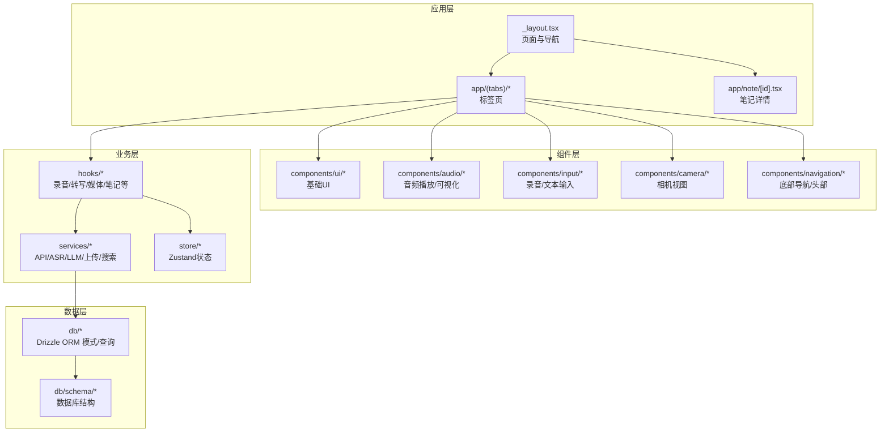
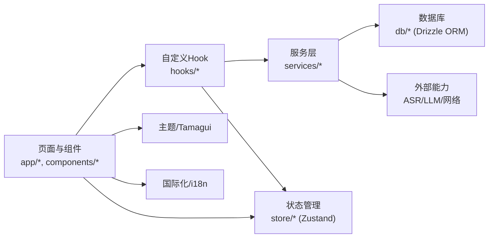
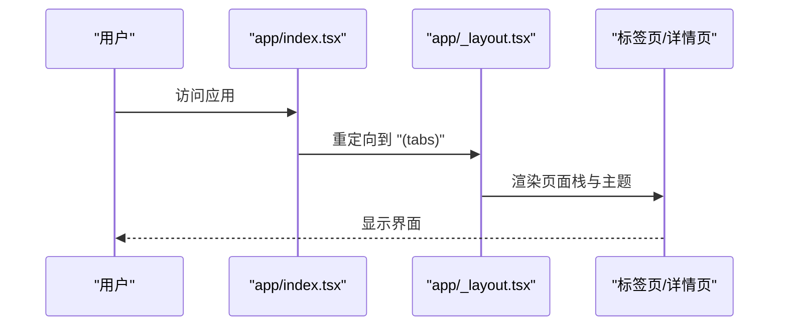
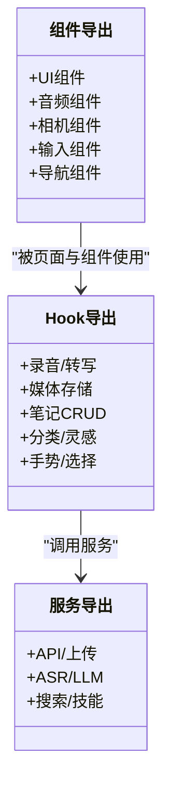
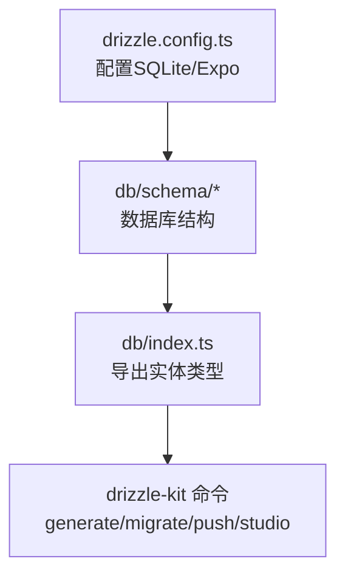
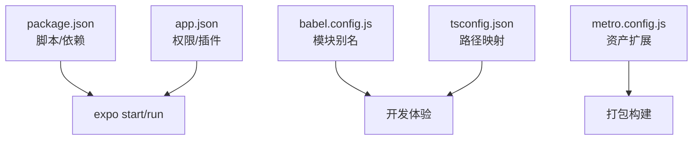

# 快速开始

<cite>
**本文引用的文件**
- [package.json](file://package.json)
- [app.json](file://app.json)
- [babel.config.js](file://babel.config.js)
- [tsconfig.json](file://tsconfig.json)
- [metro.config.js](file://metro.config.js)
- [drizzle.config.ts](file://drizzle.config.ts)
- [eslint.config.js](file://eslint.config.js)
- [app/_layout.tsx](file://app/_layout.tsx)
- [app/index.tsx](file://app/index.tsx)
- [store/index.ts](file://store/index.ts)
- [services/index.ts](file://services/index.ts)
- [hooks/index.ts](file://hooks/index.ts)
- [components/index.ts](file://components/index.ts)
- [db/index.ts](file://db/index.ts)
</cite>

## 目录
1. [简介](#简介)
2. [项目结构](#项目结构)
3. [核心组件](#核心组件)
4. [架构总览](#架构总览)
5. [详细组件分析](#详细组件分析)
6. [依赖分析](#依赖分析)
7. [性能考虑](#性能考虑)
8. [故障排除指南](#故障排除指南)
9. [结论](#结论)
10. [附录](#附录)

## 简介
VoiceNote 是一个基于 Expo 和 React Native 的跨平台语音笔记应用，支持录音、转写、多模态媒体管理与本地模型推理。本指南面向移动应用开发新手，提供从环境准备到首次运行的完整流程，并给出常见问题排查与开发工具配置建议。

## 项目结构
项目采用功能模块化组织，主要目录与职责如下：
- app：页面与路由入口，使用 Expo Router 管理页面栈与导航
- components：可复用 UI 组件与业务组件（音频、相机、输入、导航等）
- hooks：自定义 Hook，封装状态与业务逻辑（录音、转写、媒体存储、笔记等）
- services：服务层（API、上传、ASR、LLM、搜索等）
- store：状态管理（Zustand）
- db：Drizzle ORM 数据库模式与查询
- modules：原生模块桥接（如 moonshine）
- i18n：国际化资源
- assets：模型与静态资源
- 配置文件：package.json、app.json、babel.config.js、tsconfig.json、metro.config.js、drizzle.config.ts、eslint.config.js

图表来源
- [app/_layout.tsx:1-101](file://app/_layout.tsx#L1-L101)
- [components/index.ts:1-6](file://components/index.ts#L1-L6)
- [hooks/index.ts:1-79](file://hooks/index.ts#L1-L79)
- [services/index.ts:1-7](file://services/index.ts#L1-L7)
- [store/index.ts:1-8](file://store/index.ts#L1-L8)
- [db/index.ts:1-26](file://db/index.ts#L1-L26)

章节来源
- [app/_layout.tsx:1-101](file://app/_layout.tsx#L1-L101)
- [app/index.tsx:1-6](file://app/index.tsx#L1-L6)
- [components/index.ts:1-6](file://components/index.ts#L1-L6)
- [hooks/index.ts:1-79](file://hooks/index.ts#L1-L79)
- [services/index.ts:1-7](file://services/index.ts#L1-L7)
- [store/index.ts:1-8](file://store/index.ts#L1-L8)
- [db/index.ts:1-26](file://db/index.ts#L1-L26)

## 核心组件
- 应用入口与导航：通过 app/_layout.tsx 配置全局 Provider（React Query、Tamagui、I18n）、状态栏主题与页面栈；app/index.tsx 负责重定向至标签页。
- 组件体系：components 提供 UI、音频、相机、输入、导航等模块化组件，统一导出便于按需引入。
- 自定义 Hook：hooks 封装录音、转写、媒体存储、笔记 CRUD、分类、灵感、手势等高频业务逻辑。
- 服务层：services 提供 API、上传、ASR（本地/云端）、LLM、搜索、技能等能力。
- 状态管理：store 使用 Zustand 管理语言、录制、设置、选择、搜索、覆盖层等状态。
- 数据库：db 使用 Drizzle ORM 管理笔记、录音、媒体、灵感、分类等实体。

章节来源
- [app/_layout.tsx:1-101](file://app/_layout.tsx#L1-L101)
- [app/index.tsx:1-6](file://app/index.tsx#L1-L6)
- [components/index.ts:1-6](file://components/index.ts#L1-L6)
- [hooks/index.ts:1-79](file://hooks/index.ts#L1-L79)
- [services/index.ts:1-7](file://services/index.ts#L1-L7)
- [store/index.ts:1-8](file://store/index.ts#L1-L8)
- [db/index.ts:1-26](file://db/index.ts#L1-L26)

## 架构总览
应用采用分层架构：UI 层（页面与组件）通过 Hook 与服务交互，服务层对接 Drizzle ORM 与外部能力（ASR/LLM），状态通过 Zustand 管理，国际化与主题由 Tamagui/I18n 提供。

图表来源
- [app/_layout.tsx:1-101](file://app/_layout.tsx#L1-L101)
- [hooks/index.ts:1-79](file://hooks/index.ts#L1-L79)
- [services/index.ts:1-7](file://services/index.ts#L1-L7)
- [store/index.ts:1-8](file://store/index.ts#L1-L8)
- [db/index.ts:1-26](file://db/index.ts#L1-L26)

## 详细组件分析

### 页面与导航（Expo Router）
- 全局布局：根布局在 app/_layout.tsx 中配置，启用手势、安全区域、React Query 客户端、Tamagui 主题与 I18n。
- 页面栈：Stack 管理标签页、笔记详情、录音详情、设置模型等页面，设置动画与头部行为。
- 入口重定向：app/index.tsx 将根路径重定向到标签页。

图表来源
- [app/index.tsx:1-6](file://app/index.tsx#L1-L6)
- [app/_layout.tsx:1-101](file://app/_layout.tsx#L1-L101)

章节来源
- [app/index.tsx:1-6](file://app/index.tsx#L1-L6)
- [app/_layout.tsx:1-101](file://app/_layout.tsx#L1-L101)

### 组件与 Hook 体系
- 组件导出：components/index.ts 统一导出 UI、音频、相机、输入、导航等模块，便于按需导入。
- Hook 导出：hooks/index.ts 汇总录音、转写、媒体、笔记、分类、灵感、手势等 Hook，提供类型与结果接口。
- 服务导出：services/index.ts 汇总 API、上传、媒体存储、ASR、转录优化、LLM、搜索等服务。

图表来源
- [components/index.ts:1-6](file://components/index.ts#L1-L6)
- [hooks/index.ts:1-79](file://hooks/index.ts#L1-L79)
- [services/index.ts:1-7](file://services/index.ts#L1-L7)

章节来源
- [components/index.ts:1-6](file://components/index.ts#L1-L6)
- [hooks/index.ts:1-79](file://hooks/index.ts#L1-L79)
- [services/index.ts:1-7](file://services/index.ts#L1-L7)

### 数据库与 Drizzle ORM
- 配置：drizzle.config.ts 指定 schema、输出目录、方言与驱动（SQLite + Expo）。
- 类型：db/index.ts 导出实体类型与枚举（媒体类型、同步动作、实体类型、笔记类型、状态等）。
- 迁移：通过脚本生成、迁移与推送数据库变更。

图表来源
- [drizzle.config.ts:1-12](file://drizzle.config.ts#L1-L12)
- [db/index.ts:1-26](file://db/index.ts#L1-L26)

章节来源
- [drizzle.config.ts:1-12](file://drizzle.config.ts#L1-L12)
- [db/index.ts:1-26](file://db/index.ts#L1-L26)

## 依赖分析
- 包管理：package.json 定义脚本（启动、运行 iOS/Android/Web、测试、类型检查、Lint、数据库相关命令）与依赖（Expo、React Navigation、Tamagui、React Query、Zustand、Drizzle ORM、ASR/LLM 等）。
- 路由与权限：app.json 配置应用元信息、权限（iOS 权限描述、Android 权限列表）、插件（expo-router、expo-camera、expo-audio、expo-media-library 等）。
- 构建别名：babel.config.js 与 tsconfig.json 配置模块别名（@、@components、@hooks、@services、@store、@db、@theme、@types、@utils），提升导入可读性与一致性。

图表来源
- [package.json:1-83](file://package.json#L1-L83)
- [app.json:1-86](file://app.json#L1-L86)
- [babel.config.js:1-27](file://babel.config.js#L1-L27)
- [tsconfig.json:1-63](file://tsconfig.json#L1-L63)
- [metro.config.js:1-8](file://metro.config.js#L1-L8)

章节来源
- [package.json:1-83](file://package.json#L1-L83)
- [app.json:1-86](file://app.json#L1-L86)
- [babel.config.js:1-27](file://babel.config.js#L1-L27)
- [tsconfig.json:1-63](file://tsconfig.json#L1-L63)
- [metro.config.js:1-8](file://metro.config.js#L1-L8)

## 性能考虑
- 缓存策略：React Query 默认查询缓存时间与过期时间已配置，减少重复请求。
- 动画与手势：启用 reanimated 插件与手势处理器，保证流畅体验。
- 资源加载：Metro 额外支持 .ort/.bin 资产，满足模型与二进制资源加载需求。
- 类型与校验：ESLint + TypeScript 提前发现潜在性能与可维护性问题。

章节来源
- [app/_layout.tsx:15-24](file://app/_layout.tsx#L15-L24)
- [babel.config.js:23-23](file://babel.config.js#L23-L23)
- [metro.config.js:5-5](file://metro.config.js#L5-L5)
- [eslint.config.js:1-84](file://eslint.config.js#L1-L84)

## 故障排除指南
- 启动失败（Metro/依赖）
  - 清理缓存与重装依赖：删除 node_modules/.cache、重新安装依赖后重试启动。
  - 确认 Node 版本与包管理器：使用稳定 LTS 版本，避免 Yarn 1.x 与 pnpm 的兼容性问题。
- iOS 模拟器/设备
  - 权限未授权：检查 app.json 中 iOS 权限描述是否正确；在模拟器中允许相机/麦克风/相册权限。
  - 开发证书/签名：若真机运行报错，确认 Xcode 工程签名与设备添加。
- Android 模拟器/设备
  - 权限未授权：检查 app.json 中 Android 权限列表；在模拟器中允许相机/录音/存储权限。
  - ABI/架构：确保模拟器为 x86_64/arm64，避免原生模块不匹配。
- 数据库初始化
  - 执行数据库迁移：使用数据库相关脚本完成生成、迁移与推送。
- 资源加载
  - 若模型或二进制资源无法加载，确认 metro.config.js 中资产扩展已包含对应后缀。
- 国际化与主题
  - 切换语言后界面未更新：确认设置状态与 i18n 初始化逻辑生效。

章节来源
- [app.json:16-42](file://app.json#L16-L42)
- [drizzle.config.ts:1-12](file://drizzle.config.ts#L1-L12)
- [metro.config.js:5-5](file://metro.config.js#L5-L5)
- [package.json:5-19](file://package.json#L5-L19)

## 结论
通过本指南，你可以在本地完成环境准备、依赖安装与开发服务器启动，并在模拟器或真机上运行 VoiceNote 应用。建议结合 ESLint/TypeScript 与 Drizzle ORM 脚本，建立规范的开发与数据库管理流程。遇到问题时，优先检查权限、资源扩展与数据库迁移。

## 附录

### 环境设置步骤
- 安装 Node.js
  - 推荐使用稳定版 LTS，确保 npm/yarn 可用。
- 安装 Expo CLI
  - 全局安装 @expo/cli 或使用 npx expo。
- 安装模拟器/IDE
  - iOS：Xcode（用于模拟器与真机调试）。
  - Android：Android Studio（含模拟器）。
- 安装依赖
  - 使用 npm 或 yarn 安装依赖。
- 启动开发服务器
  - 使用 expo start 启动 Metro 与开发面板。
- 在模拟器/真机运行
  - 选择 iOS/Android 平台运行；真机需在同一网络下访问二维码或使用 USB 调试。

章节来源
- [package.json:5-9](file://package.json#L5-L9)
- [app.json:16-42](file://app.json#L16-L42)

### 项目结构导航指引
- app：页面与路由，包含标签页、笔记详情、录音详情、设置等页面。
- components：UI、音频、相机、输入、导航等可复用组件。
- hooks：录音、转写、媒体、笔记、分类、灵感、手势等业务逻辑封装。
- services：API、上传、ASR、LLM、搜索、技能等服务。
- store：Zustand 状态管理（语言、录制、设置、选择、搜索、覆盖层）。
- db：Drizzle ORM 模式与查询，定义实体与类型。
- assets：模型与静态资源。
- 配置：package.json、app.json、babel.config.js、tsconfig.json、metro.config.js、drizzle.config.ts、eslint.config.js。

章节来源
- [app/_layout.tsx:1-101](file://app/_layout.tsx#L1-L101)
- [components/index.ts:1-6](file://components/index.ts#L1-L6)
- [hooks/index.ts:1-79](file://hooks/index.ts#L1-L79)
- [services/index.ts:1-7](file://services/index.ts#L1-L7)
- [store/index.ts:1-8](file://store/index.ts#L1-L8)
- [db/index.ts:1-26](file://db/index.ts#L1-L26)

### 开发工具配置建议
- VS Code 插件
  - ESLint、Prettier、TypeScript TSServer、React Native Tools、EditorConfig、DotENV。
- 调试技巧
  - 使用 React DevTools 与 Flipper；在 app/_layout.tsx 中启用调试日志；利用 React Query Devtools 观察缓存与请求状态。
- 代码规范
  - 使用 ESLint + TypeScript + Prettier，遵循现有规则与路径别名约定。

章节来源
- [eslint.config.js:1-84](file://eslint.config.js#L1-L84)
- [babel.config.js:7-22](file://babel.config.js#L7-L22)
- [tsconfig.json:6-55](file://tsconfig.json#L6-L55)