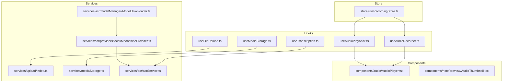
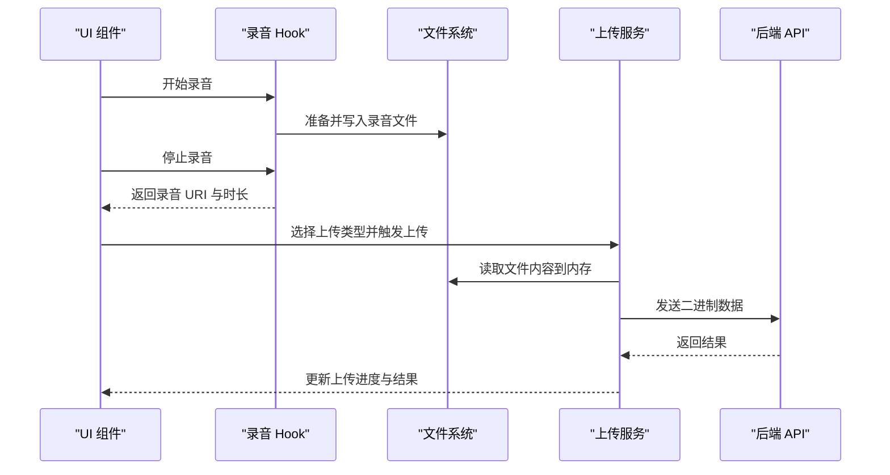
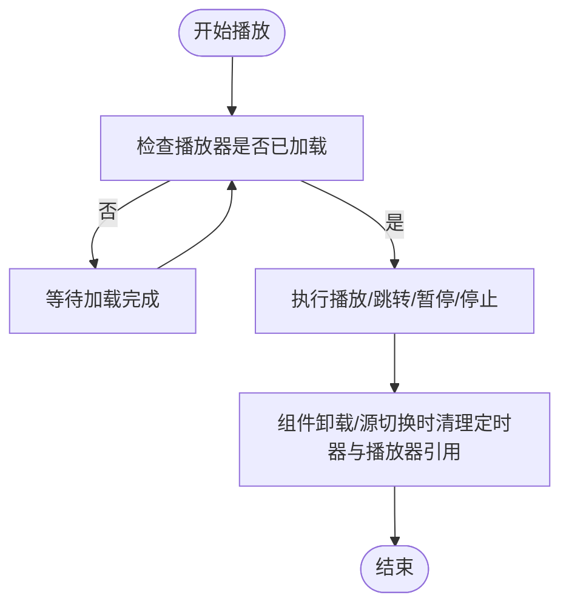
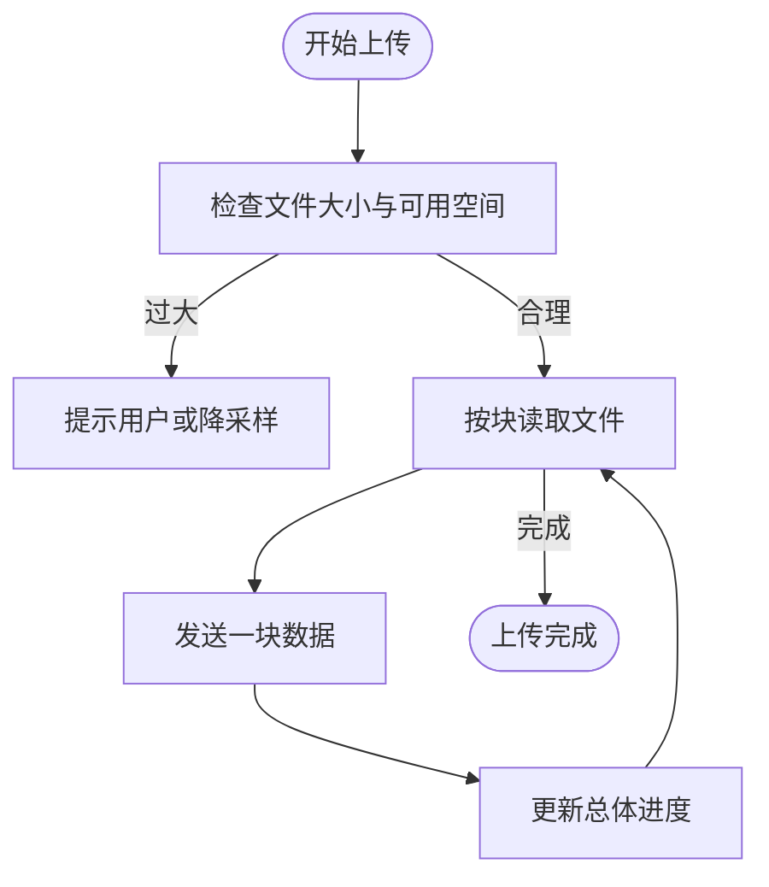
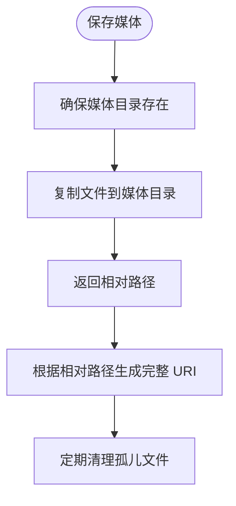
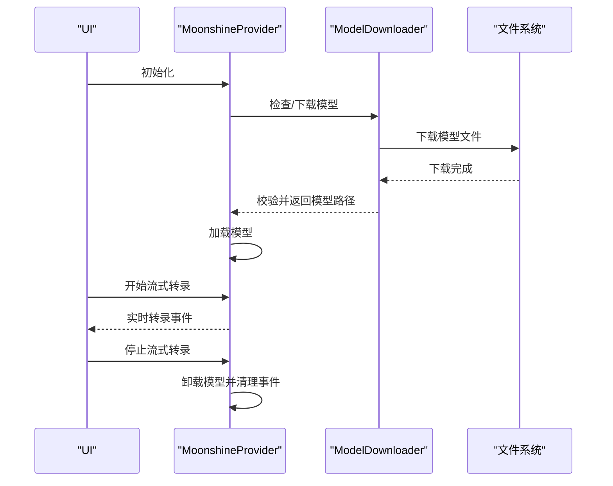
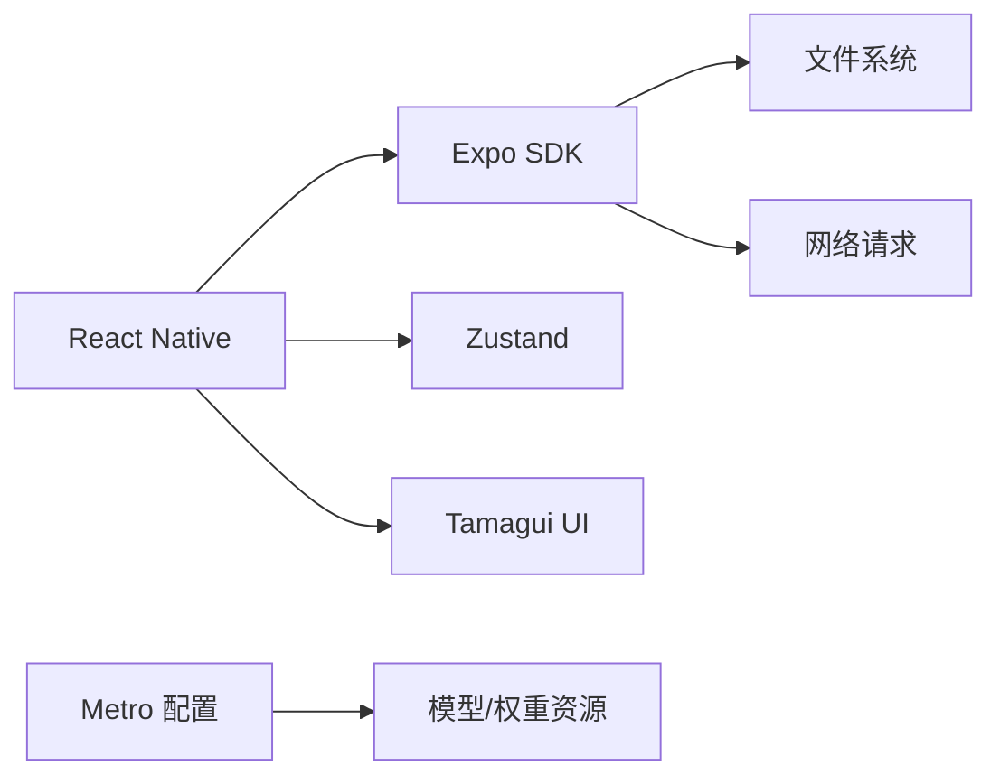

# 内存管理优化

<cite>
**本文引用的文件**
- [hooks/useAudioRecorder.ts](file://hooks/useAudioRecorder.ts)
- [hooks/useAudioPlayback.ts](file://hooks/useAudioPlayback.ts)
- [hooks/useFileUpload.ts](file://hooks/useFileUpload.ts)
- [services/upload/index.ts](file://services/upload/index.ts)
- [services/mediaStorage.ts](file://services/mediaStorage.ts)
- [hooks/useMediaStorage.ts](file://hooks/useMediaStorage.ts)
- [components/audio/AudioPlayer.tsx](file://components/audio/AudioPlayer.tsx)
- [components/note/preview/AudioThumbnail.tsx](file://components/note/preview/AudioThumbnail.tsx)
- [hooks/useTranscription.ts](file://hooks/useTranscription.ts)
- [services/asr/asrService.ts](file://services/asr/asrService.ts)
- [services/asr/providers/local/MoonshineProvider.ts](file://services/asr/providers/local/MoonshineProvider.ts)
- [services/asr/modelManager/ModelDownloader.ts](file://services/asr/modelManager/ModelDownloader.ts)
- [store/useRecordingStore.ts](file://store/useRecordingStore.ts)
- [package.json](file://package.json)
- [metro.config.js](file://metro.config.js)
</cite>

## 目录
1. [简介](#简介)
2. [项目结构](#项目结构)
3. [核心组件](#核心组件)
4. [架构总览](#架构总览)
5. [详细组件分析](#详细组件分析)
6. [依赖关系分析](#依赖关系分析)
7. [性能考量](#性能考量)
8. [故障排查指南](#故障排查指南)
9. [结论](#结论)
10. [附录](#附录)

## 简介
本文件面向 VoiceNote 的内存管理优化，聚焦以下方面：
- 音频录制、播放与转录过程中的内存优化策略
- 大文件上传与下载的内存控制（当前实现采用一次性读取到内存，后续可改为流式或分块）
- 图片与视频处理的内存优化（缩略图与缓存策略）
- 内存使用监控工具的使用方法（Flipper、React DevTools Profiler）
- 现代 JavaScript 内存特性在 RN 中的应用建议（WeakRef、FinalizationRegistry）
- 垃圾回收优化与内存压力处理最佳实践
- 内存泄漏检测与修复的实际案例

## 项目结构
VoiceNote 采用 React Native + Expo 架构，围绕“录音 → 播放 → 转录 → 上传/存储”的主流程组织模块。与内存管理直接相关的关键目录与文件如下：
- hooks：封装录音、播放、上传、媒体存储等状态与副作用
- services：封装上传、媒体存储、ASR 服务与本地模型管理
- components：UI 组件，包含音频播放器与音频缩略图
- store：Zustand 状态管理，记录录音与播放状态
- metro.config.js：Metro 打包配置，影响资源打包与加载

**图表来源**
- [hooks/useAudioRecorder.ts:1-270](file://hooks/useAudioRecorder.ts#L1-L270)
- [hooks/useAudioPlayback.ts:1-90](file://hooks/useAudioPlayback.ts#L1-L90)
- [hooks/useFileUpload.ts:1-123](file://hooks/useFileUpload.ts#L1-L123)
- [services/upload/index.ts:1-130](file://services/upload/index.ts#L1-L130)
- [services/mediaStorage.ts:1-123](file://services/mediaStorage.ts#L1-L123)
- [hooks/useMediaStorage.ts:1-99](file://hooks/useMediaStorage.ts#L1-L99)
- [components/audio/AudioPlayer.tsx:1-132](file://components/audio/AudioPlayer.tsx#L1-L132)
- [components/note/preview/AudioThumbnail.tsx:1-53](file://components/note/preview/AudioThumbnail.tsx#L1-L53)
- [hooks/useTranscription.ts:1-104](file://hooks/useTranscription.ts#L1-L104)
- [services/asr/asrService.ts:1-74](file://services/asr/asrService.ts#L1-L74)
- [services/asr/providers/local/MoonshineProvider.ts:1-307](file://services/asr/providers/local/MoonshineProvider.ts#L1-L307)
- [services/asr/modelManager/ModelDownloader.ts:1-207](file://services/asr/modelManager/ModelDownloader.ts#L1-L207)
- [store/useRecordingStore.ts:1-71](file://store/useRecordingStore.ts#L1-L71)

**章节来源**
- [hooks/useAudioRecorder.ts:1-270](file://hooks/useAudioRecorder.ts#L1-L270)
- [hooks/useAudioPlayback.ts:1-90](file://hooks/useAudioPlayback.ts#L1-L90)
- [hooks/useFileUpload.ts:1-123](file://hooks/useFileUpload.ts#L1-L123)
- [services/upload/index.ts:1-130](file://services/upload/index.ts#L1-L130)
- [services/mediaStorage.ts:1-123](file://services/mediaStorage.ts#L1-L123)
- [hooks/useMediaStorage.ts:1-99](file://hooks/useMediaStorage.ts#L1-L99)
- [components/audio/AudioPlayer.tsx:1-132](file://components/audio/AudioPlayer.tsx#L1-L132)
- [components/note/preview/AudioThumbnail.tsx:1-53](file://components/note/preview/AudioThumbnail.tsx#L1-L53)
- [hooks/useTranscription.ts:1-104](file://hooks/useTranscription.ts#L1-L104)
- [services/asr/asrService.ts:1-74](file://services/asr/asrService.ts#L1-L74)
- [services/asr/providers/local/MoonshineProvider.ts:1-307](file://services/asr/providers/local/MoonshineProvider.ts#L1-L307)
- [services/asr/modelManager/ModelDownloader.ts:1-207](file://services/asr/modelManager/ModelDownloader.ts#L1-L207)
- [store/useRecordingStore.ts:1-71](file://store/useRecordingStore.ts#L1-L71)
- [metro.config.js:1-8](file://metro.config.js#L1-L8)

## 核心组件
- 录音与播放 Hook：负责录音生命周期、播放器状态与播放进度轮询；注意定时器与播放器对象的清理
- 上传 Hook：封装单文件与多文件上传，支持进度回调；当前上传实现将文件读入内存
- 媒体存储服务：封装本地媒体文件保存、URI 获取、删除与磁盘配额查询
- ASR 服务：封装云端与本地（Moonshine）ASR 调用，含超时控制与错误处理
- 本地模型管理：下载与校验本地模型，支持取消下载与状态跟踪
- Zustand Store：集中管理录音与播放状态，避免重复实例化

**章节来源**
- [hooks/useAudioRecorder.ts:1-270](file://hooks/useAudioRecorder.ts#L1-L270)
- [hooks/useAudioPlayback.ts:1-90](file://hooks/useAudioPlayback.ts#L1-L90)
- [hooks/useFileUpload.ts:1-123](file://hooks/useFileUpload.ts#L1-L123)
- [services/mediaStorage.ts:1-123](file://services/mediaStorage.ts#L1-L123)
- [hooks/useMediaStorage.ts:1-99](file://hooks/useMediaStorage.ts#L1-L99)
- [hooks/useTranscription.ts:1-104](file://hooks/useTranscription.ts#L1-L104)
- [services/asr/asrService.ts:1-74](file://services/asr/asrService.ts#L1-L74)
- [services/asr/providers/local/MoonshineProvider.ts:1-307](file://services/asr/providers/local/MoonshineProvider.ts#L1-L307)
- [services/asr/modelManager/ModelDownloader.ts:1-207](file://services/asr/modelManager/ModelDownloader.ts#L1-L207)
- [store/useRecordingStore.ts:1-71](file://store/useRecordingStore.ts#L1-L71)

## 架构总览
下图展示从录音到上传/存储的端到端流程，以及与内存相关的关注点。

**图表来源**
- [hooks/useAudioRecorder.ts:79-175](file://hooks/useAudioRecorder.ts#L79-L175)
- [services/upload/index.ts:29-66](file://services/upload/index.ts#L29-L66)
- [components/audio/AudioPlayer.tsx:19-28](file://components/audio/AudioPlayer.tsx#L19-L28)

## 详细组件分析

### 录音与播放内存优化
- 定时器与播放状态轮询：播放进度通过定时器轮询更新，需在播放器源变更或组件卸载时清理定时器，避免悬挂引用导致内存泄漏
- 播放器实例管理：播放器对象由外部 Hook 创建，切换源时应确保旧播放器不再被引用，必要时调用卸载接口
- 录音权限与模式切换：录音完成后需恢复音频模式，防止后续播放异常占用资源

**图表来源**
- [hooks/useAudioPlayback.ts:12-21](file://hooks/useAudioPlayback.ts#L12-L21)
- [hooks/useAudioRecorder.ts:62-71](file://hooks/useAudioRecorder.ts#L62-L71)

**章节来源**
- [hooks/useAudioRecorder.ts:1-270](file://hooks/useAudioRecorder.ts#L1-L270)
- [hooks/useAudioPlayback.ts:1-90](file://hooks/useAudioPlayback.ts#L1-L90)

### 上传与下载内存控制策略
- 当前实现：上传服务将文件以 Base64 形式读入内存后再发送，这在大文件场景会显著增加内存峰值
- 建议方案：
  - 使用 Blob/FormData 流式上传，避免一次性读入内存
  - 分块上传：按固定大小切分文件，逐块上传并报告进度
  - 上传前进行文件大小校验与磁盘空间检查，失败即刻返回
- 下载优化：若涉及模型下载，建议采用分段下载与断点续传，并在下载过程中及时释放中间缓冲

**图表来源**
- [services/upload/index.ts:29-66](file://services/upload/index.ts#L29-L66)
- [services/mediaStorage.ts:64-74](file://services/mediaStorage.ts#L64-L74)

**章节来源**
- [hooks/useFileUpload.ts:1-123](file://hooks/useFileUpload.ts#L1-L123)
- [services/upload/index.ts:1-130](file://services/upload/index.ts#L1-L130)
- [services/mediaStorage.ts:1-123](file://services/mediaStorage.ts#L1-L123)

### 媒体存储与缩略图缓存
- 本地存储：统一保存到应用文档目录下的媒体子目录，提供保存、删除、URI 获取与磁盘配额查询
- 缩略图：音频缩略图组件仅渲染基础 UI，不涉及复杂图像处理；建议在列表中复用同一缩略图组件，避免重复创建
- 清理策略：定期扫描未被数据库引用的媒体文件并删除，释放磁盘空间

**图表来源**
- [services/mediaStorage.ts:10-36](file://services/mediaStorage.ts#L10-L36)
- [hooks/useMediaStorage.ts:21-36](file://hooks/useMediaStorage.ts#L21-L36)
- [components/note/preview/AudioThumbnail.tsx:1-53](file://components/note/preview/AudioThumbnail.tsx#L1-L53)

**章节来源**
- [services/mediaStorage.ts:1-123](file://services/mediaStorage.ts#L1-L123)
- [hooks/useMediaStorage.ts:1-99](file://hooks/useMediaStorage.ts#L1-L99)
- [components/note/preview/AudioThumbnail.tsx:1-53](file://components/note/preview/AudioThumbnail.tsx#L1-L53)

### 转录与本地模型内存
- 云端转录：设置超时与 AbortController，避免长时间挂起；对响应进行严格校验
- 本地转录（Moonshine）：初始化时加载模型，停止时卸载模型；订阅事件时需在销毁阶段取消订阅，防止回调持有闭包导致泄漏
- 模型下载：下载过程中维护状态映射，失败时清理临时文件与部分下载内容

**图表来源**
- [services/asr/providers/local/MoonshineProvider.ts:88-135](file://services/asr/providers/local/MoonshineProvider.ts#L88-L135)
- [services/asr/providers/local/MoonshineProvider.ts:192-259](file://services/asr/providers/local/MoonshineProvider.ts#L192-L259)
- [services/asr/modelManager/ModelDownloader.ts:37-165](file://services/asr/modelManager/ModelDownloader.ts#L37-L165)

**章节来源**
- [hooks/useTranscription.ts:1-104](file://hooks/useTranscription.ts#L1-L104)
- [services/asr/asrService.ts:1-74](file://services/asr/asrService.ts#L1-L74)
- [services/asr/providers/local/MoonshineProvider.ts:1-307](file://services/asr/providers/local/MoonshineProvider.ts#L1-L307)
- [services/asr/modelManager/ModelDownloader.ts:1-207](file://services/asr/modelManager/ModelDownloader.ts#L1-L207)

## 依赖关系分析
- React Native 与 Expo 生态：录音、文件系统、网络请求等能力来自 Expo SDK
- 状态管理：Zustand 用于录音与播放状态，避免全局状态污染
- 打包配置：Metro 配置扩展了资源后缀，便于模型与权重文件打包

**图表来源**
- [package.json:20-62](file://package.json#L20-L62)
- [metro.config.js:1-8](file://metro.config.js#L1-L8)

**章节来源**
- [package.json:1-83](file://package.json#L1-L83)
- [metro.config.js:1-8](file://metro.config.js#L1-L8)

## 性能考量
- 避免在渲染路径中执行重计算：将昂贵的计算放入 useMemo/useCallback 或后台线程
- 控制 UI 列表项数量：对媒体列表使用虚拟化列表，减少同时渲染的节点数
- 及时释放资源：播放器、定时器、事件监听器、模型加载器等在不需要时立即释放
- 网络与 I/O：上传采用分块与流式方式，下载采用断点续传，降低内存峰值
- 存储清理：定期清理孤儿文件，保持磁盘空间充足

## 故障排查指南
- 录音后无法播放
  - 检查音频模式是否正确恢复
  - 确认播放器源变更后是否重新加载
  - 查看播放状态轮询是否被清理
- 上传卡顿或崩溃
  - 检查文件大小与可用空间
  - 将 Base64 读取改为流式上传
  - 添加上传超时与中断机制
- 转录无输出或报错
  - 确认模型已加载且语言参数正确
  - 检查事件订阅是否在销毁时取消
  - 设置合理的超时与错误提示
- 内存持续增长
  - 检查是否存在未清理的定时器与事件监听
  - 确保播放器与模型在组件卸载时被释放
  - 使用监控工具定位泄漏点

**章节来源**
- [hooks/useAudioRecorder.ts:140-175](file://hooks/useAudioRecorder.ts#L140-L175)
- [hooks/useAudioPlayback.ts:12-21](file://hooks/useAudioPlayback.ts#L12-L21)
- [services/upload/index.ts:29-66](file://services/upload/index.ts#L29-L66)
- [services/asr/providers/local/MoonshineProvider.ts:140-164](file://services/asr/providers/local/MoonshineProvider.ts#L140-L164)

## 结论
VoiceNote 在录音、播放、转录与上传等环节均存在内存优化机会。建议优先实施：
- 上传流程改为流式与分块，避免一次性读入内存
- 强化播放器与模型生命周期管理，确保卸载与清理
- 增加磁盘配额检查与孤儿文件清理
- 使用监控工具进行持续观测与回归测试

## 附录

### 内存使用监控工具
- Flipper：连接设备后可在 Network 与 Memory 面板观察网络请求与内存曲线
- React DevTools Profiler：捕获渲染性能与重渲染热点，辅助定位不必要的重渲染
- Metro/打包配置：确保资源正确打包，避免重复资源占用内存

**章节来源**
- [package.json:64-82](file://package.json#L64-L82)
- [metro.config.js:1-8](file://metro.config.js#L1-L8)

### 现代 JavaScript 内存特性应用建议
- WeakRef：适用于缓存键值映射但不阻止垃圾回收的场景（谨慎使用，需配合 FinalizationRegistry 观察回收）
- FinalizationRegistry：注册对象回收回调，可用于统计与调试，但不可依赖其作为确定性清理手段
- 注意：在 React Native 环境中，上述特性支持情况可能受限，建议先在开发环境验证

### 垃圾回收优化与内存压力处理
- 避免闭包持有大型对象
- 合理拆分任务，避免主线程长时间阻塞
- 在内存压力高时主动释放非关键资源（如预览图、临时模型）