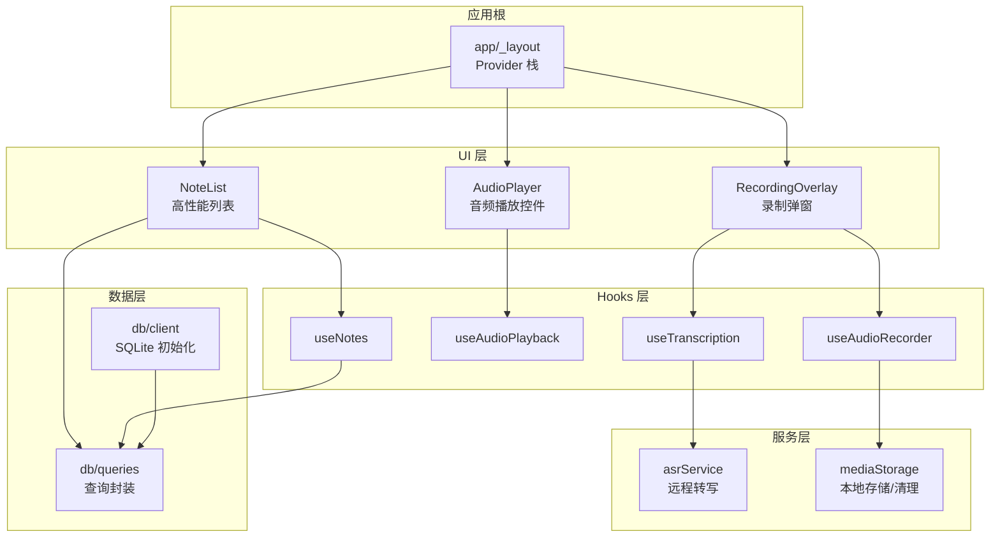
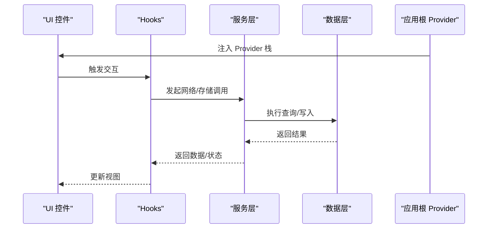
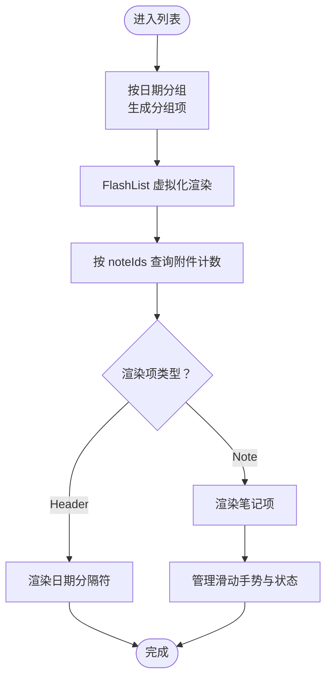
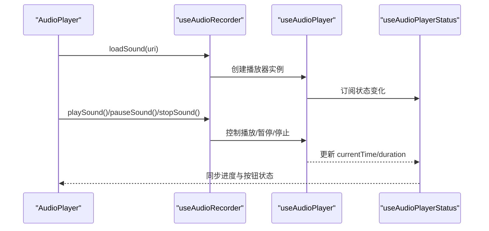
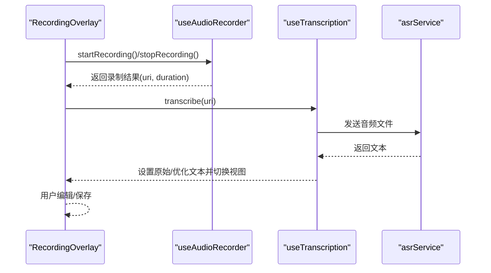
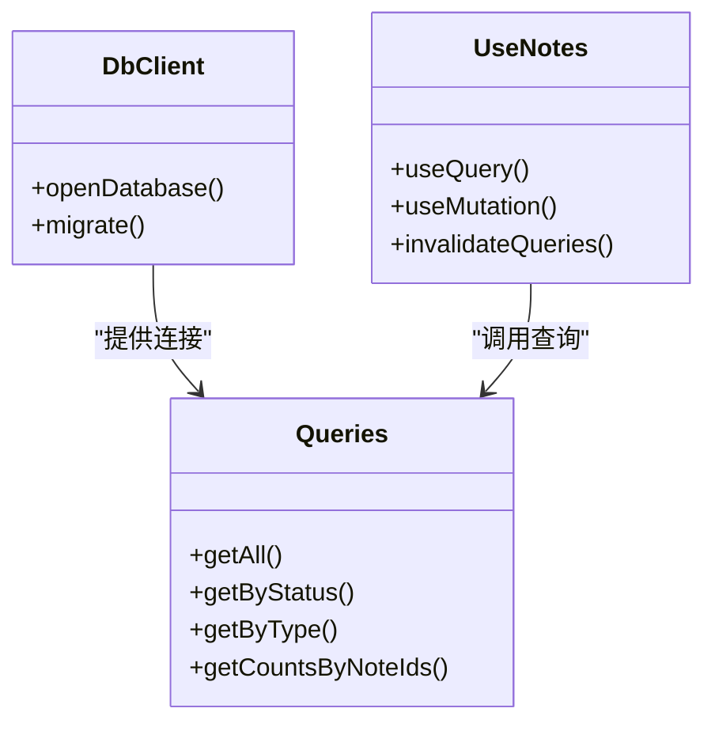
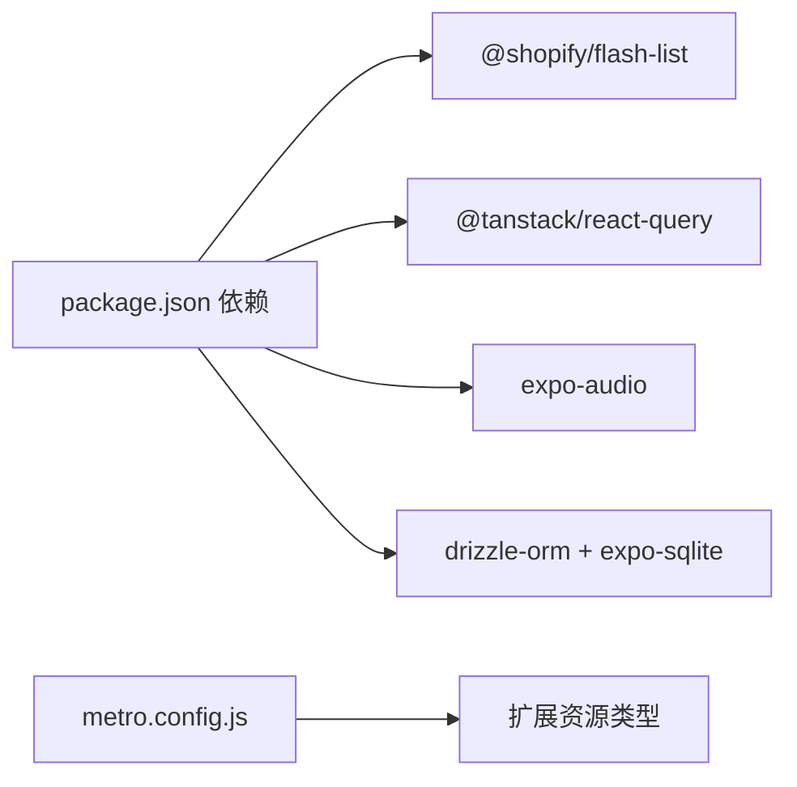

# 性能优化

<cite>
**本文引用的文件**
- [package.json](file://package.json)
- [metro.config.js](file://metro.config.js)
- [app/_layout.tsx](file://app/_layout.tsx)
- [db/client.ts](file://db/client.ts)
- [db/queries.ts](file://db/queries.ts)
- [hooks/useAudioPlayback.ts](file://hooks/useAudioPlayback.ts)
- [hooks/useAudioRecorder.ts](file://hooks/useAudioRecorder.ts)
- [hooks/useNotes.ts](file://hooks/useNotes.ts)
- [hooks/useTranscription.ts](file://hooks/useTranscription.ts)
- [components/note/NoteList.tsx](file://components/note/NoteList.tsx)
- [components/audio/AudioPlayer.tsx](file://components/audio/AudioPlayer.tsx)
- [components/input/RecordingOverlay.tsx](file://components/input/RecordingOverlay.tsx)
- [services/asr/asrService.ts](file://services/asr/asrService.ts)
- [services/mediaStorage.ts](file://services/mediaStorage.ts)
- [store/index.ts](file://store/index.ts)
</cite>

## 目录
1. [简介](#简介)
2. [项目结构](#项目结构)
3. [核心组件](#核心组件)
4. [架构总览](#架构总览)
5. [详细组件分析](#详细组件分析)
6. [依赖关系分析](#依赖关系分析)
7. [性能考量](#性能考量)
8. [故障排查指南](#故障排查指南)
9. [结论](#结论)
10. [附录](#附录)

## 简介
本文件面向 VoiceNote 应用的性能优化，系统性覆盖渲染性能、内存管理、网络请求、电池使用、音频处理、数据库查询与索引、性能监控与指标、构建优化与包体积、离线缓存与预加载、以及性能测试与基准测试方法。文档基于仓库现有代码进行深入分析，并结合 React Native 生态中的最佳实践给出可操作建议。

## 项目结构
VoiceNote 采用 Expo + React Navigation + Tamagui + Drizzle ORM + React Query 的组合，围绕“录音-转写-笔记”工作流组织模块。关键性能相关模块分布如下：
- 布局与全局状态：app/_layout.tsx 提供 Provider 栈（Tamagui、React Query、手势、安全区域等）
- 数据层：db/client.ts 初始化本地 SQLite，db/queries.ts 定义查询逻辑
- 音频能力：hooks/useAudioRecorder.ts 与 hooks/useAudioPlayback.ts 封装录音与播放
- 列表渲染：components/note/NoteList.tsx 使用 FlashList 实现高性能滚动
- 转写服务：services/asr/asrService.ts 负责远程语音转文本
- 存储与清理：services/mediaStorage.ts 管理本地媒体文件与垃圾回收
- 查询缓存：hooks/useNotes.ts 使用 React Query 进行查询缓存与乐观更新

图表来源
- [app/_layout.tsx:1-101](file://app/_layout.tsx#L1-L101)
- [components/note/NoteList.tsx:1-240](file://components/note/NoteList.tsx#L1-L240)
- [components/audio/AudioPlayer.tsx:1-132](file://components/audio/AudioPlayer.tsx#L1-L132)
- [components/input/RecordingOverlay.tsx:1-419](file://components/input/RecordingOverlay.tsx#L1-L419)
- [hooks/useAudioRecorder.ts:1-270](file://hooks/useAudioRecorder.ts#L1-L270)
- [hooks/useAudioPlayback.ts:1-90](file://hooks/useAudioPlayback.ts#L1-L90)
- [hooks/useNotes.ts:1-217](file://hooks/useNotes.ts#L1-L217)
- [hooks/useTranscription.ts:1-104](file://hooks/useTranscription.ts#L1-L104)
- [services/asr/asrService.ts:1-74](file://services/asr/asrService.ts#L1-L74)
- [services/mediaStorage.ts:1-123](file://services/mediaStorage.ts#L1-L123)
- [db/client.ts:1-15](file://db/client.ts#L1-L15)
- [db/queries.ts:1-286](file://db/queries.ts#L1-L286)

章节来源
- [app/_layout.tsx:1-101](file://app/_layout.tsx#L1-L101)
- [package.json:1-83](file://package.json#L1-L83)
- [metro.config.js:1-8](file://metro.config.js#L1-L8)

## 核心组件
- 渲染性能
  - 高性能列表：NoteList 使用 FlashList 替代 FlatList，支持虚拟化与按需渲染，显著降低大列表滚动开销。
  - 组件拆分与 memo：useMemo/useCallback 在多个 Hook 中广泛使用，避免不必要重渲染。
- 内存管理
  - 音频资源：useAudioPlayback/useAudioRecorder 对播放器生命周期进行显式控制（暂停、停止、seekTo、unload），防止资源泄漏。
  - 本地存储：mediaStorage 提供媒体文件清理与配额查询，避免磁盘膨胀导致的性能退化。
- 网络请求优化
  - React Query 缓存：全局默认缓存时间与过期策略，减少重复请求。
  - 超时与中断：ASR 请求设置 AbortController 超时，避免长时间挂起。
- 电池使用优化
  - 录音模式切换：在录音与播放之间切换音频模式，减少后台占用。
  - 滚动与手势：使用原生手势处理器，降低 JS 线程压力。

章节来源
- [components/note/NoteList.tsx:1-240](file://components/note/NoteList.tsx#L1-L240)
- [hooks/useAudioPlayback.ts:1-90](file://hooks/useAudioPlayback.ts#L1-L90)
- [hooks/useAudioRecorder.ts:1-270](file://hooks/useAudioRecorder.ts#L1-L270)
- [services/mediaStorage.ts:1-123](file://services/mediaStorage.ts#L1-L123)
- [app/_layout.tsx:15-24](file://app/_layout.tsx#L15-L24)
- [services/asr/asrService.ts:42-44](file://services/asr/asrService.ts#L42-L44)

## 架构总览
VoiceNote 的性能相关架构由“UI 控件层 → Hooks 层 → 服务层 → 数据层 → 应用根 Provider 栈”构成。UI 控件通过 Hooks 访问服务与数据；服务层负责网络与本地存储；数据层通过 Drizzle ORM 访问 SQLite；应用根统一注入主题、国际化、手势、安全区域与查询缓存。

图表来源
- [app/_layout.tsx:1-101](file://app/_layout.tsx#L1-L101)
- [hooks/useNotes.ts:1-217](file://hooks/useNotes.ts#L1-L217)
- [services/asr/asrService.ts:1-74](file://services/asr/asrService.ts#L1-L74)
- [db/queries.ts:1-286](file://db/queries.ts#L1-L286)

## 详细组件分析

### 组件一：高性能列表渲染（NoteList + FlashList）
- 虚拟化与分组：对笔记按日期分组并使用 FlashList 渲染，keyExtractor 区分 header 与 note，避免全量重排。
- 查询缓存：useQuery 获取附件计数，按 noteIds 分批查询，避免 N+1。
- 交互优化：滑动删除使用 ref 管理 Swipeable，关闭其他项以减少布局抖动。

图表来源
- [components/note/NoteList.tsx:80-137](file://components/note/NoteList.tsx#L80-L137)
- [components/note/NoteList.tsx:159-181](file://components/note/NoteList.tsx#L159-L181)

章节来源
- [components/note/NoteList.tsx:1-240](file://components/note/NoteList.tsx#L1-L240)
- [hooks/useNotes.ts:133-137](file://hooks/useNotes.ts#L133-L137)

### 组件二：音频处理与播放（useAudioRecorder + useAudioPlayback + AudioPlayer）
- 生命周期控制：loadAndPlay/loadSound/play/pause/stop/seekTo/unload 明确资源加载与释放路径，避免后台播放占用。
- 播放器状态：useAudioPlayerStatus 提供 isLoaded/playing/currentTime/duration，用于进度条与按钮状态联动。
- 录制模式切换：在录音与播放间切换音频模式，减少系统资源占用。

图表来源
- [components/audio/AudioPlayer.tsx:15-47](file://components/audio/AudioPlayer.tsx#L15-L47)
- [hooks/useAudioRecorder.ts:207-246](file://hooks/useAudioRecorder.ts#L207-L246)
- [hooks/useAudioPlayback.ts:27-88](file://hooks/useAudioPlayback.ts#L27-L88)

章节来源
- [hooks/useAudioRecorder.ts:1-270](file://hooks/useAudioRecorder.ts#L1-L270)
- [hooks/useAudioPlayback.ts:1-90](file://hooks/useAudioPlayback.ts#L1-L90)
- [components/audio/AudioPlayer.tsx:1-132](file://components/audio/AudioPlayer.tsx#L1-L132)

### 组件三：录制弹窗与转写流程（RecordingOverlay + useTranscription）
- 流式与文件两种模式：根据 isStreamingMode 决定实时转写或录制后转写，分别使用不同的计时与状态。
- 自动优化：当启用优化且存在原始文本时，自动触发优化并将视图切换到优化文本。
- 错误与重试：转写失败时显示警告并提供重试入口，避免阻塞用户操作。

图表来源
- [components/input/RecordingOverlay.tsx:161-222](file://components/input/RecordingOverlay.tsx#L161-L222)
- [hooks/useTranscription.ts:33-65](file://hooks/useTranscription.ts#L33-L65)
- [services/asr/asrService.ts:24-73](file://services/asr/asrService.ts#L24-L73)

章节来源
- [components/input/RecordingOverlay.tsx:1-419](file://components/input/RecordingOverlay.tsx#L1-L419)
- [hooks/useTranscription.ts:1-104](file://hooks/useTranscription.ts#L1-L104)
- [services/asr/asrService.ts:1-74](file://services/asr/asrService.ts#L1-L74)

### 组件四：数据库查询与缓存（db/client + db/queries + hooks/useNotes）
- SQLite 初始化与迁移：db/client.ts 初始化数据库并执行迁移，确保 schema 一致性。
- 查询封装：db/queries.ts 提供按状态/类型/时间等多维度查询，支持批量统计（如附件计数）。
- 查询缓存：hooks/useNotes.ts 使用 React Query，定义 queryKey 与缓存失效策略，配合乐观更新提升交互流畅度。

图表来源
- [db/client.ts:1-15](file://db/client.ts#L1-L15)
- [db/queries.ts:6-133](file://db/queries.ts#L6-L133)
- [hooks/useNotes.ts:19-29](file://hooks/useNotes.ts#L19-L29)

章节来源
- [db/client.ts:1-15](file://db/client.ts#L1-L15)
- [db/queries.ts:1-286](file://db/queries.ts#L1-L286)
- [hooks/useNotes.ts:1-217](file://hooks/useNotes.ts#L1-L217)

## 依赖关系分析
- 核心依赖与性能相关性
  - @shopify/flash-list：高性能列表渲染，降低大列表内存与 CPU 占用。
  - @tanstack/react-query：查询缓存与失效策略，减少网络与数据库压力。
  - expo-audio：录音与播放底层能力，需配合生命周期管理避免资源泄漏。
  - drizzle-orm + expo-sqlite：本地数据库访问，需合理设计索引与查询。
- Metro 配置
  - metro.config.js 扩展 assetExts，确保模型/权重等资源被正确打包。

图表来源
- [package.json:20-62](file://package.json#L20-L62)
- [metro.config.js:5](file://metro.config.js#L5)

章节来源
- [package.json:1-83](file://package.json#L1-L83)
- [metro.config.js:1-8](file://metro.config.js#L1-L8)

## 性能考量

### 渲染性能
- 列表虚拟化：已采用 FlashList，建议保持 keyExtractor 唯一性与稳定，避免不必要的重新渲染。
- 组件拆分：将复杂项拆分为独立子组件，配合 memo 与浅比较，减少父级更新带来的连锁反应。
- 动画与手势：使用原生动画与手势处理器，避免在 JS 线程中做重计算。

### 内存管理
- 音频资源：确保在页面卸载或不再需要时调用 unload/stop 并释放播放器实例。
- 本地存储：定期调用 cleanupOrphanedMedia 清理未引用的媒体文件，监控可用空间。
- 大对象与缓存：避免在组件内缓存过大的二进制数据，优先使用文件路径与按需读取。

### 网络请求优化
- 超时与中断：ASR 请求已设置 AbortController，建议在 UI 层提供取消按钮与错误提示。
- 重试与降级：在网络不稳定时提供重试与离线文本输入，保证用户体验。
- 缓存策略：利用 React Query 的 staleTime/gcTime 控制缓存生命周期，避免频繁拉取。

### 电池使用优化
- 录音模式切换：在录音与播放之间切换音频模式，减少后台占用。
- 避免高频定时器：注意录音 Overlay 中的局部计时器，确保在组件卸载时清理。

### 音频处理与内存最佳实践
- 按需加载：仅在需要时加载音频源，播放结束后及时释放。
- 进度控制：使用 seekTo 代替频繁的播放/暂停，减少状态切换开销。
- 文件管理：录制完成后及时复制到应用目录，避免临时文件残留。

### 数据库查询优化与索引策略
- 查询粒度：优先使用按状态/类型/时间范围的过滤条件，避免全表扫描。
- 批量统计：使用 getCountsByNoteIds 进行批量统计，减少多次查询。
- 索引建议：对常用过滤字段（如 status、type、updatedAt、noteId）建立索引，提升查询性能。

### 性能监控与指标
- 指标建议：FPS、JS 与原生线程 CPU、内存占用、网络请求数与耗时、数据库查询耗时、音频播放卡顿次数。
- 工具建议：使用 Flipper/React DevTools Profiler、Flipper 插件（如 Network、Database）、React Query Devtools。

### 构建优化与包体积
- 资源类型：已在 metro.config.js 中扩展资源类型，确保模型文件被打包。
- 依赖裁剪：移除未使用的依赖，合并相似功能模块，减少包体。
- 动态导入：对非首屏必需的功能（如某些 AI 模型）采用动态导入，按需加载。

### 离线缓存与数据预加载
- 离线可用：对常用查询（如最近笔记列表）设置合理的 staleTime，允许离线展示。
- 预加载策略：在用户即将进入页面前预取相关数据（如附件计数），减少等待时间。

### 性能测试与基准测试
- 方法建议：使用 React Native Testing Library 编写单元测试，结合 Jest 运行；对关键函数（如分组算法、查询封装）编写基准测试。
- 基准场景：大列表滚动、大量音频播放/暂停、频繁转写、数据库批量插入/查询。

## 故障排查指南
- 录音无法开始/权限问题
  - 检查权限请求与音频模式切换逻辑，确保在 startRecording 前已获得权限。
- 播放异常或卡顿
  - 确认播放器状态 isLoaded，避免在未加载完成时调用 play/seekTo。
- 转写超时或失败
  - 检查 ASR 超时配置与网络状态，提供重试与错误提示。
- 列表渲染卡顿
  - 确保 FlashList 的 keyExtractor 正确，避免在 renderItem 中进行昂贵计算。
- 存储空间不足
  - 定期调用 cleanupOrphanedMedia 并监控可用空间，避免因磁盘不足导致性能退化。

章节来源
- [hooks/useAudioRecorder.ts:74-109](file://hooks/useAudioRecorder.ts#L74-L109)
- [hooks/useAudioPlayback.ts:12-21](file://hooks/useAudioPlayback.ts#L12-L21)
- [services/asr/asrService.ts:42-73](file://services/asr/asrService.ts#L42-L73)
- [components/note/NoteList.tsx:185-202](file://components/note/NoteList.tsx#L185-L202)
- [services/mediaStorage.ts:80-114](file://services/mediaStorage.ts#L80-L114)

## 结论
VoiceNote 已在关键性能领域采取了多项优化措施：高性能列表、查询缓存、音频生命周期管理、本地存储清理与转写超时控制。为进一步提升性能，建议完善索引策略、引入更细粒度的监控与基准测试、优化包体积与资源加载策略，并持续关注 React Native 生态的最新优化方案。

## 附录
- 关键实现路径参考
  - 列表渲染与虚拟化：[components/note/NoteList.tsx:185-202](file://components/note/NoteList.tsx#L185-L202)
  - 音频播放控制：[hooks/useAudioPlayback.ts:27-88](file://hooks/useAudioPlayback.ts#L27-L88)
  - 录音与播放集成：[hooks/useAudioRecorder.ts:207-246](file://hooks/useAudioRecorder.ts#L207-L246)
  - 转写流程与优化：[hooks/useTranscription.ts:33-65](file://hooks/useTranscription.ts#L33-L65)
  - 数据库初始化与查询：[db/client.ts:1-15](file://db/client.ts#L1-L15)、[db/queries.ts:117-132](file://db/queries.ts#L117-L132)
  - Provider 栈与缓存配置：[app/_layout.tsx:15-24](file://app/_layout.tsx#L15-L24)
  - 资源类型扩展：[metro.config.js:5](file://metro.config.js#L5)