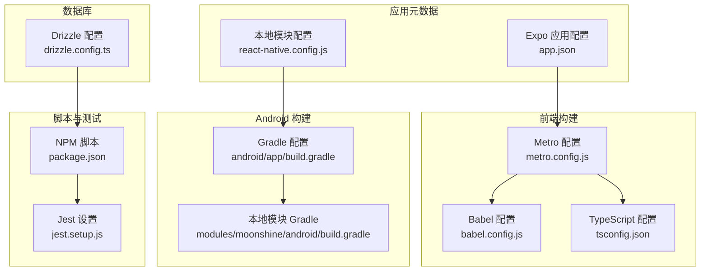
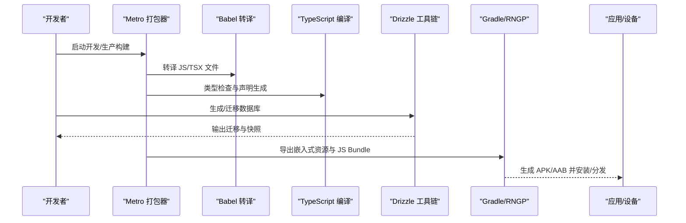
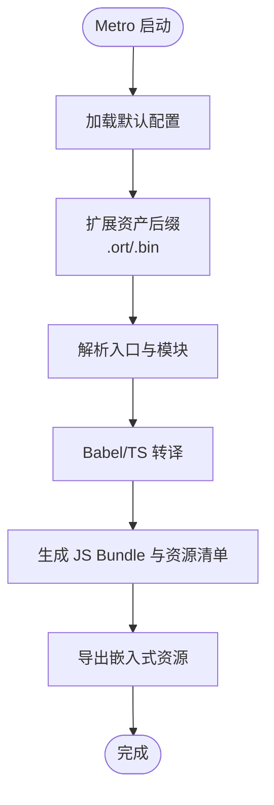
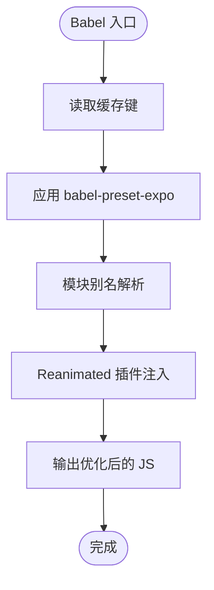
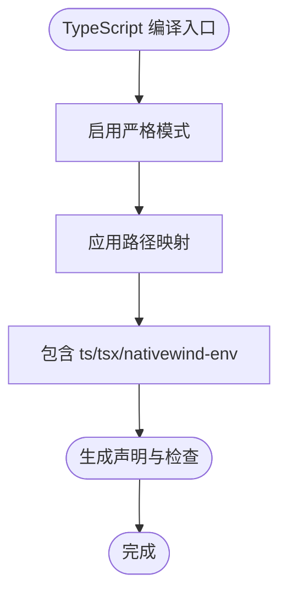
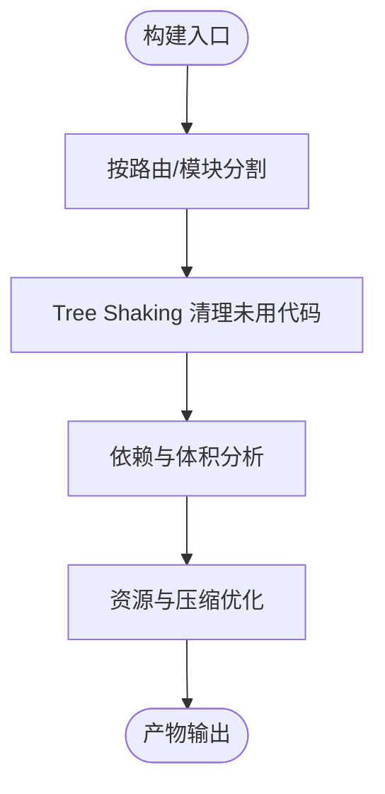
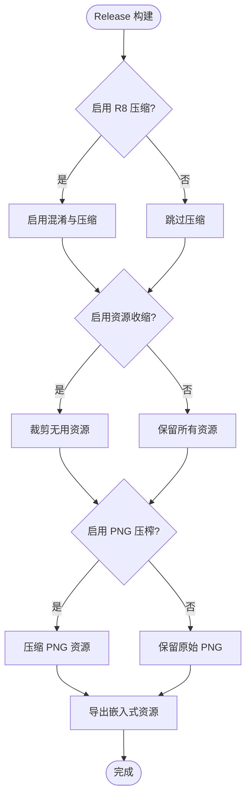
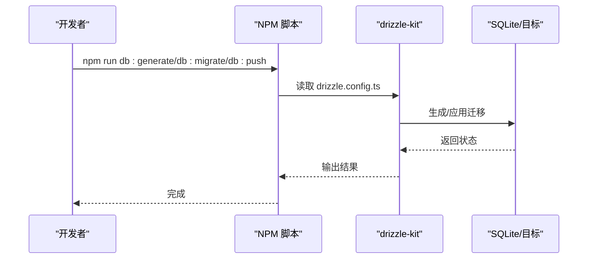
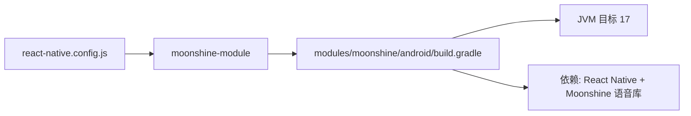
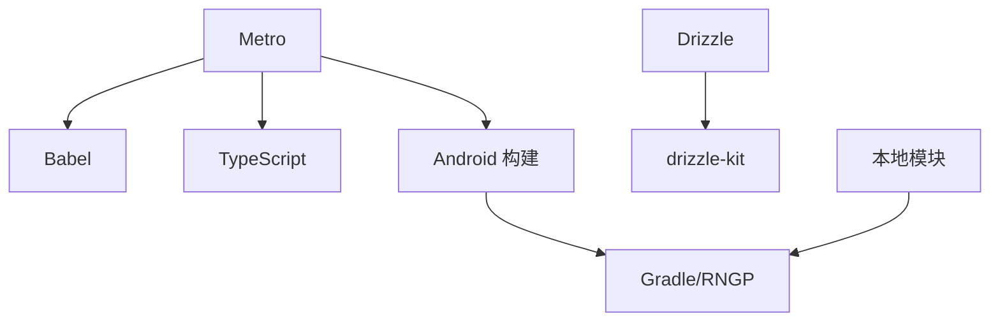

# 构建优化

<cite>
**本文引用的文件**
- [metro.config.js](file://metro.config.js)
- [babel.config.js](file://babel.config.js)
- [tsconfig.json](file://tsconfig.json)
- [drizzle.config.ts](file://drizzle.config.ts)
- [package.json](file://package.json)
- [app.json](file://app.json)
- [react-native.config.js](file://react-native.config.js)
- [android/app/build.gradle](file://android/app/build.gradle)
- [modules/moonshine/android/build.gradle](file://modules/moonshine/android/build.gradle)
- [jest.setup.js](file://jest.setup.js)
</cite>

## 目录
1. [简介](#简介)
2. [项目结构](#项目结构)
3. [核心组件](#核心组件)
4. [架构总览](#架构总览)
5. [详细组件分析](#详细组件分析)
6. [依赖分析](#依赖分析)
7. [性能考量](#性能考量)
8. [故障排查指南](#故障排查指南)
9. [结论](#结论)
10. [附录](#附录)

## 简介
本文件面向 VoiceNote 项目的构建优化，系统性梳理 Metro 构建系统、Babel 转译、TypeScript 编译、包体积优化（Tree Shaking、代码分割、依赖分析）、生产构建优化（代码压缩、资源优化、Bundle 分析）、Drizzle ORM 的构建与迁移处理，以及构建性能监控与 CI 最佳实践，并给出多环境配置差异与优化策略。

## 项目结构
VoiceNote 基于 Expo + React Native 技术栈，采用 Metro 作为打包器，配合 Babel 与 TypeScript 进行转译与类型检查；Android 使用 Gradle 驱动的 React Native Gradle Plugin（RNGP）进行原生层集成与发布配置；Drizzle 用于 SQLite 数据库 Schema 管理与迁移。

**图示来源**
- [metro.config.js:1-8](file://metro.config.js#L1-L8)
- [babel.config.js:1-27](file://babel.config.js#L1-L27)
- [tsconfig.json:1-63](file://tsconfig.json#L1-L63)
- [app.json:1-86](file://app.json#L1-L86)
- [react-native.config.js:1-31](file://react-native.config.js#L1-L31)
- [drizzle.config.ts:1-12](file://drizzle.config.ts#L1-L12)
- [android/app/build.gradle:1-183](file://android/app/build.gradle#L1-L183)
- [modules/moonshine/android/build.gradle:1-37](file://modules/moonshine/android/build.gradle#L1-L37)
- [package.json:1-83](file://package.json#L1-L83)
- [jest.setup.js:1-10](file://jest.setup.js#L1-L10)

**章节来源**
- [metro.config.js:1-8](file://metro.config.js#L1-L8)
- [babel.config.js:1-27](file://babel.config.js#L1-L27)
- [tsconfig.json:1-63](file://tsconfig.json#L1-L63)
- [app.json:1-86](file://app.json#L1-L86)
- [react-native.config.js:1-31](file://react-native.config.js#L1-L31)
- [drizzle.config.ts:1-12](file://drizzle.config.ts#L1-L12)
- [android/app/build.gradle:1-183](file://android/app/build.gradle#L1-L183)
- [modules/moonshine/android/build.gradle:1-37](file://modules/moonshine/android/build.gradle#L1-L37)
- [package.json:1-83](file://package.json#L1-L83)
- [jest.setup.js:1-10](file://jest.setup.js#L1-L10)

## 核心组件
- Metro 构建系统：默认配置基础上扩展了模型资产后缀，确保自定义二进制模型可被正确解析与打包。
- Babel 转译：启用缓存、模块别名解析与 Reanimated 插件，提升转译效率与运行时能力。
- TypeScript 编译：严格模式、路径映射与包含范围，保障类型安全与模块解析一致性。
- Drizzle ORM：SQLite + Expo 驱动，Schema 指向 db/schema/index.ts，输出目录 drizzle，便于生成迁移与推送到目标。
- Android 构建：通过 RNGP 驱动打包，支持 R8 压缩、资源收缩、PNG 压榨等生产优化开关，结合 Gradle 属性灵活控制。
- 本地模块：moonshine 模块以本地 Android Library 形式接入，统一 JVM 目标版本与依赖管理。

**章节来源**
- [metro.config.js:1-8](file://metro.config.js#L1-L8)
- [babel.config.js:1-27](file://babel.config.js#L1-L27)
- [tsconfig.json:1-63](file://tsconfig.json#L1-L63)
- [drizzle.config.ts:1-12](file://drizzle.config.ts#L1-L12)
- [android/app/build.gradle:1-183](file://android/app/build.gradle#L1-L183)
- [modules/moonshine/android/build.gradle:1-37](file://modules/moonshine/android/build.gradle#L1-L37)

## 架构总览
下图展示从源码到产物的关键链路：Metro 解析与打包、Babel 转译、TypeScript 类型检查、Drizzle 迁移与生成、Android 打包与发布。

**图示来源**
- [metro.config.js:1-8](file://metro.config.js#L1-L8)
- [babel.config.js:1-27](file://babel.config.js#L1-L27)
- [tsconfig.json:1-63](file://tsconfig.json#L1-L63)
- [drizzle.config.ts:1-12](file://drizzle.config.ts#L1-L12)
- [android/app/build.gradle:1-183](file://android/app/build.gradle#L1-L183)

## 详细组件分析

### Metro 构建系统与打包策略
- 默认配置继承自 expo/metro-config，确保与 Expo 生态一致。
- 扩展 resolver.assetExts，新增 .ort 与 .bin 后缀，使语音模型等二进制资产可被 Metro 正确识别与打包。
- 与 Expo CLI 的 export:embed 流程配合，由 Gradle 驱动导出嵌入式资源，保证 JS Bundle 与资源在发布阶段的一致性。

**图示来源**
- [metro.config.js:1-8](file://metro.config.js#L1-L8)
- [android/app/build.gradle:11-22](file://android/app/build.gradle#L11-L22)

**章节来源**
- [metro.config.js:1-8](file://metro.config.js#L1-L8)
- [android/app/build.gradle:11-22](file://android/app/build.gradle#L11-L22)

### Babel 转译优化
- 启用缓存：api.cache(true)，显著降低重复转译成本。
- 模块别名：通过 module-resolver 将 @、@components、@hooks 等映射到实际目录，提升导入性能与可维护性。
- 运行时增强：react-native-reanimated/plugin 提升动画与手势性能，减少 JS 线程阻塞。

**图示来源**
- [babel.config.js:1-27](file://babel.config.js#L1-L27)

**章节来源**
- [babel.config.js:1-27](file://babel.config.js#L1-L27)

### TypeScript 编译优化
- 严格模式：开启严格类型检查，降低运行时风险。
- 路径映射：与 Babel 别名保持一致，避免重复解析与潜在不一致。
- 包含范围：覆盖 ts、tsx 与原生风配置文件，确保全量类型检查。

**图示来源**
- [tsconfig.json:1-63](file://tsconfig.json#L1-L63)

**章节来源**
- [tsconfig.json:1-63](file://tsconfig.json#L1-L63)

### 包体积优化技术
- Tree Shaking：配合 ES Module 导出与生产构建（如 R8/ProGuard），未使用代码会被丢弃。
- 代码分割：按路由与功能模块拆分，减少首屏负载；结合 Expo Router 的懒加载能力。
- 依赖分析：定期使用 Bundle 分析工具（如 webpack-bundle-analyzer 或 Metro 自带分析）定位大体积依赖与重复模块。
- 资源优化：启用 PNG 压榨与资源收缩（Gradle 属性），减少 APK/AAB 体积。

**图示来源**
- [android/app/build.gradle:69-122](file://android/app/build.gradle#L69-L122)

**章节来源**
- [android/app/build.gradle:69-122](file://android/app/build.gradle#L69-L122)

### 生产构建优化配置
- R8 压缩：通过 Gradle 属性控制是否启用混淆与压缩，建议在 Release 开启。
- 资源收缩：按需裁剪无用资源，减少最终包体。
- PNG 压榨：对 PNG 资源进行压缩，平衡质量与体积。
- Bundle 导出：通过 RNGP 的 export:embed 命令导出嵌入式资源，确保与 Metro 配置一致。

**图示来源**
- [android/app/build.gradle:69-122](file://android/app/build.gradle#L69-L122)
- [android/app/build.gradle:17-21](file://android/app/build.gradle#L17-L21)

**章节来源**
- [android/app/build.gradle:69-122](file://android/app/build.gradle#L69-L122)
- [android/app/build.gradle:17-21](file://android/app/build.gradle#L17-L21)

### Drizzle ORM 的构建优化与数据库迁移
- 配置指向：schema 指向 db/schema/index.ts，输出目录 drizzle，驱动为 expo/sqlite。
- 迁移命令：通过 package.json 中的脚本调用 drizzle-kit，实现生成、迁移与推送。
- 与构建流程衔接：在 CI 中先执行迁移，再进行打包，确保数据库与应用版本一致。

**图示来源**
- [drizzle.config.ts:1-12](file://drizzle.config.ts#L1-L12)
- [package.json:15-18](file://package.json#L15-L18)

**章节来源**
- [drizzle.config.ts:1-12](file://drizzle.config.ts#L1-L12)
- [package.json:15-18](file://package.json#L15-L18)

### 本地模块与平台集成优化
- 本地 Moonshine 模块通过 react-native.config.js 注册，Android 平台指定源目录与包实例。
- Android Library 模块统一 JVM 目标版本（17），并引入必要的协程与模型依赖，确保稳定构建。

**图示来源**
- [react-native.config.js:12-29](file://react-native.config.js#L12-L29)
- [modules/moonshine/android/build.gradle:22-36](file://modules/moonshine/android/build.gradle#L22-L36)

**章节来源**
- [react-native.config.js:12-29](file://react-native.config.js#L12-L29)
- [modules/moonshine/android/build.gradle:22-36](file://modules/moonshine/android/build.gradle#L22-L36)

## 依赖分析
- 构建链路依赖：Metro 依赖 Babel 与 TypeScript；Android 构建依赖 RNGP 与 Gradle；Drizzle 依赖配置与 CLI。
- 外部依赖：expo、react-native、drizzle-orm、@expo/cli、terser（压缩器）等。
- 本地模块：moonshine 模块通过 Gradle 与主工程集成，避免重复打包与版本冲突。

**图示来源**
- [metro.config.js:1-8](file://metro.config.js#L1-L8)
- [babel.config.js:1-27](file://babel.config.js#L1-L27)
- [tsconfig.json:1-63](file://tsconfig.json#L1-L63)
- [android/app/build.gradle:1-183](file://android/app/build.gradle#L1-L183)
- [drizzle.config.ts:1-12](file://drizzle.config.ts#L1-L12)
- [react-native.config.js:12-29](file://react-native.config.js#L12-L29)

**章节来源**
- [package.json:20-80](file://package.json#L20-L80)

## 性能考量
- 缓存与增量编译
  - Babel：启用缓存，避免重复转译。
  - Metro：利用缓存键与增量构建，减少二次启动时间。
- 转译优化
  - 合理的插件顺序与最小必要插件集，避免过度 transform。
  - Reanimated 插件仅在需要时启用，减少运行时开销。
- 类型检查策略
  - 在 CI 中单独执行 tsc --noEmit，缩短反馈周期；开发中优先使用快速构建。
- 生产优化
  - R8 压缩与资源收缩按需开启；PNG 压榨在 CI 中统一执行。
  - Bundle 分析工具定期巡检，识别异常增长。
- Drizzle 迁移
  - 在构建前执行迁移，避免运行期失败；迁移脚本加入 CI 阶段。

[本节为通用指导，无需列出具体文件来源]

## 故障排查指南
- Metro 资源无法解析
  - 检查扩展名是否已添加至 resolver.assetExts。
  - 确认导出命令与 Gradle 配置一致。
- Babel 转译缓慢
  - 确认缓存已启用且未被禁用。
  - 检查别名配置是否正确，避免循环解析。
- TypeScript 类型错误阻塞构建
  - 在本地快速修复，CI 中单独跑类型检查。
- Android 发布包过大
  - 检查是否启用 R8、资源收缩与 PNG 压榨。
  - 使用 Bundle 分析定位大模块或重复依赖。
- Drizzle 迁移失败
  - 确认 schema 路径与输出目录正确。
  - 在 CI 中先行执行迁移，再进行打包。

**章节来源**
- [metro.config.js:5](file://metro.config.js#L5)
- [babel.config.js:2](file://babel.config.js#L2)
- [android/app/build.gradle:69-122](file://android/app/build.gradle#L69-L122)
- [drizzle.config.ts:4-11](file://drizzle.config.ts#L4-L11)

## 结论
通过合理配置 Metro、Babel 与 TypeScript，结合 Gradle 的生产优化与 Drizzle 的迁移流程，VoiceNote 可在开发与生产环境中获得稳定的构建体验与优良的包体积表现。建议在 CI 中固化迁移与类型检查步骤，并持续使用 Bundle 分析工具进行体积治理。

[本节为总结性内容，无需列出具体文件来源]

## 附录

### 不同环境下的构建配置差异与优化策略
- 开发环境
  - 关闭 R8 压缩与资源收缩，提升构建速度。
  - 启用 Babel 缓存与 Metro 缓存，加速热重载。
  - 保持 TypeScript 快速检查，避免阻塞。
- 测试环境
  - 与开发类似，但可启用轻量资源优化（如 PNG 压榨）。
- 生产环境
  - 启用 R8 压缩、资源收缩与 PNG 压榨。
  - 执行 Drizzle 迁移与类型检查，确保数据库与代码一致。
  - 使用 Bundle 分析工具进行体积审计。

**章节来源**
- [android/app/build.gradle:69-122](file://android/app/build.gradle#L69-L122)
- [package.json:15-18](file://package.json#L15-L18)
- [babel.config.js:2](file://babel.config.js#L2)
- [metro.config.js:5](file://metro.config.js#L5)