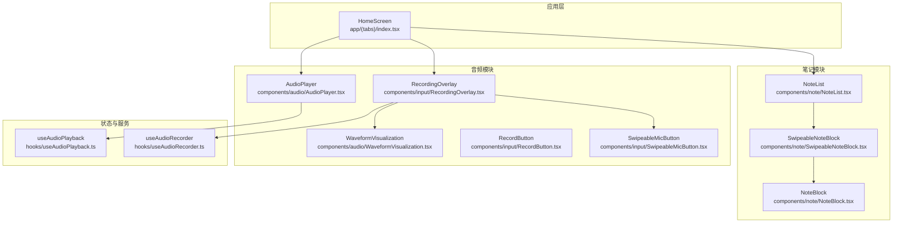
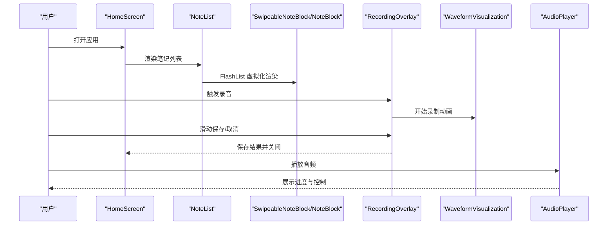
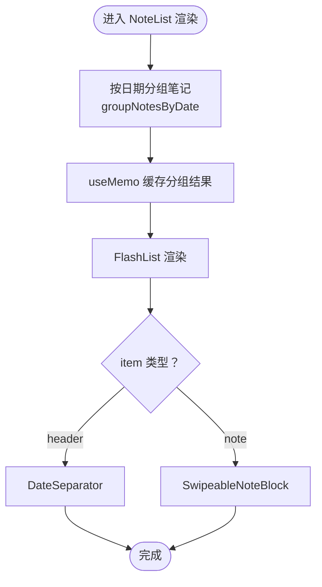
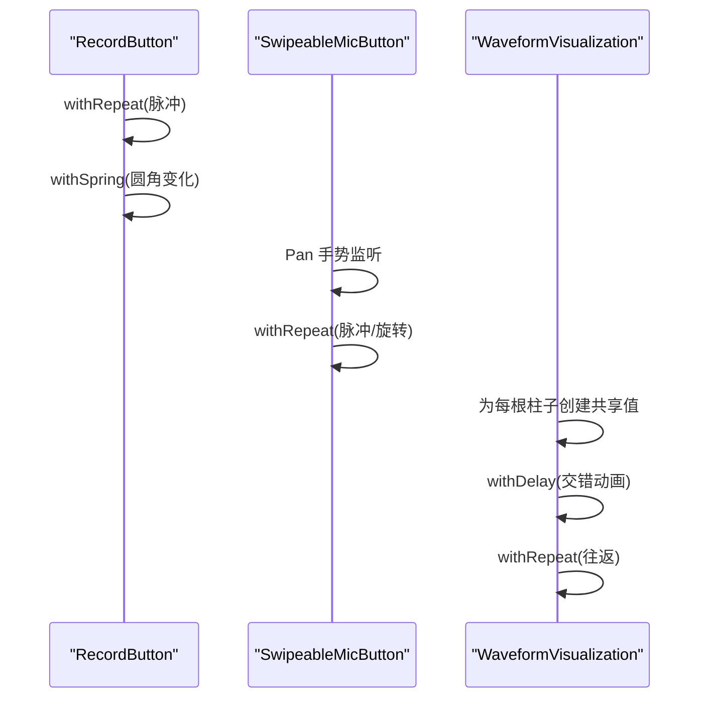
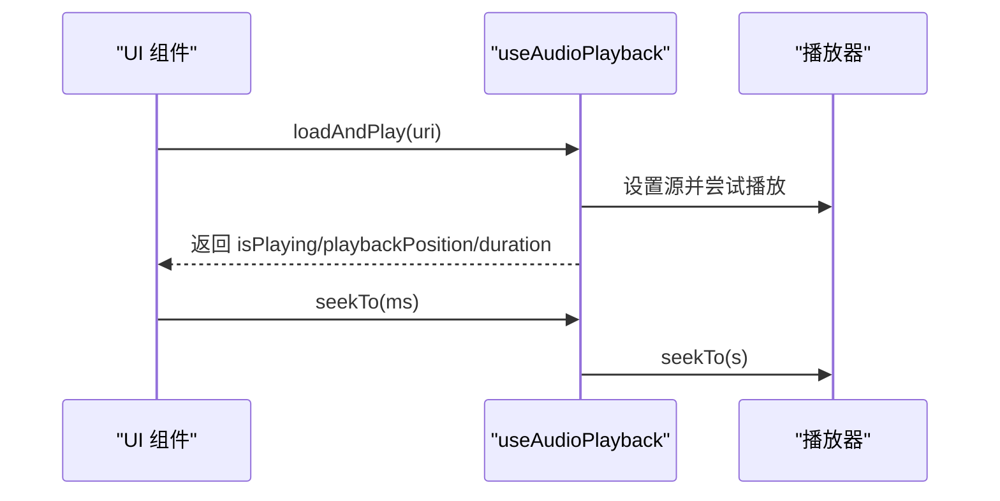
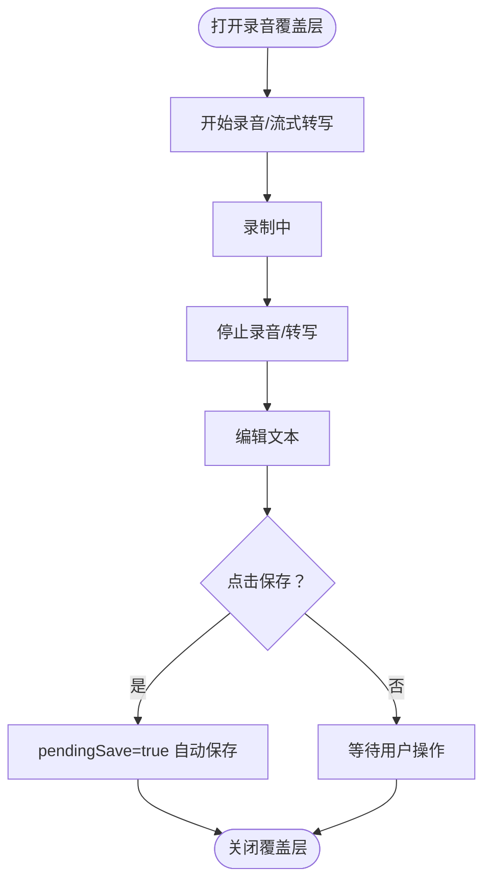
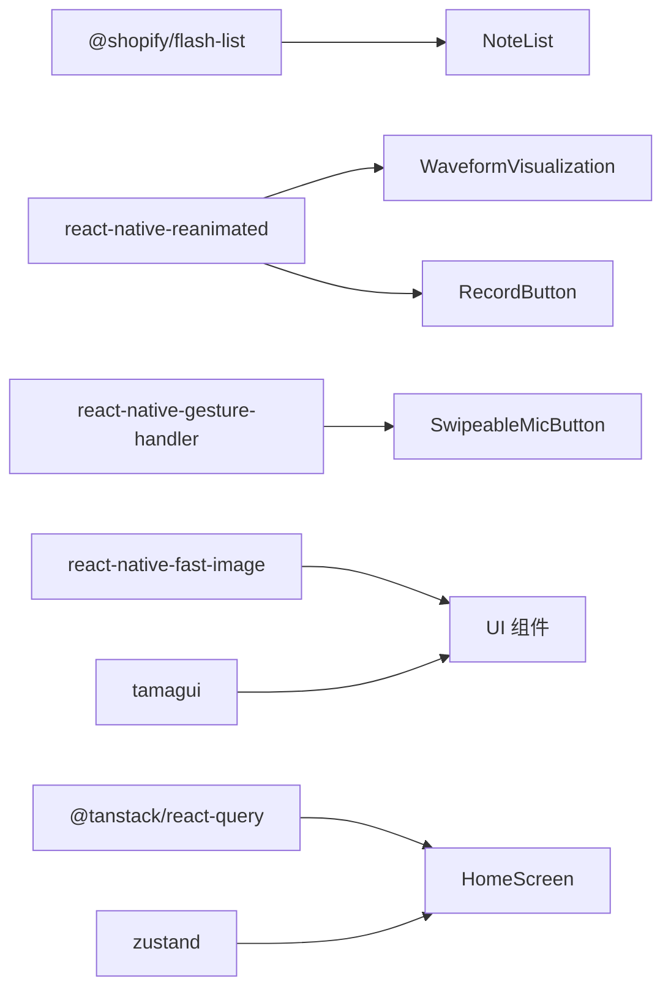

# 渲染性能优化

<cite>
**本文档引用的文件**
- [NoteList.tsx](file://components/note/NoteList.tsx)
- [WaveformVisualization.tsx](file://components/audio/WaveformVisualization.tsx)
- [RecordButton.tsx](file://components/input/RecordButton.tsx)
- [SwipeableMicButton.tsx](file://components/input/SwipeableMicButton.tsx)
- [useAudioPlayback.ts](file://hooks/useAudioPlayback.ts)
- [useAudioRecorder.ts](file://hooks/useAudioRecorder.ts)
- [SwipeableNoteBlock.tsx](file://components/note/SwipeableNoteBlock.tsx)
- [AudioPlayer.tsx](file://components/audio/AudioPlayer.tsx)
- [RecordingOverlay.tsx](file://components/input/RecordingOverlay.tsx)
- [NoteBlock.tsx](file://components/note/NoteBlock.tsx)
- [index.tsx](file://app/(tabs)/index.tsx)
- [package.json](file://package.json)
- [metro.config.js](file://metro.config.js)
</cite>

## 目录
1. [简介](#简介)
2. [项目结构](#项目结构)
3. [核心组件](#核心组件)
4. [架构概览](#架构概览)
5. [详细组件分析](#详细组件分析)
6. [依赖关系分析](#依赖关系分析)
7. [性能考量](#性能考量)
8. [故障排除指南](#故障排除指南)
9. [结论](#结论)

## 简介
本文件针对 VoiceNote 应用中的渲染性能进行系统性优化分析与指导。内容涵盖列表虚拟化、高性能动画组件、音频波形可视化、组件重渲染优化等关键技术点，并结合项目现有实现给出可操作的优化建议与最佳实践。

## 项目结构
VoiceNote 采用基于功能模块的组织方式，音频相关功能集中在 audio 和 input 模块，笔记列表在 note 模块中实现，整体通过 hooks 提供状态管理与业务逻辑。

**图表来源**
- [index.tsx:34-482](file://app/(tabs)/index.tsx#L34-L482)
- [NoteList.tsx:109-205](file://components/note/NoteList.tsx#L109-L205)
- [WaveformVisualization.tsx:32-120](file://components/audio/WaveformVisualization.tsx#L32-L120)
- [useAudioRecorder.ts:26-270](file://hooks/useAudioRecorder.ts#L26-L270)
- [useAudioPlayback.ts:4-90](file://hooks/useAudioPlayback.ts#L4-L90)

**章节来源**
- [index.tsx:34-482](file://app/(tabs)/index.tsx#L34-L482)
- [package.json:20-62](file://package.json#L20-L62)

## 核心组件
- 列表渲染：使用 FlashList 替代原生 FlatList，提升大数据量场景下的滚动性能。
- 音频播放：封装 useAudioPlayback/useAudioRecorder，统一播放/暂停/跳转等操作。
- 波形可视化：基于 react-native-reanimated 的条形图动画，支持录制时随机波动与播放时按音频级别更新高度。
- 录制按钮与滑动按钮：使用 Animated + Gesture Handler 实现流畅的缩放、脉冲、旋转等交互动画。
- 笔记项：NoteBlock 基于 Pressable，配合 SwipeableNoteBlock 提供侧滑动作。

**章节来源**
- [NoteList.tsx:185-202](file://components/note/NoteList.tsx#L185-L202)
- [useAudioPlayback.ts:4-90](file://hooks/useAudioPlayback.ts#L4-L90)
- [useAudioRecorder.ts:26-270](file://hooks/useAudioRecorder.ts#L26-L270)
- [WaveformVisualization.tsx:32-120](file://components/audio/WaveformVisualization.tsx#L32-L120)
- [RecordButton.tsx:49-131](file://components/input/RecordButton.tsx#L49-L131)
- [SwipeableMicButton.tsx:27-149](file://components/input/SwipeableMicButton.tsx#L27-L149)
- [NoteBlock.tsx:31-117](file://components/note/NoteBlock.tsx#L31-L117)

## 架构概览
VoiceNote 的渲染路径以 HomeScreen 为入口，根据视图类型切换笔记列表或灵感视图；笔记列表内部通过 FlashList 虚拟化渲染，每个列表项由 SwipeableNoteBlock 包裹 NoteBlock；录音流程通过 RecordingOverlay 控制，集成滑动保存/取消、实时波形显示与手势交互；音频播放通过 AudioPlayer 与 useAudioPlayback 协作完成。

**图表来源**
- [index.tsx:318-353](file://app/(tabs)/index.tsx#L318-L353)
- [NoteList.tsx:185-202](file://components/note/NoteList.tsx#L185-L202)
- [RecordingOverlay.tsx:75-419](file://components/input/RecordingOverlay.tsx#L75-L419)
- [WaveformVisualization.tsx:32-120](file://components/audio/WaveformVisualization.tsx#L32-L120)
- [AudioPlayer.tsx:15-132](file://components/audio/AudioPlayer.tsx#L15-L132)

## 详细组件分析

### 列表虚拟化与渲染优化（FlashList）
- 使用 FlashList 替代 FlatList，显著降低大列表滚动时的内存占用与掉帧风险。
- keyExtractor 为 header 与 note 分别生成稳定键值，避免重复渲染。
- 使用 useMemo 对分组数据进行缓存，减少不必要的重组。
- 在渲染函数中区分 header 与 note，分别返回对应组件，避免无谓的样式计算。

**图表来源**
- [NoteList.tsx:80-97](file://components/note/NoteList.tsx#L80-L97)
- [NoteList.tsx:123-124](file://components/note/NoteList.tsx#L123-L124)
- [NoteList.tsx:159-181](file://components/note/NoteList.tsx#L159-L181)
- [NoteList.tsx:188-192](file://components/note/NoteList.tsx#L188-L192)

**章节来源**
- [NoteList.tsx:109-205](file://components/note/NoteList.tsx#L109-L205)

### 高性能动画组件（Reanimated + Gesture Handler）
- 录制按钮：使用 Animated.createAnimatedComponent 将 Pressable 动画化，结合 withRepeat/withTiming/withSpring 实现缩放、脉冲与圆角变化。
- 滑动麦克风按钮：组合 Pan + Tap 手势，使用 withRepeat/withTiming 控制脉冲与旋转，runOnJS 触发回调，避免 JS 线程阻塞。
- 波形可视化：为每个条形创建独立 useSharedValue，使用 withDelay 交错启动动画，withRepeat 实现无限循环，withTiming 平滑过渡。

**图表来源**
- [RecordButton.tsx:49-131](file://components/input/RecordButton.tsx#L49-L131)
- [SwipeableMicButton.tsx:27-149](file://components/input/SwipeableMicButton.tsx#L27-L149)
- [WaveformVisualization.tsx:32-120](file://components/audio/WaveformVisualization.tsx#L32-L120)

**章节来源**
- [RecordButton.tsx:49-131](file://components/input/RecordButton.tsx#L49-L131)
- [SwipeableMicButton.tsx:27-149](file://components/input/SwipeableMicButton.tsx#L27-L149)
- [WaveformVisualization.tsx:32-120](file://components/audio/WaveformVisualization.tsx#L32-L120)

### 音频播放与状态管理
- useAudioPlayback：封装加载、播放、暂停、停止、跳转等操作，自动处理加载完成后自动播放。
- useAudioRecorder：提供录音权限请求、开始/暂停/恢复/停止/取消录音，以及播放控制；通过定时器轮询播放状态，确保 UI 与播放器同步。

**图表来源**
- [useAudioPlayback.ts:4-90](file://hooks/useAudioPlayback.ts#L4-L90)
- [useAudioRecorder.ts:26-270](file://hooks/useAudioRecorder.ts#L26-L270)

**章节来源**
- [useAudioPlayback.ts:4-90](file://hooks/useAudioPlayback.ts#L4-L90)
- [useAudioRecorder.ts:26-270](file://hooks/useAudioRecorder.ts#L26-L270)

### 录音覆盖层与交互流
- RecordingOverlay 负责录音/转写/编辑/保存全流程，使用手势控制滑动按钮位置与反馈，结合波形可视化提供听觉反馈。
- 通过 useRef 存储 pendingSave 状态，在录音结束后自动触发保存流程。

**图表来源**
- [RecordingOverlay.tsx:75-419](file://components/input/RecordingOverlay.tsx#L75-L419)

**章节来源**
- [RecordingOverlay.tsx:75-419](file://components/input/RecordingOverlay.tsx#L75-L419)

### 组件重渲染分析与优化建议
- 当前实现已使用 useMemo/useCallback 缓存分组数据与回调函数，有效减少重渲染。
- 建议进一步对渲染函数内的闭包进行稳定化处理，确保 renderItem 不会因外部 props 变化而重新创建。
- 对于频繁更新的状态（如播放进度），建议拆分为独立组件并通过 key 或 memo 包裹，避免父级状态变更导致整行重绘。

**章节来源**
- [NoteList.tsx:123-124](file://components/note/NoteList.tsx#L123-L124)
- [NoteList.tsx:159-181](file://components/note/NoteList.tsx#L159-L181)

## 依赖关系分析
- 性能相关依赖：@shopify/flash-list、react-native-reanimated、react-native-gesture-handler、react-native-fast-image。
- 状态与查询：@tanstack/react-query、zustand。
- UI 框架：tamagui。

**图表来源**
- [package.json:20-62](file://package.json#L20-L62)
- [index.tsx:34-482](file://app/(tabs)/index.tsx#L34-L482)

**章节来源**
- [package.json:20-62](file://package.json#L20-L62)

## 性能考量
- 列表渲染
  - 已采用 FlashList，建议在数据量较大时启用 getItemLayout 以进一步提升首屏渲染速度。
  - keyExtractor 必须保证唯一且稳定，避免列表项错位与重排。
- 动画性能
  - 使用 Reanimated 的工作线程特性，避免在 JS 线程执行耗时逻辑。
  - 合理设置动画时长与缓动函数，避免过度复杂的贝塞尔曲线导致主线程压力。
- 音频与波形
  - 波形动画应限制条数与刷新频率，避免过多共享值造成内存压力。
  - 播放进度轮询建议使用节流策略，减少高频 setState。
- 图像与资源
  - 使用 react-native-fast-image 加速图片加载与缓存。
  - 对大图或视频预览采用懒加载与尺寸裁剪，避免一次性加载过多资源。

[本节为通用性能指导，不直接分析具体文件，故无章节来源]

## 故障排除指南
- 列表闪烁或卡顿
  - 检查 keyExtractor 是否稳定，确认 renderItem 中未创建新的对象/函数。
  - 确认分组数据已通过 useMemo 缓存。
- 动画卡顿
  - 确保动画值仅在必要时更新，避免在每次渲染中创建新的动画配置。
  - 减少同时运行的动画数量，优先保证关键动画流畅。
- 播放异常
  - 检查 useAudioPlayback 的加载状态与错误日志，确认源地址有效。
  - 避免在播放器未就绪时频繁调用 seekTo/play/pause。
- 录音/转写失败
  - 确认录音权限已授予，iOS 需要设置音频模式允许录音。
  - 流式转写时注意网络状态与服务端响应时间，添加超时与重试机制。

**章节来源**
- [useAudioPlayback.ts:4-90](file://hooks/useAudioPlayback.ts#L4-L90)
- [useAudioRecorder.ts:74-109](file://hooks/useAudioRecorder.ts#L74-L109)
- [RecordingOverlay.tsx:161-222](file://components/input/RecordingOverlay.tsx#L161-L222)

## 结论
VoiceNote 已在关键渲染路径上采用 FlashList、Reanimated、Gesture Handler 等高性能方案，配合 useMemo/useCallback 等 React 优化手段，整体具备良好的性能基础。后续可在以下方面持续优化：列表首屏布局、动画并发控制、音频状态轮询节流、资源懒加载与缓存策略，以进一步提升复杂场景下的用户体验。