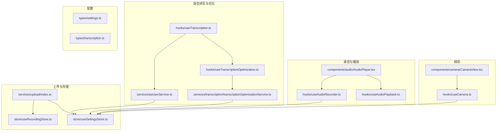
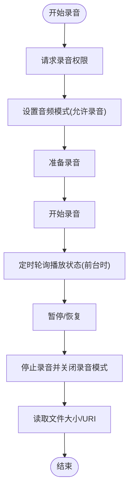
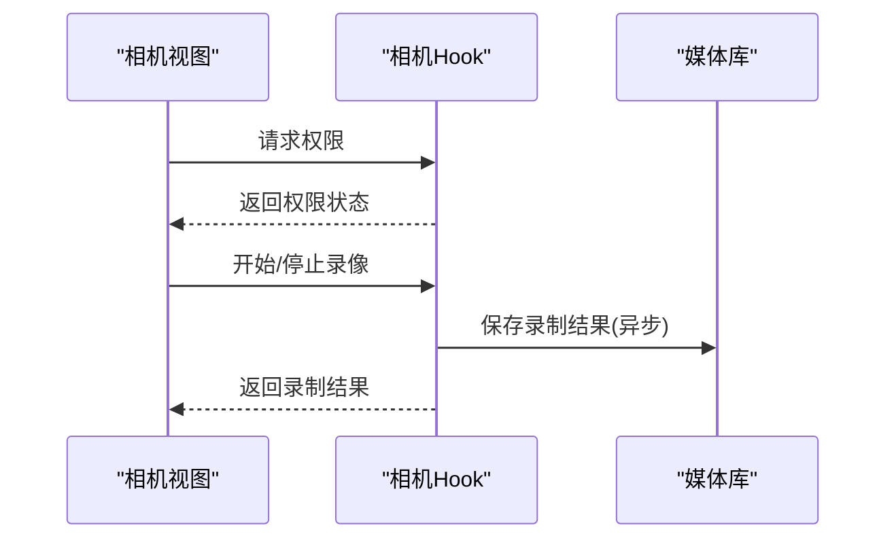
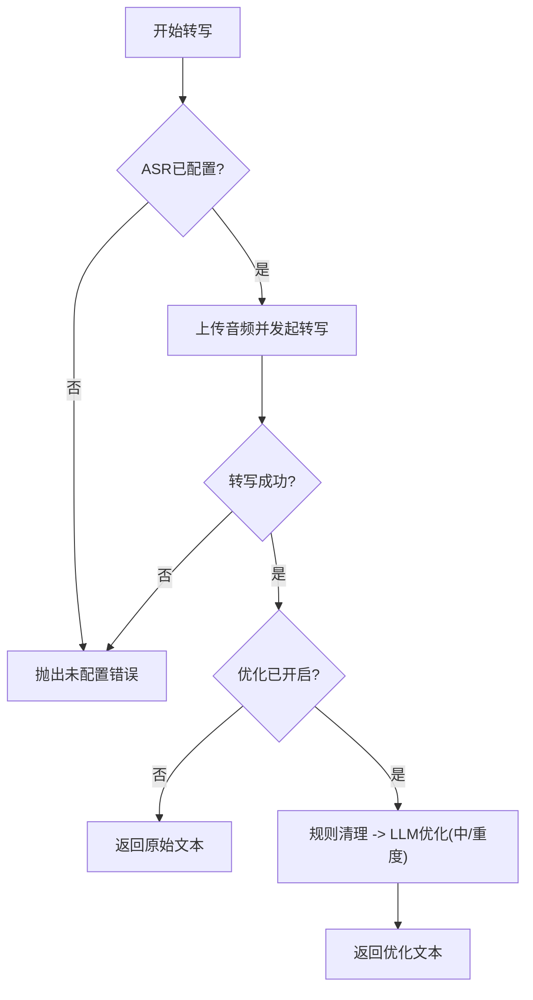
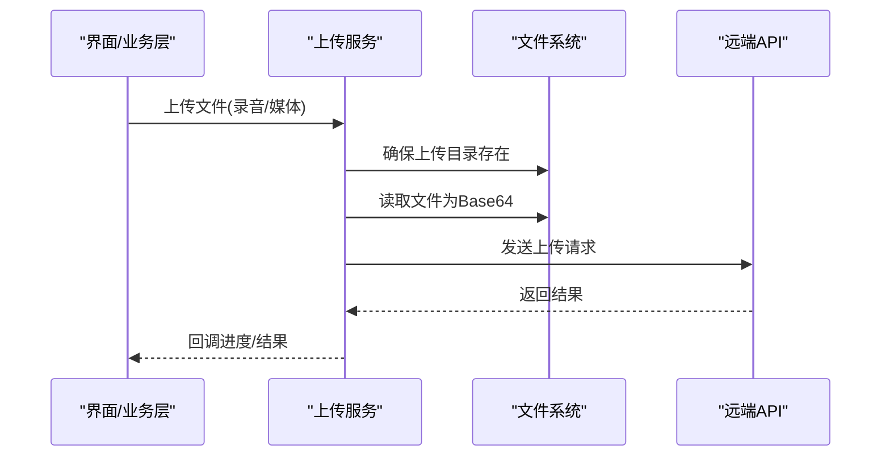
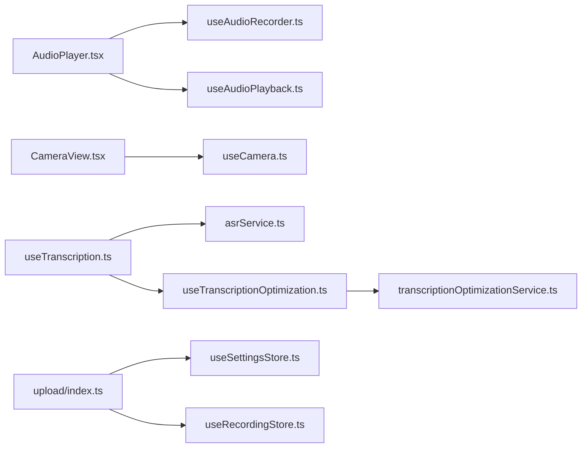

# 电池使用优化

<cite>
**本文引用的文件**
- [hooks/useAudioRecorder.ts](file://hooks/useAudioRecorder.ts)
- [hooks/useAudioPlayback.ts](file://hooks/useAudioPlayback.ts)
- [hooks/useCamera.ts](file://hooks/useCamera.ts)
- [components/audio/AudioPlayer.tsx](file://components/audio/AudioPlayer.tsx)
- [components/camera/CameraView.tsx](file://components/camera/CameraView.tsx)
- [services/asr/asrService.ts](file://services/asr/asrService.ts)
- [services/transcription/transcriptionOptimizationService.ts](file://services/transcription/transcriptionOptimizationService.ts)
- [services/upload/index.ts](file://services/upload/index.ts)
- [store/useRecordingStore.ts](file://store/useRecordingStore.ts)
- [store/useSettingsStore.ts](file://store/useSettingsStore.ts)
- [types/settings.ts](file://types/settings.ts)
- [types/transcription.ts](file://types/transcription.ts)
- [hooks/useTranscription.ts](file://hooks/useTranscription.ts)
- [hooks/useTranscriptionOptimization.ts](file://hooks/useTranscriptionOptimization.ts)
</cite>

## 目录
1. [简介](#简介)
2. [项目结构](#项目结构)
3. [核心组件](#核心组件)
4. [架构总览](#架构总览)
5. [详细组件分析](#详细组件分析)
6. [依赖关系分析](#依赖关系分析)
7. [性能考量](#性能考量)
8. [故障排查指南](#故障排查指南)
9. [结论](#结论)
10. [附录](#附录)

## 简介
本文件聚焦于 VoiceNote 移动应用中的电池使用优化，系统性梳理录音、播放、相机与上传等关键路径的能耗来源，并结合现有代码实现提出可落地的优化策略。内容覆盖：
- 主要能耗来源：CPU（音频/语音识别/文本优化）、GPU（UI 渲染）、网络（云端 ASR/上传）、传感器（相机）
- 针对录音与播放的采样率、编码格式与功耗控制建议
- 相机预览质量与自动对焦优化策略
- 后台任务（上传）的调度与节流
- 电池使用监控与分析工具的使用方法
- 跨平台（Android/iOS）差异与适配
- 用户行为分析与智能省电策略
- 测试方法与性能评估标准

## 项目结构
VoiceNote 的电池相关逻辑主要分布在以下模块：
- 录音与播放：hooks/useAudioRecorder.ts、hooks/useAudioPlayback.ts、components/audio/AudioPlayer.tsx
- 相机：hooks/useCamera.ts、components/camera/CameraView.tsx
- 语音转写与本地优化：services/asr/asrService.ts、services/transcription/transcriptionOptimizationService.ts、hooks/useTranscription.ts、hooks/useTranscriptionOptimization.ts
- 上传与存储：services/upload/index.ts、store/useRecordingStore.ts、store/useSettingsStore.ts
- 设置与配置：types/settings.ts、types/transcription.ts



**图表来源**
- [hooks/useAudioRecorder.ts:1-270](file://hooks/useAudioRecorder.ts#L1-L270)
- [hooks/useAudioPlayback.ts:1-90](file://hooks/useAudioPlayback.ts#L1-L90)
- [components/audio/AudioPlayer.tsx:1-132](file://components/audio/AudioPlayer.tsx#L1-L132)
- [hooks/useCamera.ts:1-115](file://hooks/useCamera.ts#L1-L115)
- [components/camera/CameraView.tsx:1-140](file://components/camera/CameraView.tsx#L1-L140)
- [services/asr/asrService.ts:1-74](file://services/asr/asrService.ts#L1-L74)
- [services/transcription/transcriptionOptimizationService.ts:1-88](file://services/transcription/transcriptionOptimizationService.ts#L1-L88)
- [hooks/useTranscription.ts:38-86](file://hooks/useTranscription.ts#L38-L86)
- [hooks/useTranscriptionOptimization.ts:1-61](file://hooks/useTranscriptionOptimization.ts#L1-L61)
- [services/upload/index.ts:1-130](file://services/upload/index.ts#L1-L130)
- [store/useRecordingStore.ts:1-71](file://store/useRecordingStore.ts#L1-L71)
- [store/useSettingsStore.ts:1-217](file://store/useSettingsStore.ts#L1-L217)
- [types/settings.ts:1-58](file://types/settings.ts#L1-L58)
- [types/transcription.ts:1-14](file://types/transcription.ts#L1-L14)

**章节来源**
- [hooks/useAudioRecorder.ts:1-270](file://hooks/useAudioRecorder.ts#L1-L270)
- [hooks/useCamera.ts:1-115](file://hooks/useCamera.ts#L1-L115)
- [services/asr/asrService.ts:1-74](file://services/asr/asrService.ts#L1-L74)
- [services/transcription/transcriptionOptimizationService.ts:1-88](file://services/transcription/transcriptionOptimizationService.ts#L1-L88)
- [services/upload/index.ts:1-130](file://services/upload/index.ts#L1-L130)
- [store/useSettingsStore.ts:1-217](file://store/useSettingsStore.ts#L1-L217)
- [types/settings.ts:1-58](file://types/settings.ts#L1-L58)
- [types/transcription.ts:1-14](file://types/transcription.ts#L1-L14)

## 核心组件
- 录音与播放 Hook：封装录音状态、权限请求、播放器生命周期与进度更新，支持暂停/恢复/停止/跳转
- 相机 Hook：封装相机权限、拍照/录像、媒体库保存、前置/后置切换
- ASR 服务：云端语音转写，带超时控制与错误处理
- 文本优化服务：规则清理 + LLM 优化，支持轻/中/重三级
- 上传服务：本地文件读取与上传，支持进度回调
- 设置与存储：全局优化开关与级别、录音状态与播放状态持久化

**章节来源**
- [hooks/useAudioRecorder.ts:26-269](file://hooks/useAudioRecorder.ts#L26-L269)
- [hooks/useAudioPlayback.ts:4-89](file://hooks/useAudioPlayback.ts#L4-L89)
- [hooks/useCamera.ts:13-114](file://hooks/useCamera.ts#L13-L114)
- [services/asr/asrService.ts:24-73](file://services/asr/asrService.ts#L24-L73)
- [services/transcription/transcriptionOptimizationService.ts:62-87](file://services/transcription/transcriptionOptimizationService.ts#L62-L87)
- [services/upload/index.ts:29-127](file://services/upload/index.ts#L29-L127)
- [store/useSettingsStore.ts:179-187](file://store/useSettingsStore.ts#L179-L187)
- [store/useRecordingStore.ts:25-71](file://store/useRecordingStore.ts#L25-L71)

## 架构总览
录音/播放、相机、ASR/优化、上传在运行时的交互如下：

```mermaid
sequenceDiagram
participant UI as "界面组件"
participant REC as "录音Hook"
participant PLAY as "播放Hook"
participant ASR as "ASR服务"
participant OPT as "优化服务"
participant UP as "上传服务"
UI->>REC : 开始/暂停/恢复/停止录音
REC-->>UI : 更新录音状态/时长/URI
UI->>PLAY : 加载/播放/暂停/停止
PLAY-->>UI : 播放状态/进度
UI->>ASR : 上传录音并发起转写
ASR-->>UI : 返回转写结果或错误
UI->>OPT : 对原始转写进行优化
OPT-->>UI : 返回清理/优化后的文本
UI->>UP : 上传录音/媒体文件
UP-->>UI : 返回上传结果/进度
```

**图表来源**
- [components/audio/AudioPlayer.tsx:15-131](file://components/audio/AudioPlayer.tsx#L15-L131)
- [hooks/useAudioRecorder.ts:79-175](file://hooks/useAudioRecorder.ts#L79-L175)
- [hooks/useAudioPlayback.ts:27-88](file://hooks/useAudioPlayback.ts#L27-L88)
- [services/asr/asrService.ts:24-73](file://services/asr/asrService.ts#L24-L73)
- [services/transcription/transcriptionOptimizationService.ts:62-87](file://services/transcription/transcriptionOptimizationService.ts#L62-L87)
- [services/upload/index.ts:29-84](file://services/upload/index.ts#L29-L84)

## 详细组件分析

### 录音与播放：电池优化要点
- 录音模式切换：iOS 在录音时启用特定音频模式以保证录音与播放互不干扰；停止录音后及时关闭录音模式，避免后台持续占用
- 实时状态更新：通过定时轮询获取播放进度，建议在非前台或无播放需求时降低轮询频率或停止轮询
- 文件大小统计：录音结束后读取文件信息用于后续上传与展示，避免重复 IO



**图表来源**
- [hooks/useAudioRecorder.ts:79-175](file://hooks/useAudioRecorder.ts#L79-L175)
- [hooks/useAudioPlayback.ts:11-21](file://hooks/useAudioPlayback.ts#L11-L21)

**章节来源**
- [hooks/useAudioRecorder.ts:74-109](file://hooks/useAudioRecorder.ts#L74-L109)
- [hooks/useAudioRecorder.ts:135-175](file://hooks/useAudioRecorder.ts#L135-L175)
- [hooks/useAudioPlayback.ts:11-21](file://hooks/useAudioPlayback.ts#L11-L21)

### 相机：电池优化要点
- 权限管理：分别请求相机与相册权限，失败时提前返回，避免无效调用
- 录像时长限制：默认最大时长限制，防止长时间高负载录制
- 媒体保存：录制完成后异步保存至相册，减少 UI 卡顿
- 预览质量：拍照参数包含质量与处理选项，可在低电量场景下调低质量参数



**图表来源**
- [hooks/useCamera.ts:92-114](file://hooks/useCamera.ts#L92-L114)
- [hooks/useCamera.ts:59-90](file://hooks/useCamera.ts#L59-L90)
- [components/camera/CameraView.tsx:32-45](file://components/camera/CameraView.tsx#L32-L45)

**章节来源**
- [hooks/useCamera.ts:26-57](file://hooks/useCamera.ts#L26-L57)
- [hooks/useCamera.ts:59-90](file://hooks/useCamera.ts#L59-L90)
- [components/camera/CameraView.tsx:47-78](file://components/camera/CameraView.tsx#L47-L78)

### 语音转写与文本优化：电池优化要点
- ASR 超时控制：统一超时时间，避免长时间网络等待导致 CPU/GPU 持续占用
- 本地优化降级：当 LLM 未配置或失败时回退到规则清理，减少额外开销
- 自动优化：根据设置自动触发优化流程，避免用户手动操作带来的误触与耗电



**图表来源**
- [services/asr/asrService.ts:24-73](file://services/asr/asrService.ts#L24-L73)
- [hooks/useTranscription.ts:38-65](file://hooks/useTranscription.ts#L38-L65)
- [services/transcription/transcriptionOptimizationService.ts:62-87](file://services/transcription/transcriptionOptimizationService.ts#L62-L87)

**章节来源**
- [services/asr/asrService.ts:5,42-43](file://services/asr/asrService.ts#L5,L42-L43)
- [hooks/useTranscription.ts:38-65](file://hooks/useTranscription.ts#L38-L65)
- [services/transcription/transcriptionOptimizationService.ts:7,41-42](file://services/transcription/transcriptionOptimizationService.ts#L7,L41-L42)

### 上传：电池优化要点
- 本地目录确保：上传前检查并创建上传目录，避免频繁 IO 失败
- Base64 读取：按需读取文件为 Base64，注意内存与 CPU 占用
- 进度回调：支持单文件与多文件上传进度回调，便于 UI 与节流策略
- 类型判断：根据扩展名映射 MIME 类型，减少错误请求



**图表来源**
- [services/upload/index.ts:22-66](file://services/upload/index.ts#L22-L66)
- [services/upload/index.ts:86-111](file://services/upload/index.ts#L86-L111)

**章节来源**
- [services/upload/index.ts:22-66](file://services/upload/index.ts#L22-L66)
- [services/upload/index.ts:113-127](file://services/upload/index.ts#L113-L127)

## 依赖关系分析
- 组件与 Hook：界面组件通过 Hook 管理状态与副作用，降低耦合
- 服务层：ASR/优化/上传服务独立封装，便于替换与测试
- 存储层：Zustand 状态管理，设置持久化，避免重复初始化
- 配置类型：集中定义 ASR/优化等配置结构，便于跨模块共享



**图表来源**
- [components/audio/AudioPlayer.tsx:15-28](file://components/audio/AudioPlayer.tsx#L15-L28)
- [hooks/useAudioRecorder.ts:26-46](file://hooks/useAudioRecorder.ts#L26-L46)
- [hooks/useAudioPlayback.ts:4-9](file://hooks/useAudioPlayback.ts#L4-L9)
- [components/camera/CameraView.tsx:18-30](file://components/camera/CameraView.tsx#L18-L30)
- [hooks/useCamera.ts:13-20](file://hooks/useCamera.ts#L13-L20)
- [hooks/useTranscription.ts:38-65](file://hooks/useTranscription.ts#L38-L65)
- [services/asr/asrService.ts:24-73](file://services/asr/asrService.ts#L24-L73)
- [hooks/useTranscriptionOptimization.ts:15-43](file://hooks/useTranscriptionOptimization.ts#L15-L43)
- [services/transcription/transcriptionOptimizationService.ts:62-87](file://services/transcription/transcriptionOptimizationService.ts#L62-L87)
- [services/upload/index.ts:29-66](file://services/upload/index.ts#L29-L66)
- [store/useSettingsStore.ts:179-187](file://store/useSettingsStore.ts#L179-L187)
- [store/useRecordingStore.ts:25-71](file://store/useRecordingStore.ts#L25-L71)

**章节来源**
- [store/useSettingsStore.ts:179-187](file://store/useSettingsStore.ts#L179-L187)
- [store/useRecordingStore.ts:25-71](file://store/useRecordingStore.ts#L25-L71)

## 性能考量
- CPU 优化
  - 录音/播放：仅在前台且有需要时轮询播放状态，避免常驻定时器
  - ASR/优化：设置合理超时，失败快速回退，避免长时间占用线程
  - 上传：按需读取文件，避免大文件多次 IO
- GPU 优化
  - 相机预览：在低电量模式下降低预览质量与帧率
  - UI：减少复杂动画与高频重绘，使用合适的布局与样式
- 网络优化
  - 上传：支持断点续传与分片（如需），合并请求，压缩传输
  - ASR：优先本地模型（若资源允许），减少云端往返
- 传感器优化
  - 相机：在后台或非使用场景释放相机资源，避免常驻预览
  - 陀螺仪/加速度计：仅在必要时启用，及时释放

[本节为通用指导，无需具体文件来源]

## 故障排查指南
- 录音权限被拒
  - 现象：无法开始录音
  - 排查：确认权限请求与状态判断逻辑
  - 参考
    - [hooks/useAudioRecorder.ts:74-77](file://hooks/useAudioRecorder.ts#L74-L77)
    - [hooks/useCamera.ts:92-96](file://hooks/useCamera.ts#L92-L96)
- 录音模式未关闭
  - 现象：播放异常或后台持续占用
  - 排查：停止录音后是否调用关闭录音模式
  - 参考
    - [hooks/useAudioRecorder.ts:140-143](file://hooks/useAudioRecorder.ts#L140-L143)
- 播放状态不同步
  - 现象：进度条不动或错位
  - 排查：轮询频率与播放器状态一致性
  - 参考
    - [hooks/useAudioPlayback.ts:11-21](file://hooks/useAudioPlayback.ts#L11-L21)
- ASR 超时或失败
  - 现象：转写长时间无响应或报错
  - 排查：超时控制与错误分支处理
  - 参考
    - [services/asr/asrService.ts:42-43](file://services/asr/asrService.ts#L42-L43)
    - [services/asr/asrService.ts:66-72](file://services/asr/asrService.ts#L66-L72)
- 上传失败或卡顿
  - 现象：上传进度停滞
  - 排查：文件是否存在、Base64 读取、网络状态
  - 参考
    - [services/upload/index.ts:37-45](file://services/upload/index.ts#L37-L45)
    - [services/upload/index.ts:55-65](file://services/upload/index.ts#L55-L65)

**章节来源**
- [hooks/useAudioRecorder.ts:74-77](file://hooks/useAudioRecorder.ts#L74-L77)
- [hooks/useAudioRecorder.ts:140-143](file://hooks/useAudioRecorder.ts#L140-L143)
- [hooks/useAudioPlayback.ts:11-21](file://hooks/useAudioPlayback.ts#L11-L21)
- [services/asr/asrService.ts:42-43](file://services/asr/asrService.ts#L42-L43)
- [services/asr/asrService.ts:66-72](file://services/asr/asrService.ts#L66-L72)
- [services/upload/index.ts:37-45](file://services/upload/index.ts#L37-L45)
- [services/upload/index.ts:55-65](file://services/upload/index.ts#L55-L65)

## 结论
VoiceNote 已在录音/播放、相机、ASR/优化与上传等关键路径实现了基础的电池优化实践，包括权限管理、超时控制、状态轮询与资源释放。为进一步提升续航表现，建议在低电量场景下引入更细粒度的动态降级策略（如采样率/码率/分辨率自适应、后台任务节流、智能唤醒），并完善电池监控与用户行为分析，以实现“感知-决策-执行”的闭环省电。

[本节为总结，无需具体文件来源]

## 附录

### 电池使用监控与分析工具
- Android
  - Battery Historian：收集与可视化电池使用数据
  - Systrace/Perfetto：追踪 CPU/GPU/IO 消耗
  - ADB Shell：dumpsys battery、dumpsys power 等命令
- iOS
  - Instruments：Energy Log、GPU Frame Capture
  - Xcode Allocations/Leaks：内存与泄漏检测
- React Native
  - Flipper：网络、性能面板
  - Metro 性能 Timeline：JS 执行耗时

[本节为通用指导，无需具体文件来源]

### 不同平台的电池优化差异与适配
- Android
  - 后台任务：利用 WorkManager/JobScheduler，避免常驻前台服务
  - 线程池：限制并发，避免过度唤醒
  - 传感器：在后台降低采样频率
- iOS
  - 会话管理：录音/相机使用结束后立即释放
  - 后台模式：严格遵循后台执行限制
  - 通知与静默播放：合理配置音频会话

[本节为通用指导，无需具体文件来源]

### 用户行为分析与智能省电策略
- 行为建模：记录录音时长、上传频次、优化偏好
- 动态策略：基于设备电量、网络状态、任务队列长度自适应调整采样率/码率/分辨率
- 任务调度：将上传合并、延迟非关键任务，避免与录音/播放冲突

[本节为通用指导，无需具体文件来源]

### 测试方法与评估标准
- 测试方法
  - 电量测试：固定场景下对比优化前后的耗电曲线
  - 压力测试：高并发上传、长时间录音/播放、弱网环境
  - A/B 实验：开启/关闭优化策略的对照组
- 评估指标
  - 电池消耗（mAh）、发热（温度变化）、帧率稳定性（FPS）
  - 功能可用性：转写准确率、上传成功率、UI 响应时间

[本节为通用指导，无需具体文件来源]