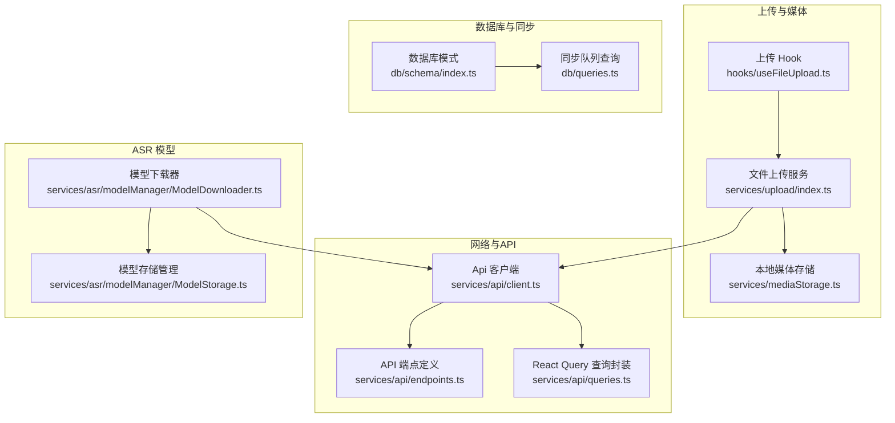
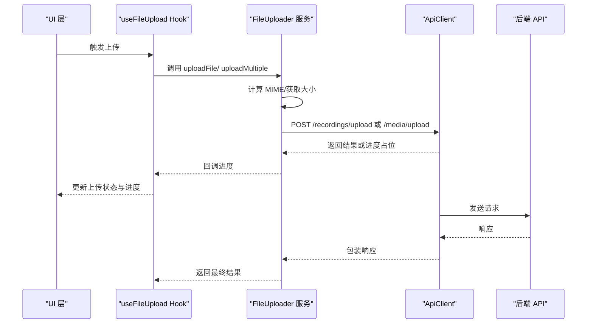
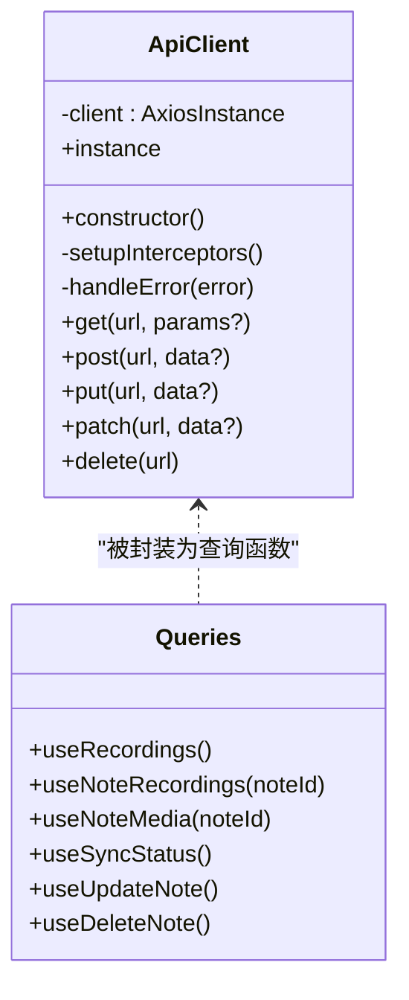
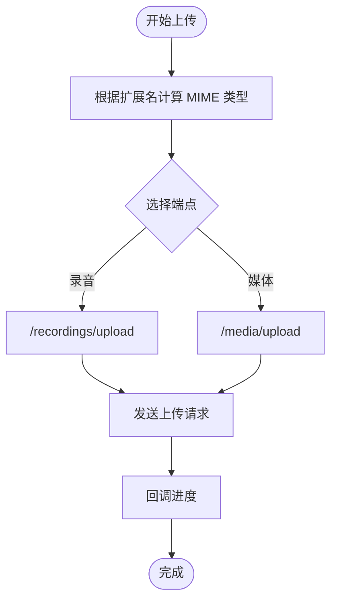
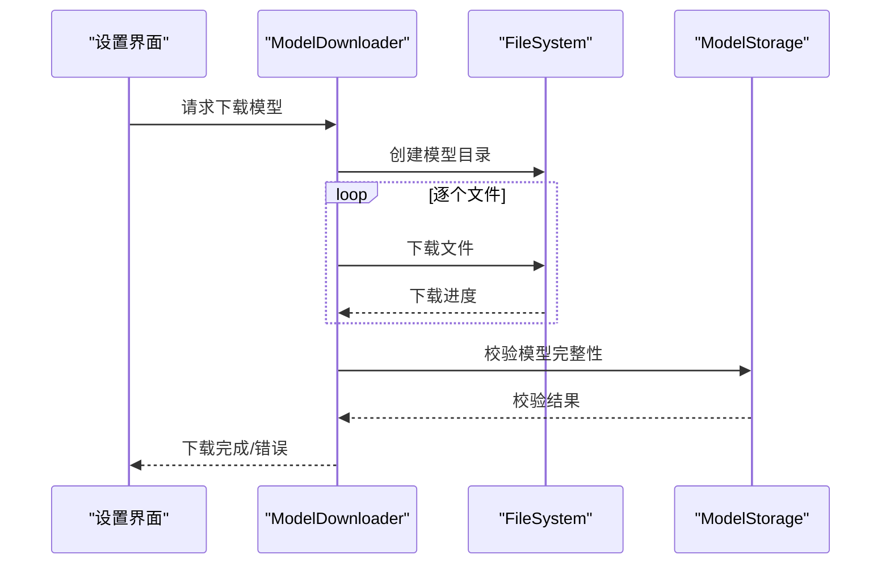
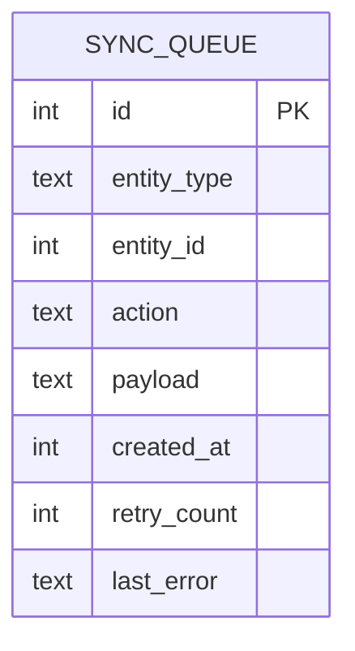
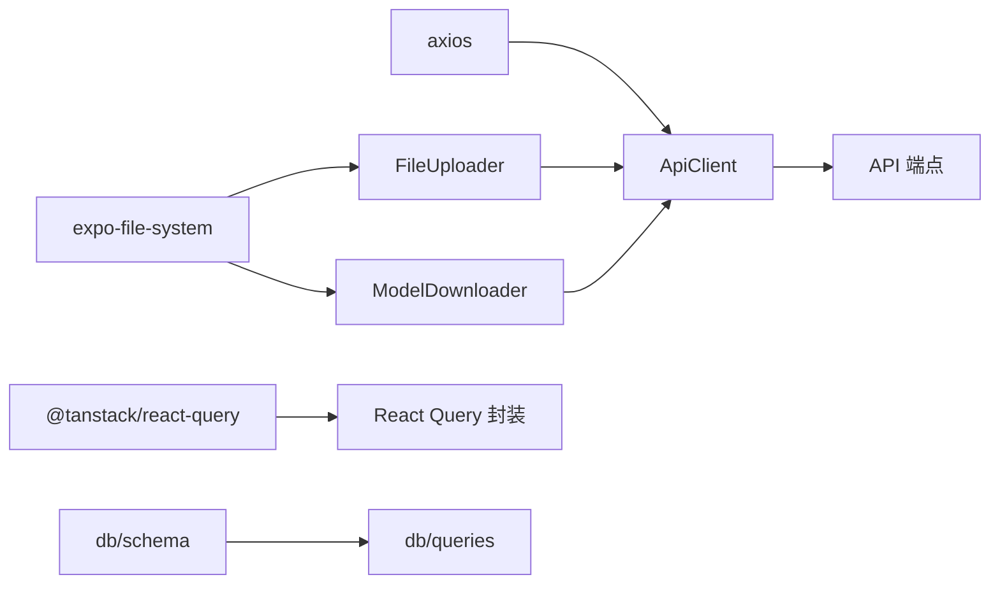

# 网络请求优化

<cite>
**本文引用的文件**
- [services/api/client.ts](file://services/api/client.ts)
- [services/api/endpoints.ts](file://services/api/endpoints.ts)
- [services/api/queries.ts](file://services/api/queries.ts)
- [services/upload/index.ts](file://services/upload/index.ts)
- [hooks/useFileUpload.ts](file://hooks/useFileUpload.ts)
- [services/mediaStorage.ts](file://services/mediaStorage.ts)
- [services/asr/modelManager/ModelDownloader.ts](file://services/asr/modelManager/ModelDownloader.ts)
- [services/asr/modelManager/ModelStorage.ts](file://services/asr/modelManager/ModelStorage.ts)
- [db/schema/index.ts](file://db/schema/index.ts)
- [db/queries.ts](file://db/queries.ts)
- [package.json](file://package.json)
</cite>

## 目录
1. [简介](#简介)
2. [项目结构](#项目结构)
3. [核心组件](#核心组件)
4. [架构总览](#架构总览)
5. [详细组件分析](#详细组件分析)
6. [依赖关系分析](#依赖关系分析)
7. [性能考量](#性能考量)
8. [故障排查指南](#故障排查指南)
9. [结论](#结论)
10. [附录](#附录)

## 简介
本文件聚焦 VoiceNote 的网络请求优化，系统性梳理并提出可落地的优化策略与实现方案，覆盖以下关键领域：
- 请求合并、去重与缓存
- 音频文件上传优化（断点续传、分片上传、压缩传输）
- ASR 模型下载优化（增量更新、后台下载）
- API 请求超时与重试机制
- 网络状态监听与弱网适配
- HTTP/2 与 HTTP/3 在移动端的应用优势
- 网络请求监控与性能分析
- 离线优先策略与数据同步优化

## 项目结构
围绕网络优化的相关模块主要分布在以下目录：
- API 客户端与查询：services/api
- 文件上传：services/upload
- 媒体存储：services/mediaStorage
- ASR 模型管理：services/asr/modelManager
- 数据库与同步队列：db/schema 与 db/queries
- 组件层上传 Hook：hooks/useFileUpload

图表来源
- [services/api/client.ts:1-104](file://services/api/client.ts#L1-L104)
- [services/api/endpoints.ts:1-61](file://services/api/endpoints.ts#L1-L61)
- [services/api/queries.ts:46-99](file://services/api/queries.ts#L46-L99)
- [services/upload/index.ts:50-129](file://services/upload/index.ts#L50-L129)
- [hooks/useFileUpload.ts:1-123](file://hooks/useFileUpload.ts#L1-L123)
- [services/mediaStorage.ts:1-123](file://services/mediaStorage.ts#L1-L123)
- [services/asr/modelManager/ModelDownloader.ts:1-207](file://services/asr/modelManager/ModelDownloader.ts#L1-L207)
- [services/asr/modelManager/ModelStorage.ts:1-186](file://services/asr/modelManager/ModelStorage.ts#L1-L186)
- [db/schema/index.ts:29-61](file://db/schema/index.ts#L29-L61)
- [db/queries.ts:135-185](file://db/queries.ts#L135-L185)

章节来源
- [services/api/client.ts:1-104](file://services/api/client.ts#L1-L104)
- [services/api/endpoints.ts:1-61](file://services/api/endpoints.ts#L1-L61)
- [services/api/queries.ts:46-99](file://services/api/queries.ts#L46-L99)
- [services/upload/index.ts:50-129](file://services/upload/index.ts#L50-L129)
- [hooks/useFileUpload.ts:1-123](file://hooks/useFileUpload.ts#L1-L123)
- [services/mediaStorage.ts:1-123](file://services/mediaStorage.ts#L1-L123)
- [services/asr/modelManager/ModelDownloader.ts:1-207](file://services/asr/modelManager/ModelDownloader.ts#L1-L207)
- [services/asr/modelManager/ModelStorage.ts:1-186](file://services/asr/modelManager/ModelStorage.ts#L1-L186)
- [db/schema/index.ts:29-61](file://db/schema/index.ts#L29-L61)
- [db/queries.ts:135-185](file://db/queries.ts#L135-L185)

## 核心组件
- API 客户端与拦截器：统一配置基础 URL、超时、请求头，并在响应拦截中处理鉴权错误与通用错误格式化。
- 端点常量：集中管理所有后端接口路径，便于统一维护与替换。
- React Query 封装：对 GET/POST/PATCH/DELETE 进行封装，结合查询键与失效策略，实现缓存与自动刷新。
- 文件上传服务：支持单文件与多文件上传，计算 MIME 类型，提供进度回调；当前未实现断点续传与分片。
- 上传 Hook：将上传状态与进度暴露给 UI，简化调用方逻辑。
- 媒体存储：本地媒体文件的保存、读取、删除与磁盘配额查询，辅助离线优先策略。
- ASR 模型下载器：基于 expo-file-system 实现模型分文件下载与校验，支持下载状态跟踪与取消。
- 同步队列：SQLite 表记录待同步任务、重试次数与最后错误，支撑离线优先与后台重试。

章节来源
- [services/api/client.ts:12-104](file://services/api/client.ts#L12-L104)
- [services/api/endpoints.ts:1-61](file://services/api/endpoints.ts#L1-L61)
- [services/api/queries.ts:46-99](file://services/api/queries.ts#L46-L99)
- [services/upload/index.ts:50-129](file://services/upload/index.ts#L50-L129)
- [hooks/useFileUpload.ts:1-123](file://hooks/useFileUpload.ts#L1-L123)
- [services/mediaStorage.ts:1-123](file://services/mediaStorage.ts#L1-L123)
- [services/asr/modelManager/ModelDownloader.ts:37-165](file://services/asr/modelManager/ModelDownloader.ts#L37-L165)
- [db/schema/index.ts:43-52](file://db/schema/index.ts#L43-L52)
- [db/queries.ts:135-185](file://db/queries.ts#L135-L185)

## 架构总览
下图展示从 UI 到后端的关键网络路径与优化切入点：

图表来源
- [hooks/useFileUpload.ts:21-105](file://hooks/useFileUpload.ts#L21-L105)
- [services/upload/index.ts:50-129](file://services/upload/index.ts#L50-L129)
- [services/api/client.ts:81-99](file://services/api/client.ts#L81-L99)
- [services/api/endpoints.ts:21-37](file://services/api/endpoints.ts#L21-L37)

## 详细组件分析

### API 客户端与查询缓存
- 超时与基础配置：客户端默认超时时间与基础 URL 可在构造函数中统一设置，便于集中调整。
- 请求/响应拦截器：可在请求拦截中注入认证信息；在响应拦截中处理 401 等错误并进行统一错误对象格式化。
- React Query 封装：通过 queryKey 与 queryFn 将 GET 请求纳入缓存体系；Mutation 封装用于写操作，成功后主动失效相关查询以触发重新拉取。

图表来源
- [services/api/client.ts:12-104](file://services/api/client.ts#L12-L104)
- [services/api/queries.ts:46-99](file://services/api/queries.ts#L46-L99)

章节来源
- [services/api/client.ts:12-104](file://services/api/client.ts#L12-L104)
- [services/api/queries.ts:46-99](file://services/api/queries.ts#L46-L99)

### 文件上传服务与进度回调
- 单文件/多文件上传：支持按类型选择端点（录音或媒体），计算 MIME 类型，提供整体进度回调。
- 当前限制：未实现断点续传与分片上传；建议后续引入分块与断点续传能力，结合服务端支持以提升大文件稳定性与效率。
- 与媒体存储协作：上传完成后可将本地文件移动到受控目录，便于后续离线访问与清理。

图表来源
- [services/upload/index.ts:50-129](file://services/upload/index.ts#L50-L129)

章节来源
- [services/upload/index.ts:50-129](file://services/upload/index.ts#L50-L129)
- [hooks/useFileUpload.ts:21-105](file://hooks/useFileUpload.ts#L21-L105)

### ASR 模型下载与后台策略
- 分文件下载：将压缩包拆分为多个独立文件逐一下载，避免单次大体积请求带来的失败风险。
- 下载状态跟踪：使用内存映射记录活动下载的状态与进度，支持取消与清理。
- 校验与容错：下载完成后验证必要文件是否存在，失败则回滚并清理部分文件。
- 后台下载建议：结合应用生命周期与系统空闲时段调度下载，避免前台交互卡顿；可与同步队列联动，实现“先本地可用再云端同步”。

图表来源
- [services/asr/modelManager/ModelDownloader.ts:37-165](file://services/asr/modelManager/ModelDownloader.ts#L37-L165)
- [services/asr/modelManager/ModelStorage.ts:68-131](file://services/asr/modelManager/ModelStorage.ts#L68-L131)

章节来源
- [services/asr/modelManager/ModelDownloader.ts:37-165](file://services/asr/modelManager/ModelDownloader.ts#L37-L165)
- [services/asr/modelManager/ModelStorage.ts:68-131](file://services/asr/modelManager/ModelStorage.ts#L68-L131)

### 同步队列与离线优先策略
- 数据库表结构：包含实体类型、实体 ID、动作、负载、创建时间、重试次数与最后错误等字段。
- 查询接口：提供获取待同步项、加入队列、标记成功与失败（含重试计数递增）等操作。
- 离线优先：在网络不可用或弱网时，将变更写入本地队列；在网络恢复后批量推送，减少重复请求与冲突。

图表来源
- [db/schema/index.ts:43-52](file://db/schema/index.ts#L43-L52)
- [db/queries.ts:135-185](file://db/queries.ts#L135-L185)

章节来源
- [db/schema/index.ts:43-52](file://db/schema/index.ts#L43-L52)
- [db/queries.ts:135-185](file://db/queries.ts#L135-L185)

## 依赖关系分析
- 外部依赖：axios 提供 HTTP 客户端能力；expo-file-system 支持文件系统与下载；@tanstack/react-query 提供查询缓存与失效。
- 内部耦合：上传服务依赖 API 客户端与端点常量；上传 Hook 依赖上传服务；模型下载器依赖模型存储与端点；同步队列与数据库查询相互配合。

图表来源
- [package.json:20-62](file://package.json#L20-L62)
- [services/api/client.ts:12-104](file://services/api/client.ts#L12-L104)
- [services/upload/index.ts:50-129](file://services/upload/index.ts#L50-L129)
- [services/asr/modelManager/ModelDownloader.ts:1-207](file://services/asr/modelManager/ModelDownloader.ts#L1-L207)
- [db/schema/index.ts:29-61](file://db/schema/index.ts#L29-L61)

章节来源
- [package.json:20-62](file://package.json#L20-L62)
- [services/api/client.ts:12-104](file://services/api/client.ts#L12-L104)
- [services/upload/index.ts:50-129](file://services/upload/index.ts#L50-L129)
- [services/asr/modelManager/ModelDownloader.ts:1-207](file://services/asr/modelManager/ModelDownloader.ts#L1-L207)
- [db/schema/index.ts:29-61](file://db/schema/index.ts#L29-L61)

## 性能考量
- 请求合并与去重
  - 合并：对同一资源的多次读取请求进行合并，避免重复网络往返；可通过查询键去重。
  - 去重：对相同上传任务（基于文件哈希或元数据）进行去重，避免重复上传。
- 缓存机制
  - 读缓存：使用 React Query 的查询缓存与失效策略，减少不必要的网络请求。
  - 写缓存：对上传结果与模型下载结果进行本地缓存标识，提升二次访问速度。
- 上传优化
  - 断点续传：将大文件切分为固定大小的块，记录已上传块，失败后仅续传未完成块。
  - 分片上传：结合服务端分片接口，支持并发上传多个分片并进行校验。
  - 压缩传输：对音频文件采用无损压缩算法（如 FLAC）或更高效的编码参数，降低带宽占用。
- ASR 模型优化
  - 增量更新：仅下载变更的模型文件，结合版本号与校验和判断是否需要更新。
  - 后台下载：在应用空闲时段或 Wi-Fi 条件下下载，避免前台交互影响。
- 超时与重试
  - 超时：针对不同场景设置差异化超时（短链路 10s，上传 60s+）。
  - 退避重试：指数退避或抖动退避，避免雪崩效应；区分可重试与不可重试错误。
- 弱网适配
  - 自适应策略：检测网络类型与质量，动态调整并发度、分片大小与缓存策略。
  - 离线优先：在网络异常时，将变更写入本地队列，恢复后再同步。
- HTTP/2 与 HTTP/3
  - 多路复用：显著降低高并发场景下的连接开销与队头阻塞。
  - 零配置迁移：HTTP/3 在移动端具备更好的握手与拥塞控制特性，可提升弱网体验。
- 监控与分析
  - 指标采集：请求耗时、成功率、失败原因、重试次数、并发度、缓存命中率。
  - 工具建议：集成网络层埋点（如自定义 axios 拦截器统计），结合日志平台与 APM 工具进行可视化分析。

## 故障排查指南
- 常见错误定位
  - 401 未授权：检查响应拦截器中的处理逻辑，确认是否需要刷新令牌或跳转登录。
  - 无服务器响应：超时或网络中断导致，需检查超时配置与网络状态。
  - 上传失败：查看上传 Hook 的错误状态与返回消息，结合后端日志定位具体环节。
- 下载失败处理
  - 校验失败：删除不完整模型目录，重新下载。
  - 进度缺失：当前实现未直接支持进度回调，可考虑引入原生模块或第三方库以获得更精确的进度。
- 同步队列问题
  - 重试过多：检查 last_error 字段与 retry_count，定位具体失败原因并修复。
  - 队列堆积：增加后台同步任务的并发度与优先级，确保及时清理。

章节来源
- [services/api/client.ts:44-75](file://services/api/client.ts#L44-L75)
- [services/asr/modelManager/ModelDownloader.ts:144-165](file://services/asr/modelManager/ModelDownloader.ts#L144-L165)
- [db/queries.ts:156-163](file://db/queries.ts#L156-L163)

## 结论
本项目已具备良好的网络请求基础设施：统一的 API 客户端、端点常量与查询缓存。为进一步提升性能与可靠性，建议在现有基础上逐步引入断点续传、分片上传、压缩传输、增量模型更新与后台下载策略，并完善超时与重试机制、弱网适配与监控分析体系。通过离线优先与同步队列，可有效提升弱网与离线场景下的用户体验。

## 附录
- 术语说明
  - 断点续传：基于分片的断点续传，仅上传未完成分片。
  - 分片上传：将大文件切分为多个小块并行上传，提高吞吐与稳定性。
  - 增量更新：仅下载变更内容，减少带宽与等待时间。
  - 后台下载：在应用空闲或满足条件时执行下载任务。
  - 离线优先：在网络异常时优先本地操作，恢复后再同步。