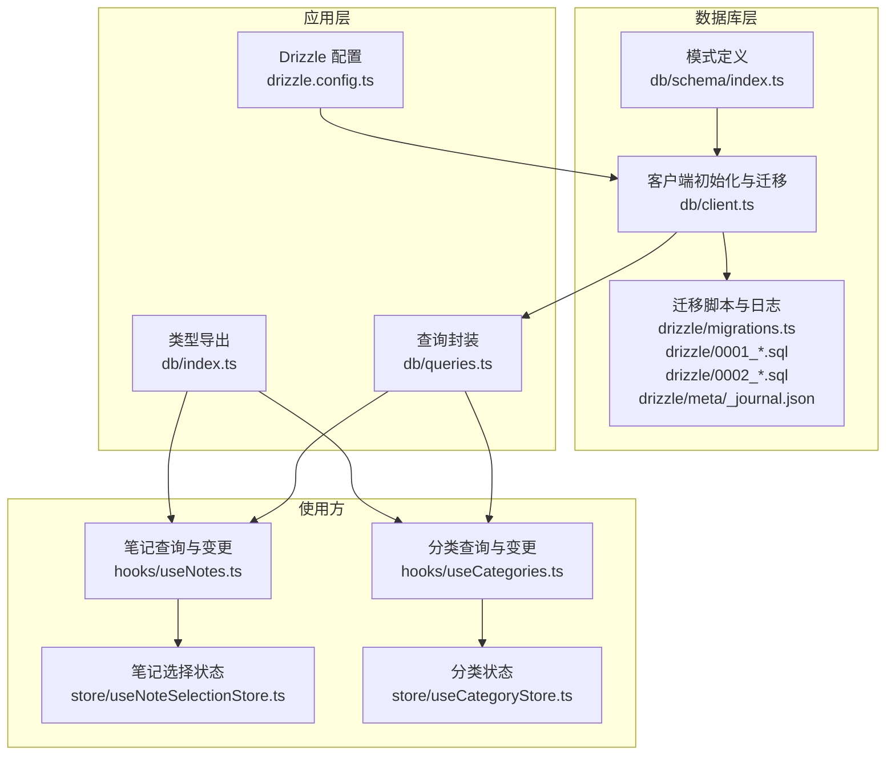
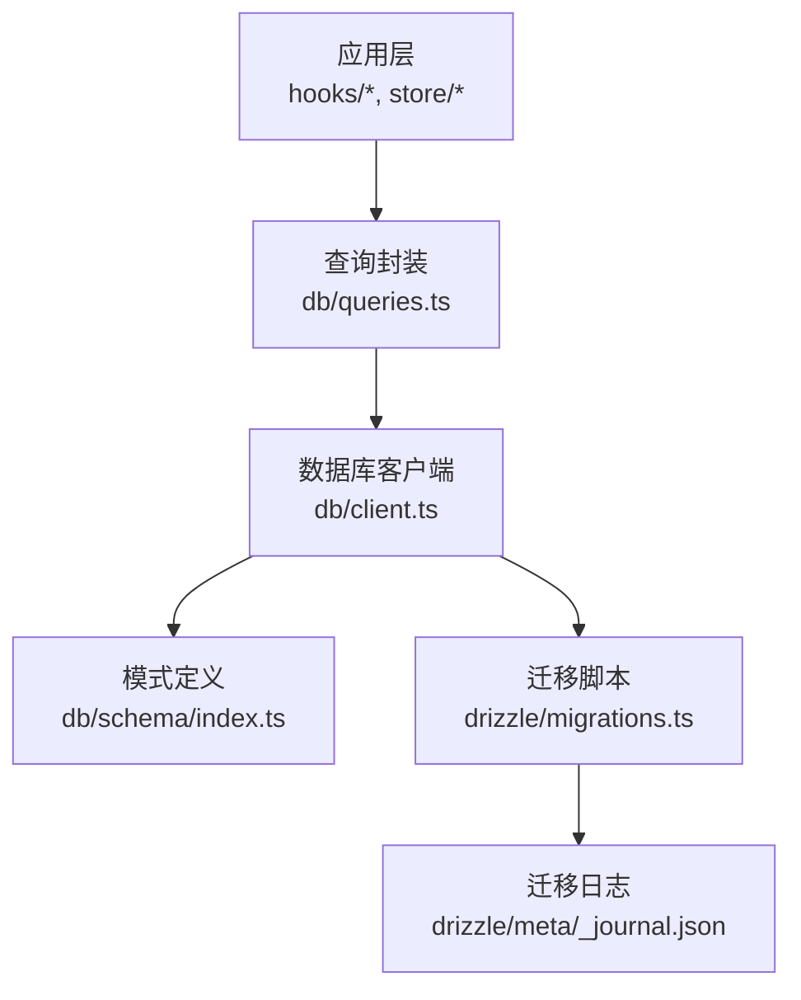
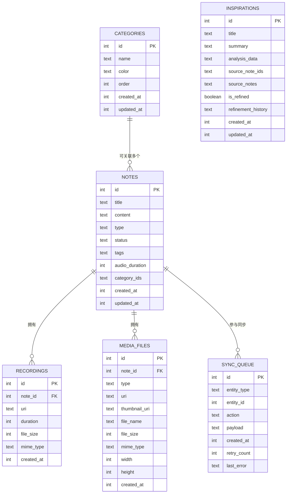
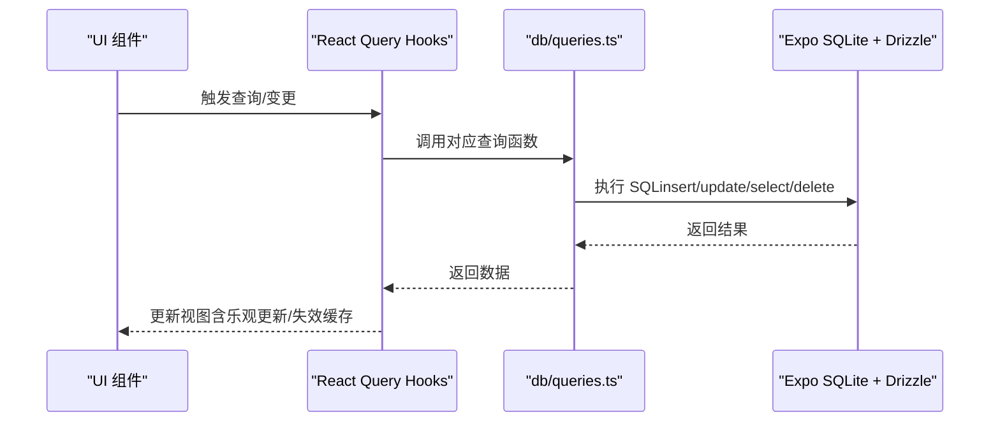
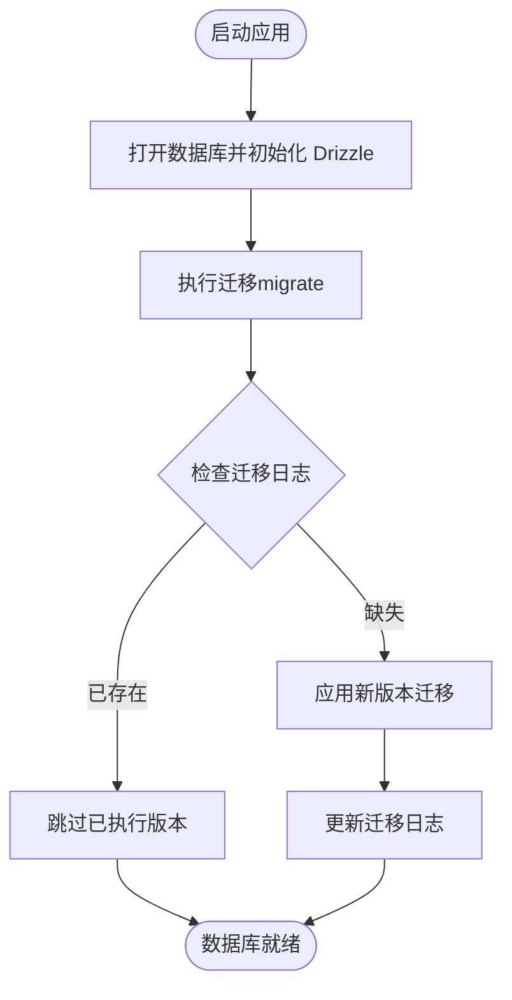
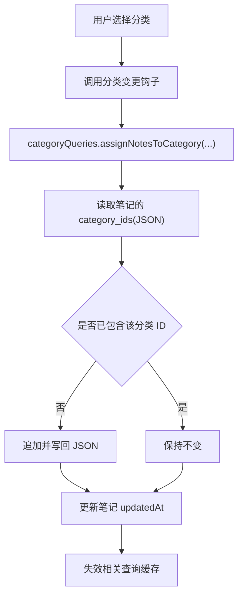
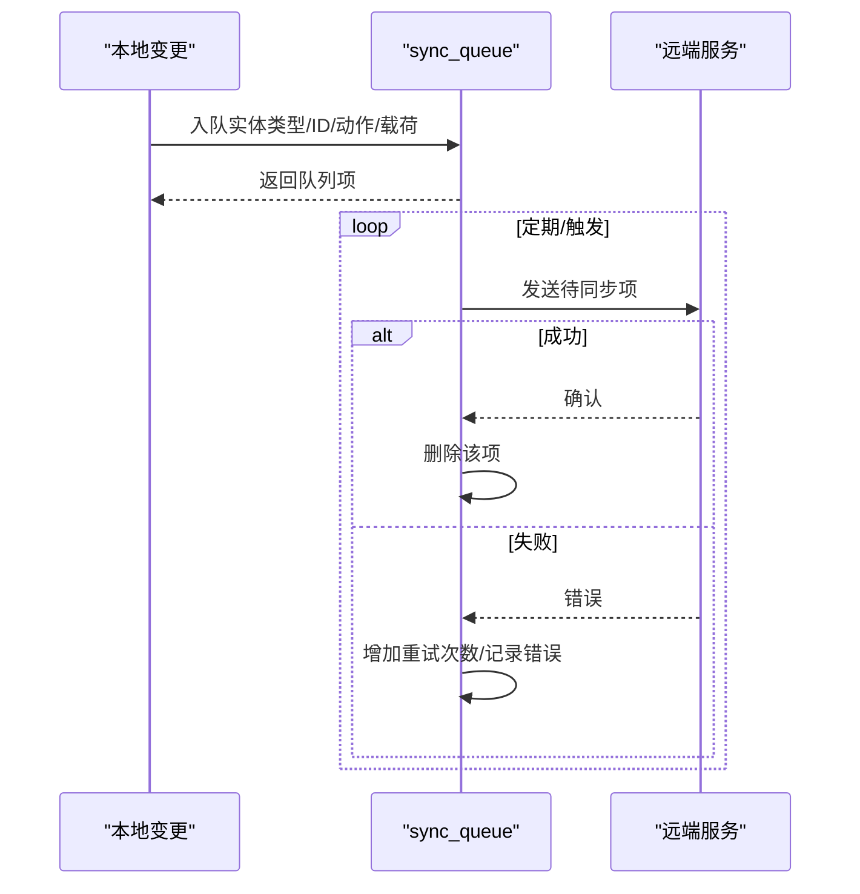
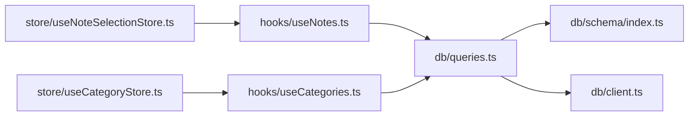

# 数据库设计

<cite>
**本文引用的文件**
- [db/schema/index.ts](file://db/schema/index.ts)
- [db/client.ts](file://db/client.ts)
- [db/index.ts](file://db/index.ts)
- [db/queries.ts](file://db/queries.ts)
- [drizzle/migrations.ts](file://drizzle/migrations.ts)
- [drizzle/migrations.js](file://drizzle/migrations.js)
- [drizzle/0001_overjoyed_punisher.sql](file://drizzle/0001_overjoyed_punisher.sql)
- [drizzle/0002_category_support.sql](file://drizzle/0002_category_support.sql)
- [drizzle/meta/_journal.json](file://drizzle/meta/_journal.json)
- [drizzle.config.ts](file://drizzle.config.ts)
- [hooks/useNotes.ts](file://hooks/useNotes.ts)
- [hooks/useCategories.ts](file://hooks/useCategories.ts)
- [store/useNoteSelectionStore.ts](file://store/useNoteSelectionStore.ts)
- [store/useCategoryStore.ts](file://store/useCategoryStore.ts)
</cite>

## 目录
1. [简介](#简介)
2. [项目结构](#项目结构)
3. [核心组件](#核心组件)
4. [架构总览](#架构总览)
5. [详细组件分析](#详细组件分析)
6. [依赖分析](#依赖分析)
7. [性能考虑](#性能考虑)
8. [故障排除指南](#故障排除指南)
9. [结论](#结论)
10. [附录](#附录)

## 简介
本文件系统化梳理 VoiceNote 的本地数据库设计，基于 Drizzle ORM 与 Expo SQLite 实现。内容涵盖数据模型、表结构与约束、索引策略、查询与缓存模式、迁移管理（版本控制与向后兼容）、实体关系图、数据生命周期与同步策略、性能优化建议以及最佳实践与常见问题。

## 项目结构
数据库相关代码主要分布在以下模块：
- 模式定义：db/schema/index.ts
- 客户端初始化与迁移：db/client.ts、drizzle/migrations.ts、drizzle.meta/_journal.json
- 查询封装：db/queries.ts
- 类型导出：db/index.ts
- 配置：drizzle.config.ts
- 使用示例（React Query + Zustand）：hooks/useNotes.ts、hooks/useCategories.ts、store/useNoteSelectionStore.ts、store/useCategoryStore.ts

**图表来源**
- [db/schema/index.ts:1-75](file://db/schema/index.ts#L1-L75)
- [db/client.ts:1-15](file://db/client.ts#L1-L15)
- [drizzle/migrations.ts:1-83](file://drizzle/migrations.ts#L1-L83)
- [drizzle/0001_overjoyed_punisher.sql:1-13](file://drizzle/0001_overjoyed_punisher.sql#L1-L13)
- [drizzle/0002_category_support.sql:1-11](file://drizzle/0002_category_support.sql#L1-L11)
- [drizzle/meta/_journal.json:1-27](file://drizzle/meta/_journal.json#L1-L27)
- [db/queries.ts:1-286](file://db/queries.ts#L1-L286)
- [db/index.ts:1-26](file://db/index.ts#L1-L26)
- [drizzle.config.ts:1-12](file://drizzle.config.ts#L1-L12)
- [hooks/useNotes.ts:1-217](file://hooks/useNotes.ts#L1-L217)
- [hooks/useCategories.ts:1-94](file://hooks/useCategories.ts#L1-L94)
- [store/useNoteSelectionStore.ts:1-49](file://store/useNoteSelectionStore.ts#L1-L49)
- [store/useCategoryStore.ts:1-56](file://store/useCategoryStore.ts#L1-L56)

**章节来源**
- [db/schema/index.ts:1-75](file://db/schema/index.ts#L1-L75)
- [db/client.ts:1-15](file://db/client.ts#L1-L15)
- [drizzle/migrations.ts:1-83](file://drizzle/migrations.ts#L1-L83)
- [drizzle/migrations.js:1-14](file://drizzle/migrations.js#L1-L14)
- [drizzle/0001_overjoyed_punisher.sql:1-13](file://drizzle/0001_overjoyed_punisher.sql#L1-L13)
- [drizzle/0002_category_support.sql:1-11](file://drizzle/0002_category_support.sql#L1-L11)
- [drizzle/meta/_journal.json:1-27](file://drizzle/meta/_journal.json#L1-L27)
- [drizzle.config.ts:1-12](file://drizzle.config.ts#L1-L12)
- [db/queries.ts:1-286](file://db/queries.ts#L1-L286)
- [db/index.ts:1-26](file://db/index.ts#L1-L26)
- [hooks/useNotes.ts:1-217](file://hooks/useNotes.ts#L1-L217)
- [hooks/useCategories.ts:1-94](file://hooks/useCategories.ts#L1-L94)
- [store/useNoteSelectionStore.ts:1-49](file://store/useNoteSelectionStore.ts#L1-L49)
- [store/useCategoryStore.ts:1-56](file://store/useCategoryStore.ts#L1-L56)

## 核心组件
- 数据库客户端与迁移：通过 Expo SQLite 打开数据库，使用 Drizzle 初始化，并执行迁移。
- 模式定义：以 sqliteTable 定义 notes、recordings、media_files、sync_queue、categories、inspirations 表及索引。
- 查询封装：围绕各实体提供 CRUD 与常用查询方法，统一时间戳处理与返回值。
- 类型导出：从 schema 推断 Select/Insert 类型，配合 hooks 与 store 使用。
- 迁移管理：维护迁移脚本与日志，支持版本推进与向后兼容。

**章节来源**
- [db/client.ts:1-15](file://db/client.ts#L1-L15)
- [db/schema/index.ts:1-75](file://db/schema/index.ts#L1-L75)
- [db/queries.ts:1-286](file://db/queries.ts#L1-L286)
- [db/index.ts:1-26](file://db/index.ts#L1-L26)
- [drizzle/migrations.ts:1-83](file://drizzle/migrations.ts#L1-L83)
- [drizzle/migrations.js:1-14](file://drizzle/migrations.js#L1-L14)
- [drizzle/meta/_journal.json:1-27](file://drizzle/meta/_journal.json#L1-L27)

## 架构总览
下图展示数据库层、查询层与应用层之间的交互关系，以及迁移与配置的作用位置。

**图表来源**
- [db/queries.ts:1-286](file://db/queries.ts#L1-L286)
- [db/client.ts:1-15](file://db/client.ts#L1-L15)
- [db/schema/index.ts:1-75](file://db/schema/index.ts#L1-L75)
- [drizzle/migrations.ts:1-83](file://drizzle/migrations.ts#L1-L83)
- [drizzle/meta/_journal.json:1-27](file://drizzle/meta/_journal.json#L1-L27)

## 详细组件分析

### 数据模型与表结构
- notes（笔记）
  - 主键：自增 id
  - 字段：标题、正文、类型（text/voice/camera/attachment）、状态（active/archived/snoozed）、标签（JSON 数组）、语音时长（毫秒）、分类 ID 列表（JSON 数组）、创建/更新时间戳
  - 约束：非空、默认值、时间戳模式
  - 索引：按 status、type 建立索引
- recordings（录音）
  - 主键：自增 id
  - 外键：note_id 引用 notes.id（级联删除）
  - 字段：URI、时长（毫秒）、文件大小、MIME 类型、创建时间
- media_files（媒体文件）
  - 主键：自增 id
  - 外键：note_id 引用 notes.id（级联删除）
  - 字段：类型（image/video/document）、URI、缩略图 URI、文件名、大小、MIME 类型、宽高、创建时间
- sync_queue（同步队列）
  - 主键：自增 id
  - 字段：实体类型（note/recording/media）、实体 ID、动作（create/update/delete）、载荷（JSON 字符串）、创建时间、重试次数、最后错误
- categories（分类）
  - 主键：自增 id
  - 字段：名称、颜色、顺序、创建/更新时间戳
- inspirations（灵感）
  - 主键：自增 id
  - 字段：标题、摘要、分析数据（JSON）、源笔记 ID 列表（JSON）、源笔记详情（JSON）、是否已优化（布尔）、优化历史（JSON）、创建/更新时间戳

**图表来源**
- [db/schema/index.ts:1-75](file://db/schema/index.ts#L1-L75)

**章节来源**
- [db/schema/index.ts:1-75](file://db/schema/index.ts#L1-L75)

### 查询与缓存模式
- 查询封装
  - notes：全量、按状态、按类型、按状态+类型、按 ID、创建、更新、删除、搜索
  - recordings：按笔记 ID、按 ID、创建、删除、全量
  - media_files：按笔记 ID、按 ID、创建、删除、批量统计数量
  - sync_queue：获取待同步、入队、标记成功、标记失败
  - categories：全量、按 ID、创建、更新、删除、重排、批量分配/移除笔记到分类
  - inspirations：全量、按 ID、创建、更新、删除
- 缓存与乐观更新
  - 使用 React Query 管理查询缓存，提供乐观更新与回滚
  - 变更后失效相关查询键，确保 UI 与数据库一致

**图表来源**
- [hooks/useNotes.ts:1-217](file://hooks/useNotes.ts#L1-L217)
- [hooks/useCategories.ts:1-94](file://hooks/useCategories.ts#L1-L94)
- [db/queries.ts:1-286](file://db/queries.ts#L1-L286)

**章节来源**
- [db/queries.ts:1-286](file://db/queries.ts#L1-L286)
- [hooks/useNotes.ts:1-217](file://hooks/useNotes.ts#L1-L217)
- [hooks/useCategories.ts:1-94](file://hooks/useCategories.ts#L1-L94)

### 迁移管理与版本控制
- 迁移脚本
  - 初始版本：创建 notes、recordings、media_files、sync_queue 表及索引
  - 版本 0001：新增 inspirations 表
  - 版本 0002：新增 categories 表，并在 notes 上添加 category_ids 字段
- 迁移入口
  - migrations.ts：内联 SQL（Metro 不支持导入 .sql 文件），包含迁移映射与日志
  - migrations.js：旧版入口（保留）
- 日志与版本
  - _journal.json 记录已执行迁移的版本与时间戳
- 向后兼容
  - 新增表或列时采用 ALTER TABLE；对现有数据进行安全迁移

**图表来源**
- [db/client.ts:1-15](file://db/client.ts#L1-L15)
- [drizzle/migrations.ts:1-83](file://drizzle/migrations.ts#L1-L83)
- [drizzle/migrations.js:1-14](file://drizzle/migrations.js#L1-L14)
- [drizzle/meta/_journal.json:1-27](file://drizzle/meta/_journal.json#L1-L27)

**章节来源**
- [db/client.ts:1-15](file://db/client.ts#L1-L15)
- [drizzle/migrations.ts:1-83](file://drizzle/migrations.ts#L1-L83)
- [drizzle/migrations.js:1-14](file://drizzle/migrations.js#L1-L14)
- [drizzle/0001_overjoyed_punisher.sql:1-13](file://drizzle/0001_overjoyed_punisher.sql#L1-L13)
- [drizzle/0002_category_support.sql:1-11](file://drizzle/0002_category_support.sql#L1-L11)
- [drizzle/meta/_journal.json:1-27](file://drizzle/meta/_journal.json#L1-L27)

### 分类与笔记的多对多关系
- notes 通过 JSON 字符串字段 category_ids 存储与 categories 的多对多关系
- 提供批量分配/移除分类的方法，内部解析 JSON 并更新 notes 的 category_ids

**图表来源**
- [db/queries.ts:255-270](file://db/queries.ts#L255-L270)

**章节来源**
- [db/queries.ts:200-285](file://db/queries.ts#L200-L285)

### 同步队列与离线数据
- sync_queue 用于记录本地变更，支持重试与错误追踪
- 入队：创建时设置创建时间与重试次数
- 出队：按创建时间排序，优先处理未失败项
- 成功/失败：成功删除，失败增加重试次数并记录错误

**图表来源**
- [db/schema/index.ts:43-52](file://db/schema/index.ts#L43-L52)
- [db/queries.ts:135-164](file://db/queries.ts#L135-L164)

**章节来源**
- [db/schema/index.ts:43-52](file://db/schema/index.ts#L43-L52)
- [db/queries.ts:135-164](file://db/queries.ts#L135-L164)

## 依赖分析
- 模块耦合
  - db/queries.ts 依赖 db/schema/index.ts 与 db/client.ts
  - hooks/* 依赖 db/queries.ts 与 db/index.ts
  - store/* 作为 UI 状态容器，不直接依赖数据库层
- 外部依赖
  - Drizzle ORM + Expo SQLite
  - React Query（缓存与乐观更新）
  - Zustand（轻量状态）

**图表来源**
- [hooks/useNotes.ts:1-217](file://hooks/useNotes.ts#L1-L217)
- [hooks/useCategories.ts:1-94](file://hooks/useCategories.ts#L1-L94)
- [db/queries.ts:1-286](file://db/queries.ts#L1-L286)
- [db/schema/index.ts:1-75](file://db/schema/index.ts#L1-L75)
- [db/client.ts:1-15](file://db/client.ts#L1-L15)
- [store/useNoteSelectionStore.ts:1-49](file://store/useNoteSelectionStore.ts#L1-L49)
- [store/useCategoryStore.ts:1-56](file://store/useCategoryStore.ts#L1-L56)

**章节来源**
- [hooks/useNotes.ts:1-217](file://hooks/useNotes.ts#L1-L217)
- [hooks/useCategories.ts:1-94](file://hooks/useCategories.ts#L1-L94)
- [db/queries.ts:1-286](file://db/queries.ts#L1-L286)
- [db/schema/index.ts:1-75](file://db/schema/index.ts#L1-L75)
- [db/client.ts:1-15](file://db/client.ts#L1-L15)
- [store/useNoteSelectionStore.ts:1-49](file://store/useNoteSelectionStore.ts#L1-L49)
- [store/useCategoryStore.ts:1-56](file://store/useCategoryStore.ts#L1-L56)

## 性能考虑
- 索引策略
  - notes 表按 status 与 type 建有索引，适合高频过滤场景
- 查询优化
  - 使用 orderBy(desc(updatedAt)) 保证最新数据优先
  - 对于批量统计（如媒体计数），使用 IN 子句与 group by，避免 N+1 查询
- 时间戳模式
  - 采用整型时间戳（毫秒）便于排序与范围查询
- 缓存策略
  - React Query 提供查询缓存与失效，结合乐观更新提升交互体验
- 迁移与兼容
  - 新增列使用 ALTER TABLE，避免重建大表
- I/O 优化
  - 将 JSON 字段用于数组存储，减少额外关联表带来的复杂度

**章节来源**
- [db/schema/index.ts:14-17](file://db/schema/index.ts#L14-L17)
- [db/queries.ts:117-132](file://db/queries.ts#L117-L132)
- [db/queries.ts:47-53](file://db/queries.ts#L47-L53)

## 故障排除指南
- 迁移失败
  - 检查 _journal.json 是否记录了当前版本
  - 确认 migrations.ts 中的迁移映射与 SQL 正确
- 级联删除异常
  - 确保外键引用正确，删除父记录时子记录会自动清理
- JSON 字段解析错误
  - 在解析 category_ids 或 tags 时需捕获异常，避免崩溃
- 同步队列堆积
  - 检查 markFailed 是否正确更新 retry_count 与 last_error
  - 控制重试上限与退避策略（可在上层逻辑中扩展）

**章节来源**
- [drizzle/meta/_journal.json:1-27](file://drizzle/meta/_journal.json#L1-L27)
- [drizzle/migrations.ts:1-83](file://drizzle/migrations.ts#L1-L83)
- [db/schema/index.ts:19-41](file://db/schema/index.ts#L19-L41)
- [db/queries.ts:230-244](file://db/queries.ts#L230-L244)
- [db/queries.ts:156-163](file://db/queries.ts#L156-L163)

## 结论
本数据库设计以 Drizzle ORM + Expo SQLite 为基础，围绕笔记、录音、媒体、分类与灵感等核心实体构建，具备清晰的模式定义、完善的查询封装、合理的索引与缓存策略，并通过迁移机制保障版本演进与向后兼容。配合 React Query 与 Zustand，实现了良好的离线体验与数据一致性。

## 附录

### 数据模型与字段说明（摘要）
- notes
  - 关键字段：id、title、content、type、status、tags、audioDuration、categoryIds、createdAt、updatedAt
  - 约束：非空、默认值、枚举、JSON 字段
  - 索引：status、type
- recordings
  - 关键字段：id、noteId、uri、duration、fileSize、mimeType、createdAt
  - 约束：外键（级联删除）
- media_files
  - 关键字段：id、noteId、type、uri、thumbnailUri、fileName、fileSize、mimeType、width、height、createdAt
  - 约束：外键（级联删除）
- sync_queue
  - 关键字段：id、entityType、entityId、action、payload、createdAt、retryCount、lastError
- categories
  - 关键字段：id、name、color、order、createdAt、updatedAt
- inspirations
  - 关键字段：id、title、summary、analysisData、sourceNoteIds、sourceNotes、isRefined、refinementHistory、createdAt、updatedAt

**章节来源**
- [db/schema/index.ts:1-75](file://db/schema/index.ts#L1-L75)

### 查询与变更操作清单
- 笔记
  - 获取全部/按状态/按类型/按状态+类型/按 ID/搜索
  - 创建/更新/删除
- 录音
  - 按笔记 ID 获取/按 ID 获取/创建/删除/获取全部
- 媒体
  - 按笔记 ID 获取/按 ID 获取/创建/删除/按笔记 ID 统计数量
- 同步
  - 获取待同步/入队/标记成功/标记失败
- 分类
  - 获取全部/按 ID/创建/更新/删除/重排/批量分配/批量移除
- 灵感
  - 获取全部/按 ID/创建/更新/删除

**章节来源**
- [db/queries.ts:6-286](file://db/queries.ts#L6-L286)

### 最佳实践
- 使用枚举字段限制取值范围，确保数据一致性
- 对高频过滤字段建立索引，平衡写入与读取性能
- 使用 JSON 字段存储数组时，务必做好异常处理
- 通过 React Query 的乐观更新与失效策略，提升用户体验
- 迁移时尽量使用 ALTER TABLE，避免重建大表
- 同步队列应设置最大重试次数与退避策略，防止无限重试

**章节来源**
- [db/schema/index.ts:7-17](file://db/schema/index.ts#L7-L17)
- [db/queries.ts:135-164](file://db/queries.ts#L135-L164)
- [hooks/useNotes.ts:68-101](file://hooks/useNotes.ts#L68-L101)