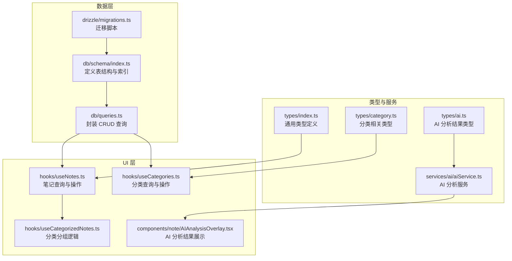
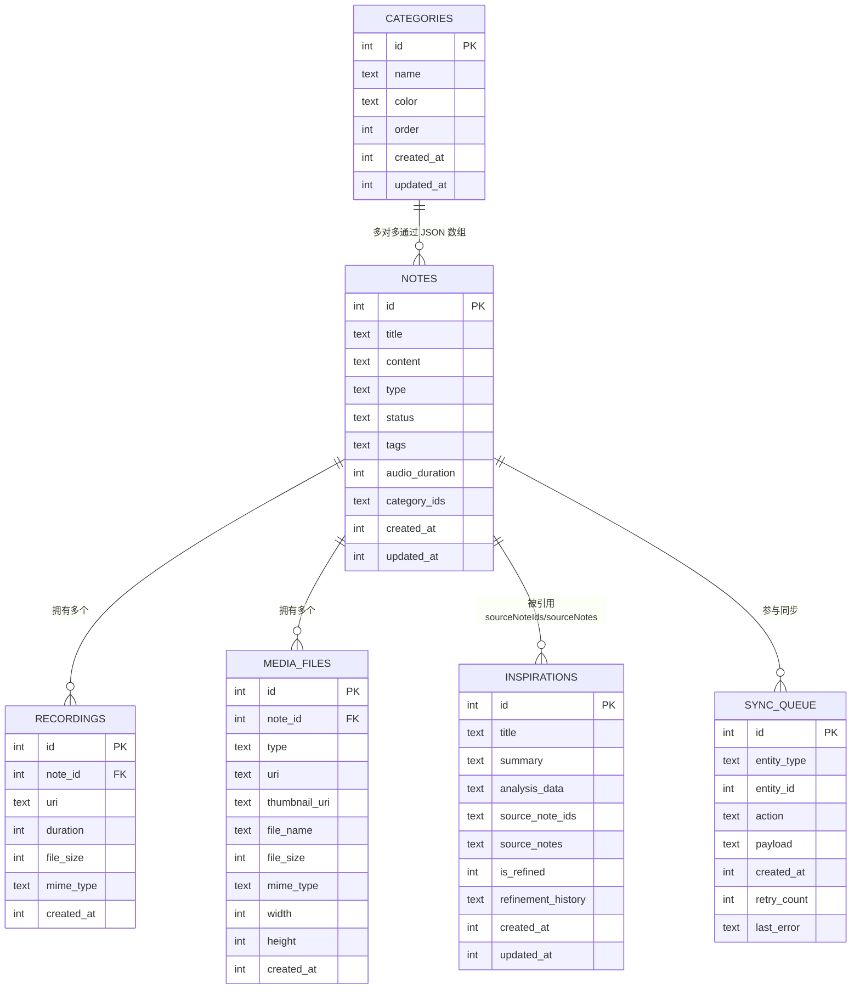
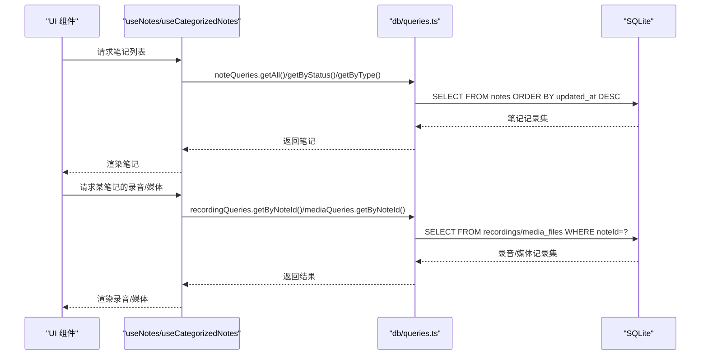
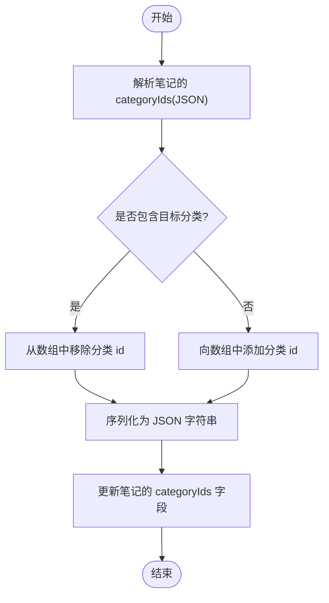
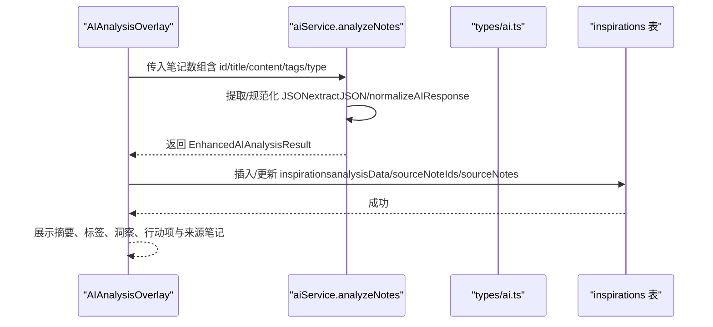
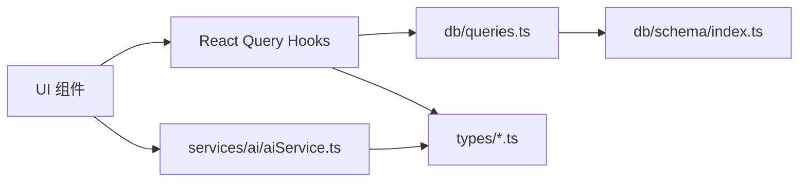

# 数据模型设计

<cite>
**本文档引用的文件**
- [db/schema/index.ts](file://db/schema/index.ts)
- [drizzle/migrations.ts](file://drizzle/migrations.ts)
- [drizzle/0001_overjoyed_punisher.sql](file://drizzle/0001_overjoyed_punisher.sql)
- [drizzle/0002_category_support.sql](file://drizzle/0002_category_support.sql)
- [types/index.ts](file://types/index.ts)
- [types/category.ts](file://types/category.ts)
- [types/ai.ts](file://types/ai.ts)
- [db/queries.ts](file://db/queries.ts)
- [hooks/useNotes.ts](file://hooks/useNotes.ts)
- [hooks/useCategories.ts](file://hooks/useCategories.ts)
- [hooks/useCategorizedNotes.ts](file://hooks/useCategorizedNotes.ts)
- [services/ai/aiService.ts](file://services/ai/aiService.ts)
- [components/note/AIAnalysisOverlay.tsx](file://components/note/AIAnalysisOverlay.tsx)
- [utils/format.ts](file://utils/format.ts)
- [utils/validation.ts](file://utils/validation.ts)
</cite>

## 目录
1. [简介](#简介)
2. [项目结构](#项目结构)
3. [核心组件](#核心组件)
4. [架构总览](#架构总览)
5. [详细组件分析](#详细组件分析)
6. [依赖分析](#依赖分析)
7. [性能考虑](#性能考虑)
8. [故障排除指南](#故障排除指南)
9. [结论](#结论)
10. [附录](#附录)

## 简介
本文件系统性地梳理 VoiceNote 的数据模型设计，围绕核心实体 Note、Recording、MediaFiles、Categories、Inspirations 展开，阐明字段定义、数据类型选择、业务规则与约束，并解释一对一、一对多、多对多关系的设计理念。同时，文档化 JSON 字段（如 tags、categoryIds、analysisData）的存储与查询策略，说明枚举类型（note type、status、category color）的使用方式，提供数据验证规则、默认值设置与业务逻辑约束，最后给出模型扩展的最佳实践与性能优化建议。

## 项目结构
VoiceNote 的数据层采用 Drizzle ORM + SQLite 的本地存储方案，配合 React Query 实现数据缓存与状态同步。核心模型定义位于数据库 schema 文件中，查询逻辑集中在 queries 模块，类型定义在 types 目录，UI 层通过 hooks 与服务层交互。

**图表来源**
- [db/schema/index.ts:1-75](file://db/schema/index.ts#L1-L75)
- [db/queries.ts:1-286](file://db/queries.ts#L1-L286)
- [drizzle/migrations.ts:1-83](file://drizzle/migrations.ts#L1-L83)
- [types/index.ts:54-98](file://types/index.ts#L54-L98)
- [types/category.ts:1-17](file://types/category.ts#L1-L17)
- [types/ai.ts:1-48](file://types/ai.ts#L1-L48)
- [services/ai/aiService.ts:1-163](file://services/ai/aiService.ts#L1-L163)
- [hooks/useNotes.ts:1-217](file://hooks/useNotes.ts#L1-L217)
- [hooks/useCategories.ts:1-94](file://hooks/useCategories.ts#L1-L94)
- [hooks/useCategorizedNotes.ts:1-52](file://hooks/useCategorizedNotes.ts#L1-L52)
- [components/note/AIAnalysisOverlay.tsx:1-466](file://components/note/AIAnalysisOverlay.tsx#L1-L466)

**章节来源**
- [db/schema/index.ts:1-75](file://db/schema/index.ts#L1-L75)
- [drizzle/migrations.ts:1-83](file://drizzle/migrations.ts#L1-L83)

## 核心组件
本节从数据模型角度解析各实体的字段、类型与约束，以及它们之间的关系。

- Note（笔记）
  - 主键：自增整数 id
  - 标题：非空文本
  - 内容：可空文本
  - 类型：枚举 text/voice/camera/attachment，默认 text
  - 状态：枚举 active/archived/snoozed，默认 active
  - 标签：JSON 数组字符串（tags），用于存储字符串标签
  - 音频时长：整数（毫秒），仅语音笔记使用
  - 分类关联：JSON 数组字符串（categoryIds），存储分类 id 列表
  - 时间戳：createdAt/updatedAt（时间戳整数）
  - 索引：status、type 字段建立索引以支持高频查询
  - 外键：无直接外键，categoryIds 通过 JSON 维护多对多关系

- Recording（录音）
  - 主键：自增整数 id
  - 关联：noteId 引用 notes.id，级联删除
  - 资源：uri（非空）、duration（毫秒，非空）、fileSize、mimeType
  - 时间戳：createdAt

- MediaFiles（媒体文件）
  - 主键：自增整数 id
  - 关联：noteId 引用 notes.id，级联删除
  - 类型：枚举 image/video/document
  - 资源：uri、thumbnailUri、fileName、fileSize、mimeType
  - 尺寸：width、height
  - 时间戳：createdAt

- Categories（分类）
  - 主键：自增整数 id
  - 名称：非空文本
  - 颜色：可空文本（预设颜色集合）
  - 排序：整数，默认 0
  - 时间戳：createdAt、updatedAt

- Inspirations（灵感）
  - 主键：自增整数 id
  - 标题/摘要：非空文本
  - AI 分析：analysisData（JSON 字符串，存储 EnhancedAIAnalysisResult）
  - 来源笔记：sourceNoteIds（JSON 数组 number[]）、sourceNotes（JSON 字符串，存储 AISourceNote[]）
  - 精炼标记：isRefined（布尔），默认 false
  - 精炼历史：refinementHistory（JSON 字符串数组）
  - 时间戳：createdAt、updatedAt

- SyncQueue（同步队列）
  - 主键：自增整数 id
  - 实体类型：枚举 note/recording/media
  - 实体 id：整数
  - 操作：枚举 create/update/delete
  - 载荷：payload（JSON 字符串）
  - 重试计数与错误：retryCount（默认 0）、lastError
  - 时间戳：createdAt

**章节来源**
- [db/schema/index.ts:3-74](file://db/schema/index.ts#L3-L74)
- [drizzle/migrations.ts:6-81](file://drizzle/migrations.ts#L6-L81)
- [drizzle/0001_overjoyed_punisher.sql:1-13](file://drizzle/0001_overjoyed_punisher.sql#L1-L13)
- [drizzle/0002_category_support.sql:1-11](file://drizzle/0002_category_support.sql#L1-L11)

## 架构总览
下图展示了实体间的依赖与关系，以及 JSON 字段在业务中的使用位置。

**图表来源**
- [db/schema/index.ts:3-74](file://db/schema/index.ts#L3-L74)
- [drizzle/migrations.ts:6-81](file://drizzle/migrations.ts#L6-L81)

## 详细组件分析

### Note 实体
- 字段与类型
  - id：自增主键
  - title：非空文本
  - content：可空文本
  - type：枚举，缺省 text
  - status：枚举，缺省 active
  - tags：JSON 字符串数组，存储标签
  - audioDuration：整数（毫秒），语音笔记使用
  - categoryIds：JSON 字符串数组，存储分类 id
  - createdAt/updatedAt：时间戳整数
- 约束与默认值
  - type 默认 text，status 默认 active
  - tags/categoryIds 可为空，表示未设置
- 关系
  - 一对多：与 Recording/MediaFiles
  - 多对多：与 Categories（通过 JSON 数组维护）
- 查询与更新
  - 支持按 status/type 过滤与排序
  - 更新自动写入 updatedAt

**章节来源**
- [db/schema/index.ts:3-17](file://db/schema/index.ts#L3-L17)
- [db/queries.ts:7-64](file://db/queries.ts#L7-L64)
- [hooks/useNotes.ts:19-102](file://hooks/useNotes.ts#L19-L102)

### Recording 实体
- 字段与类型
  - noteId 外键，级联删除
  - uri/duration 必填
  - fileSize/mimeType 可空
  - createdAt 时间戳
- 关系
  - 一对一：与 Note（一个录音属于一个笔记）

**章节来源**
- [db/schema/index.ts:19-27](file://db/schema/index.ts#L19-L27)
- [db/queries.ts:66-92](file://db/queries.ts#L66-L92)

### MediaFiles 实体
- 字段与类型
  - noteId 外键，级联删除
  - type 枚举（image/video/document）
  - 其余资源元信息可空
  - createdAt 时间戳
- 关系
  - 一对一：与 Note（一个媒体文件属于一个笔记）

**章节来源**
- [db/schema/index.ts:29-41](file://db/schema/index.ts#L29-L41)
- [db/queries.ts:94-133](file://db/queries.ts#L94-L133)

### Categories 实体
- 字段与类型
  - name 非空
  - color 可空（使用预设颜色集合）
  - order 默认 0
  - createdAt/updatedAt
- 关系
  - 多对多：与 Note（通过 JSON 数组维护）
- 操作
  - 删除时需清理所有笔记中的该分类 id
  - 支持重新排序与批量分配/移除

**章节来源**
- [db/schema/index.ts:54-61](file://db/schema/index.ts#L54-L61)
- [db/queries.ts:200-285](file://db/queries.ts#L200-L285)
- [types/category.ts:13-16](file://types/category.ts#L13-L16)

### Inspirations 实体
- 字段与类型
  - analysisData：JSON 字符串，存储 EnhancedAIAnalysisResult
  - sourceNoteIds：JSON 数组 number[]
  - sourceNotes：JSON 字符串，存储 AISourceNote[]
  - isRefined：布尔，默认 false
  - refinementHistory：JSON 字符串数组
  - createdAt/updatedAt
- 关系
  - 间接关联：通过 sourceNoteIds/sourceNotes 与 Note 建立引用关系
- 使用场景
  - 存储 AI 对多条笔记的聚合分析结果

**章节来源**
- [db/schema/index.ts:63-74](file://db/schema/index.ts#L63-L74)
- [drizzle/0001_overjoyed_punisher.sql:1-13](file://drizzle/0001_overjoyed_punisher.sql#L1-L13)
- [types/ai.ts:28-40](file://types/ai.ts#L28-L40)

### SyncQueue 实体
- 字段与类型
  - entity_type：枚举 note/recording/media
  - entity_id：整数
  - action：枚举 create/update/delete
  - payload：JSON 字符串
  - retryCount 默认 0，lastError
  - createdAt
- 用途
  - 记录待同步的数据变更，支持失败重试

**章节来源**
- [db/schema/index.ts:43-52](file://db/schema/index.ts#L43-L52)
- [db/queries.ts:135-164](file://db/queries.ts#L135-L164)

### JSON 字段使用策略
- tags
  - 存储：字符串数组 JSON
  - 查询：在合并笔记等场景进行解析与去重
  - 示例路径：[hooks/useNotes.ts:176-186](file://hooks/useNotes.ts#L176-L186)
- categoryIds
  - 存储：字符串数组 JSON
  - 维护：分类删除时清理；分配/移除时增删元素并序列化
  - 示例路径：[db/queries.ts:234-243](file://db/queries.ts#L234-L243)、[db/queries.ts:255-269](file://db/queries.ts#L255-L269)
- analysisData
  - 存储：字符串 JSON，结构见 EnhancedAIAnalysisResult
  - 解析：AI 服务返回后进行提取与规范化
  - 示例路径：[services/ai/aiService.ts:34-46](file://services/ai/aiService.ts#L34-L46)、[services/ai/aiService.ts:95-124](file://services/ai/aiService.ts#L95-L124)

**章节来源**
- [hooks/useNotes.ts:176-186](file://hooks/useNotes.ts#L176-L186)
- [db/queries.ts:234-243](file://db/queries.ts#L234-L243)
- [db/queries.ts:255-269](file://db/queries.ts#L255-L269)
- [services/ai/aiService.ts:34-46](file://services/ai/aiService.ts#L34-L46)
- [services/ai/aiService.ts:95-124](file://services/ai/aiService.ts#L95-L124)

### 枚举类型与业务规则
- note 类型（type）
  - 取值：text/voice/camera/attachment
  - 默认：text
  - 影响：决定 UI 渲染与处理逻辑（如音频时长字段）
- note 状态（status）
  - 取值：active/archived/snoozed
  - 默认：active
  - 影响：列表筛选与归档操作
- 媒体类型（media type）
  - 取值：image/video/document
- 同步实体类型（entity_type）
  - 取值：note/recording/media
- 同步动作（action）
  - 取值：create/update/delete
- 分类颜色（color）
  - 预设颜色集合：见 PREDEFINED_COLORS
- AI 结果类型
  - EnhancedAIAnalysisResult：包含 summary/tags/keyInsights/actionItems/metadata

**章节来源**
- [db/schema/index.ts:7-8](file://db/schema/index.ts#L7-L8)
- [db/schema/index.ts:32](file://db/schema/index.ts#L32)
- [db/schema/index.ts:45-47](file://db/schema/index.ts#L45-L47)
- [db/schema/index.ts:47](file://db/schema/index.ts#L47)
- [types/category.ts:13-16](file://types/category.ts#L13-L16)
- [types/ai.ts:34-40](file://types/ai.ts#L34-L40)

### 关系映射与查询流程

#### 笔记与录音/媒体的查询序列

**图表来源**
- [hooks/useNotes.ts:19-41](file://hooks/useNotes.ts#L19-L41)
- [db/queries.ts:7-64](file://db/queries.ts#L7-L64)
- [db/queries.ts:66-92](file://db/queries.ts#L66-L92)
- [db/queries.ts:94-133](file://db/queries.ts#L94-L133)

#### 分类与笔记的多对多维护流程

**图表来源**
- [db/queries.ts:234-243](file://db/queries.ts#L234-L243)
- [db/queries.ts:255-269](file://db/queries.ts#L255-L269)
- [hooks/useCategorizedNotes.ts:5-13](file://hooks/useCategorizedNotes.ts#L5-L13)

#### AI 分析结果的存储与展示

**图表来源**
- [components/note/AIAnalysisOverlay.tsx:115-239](file://components/note/AIAnalysisOverlay.tsx#L115-L239)
- [services/ai/aiService.ts:126-162](file://services/ai/aiService.ts#L126-L162)
- [types/ai.ts:28-40](file://types/ai.ts#L28-L40)
- [db/schema/index.ts:63-74](file://db/schema/index.ts#L63-L74)

## 依赖分析
- 组件耦合
  - hooks 层依赖 db/queries.ts 提供的统一查询接口
  - UI 组件依赖 hooks 进行数据获取与状态管理
  - 类型定义（types/*）为 hooks 与服务层提供契约
- 外部依赖
  - Drizzle ORM + SQLite（移动端）
  - React Query（缓存与并发控制）
  - i18n（国际化文案）
- 潜在循环依赖
  - 当前结构清晰，无明显循环导入
- JSON 字段的跨层依赖
  - db/queries.ts 与 hooks/useNotes.ts 在解析/序列化 JSON 上存在耦合，建议在专用工具模块中集中处理

**图表来源**
- [hooks/useNotes.ts:1-217](file://hooks/useNotes.ts#L1-L217)
- [db/queries.ts:1-286](file://db/queries.ts#L1-L286)
- [db/schema/index.ts:1-75](file://db/schema/index.ts#L1-L75)
- [types/index.ts:54-98](file://types/index.ts#L54-L98)
- [services/ai/aiService.ts:1-163](file://services/ai/aiService.ts#L1-L163)

**章节来源**
- [hooks/useNotes.ts:1-217](file://hooks/useNotes.ts#L1-L217)
- [db/queries.ts:1-286](file://db/queries.ts#L1-L286)
- [types/index.ts:54-98](file://types/index.ts#L54-L98)

## 性能考虑
- 索引优化
  - notes 表 status、type 字段已建索引，适合高频过滤
  - 建议在高频搜索字段（如 title）上增加索引或全文检索
- JSON 字段处理
  - categoryIds/tags 在读写时频繁解析/序列化，建议在应用层引入轻量缓存或只在必要时解析
- 批量操作
  - 分类重排与批量分配/移除时逐条更新，建议在服务端或事务中批量执行以减少往返
- 查询粒度
  - 媒体数量统计使用分组聚合，注意大数据量时的性能表现
- 缓存策略
  - React Query 已提供缓存与失效机制，合理设置查询键与过期策略

[本节为通用指导，无需特定文件来源]

## 故障排除指南
- JSON 解析异常
  - 现象：categoryIds/tags 解析失败
  - 处理：在解析处添加 try/catch 并回退到空数组/空字符串
  - 参考路径：[db/queries.ts:234-243](file://db/queries.ts#L234-L243)、[hooks/useCategorizedNotes.ts:5-13](file://hooks/useCategorizedNotes.ts#L5-L13)
- 分类删除后笔记仍显示分类
  - 现象：删除分类后，笔记 categoryIds 中仍有旧 id
  - 处理：确认删除逻辑已遍历所有笔记并清理对应 id
  - 参考路径：[db/queries.ts:234-243](file://db/queries.ts#L234-L243)
- AI 分析结果格式不正确
  - 现象：analysisData JSON 不符合 EnhancedAIAnalysisResult
  - 处理：确保 extractJSON 正确提取 JSON，normalizeAIResponse 规范化字段
  - 参考路径：[services/ai/aiService.ts:34-46](file://services/ai/aiService.ts#L34-L46)、[services/ai/aiService.ts:95-124](file://services/ai/aiService.ts#L95-L124)
- 文件类型判断
  - 现象：媒体类型识别错误
  - 处理：使用工具函数 isImageFile/isVideoFile/isAudioFile/isDocumentFile
  - 参考路径：[utils/validation.ts:36-57](file://utils/validation.ts#L36-L57)

**章节来源**
- [db/queries.ts:234-243](file://db/queries.ts#L234-L243)
- [hooks/useCategorizedNotes.ts:5-13](file://hooks/useCategorizedNotes.ts#L5-L13)
- [services/ai/aiService.ts:34-46](file://services/ai/aiService.ts#L34-L46)
- [services/ai/aiService.ts:95-124](file://services/ai/aiService.ts#L95-L124)
- [utils/validation.ts:36-57](file://utils/validation.ts#L36-L57)

## 结论
VoiceNote 的数据模型以简洁的 SQLite + Drizzle ORM 为基础，通过 JSON 字段灵活承载多对多关系与复杂结构（如 tags、categoryIds、analysisData）。实体关系清晰，枚举与默认值提升了数据一致性与易用性。建议在后续迭代中加强索引覆盖、优化 JSON 字段的解析与缓存策略，并在批量操作中引入事务以提升性能与可靠性。

[本节为总结性内容，无需特定文件来源]

## 附录

### 字段与类型速查
- Note
  - id: 自增整数
  - title: 文本（非空）
  - content: 文本（可空）
  - type: 枚举 text/voice/camera/attachment（默认 text）
  - status: 枚举 active/archived/snoozed（默认 active）
  - tags: JSON 字符串数组
  - audioDuration: 整数（毫秒）
  - categoryIds: JSON 字符串数组
  - createdAt/updatedAt: 时间戳整数
- Recording
  - noteId: 外键（级联删除）
  - uri: 文本（非空）
  - duration: 整数（毫秒，非空）
  - fileSize/mimeType: 可空
  - createdAt: 时间戳整数
- MediaFiles
  - noteId: 外键（级联删除）
  - type: 枚举 image/video/document
  - 其余资源字段：可空
  - createdAt: 时间戳整数
- Categories
  - name: 文本（非空）
  - color: 文本（可空）
  - order: 整数（默认 0）
  - createdAt/updatedAt: 时间戳整数
- Inspirations
  - analysisData: JSON 字符串（EnhancedAIAnalysisResult）
  - sourceNoteIds: JSON 数组 number[]
  - sourceNotes: JSON 字符串（AISourceNote[]）
  - isRefined: 布尔（默认 false）
  - refinementHistory: JSON 字符串数组
  - createdAt/updatedAt: 时间戳整数
- SyncQueue
  - entity_type: 枚举 note/recording/media
  - entity_id: 整数
  - action: 枚举 create/update/delete
  - payload: JSON 字符串
  - retryCount: 整数（默认 0）
  - lastError: 文本
  - createdAt: 时间戳整数

**章节来源**
- [db/schema/index.ts:3-74](file://db/schema/index.ts#L3-L74)
- [types/ai.ts:28-40](file://types/ai.ts#L28-L40)