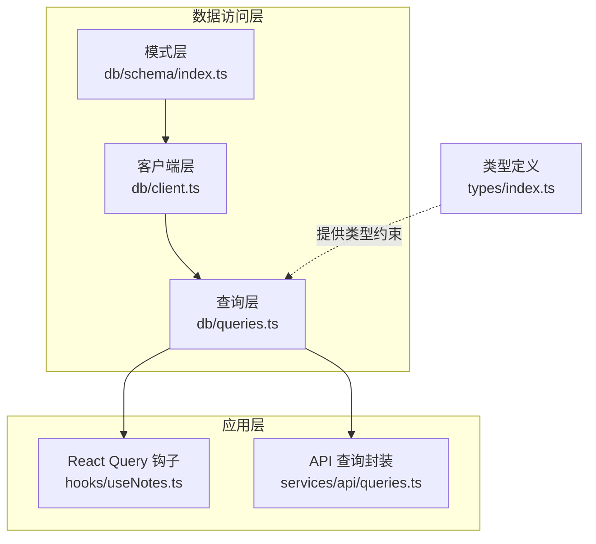
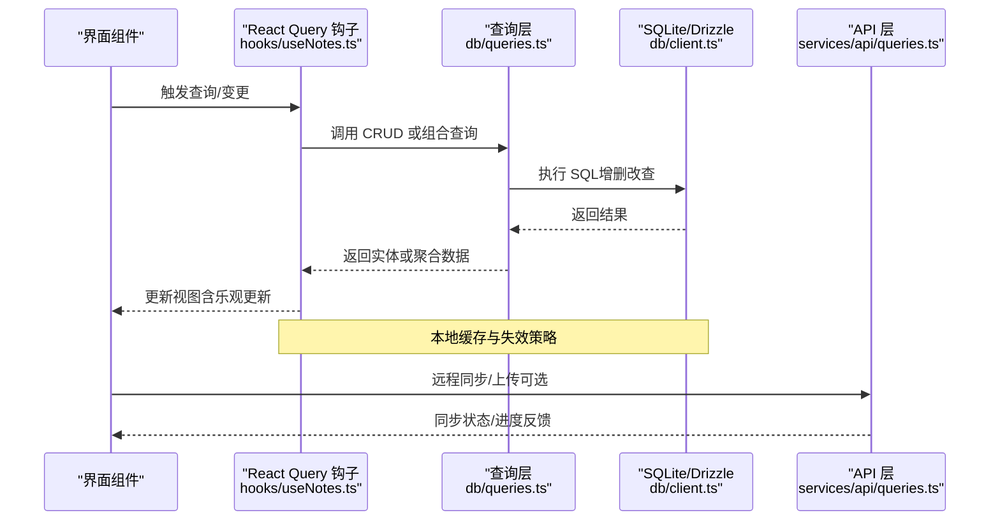
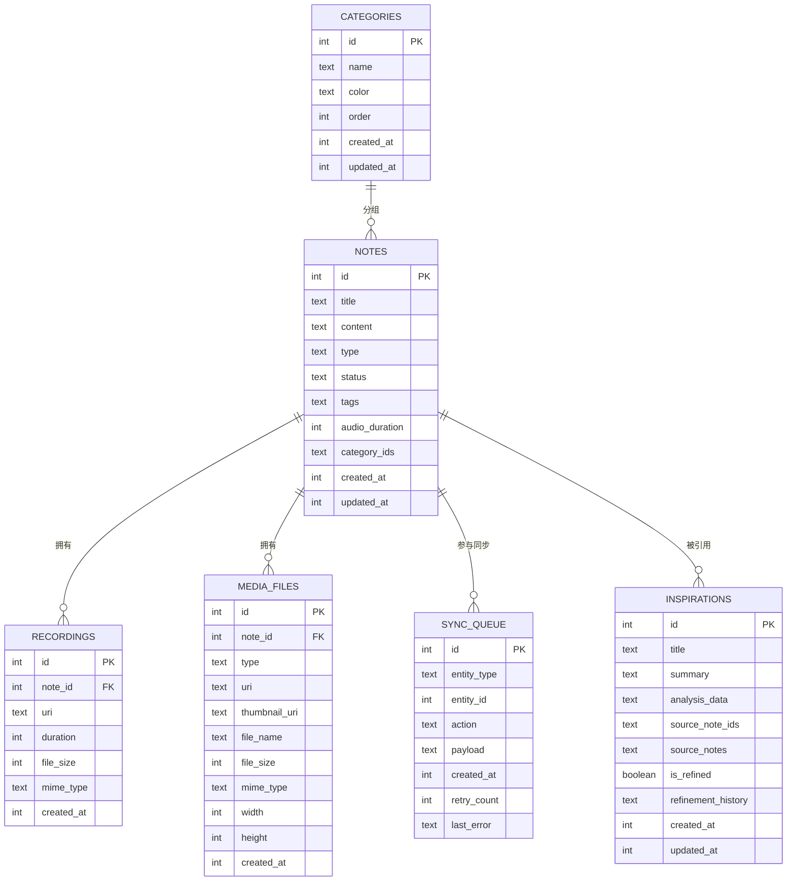
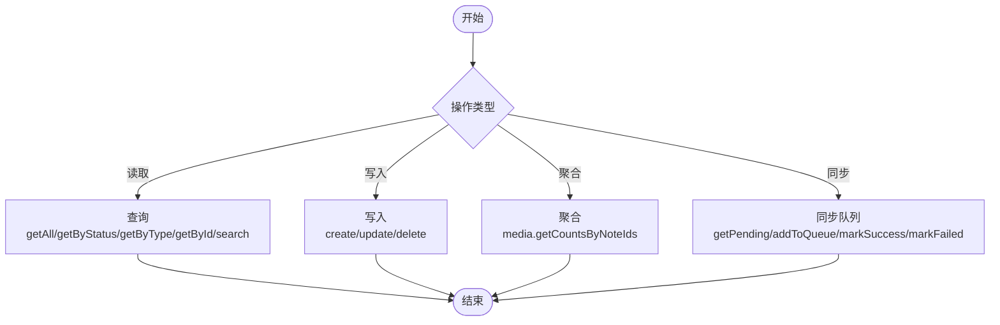
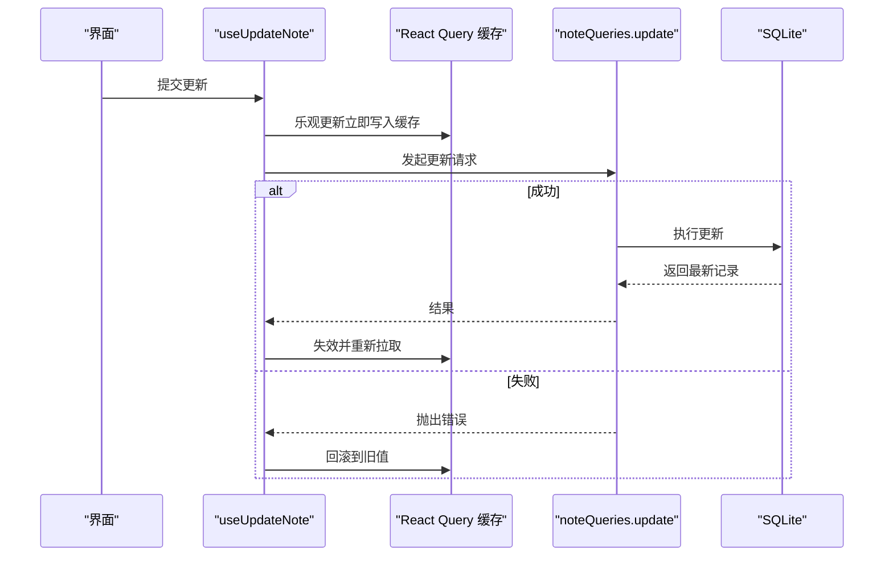
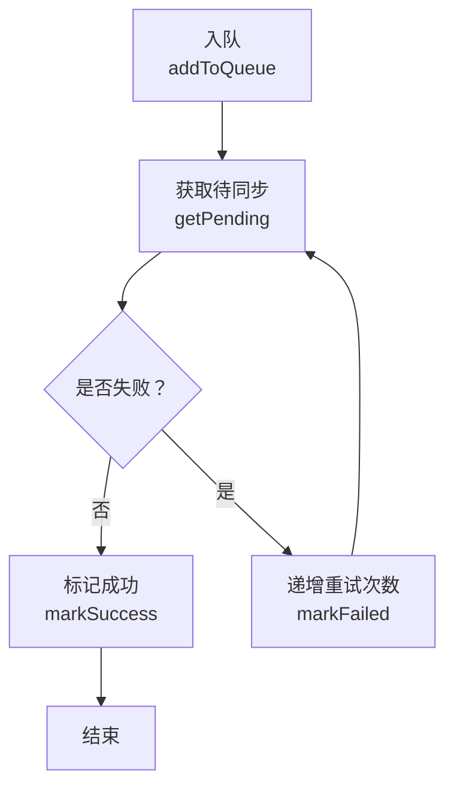
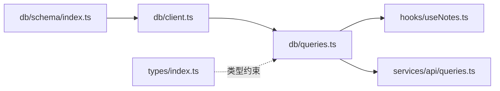

# 数据访问模式

<cite>
**本文引用的文件**
- [db/schema/index.ts](file://db/schema/index.ts)
- [db/client.ts](file://db/client.ts)
- [db/index.ts](file://db/index.ts)
- [db/queries.ts](file://db/queries.ts)
- [drizzle.config.ts](file://drizzle.config.ts)
- [drizzle/migrations.ts](file://drizzle/migrations.ts)
- [hooks/useNotes.ts](file://hooks/useNotes.ts)
- [services/api/queries.ts](file://services/api/queries.ts)
- [types/index.ts](file://types/index.ts)
- [services/mediaStorage.ts](file://services/mediaStorage.ts)
- [services/upload/index.ts](file://services/upload/index.ts)
</cite>

## 目录
1. [简介](#简介)
2. [项目结构](#项目结构)
3. [核心组件](#核心组件)
4. [架构总览](#架构总览)
5. [详细组件分析](#详细组件分析)
6. [依赖关系分析](#依赖关系分析)
7. [性能考量](#性能考量)
8. [故障排查指南](#故障排查指南)
9. [结论](#结论)
10. [附录](#附录)

## 简介
本文件系统性梳理 VoiceNote 基于 Drizzle ORM 的数据访问层（DAO）架构与查询模式，覆盖以下主题：
- 数据模型与索引设计
- CRUD 实现模式与最佳实践
- 复杂联表与聚合查询
- 分页、排序与过滤策略
- 事务、批量操作与异步查询
- 查询优化与性能调优
- 缓存策略与数据一致性
- 错误处理、异常管理与重试
- 离线同步与冲突解决的数据访问模式

## 项目结构
数据访问层由三层组成：
- 模式层：定义 SQLite 表结构与索引
- 客户端层：初始化 Drizzle 连接与运行迁移
- 查询层：封装 CRUD 与业务查询逻辑

图表来源
- [db/schema/index.ts:1-75](file://db/schema/index.ts#L1-L75)
- [db/client.ts:1-15](file://db/client.ts#L1-L15)
- [db/queries.ts:1-286](file://db/queries.ts#L1-L286)
- [hooks/useNotes.ts:1-217](file://hooks/useNotes.ts#L1-L217)
- [services/api/queries.ts:1-100](file://services/api/queries.ts#L1-L100)
- [types/index.ts:1-98](file://types/index.ts#L1-L98)

章节来源
- [db/schema/index.ts:1-75](file://db/schema/index.ts#L1-L75)
- [db/client.ts:1-15](file://db/client.ts#L1-L15)
- [db/queries.ts:1-286](file://db/queries.ts#L1-L286)
- [hooks/useNotes.ts:1-217](file://hooks/useNotes.ts#L1-L217)
- [services/api/queries.ts:1-100](file://services/api/queries.ts#L1-L100)
- [types/index.ts:1-98](file://types/index.ts#L1-L98)

## 核心组件
- 数据库客户端与迁移
  - 初始化 SQLite 数据库连接，使用 Drizzle ORM 包装
  - 自动执行迁移脚本，确保本地数据库结构与模式一致
- 查询模块
  - 面向实体的查询封装：笔记、录音、媒体、灵感、分类、同步队列
  - 提供基础 CRUD 与常用组合查询（按状态、类型、时间等）
- 类型系统
  - 通过 Drizzle 推断 Select/Insert 类型，统一前端与后端类型约束
- React Query 集成
  - 将本地查询封装为可缓存、可失效的查询钩子，支持乐观更新与回滚
- API 层（远程）
  - 与服务端交互的查询封装，便于后续扩展远程同步与离线队列

章节来源
- [db/client.ts:1-15](file://db/client.ts#L1-L15)
- [db/queries.ts:1-286](file://db/queries.ts#L1-L286)
- [db/index.ts:1-26](file://db/index.ts#L1-L26)
- [hooks/useNotes.ts:1-217](file://hooks/useNotes.ts#L1-L217)
- [services/api/queries.ts:1-100](file://services/api/queries.ts#L1-L100)

## 架构总览
下图展示从应用到数据库的典型调用链路，以及缓存与同步的关键节点。

图表来源
- [hooks/useNotes.ts:1-217](file://hooks/useNotes.ts#L1-L217)
- [db/queries.ts:1-286](file://db/queries.ts#L1-L286)
- [db/client.ts:1-15](file://db/client.ts#L1-L15)
- [services/api/queries.ts:1-100](file://services/api/queries.ts#L1-L100)

## 详细组件分析

### 数据模型与索引
- 主要实体
  - 笔记：包含标题、内容、类型、状态、标签、音频时长、分类 ID 列表、时间戳
  - 录音：一对一关联笔记，存储音频元信息
  - 媒体文件：一对一关联笔记，存储图片/视频/文档等资源
  - 同步队列：记录待同步的实体变更（类型、ID、动作、载荷、重试计数、错误）
  - 分类：用于对笔记进行分组与排序
  - 灵感：AI 生成的分析与摘要
- 索引
  - 笔记表对 status 与 type 字段建立索引，提升按状态/类型过滤的查询效率
- 关系
  - 录音与媒体文件均通过外键级联删除，确保删除笔记时清理关联资源

图表来源
- [db/schema/index.ts:1-75](file://db/schema/index.ts#L1-L75)

章节来源
- [db/schema/index.ts:1-75](file://db/schema/index.ts#L1-L75)

### 查询层：CRUD 与组合查询
- 笔记查询
  - 全量、按状态、按类型、按状态+类型、按 ID、创建、更新、删除、模糊匹配（标题）
- 录音查询
  - 按笔记 ID、按 ID、全量列表
- 媒体查询
  - 按笔记 ID、按 ID、创建、删除、批量统计（按笔记 ID 分组计数）
- 同步队列
  - 获取待同步项、入队、标记成功、标记失败（递增重试次数）
- 灵感与分类
  - 全量、按 ID、创建、更新、删除；分类支持重排、批量分配/移除笔记

图表来源
- [db/queries.ts:1-286](file://db/queries.ts#L1-L286)

章节来源
- [db/queries.ts:1-286](file://db/queries.ts#L1-L286)

### 分页、排序与过滤
- 排序
  - 默认按 updatedAt 降序；部分实体按 createdAt 降序
- 过滤
  - 支持按 status/type 精确过滤；支持按 ID 精确匹配
- 分页
  - 当前查询层未直接实现分页参数；建议在上层（如 React Query）结合虚拟列表或服务端分页接口实现
- 组合查询
  - 使用原生 SQL 片段拼接多条件（如状态+类型），满足复杂筛选需求

章节来源
- [db/queries.ts:8-64](file://db/queries.ts#L8-L64)
- [db/queries.ts:67-92](file://db/queries.ts#L67-L92)
- [db/queries.ts:95-133](file://db/queries.ts#L95-L133)
- [db/queries.ts:136-164](file://db/queries.ts#L136-L164)

### 事务、批量操作与异步查询
- 事务
  - 代码中未显式使用事务块；涉及多步更新（如分类重排、笔记与分类关联）采用顺序执行
- 批量操作
  - 分类批量重排、批量分配/移除笔记
  - 媒体按笔记 ID 分组计数（单次查询返回多条记录，再在应用层聚合）
- 异步查询
  - React Query 钩子默认异步执行；支持并发请求与缓存失效
- 乐观更新
  - 更新笔记时先写入缓存，失败则回滚，成功后失效相关查询以同步数据库

图表来源
- [hooks/useNotes.ts:61-101](file://hooks/useNotes.ts#L61-L101)
- [db/queries.ts:47-53](file://db/queries.ts#L47-L53)

章节来源
- [hooks/useNotes.ts:61-101](file://hooks/useNotes.ts#L61-L101)
- [db/queries.ts:247-284](file://db/queries.ts#L247-L284)
- [db/queries.ts:117-132](file://db/queries.ts#L117-L132)

### 离线数据同步与冲突解决
- 同步队列
  - 记录实体类型、ID、动作（创建/更新/删除）、载荷、创建时间、重试次数、最后错误
  - 获取待同步项、入队、标记成功、标记失败（递增重试次数）
- 冲突解决
  - 当前未实现服务端冲突检测与自动合并；建议在服务端引入版本号或时间戳字段，配合幂等写入
- 重试机制
  - 失败时增加 retryCount；可在上层定时任务或后台任务中轮询待同步项并重试

图表来源
- [db/queries.ts:136-164](file://db/queries.ts#L136-L164)

章节来源
- [db/queries.ts:136-164](file://db/queries.ts#L136-L164)

### 缓存策略与数据一致性
- 缓存
  - React Query 在本地维护查询缓存；通过 queryClient.invalidateQueries 触发失效与重新拉取
  - 乐观更新：在提交变更时立即更新缓存，等待服务器确认后再同步
- 一致性
  - 通过失效策略保证“最终一致”；对于强一致场景（如跨设备实时协作），需引入服务端锁或版本控制

章节来源
- [hooks/useNotes.ts:46-117](file://hooks/useNotes.ts#L46-L117)

### 错误处理、异常管理与重试
- 本地错误
  - 文件清理失败会记录日志；网络上传失败抛出错误并提示国际化文案
- 数据库错误
  - Drizzle 抛出的异常需在调用层捕获并转换为用户可感知的消息
- 重试
  - 同步队列内置 retryCount；建议结合指数退避策略与最大重试上限

章节来源
- [services/mediaStorage.ts:100-114](file://services/mediaStorage.ts#L100-L114)
- [services/upload/index.ts:38-40](file://services/upload/index.ts#L38-L40)
- [db/queries.ts:156-163](file://db/queries.ts#L156-L163)

### 查询优化技巧
- 索引利用
  - 已对 notes.status 与 notes.type 建立索引，适合高频过滤场景
- 查询计划分析
  - 可在 SQLite 工具中使用 EXPLAIN QUERY PLAN 分析复杂查询
- 性能调优
  - 对大结果集使用 LIMIT/分页；避免 SELECT *，仅取必要字段
  - 聚合查询尽量在数据库侧完成（如按笔记 ID 分组计数）
  - 批量更新使用循环或事务（当前为顺序执行，可评估事务包裹）

章节来源
- [db/schema/index.ts:14-17](file://db/schema/index.ts#L14-L17)
- [db/queries.ts:117-132](file://db/queries.ts#L117-L132)

### 文件存储与清理
- 本地文件管理
  - 媒体文件保存在应用文档目录；提供保存、读取、删除与磁盘配额查询
  - 清理孤儿文件：扫描目录与数据库引用比对，删除未引用文件
- 上传流程
  - 本地临时上传目录；读取文件为 base64 并上传至服务端，回调进度

章节来源
- [services/mediaStorage.ts:1-123](file://services/mediaStorage.ts#L1-L123)
- [services/upload/index.ts:1-130](file://services/upload/index.ts#L1-L130)

## 依赖关系分析
- 模式层依赖 Drizzle 的 sqliteTable 与索引定义
- 客户端层依赖 Expo SQLite 与 Drizzle migrator
- 查询层依赖模式层导出的表对象
- 应用层通过 React Query 钩子与 API 查询封装间接依赖查询层

图表来源
- [db/schema/index.ts:1-75](file://db/schema/index.ts#L1-L75)
- [db/client.ts:1-15](file://db/client.ts#L1-L15)
- [db/queries.ts:1-286](file://db/queries.ts#L1-L286)
- [hooks/useNotes.ts:1-217](file://hooks/useNotes.ts#L1-L217)
- [services/api/queries.ts:1-100](file://services/api/queries.ts#L1-L100)
- [types/index.ts:1-98](file://types/index.ts#L1-L98)

章节来源
- [drizzle.config.ts:1-12](file://drizzle.config.ts#L1-L12)
- [drizzle/migrations.ts:1-83](file://drizzle/migrations.ts#L1-L83)

## 性能考量
- 查询层面
  - 使用索引字段进行过滤；避免在 WHERE 子句中对索引列做函数运算
  - 对复杂条件使用原生 SQL 片段，减少多次往返
- 批处理
  - 批量更新/删除时评估事务包裹以减少锁竞争
- 缓存
  - 合理设置缓存失效策略，避免过度缓存导致陈旧
- I/O
  - 文件上传采用 base64，注意内存占用；可考虑流式上传或分片

## 故障排查指南
- 笔记查询无结果
  - 检查 status/type 是否正确；确认索引是否存在
- 媒体文件显示异常
  - 检查本地路径与数据库 URI 是否一致；运行清理孤儿文件
- 上传失败
  - 检查文件是否存在；确认 MIME 类型映射；查看网络错误
- 同步不生效
  - 查看同步队列中的 retryCount 与 lastError；检查服务端接口状态

章节来源
- [services/mediaStorage.ts:80-114](file://services/mediaStorage.ts#L80-L114)
- [services/upload/index.ts:38-40](file://services/upload/index.ts#L38-L40)
- [db/queries.ts:136-164](file://db/queries.ts#L136-L164)

## 结论
VoiceNote 的数据访问层以 Drizzle ORM 为核心，结合 React Query 实现了清晰的本地缓存与乐观更新机制。通过索引与组合查询满足常见业务需求，并以同步队列支持离线场景。建议在现有基础上引入事务、批处理优化与服务端冲突控制，进一步提升一致性与性能。

## 附录
- 类型定义
  - 通过 Drizzle 推断 Select/Insert 类型，确保前后端类型一致
- 迁移配置
  - 使用 drizzle.config.ts 指定 schema、输出目录与驱动

章节来源
- [db/index.ts:1-26](file://db/index.ts#L1-L26)
- [drizzle.config.ts:1-12](file://drizzle.config.ts#L1-L12)
- [drizzle/migrations.ts:1-83](file://drizzle/migrations.ts#L1-L83)